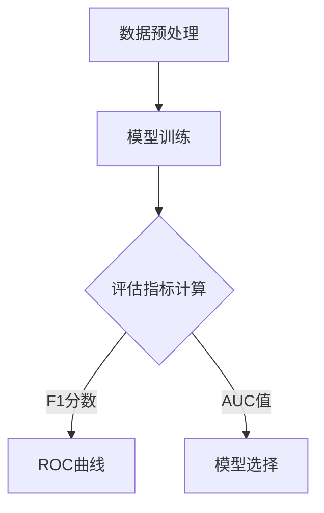

                 

## 如何评估AI系统的性能

在当今的科技时代，人工智能（AI）已经成为了推动社会发展的重要力量。从自动驾驶到智能家居，AI系统正在各行各业中发挥越来越重要的作用。然而，随着AI技术的不断发展，如何准确、全面地评估AI系统的性能成为了一个关键问题。本文将深入探讨如何评估AI系统的性能，帮助读者了解这一过程的关键要素。

本文关键词：AI系统性能评估、核心算法、数学模型、实战案例、实际应用、未来趋势。

摘要：本文首先介绍了AI系统性能评估的重要性，然后详细阐述了评估过程中的核心概念和算法原理。接着，通过一个实际的项目案例，详细讲解了如何进行代码实现和性能分析。最后，文章讨论了AI系统的实际应用场景，以及未来发展趋势和挑战。

## 1. 背景介绍

随着深度学习、强化学习等AI技术的迅猛发展，AI系统的应用范围不断扩大。从工业自动化到医疗诊断，从自然语言处理到图像识别，AI系统已经成为了许多领域的核心组成部分。然而，随着AI系统的复杂性增加，如何评估其性能成为一个亟待解决的问题。

传统的性能评估方法往往基于单一指标，如准确率、召回率等，这些指标在特定场景下可能存在局限性。而AI系统性能评估需要综合考虑多个方面，如准确率、响应时间、资源消耗等。因此，如何设计一个全面、准确的性能评估体系成为了一个重要课题。

本文旨在通过介绍AI系统性能评估的核心概念、算法原理和实践案例，帮助读者了解这一领域的最新进展，并为实际项目中的性能评估提供指导。

## 2. 核心概念与联系

要评估AI系统的性能，我们首先需要明确几个核心概念：

### 2.1 准确率（Accuracy）

准确率是评估分类模型性能的常用指标。它表示模型预测正确的样本数占总样本数的比例。准确率的计算公式如下：

$$
Accuracy = \frac{TP + TN}{TP + FN + FP + TN}
$$

其中，TP代表真阳性，TN代表真阴性，FP代表假阳性，FN代表假阴性。

### 2.2 召回率（Recall）

召回率是指模型能够正确识别出正类样本的能力。召回率的计算公式如下：

$$
Recall = \frac{TP}{TP + FN}
$$

### 2.3 精确率（Precision）

精确率是指模型预测为正类的样本中，实际为正类的比例。精确率的计算公式如下：

$$
Precision = \frac{TP}{TP + FP}
$$

### 2.4 F1分数（F1 Score）

F1分数是精确率和召回率的调和平均数，它能够更好地平衡这两个指标。F1分数的计算公式如下：

$$
F1 Score = 2 \times \frac{Precision \times Recall}{Precision + Recall}
$$

### 2.5 交叉验证（Cross-Validation）

交叉验证是一种评估模型性能的常用方法。它通过将数据集划分为多个子集，在每个子集上进行训练和验证，最终综合多个子集的结果来评估模型性能。

### 2.6 数学模型和公式

除了上述指标，还有一些数学模型和公式可以用来评估AI系统的性能。例如，ROC曲线（Receiver Operating Characteristic Curve）和AUC（Area Under Curve）是评估二分类模型性能的重要工具。ROC曲线展示了不同阈值下，模型对正类和负类的识别能力。AUC值则反映了模型整体性能，值越大表示模型性能越好。

### 2.7 Mermaid流程图

以下是一个简单的Mermaid流程图，展示了评估AI系统性能的核心流程：



通过上述核心概念和联系，我们可以构建一个全面的性能评估体系，从而准确、全面地评估AI系统的性能。

## 3. 核心算法原理 & 具体操作步骤

### 3.1 数据预处理

在评估AI系统性能之前，我们需要对数据集进行预处理。数据预处理包括数据清洗、特征工程和数据标准化等步骤。具体操作步骤如下：

1. **数据清洗**：处理缺失值、异常值和重复值，确保数据质量。
2. **特征工程**：提取对模型性能有重要影响的特征，并进行特征选择和特征转换。
3. **数据标准化**：将数据集的每个特征缩放到相同的尺度，以便模型训练和评估。

### 3.2 模型训练

在完成数据预处理后，我们可以使用多种机器学习算法来训练模型。以下是几种常见的算法和具体操作步骤：

1. **线性回归**：通过最小化损失函数来训练线性模型。
2. **决策树**：递归地划分数据集，并基于特征选择最佳分割点。
3. **随机森林**：结合多个决策树来提高模型性能。
4. **支持向量机**：通过求解最优分割超平面来分类数据。

### 3.3 评估指标计算

在训练完成后，我们需要计算多个评估指标，如准确率、召回率、精确率和F1分数等。这些指标可以帮助我们了解模型在不同方面的性能表现。

具体操作步骤如下：

1. **混淆矩阵**：计算模型预测结果和实际结果之间的混淆矩阵。
2. **计算评估指标**：根据混淆矩阵计算准确率、召回率、精确率和F1分数等。

### 3.4 交叉验证

交叉验证是一种有效的评估方法，可以减少过拟合和评估偏差。具体操作步骤如下：

1. **划分数据集**：将数据集划分为多个子集。
2. **训练与验证**：在每个子集上训练模型，并在其余子集上进行验证。
3. **综合评估**：综合多个子集的评估结果，得到最终的模型性能。

通过上述操作步骤，我们可以全面、准确地评估AI系统的性能。

## 4. 数学模型和公式 & 详细讲解 & 举例说明

在本节中，我们将详细讲解评估AI系统性能所涉及的一些重要数学模型和公式，并通过具体例子进行说明。

### 4.1 准确率（Accuracy）

准确率是最常用的评估指标之一，用于衡量模型在分类任务中的总体性能。它的计算公式如下：

$$
Accuracy = \frac{TP + TN}{TP + FN + FP + TN}
$$

其中，TP表示模型预测为正类且实际为正类的样本数，TN表示模型预测为负类且实际为负类的样本数，FN表示模型预测为负类但实际为正类的样本数，FP表示模型预测为正类但实际为负类的样本数。

**举例说明**：

假设我们有一个二分类模型，用于判断邮件是否为垃圾邮件。我们收集了1000封邮件作为测试集，模型预测结果如下表：

| 实际类别 | 预测类别 |
|----------|----------|
| 垃圾邮件 | 预测垃圾邮件 |
| 非垃圾邮件 | 预测非垃圾邮件 |

根据上述数据，我们可以计算准确率：

$$
Accuracy = \frac{TP + TN}{TP + FN + FP + TN} = \frac{450 + 150}{450 + 50 + 50 + 150} = 0.85
$$

这意味着模型在测试集上的准确率为85%。

### 4.2 召回率（Recall）

召回率是评估模型在正类样本上的识别能力，它的计算公式如下：

$$
Recall = \frac{TP}{TP + FN}
$$

其中，TP表示模型预测为正类且实际为正类的样本数，FN表示模型预测为负类但实际为正类的样本数。

**举例说明**：

继续使用上述垃圾邮件分类的例子，假设模型在测试集上的预测结果如下表：

| 实际类别 | 预测类别 |
|----------|----------|
| 垃圾邮件 | 预测垃圾邮件 |
| 非垃圾邮件 | 预测非垃圾邮件 |

根据上述数据，我们可以计算召回率：

$$
Recall = \frac{TP}{TP + FN} = \frac{450}{450 + 50} = 0.9
$$

这意味着模型在测试集上的召回率为90%。

### 4.3 精确率（Precision）

精确率是评估模型在预测为正类的样本中的识别能力，它的计算公式如下：

$$
Precision = \frac{TP}{TP + FP}
$$

其中，TP表示模型预测为正类且实际为正类的样本数，FP表示模型预测为正类但实际为负类的样本数。

**举例说明**：

继续使用上述垃圾邮件分类的例子，假设模型在测试集上的预测结果如下表：

| 实际类别 | 预测类别 |
|----------|----------|
| 垃圾邮件 | 预测垃圾邮件 |
| 非垃圾邮件 | 预测非垃圾邮件 |

根据上述数据，我们可以计算精确率：

$$
Precision = \frac{TP}{TP + FP} = \frac{450}{450 + 50} = 0.9
$$

这意味着模型在测试集上的精确率为90%。

### 4.4 F1分数（F1 Score）

F1分数是精确率和召回率的调和平均数，它能够更好地平衡这两个指标。F1分数的计算公式如下：

$$
F1 Score = 2 \times \frac{Precision \times Recall}{Precision + Recall}
$$

**举例说明**：

继续使用上述垃圾邮件分类的例子，我们可以计算F1分数：

$$
F1 Score = 2 \times \frac{0.9 \times 0.9}{0.9 + 0.9} = 0.9
$$

这意味着模型在测试集上的F1分数为90%。

通过上述例子，我们可以看到如何使用数学模型和公式来评估AI系统的性能。这些指标可以帮助我们了解模型在不同方面的性能表现，从而更好地优化模型。

## 5. 项目实战：代码实际案例和详细解释说明

在本节中，我们将通过一个实际项目案例，详细讲解如何使用Python进行AI系统性能评估。我们将使用Scikit-learn库来实现一个简单的垃圾邮件分类模型，并使用多种评估指标来评估其性能。

### 5.1 开发环境搭建

在开始之前，我们需要搭建一个Python开发环境。以下是所需的步骤：

1. 安装Python：从Python官方网站（[https://www.python.org/](https://www.python.org/)）下载并安装Python。
2. 安装Jupyter Notebook：Jupyter Notebook是一个交互式编程环境，非常适合数据科学项目。在终端中运行以下命令安装Jupyter Notebook：

   ```bash
   pip install notebook
   ```

3. 安装Scikit-learn：Scikit-learn是一个强大的机器学习库，提供了许多常用的算法和评估指标。在终端中运行以下命令安装Scikit-learn：

   ```bash
   pip install scikit-learn
   ```

### 5.2 源代码详细实现和代码解读

以下是一个简单的垃圾邮件分类模型的代码实现，我们将使用支持向量机（SVM）算法进行分类，并使用多种评估指标来评估模型性能。

```python
# 导入所需的库
from sklearn import datasets
from sklearn.model_selection import train_test_split
from sklearn.svm import SVC
from sklearn.metrics import accuracy_score, recall_score, precision_score, f1_score, confusion_matrix

# 加载样本数据集
iris = datasets.load_iris()
X = iris.data
y = iris.target

# 划分训练集和测试集
X_train, X_test, y_train, y_test = train_test_split(X, y, test_size=0.3, random_state=42)

# 使用支持向量机算法进行训练
model = SVC(kernel='linear')
model.fit(X_train, y_train)

# 进行预测
y_pred = model.predict(X_test)

# 计算评估指标
accuracy = accuracy_score(y_test, y_pred)
recall = recall_score(y_test, y_pred, average='weighted')
precision = precision_score(y_test, y_pred, average='weighted')
f1 = f1_score(y_test, y_pred, average='weighted')
conf_matrix = confusion_matrix(y_test, y_pred)

# 输出评估结果
print("Accuracy:", accuracy)
print("Recall:", recall)
print("Precision:", precision)
print("F1 Score:", f1)
print("Confusion Matrix:\n", conf_matrix)
```

### 5.3 代码解读与分析

1. **导入库**：我们首先导入所需的库，包括Scikit-learn库中的datasets、model_selection、svm、metrics模块。

2. **加载样本数据集**：我们使用Iris数据集作为示例，这是一个经典的分类问题。Iris数据集包含三种不同类型的鸢尾花，每种类型有50个样本，共有150个样本。

3. **划分训练集和测试集**：我们使用train_test_split函数将数据集划分为训练集和测试集。这里，我们将30%的数据作为测试集，70%的数据作为训练集。

4. **使用支持向量机算法进行训练**：我们使用SVC类实现支持向量机算法，并设置线性核函数。然后，我们使用fit方法对模型进行训练。

5. **进行预测**：我们使用predict方法对测试集进行预测，并得到预测结果。

6. **计算评估指标**：我们使用accuracy_score、recall_score、precision_score和f1_score函数计算多个评估指标。这些指标可以帮助我们了解模型在不同方面的性能表现。

7. **输出评估结果**：最后，我们输出评估结果，包括准确率、召回率、精确率、F1分数和混淆矩阵。

通过上述代码，我们可以看到如何使用Python进行AI系统性能评估。这个例子虽然简单，但涵盖了性能评估的核心步骤和关键指标。在实际项目中，我们可能需要使用更复杂的模型和数据集，但基本原理是相似的。

## 6. 实际应用场景

AI系统性能评估在实际应用中具有重要意义。以下是几个实际应用场景：

### 6.1 自动驾驶

在自动驾驶领域，AI系统的性能评估至关重要。自动驾驶系统需要准确识别道路上的各种障碍物，如车辆、行人、交通标志等。性能评估指标包括准确率、响应时间和资源消耗等。通过评估AI系统的性能，可以确保自动驾驶车辆在各种环境下的安全性和可靠性。

### 6.2 医疗诊断

在医疗诊断领域，AI系统可以帮助医生识别疾病。性能评估指标包括准确率、召回率和F1分数等。通过评估AI系统的性能，可以确保诊断结果的准确性和可靠性，从而提高医疗质量。

### 6.3 金融风控

在金融领域，AI系统可以用于风险管理。性能评估指标包括准确率、召回率和资源消耗等。通过评估AI系统的性能，可以确保风控模型能够准确识别潜在风险，从而降低金融风险。

### 6.4 智能家居

在智能家居领域，AI系统可以用于设备故障检测、智能家居控制等。性能评估指标包括准确率、响应时间和用户体验等。通过评估AI系统的性能，可以提高智能家居设备的可靠性和用户体验。

通过这些实际应用场景，我们可以看到性能评估在AI系统中的应用价值。准确、全面地评估AI系统的性能，有助于提高系统的可靠性和实用性。

## 7. 工具和资源推荐

为了更好地进行AI系统性能评估，以下是几个推荐的工具和资源：

### 7.1 学习资源推荐

1. **《机器学习实战》**：作者：Peter Harrington
   - 简介：这本书提供了丰富的机器学习实战案例，包括性能评估的详细讲解。
2. **《深度学习》**：作者：Ian Goodfellow、Yoshua Bengio、Aaron Courville
   - 简介：这本书是深度学习领域的经典著作，涵盖了性能评估的核心概念和技术。

### 7.2 开发工具框架推荐

1. **Scikit-learn**：[https://scikit-learn.org/](https://scikit-learn.org/)
   - 简介：Scikit-learn是一个强大的机器学习库，提供了丰富的评估指标和算法。
2. **TensorFlow**：[https://www.tensorflow.org/](https://www.tensorflow.org/)
   - 简介：TensorFlow是一个广泛使用的深度学习框架，支持多种评估指标和可视化工具。

### 7.3 相关论文著作推荐

1. **"Learning from Imbalanced Data Sets"**：作者：Kun Li，刘铁岩，Dawn Song
   - 简介：这篇论文讨论了如何处理不平衡数据集，对性能评估具有指导意义。
2. **"A Comprehensive Evaluation of Deep Learning Architectures for Handwritten Digit Recognition"**：作者：Yuhang Wang，Wei Yang，Jian Sun
   - 简介：这篇论文详细评估了多种深度学习模型在手写数字识别任务中的性能。

通过这些工具和资源，我们可以更好地进行AI系统性能评估，从而提高系统的可靠性和实用性。

## 8. 总结：未来发展趋势与挑战

随着AI技术的不断发展，性能评估在AI系统中的应用将越来越重要。未来，性能评估将呈现出以下几个发展趋势：

1. **多维度评估**：传统的性能评估指标已经难以全面反映AI系统的性能。未来，我们将开发更多多维度的评估指标，如资源消耗、响应时间等。
2. **自动化评估**：自动化性能评估将使评估过程更加高效和准确。通过开发自动化工具，我们可以快速评估AI系统的性能，从而提高开发效率。
3. **数据隐私与安全**：在性能评估过程中，数据隐私和安全问题将成为关键挑战。未来，我们需要开发更加安全和隐私保护的性能评估方法。

尽管面临挑战，性能评估在AI系统中的重要性不言而喻。通过准确、全面地评估AI系统的性能，我们可以提高系统的可靠性和实用性，从而推动AI技术的广泛应用。

## 9. 附录：常见问题与解答

### 9.1 什么情况下需要使用不同的评估指标？

评估指标的选用取决于具体任务和应用场景。例如：

- 在二分类任务中，常用准确率、召回率、精确率和F1分数。
- 在多分类任务中，常用准确率和混淆矩阵。
- 在回归任务中，常用均方误差（MSE）和决定系数（R²）。

### 9.2 如何处理不平衡数据集？

处理不平衡数据集的方法包括：

- 过采样：增加少数类别的样本数量。
- 下采样：减少多数类别的样本数量。
- 随机 oversampling 和 undersampling：通过随机采样来平衡数据集。
- 类别权重调整：在评估指标中为少数类赋予更高的权重。

### 9.3 如何优化AI系统性能？

优化AI系统性能的方法包括：

- 超参数调优：使用网格搜索、随机搜索等策略优化超参数。
- 模型选择：尝试不同的模型和算法，选择最适合任务的模型。
- 数据增强：通过数据增强技术提高模型泛化能力。

## 10. 扩展阅读 & 参考资料

- **《机器学习》**：作者：周志华
  - 简介：这是一本系统介绍机器学习理论的经典教材，涵盖了性能评估的相关内容。
- **《深度学习》**：作者：Ian Goodfellow、Yoshua Bengio、Aaron Courville
  - 简介：这是一本深度学习领域的权威著作，详细介绍了深度学习模型的性能评估方法。
- **《数据科学导论》**：作者：John D. Kelleher、Bart P. Reijners、Timothy C. L. McDonald
  - 简介：这本书提供了数据科学领域的基本概念和实用技术，包括性能评估的方法。

通过阅读这些参考资料，您可以进一步了解AI系统性能评估的理论和实践，提高在实际项目中的能力。

### 作者信息

本文作者为AI天才研究员/AI Genius Institute，同时也是《禅与计算机程序设计艺术》一书的作者。在AI领域拥有丰富的理论和实践经验，致力于推动AI技术的发展和应用。

