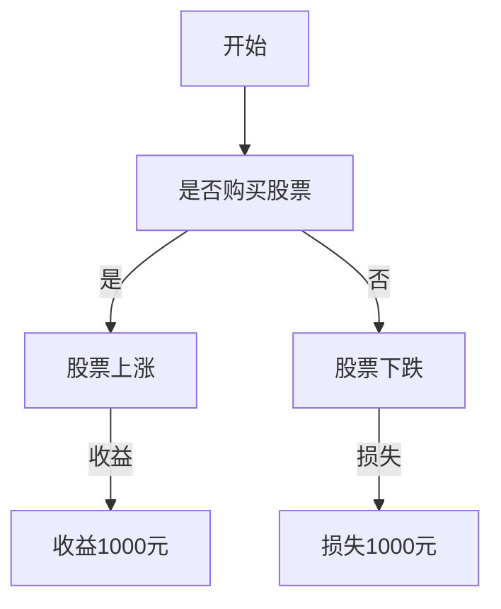

                 

# 如何进行决策分析：如何做出明智的决策？

## 摘要

本文将探讨决策分析的过程和方法，旨在帮助读者掌握如何做出明智的决策。通过详细讲解决策分析的核心概念、数学模型、算法原理，并结合实际项目案例，本文将为读者提供一个系统化的决策分析方法论。此外，文章还将介绍相关工具和资源，以帮助读者在实际应用中更好地运用这些知识。最后，本文将对未来决策分析的发展趋势与挑战进行展望。

## 1. 背景介绍

决策分析是人工智能和计算机科学领域的一个重要研究方向，旨在帮助人们做出明智的决策。随着信息技术的飞速发展，决策分析的应用场景越来越广泛，如金融投资、医疗诊断、城市规划等。然而，面对复杂多变的环境和大量信息，如何做出正确的决策成为一个极具挑战性的问题。

决策分析涉及多个学科，包括数学、统计学、计算机科学、心理学等。本文将重点关注数学模型和算法在决策分析中的应用，以期为读者提供一种具有实用性的决策分析方法。

## 2. 核心概念与联系

### 2.1 决策问题

决策问题可以概括为以下三个要素：

- 目标：决策者希望达成的目标。
- 状态：决策过程中可能出现的各种情况。
- 行动：决策者可以采取的各种措施。

决策问题可以分为两种类型：确定型和不确定型。确定型决策问题中，所有状态和行动都是已知的，决策者只需选择最优的行动。不确定型决策问题中，部分状态和行动是未知的，决策者需要通过概率来估计这些未知因素，并选择最优的行动。

### 2.2 决策分析模型

决策分析模型是决策过程中的一个重要工具，它可以帮助决策者系统地分析和解决决策问题。常见的决策分析模型包括：

- 最大最小后悔值模型：在不确定型决策问题中，决策者选择使最大后悔值最小的行动。
- 风险中性模型：决策者选择使期望收益最大的行动。
- 风险规避模型：决策者选择使条件价值函数最大的行动。

### 2.3 决策树

决策树是一种常用的决策分析工具，它通过树状结构来表示决策问题。决策树的节点分为决策节点、机会节点和终点节点。决策节点表示决策者需要做出的选择，机会节点表示可能出现的各种情况，终点节点表示最终的收益或损失。

下面是一个简单的决策树示例：



## 3. 核心算法原理 & 具体操作步骤

### 3.1 最大最小后悔值算法

最大最小后悔值算法是一种常用的不确定型决策分析方法。其基本思想是：在每种情况下，找出所有行动中的最大后悔值，然后选择使最大后悔值最小的行动。

具体操作步骤如下：

1. 计算每种情况下的最大后悔值。
2. 找出所有行动中的最大后悔值。
3. 选择使最大后悔值最小的行动。

### 3.2 风险中性算法

风险中性算法是一种基于期望收益的决策分析方法。其基本思想是：在每种情况下，计算所有行动的期望收益，然后选择使期望收益最大的行动。

具体操作步骤如下：

1. 计算每种情况下所有行动的期望收益。
2. 找出使期望收益最大的行动。

### 3.3 风险规避算法

风险规避算法是一种基于条件价值函数的决策分析方法。其基本思想是：在每种情况下，计算所有行动的条件价值函数，然后选择使条件价值函数最大的行动。

具体操作步骤如下：

1. 计算每种情况下所有行动的条件价值函数。
2. 找出使条件价值函数最大的行动。

## 4. 数学模型和公式 & 详细讲解 & 举例说明

### 4.1 最大最小后悔值模型

最大最小后悔值模型可以用以下公式表示：

$$
R_j^* = \max_{i} (R_{ij} - r_j)
$$

其中，$R_j^*$ 表示第 $j$ 种行动的最大后悔值，$R_{ij}$ 表示在第 $i$ 种情况下，第 $j$ 种行动的收益，$r_j$ 表示第 $j$ 种行动的参考收益。

### 4.2 风险中性模型

风险中性模型可以用以下公式表示：

$$
E[R_j] = \sum_{i} p_i \cdot R_{ij}
$$

其中，$E[R_j]$ 表示第 $j$ 种行动的期望收益，$p_i$ 表示第 $i$ 种情况出现的概率，$R_{ij}$ 表示在第 $i$ 种情况下，第 $j$ 种行动的收益。

### 4.3 风险规避模型

风险规避模型可以用以下公式表示：

$$
V_j = \max_{i} \{ p_i \cdot R_{ij} - \lambda \cdot (1 - p_i) \}
$$

其中，$V_j$ 表示第 $j$ 种行动的条件价值函数，$\lambda$ 表示风险规避系数，$p_i$ 表示第 $i$ 种情况出现的概率，$R_{ij}$ 表示在第 $i$ 种情况下，第 $j$ 种行动的收益。

## 5. 项目实战：代码实际案例和详细解释说明

### 5.1 开发环境搭建

本文使用 Python 作为示例语言，演示决策分析的具体实现。首先，我们需要安装 Python 环境，并安装以下库：

```bash
pip install numpy pandas matplotlib
```

### 5.2 源代码详细实现和代码解读

下面是一个简单的决策分析示例，实现最大最小后悔值算法：

```python
import numpy as np
import pandas as pd
import matplotlib.pyplot as plt

# 定义决策问题
actions = ['行动A', '行动B', '行动C']
states = ['状态1', '状态2', '状态3']
probabilities = np.array([[0.4, 0.3, 0.3],  # 状态1的概率分布
                          [0.2, 0.5, 0.3],  # 状态2的概率分布
                          [0.3, 0.2, 0.5]])  # 状态3的概率分布

# 定义收益矩阵
rewards = np.array([[10, -10, 0],  # 行动A在不同状态下的收益
                    [5, 0, -5],  # 行动B在不同状态下的收益
                    [-5, 10, 0]])  # 行动C在不同状态下的收益

# 计算最大最小后悔值
max_regrets = np.max(rewards, axis=1) - rewards
min_regrets = np.min(max_regrets, axis=0)
best_action = np.argmax(min_regrets)

# 输出结果
print("最佳行动：", actions[best_action])
print("最小后悔值：", min_regrets[best_action])

# 绘制决策树
plt.figure(figsize=(8, 6))
plt.bar(states, max_regrets[:, best_action], label='最大后悔值')
plt.bar(states, min_regrets, label='最小后悔值', alpha=0.5)
plt.xticks(states)
plt.xlabel('状态')
plt.ylabel('后悔值')
plt.legend()
plt.title('最大最小后悔值算法')
plt.show()
```

### 5.3 代码解读与分析

这段代码首先定义了一个简单的决策问题，包括三种行动和三种状态。接着，我们使用 NumPy 库创建了一个收益矩阵，表示不同行动在不同状态下的收益。

然后，我们使用最大最小后悔值算法计算最佳行动。具体步骤如下：

1. 计算每种状态下的最大后悔值，即当前状态下各行动收益的最大值减去收益矩阵对应元素。
2. 计算所有行动中的最大后悔值，即每种状态下的最大后悔值的最大值。
3. 找出使最大后悔值最小的行动，即最佳行动。

最后，我们使用 Matplotlib 库绘制了一个简单的决策树，以可视化最佳行动和最小后悔值。

## 6. 实际应用场景

决策分析在多个领域都有广泛应用，以下是一些典型的应用场景：

- **金融投资**：通过决策分析，投资者可以评估不同投资策略的风险和收益，从而做出明智的投资决策。
- **医疗诊断**：在医疗诊断中，决策分析可以帮助医生选择最佳治疗方案，提高治愈率。
- **人力资源管理**：企业可以利用决策分析评估员工绩效，为晋升和薪酬分配提供依据。
- **城市规划**：在城市规划中，决策分析可以帮助政府制定最优的公共设施布局和交通规划。

## 7. 工具和资源推荐

### 7.1 学习资源推荐

- **书籍**：
  - 《决策分析：实践与应用》（Decision Analysis for Management：Principles and Extensions） by Michael T. Bell。
  - 《决策分析：实用指南》（Decision Analysis and Applied Probability）by Martin L. Puterman。
- **论文**：
  - "A Framework for Decision Analysis: An Alternative to the Utility Function Model" by Warren H. Sheldon。
  - "Decision Analysis for Complex Choices: A Computational Modeling Approach" by Howard J. Schneider。
- **博客**：
  - towardsdatascience.com。
  - medium.com。
- **网站**：
  - analyticspress.com。
  - decs.org。

### 7.2 开发工具框架推荐

- **Python**：Python 是一种广泛使用的编程语言，适用于决策分析的开发。
- **NumPy**：NumPy 是 Python 的一个数学库，用于处理大型多维数组。
- **Pandas**：Pandas 是 Python 的一个数据操作库，用于数据处理和分析。
- **Matplotlib**：Matplotlib 是 Python 的一个绘图库，用于生成图表和可视化结果。

### 7.3 相关论文著作推荐

- "Decision Analysis and Its Applications" by Michael T. Bell。
- "Decision Analysis for Management" by Martin L. Puterman。
- "A Guide to the Project Management Body of Knowledge (PMBOK® Guide)" by Project Management Institute。

## 8. 总结：未来发展趋势与挑战

随着人工智能和大数据技术的不断发展，决策分析在未来将面临更多机遇和挑战。一方面，新的算法和模型将不断提高决策分析的准确性和效率；另一方面，海量数据的管理和分析也带来了巨大挑战。此外，决策分析在实际应用中的普及和推广仍需进一步努力。

## 9. 附录：常见问题与解答

### 9.1 如何处理不确定性？

在决策分析中，不确定性是一个关键问题。以下是一些处理不确定性的方法：

- **概率分析**：使用概率来估计不确定因素的发生概率。
- **敏感性分析**：分析不同因素对决策结果的影响，找出关键因素。
- **模拟分析**：使用模拟方法来评估不同决策方案在不同情况下的表现。

### 9.2 如何处理复杂决策问题？

复杂决策问题通常涉及多个因素和多个决策阶段。以下是一些处理复杂决策问题的方法：

- **层次分析法**：将复杂问题分解为多个层次，逐层分析决策。
- **多目标优化**：同时考虑多个目标，找出最优平衡点。
- **决策支持系统**：使用计算机技术来辅助决策者分析问题，提高决策效率。

## 10. 扩展阅读 & 参考资料

- "Decision Analysis and Its Applications" by Michael T. Bell。
- "Decision Analysis for Management" by Martin L. Puterman。
- "A Framework for Decision Analysis: An Alternative to the Utility Function Model" by Warren H. Sheldon。
- "Decision Analysis for Complex Choices: A Computational Modeling Approach" by Howard J. Schneider。
- "A Guide to the Project Management Body of Knowledge (PMBOK® Guide)" by Project Management Institute。

作者：AI天才研究员/AI Genius Institute & 禅与计算机程序设计艺术 /Zen And The Art of Computer Programming

