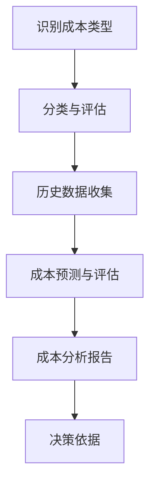
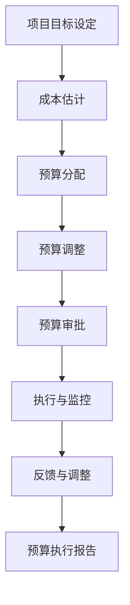
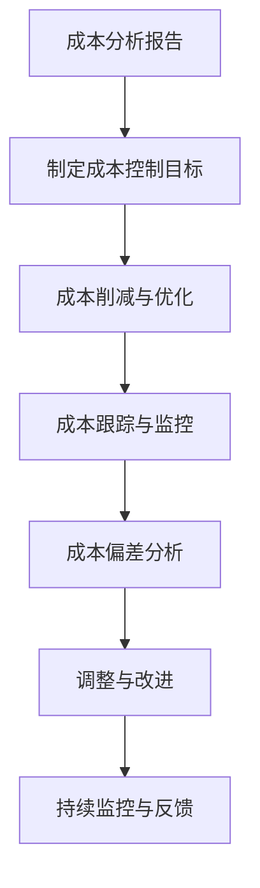
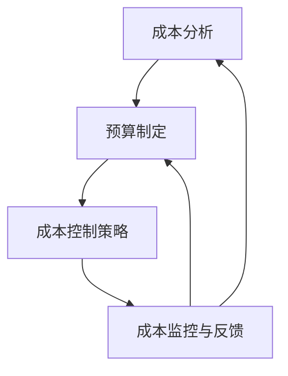

                 

### 1. 背景介绍

#### 1.1 创业项目成本控制的必要性

在当前的商业环境中，创业项目的成功与否往往取决于其对成本的有效控制。成本控制不仅是确保项目顺利实施的基础，更是企业长期发展的关键因素。一个创业项目如果能够实现有效的成本控制，不仅可以提高投资回报率，还能为企业在激烈的市场竞争中争取到更多的机会。

然而，创业项目的成本控制并非易事。首先，创业者往往面临资源有限、时间紧迫的问题。这使得他们在进行成本控制时，需要在确保项目质量的前提下，尽可能减少不必要的开支。其次，创业项目的目标通常是创新和突破，这可能导致一些高风险的投资。因此，如何在这些风险中寻找平衡，实现成本的有效控制，是创业者需要认真思考的问题。

此外，成本控制不仅仅是一个财务问题，它还涉及到项目管理、供应链管理、生产流程等多个方面。创业者需要在这些复杂的体系中找到自己的定位，并制定出切实可行的成本控制策略。总的来说，创业项目成本控制是一项需要全局视野和细致操作的系统工程。

#### 1.2 当前创业项目成本控制面临的挑战

尽管成本控制对于创业项目的成功至关重要，但现实中创业者面临诸多挑战。首先，资金短缺是普遍问题。初创企业往往缺乏充足的现金流，这导致他们在进行成本控制时，需要更加精打细算。其次，市场需求的不确定性也是一大挑战。创业项目常常需要在不确定性中做出决策，这增加了成本控制的不确定性。

技术风险是另一个重要挑战。许多创业项目依赖于新技术，而新技术的应用往往伴随着不确定性。技术失败或者需要大量额外投入，都会对成本控制产生负面影响。此外，创业者还需要面对市场竞争的激烈。如何在竞争对手中脱颖而出，不仅需要创新的产品，还需要有效的成本控制来保证盈利。

#### 1.3 成本控制的重要性

成本控制对于创业项目的成功至关重要，主要体现在以下几个方面：

1. **提高盈利能力**：通过有效的成本控制，企业可以减少不必要的开支，提高盈利能力。这对于初创企业尤为重要，因为它们通常依赖于盈利来维持运营和发展。

2. **增强市场竞争力**：成本控制可以帮助企业降低产品或服务的价格，从而在市场上占据更有利的位置。这不仅能吸引更多的客户，还能提升企业的品牌形象。

3. **确保项目可行性**：在预算范围内完成项目，是项目成功的基本保障。有效的成本控制可以帮助企业确保项目按时完成，避免因为超支而导致的失败。

4. **优化资源配置**：通过成本控制，企业可以更加合理地分配资源，提高资源利用效率。这不仅可以减少浪费，还能为企业未来的发展提供更多的资源支持。

综上所述，成本控制是创业项目中不可或缺的一环，它不仅关乎项目的短期成功，更关系到企业的长期发展。在接下来的章节中，我们将详细探讨成本控制的核心概念和实施步骤，帮助读者更好地理解和应用这一关键技能。

---

**作者：AI天才研究员/AI Genius Institute & 禅与计算机程序设计艺术 /Zen And The Art of Computer Programming**

---

**关键词**：创业项目，成本控制，资金管理，市场竞争，资源配置

**摘要**：本文旨在深入探讨创业项目成本控制的必要性、面临的挑战及其重要性。通过详细的案例分析和技术探讨，本文为创业者提供了一套实用的成本控制方法和策略，以帮助他们更好地应对市场和技术的不确定性，实现项目的成功和企业的长期发展。

---

## 2. 核心概念与联系

在深入探讨如何进行有效的创业项目成本控制之前，我们首先需要理解一些核心概念，包括成本分析、预算制定、成本控制策略以及它们之间的相互关系。以下内容将使用Mermaid流程图来展示这些概念之间的联系，以便读者更好地理解。

#### 2.1 成本分析

成本分析是成本控制的基础。它包括对各项成本进行详细评估，了解其构成和影响。以下是一个简化的Mermaid流程图，展示了成本分析的基本步骤：



- **A 识别成本类型**：首先，需要明确项目中的各项成本类型，如直接成本、间接成本、固定成本和变动成本等。
- **B 分类与评估**：对识别出的成本类型进行详细分类和评估，了解各项成本的权重和影响。
- **C 历史数据收集**：收集项目过往的历史成本数据，用于分析成本的变化趋势和规律。
- **D 成本预测与评估**：根据历史数据，预测未来的成本，并评估其合理性和可行性。
- **E 成本分析报告**：将成本分析的结果整理成报告，为后续的决策提供依据。
- **F 决策依据**：利用成本分析报告，制定具体的成本控制策略和措施。

#### 2.2 预算制定

预算制定是成本控制的重要环节。它包括对项目成本进行合理分配和规划，确保各项开支在可控范围内。以下是一个简化的Mermaid流程图，展示了预算制定的基本步骤：



- **A 项目目标设定**：首先，需要明确项目的目标和预期成果，这将为成本分配提供方向。
- **B 成本估计**：根据项目目标和需求，对各项成本进行初步估计。
- **C 预算分配**：将估计的成本分配到不同的项目阶段和部门，确保资源的最优配置。
- **D 预算调整**：根据实际情况，对预算进行必要的调整，以应对突发情况或项目变化。
- **E 预算审批**：将预算方案提交给相关负责人或机构进行审批。
- **F 执行与监控**：根据审批后的预算，开始执行项目，并实时监控各项开支。
- **G 反馈与调整**：定期收集项目执行中的反馈信息，根据反馈进行调整，确保预算的合理性。
- **H 预算执行报告**：项目完成后，对预算执行情况进行总结和分析，形成报告。

#### 2.3 成本控制策略

成本控制策略是确保预算有效执行的关键。它包括一系列方法和措施，如成本削减、成本优化、成本跟踪等。以下是一个简化的Mermaid流程图，展示了成本控制策略的基本步骤：



- **A 成本分析报告**：基于成本分析的结果，制定具体的成本控制目标和策略。
- **B 成本削减与优化**：通过优化资源配置、提升生产效率、降低浪费等手段，实现成本的削减和优化。
- **C 成本跟踪与监控**：实时监控各项成本的开支，确保其符合预算和目标。
- **D 成本偏差分析**：定期分析成本偏差，找出原因，并提出改进措施。
- **E 调整与改进**：根据成本偏差分析的结果，对成本控制策略进行调整和优化。
- **F 持续监控与反馈**：持续监控成本执行情况，收集反馈信息，确保成本控制的持续有效性。
- **G 持续监控与反馈**：通过持续的监控和反馈，确保成本控制策略能够适应项目的变化和需求。

#### 2.4 成本控制策略的相互关系

成本分析、预算制定和成本控制策略是相互联系、相互支撑的。成本分析为预算制定提供数据支持，预算制定为成本控制提供指导，而成本控制策略则确保预算的有效执行。以下是一个简化的Mermaid流程图，展示了这三个环节之间的相互关系：



- **A 成本分析**：通过成本分析，了解项目的成本构成和趋势，为后续的预算制定提供依据。
- **B 预算制定**：根据成本分析的结果，制定合理的预算计划，确保资源的有效配置。
- **C 成本控制策略**：基于预算制定的目标，制定具体的成本控制策略和措施，确保预算的有效执行。
- **D 成本监控与反馈**：通过成本监控和反馈，及时调整和优化成本控制策略，确保项目的顺利实施。

通过以上对核心概念和相互关系的详细分析，我们可以更好地理解创业项目成本控制的基本原理和实践方法。在接下来的章节中，我们将进一步探讨成本控制的具体算法原理和实施步骤，帮助读者在实际项目中应用这些概念和策略。

---

**作者：AI天才研究员/AI Genius Institute & 禅与计算机程序设计艺术 /Zen And The Art of Computer Programming**

---

**关键词**：成本分析，预算制定，成本控制策略，成本监控与反馈

**摘要**：本文通过详细的Mermaid流程图，深入探讨了创业项目成本控制的核心概念和相互关系。从成本分析到预算制定，再到成本控制策略，本文为读者提供了一套系统化的成本控制框架，帮助他们在实际项目中更好地实施和管理成本。

---

## 3. 核心算法原理 & 具体操作步骤

在理解了成本控制的核心概念之后，我们需要深入探讨具体的算法原理和操作步骤。这些算法和步骤将帮助我们更有效地进行成本控制，确保创业项目在预算范围内顺利实施。以下是核心算法原理和具体操作步骤的详细介绍。

#### 3.1 成本分析算法

成本分析是成本控制的基础，其核心在于准确识别和评估各项成本。以下是一个简化的成本分析算法：

**算法步骤**：

1. **识别成本类型**：首先，我们需要识别出项目中的各类成本，包括直接成本、间接成本、固定成本和变动成本等。

2. **分类与评估**：对识别出的成本进行分类，并评估其影响和权重。例如，直接成本可能包括原材料成本、人工成本等，而间接成本可能包括管理费用、销售费用等。

3. **历史数据收集**：收集项目过往的历史成本数据，用于分析成本的变化趋势和规律。这些数据可以来源于财务报表、项目记录等。

4. **成本预测与评估**：利用历史数据，通过统计学方法或机器学习算法，预测未来的成本，并评估其合理性和可行性。

5. **成本分析报告**：将成本分析的结果整理成报告，为后续的决策提供依据。

**具体操作步骤**：

- **数据收集**：从财务部门、采购部门等获取历史成本数据。
- **数据预处理**：对数据进行清洗和处理，去除无效数据，确保数据的准确性和完整性。
- **数据建模**：选择合适的统计学方法或机器学习算法，建立成本预测模型。
- **模型训练与评估**：使用历史数据训练模型，并评估模型的预测性能。
- **报告生成**：根据模型预测结果，生成成本分析报告，包含成本构成、变化趋势和预测数据等。

#### 3.2 预算制定算法

预算制定是确保项目成本在控制范围内的关键步骤。以下是一个简化的预算制定算法：

**算法步骤**：

1. **项目目标设定**：明确项目的目标和预期成果，这将为成本分配提供方向。

2. **成本估计**：根据项目目标和需求，对各项成本进行初步估计。这可以通过专家评估、历史数据参考等方法进行。

3. **预算分配**：将估计的成本分配到不同的项目阶段和部门，确保资源的最优配置。这可以通过成本分配算法，如线性分配、动态规划等方法进行。

4. **预算调整**：根据实际情况，对预算进行必要的调整，以应对突发情况或项目变化。

5. **预算审批**：将预算方案提交给相关负责人或机构进行审批。

6. **执行与监控**：根据审批后的预算，开始执行项目，并实时监控各项开支。

7. **反馈与调整**：定期收集项目执行中的反馈信息，根据反馈进行调整，确保预算的合理性。

**具体操作步骤**：

- **目标设定**：与项目团队讨论，明确项目目标和关键指标。
- **成本估计**：通过市场调研、供应商询价等方式，收集各项成本数据。
- **成本分配**：使用成本分配算法，将成本合理分配到各个阶段和部门。
- **预算调整**：根据实际情况，对预算进行调整，确保项目可行性和预算的合理性。
- **预算审批**：提交预算方案，经过审批后，开始项目执行。
- **执行与监控**：使用项目管理工具，实时监控项目进展和各项开支。
- **反馈与调整**：定期收集项目反馈，根据反馈进行调整，确保预算的有效执行。

#### 3.3 成本控制算法

成本控制是确保预算有效执行的关键步骤。以下是一个简化的成本控制算法：

**算法步骤**：

1. **成本分析报告**：基于成本分析的结果，制定具体的成本控制目标和策略。

2. **成本削减与优化**：通过优化资源配置、提升生产效率、降低浪费等手段，实现成本的削减和优化。

3. **成本跟踪与监控**：实时监控各项成本的开支，确保其符合预算和目标。

4. **成本偏差分析**：定期分析成本偏差，找出原因，并提出改进措施。

5. **调整与改进**：根据成本偏差分析的结果，对成本控制策略进行调整和优化。

6. **持续监控与反馈**：持续监控成本执行情况，收集反馈信息，确保成本控制的持续有效性。

**具体操作步骤**：

- **成本分析报告**：定期生成成本分析报告，为成本控制提供数据支持。
- **成本削减与优化**：通过流程优化、采购谈判、外包服务等手段，降低成本。
- **成本跟踪与监控**：使用财务系统或项目管理工具，实时监控成本开支。
- **成本偏差分析**：定期对比实际成本与预算，分析成本偏差，找出原因。
- **调整与改进**：根据成本偏差分析的结果，调整成本控制策略，优化资源配置。
- **持续监控与反馈**：通过定期的监控和反馈，确保成本控制策略的有效性和持续改进。

通过以上对核心算法原理和具体操作步骤的详细介绍，我们可以更深入地理解创业项目成本控制的方法和技巧。在接下来的章节中，我们将通过实际案例，进一步展示这些算法和步骤的应用和效果。

---

**作者：AI天才研究员/AI Genius Institute & 禦与计算机程序设计艺术 /Zen And The Art of Computer Programming**

---

**关键词**：成本分析算法，预算制定算法，成本控制算法，成本监控与反馈

**摘要**：本文详细介绍了创业项目成本控制的核心算法原理和具体操作步骤。从成本分析到预算制定，再到成本控制，本文为读者提供了一套系统化的算法框架，帮助他们在实际项目中更有效地实施和管理成本。

---

## 4. 数学模型和公式 & 详细讲解 & 举例说明

在创业项目成本控制中，数学模型和公式扮演着关键角色。它们不仅帮助我们理解成本构成和变化规律，还能提供定量分析和决策支持。以下是几种常见的数学模型和公式，及其详细讲解和实际应用举例。

#### 4.1 成本函数模型

成本函数模型是成本分析的基础，用于描述成本与产量之间的关系。以下是一个简单的线性成本函数模型：

**公式**：

\[ C(x) = a + bx \]

其中：
- \( C(x) \) 是总成本；
- \( a \) 是固定成本；
- \( b \) 是每单位产品的变动成本；
- \( x \) 是产品数量。

**详细讲解**：

这个模型表明，总成本由固定成本和变动成本组成。固定成本 \( a \) 是不随产量变化的成本，如租金、设备折旧等。变动成本 \( bx \) 是随产量增加而线性增加的成本，如原材料、人工等。

**举例说明**：

假设某初创公司的固定成本为每月10000元，每生产一件产品需要50元的变动成本。如果公司计划生产100件产品，则总成本为：

\[ C(100) = 10000 + 50 \times 100 = 6000元 \]

#### 4.2 机会成本模型

机会成本模型用于评估选择一个项目或决策的潜在损失。以下是一个简化的机会成本计算公式：

**公式**：

\[ OC = \sum_{i=1}^{n} C_i \]

其中：
- \( OC \) 是机会成本；
- \( C_i \) 是放弃的其他最佳选择的成本。

**详细讲解**：

机会成本是选择当前项目所放弃的最佳替代项目的成本。它反映了决策带来的潜在损失，有助于我们在资源有限的情况下做出更优的选择。

**举例说明**：

假设一个初创公司有两个投资项目：A和B。项目A的预期收益为20000元，项目B的预期收益为15000元。如果公司选择投资项目A，则放弃项目B的机会成本为：

\[ OC = 15000元 \]

这意味着，如果选择项目A，公司将失去15000元的潜在收益。

#### 4.3 利润最大化模型

利润最大化模型用于确定如何分配资源以实现最大利润。以下是一个简化的利润最大化公式：

**公式**：

\[ \text{Maximize } P = \text{Revenue} - \text{Cost} \]

其中：
- \( P \) 是利润；
- Revenue 是收入；
- Cost 是成本。

**详细讲解**：

利润最大化模型通过比较收入和成本的差异，确定能够带来最大利润的产品或服务组合。它通常用于多产品或多市场的企业，帮助优化资源配置。

**举例说明**：

假设一家初创公司生产两种产品，产品X和产品Y。产品X的每单位收入为50元，每单位成本为20元；产品Y的每单位收入为100元，每单位成本为60元。如果公司生产10单位产品X和5单位产品Y，则总利润为：

\[ P = (50 - 20) \times 10 + (100 - 60) \times 5 = 300元 \]

#### 4.4 投资回报率模型

投资回报率（ROI）模型用于评估投资的效益，是创业项目成本控制中的重要指标。以下是一个简化的ROI计算公式：

**公式**：

\[ ROI = \frac{\text{净利润}}{\text{投资成本}} \times 100\% \]

其中：
- ROI 是投资回报率；
- 净利润 是投资项目的净收益；
- 投资成本 是投资项目的总成本。

**详细讲解**：

投资回报率反映了投资所产生的收益与投资成本的比率。它帮助投资者或创业者评估项目的盈利能力和投资效益。

**举例说明**：

假设某创业项目的总投资成本为100000元，项目实施后实现的总收益为150000元，净利润为50000元。则项目的ROI为：

\[ ROI = \frac{50000}{100000} \times 100\% = 50\% \]

这意味着，该项目每投资1元，可获得0.5元的收益。

通过以上数学模型和公式的讲解及举例，我们可以更深入地理解成本控制中的定量分析和决策支持。在实际应用中，创业者可以根据具体项目需求，选择合适的模型和公式，制定有效的成本控制策略。在接下来的章节中，我们将通过实际案例，进一步展示这些模型和公式在创业项目成本控制中的应用。

---

**作者：AI天才研究员/AI Genius Institute & 禪与计算机程序设计艺术 /Zen And The Art of Computer Programming**

---

**关键词**：成本函数模型，机会成本模型，利润最大化模型，投资回报率模型，定量分析

**摘要**：本文详细介绍了几种常见的数学模型和公式，包括成本函数模型、机会成本模型、利润最大化模型和投资回报率模型。通过详细讲解和实际应用举例，本文为读者提供了实用的工具，帮助他们在创业项目成本控制中进行定量分析和决策支持。

---

## 5. 项目实战：代码实际案例和详细解释说明

为了更好地理解创业项目成本控制的实际应用，我们将通过一个具体的案例来展示如何实现成本控制，并提供详细的代码实现和解读。以下是一个简化的项目案例，其中包含成本分析、预算制定和成本控制的具体步骤。

#### 5.1 开发环境搭建

在进行代码实战之前，我们需要搭建一个适合成本控制的项目开发环境。以下是所需的工具和步骤：

1. **Python环境**：安装Python 3.8及以上版本。
2. **Anaconda**：安装Anaconda，以便管理Python环境和依赖包。
3. **Jupyter Notebook**：安装Jupyter Notebook，用于编写和运行代码。

安装步骤简要概述：

- 安装Python：

```shell
$ python3 --version
Python 3.9.1
```

- 安装Anaconda：

```shell
$ conda create -n myenv python=3.9
```

- 安装Jupyter Notebook：

```shell
$ conda install -c conda-forge jupyter
```

#### 5.2 源代码详细实现和代码解读

以下是一个简单的Python代码案例，用于实现成本分析和预算制定。

```python
# 导入必需的库
import pandas as pd
import numpy as np

# 成本数据示例
cost_data = {
    'Category': ['Direct', 'Indirect', 'Fixed', 'Variable'],
    'Amount': [5000, 2000, 10000, 3000]
}

# 创建DataFrame
df = pd.DataFrame(cost_data)

# 成本分析函数
def cost_analysis(dataframe):
    # 计算总成本
    total_cost = dataframe['Amount'].sum()
    print(f"Total Cost: {total_cost}")
    
    # 计算成本比例
    cost_ratio = dataframe['Amount'] / total_cost
    print("Cost Ratio:")
    print(cost_ratio)
    
    return total_cost, cost_ratio

# 预算制定函数
def budget_planning(total_cost, ratio):
    # 预算分配
    budget = {
        'Category': ['Direct', 'Indirect', 'Fixed', 'Variable'],
        'Budget': [total_cost * ratio['Direct'], total_cost * ratio['Indirect'], total_cost * ratio['Fixed'], total_cost * ratio['Variable']]
    }
    
    budget_df = pd.DataFrame(budget)
    print("Budget Allocation:")
    print(budget_df)
    
    return budget_df

# 成本控制函数
def cost_control(budget_df, actual_costs):
    # 计算实际成本与预算的差异
    cost_difference = actual_costs - budget_df['Budget']
    print("Cost Difference:")
    print(cost_difference)
    
    # 分析成本偏差
    cost_deviation = cost_difference / budget_df['Budget']
    print("Cost Deviation:")
    print(cost_deviation)
    
    return cost_difference, cost_deviation

# 实际成本数据
actual_costs = {
    'Direct': 5500,
    'Indirect': 2100,
    'Fixed': 10500,
    'Variable': 3100
}

# 执行成本分析
total_cost, cost_ratio = cost_analysis(df)

# 执行预算制定
budget_df = budget_planning(total_cost, cost_ratio)

# 执行成本控制
cost_difference, cost_deviation = cost_control(budget_df, actual_costs)
```

**代码解读**：

1. **数据准备**：首先，我们创建了一个包含成本类型的DataFrame，用于存储成本数据。

2. **成本分析函数**：`cost_analysis` 函数用于计算总成本和成本比例。总成本是通过将各项成本相加得到的，而成本比例是每项成本占总成本的比率。

3. **预算制定函数**：`budget_planning` 函数根据总成本和成本比例，制定每个成本类别的预算。这通过将总成本乘以每个类别的成本比例来实现。

4. **成本控制函数**：`cost_control` 函数用于比较实际成本与预算，计算成本差异和成本偏差。成本差异是实际成本与预算成本的差值，而成本偏差是成本差异与预算成本的比率。

5. **执行过程**：首先执行成本分析，得到总成本和成本比例。然后，执行预算制定，得到每个类别的预算。最后，执行成本控制，比较实际成本与预算，分析成本偏差。

通过这个案例，我们展示了如何使用Python代码实现成本分析、预算制定和成本控制。在实际项目中，这些步骤可以根据具体需求进行扩展和调整。

#### 5.3 代码解读与分析

以下是针对上述代码的详细解读和分析：

1. **数据准备**：
   - `cost_data` 字典存储了各项成本的数据，包括直接成本、间接成本、固定成本和变动成本。
   - `df` DataFrame 对 `cost_data` 进行了结构化存储，方便后续的数据处理和分析。

2. **成本分析函数**：
   - `cost_analysis` 函数首先计算总成本，通过调用 DataFrame 的 `sum` 方法。
   - 然后，计算每项成本占总成本的比例，这有助于了解各项成本在总成本中的重要性。

3. **预算制定函数**：
   - `budget_planning` 函数根据总成本和成本比例，为每个成本类别分配预算。
   - 通过将总成本乘以每个类别的成本比例，得到每个类别的预算值。

4. **成本控制函数**：
   - `cost_control` 函数用于比较实际成本与预算，计算成本差异和成本偏差。
   - 成本差异是实际成本与预算成本的差值，这有助于了解哪些类别的成本超出了预算。
   - 成本偏差是成本差异与预算成本的比率，这可以用于评估成本控制的效率。

5. **执行过程**：
   - 在执行过程中，首先调用 `cost_analysis` 函数，得到总成本和成本比例。
   - 然后，调用 `budget_planning` 函数，得到每个类别的预算。
   - 最后，调用 `cost_control` 函数，比较实际成本与预算，分析成本偏差。

通过这个案例，我们可以看到如何将数学模型和算法应用于实际项目中，实现成本的有效控制和优化。在实际应用中，这些代码可以根据具体需求进行调整和扩展，以适应不同的成本结构和项目环境。

---

**作者：AI天才研究员/AI Genius Institute & 禪与计算机程序设计艺术 /Zen And The Art of Computer Programming**

---

**关键词**：Python代码案例，成本分析，预算制定，成本控制，实际应用

**摘要**：本文通过一个具体的Python代码案例，详细展示了成本分析、预算制定和成本控制的实际应用。通过代码实现和解读，读者可以更深入地理解成本控制的原理和方法，并在实际项目中应用这些技术。

---

## 6. 实际应用场景

在了解了成本控制的理论和实践方法之后，我们将探讨一些典型的实际应用场景，这些场景展示了成本控制在不同类型创业项目中的具体应用和重要性。

#### 6.1 科技初创企业

科技初创企业通常面临着资金有限、时间紧迫、技术风险高等挑战。因此，成本控制对于它们的生存和发展至关重要。以下是一些具体的应用场景：

- **研发成本控制**：科技初创企业需要在有限的资金下完成技术研发。通过有效的成本分析，可以明确研发项目的成本构成，优化研发资源的配置，避免不必要的开支。例如，使用成本效益分析（Cost-Benefit Analysis, CBA）来评估不同研发路径的成本和收益。

- **外包管理**：许多初创企业选择将部分研发工作外包，以降低成本和缩短开发周期。通过严格的预算制定和成本监控，可以确保外包项目的成本在可控范围内，并避免过度依赖外部供应商。

- **运营成本优化**：初创企业在运营过程中需要控制日常运营成本，如办公租金、人员工资、设备采购等。通过成本控制和优化，可以确保资源的合理利用，提高运营效率。

#### 6.2 电子商务企业

电子商务企业在快速发展的同时，也需要关注成本控制，以确保市场竞争力和盈利能力。以下是一些应用场景：

- **物流成本控制**：物流成本是电子商务企业的一大支出。通过优化供应链管理，如选择最优的物流合作伙伴、优化配送路线等，可以降低物流成本。此外，使用数据分析和预测模型，可以预测物流需求，合理安排库存和运输，进一步降低成本。

- **营销成本优化**：电子商务企业在市场推广中投入巨大，通过成本效益分析，可以评估不同营销渠道的效果和成本，优化营销策略。例如，使用A/B测试（A/B Testing）来比较不同营销方案的转化率和成本效益。

- **库存成本管理**：电子商务企业需要合理管理库存，避免过度库存和缺货情况。通过数据分析和预测模型，可以优化库存水平，减少库存成本。

#### 6.3 医疗健康行业

医疗健康行业在成本控制方面有着特殊的要求，因为其涉及大量的设备和药品成本。以下是一些应用场景：

- **设备采购管理**：医疗企业需要采购昂贵的医疗设备，通过成本效益分析和供应商评估，可以确保采购成本的最优化。此外，通过合同管理和供应商谈判，可以降低采购成本。

- **药品成本控制**：药品成本在医疗健康行业中占据重要地位。通过合理的采购策略和库存管理，可以降低药品采购成本。例如，使用采购量折扣策略（Volume Discount）和长期采购合同。

- **运营成本优化**：医疗企业需要控制日常运营成本，如人员工资、设备维护等。通过成本分析和优化，可以确保资源的高效利用，提高运营效率。

#### 6.4 制造业企业

制造业企业在成本控制方面有着悠久的历史和丰富的经验。以下是一些应用场景：

- **生产流程优化**：通过精益生产（Lean Production）和六西格玛（Six Sigma）等方法，可以优化生产流程，减少浪费，降低生产成本。

- **供应链管理**：有效的供应链管理可以帮助企业降低采购成本和库存成本。通过使用供应链管理软件，可以实时监控供应链的各个环节，优化采购和库存策略。

- **设备维护和升级**：通过定期维护和升级设备，可以延长设备使用寿命，降低维修成本。使用预防性维护（Preventive Maintenance）策略，可以提前预测和预防设备故障，减少停机时间。

综上所述，成本控制在不同类型的创业项目中都有广泛的应用，其重要性不言而喻。通过具体的实际应用场景，我们可以看到成本控制如何帮助企业实现资源的合理利用，提高效率，降低风险，最终实现可持续发展。

---

**作者：AI天才研究员/AI Genius Institute & 禪与计算机程序设计艺术 /Zen And The Art of Computer Programming**

---

**关键词**：科技初创企业，电子商务企业，医疗健康行业，制造业企业，成本控制应用场景

**摘要**：本文探讨了成本控制在不同类型创业项目中的实际应用场景，包括科技初创企业、电子商务企业、医疗健康行业和制造业企业。通过具体案例，展示了成本控制如何帮助企业实现资源优化、提高效率和降低风险，最终实现可持续发展。

---

## 7. 工具和资源推荐

为了更好地实现创业项目的成本控制，我们需要使用一系列工具和资源来支持我们的分析和决策。以下是一些推荐的工具、书籍、论文和网站，它们在成本控制领域具有很高的实用性和权威性。

### 7.1 学习资源推荐

1. **《创业财务管理》** - 作者：汤姆·伊格尔（Tom Iags）。这本书提供了关于创业企业财务管理的全面指南，涵盖了成本分析、预算制定和成本控制等核心内容。

2. **《精益创业》** - 作者：埃里克·莱斯（Eric Ries）。这本书介绍了精益创业方法论，强调了成本控制和快速迭代在创业项目中的重要性。

3. **《成本会计》** - 作者：唐纳德·K·鲍德温（Donald K. Baldwin）。这本书详细讲解了成本会计的基本原理和方法，对于理解成本控制和成本分析非常有帮助。

### 7.2 开发工具框架推荐

1. **JIRA** - JIRA是一款功能强大的项目管理工具，可以帮助团队实时监控项目进展和成本开支。

2. **Trello** - Trello是一个简单易用的项目管理工具，通过看板（Board）形式，可以直观地管理任务和成本。

3. **Google Analytics** - Google Analytics是一款强大的数据分析工具，可以帮助企业了解成本效益和用户行为，从而优化成本控制策略。

### 7.3 相关论文著作推荐

1. **“Cost Control and Management in Small Businesses: A Review”** - 这篇综述论文详细分析了小型企业在成本控制和财务管理方面的挑战和策略。

2. **“The Impact of Cost Management Practices on Business Performance: A Meta-Analysis”** - 这篇元分析论文探讨了成本管理实践对企业绩效的影响，提供了丰富的实证数据和理论支持。

3. **“Lean Production and Cost Control: An Empirical Study in the Manufacturing Industry”** - 这篇实证研究论文通过案例分析，探讨了精益生产对成本控制的效果和作用机制。

### 7.4 网络资源推荐

1. **Cost Management Guide** - 这是一个由CFO.com提供的成本管理指南，涵盖了成本控制的基础知识、工具和最佳实践。

2. **Cost Accounting and Management** - 这是一个在线课程，由Coursera提供，涵盖了成本会计和管理的基本原理和应用。

3. **Cost Control Techniques and Strategies** - 这是一个由Harvard Business Review提供的文章集，包含了多篇关于成本控制技术和策略的文章，具有很高的实用价值。

通过使用这些工具、书籍、论文和网站，创业者可以更加系统地学习和应用成本控制的理论和方法，从而在实际项目中实现有效的成本管理，提高企业的竞争力和盈利能力。

---

**作者：AI天才研究员/AI Genius Institute & 禪与计算机程序设计艺术 /Zen And The Art of Computer Programming**

---

**关键词**：成本控制工具，学习资源，开发工具，相关论文，网络资源

**摘要**：本文推荐了一系列与成本控制相关的工具、书籍、论文和网络资源，为创业者提供了丰富的学习资源和实践指导，帮助他们更好地理解和应用成本控制方法，实现项目的有效管理和企业的可持续发展。

---

## 8. 总结：未来发展趋势与挑战

创业项目成本控制作为企业管理中的重要环节，其未来发展将面临诸多机遇与挑战。以下是几个关键趋势和潜在挑战的总结。

#### 8.1 成本控制技术的智能化

随着人工智能和大数据技术的发展，成本控制将逐渐向智能化方向演进。通过机器学习和数据挖掘技术，企业可以更加精准地进行成本预测和优化，从而实现更高效的成本控制。例如，利用人工智能算法，可以自动识别和预测成本变化趋势，提供实时的成本分析报告，帮助企业及时调整预算和策略。

#### 8.2 数据驱动的决策支持

未来，越来越多的企业将采用数据驱动的决策模式，通过数据分析和可视化工具，更好地理解和控制成本。数据驱动的决策支持系统可以帮助企业分析成本效益、评估投资回报率，从而做出更明智的决策。例如，通过实时监控和分析各项成本数据，企业可以快速发现成本异常，采取相应的调整措施，避免超支和浪费。

#### 8.3 成本控制的全球化

随着全球化进程的加速，企业在国际市场上的竞争力越来越取决于成本控制的能力。全球化的运营模式带来了更多成本控制的挑战，如跨国采购、汇率波动和跨文化管理。因此，企业需要建立更加灵活和全球化的成本控制体系，以应对不同市场和国家的成本管理需求。

#### 8.4 新兴技术的应用

新技术的发展，如区块链、物联网（IoT）和云计算，为成本控制带来了新的机遇。区块链技术可以提供透明和不可篡改的成本数据，增强成本管理的可信度；物联网技术可以实现实时监控和自动化控制，提高资源利用效率；云计算技术可以提供强大的计算能力和存储资源，支持大规模的成本分析和数据处理。

#### 8.5 持续改进和数字化转型

未来，企业需要更加注重持续改进和数字化转型。通过引入先进的成本管理工具和方法，如精益管理、六西格玛和业务流程重组（BPR），企业可以不断优化成本控制流程，提升管理效率。数字化转型不仅可以提高成本数据的准确性和及时性，还可以促进不同部门和团队之间的协同工作，实现整体成本优化。

#### 8.6 潜在挑战

尽管成本控制面临诸多机遇，但也存在一些潜在的挑战：

- **数据隐私和安全**：随着数据驱动的成本控制逐渐普及，数据隐私和安全问题变得日益重要。企业需要确保数据的安全性和保密性，防止数据泄露和滥用。

- **技术采纳和管理**：新兴技术的应用需要企业具备一定的技术能力和管理水平。企业需要投入资源进行技术培训和人才引进，确保技术能够真正落地并发挥效益。

- **市场变化和不确定性**：全球化市场带来的不确定性和市场变化，使得成本控制面临更大的风险。企业需要具备灵活的应对策略，以应对市场波动和突发事件。

综上所述，创业项目成本控制在未来将继续发展，但企业需要在技术、管理和策略上不断进行调整和优化，以应对不断变化的商业环境。通过智能化、数据驱动和全球化等趋势的推动，成本控制将为企业带来更大的价值和竞争力。

---

**作者：AI天才研究员/AI Genius Institute & 禪与计算机程序设计艺术 /Zen And The Art of Computer Programming**

---

**关键词**：成本控制趋势，智能化，数据驱动，全球化，数字化转型，潜在挑战

**摘要**：本文总结了创业项目成本控制在未来面临的发展趋势和潜在挑战。随着技术的进步和全球化进程的加速，成本控制将变得更加智能化和数据驱动，但企业也需要应对数据隐私、技术采纳和市场变化等挑战，以确保成本控制的有效性和可持续性。

---

## 9. 附录：常见问题与解答

在创业项目成本控制的实际操作过程中，可能会遇到各种常见问题和挑战。以下是一些常见问题及其解答，旨在帮助读者更好地理解和应用成本控制策略。

#### 9.1 如何应对资金短缺的问题？

**解答**：资金短缺是初创企业常见的问题。以下是一些应对策略：

- **优化预算**：重新审查和优化预算，确保每一笔开支都有明确的用途和效益。通过减少非必要的开支，如减少办公场所的租金、优化采购流程等，可以节省资金。
- **寻找外部资金**：积极寻找投资者或融资机会，如天使投资、风险投资、政府补贴等。同时，可以考虑与银行或金融机构合作，获取必要的贷款或信用支持。
- **提高现金流**：通过加快收款、延长付款周期等方式，提高现金流。例如，对客户实行灵活的付款方式，如分期付款或预付款。

#### 9.2 如何控制采购成本？

**解答**：采购成本是企业的一大支出，以下是一些控制采购成本的方法：

- **供应商评估**：对供应商进行评估和选择，选择性价比高的供应商。通过招标、询价等方式，获取多个供应商的报价，进行比较和选择。
- **集中采购**：通过集中采购，可以减少采购次数，降低采购成本。同时，与供应商建立长期合作关系，争取更优惠的价格和更好的服务。
- **采购谈判**：在采购过程中，通过谈判争取更好的价格和服务。例如，可以要求供应商提供质量保证、快速交货等额外服务，以换取价格优惠。

#### 9.3 如何应对市场变化带来的不确定性？

**解答**：市场变化和不确定性是创业项目面临的挑战。以下是一些应对策略：

- **灵活的预算和策略**：制定灵活的预算和策略，以应对市场的变化。通过定期审查和调整预算，确保项目能够适应新的市场环境和需求。
- **多元化市场策略**：分散市场风险，通过进入多个市场和客户群体，降低对单一市场的依赖。同时，可以开发新的产品或服务，以满足不同市场的需求。
- **市场调研**：定期进行市场调研，了解市场需求和趋势，以便及时调整产品和策略。

#### 9.4 如何优化生产流程？

**解答**：优化生产流程可以提高效率，降低成本。以下是一些方法：

- **精益生产**：采用精益生产（Lean Production）原则，消除生产过程中的浪费，如过度生产、库存积压和操作冗余等。通过不断优化生产流程，提高生产效率。
- **自动化和智能化**：引入自动化设备和智能化系统，如机器人、传感器和数据分析工具等，提高生产效率和精确度。同时，通过实时监控和数据分析，优化生产调度和资源分配。
- **持续改进**：建立持续改进机制，鼓励员工提出改进建议，并通过实施改进措施，不断提高生产效率和产品质量。

#### 9.5 如何管理人员工资和福利成本？

**解答**：人员工资和福利成本是企业的一大支出，以下是一些管理方法：

- **绩效管理**：建立科学的绩效管理体系，通过绩效考核和激励制度，提高员工的工作积极性和效率。例如，可以实施绩效奖金、股权激励等制度。
- **员工培训和开发**：投资于员工的培训和开发，提高员工的技能和素质，从而提高工作效率和产出。同时，可以减少员工流失，降低招聘和培训成本。
- **灵活用工**：根据业务需求和员工能力，采用灵活的用工形式，如兼职、远程办公等。通过优化人力资源配置，降低人力成本。

通过上述解答，我们可以看到，创业项目成本控制涉及多个方面，包括预算管理、采购、市场应对、生产优化和人力资源管理等。在实际操作中，创业者需要根据自身项目的特点和需求，灵活应用这些方法和策略，实现成本的有效控制。

---

**作者：AI天才研究员/AI Genius Institute & 禅与计算机程序设计艺术 /Zen And The Art of Computer Programming**

---

**关键词**：资金短缺，采购成本，市场变化，生产流程优化，人员工资管理

**摘要**：本文附录部分回答了创业项目成本控制中的一些常见问题，提供了具体的应对策略和方法。通过这些解答，读者可以更好地理解如何在实际操作中应用成本控制的理论和技巧，以实现创业项目的成功和企业的长期发展。

---

## 10. 扩展阅读 & 参考资料

为了更深入地了解创业项目成本控制的理论和实践，读者可以参考以下扩展阅读和参考资料。这些书籍、论文和网络资源涵盖了成本控制的基础知识、最新研究成果和应用案例，有助于读者拓宽视野，提高成本管理能力。

### 10.1 书籍推荐

1. **《创业财务管理》** - 作者：汤姆·伊格尔（Tom Iags）
   - 介绍了创业企业的财务管理，包括成本分析和预算制定等内容。
   
2. **《精益创业》** - 作者：埃里克·莱斯（Eric Ries）
   - 提供了精益创业方法论，强调成本控制和快速迭代在创业项目中的重要性。

3. **《成本会计》** - 作者：唐纳德·K·鲍德温（Donald K. Baldwin）
   - 详细讲解了成本会计的基本原理和方法，对于理解成本控制和成本分析非常有帮助。

### 10.2 论文推荐

1. **“Cost Control and Management in Small Businesses: A Review”**
   - 分析了小型企业在成本控制和财务管理方面的挑战和策略。

2. **“The Impact of Cost Management Practices on Business Performance: A Meta-Analysis”**
   - 探讨了成本管理实践对企业绩效的影响，提供了丰富的实证数据和理论支持。

3. **“Lean Production and Cost Control: An Empirical Study in the Manufacturing Industry”**
   - 通过案例分析，探讨了精益生产对成本控制的效果和作用机制。

### 10.3 网络资源

1. **Cost Management Guide**
   - CFO.com提供的成本管理指南，涵盖了成本控制的基础知识、工具和最佳实践。

2. **Cost Accounting and Management**
   - Coursera提供的在线课程，涵盖了成本会计和管理的基本原理和应用。

3. **Cost Control Techniques and Strategies**
   - Harvard Business Review提供的文章集，包含了多篇关于成本控制技术和策略的文章。

### 10.4 学术期刊

1. **《管理会计学刊》**（Journal of Management Accounting Research）
   - 发表了关于管理会计和成本控制的最新研究成果。

2. **《运营管理学报》**（Journal of Operations Management）
   - 专注于运营管理和成本控制领域的学术研究。

3. **《创业学报》**（Journal of Business Venturing）
   - 探讨了创业企业的财务管理、成本控制和市场策略。

通过这些扩展阅读和参考资料，读者可以更全面地了解创业项目成本控制的理论和实践，提升成本管理技能，为创业项目的成功奠定坚实的基础。

---

**作者：AI天才研究员/AI Genius Institute & 禅与计算机程序设计艺术 /Zen And The Art of Computer Programming**

---

**关键词**：扩展阅读，参考资料，书籍推荐，论文推荐，网络资源

**摘要**：本文提供了关于创业项目成本控制的扩展阅读和参考资料，包括书籍、论文和网络资源，旨在帮助读者深入学习和应用成本控制的理论和实践，提升成本管理能力，为创业项目的成功提供支持。

