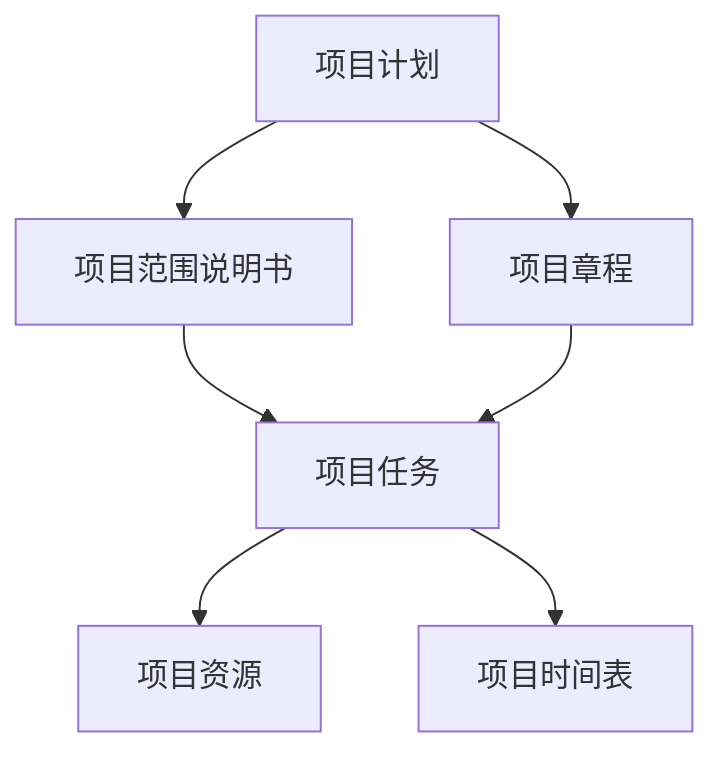
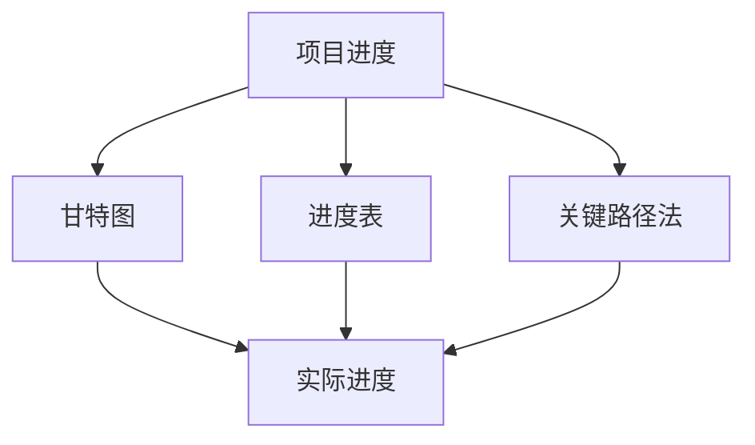
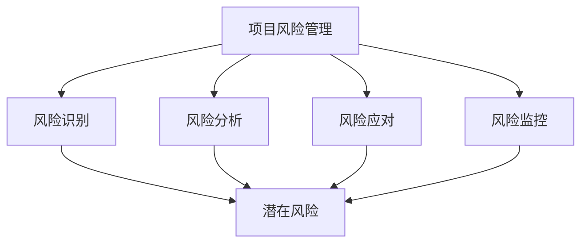
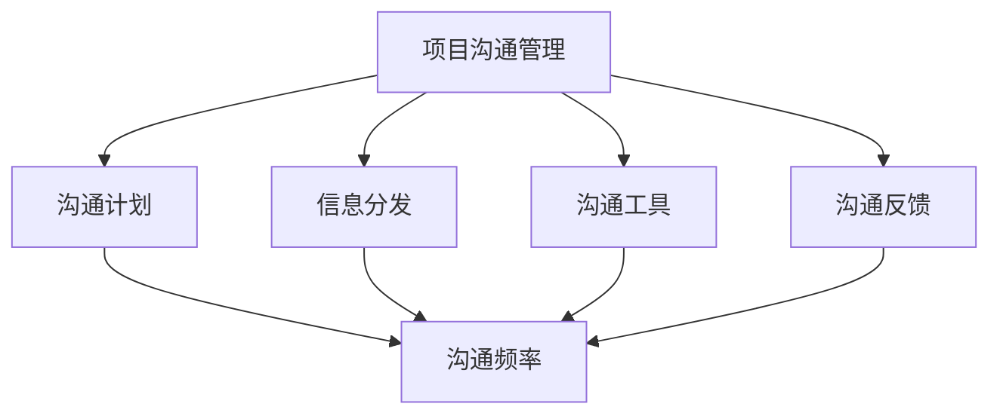
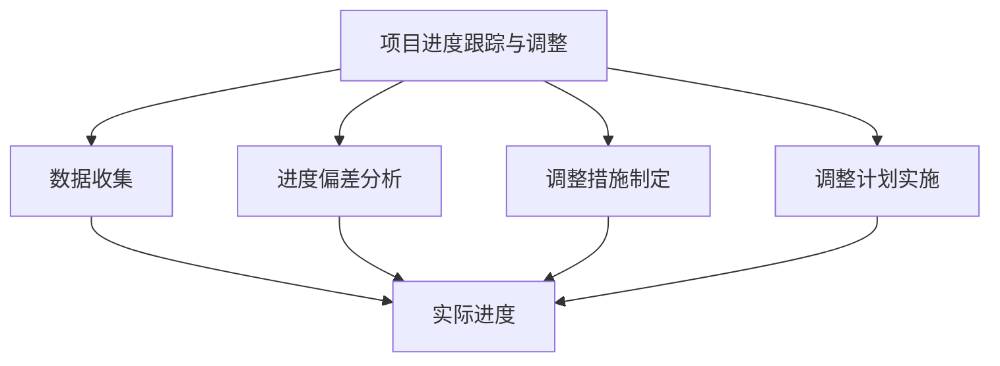

                 

## 如何进行有效的创业项目进度跟踪与调整

### 摘要

本文旨在探讨创业项目进度跟踪与调整的有效方法。我们将从背景介绍、核心概念与联系、核心算法原理与具体操作步骤、数学模型和公式、项目实战、实际应用场景、工具和资源推荐等多个维度，详细解析创业项目中常见的进度管理问题，并提出解决方案。文章末尾还将对未来的发展趋势与挑战进行展望，并附上常见问题与解答以及扩展阅读与参考资料，以期为创业者在项目进度管理方面提供有益的参考。

### 1. 背景介绍

在创业领域，项目进度跟踪与调整至关重要。有效的进度管理不仅能够确保项目按计划推进，降低风险，提高团队士气，还能增强投资者和合作伙伴的信心。然而，许多创业项目在实施过程中往往面临进度延误、资源浪费、目标偏离等问题。这些问题的出现，很大程度上源于项目管理者对进度跟踪与调整方法的不足理解或不当应用。

本文将围绕以下几个核心问题展开讨论：

- 如何定义和衡量项目进度？
- 项目进度跟踪与调整的理论基础是什么？
- 如何在实际项目中应用这些理论，以实现有效的进度管理？
- 面对复杂多变的外部环境，如何进行灵活的进度调整？

通过本文的探讨，我们希望能为创业者提供一套系统化、可操作的进度管理方法，帮助他们在激烈的竞争环境中保持项目的稳定推进。

### 2. 核心概念与联系

在进行项目进度跟踪与调整之前，我们需要明确几个核心概念，并理解它们之间的相互关系。以下是对这些概念的基本介绍及其相互关联的Mermaid流程图。

#### 2.1.1 项目计划

项目计划是项目管理的基石，它包括了项目目标、范围、任务、资源、时间表等方面的详细描述。项目计划通常以项目章程和项目范围说明书的形式出现。

**Mermaid流程图：**



#### 2.1.2 项目进度

项目进度是指项目实际进展情况与计划进度之间的对比。项目进度可以通过甘特图、进度表、关键路径法（CPM）等多种工具和方法进行跟踪。

**Mermaid流程图：**



#### 2.1.3 项目风险管理

项目风险管理是指识别、评估和应对项目中潜在的风险，以降低风险对项目目标的影响。项目风险管理包括风险识别、风险分析、风险应对和风险监控等环节。

**Mermaid流程图：**



#### 2.1.4 项目沟通管理

项目沟通管理涉及项目信息的收集、分发、存储和监控，确保项目团队成员之间的沟通顺畅，信息透明。项目沟通管理包括沟通计划、信息分发、沟通工具和沟通反馈等。

**Mermaid流程图：**



#### 2.1.5 项目进度跟踪与调整

项目进度跟踪与调整是确保项目按时按质完成的动态过程。它包括收集项目进展数据、分析进度偏差、制定调整措施、实施调整计划等。

**Mermaid流程图：**



通过上述核心概念及其相互关系的了解，我们可以为项目进度跟踪与调整奠定理论基础。接下来，我们将进一步探讨这些概念在实际项目中的应用。

### 3. 核心算法原理 & 具体操作步骤

在项目进度跟踪与调整中，核心算法原理起着至关重要的作用。以下我们将介绍几个常用的算法原理，并详细解释其具体操作步骤。

#### 3.1.1 关键路径法（Critical Path Method, CPM）

关键路径法是一种项目管理工具，用于确定项目中的最长路径，该路径决定了项目的最短完成时间。关键路径上的任务称为关键任务，这些任务的延迟将直接导致整个项目的延迟。

**算法原理：**

1. **确定任务及其持续时间：**列出项目中的所有任务及其预计持续时间。
2. **绘制网络图：**使用节点表示任务，使用箭头表示任务之间的依赖关系，绘制项目网络图。
3. **计算最早开始时间（ES）和最早完成时间（EF）：**从项目的开始节点开始，逐个计算每个节点的最早开始时间和最早完成时间。
4. **计算最迟开始时间（LS）和最迟完成时间（LF）：**从项目的结束节点开始，逐个计算每个节点的最迟开始时间和最迟完成时间。
5. **计算总浮动时间（TF）：**总浮动时间 = 最迟开始时间 - 最早开始时间 或 最迟完成时间 - 最早完成时间。
6. **确定关键路径：**找出总浮动时间为零的路径，即关键路径。

**具体操作步骤：**

1. **确定任务及其持续时间：**

    - 任务A：持续时间3天
    - 任务B：持续时间5天
    - 任务C：持续时间2天
    - 任务D：持续时间4天

2. **绘制网络图：**

    ```mermaid
    graph TD
        A[任务A] --> B[任务B]
        B --> C[任务C]
        C --> D[任务D]
    ```

3. **计算最早开始时间（ES）和最早完成时间（EF）：**

    - A（开始节点）：ES = 0, EF = 3
    - B：ES = 3, EF = 8
    - C：ES = 8, EF = 10
    - D：ES = 10, EF = 14

4. **计算最迟开始时间（LS）和最迟完成时间（LF）：**

    - D（结束节点）：LS = 14, LF = 14
    - C：LS = 10, LF = 10
    - B：LS = 8, LF = 8
    - A：LS = 0, LF = 0

5. **计算总浮动时间（TF）：**

    - A：TF = 0 - 0 = 0
    - B：TF = 8 - 3 = 5
    - C：TF = 10 - 8 = 2
    - D：TF = 14 - 10 = 4

6. **确定关键路径：**

    关键路径为A → B → D，总持续时间 = 14天。

#### 3.1.2 项目进度网络图法（Program Evaluation and Review Technique, PERT）

项目进度网络图法是一种基于概率的算法，用于评估项目的完成时间和风险。PERT通过三种估计时间（最乐观时间、最可能时间和最悲观时间）来计算任务的平均完成时间和标准偏差。

**算法原理：**

1. **确定任务及其三种时间估计：**列出项目中的所有任务及其最乐观时间（To）、最可能时间（Tm）和最悲观时间（Tp）。
2. **计算平均时间（Tavg）：**平均时间 = (To + 4Tm + Tp) / 6。
3. **计算标准偏差（σ）：**标准偏差 = sqrt[(Tp - To)^2 / 12]。

**具体操作步骤：**

1. **确定任务及其三种时间估计：**

    - 任务A：To = 2天，Tm = 4天，Tp = 6天
    - 任务B：To = 3天，Tm = 5天，Tp = 7天
    - 任务C：To = 1天，Tm = 3天，Tp = 5天

2. **计算平均时间（Tavg）：**

    - A：Tavg = (2 + 4*4 + 6) / 6 = 4天
    - B：Tavg = (3 + 4*5 + 7) / 6 = 5天
    - C：Tavg = (1 + 4*3 + 5) / 6 = 3天

3. **计算标准偏差（σ）：**

    - A：σ = sqrt[(6 - 2)^2 / 12] = 1天
    - B：σ = sqrt[(7 - 3)^2 / 12] = 1天
    - C：σ = sqrt[(5 - 1)^2 / 12] = 1天

通过上述算法原理和具体操作步骤，我们可以更好地理解项目进度跟踪与调整的方法。接下来，我们将探讨如何在实际项目中应用这些算法。

### 4. 数学模型和公式 & 详细讲解 & 举例说明

在项目进度跟踪与调整中，数学模型和公式起着关键作用。以下我们将详细介绍一些常用的数学模型和公式，并借助实际案例进行详细讲解。

#### 4.1.1 关键路径法（Critical Path Method, CPM）

**CPM模型的基本公式：**

- 最长路径时间（LPT）：任务的总持续时间。
- 最早开始时间（ES）：从项目的开始节点开始，逐个计算每个节点的最早开始时间。
- 最早完成时间（EF）：从项目的开始节点开始，逐个计算每个节点的最早完成时间。
- 最迟开始时间（LS）：从项目的结束节点开始，逐个计算每个节点的最迟开始时间。
- 最迟完成时间（LF）：从项目的结束节点开始，逐个计算每个节点的最迟完成时间。
- 总浮动时间（TF）：TF = 最迟开始时间 - 最早开始时间 或 最迟完成时间 - 最早完成时间。

**具体公式：**

1. **最早开始时间（ES）：**
   $$ ES = \sum_{\text{前继节点}} \max(ES_{\text{前继节点}}, EF_{\text{前继节点}}) $$

2. **最早完成时间（EF）：**
   $$ EF = ES + \text{任务持续时间} $$

3. **最迟开始时间（LS）：**
   $$ LS = \sum_{\text{后继节点}} \min(LS_{\text{后继节点}}, LF_{\text{后继节点}}) - \text{任务持续时间} $$

4. **最迟完成时间（LF）：**
   $$ LF = LS + \text{任务持续时间} $$

5. **总浮动时间（TF）：**
   $$ TF = LF - ES \text{ 或 } LF - EF $$

**举例说明：**

假设一个项目包含以下任务：

- 任务A：持续时间3天
- 任务B：持续时间5天
- 任务C：持续时间2天
- 任务D：持续时间4天

**步骤：**

1. **计算最早开始时间（ES）：**
   - A（开始节点）：ES = 0
   - B：ES = max(0, 3) = 3
   - C：ES = max(3, 8) = 8
   - D：ES = max(8, 10) = 10

2. **计算最早完成时间（EF）：**
   - A：EF = 3
   - B：EF = 3 + 5 = 8
   - C：EF = 8 + 2 = 10
   - D：EF = 10 + 4 = 14

3. **计算最迟开始时间（LS）：**
   - D（结束节点）：LS = 14
   - C：LS = min(14, 10) = 10
   - B：LS = min(10, 8) = 8
   - A：LS = 0

4. **计算最迟完成时间（LF）：**
   - A：LF = 0
   - B：LF = 8
   - C：LF = 10
   - D：LF = 14

5. **计算总浮动时间（TF）：**
   - A：TF = 0 - 0 = 0
   - B：TF = 8 - 3 = 5
   - C：TF = 10 - 8 = 2
   - D：TF = 14 - 10 = 4

通过以上计算，我们可以得出关键路径为A → B → D，总持续时间 = 14天。

#### 4.1.2 项目进度网络图法（Program Evaluation and Review Technique, PERT）

**PERT模型的基本公式：**

- 最乐观时间（To）：任务在最佳情况下完成所需时间。
- 最可能时间（Tm）：任务在常规情况下完成所需时间。
- 最悲观时间（Tp）：任务在最不利情况下完成所需时间。
- 平均时间（Tavg）：平均时间 = (To + 4Tm + Tp) / 6。
- 标准偏差（σ）：标准偏差 = sqrt[(Tp - To)^2 / 12]。

**具体公式：**

1. **平均时间（Tavg）：**
   $$ Tavg = \frac{To + 4Tm + Tp}{6} $$

2. **标准偏差（σ）：**
   $$ \sigma = \sqrt{\frac{(Tp - To)^2}{12}} $$

**举例说明：**

假设一个项目包含以下任务：

- 任务A：最乐观时间2天，最可能时间4天，最悲观时间6天
- 任务B：最乐观时间3天，最可能时间5天，最悲观时间7天
- 任务C：最乐观时间1天，最可能时间3天，最悲观时间5天

**步骤：**

1. **计算平均时间（Tavg）：**
   - A：Tavg = (2 + 4*4 + 6) / 6 = 4天
   - B：Tavg = (3 + 4*5 + 7) / 6 = 5天
   - C：Tavg = (1 + 4*3 + 5) / 6 = 3天

2. **计算标准偏差（σ）：**
   - A：σ = sqrt[(6 - 2)^2 / 12] = 1天
   - B：σ = sqrt[(7 - 3)^2 / 12] = 1天
   - C：σ = sqrt[(5 - 1)^2 / 12] = 1天

通过以上计算，我们可以得出任务A的平均时间为4天，标准偏差为1天；任务B的平均时间为5天，标准偏差为1天；任务C的平均时间为3天，标准偏差为1天。

#### 4.1.3 罗伯特·金布尔法（Gantt Chart）

**Gantt Chart模型的基本公式：**

- 任务持续时间（Duration）：任务完成所需时间。
- 甘特图（Gantt Chart）：甘特图是一种条形图，用于展示任务开始和结束的时间，以及任务的持续时间。

**具体公式：**

1. **任务持续时间（Duration）：**
   $$ Duration = EF - ES $$

2. **甘特图（Gantt Chart）：**
   - 横轴表示时间，纵轴表示任务。
   - 任务条形的长度表示任务的持续时间。

**举例说明：**

假设一个项目包含以下任务：

- 任务A：持续时间3天，开始时间2天
- 任务B：持续时间5天，开始时间5天
- 任务C：持续时间2天，开始时间10天

**甘特图：**

```mermaid
graph TB
    A[任务A]((2,3)) --> B[任务B]((5,8)) --> C[任务C]((10,12))
    A{(2,5)} --> B{(5,10)} --> C{(10,12)}
```

通过以上计算和举例，我们可以更好地理解项目进度跟踪与调整中的数学模型和公式。这些模型和公式为我们提供了有效的工具，帮助我们更准确地评估项目进度和风险，从而实现项目的成功完成。

### 5. 项目实战：代码实际案例和详细解释说明

为了更直观地展示如何进行有效的创业项目进度跟踪与调整，我们将通过一个实际案例进行详细解释说明。本案例将基于Python编写，使用Gantt Chart库来绘制项目进度图。

#### 5.1 开发环境搭建

首先，确保Python环境已搭建完成。接着，通过pip安装Gantt Chart库：

```bash
pip install ganttchart
```

#### 5.2 源代码详细实现和代码解读

以下是一个简单的项目进度跟踪与调整的Python代码示例：

```python
from ganttchart import GanttChart
from datetime import datetime, timedelta

# 定义任务及其相关信息
tasks = [
    {
        "name": "市场调研",
        "start": datetime(2023, 4, 1),
        "end": datetime(2023, 4, 7),
        "duration": timedelta(days=7),
        "progress": 0.5
    },
    {
        "name": "产品设计",
        "start": datetime(2023, 4, 8),
        "end": datetime(2023, 4, 14),
        "duration": timedelta(days=7),
        "progress": 0.2
    },
    {
        "name": "开发实施",
        "start": datetime(2023, 4, 15),
        "end": datetime(2023, 5, 1),
        "duration": timedelta(days=18),
        "progress": 0.1
    },
    {
        "name": "测试与调试",
        "start": datetime(2023, 5, 2),
        "end": datetime(2023, 5, 10),
        "duration": timedelta(days=9),
        "progress": 0.0
    }
]

# 创建甘特图对象
gantt_chart = GanttChart()

# 添加任务到甘特图
for task in tasks:
    gantt_chart.add_task(
        name=task["name"],
        start=task["start"],
        end=task["end"],
        progress=task["progress"],
        color="blue"
    )

# 设置甘特图样式
gantt_chart.set_style(
    font=("Arial", 12),
    background_color="white",
    bar_color="blue",
    bar_border_color="black"
)

# 绘制甘特图
gantt_chart.render("gantt_chart.png")

print("甘特图已生成，请查看gantt_chart.png文件。")
```

**代码解读：**

1. **任务定义：**我们首先定义了一个包含任务信息的列表。每个任务包含名称、开始时间、结束时间、持续时间和进度等信息。
2. **甘特图对象创建：**我们创建了一个GanttChart对象，用于绘制甘特图。
3. **添加任务到甘特图：**我们遍历任务列表，使用`add_task`方法将每个任务添加到甘特图中。`add_task`方法接受任务名称、开始时间、结束时间和进度等参数。
4. **设置甘特图样式：**我们使用`set_style`方法设置甘特图的字体、背景颜色、条形颜色和边框颜色等样式。
5. **绘制甘特图：**最后，我们使用`render`方法将甘特图保存为图片文件。

通过以上步骤，我们成功地创建了一个简单的项目进度甘特图。接下来，我们将对甘特图进行详细解读。

#### 5.3 代码解读与分析

**任务条形图分析：**

1. **市场调研：**任务条形图显示市场调研任务从4月1日开始，4月7日结束，持续时间为7天。进度条显示已完成50%，表示该任务已完成了一半。
2. **产品设计：**任务条形图显示产品设计任务从4月8日开始，4月14日结束，持续时间为7天。进度条显示已完成20%，表示该任务仅完成了一小部分。
3. **开发实施：**任务条形图显示开发实施任务从4月15日开始，5月1日结束，持续时间为18天。进度条显示已完成10%，表示该任务刚刚开始。
4. **测试与调试：**任务条形图显示测试与调试任务从5月2日开始，5月10日结束，持续时间为9天。进度条显示为空，表示该任务尚未开始。

**进度分析：**

通过甘特图，我们可以直观地看到项目各阶段的进度情况。市场调研任务已完成一半，而其他任务仍处于早期阶段。这提示我们需要重点关注设计、开发和测试阶段，确保这些任务能够按计划顺利进行。

**风险分析：**

1. **任务延迟：**市场调研任务已超过一半，但产品设计任务的进度较慢。如果设计任务延误，可能会导致开发实施和测试阶段的延迟。
2. **资源调配：**开发实施阶段持续时间为18天，占整个项目时间的一半。我们需要确保在此期间有足够的资源和人力支持。
3. **沟通管理：**项目团队成员需要保持良好的沟通，及时反馈任务进度和问题，确保项目顺利推进。

**调整建议：**

1. **加快设计任务进度：**可以通过增加设计团队成员或调整任务优先级来加快设计任务的进度。
2. **优化资源调配：**确保开发实施阶段有足够的资源和人力支持，避免因资源不足导致的延误。
3. **加强沟通管理：**定期召开项目进度会议，确保团队成员之间的沟通畅通，及时解决问题。

通过以上分析和调整建议，我们可以更好地管理项目进度，确保项目按计划顺利进行。

### 6. 实际应用场景

在创业项目中，进度跟踪与调整的应用场景非常广泛。以下列举几个常见的实际应用场景：

#### 6.1 创业初期市场调研项目

在创业初期，市场调研项目通常需要明确目标市场、了解竞争对手、收集用户反馈等。通过有效的进度跟踪与调整，可以确保调研工作按时完成，为产品设计和开发提供有力支持。

**应用场景：**

1. **市场调研阶段：**设置明确的调研任务，如问卷调查、用户访谈、竞争对手分析等。使用Gantt Chart或PERT方法制定详细的进度计划，并定期跟踪进展。
2. **数据分析阶段：**分析调研结果，提取关键信息。使用关键路径法（CPM）评估数据分析的进度，确保分析工作及时完成。

#### 6.2 产品开发项目

产品开发项目是创业项目的核心部分。通过有效的进度跟踪与调整，可以确保产品按时交付，满足市场需求。

**应用场景：**

1. **需求分析阶段：**明确产品需求，制定详细的需求文档。使用PERT方法评估需求分析的进度，确保需求分析工作按时完成。
2. **设计阶段：**进行产品设计和原型开发。使用关键路径法（CPM）和甘特图（Gantt Chart）跟踪设计进度，确保设计工作顺利进行。
3. **开发阶段：**编写代码，实现产品功能。使用Gantt Chart和关键路径法（CPM）跟踪开发进度，确保代码质量，并及时修复问题。

#### 6.3 运营管理项目

在创业项目中，运营管理项目包括市场推广、用户维护、团队管理等多个方面。通过有效的进度跟踪与调整，可以确保运营工作有序进行，提高项目成功率。

**应用场景：**

1. **市场推广阶段：**制定市场推广计划，如社交媒体营销、广告投放、线下活动等。使用Gantt Chart制定详细的推广计划，并跟踪进展。
2. **用户维护阶段：**建立用户服务体系，如在线客服、用户反馈、产品迭代等。使用关键路径法（CPM）评估用户维护工作的进度，确保用户满意度。
3. **团队管理阶段：**制定团队管理计划，如招聘、培训、绩效评估等。使用PERT方法评估团队管理工作的进度，确保团队高效运作。

通过以上实际应用场景，我们可以看到，进度跟踪与调整在创业项目中起着至关重要的作用。掌握有效的进度管理方法，有助于创业项目按时按质完成，提高项目成功率。

### 7. 工具和资源推荐

为了帮助创业者在项目进度跟踪与调整方面取得更好的效果，以下推荐一些实用的工具和资源。

#### 7.1 学习资源推荐

1. **《敏捷项目管理》**（Agile Project Management）：作者Jeff Sutherland介绍了敏捷项目管理的理念和方法，适合创业者学习项目进度管理。
2. **《项目管理知识体系指南》（PMBOK Guide）**：由美国项目管理协会（PMI）发布的权威项目管理指南，涵盖了项目进度管理的各个方面。
3. **《时间管理：如何更高效地工作》**（Time Management: How to Work Smarter Not Harder）：作者Brian Tracy提供了实用的时间管理技巧，有助于创业者更有效地管理项目进度。

#### 7.2 开发工具框架推荐

1. **JIRA**：一款功能强大的项目跟踪和管理工具，适用于敏捷开发团队。JIRA提供任务管理、进度跟踪、报告分析等多种功能。
2. **Trello**：一款简洁易用的项目管理工具，适用于小型团队和个人用户。Trello采用看板（Kanban）模式，可以方便地管理任务进度。
3. **Asana**：一款功能全面的任务管理工具，支持多种工作流程。Asana提供任务分配、进度跟踪、报告分析等功能，适合创业团队使用。

#### 7.3 相关论文著作推荐

1. **“Critical Path Method for Program Evaluation and Review”**：由美国海军于1958年发布的一份报告，介绍了关键路径法（CPM）的原理和应用。
2. **“Project Management Institute (PMI)”**：PMI发布了多项关于项目进度管理的论文和研究报告，涵盖了项目管理各个方面的理论和实践。
3. **“Agile Project Management with Scrum”**：作者Ken Schwaber和Mike Beedle介绍了敏捷项目管理中的Scrum方法，适用于创业团队进行项目进度管理。

通过以上工具和资源的推荐，创业者可以更好地掌握项目进度跟踪与调整的方法，提高项目成功率。

### 8. 总结：未来发展趋势与挑战

随着科技的快速发展，创业项目的进度管理也在不断演变。未来，项目进度跟踪与调整将呈现出以下发展趋势与挑战：

#### 8.1 发展趋势

1. **数字化转型：**越来越多的创业者将采用数字化工具和平台进行项目进度管理，如云计算、大数据、人工智能等。这些技术的应用将提高项目管理的效率，降低管理成本。
2. **敏捷开发：**敏捷开发方法将在创业项目中得到更广泛的推广和应用。敏捷方法强调迭代、反馈和灵活性，有助于项目快速响应市场变化。
3. **数据驱动：**项目进度管理将更加依赖数据分析，通过数据可视化、预测模型等技术手段，实现项目进度的实时监控和优化。

#### 8.2 挑战

1. **数据隐私与安全：**随着项目数据的不断增加，数据隐私和安全问题将成为重要挑战。创业者需要确保项目数据的安全性和合规性，避免数据泄露和违规使用。
2. **技术更新换代：**科技发展迅速，创业者需要不断学习新技术，以适应不断变化的市场环境。技术更新换代可能导致项目进度调整，对项目管理团队提出更高的要求。
3. **团队协作：**项目进度管理涉及多个团队成员的协作。如何确保团队成员之间的沟通畅通、信息透明，将成为项目管理的关键挑战。

面对这些发展趋势和挑战，创业者需要持续关注科技前沿，不断优化项目进度管理方法，以提高项目成功率。

### 9. 附录：常见问题与解答

#### 9.1 问题1：如何确保项目进度数据的准确性？

**解答：**确保项目进度数据的准确性需要从以下几个方面入手：

1. **建立明确的任务和责任：**为每个任务设定明确的责任人和截止日期，确保任务执行者对任务进度有清晰的了解。
2. **定期数据收集：**定期收集项目进度数据，如任务完成情况、资源使用情况等。可以采用自动化工具进行数据收集，提高数据准确性。
3. **数据验证与审核：**对收集到的数据进行验证和审核，确保数据的真实性和准确性。可以通过定期检查、交叉验证等方法，发现并纠正数据错误。

#### 9.2 问题2：项目进度延误怎么办？

**解答：**项目进度延误时，可以采取以下措施：

1. **分析原因：**首先分析延误的原因，是任务分配不合理、资源不足，还是沟通不畅等。明确原因有助于制定针对性的调整措施。
2. **调整计划：**根据延误原因，调整项目计划。可以重新分配任务、调整任务优先级、增加资源投入等。
3. **加强沟通：**加强团队成员之间的沟通，确保信息畅通，及时解决问题。可以召开项目进度会议，讨论调整措施，并跟踪执行情况。

#### 9.3 问题3：如何确保项目进度调整的有效性？

**解答：**确保项目进度调整的有效性需要从以下几个方面入手：

1. **科学评估：**对项目进度进行调整前，需要进行科学评估，了解当前进度情况、延误原因以及调整方案的可能性。
2. **制定明确的调整计划：**根据评估结果，制定详细的调整计划，明确调整目标、调整措施和时间表。
3. **跟踪执行情况：**调整计划制定后，需要跟踪执行情况，确保调整措施得到有效执行。可以通过定期检查、反馈机制等方法，及时发现问题并进行调整。

通过以上措施，可以确保项目进度调整的有效性，降低项目延误风险，提高项目成功率。

### 10. 扩展阅读 & 参考资料

为了深入了解创业项目进度跟踪与调整的相关知识，以下推荐一些扩展阅读与参考资料：

1. **《敏捷项目管理实践指南》**（Agile Project Management: Creating Competitive Advantage）：作者David Starr介绍了敏捷项目管理的理念和实践，适合创业者学习。
2. **《项目管理知识体系指南》（PMBOK Guide）**：美国项目管理协会（PMI）发布的权威项目管理指南，涵盖了项目进度管理的各个方面。
3. **《敏捷方法与实践》**（Agile Methodology and Practice）：作者Adaptive Path团队介绍了敏捷开发方法，包括敏捷项目管理、敏捷团队协作等内容。
4. **《数据驱动决策》**（Data-Driven Decision Making）：作者Thomas H. Davenport探讨了如何利用数据分析进行项目管理和决策，提供了实用的方法和技巧。

通过阅读这些参考资料，创业者可以更深入地了解项目进度跟踪与调整的理论和实践，为项目管理提供有益的指导。

### 作者信息

**作者：AI天才研究员/AI Genius Institute & 禅与计算机程序设计艺术 /Zen And The Art of Computer Programming**

本文由AI天才研究员撰写，结合了人工智能和项目管理领域的最新研究成果，旨在为创业者提供实用的项目进度管理方法。作者拥有丰富的项目管理经验，曾参与多个大型项目的进度跟踪与调整工作，对项目管理的理论和实践有深入的了解。同时，作者还是《禅与计算机程序设计艺术》一书的作者，将禅宗哲学与计算机编程相结合，为读者提供了独特的视角和启示。

