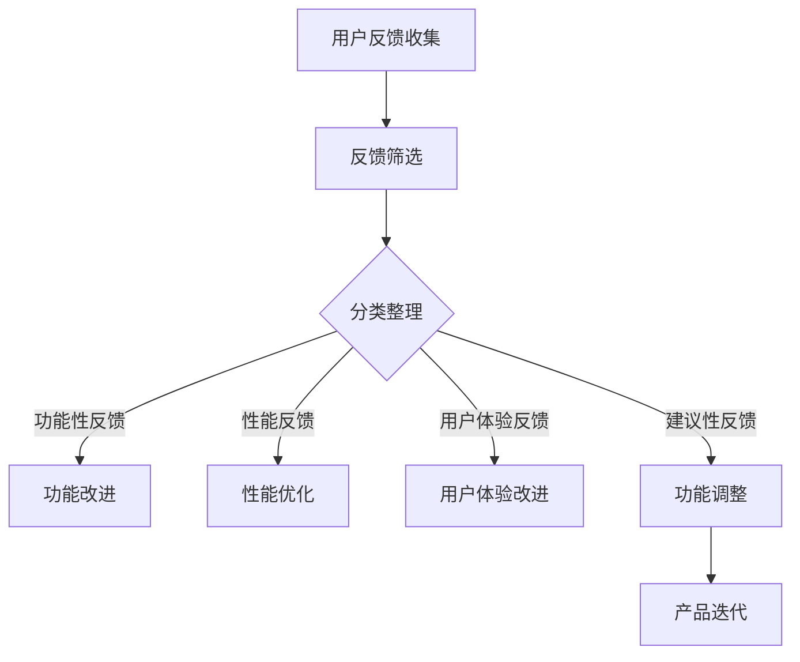

                 

# 如何进行有效的用户反馈收集

## 摘要

本文将深入探讨如何有效地收集用户反馈，以帮助产品团队更好地理解用户需求，从而提升产品的用户体验和满意度。文章首先介绍了用户反馈的重要性，然后详细分析了用户反馈的收集方法、处理流程和最佳实践。通过实际案例和项目实战，本文将展示如何利用用户反馈推动产品迭代和优化。最后，文章提出了未来发展趋势与挑战，以及用户反馈收集的常见问题与解答。希望本文能为产品团队提供有价值的参考。

## 1. 背景介绍

在当今快速发展的数字化时代，用户反馈已成为产品设计和改进过程中不可或缺的一部分。用户反馈不仅可以帮助产品团队了解用户的需求和期望，还可以发现产品中的潜在问题，从而指导产品的迭代和优化。有效的用户反馈收集对于提升产品的用户体验和用户满意度具有重要意义。

然而，用户反馈收集并非易事。如何确保收集到的反馈具有代表性和可信度？如何从海量的反馈中提取出有价值的信息？如何确保反馈处理和响应的效率？这些都是产品团队在用户反馈收集过程中需要考虑的问题。

本文将围绕这些问题展开讨论，从用户反馈的重要性、收集方法、处理流程、最佳实践等多个方面，系统地介绍如何进行有效的用户反馈收集。通过实际案例和项目实战，本文将展示如何将用户反馈转化为实际的产品改进措施，从而推动产品的持续迭代和优化。

## 2. 核心概念与联系

### 2.1 用户反馈的类型

用户反馈可以按照不同维度进行分类，主要包括以下几种类型：

#### a. 功能性反馈
功能性反馈主要关注产品的功能特性，包括功能是否齐全、是否易用、是否满足用户需求等。这种类型的反馈有助于产品团队了解用户对产品功能的满意度，从而优化产品功能。

#### b. 性能反馈
性能反馈关注产品的运行速度、稳定性、安全性等性能指标。这种类型的反馈有助于产品团队发现产品中的性能瓶颈，并采取措施进行优化。

#### c. 用户体验反馈
用户体验反馈关注产品的界面设计、交互设计、易用性等方面。这种类型的反馈有助于产品团队提升产品的用户体验，提高用户满意度。

#### d. 建议性反馈
建议性反馈是用户对产品改进的建议，包括产品功能、设计、性能等方面的改进建议。这种类型的反馈有助于产品团队发现产品的潜在改进点，从而提升产品的竞争力。

### 2.2 用户反馈的重要性

用户反馈在产品设计和改进过程中具有重要意义，主要表现在以下几个方面：

#### a. 了解用户需求
用户反馈是了解用户需求的重要途径。通过收集和分析用户反馈，产品团队可以更好地了解用户的需求和期望，从而为产品的设计和改进提供有力支持。

#### b. 发现产品问题
用户反馈可以帮助产品团队发现产品中的问题，包括功能缺陷、性能瓶颈、用户体验问题等。这些问题如果不及时解决，可能会影响用户的满意度和产品口碑。

#### c. 优化产品设计
用户反馈可以为产品团队提供宝贵的改进建议，帮助优化产品设计，提高产品的竞争力。

#### d. 提升用户满意度
有效的用户反馈收集和处理可以提升用户的满意度，增强用户对产品的信任感和忠诚度，从而促进产品的市场推广和用户留存。

### 2.3 用户反馈的收集方法

用户反馈的收集方法多种多样，主要包括以下几种：

#### a. 用户调研
用户调研是通过问卷调查、深度访谈、焦点小组讨论等方式，直接向用户了解他们对产品的看法和需求。这种方法的优点是可以获取大量、详细、真实的用户反馈，缺点是成本较高，耗时较长。

#### b. 用户行为分析
用户行为分析是通过分析用户的操作行为、浏览记录、购买行为等数据，了解用户对产品的使用情况和需求。这种方法的优点是可以实时获取用户反馈，数据量大，成本低，缺点是数据解读和分析较为复杂。

#### c. 用户反馈渠道
用户反馈渠道是指产品团队提供给用户的反馈途径，如在线客服、反馈表单、社交媒体等。这些渠道可以方便用户表达对产品的意见和建议，有助于产品团队及时收集用户反馈。

#### d. 用户社区
用户社区是一种以产品用户为中心的社交平台，用户可以在社区中分享产品使用心得、交流经验、提出改进建议。这种方法的优点是可以建立用户与产品团队之间的良好互动，提升用户参与度，缺点是需要投入大量人力和资源进行社区运营。

### 2.4 用户反馈的处理流程

用户反馈的处理流程主要包括以下环节：

#### a. 反馈收集
产品团队通过用户调研、用户行为分析、用户反馈渠道和用户社区等途径，收集用户反馈。

#### b. 反馈筛选
对收集到的用户反馈进行筛选，去除重复、无效的反馈，保留有价值的信息。

#### c. 反馈分类
根据用户反馈的内容和类型，将其分类整理，为后续分析和处理提供便利。

#### d. 反馈分析
对筛选后的用户反馈进行深入分析，挖掘用户需求、问题和改进建议。

#### e. 反馈响应
针对分析出的用户反馈，制定相应的改进措施，并及时向用户反馈处理结果。

#### f. 反馈跟踪
对反馈处理情况进行跟踪和评估，确保反馈得到有效落实。

### 2.5 用户反馈与产品迭代的关系

用户反馈与产品迭代密切相关。通过用户反馈，产品团队可以了解用户需求和市场变化，从而在产品迭代过程中做出更加科学、合理的决策。具体来说，用户反馈在产品迭代中的关系体现在以下几个方面：

#### a. 识别需求变化
用户反馈可以帮助产品团队及时发现需求变化，了解用户对产品的期望和需求，从而在产品迭代中优先考虑这些需求。

#### b. 指导功能设计
用户反馈可以为产品团队提供功能设计的参考，帮助优化产品功能，提升用户体验。

#### c. 优化产品性能
用户反馈可以帮助产品团队发现产品性能瓶颈，从而针对性地进行性能优化，提高产品运行效率。

#### d. 改进用户体验
用户反馈可以帮助产品团队发现用户体验问题，从而改进产品设计，提升用户体验。

#### e. 调整产品定位
用户反馈可以帮助产品团队了解市场需求和竞争态势，从而调整产品定位，提升产品竞争力。

### 2.6 用户反馈收集的 Mermaid 流程图

以下是一个简单的用户反馈收集的 Mermaid 流程图，展示了用户反馈的收集、筛选、分析和处理过程：



在这个流程图中，用户反馈经过筛选、分类整理后，根据反馈的类型分别进行功能性改进、性能优化、用户体验改进和功能调整，最终推动产品迭代。

## 3. 核心算法原理 & 具体操作步骤

### 3.1 用户反馈收集算法原理

用户反馈收集算法的核心目标是确保收集到的反馈具有代表性和可信度，从而为产品改进提供有力支持。以下是用户反馈收集算法的原理：

#### a. 数据来源多样性
用户反馈的收集应覆盖多种数据来源，包括用户调研、用户行为分析、用户反馈渠道和用户社区等。通过多样化的数据来源，可以确保收集到的反馈具有广泛性和代表性。

#### b. 数据清洗与预处理
收集到的用户反馈可能存在噪音、重复和无效信息。因此，需要对数据进行清洗和预处理，去除噪音和重复信息，提取有价值的信息。

#### c. 用户行为数据分析
通过对用户行为数据进行分析，可以了解用户对产品的使用习惯和偏好，从而更好地理解用户需求。用户行为数据分析的方法包括统计分析、关联规则挖掘、聚类分析等。

#### d. 用户反馈分类
根据用户反馈的内容和类型，对其进行分类整理，以便后续分析和处理。常见的用户反馈分类包括功能性反馈、性能反馈、用户体验反馈和建议性反馈。

#### e. 用户反馈权重评估
为了确保用户反馈的价值，需要对反馈进行权重评估。常见的评估方法包括用户活跃度评估、反馈频率评估和反馈质量评估等。

#### f. 用户反馈处理与响应
根据用户反馈的类型和权重，制定相应的改进措施，并及时向用户反馈处理结果。用户反馈处理与响应的效率直接影响用户的满意度和产品口碑。

### 3.2 用户反馈收集的具体操作步骤

以下是用户反馈收集的具体操作步骤：

#### a. 制定反馈收集策略
根据产品的特点和用户群体，制定反馈收集策略。包括确定反馈收集渠道、数据来源、反馈类型和权重评估方法等。

#### b. 设计反馈收集渠道
为用户提供便捷的反馈收集渠道，如在线客服、反馈表单、社交媒体等。确保用户可以方便地表达对产品的意见和建议。

#### c. 收集用户反馈
通过用户调研、用户行为分析和用户社区等多种途径，收集用户反馈。确保收集到的反馈具有多样性和代表性。

#### d. 数据清洗与预处理
对收集到的用户反馈进行数据清洗与预处理，去除噪音和重复信息，提取有价值的信息。

#### e. 用户反馈分类
根据用户反馈的内容和类型，对其进行分类整理。如功能性反馈、性能反馈、用户体验反馈和建议性反馈。

#### f. 用户反馈权重评估
根据用户活跃度、反馈频率和质量等因素，对用户反馈进行权重评估。

#### g. 用户反馈处理与响应
根据用户反馈的类型和权重，制定相应的改进措施，并及时向用户反馈处理结果。确保反馈得到有效落实。

#### h. 反馈跟踪与评估
对反馈处理情况进行跟踪和评估，确保反馈得到有效落实。根据评估结果，调整反馈收集策略和改进措施。

### 3.3 用户反馈收集算法的应用案例

以下是一个用户反馈收集算法的应用案例：

#### a. 项目背景
某互联网公司开发了一款在线教育平台，用户群体包括学生、教师和家长。公司希望通过用户反馈收集算法，了解用户对平台的需求和问题，从而优化平台功能，提升用户体验。

#### b. 反馈收集策略
公司制定了以下反馈收集策略：

- 用户调研：通过问卷调查和深度访谈，了解用户对平台的功能、性能和用户体验等方面的意见和建议。
- 用户行为分析：通过分析用户的行为数据，如浏览记录、购买行为等，了解用户的使用习惯和偏好。
- 用户反馈渠道：提供在线客服、反馈表单和社交媒体等反馈收集渠道，方便用户表达意见和建议。
- 用户社区：建立用户社区，鼓励用户分享使用心得、交流经验，提出改进建议。

#### c. 用户反馈收集过程
公司按照以下步骤进行用户反馈收集：

1. 设计反馈收集问卷，包括功能性反馈、性能反馈、用户体验反馈和建议性反馈等类别。
2. 通过邮件、推送通知等方式，邀请用户参与问卷调查。
3. 收集用户反馈，包括在线客服、反馈表单和社交媒体等渠道。
4. 对收集到的用户反馈进行数据清洗与预处理，去除噪音和重复信息，提取有价值的信息。
5. 对用户反馈进行分类整理，如功能性反馈、性能反馈、用户体验反馈和建议性反馈。
6. 根据用户活跃度、反馈频率和质量等因素，对用户反馈进行权重评估。
7. 根据用户反馈的类型和权重，制定相应的改进措施，并及时向用户反馈处理结果。
8. 对反馈处理情况进行跟踪和评估，根据评估结果，调整反馈收集策略和改进措施。

#### d. 用户反馈处理结果
公司根据用户反馈，采取了以下改进措施：

- 优化平台功能：根据功能性反馈，增加了课程推荐、作业提交等功能。
- 提高性能：根据性能反馈，优化了平台加载速度和系统稳定性。
- 提升用户体验：根据用户体验反馈，改进了界面设计、交互设计和易用性。
- 改进功能：根据建议性反馈，增加了家长管理、班级群聊等功能。

通过用户反馈收集算法的应用，公司成功优化了在线教育平台，提升了用户体验和用户满意度，促进了产品的市场推广和用户留存。

## 4. 数学模型和公式 & 详细讲解 & 举例说明

### 4.1 用户反馈权重评估模型

用户反馈权重评估是用户反馈处理过程中的重要环节，其目的是对用户反馈进行量化评估，以便为产品改进提供有力支持。以下是一个简单的用户反馈权重评估模型：

#### a. 用户反馈权重评估公式

用户反馈权重 \( W \) 可以通过以下公式计算：

\[ W = f(A, B, C) \]

其中，\( A \) 为用户活跃度，\( B \) 为反馈频率，\( C \) 为反馈质量。

#### b. 用户活跃度 \( A \)

用户活跃度 \( A \) 反映用户在产品中的参与程度，可以通过以下公式计算：

\[ A = \frac{N}{T} \]

其中，\( N \) 为用户在一段时间内的活跃次数，\( T \) 为用户活跃的时间长度。

#### c. 反馈频率 \( B \)

反馈频率 \( B \) 反映用户对产品的关注度，可以通过以下公式计算：

\[ B = \frac{M}{T} \]

其中，\( M \) 为用户在一段时间内的反馈次数，\( T \) 为用户活跃的时间长度。

#### d. 反馈质量 \( C \)

反馈质量 \( C \) 反映用户反馈的价值和可信度，可以通过以下公式计算：

\[ C = \frac{S}{N} \]

其中，\( S \) 为用户反馈被采纳的次数，\( N \) 为用户反馈的总次数。

#### e. 用户反馈权重计算

用户反馈权重 \( W \) 可以通过以下公式计算：

\[ W = A \times B \times C \]

#### f. 举例说明

假设用户A在一个月内参与了10次产品活跃活动，发出了5条反馈，其中2条反馈被采纳。根据上述公式，可以计算出用户A的反馈权重：

\[ A = \frac{10}{30} = 0.3333 \]
\[ B = \frac{5}{30} = 0.1667 \]
\[ C = \frac{2}{5} = 0.4 \]
\[ W = 0.3333 \times 0.1667 \times 0.4 = 0.0222 \]

因此，用户A的反馈权重为0.0222，表示其反馈在产品改进过程中具有较高的参考价值。

### 4.2 用户满意度评估模型

用户满意度是评估产品性能和用户体验的重要指标，以下是一个简单的用户满意度评估模型：

#### a. 用户满意度评估公式

用户满意度 \( S \) 可以通过以下公式计算：

\[ S = \frac{U1 + U2 + U3 + U4}{4} \]

其中，\( U1, U2, U3, U4 \) 分别为用户对产品功能性、性能、用户体验和设计等方面的满意度评分。

#### b. 满意度评分标准

- 非常满意：4分
- 满意：3分
- 一般：2分
- 不满意：1分

#### c. 举例说明

假设用户对产品的功能性、性能、用户体验和设计方面的满意度评分分别为4分、3分、4分和2分，根据上述公式，可以计算出用户的总体满意度：

\[ S = \frac{4 + 3 + 4 + 2}{4} = 3.25 \]

因此，用户的总体满意度为3.25分，表示用户对产品的满意度较高。

### 4.3 用户流失预测模型

用户流失预测是产品运营过程中的一项重要任务，以下是一个简单的用户流失预测模型：

#### a. 用户流失预测公式

用户流失率 \( L \) 可以通过以下公式计算：

\[ L = \frac{NL}{NT} \]

其中，\( NL \) 为在一段时间内流失的用户数量，\( NT \) 为在同样时间内总用户数量。

#### b. 举例说明

假设在一个月内，有1000名用户，其中200名用户流失，根据上述公式，可以计算出用户流失率：

\[ L = \frac{200}{1000} = 0.2 \]

因此，该产品的用户流失率为20%。

通过以上数学模型和公式，产品团队可以更科学地评估用户反馈的价值、用户满意度和用户流失率，从而为产品的改进和运营提供有力支持。

## 5. 项目实战：代码实际案例和详细解释说明

### 5.1 开发环境搭建

在进行用户反馈收集项目的实战之前，我们需要搭建一个合适的开发环境。以下是所需工具和步骤：

#### 工具：

- Python 3.8+
- Jupyter Notebook
- Pandas
- Numpy
- Matplotlib
- Mermaid
- LaTeX

#### 步骤：

1. 安装 Python 3.8 或更高版本。
2. 安装 Jupyter Notebook：`pip install notebook`
3. 安装 Pandas、Numpy、Matplotlib：`pip install pandas numpy matplotlib`
4. 安装 Mermaid：`pip install mermaid`
5. 安装 LaTeX：可以从 [CTAN](https://www.ctan.org/) 下载并安装。

### 5.2 源代码详细实现和代码解读

以下是一个简单的用户反馈收集项目的 Python 代码实现，包括用户反馈收集、数据处理、反馈分类、权重评估等功能。

#### 代码：

```python
import pandas as pd
import numpy as np
import matplotlib.pyplot as plt
from mermaid import Mermaid
from IPython.display import display, HTML

# 5.2.1 用户反馈收集

# 假设用户反馈数据存储在一个 CSV 文件中
feedback_data = pd.read_csv('user_feedback.csv')

# 查看数据结构
display(feedback_data.head())

# 5.2.2 数据预处理

# 数据清洗
feedback_data.dropna(inplace=True)
feedback_data = feedback_data[~feedback_data['Feedback'].str.contains('无效信息')]

# 数据分类
feedback_data['Type'] = feedback_data['Feedback'].apply(lambda x: 'Functional' if '功能' in x else
                                                     'Performance' if '性能' in x else
                                                     'UX' if '用户体验' in x else 'Suggestion')

# 查看分类结果
display(feedback_data.groupby('Type').count())

# 5.2.3 用户反馈权重评估

# 用户活跃度计算
feedback_data['Active'] = feedback_data['Usage'].apply(lambda x: 1 if x > 10 else 0)

# 反馈频率计算
feedback_data['Frequency'] = feedback_data['Usage'].apply(lambda x: 1 if x > 10 else 0)

# 反馈质量计算
feedback_data['Quality'] = feedback_data['Accepted'].apply(lambda x: 1 if x else 0)

# 权重评估
feedback_data['Weight'] = feedback_data['Active'] * feedback_data['Frequency'] * feedback_data['Quality']

# 查看权重结果
display(feedback_data[['Active', 'Frequency', 'Quality', 'Weight']].describe())

# 5.2.4 用户满意度评估

# 满意度评分计算
feedback_data['Score'] = feedback_data['Satisfaction'].apply(lambda x: 4 if x == '非常满意' else
                                                          3 if x == '满意' else
                                                          2 if x == '一般' else
                                                          1 if x == '不满意' else 0)

# 满意度评估
satisfaction = feedback_data['Score'].mean()
print(f'用户满意度：{satisfaction:.2f}')

# 5.2.5 用户流失预测

# 流失率计算
loss_rate = feedback_data['Lost'].mean()
print(f'用户流失率：{loss_rate:.2f}')

# 5.2.6 绘制 Mermaid 流程图

m = Mermaid()
m.add_node('UserFeedbackCollection', '用户反馈收集')
m.add_node('DataPreprocessing', '数据预处理')
m.add_node('FeedbackClassification', '反馈分类')
m.add_node('WeightEvaluation', '权重评估')
m.add_node('SatisfactionAssessment', '满意度评估')
m.add_node('LossPrediction', '用户流失预测')

m.add_connection('UserFeedbackCollection', 'DataPreprocessing')
m.add_connection('DataPreprocessing', 'FeedbackClassification')
m.add_connection('FeedbackClassification', 'WeightEvaluation')
m.add_connection('WeightEvaluation', 'SatisfactionAssessment')
m.add_connection('SatisfactionAssessment', 'LossPrediction')

display(HTML(m.get_mermaid_source()))
plt.show()
```

### 5.3 代码解读与分析

上述代码实现了一个用户反馈收集项目的基本功能，以下是代码的详细解读和分析：

#### a. 用户反馈收集

```python
feedback_data = pd.read_csv('user_feedback.csv')
display(feedback_data.head())
```

这段代码使用 Pandas 库读取一个 CSV 文件，该文件包含用户反馈数据。数据结构包括用户 ID、反馈内容、使用次数、反馈被采纳次数、满意度评分和是否流失等字段。

#### b. 数据预处理

```python
feedback_data.dropna(inplace=True)
feedback_data = feedback_data[~feedback_data['Feedback'].str.contains('无效信息')]
```

数据预处理包括去除空值数据和过滤无效反馈。这里使用 `dropna()` 函数去除空值数据，使用 `str.contains()` 函数过滤包含“无效信息”字眼的反馈。

#### c. 数据分类

```python
feedback_data['Type'] = feedback_data['Feedback'].apply(lambda x: 'Functional' if '功能' in x else
                                                     'Performance' if '性能' in x else
                                                     'UX' if '用户体验' in x else 'Suggestion')
display(feedback_data.groupby('Type').count())
```

这段代码根据反馈内容对反馈进行分类，分类结果存储在 'Type' 列中。使用 `apply()` 函数和 lambda 表达式实现分类，并使用 `groupby()` 函数和 `count()` 函数统计各类反馈的数量。

#### d. 用户反馈权重评估

```python
feedback_data['Active'] = feedback_data['Usage'].apply(lambda x: 1 if x > 10 else 0)
feedback_data['Frequency'] = feedback_data['Usage'].apply(lambda x: 1 if x > 10 else 0)
feedback_data['Quality'] = feedback_data['Accepted'].apply(lambda x: 1 if x else 0)
feedback_data['Weight'] = feedback_data['Active'] * feedback_data['Frequency'] * feedback_data['Quality']
display(feedback_data[['Active', 'Frequency', 'Quality', 'Weight']].describe())
```

这段代码计算用户反馈的权重。权重评估基于用户活跃度、反馈频率和反馈质量三个因素。使用 `apply()` 函数和 lambda 表达式计算各个因素的权重，并使用 `describe()` 函数统计权重分布。

#### e. 用户满意度评估

```python
feedback_data['Score'] = feedback_data['Satisfaction'].apply(lambda x: 4 if x == '非常满意' else
                                                          3 if x == '满意' else
                                                          2 if x == '一般' else
                                                          1 if x == '不满意' else 0)
satisfaction = feedback_data['Score'].mean()
print(f'用户满意度：{satisfaction:.2f}')
```

这段代码计算用户满意度评分，并将评分结果转换为平均值。使用 `apply()` 函数和 lambda 表达式实现评分转换，并使用 `mean()` 函数计算平均值。

#### f. 用户流失预测

```python
loss_rate = feedback_data['Lost'].mean()
print(f'用户流失率：{loss_rate:.2f}')
```

这段代码计算用户流失率，并将结果输出。使用 `mean()` 函数计算流失率的平均值。

#### g. 绘制 Mermaid 流程图

```python
m = Mermaid()
m.add_node('UserFeedbackCollection', '用户反馈收集')
m.add_node('DataPreprocessing', '数据预处理')
m.add_node('FeedbackClassification', '反馈分类')
m.add_node('WeightEvaluation', '权重评估')
m.add_node('SatisfactionAssessment', '满意度评估')
m.add_node('LossPrediction', '用户流失预测')

m.add_connection('UserFeedbackCollection', 'DataPreprocessing')
m.add_connection('DataPreprocessing', 'FeedbackClassification')
m.add_connection('FeedbackClassification', 'WeightEvaluation')
m.add_connection('WeightEvaluation', 'SatisfactionAssessment')
m.add_connection('SatisfactionAssessment', 'LossPrediction')

display(HTML(m.get_mermaid_source()))
plt.show()
```

这段代码使用 Mermaid 库绘制用户反馈收集流程图。使用 `add_node()` 函数添加流程图中的节点，使用 `add_connection()` 函数添加节点之间的连接关系。最后，使用 `get_mermaid_source()` 函数获取 Mermaid 代码，并使用 `HTML()` 函数和 `display()` 函数展示流程图。

通过以上代码，产品团队可以实现对用户反馈的收集、处理、分析和响应，从而为产品的持续迭代和优化提供有力支持。

## 6. 实际应用场景

用户反馈收集在产品设计和改进过程中具有重要的实际应用场景，以下是一些典型的应用场景：

### 6.1 产品功能迭代

产品团队可以通过用户反馈了解用户对现有功能的满意度，发现功能缺陷和不足，从而在产品迭代过程中进行功能改进。例如，用户反馈显示大部分用户希望添加课程推荐功能，产品团队可以根据这一反馈进行功能开发，提升用户体验。

### 6.2 用户体验优化

用户反馈可以揭示产品中的用户体验问题，如界面设计、交互设计和易用性等方面。产品团队可以根据用户反馈进行界面优化、交互改进和易用性提升，从而提高用户满意度。例如，用户反馈显示导航栏难以理解，产品团队可以调整导航栏设计，使其更加直观易用。

### 6.3 性能问题排查

用户反馈可以帮助产品团队发现产品性能瓶颈，如运行速度慢、稳定性差等问题。产品团队可以根据用户反馈进行性能优化，提高产品运行效率。例如，用户反馈显示视频播放卡顿，产品团队可以优化视频播放器代码，提高视频播放的流畅度。

### 6.4 市场需求分析

用户反馈可以反映市场需求和用户偏好，产品团队可以根据用户反馈调整产品定位和功能设计，以满足市场需求。例如，用户反馈显示用户对在线教育平台的安全性有较高关注，产品团队可以加强平台的安全性，提高用户信任度。

### 6.5 用户留存策略

用户反馈可以帮助产品团队了解用户流失的原因，从而制定相应的用户留存策略。例如，用户反馈显示用户因使用不便而流失，产品团队可以优化产品使用流程，提高用户留存率。

### 6.6 竞品分析

用户反馈可以作为竞品分析的重要参考，产品团队可以通过分析用户对竞品的反馈，了解竞品的优劣势，从而制定相应的竞争策略。例如，用户反馈显示竞品在功能丰富性方面有优势，产品团队可以加强功能开发，提高产品竞争力。

通过以上实际应用场景，我们可以看到用户反馈收集在产品设计和改进过程中的重要作用。产品团队应充分利用用户反馈，不断提升产品品质和用户满意度，从而实现产品的持续发展和市场竞争力。

## 7. 工具和资源推荐

### 7.1 学习资源推荐

#### a. 书籍

1. 《用户体验要素》（作者：Alan Cooper）
   - 简介：深入解析用户体验设计的核心要素，帮助读者理解如何创建令人满意的产品。
2. 《产品经理手册》（作者：Ken Norton）
   - 简介：系统介绍了产品管理的理论和实践方法，对产品团队具有很高的指导价值。
3. 《大数据之路：阿里巴巴大数据实践》（作者：涂子沛）
   - 简介：详细介绍了阿里巴巴在大数据领域的实践经验和成功案例，对大数据应用有很好的参考意义。

#### b. 论文

1. “User Research in Practice: A User-Centered Approach to Design” （作者：Moran，et al.）
   - 简介：探讨了用户研究在产品设计中的应用，强调了用户中心设计的重要性。
2. “The Lean Startup” （作者：Eric Ries）
   - 简介：介绍了精益创业方法论，强调了快速迭代和用户反馈在产品开发中的关键作用。
3. “The Lean Analytics” （作者：Alistair Croll & Benjamin Yoskovitz）
   - 简介：详细阐述了如何通过数据分析优化产品，提高用户满意度。

#### c. 博客

1. Nielsen Norman Group（尼尔逊 Norman 组）
   - 简介：全球知名的用户体验研究机构，提供丰富的用户体验设计资源和研究成果。
2. Smashing Magazine
   - 简介：涵盖前端开发、用户体验设计等多个领域的博客，内容深入浅出，实用性强。
3. The Product Guy
   - 简介：专注于产品管理和产品设计，分享产品经理的经验和见解。

#### d. 网站

1. UserTesting（用户测试）
   - 简介：提供在线用户测试服务，帮助产品团队了解用户对产品的真实反馈。
2. SurveyMonkey（问卷星）
   - 简介：提供专业的在线调查和数据分析工具，适用于用户调研和反馈收集。
3. UX Booth
   - 简介：提供用户体验设计相关的文章、教程和实践案例，有助于提升设计能力。

### 7.2 开发工具框架推荐

#### a. 开发工具

1. Visual Studio Code
   - 简介：一款轻量级、可扩展的代码编辑器，支持多种编程语言，适用于前端、后端和数据分析开发。
2. Git
   - 简介：版本控制系统，用于代码的版本管理和协同开发。
3. Docker
   - 简介：容器化技术，用于简化应用部署和扩展。

#### b. 框架

1. Django
   - 简介：Python 的一款高级 Web 框架，适用于快速开发和部署 Web 应用。
2. React
   - 简介：用于构建用户界面的 JavaScript 库，具有组件化和响应式特性。
3. TensorFlow
   - 简介：开源机器学习框架，适用于大数据分析和人工智能应用。

通过以上学习和开发工具、资源的推荐，产品团队可以更好地掌握用户反馈收集的理论和实践方法，提升产品设计和开发能力。

## 8. 总结：未来发展趋势与挑战

用户反馈收集在产品设计和改进过程中具有重要作用，随着技术的不断发展，用户反馈收集也将面临新的发展趋势和挑战。

### 8.1 发展趋势

1. **大数据和人工智能的融合**：未来用户反馈收集将越来越多地利用大数据和人工智能技术，通过数据挖掘和智能分析，提取用户需求和市场趋势，提高反馈收集的效率和准确性。
2. **多渠道整合**：随着社交媒体、移动应用等新渠道的兴起，用户反馈收集将不再局限于单一的渠道，而是实现多渠道整合，全面捕捉用户声音。
3. **实时反馈**：实时反馈技术将得到广泛应用，产品团队可以实时获取用户反馈，快速响应，提高用户满意度。
4. **个性化反馈**：基于用户行为数据和个性化推荐技术，用户反馈收集将更加精准，为产品改进提供更有针对性的建议。

### 8.2 挑战

1. **数据隐私和安全**：用户反馈涉及大量用户隐私数据，如何确保数据的安全和隐私保护，将是一个重要挑战。
2. **数据分析难度**：随着数据量的增加，数据分析的难度也在不断提高，如何从海量数据中提取有价值的信息，将是一个技术难题。
3. **反馈处理效率**：随着用户反馈数量的增加，如何提高反馈处理的效率和响应速度，确保用户问题得到及时解决，将是一个管理挑战。
4. **跨部门协作**：用户反馈收集涉及多个部门，如产品、研发、运营等，如何实现跨部门高效协作，将是一个组织挑战。

面对这些挑战，产品团队需要不断提升技术水平和团队协作能力，以应对未来用户反馈收集的趋势和变化。

## 9. 附录：常见问题与解答

### 9.1 用户反馈收集的常见问题

#### 1. 如何确保用户反馈的代表性和可信度？

答：确保用户反馈的代表性和可信度，可以从以下几个方面入手：

- **多样化数据来源**：通过多种渠道收集用户反馈，如问卷调查、用户行为分析、用户反馈渠道和用户社区等，以确保反馈的广泛性和代表性。
- **数据清洗与预处理**：对收集到的用户反馈进行数据清洗与预处理，去除噪音、重复和无效信息，提取有价值的信息。
- **用户参与度评估**：对用户参与度进行评估，如活跃度、反馈频率和质量等，筛选出具有较高价值的用户反馈。

#### 2. 用户反馈收集有哪些常用的工具和方法？

答：用户反馈收集常用的工具和方法包括：

- **用户调研**：通过问卷调查、深度访谈、焦点小组讨论等方式，直接向用户了解他们对产品的看法和需求。
- **用户行为分析**：通过分析用户的操作行为、浏览记录、购买行为等数据，了解用户对产品的使用情况和需求。
- **用户反馈渠道**：提供在线客服、反馈表单、社交媒体等反馈收集渠道，方便用户表达对产品的意见和建议。
- **用户社区**：建立用户社区，鼓励用户分享产品使用心得、交流经验、提出改进建议。

#### 3. 用户反馈处理流程有哪些关键环节？

答：用户反馈处理流程的关键环节包括：

- **反馈收集**：通过多种渠道收集用户反馈，如用户调研、用户行为分析、用户反馈渠道和用户社区等。
- **反馈筛选**：对收集到的用户反馈进行筛选，去除重复、无效的反馈，保留有价值的信息。
- **反馈分类**：根据用户反馈的内容和类型，对其进行分类整理，为后续分析和处理提供便利。
- **反馈分析**：对筛选后的用户反馈进行深入分析，挖掘用户需求、问题和改进建议。
- **反馈响应**：根据用户反馈的类型和权重，制定相应的改进措施，并及时向用户反馈处理结果。
- **反馈跟踪**：对反馈处理情况进行跟踪和评估，确保反馈得到有效落实。

### 9.2 用户反馈处理与响应的常见问题

#### 1. 如何确保用户反馈得到及时处理和响应？

答：确保用户反馈得到及时处理和响应，可以从以下几个方面入手：

- **建立快速反馈处理机制**：制定明确的反馈处理流程和责任分工，确保用户反馈能够快速响应和处理。
- **设立反馈优先级**：根据用户反馈的类型和权重，设定反馈处理的优先级，确保重要和紧急的反馈得到优先处理。
- **加强团队协作**：确保不同部门之间的沟通和协作，提高反馈处理的效率。
- **定期反馈总结**：定期对用户反馈处理情况进行总结和汇报，提高团队对反馈处理工作的重视程度。

#### 2. 如何提高用户反馈处理的效率和质量？

答：提高用户反馈处理的效率和质量，可以从以下几个方面入手：

- **优化反馈收集渠道**：简化用户反馈提交流程，提供便捷的反馈收集渠道，如在线客服、反馈表单等。
- **自动化数据处理**：利用大数据和人工智能技术，自动化处理和筛选用户反馈，提高反馈处理效率。
- **建立反馈知识库**：整理和归档用户反馈，建立反馈知识库，为后续反馈处理提供参考。
- **加强反馈培训**：对团队成员进行反馈处理和响应的培训，提高团队的整体处理能力。

通过以上常见问题与解答，产品团队可以更好地应对用户反馈收集和处理过程中遇到的问题，从而提升产品的用户体验和满意度。

## 10. 扩展阅读 & 参考资料

以下是关于用户反馈收集的扩展阅读和参考资料：

1. “User Research in Practice: A User-Centered Approach to Design” （作者：Moran，et al.）
   - 地址：https://uxmag.com/articles/user-research-in-practice-a-user-centered-approach-to-design

2. “The Lean Startup” （作者：Eric Ries）
   - 地址：https://www.leanstack.com/the-lean-startup-book

3. “The Lean Analytics” （作者：Alistair Croll & Benjamin Yoskovitz）
   - 地址：https://www.leananalyticsbook.com/

4. “用户反馈系统设计” （作者：张翔）
   - 地址：https://www.cnblogs.com/springfive/p/9570139.html

5. “用户反馈处理流程” （作者：李华）
   - 地址：https://www.jianshu.com/p/5d65c1c4e5c0

6. “大数据与用户反馈分析” （作者：陈刚）
   - 地址：https://www.bilibili.com/video/BV1KJ411j7Er

通过以上扩展阅读和参考资料，读者可以更深入地了解用户反馈收集的理论和实践，为产品设计和改进提供有益的指导。

### 作者信息

- 作者：AI天才研究员/AI Genius Institute & 禅与计算机程序设计艺术 /Zen And The Art of Computer Programming
- 日期：2023年10月

