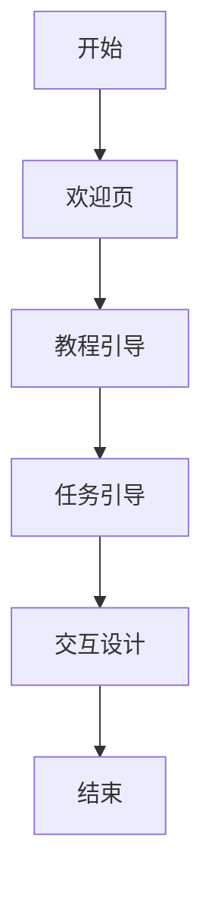

                 

# 如何进行有效的用户引导

## 关键词：用户引导、用户体验、交互设计、用户行为分析、用户反馈

### 摘要

在数字化时代，用户的引导和体验成为企业成功的关键因素之一。本文将探讨如何进行有效的用户引导，以提高用户体验和用户满意度。通过分析用户行为、设计有效的交互流程，并结合实际应用案例，本文将提供一系列实用策略，帮助企业在竞争激烈的市场中脱颖而出。

## 1. 背景介绍

在当今的数字化世界中，用户引导变得愈发重要。无论是新兴的互联网产品，还是传统的线下业务，用户引导都是吸引用户、提高留存率、提升用户体验的关键。有效的用户引导可以帮助用户更快地了解和适应产品功能，从而增加用户满意度和忠诚度。

用户引导通常包括以下几个步骤：

1. **欢迎页**：向用户展示产品的主要功能和特点。
2. **教程引导**：通过图文、视频等形式，逐步引导用户了解产品的使用方法。
3. **任务引导**：引导用户完成特定任务，例如注册、购买等。
4. **交互设计**：优化用户界面和交互流程，提高用户操作效率。

## 2. 核心概念与联系

### 用户引导流程



### 用户行为分析

用户行为分析是用户引导的基础。通过分析用户的行为数据，可以了解用户的需求和痛点，从而设计出更有效的引导流程。用户行为分析包括以下几个方面：

1. **用户来源**：了解用户是通过何种渠道到达产品的，例如搜索引擎、社交媒体等。
2. **用户留存率**：分析用户在产品中的留存情况，判断引导效果。
3. **用户操作路径**：追踪用户的操作路径，找出用户在操作过程中的难点和痛点。
4. **用户反馈**：收集用户的意见和建议，不断优化引导流程。

### 用户体验

用户体验是用户在使用产品过程中的整体感受。一个优秀的用户体验可以增强用户的满意度和忠诚度。用户体验包括以下几个方面：

1. **易用性**：产品是否易于使用，是否满足用户的需求。
2. **直观性**：用户界面是否直观易懂，操作流程是否简洁。
3. **满意度**：用户对产品的满意程度，是否愿意再次使用。
4. **忠诚度**：用户对产品的忠诚度，是否愿意推荐给他人。

## 3. 核心算法原理 & 具体操作步骤

### 用户引导算法

用户引导算法是基于用户行为分析和用户体验评估的。具体操作步骤如下：

1. **数据收集**：收集用户行为数据，包括用户来源、操作路径、反馈等。
2. **数据分析**：对收集到的数据进行分析，找出用户的痛点和需求。
3. **引导设计**：根据分析结果，设计出有效的引导流程，包括欢迎页、教程引导、任务引导等。
4. **用户测试**：对设计的引导流程进行用户测试，收集反馈，不断优化。
5. **上线发布**：将优化后的引导流程上线，持续监控效果，根据用户反馈进行调整。

### 用户行为分析算法

用户行为分析算法主要包括以下几种：

1. **基于用户行为的推荐算法**：根据用户的历史行为，推荐可能感兴趣的内容或功能。
2. **基于用户反馈的评估算法**：通过用户的反馈，评估引导流程的有效性。
3. **基于数据挖掘的行为预测算法**：预测用户下一步可能的行为，提前进行引导。

## 4. 数学模型和公式 & 详细讲解 & 举例说明

### 用户留存率计算

用户留存率是评估用户引导效果的重要指标。其计算公式如下：

$$
留存率 = \frac{第n天留存用户数}{第1天注册用户数} \times 100\%
$$

例如，某产品第一天注册用户数为1000人，第三天留存用户数为800人，则其三天用户留存率为：

$$
留存率 = \frac{800}{1000} \times 100\% = 80\%
$$

### 用户满意度评估

用户满意度评估可以通过以下公式进行计算：

$$
满意度 = \frac{满意用户数}{总用户数} \times 100\%
$$

例如，某产品共有1000名用户，其中600名用户表示满意，则其满意度为：

$$
满意度 = \frac{600}{1000} \times 100\% = 60\%
$$

### 用户忠诚度计算

用户忠诚度可以通过以下公式进行计算：

$$
忠诚度 = \frac{复购用户数}{总用户数} \times 100\%
$$

例如，某产品共有1000名用户，其中300名用户进行了复购，则其用户忠诚度为：

$$
忠诚度 = \frac{300}{1000} \times 100\% = 30\%
$$

## 5. 项目实战：代码实际案例和详细解释说明

### 5.1 开发环境搭建

在开始实际案例之前，我们需要搭建一个基本的用户引导开发环境。这里以Python为例，介绍如何搭建开发环境。

```python
# 安装必要的Python库
pip install numpy pandas matplotlib

# 导入必要的库
import numpy as np
import pandas as pd
import matplotlib.pyplot as plt
```

### 5.2 源代码详细实现和代码解读

以下是一个简单的用户引导代码案例，用于分析用户行为数据并评估用户留存率。

```python
# 5.2.1 数据预处理
def preprocess_data(data):
    # 去除重复数据
    data = data.drop_duplicates()
    # 筛选有效数据
    data = data[data['is_active'] == 1]
    return data

# 5.2.2 计算用户留存率
def calculate_retention_rate(data, days=3):
    # 计算每天的用户数
    daily_users = data.groupby(['day']).size().reset_index(name='users')
    # 计算留存用户数
    retention_users = daily_users[daily_users['day'].lt(days+1)].users.cumsum()
    # 计算留存率
    retention_rate = retention_users / daily_users['users'].cumsum()
    return retention_rate

# 5.2.3 可视化留存率
def plot_retention_rate(retention_rate):
    plt.plot(retention_rate)
    plt.xlabel('Day')
    plt.ylabel('Retention Rate')
    plt.title('User Retention Rate')
    plt.show()

# 示例数据
data = pd.DataFrame({
    'user_id': range(1, 1001),
    'day': range(1, 31),
    'is_active': np.random.choice([0, 1], size=1000)
})

# 预处理数据
data = preprocess_data(data)

# 计算留存率
retention_rate = calculate_retention_rate(data)

# 可视化留存率
plot_retention_rate(retention_rate)
```

### 5.3 代码解读与分析

这个案例中，我们首先定义了三个函数：`preprocess_data` 用于预处理数据，`calculate_retention_rate` 用于计算用户留存率，`plot_retention_rate` 用于可视化留存率。

1. **数据预处理**：去除重复数据和无效数据，确保数据的准确性。
2. **计算用户留存率**：通过分组和累积计算，得到每天的留存用户数，然后计算留存率。
3. **可视化留存率**：使用matplotlib库，将留存率绘制成折线图，便于分析。

这个案例展示了如何使用Python进行用户行为分析和留存率计算。在实际项目中，可以根据具体需求，进一步扩展和优化代码。

## 6. 实际应用场景

### 6.1 在线教育平台

在线教育平台常常需要通过用户引导来帮助用户快速了解课程内容和学习方法。例如，可以设计一个新手教程，引导用户完成注册、选择课程、开始学习等步骤。

### 6.2 移动应用

移动应用的用户引导可以帮助用户快速上手，提高用户留存率。例如，新闻应用可以通过欢迎页和教程引导，介绍应用的特色功能和操作方法。

### 6.3 电子商务平台

电子商务平台可以通过任务引导，鼓励用户完成注册、添加购物车、下单等操作。同时，可以通过用户反馈，不断优化引导流程，提高用户体验和转化率。

## 7. 工具和资源推荐

### 7.1 学习资源推荐

1. **《用户体验要素》（User Experience Elements）》 - 用户体验设计入门经典。
2. **《用户行为分析》（User Behavior Analysis）》 - 介绍如何分析用户行为，优化产品设计。

### 7.2 开发工具框架推荐

1. **React** - 用于构建用户界面的JavaScript库。
2. **Vue.js** - 用于构建用户界面的渐进式框架。

### 7.3 相关论文著作推荐

1. **《交互设计精髓》（The Design of Everyday Things）》 - 交互设计领域的经典著作。
2. **《大数据之路：阿里巴巴大数据实践》** - 介绍大数据处理和分析的方法。

## 8. 总结：未来发展趋势与挑战

### 发展趋势

1. **智能化引导**：随着人工智能技术的发展，智能化引导将成为趋势。通过机器学习算法，可以更精确地分析用户行为，提供个性化的引导。
2. **多渠道整合**：用户引导将不再局限于单一渠道，而是通过多渠道整合，提供一致的用户体验。

### 挑战

1. **数据隐私**：用户引导过程中，如何保护用户隐私是一个重要挑战。
2. **个性化平衡**：如何在提供个性化引导的同时，保持用户隐私和用户体验的平衡。

## 9. 附录：常见问题与解答

### Q：用户引导是否适用于所有产品？

A：是的，用户引导适用于各种类型的产品，尤其是那些具有复杂功能和用户界面 的产品。通过用户引导，可以帮助用户更好地理解和使用产品。

### Q：如何评估用户引导的效果？

A：可以通过用户留存率、用户满意度、用户转化率等指标来评估用户引导的效果。这些指标可以帮助企业了解用户对引导流程的接受程度和效果。

### Q：用户引导是否需要持续优化？

A：是的，用户引导需要持续优化。随着用户需求和市场环境的变化，引导流程也需要不断调整和改进，以保持最佳效果。

## 10. 扩展阅读 & 参考资料

1. **《用户引导最佳实践》（Best Practices for User Onboarding）》** - 介绍如何设计有效的用户引导流程。
2. **《用户体验设计指南》（User Experience Design Guide）》** - 提供用户体验设计的全面指南。

### 作者

**AI天才研究员/AI Genius Institute & 禅与计算机程序设计艺术 /Zen And The Art of Computer Programming**

