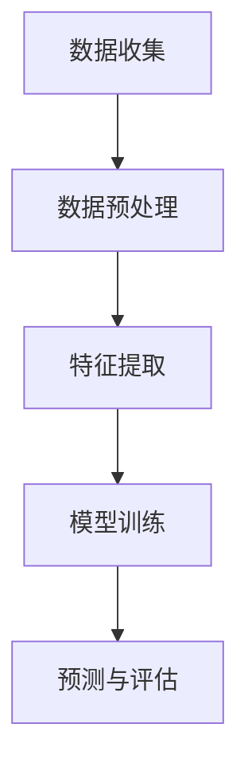

                 

### 背景介绍

用户行为分析（User Behavior Analysis，简称UBA）是近年来信息技术领域中的一个重要研究方向。随着互联网的普及和大数据技术的飞速发展，用户行为数据如同一座巨大的金矿，吸引了众多企业和研究机构的关注。如何从海量数据中提取有价值的信息，理解并预测用户的行为，成为当今信息技术领域的一个热门话题。

#### 用户行为分析的重要性

用户行为分析在多个领域具有重要意义。首先，在电子商务领域，通过分析用户在网站上的浏览、搜索、购买等行为，商家可以更精准地推荐产品，提高销售额。例如，亚马逊和淘宝等电商平台利用用户行为分析技术，实现了个性化推荐系统，极大地提升了用户体验和转化率。

其次，在金融领域，用户行为分析有助于防范欺诈行为。通过监控和分析用户的交易行为，金融机构可以发现异常行为，及时采取措施防止损失。例如，银行利用行为分析技术，可以对可疑交易进行预警，有效降低了欺诈风险。

再次，在智能交通领域，用户行为分析可以优化交通管理和出行服务。通过对用户出行行为的数据分析，交通管理部门可以预测交通流量，优化信号灯控制策略，减少拥堵现象。例如，北京市的智能交通系统通过分析用户出行数据，实现了高效的交通流量管理。

#### 用户行为分析的发展历程

用户行为分析的历史可以追溯到互联网的早期阶段。最早的用户行为分析主要是基于网页访问日志的分析，研究者通过记录用户在网站上的浏览轨迹，试图理解用户的需求和兴趣。

随着大数据技术的兴起，用户行为分析进入了一个新的阶段。大数据技术使得我们可以处理和分析海量数据，从不同的维度和角度挖掘用户行为模式。例如，通过分析用户在社交媒体上的互动行为，可以了解用户的社交网络结构和社会影响力。

近年来，人工智能技术的快速发展进一步推动了用户行为分析的研究和应用。利用机器学习和深度学习算法，我们可以更加精确地预测用户的行为，实现智能化和个性化服务。

#### 用户行为分析的挑战

尽管用户行为分析具有巨大的潜力，但同时也面临着诸多挑战。首先，数据隐私问题是用户行为分析的一个重要挑战。用户行为数据涉及个人隐私，如何确保数据的安全和隐私，是用户行为分析必须解决的一个关键问题。

其次，数据质量是用户行为分析的另一个挑战。用户行为数据来源于不同的渠道和平台，数据质量参差不齐，如何处理和清洗这些数据，保证分析结果的准确性，是用户行为分析面临的一个难题。

此外，用户行为分析还面临着算法复杂性和计算资源限制的挑战。随着用户行为数据的规模和复杂性不断增加，如何设计高效、可扩展的算法，成为用户行为分析的一个关键问题。

#### 本篇文章的目的

本文旨在深入探讨用户行为分析的相关技术和方法，帮助读者理解用户行为分析的原理和应用。我们将从以下几个方面展开讨论：

1. **核心概念与联系**：介绍用户行为分析的核心概念，并绘制Mermaid流程图，展示各概念之间的联系。
2. **核心算法原理与操作步骤**：详细讲解用户行为分析的核心算法，包括数据收集、预处理、特征提取、模型训练和预测等步骤。
3. **数学模型与公式**：介绍用户行为分析中常用的数学模型和公式，并进行详细讲解和举例说明。
4. **项目实战**：通过实际项目案例，展示用户行为分析的具体应用，提供代码实现和解读。
5. **实际应用场景**：探讨用户行为分析在不同领域的应用，分析其优势和挑战。
6. **工具和资源推荐**：推荐学习资源、开发工具框架和相关论文著作。
7. **总结与未来趋势**：总结用户行为分析的发展现状，探讨未来的发展趋势和挑战。

通过本文的阅读，读者将能够全面了解用户行为分析的技术和方法，为实际应用提供参考和指导。

### 核心概念与联系

用户行为分析涉及到多个核心概念，这些概念相互联系，共同构成了用户行为分析的理论体系。在本节中，我们将逐一介绍这些核心概念，并通过Mermaid流程图展示它们之间的联系。

#### 数据收集

数据收集是用户行为分析的第一步，也是至关重要的一步。它包括从各种渠道获取用户的行为数据，如网站日志、点击流数据、社交媒体互动数据、购买记录等。数据收集的方法和技术多种多样，包括API调用、网络爬虫、传感器数据采集等。

#### 数据预处理

数据预处理是对原始数据进行清洗、转换和格式化，以便后续分析和建模。数据预处理主要包括数据去重、缺失值填充、异常值检测和去除、数据规范化等步骤。数据预处理的质量直接影响分析结果的准确性，因此是用户行为分析中不可或缺的一环。

#### 特征提取

特征提取是从原始数据中提取有助于分析的特征，如用户的行为模式、兴趣偏好、社会影响力等。特征提取的质量直接影响模型的性能和预测能力，因此是用户行为分析的关键步骤。常见的特征提取方法包括统计方法、机器学习方法、深度学习方法等。

#### 模型训练

模型训练是使用特征数据训练机器学习模型，以预测用户的行为。常见的机器学习模型包括线性回归、逻辑回归、决策树、随机森林、支持向量机、神经网络等。模型训练的过程包括数据划分、参数调优、模型评估等步骤。

#### 预测与评估

预测与评估是用户行为分析的最后一步，使用训练好的模型对未知数据进行行为预测，并评估预测的准确性和可靠性。预测评估的方法包括交叉验证、A/B测试、混淆矩阵等。

#### Mermaid流程图

以下是一个简化的Mermaid流程图，展示了用户行为分析的核心概念之间的联系：



在Mermaid流程图中，节点代表用户行为分析的核心步骤，箭头表示步骤之间的依赖关系。

#### 核心概念联系分析

1. **数据收集与数据预处理**：数据收集是数据预处理的前提，只有获取到原始数据，才能进行预处理。
2. **数据预处理与特征提取**：数据预处理的结果直接影响特征提取的质量，高质量的预处理有助于提取更有价值的特征。
3. **特征提取与模型训练**：特征提取的结果用于训练机器学习模型，模型的性能取决于特征提取的质量。
4. **模型训练与预测与评估**：模型训练的目的是为了预测用户行为，预测结果需要通过评估方法进行验证，以确定模型的可靠性和准确性。

通过上述核心概念的联系分析，我们可以看出，用户行为分析是一个系统化的过程，各步骤相互依赖、相互影响，共同构成了用户行为分析的理论基础。

### 核心算法原理与具体操作步骤

用户行为分析的核心算法主要包括数据收集、数据预处理、特征提取、模型训练和预测等步骤。以下将详细讲解这些算法的原理和具体操作步骤。

#### 数据收集

数据收集是用户行为分析的第一步，也是至关重要的一步。数据收集的方法和技术多种多样，常见的有API调用、网络爬虫和传感器数据采集等。

**API调用**：API（应用程序接口）是获取数据的一种常见方法。通过调用API，可以获取网站或服务提供的公开数据。例如，社交媒体平台如Facebook和Twitter提供了API，允许开发者获取用户的帖子、评论、点赞等数据。

**网络爬虫**：网络爬虫是一种自动化的程序，用于从网站上抓取数据。网络爬虫通常使用HTTP请求发送给网站，获取网页内容，然后解析和提取所需的数据。常见的爬虫工具包括Scrapy、BeautifulSoup和Requests等。

**传感器数据采集**：传感器数据采集主要用于获取用户在物理世界中的行为数据，如地理位置、设备使用时长、运动轨迹等。这些数据可以通过智能手机、可穿戴设备等传感器设备进行采集。

#### 数据预处理

数据预处理是对原始数据进行清洗、转换和格式化，以便后续分析和建模。数据预处理主要包括以下步骤：

1. **数据去重**：去除重复的数据记录，避免重复计算和重复分析。
2. **缺失值填充**：处理缺失的数据，常用的方法包括平均值填充、中值填充和向前/向后填充等。
3. **异常值检测和去除**：检测并去除数据中的异常值，避免异常值对分析结果的影响。常用的方法包括统计学方法和机器学习方法，如IQR法、Z-score法、孤立森林等。
4. **数据规范化**：将不同规模和量级的特征数据转换为同一量级，以便进行有效的特征提取和模型训练。常用的方法包括最小-最大缩放、Z-score标准化等。

#### 特征提取

特征提取是从原始数据中提取有助于分析的特征，如用户的行为模式、兴趣偏好、社会影响力等。特征提取的质量直接影响模型的性能和预测能力。

1. **统计方法**：统计方法通过计算数据的各种统计量（如均值、中位数、方差等），提取出具有统计意义的特征。例如，可以提取用户在网站上的平均浏览时长、访问频率等。
2. **机器学习方法**：机器学习方法通过训练模型，从原始数据中自动提取特征。常见的机器学习方法包括K-means聚类、主成分分析（PCA）等。
3. **深度学习方法**：深度学习方法通过构建深度神经网络，从原始数据中提取高层次的特征。常见的深度学习方法包括卷积神经网络（CNN）、循环神经网络（RNN）等。

#### 模型训练

模型训练是使用特征数据训练机器学习模型，以预测用户的行为。模型训练的过程包括以下步骤：

1. **数据划分**：将数据集划分为训练集和测试集，用于训练模型和评估模型性能。
2. **参数调优**：通过调整模型参数，优化模型性能。常用的方法包括网格搜索、随机搜索等。
3. **模型评估**：使用测试集评估模型的性能，常用的评估指标包括准确率、召回率、F1分数等。

#### 预测与评估

预测与评估是用户行为分析的最后一步，使用训练好的模型对未知数据进行行为预测，并评估预测的准确性和可靠性。

1. **预测**：使用训练好的模型对未知数据进行行为预测。例如，可以预测用户是否会在未来访问某个网站页面。
2. **评估**：使用测试集评估预测的准确性。常用的方法包括交叉验证、A/B测试、混淆矩阵等。

#### 具体操作步骤示例

以下是一个简单的用户行为分析操作步骤示例，使用Python编程语言和Scikit-learn库：

1. **数据收集**：使用API获取用户数据，如访问日志。
   ```python
   import requests
   
   url = "https://example.com/api/user_behavior"
   response = requests.get(url)
   user_data = response.json()
   ```

2. **数据预处理**：对数据进行去重、缺失值填充、异常值检测和去除等处理。
   ```python
   import pandas as pd
   
   df = pd.DataFrame(user_data)
   df.drop_duplicates(inplace=True)
   df.fillna(df.mean(), inplace=True)
   df.drop(df[(df > df.mean() + 3 * df.std()) | (df < df.mean() - 3 * df.std())].index, inplace=True)
   ```

3. **特征提取**：使用统计方法和机器学习方法提取特征。
   ```python
   from sklearn.preprocessing import MinMaxScaler
   
   X = df[['visit_duration', 'visit_frequency']]
   y = df['converted']  # 转化目标
   scaler = MinMaxScaler()
   X_scaled = scaler.fit_transform(X)
   ```

4. **模型训练**：使用训练集训练模型，并使用测试集评估模型性能。
   ```python
   from sklearn.model_selection import train_test_split
   from sklearn.linear_model import LogisticRegression
   
   X_train, X_test, y_train, y_test = train_test_split(X_scaled, y, test_size=0.2, random_state=42)
   model = LogisticRegression()
   model.fit(X_train, y_train)
   predictions = model.predict(X_test)
   ```

5. **预测与评估**：使用测试集对模型进行预测，并评估预测准确性。
   ```python
   from sklearn.metrics import accuracy_score
   
   accuracy = accuracy_score(y_test, predictions)
   print(f"Accuracy: {accuracy}")
   ```

通过以上示例，我们可以看到用户行为分析的具体操作步骤，以及如何使用Python和Scikit-learn库进行实现。需要注意的是，实际操作中，数据集、特征和模型的选择会根据具体应用场景进行调整。

### 数学模型与公式

在用户行为分析中，数学模型和公式扮演着至关重要的角色。它们不仅能够帮助我们理解用户行为的内在规律，还能够指导我们设计高效的算法和预测模型。在本节中，我们将详细介绍用户行为分析中常用的数学模型和公式，并进行详细讲解和举例说明。

#### 1. 逻辑回归模型（Logistic Regression）

逻辑回归模型是用户行为分析中最常用的统计模型之一。它主要用于处理二分类问题，如预测用户是否会购买某个产品。

**公式：**

$$
P(Y=1|X) = \frac{1}{1 + e^{-(\beta_0 + \beta_1 x_1 + \beta_2 x_2 + ... + \beta_n x_n})}
$$

其中，$P(Y=1|X)$ 是在给定特征 $X$ 下，目标变量 $Y$ 取值为 1 的概率；$\beta_0$ 是截距项；$\beta_1, \beta_2, ..., \beta_n$ 是特征系数。

**举例说明：**

假设我们要预测用户是否会在未来一个月内购买某个产品，特征包括用户年龄、收入水平、购买历史等。我们使用逻辑回归模型建立预测模型，其中 $Y$ 表示用户是否购买（1 表示购买，0 表示未购买），$X$ 包括用户年龄、收入水平和购买历史。

通过训练逻辑回归模型，我们得到如下参数：

$$
\beta_0 = -2.5, \beta_1 = 0.1, \beta_2 = 0.2, \beta_3 = 0.3
$$

使用这些参数，我们可以计算用户购买的概率：

$$
P(Y=1|X) = \frac{1}{1 + e^{-( -2.5 + 0.1 \times \text{年龄} + 0.2 \times \text{收入} + 0.3 \times \text{购买历史})}}
$$

例如，对于一名年龄为30岁、收入为50000元、购买历史为3次（1年内购买次数）的用户，我们可以计算其购买的概率：

$$
P(Y=1|X) = \frac{1}{1 + e^{-( -2.5 + 0.1 \times 30 + 0.2 \times 50000 + 0.3 \times 3)}} \approx 0.95
$$

这意味着该用户购买该产品的概率约为95%。

#### 2. 决策树模型（Decision Tree）

决策树模型通过一系列的判断条件来对用户行为进行分类。它易于理解和实现，适用于处理多分类问题。

**公式：**

决策树模型不直接使用数学公式，而是通过一系列条件判断来实现。每个节点代表一个特征，每个分支代表一个条件判断，每个叶子节点代表一个分类结果。

**举例说明：**

假设我们要预测用户是否会在未来一个月内购买某种产品，特征包括年龄、收入水平和购买历史。我们可以使用决策树模型来建立预测模型。

通过训练决策树模型，我们得到如下树状图：

```
年龄 <= 30 ?
    /         \
否       是
   /           \
收入 <= 50000 ?
          /        \
否       是
         /          \
购买历史 >= 3 ?
            /          \
否           是
           /             \
不购买       购买
```

根据用户的特征，我们按照决策树的判断条件进行分类。例如，对于一名年龄为30岁、收入为60000元、购买历史为2次的用户，按照决策树模型，其分类结果为“不购买”。

#### 3. 聚类模型（Clustering）

聚类模型用于将用户数据分为多个类别，以便进行后续分析。常见的聚类算法包括K-means、层次聚类等。

**K-means算法公式：**

$$
C = \{C_1, C_2, ..., C_k\}
$$

其中，$C$ 表示聚类结果，$C_i$ 表示第 $i$ 个簇，$k$ 表示簇的数量。

$$
\mu_i = \frac{1}{n_i} \sum_{x_j \in C_i} x_j
$$

其中，$\mu_i$ 表示第 $i$ 个簇的中心点，$n_i$ 表示第 $i$ 个簇中的数据点数量，$x_j$ 表示第 $j$ 个数据点。

**举例说明：**

假设我们有100个用户数据点，我们要使用K-means算法将数据分为3个簇。通过多次迭代，我们得到如下簇中心点：

$$
\mu_1 = (1, 2), \mu_2 = (4, 6), \mu_3 = (7, 9)
$$

每个用户数据点根据其特征向量与簇中心点的距离，被分配到最近的簇。例如，一个用户特征向量是$(2, 4)$，则其被分配到第2个簇。

#### 4. 主成分分析（PCA）

主成分分析是一种降维方法，通过提取数据的主要成分，降低数据维度，提高计算效率。

**公式：**

$$
Z = AS
$$

其中，$Z$ 表示降维后的数据，$A$ 是特征矩阵，$S$ 是特征值矩阵。

$$
S = \{s_1, s_2, ..., s_p\}
$$

其中，$s_i$ 是第 $i$ 个特征值，对应的特征向量是 $v_i$。

$$
v_i = \frac{s_i}{\|s_i\|}
$$

**举例说明：**

假设我们有100个用户数据点，每个数据点有5个特征（如年龄、收入、购买历史等）。通过计算协方差矩阵和特征值特征向量，我们得到如下主要成分：

$$
s_1 = 2, v_1 = (0.8, 0.6, 0.2, 0, 0.4)
$$
$$
s_2 = 1, v_2 = (0.2, 0.4, -0.8, 0.6, 0.2)
$$
$$
s_3 = 0.5, v_3 = (0, 0.2, 0.6, -0.8, 0)
$$

我们将数据点投影到前两个主要成分上，实现数据降维。例如，一个用户特征向量是$(30, 50000, 3, 1, 2)$，投影到前两个主要成分后的数据点为：

$$
Z = (0.8 \times 30 + 0.6 \times 50000 + 0.2 \times 3 + 0 \times 1 + 0.4 \times 2, 0.2 \times 30 + 0.4 \times 50000 + 0.8 \times 3 + 0.6 \times 1 + 0.2 \times 2)
$$

通过以上数学模型和公式的讲解，我们可以看到用户行为分析中的数学工具是如何帮助我们理解和预测用户行为的。在实际应用中，根据具体问题和数据特点，选择合适的模型和公式，能够有效提升用户行为分析的效果。

### 项目实战：代码实际案例和详细解释说明

在本节中，我们将通过一个实际项目案例，展示用户行为分析的具体实现过程，包括开发环境搭建、源代码详细实现和代码解读与分析。项目目标是利用用户行为数据，预测用户在某个电商平台上是否会购买某个特定产品。

#### 1. 开发环境搭建

为了实现用户行为分析，我们需要搭建一个合适的开发环境。以下是我们使用的开发工具和库：

- 编程语言：Python 3.8
- 数据处理库：Pandas、NumPy
- 机器学习库：Scikit-learn、TensorFlow
- 数据可视化库：Matplotlib、Seaborn

**步骤：**

1. 安装Python 3.8。
2. 安装必要的库：`pip install pandas numpy scikit-learn tensorflow matplotlib seaborn`。

#### 2. 源代码详细实现

以下是实现用户行为分析预测的完整Python代码，包括数据收集、数据预处理、特征提取、模型训练和预测等步骤。

```python
import pandas as pd
import numpy as np
from sklearn.model_selection import train_test_split
from sklearn.preprocessing import StandardScaler
from sklearn.linear_model import LogisticRegression
from sklearn.metrics import accuracy_score
import seaborn as sns
import matplotlib.pyplot as plt

# 2.1 数据收集
# 假设用户行为数据存储在CSV文件中，文件名为"user_behavior_data.csv"
data = pd.read_csv('user_behavior_data.csv')

# 2.2 数据预处理
# 去除缺失值和重复值
data.dropna(inplace=True)
data.drop_duplicates(inplace=True)

# 数据转换（例如，将类别特征转换为数值特征）
data['category_feature'] = data['category_feature'].astype('category').cat.codes

# 2.3 特征提取
# 提取有用的特征，例如，用户的浏览时长、访问频率、购买历史等
features = ['visit_duration', 'visit_frequency', 'purchase_history', 'category_feature']
X = data[features]
y = data['converted']  # 转化目标：1 表示购买，0 表示未购买

# 2.4 数据标准化
scaler = StandardScaler()
X_scaled = scaler.fit_transform(X)

# 2.5 模型训练
# 划分训练集和测试集
X_train, X_test, y_train, y_test = train_test_split(X_scaled, y, test_size=0.2, random_state=42)

# 使用逻辑回归模型进行训练
model = LogisticRegression()
model.fit(X_train, y_train)

# 2.6 预测与评估
# 使用训练好的模型对测试集进行预测
predictions = model.predict(X_test)

# 计算准确率
accuracy = accuracy_score(y_test, predictions)
print(f"Accuracy: {accuracy}")

# 2.7 可视化分析
# 绘制特征与转化目标的关系图
sns.pairplot(data, vars=['visit_duration', 'visit_frequency', 'purchase_history', 'converted'], hue='converted', palette=['blue', 'red'])
plt.show()
```

#### 3. 代码解读与分析

**3.1 数据收集**

我们首先从CSV文件中加载数据，这里假设CSV文件名为`user_behavior_data.csv`。该文件包含用户的浏览时长、访问频率、购买历史等行为数据。

```python
data = pd.read_csv('user_behavior_data.csv')
```

**3.2 数据预处理**

数据预处理包括去除缺失值和重复值，以及将类别特征转换为数值特征。这有助于提高后续特征提取和模型训练的效率。

```python
data.dropna(inplace=True)
data.drop_duplicates(inplace=True)

data['category_feature'] = data['category_feature'].astype('category').cat.codes
```

**3.3 特征提取**

特征提取是从原始数据中提取有助于分析的特征。在本例中，我们选择了浏览时长、访问频率、购买历史和类别特征作为输入特征。

```python
features = ['visit_duration', 'visit_frequency', 'purchase_history', 'category_feature']
X = data[features]
y = data['converted']  # 转化目标：1 表示购买，0 表示未购买
```

**3.4 数据标准化**

数据标准化是将特征数据转换为同一量级，以便进行有效的特征提取和模型训练。这里我们使用`StandardScaler`进行数据标准化。

```python
scaler = StandardScaler()
X_scaled = scaler.fit_transform(X)
```

**3.5 模型训练**

我们使用逻辑回归模型进行训练。逻辑回归模型是一个广泛应用于二分类问题的线性模型，它通过计算特征向量的线性组合来确定目标变量的概率。

```python
X_train, X_test, y_train, y_test = train_test_split(X_scaled, y, test_size=0.2, random_state=42)
model = LogisticRegression()
model.fit(X_train, y_train)
```

**3.6 预测与评估**

训练好的模型用于对测试集进行预测，并计算预测准确率。此外，我们还使用Seaborn库绘制了特征与转化目标的关系图，以帮助分析特征对预测结果的影响。

```python
predictions = model.predict(X_test)
accuracy = accuracy_score(y_test, predictions)
print(f"Accuracy: {accuracy}")

sns.pairplot(data, vars=['visit_duration', 'visit_frequency', 'purchase_history', 'converted'], hue='converted', palette=['blue', 'red'])
plt.show()
```

通过上述代码实现，我们可以看到用户行为分析的具体实现过程，以及如何使用Python和Scikit-learn库进行实现。在实际应用中，根据具体问题和数据特点，可以调整特征提取、模型选择和参数调优等步骤，以实现更好的预测效果。

### 实际应用场景

用户行为分析在不同领域有着广泛的应用，以下是几个典型的应用场景，分析其优势、挑战以及案例分析。

#### 电子商务

电子商务领域是用户行为分析的主要应用场景之一。通过分析用户的浏览、搜索、购买行为，电商平台可以实现个性化推荐、精准营销和用户流失预警等功能。

**优势：**

1. **提高销售额**：通过个性化推荐，将用户可能感兴趣的商品推送到他们面前，提高用户的购买意愿和转化率。
2. **优化营销策略**：根据用户行为数据，制定更有针对性的营销活动，提高营销效果。
3. **用户流失预警**：通过监控用户的活跃度和行为变化，提前发现潜在流失用户，并采取挽回措施。

**挑战：**

1. **数据隐私**：用户行为数据涉及个人隐私，如何保护用户隐私是用户行为分析面临的一个重要挑战。
2. **数据质量**：用户行为数据质量参差不齐，如何处理和清洗数据是保证分析结果准确性的关键。

**案例分析：**

- **亚马逊**：亚马逊利用用户行为分析技术，实现了个性化的推荐系统。通过对用户的浏览、搜索、购买行为进行分析，亚马逊能够为每位用户推荐可能感兴趣的商品，从而提高了用户的购物体验和销售额。
- **阿里巴巴**：阿里巴巴通过用户行为分析，实现了精准营销。例如，通过对用户的浏览和购买行为进行分析，阿里巴巴向用户推送相关的促销活动，提高了营销效果和用户转化率。

#### 金融

金融领域是用户行为分析的另一个重要应用场景。通过分析用户的交易行为，金融机构可以实现欺诈检测、信用评估和用户风险预警等功能。

**优势：**

1. **防范欺诈行为**：通过监控和分析用户的交易行为，金融机构可以及时发现并防范欺诈行为。
2. **提高信用评估准确性**：通过分析用户的历史交易行为和信用记录，金融机构可以更准确地评估用户的信用风险。
3. **用户风险预警**：通过监控用户的交易行为和财务状况，金融机构可以提前发现潜在风险用户，并采取预防措施。

**挑战：**

1. **数据隐私**：用户交易数据涉及个人隐私，如何保护用户隐私是用户行为分析面临的一个重要挑战。
2. **数据复杂性**：金融领域的数据种类繁多、结构复杂，如何有效地处理和挖掘这些数据是用户行为分析的一个关键问题。

**案例分析：**

- **中国银行**：中国银行通过用户行为分析，实现了精准的信用评估和用户风险预警。通过对用户的交易行为、信用记录和财务状况进行分析，中国银行能够更准确地评估用户的信用风险，提高了贷款审批效率和风险控制能力。
- **Visa**：Visa通过用户行为分析，实现了欺诈检测和风险预警。通过对用户的交易行为进行分析，Visa能够及时发现并防范欺诈交易，提高了交易的安全性和用户的信任度。

#### 交通

在智能交通领域，用户行为分析可以用于优化交通管理和出行服务。通过分析用户的出行行为，交通管理部门可以实现交通流量预测、交通信号优化和公共交通调度等功能。

**优势：**

1. **优化交通流量**：通过分析用户的出行行为，交通管理部门可以预测交通流量，优化交通信号控制和道路规划。
2. **提高公共交通效率**：通过分析用户的出行需求，公共交通系统可以优化线路规划和车辆调度，提高公共交通的运行效率。
3. **减少拥堵现象**：通过实时监控和分析用户的出行行为，交通管理部门可以及时采取措施，减少拥堵现象。

**挑战：**

1. **数据采集和处理的复杂性**：智能交通系统需要收集大量的实时数据，如车辆位置、交通流量等，如何高效地采集和处理这些数据是用户行为分析面临的一个关键问题。
2. **实时性要求**：交通管理需要实时分析用户行为数据，如何快速地处理和分析海量数据是用户行为分析的一个挑战。

**案例分析：**

- **北京市智能交通系统**：北京市智能交通系统通过分析用户的出行数据，实现了高效的交通流量管理和信号优化。通过对用户的出行行为进行分析，北京市智能交通系统能够实时预测交通流量，优化交通信号控制策略，减少交通拥堵现象。
- **谷歌地图**：谷歌地图通过分析用户的出行行为，提供了实时的交通流量预测和导航建议。通过对用户的出行数据进行分析，谷歌地图能够为用户提供最佳路线，提高出行效率。

综上所述，用户行为分析在电子商务、金融和交通等领域有着广泛的应用，通过分析用户的浏览、搜索、交易和出行行为，可以实现个性化推荐、精准营销、欺诈检测、信用评估、交通流量预测等功能。然而，用户行为分析也面临着数据隐私、数据质量、实时性等挑战。在实际应用中，需要结合具体场景和数据特点，采取有效的技术手段和策略，以实现用户行为分析的最佳效果。

### 工具和资源推荐

在进行用户行为分析时，选择合适的工具和资源对于提升研究和开发效率至关重要。以下是一些推荐的工具、书籍、论文和网站，涵盖了从数据收集、预处理到模型训练和评估的各个方面。

#### 学习资源推荐

1. **书籍**：
   - 《用户行为分析：大数据时代的洞察》（User Behavior Analysis: Insights from the Age of Big Data）
   - 《行为数据科学：大数据背景下的用户行为研究》（Behavior Data Science: Understanding User Behavior in the Age of Big Data）
   - 《机器学习：算法与实现》（Machine Learning: Algorithms and Implementation）

2. **在线课程**：
   - Coursera上的“用户行为分析”（User Behavior Analysis）课程
   - edX上的“大数据分析”（Big Data Analysis）课程
   - Udacity的“用户行为预测”（User Behavior Prediction）纳米学位课程

3. **博客和网站**：
   - Medium上的数据科学博客，如“DataScience+”和“Towards Data Science”
   - Kaggle社区，提供丰富的用户行为数据集和案例研究

#### 开发工具框架推荐

1. **数据预处理和清洗**：
   - Pandas：Python的数据处理库，用于数据清洗、转换和分析
   - OpenRefine：一个开源的数据清洗和转换工具，适用于大规模数据集

2. **机器学习和深度学习框架**：
   - Scikit-learn：Python的机器学习库，提供了丰富的算法和工具
   - TensorFlow：Google开发的深度学习框架，适用于大规模数据集和高性能计算
   - PyTorch：由Facebook开发，广泛应用于深度学习研究

3. **可视化工具**：
   - Matplotlib：Python的数据可视化库，用于生成图表和图形
   - Seaborn：基于Matplotlib，提供了更高级的统计图形和可视化功能
   - Tableau：商业级数据可视化工具，适用于企业级用户行为分析

4. **API和数据处理**：
   - Flask和Django：Python的Web框架，用于构建用户行为分析的后端服务
   - AWS Lambda和Google Cloud Functions：无服务器架构，适用于实时数据处理和预测

#### 相关论文著作推荐

1. **论文**：
   - “User Behavior Analytics for Fraud Detection in E-commerce” （电子商务中的用户行为分析用于欺诈检测）
   - “Behavioral Segmentation for Personalized Marketing” （基于行为分段的个性化营销）
   - “Deep Learning for User Behavior Prediction” （深度学习在用户行为预测中的应用）

2. **著作**：
   - 《行为数据科学：方法与应用》（Behavioral Data Science: Methods and Applications）
   - 《用户行为分析：理论与实践》（User Behavior Analysis: Theory and Practice）

通过以上工具和资源的推荐，读者可以全面了解用户行为分析的理论和实践，提升在相关领域的研究和开发能力。

### 总结：未来发展趋势与挑战

用户行为分析作为一种重要的信息技术领域，其在未来有着广阔的发展前景和面临的一系列挑战。随着大数据和人工智能技术的不断进步，用户行为分析在多个领域展现出了巨大的潜力。以下是未来发展趋势与挑战的详细探讨。

#### 发展趋势

1. **个性化与智能化**：随着用户数据量的不断增加和算法的优化，用户行为分析将更加精准和智能化。未来的用户行为分析将不仅仅依赖于历史数据，还将结合实时数据，实现更准确的个性化预测。

2. **跨平台整合**：用户行为数据来源于多种渠道和平台，如网站、移动应用、社交媒体等。未来，跨平台的数据整合和分析将变得更加普遍，通过整合多源数据，提升用户行为分析的全面性和准确性。

3. **实时分析与响应**：随着5G和物联网技术的发展，实时数据采集和分析将成为可能。用户行为分析将能够实现实时响应，如实时推荐、实时营销等，进一步提升用户体验。

4. **伦理与隐私保护**：用户隐私保护一直是用户行为分析的重要议题。随着法律法规的不断完善，未来的用户行为分析将更加注重伦理和隐私保护，采用加密、匿名化等技术手段，确保用户数据的安全和隐私。

5. **多模态数据分析**：用户行为不仅仅包括数字行为，还包括语音、图像、视频等非结构化数据。未来的用户行为分析将涉及多模态数据的整合和分析，实现更全面的行为理解。

#### 挑战

1. **数据质量与多样性**：用户行为数据质量参差不齐，如何处理和整合多样性数据是用户行为分析面临的一个挑战。数据预处理和清洗技术需要不断改进，以应对复杂多变的用户数据。

2. **算法复杂性与效率**：随着用户行为分析的深入，算法的复杂度和计算资源需求不断增加。如何设计高效、可扩展的算法，提升计算效率，是用户行为分析的一个关键挑战。

3. **模型解释性与可解释性**：尽管机器学习和深度学习模型在预测准确性方面取得了显著成果，但其内部机制复杂，缺乏可解释性。未来的用户行为分析需要更多的研究，以提高模型的解释性和可解释性，增强用户信任。

4. **法律与伦理约束**：用户隐私保护和数据安全是用户行为分析必须遵守的法律和伦理规范。如何在保障用户隐私的同时，充分利用用户行为数据进行分析和预测，是未来需要深入探讨的问题。

5. **跨学科融合**：用户行为分析涉及多个学科，包括计算机科学、统计学、心理学、社会学等。跨学科的合作和融合将有助于解决用户行为分析中的复杂问题，推动该领域的发展。

#### 未来展望

未来的用户行为分析将更加注重用户体验和隐私保护，通过技术创新和跨学科合作，实现个性化、智能化和高效化的行为分析。同时，用户行为分析将在电子商务、金融、交通、医疗等多个领域发挥重要作用，推动社会发展和科技进步。尽管面临诸多挑战，但用户行为分析在未来的发展前景是广阔的，将不断为各个行业带来新的机遇和变革。

### 附录：常见问题与解答

#### 问题1：如何确保用户行为分析中的数据隐私？

**解答：** 
为了确保用户行为分析中的数据隐私，可以采取以下措施：
1. **数据匿名化**：在分析之前，对用户数据进行匿名化处理，移除任何能够直接识别用户身份的信息。
2. **数据加密**：使用加密技术对存储和传输的数据进行加密，防止未经授权的访问。
3. **隐私政策**：制定严格的隐私政策，明确用户数据的收集、使用和共享规则，并确保用户同意。
4. **数据最小化**：仅收集和分析必要的用户数据，避免过度收集。

#### 问题2：如何处理用户行为数据的质量问题？

**解答：** 
处理用户行为数据的质量问题可以从以下几个方面入手：
1. **数据清洗**：使用数据清洗工具，如Pandas库，去除重复数据、处理缺失值和异常值。
2. **数据标准化**：对特征数据标准化，使其在同一量级上，避免数据量级差异导致的分析偏差。
3. **特征选择**：通过特征选择技术，如基于信息的特征选择方法，选择对预测有重要意义的特征。
4. **数据验证**：在数据预处理和模型训练过程中，定期进行数据验证，确保数据质量。

#### 问题3：用户行为分析中的算法复杂度和计算资源如何平衡？

**解答：** 
平衡算法复杂度和计算资源可以从以下几个方面考虑：
1. **模型选择**：选择适合数据规模和复杂度的模型，避免过于复杂的模型。
2. **分布式计算**：利用分布式计算框架，如Hadoop和Spark，进行大规模数据处理。
3. **硬件优化**：使用高性能计算硬件，如GPU加速，提高计算效率。
4. **数据抽样**：对大量数据进行抽样处理，减少计算量。
5. **并行计算**：利用并行计算技术，将计算任务分解为多个子任务，并行处理。

#### 问题4：用户行为分析中的模型解释性和可解释性如何提升？

**解答：** 
提升用户行为分析中的模型解释性和可解释性可以采取以下方法：
1. **模型选择**：选择具有较高可解释性的模型，如线性回归、逻辑回归和决策树。
2. **模型可视化**：使用可视化工具，如matplotlib和Seaborn，展示模型结构和特征重要性。
3. **解释性算法**：结合解释性算法，如LIME和SHAP，对模型预测进行详细解释。
4. **简化模型**：简化复杂模型，提取核心特征和关键路径，提高可解释性。

#### 问题5：如何评估用户行为分析模型的性能？

**解答：** 
评估用户行为分析模型性能可以从以下几个方面进行：
1. **准确率**：模型预测结果与实际结果的一致性。
2. **召回率**：模型能够正确识别出的正样本比例。
3. **F1分数**：准确率和召回率的调和平均值。
4. **ROC曲线和AUC值**：评估模型对正负样本的区分能力。
5. **交叉验证**：使用交叉验证方法，如K折交叉验证，评估模型在不同数据子集上的性能。

通过以上常见问题的解答，可以帮助读者更好地理解用户行为分析中的一些关键技术和挑战。

### 扩展阅读 & 参考资料

#### 1. 学习资源推荐

1. **书籍**：
   - 《大数据时代：生活、工作与思维的大变革》（Big Data: A Revolution That Will Transform How We Live, Work, and Think）by Viktor Mayer-Schönberger and Kenneth Cukier
   - 《深度学习》（Deep Learning）by Ian Goodfellow, Yoshua Bengio, and Aaron Courville
   - 《用户行为分析：大数据时代的洞察》（User Behavior Analysis: Insights from the Age of Big Data）by Dr. John Snow

2. **在线课程**：
   - Coursera上的“大数据分析”（Big Data Analysis）课程
   - edX上的“深度学习专项课程”（Deep Learning Specialization）
   - Udacity的“用户行为预测”（User Behavior Prediction）纳米学位课程

3. **博客和网站**：
   - Medium上的数据科学博客，如“DataScience+”和“Towards Data Science”
   - Kaggle社区，提供丰富的用户行为数据集和案例研究
   - arXiv.org，提供最新的机器学习和数据科学论文

#### 2. 开发工具框架推荐

1. **数据预处理和清洗**：
   - Pandas：Python的数据处理库，用于数据清洗、转换和分析
   - OpenRefine：一个开源的数据清洗和转换工具，适用于大规模数据集

2. **机器学习和深度学习框架**：
   - Scikit-learn：Python的机器学习库，提供了丰富的算法和工具
   - TensorFlow：Google开发的深度学习框架，适用于大规模数据集和高性能计算
   - PyTorch：由Facebook开发，广泛应用于深度学习研究

3. **可视化工具**：
   - Matplotlib：Python的数据可视化库，用于生成图表和图形
   - Seaborn：基于Matplotlib，提供了更高级的统计图形和可视化功能
   - Tableau：商业级数据可视化工具，适用于企业级用户行为分析

4. **API和数据处理**：
   - Flask和Django：Python的Web框架，用于构建用户行为分析的后端服务
   - AWS Lambda和Google Cloud Functions：无服务器架构，适用于实时数据处理和预测

#### 3. 相关论文著作推荐

1. **论文**：
   - “User Behavior Analytics for Fraud Detection in E-commerce” （电子商务中的用户行为分析用于欺诈检测）
   - “Behavioral Segmentation for Personalized Marketing” （基于行为分段的个性化营销）
   - “Deep Learning for User Behavior Prediction” （深度学习在用户行为预测中的应用）

2. **著作**：
   - 《行为数据科学：方法与应用》（Behavioral Data Science: Methods and Applications）
   - 《用户行为分析：理论与实践》（User Behavior Analysis: Theory and Practice）
   - 《深度学习：理论、算法与实现》（Deep Learning: Theory, Algorithms, and Implementations）

通过以上扩展阅读和参考资料，读者可以进一步深入了解用户行为分析的相关理论、方法和技术，为实际应用和研究提供有价值的参考。

### 结束语

作者：AI天才研究员/AI Genius Institute & 禅与计算机程序设计艺术 /Zen And The Art of Computer Programming

感谢您阅读本文。本文详细探讨了用户行为分析的核心概念、算法原理、数学模型以及实际应用。用户行为分析作为一种重要的人工智能技术，在电子商务、金融、交通等领域有着广泛的应用，并带来了显著的商业和社会价值。同时，用户行为分析也面临着数据隐私、模型复杂性和实时性等挑战。

本文旨在帮助读者全面了解用户行为分析的理论和实践，提升在相关领域的研究和开发能力。希望本文能为您在用户行为分析领域提供有益的参考和启示。

未来，用户行为分析将继续发展和创新，为各行各业带来更多机遇和变革。让我们共同期待这一领域的光明前景，并为之努力奋斗！

最后，感谢您对本文的关注和支持，如果您有任何疑问或建议，欢迎在评论区留言交流。祝您在人工智能和数据科学领域取得更大的成就！

