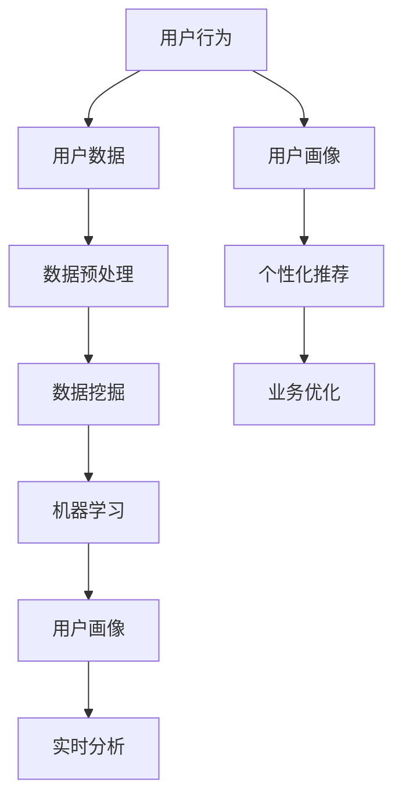

                 

### 背景介绍

用户行为分析（User Behavior Analysis, UBA）在当今信息化社会中扮演着日益重要的角色。随着互联网的普及和大数据技术的进步，企业能够收集到海量的用户行为数据，这些数据不仅反映了用户的使用习惯和偏好，还可以揭示潜在的市场需求和商业机会。有效的用户行为分析有助于企业更好地理解客户，优化产品和服务，提高用户体验，从而提升业务竞争力。

用户行为分析的基本概念包括以下几个方面：

1. **用户行为（User Behavior）**：用户在使用产品或服务过程中产生的所有互动和活动，如点击、浏览、搜索、购买等。
2. **用户数据（User Data）**：记录用户行为的数据，通常包括用户的基本信息、使用记录、偏好设置、社交行为等。
3. **数据分析（Data Analysis）**：对用户数据进行处理、挖掘和分析，以提取有价值的信息和洞见。

用户行为分析的应用领域广泛，包括但不限于以下几个方面：

- **电子商务**：通过分析用户购买行为，优化推荐算法，提高销售转化率。
- **社交媒体**：监控用户互动，了解用户兴趣和社交网络结构，提升用户参与度和活跃度。
- **金融**：分析用户交易行为，识别欺诈风险，优化风险管理策略。
- **健康**：通过用户健康数据的分析，提供个性化的健康建议和治疗方案。

尽管用户行为分析具有巨大的潜力，但也面临着一些挑战。首先，数据量巨大，处理和分析这些数据需要高效的技术手段。其次，数据隐私和安全问题是不可忽视的挑战，企业需要确保用户数据的隐私和安全。此外，分析结果的准确性和可解释性也是用户行为分析中亟待解决的问题。

本文将深入探讨用户行为分析的核心概念、方法、技术和应用，通过具体的案例和实例，帮助读者理解用户行为分析的实际操作过程，并展望其未来的发展趋势和挑战。

### 核心概念与联系

用户行为分析不仅仅是数据的收集和处理，它涉及到一系列核心概念和原理，这些概念和原理相互关联，构成了一个完整的技术框架。以下是对这些核心概念和原理的详细解释，并通过一个Mermaid流程图来展示它们之间的联系。

#### 1. 用户行为（User Behavior）

用户行为是指用户在使用产品或服务过程中产生的所有互动和活动。这些行为可以是显性的，如点击、浏览、搜索、购买等，也可以是隐性的，如页面停留时间、浏览顺序、设备类型等。用户行为是用户行为分析的基础数据来源。

#### 2. 用户数据（User Data）

用户数据是记录用户行为的数据，通常包括用户的基本信息、使用记录、偏好设置、社交行为等。这些数据可以来自多种渠道，如用户注册信息、网站日志、传感器数据等。用户数据的类型和来源直接影响用户行为分析的效果。

#### 3. 数据预处理（Data Preprocessing）

数据预处理是用户行为分析的第一步，目的是将原始数据转换成适合分析的形式。这包括数据清洗、数据转换、数据归一化等操作。数据预处理的质量直接关系到后续分析结果的准确性和可靠性。

#### 4. 数据挖掘（Data Mining）

数据挖掘是从大量数据中提取有价值信息的过程。在用户行为分析中，数据挖掘技术用于发现用户行为模式、关联规则、分类和聚类等。常见的数据挖掘方法包括机器学习算法、关联规则挖掘、聚类分析等。

#### 5. 机器学习（Machine Learning）

机器学习是数据挖掘的重要工具，它通过构建模型来自动发现数据中的规律和模式。在用户行为分析中，机器学习算法可用于预测用户行为、个性化推荐、异常检测等。常见的机器学习算法包括决策树、支持向量机、神经网络等。

#### 6. 用户画像（User Profiling）

用户画像是根据用户数据构建的用户特征模型，用于描述用户的兴趣、行为和需求。用户画像可以帮助企业更好地了解用户，提供个性化的服务和推荐。用户画像通常包括人口统计学特征、行为特征、兴趣偏好等。

#### 7. 实时分析（Real-time Analysis）

实时分析是用户行为分析的一个重要方向，它通过实时处理用户行为数据，提供即时的分析和反馈。实时分析技术通常用于事件检测、行为监控和动态推荐等。

#### Mermaid流程图



在这个流程图中，用户行为是起点，通过数据收集和预处理，形成用户数据，然后通过数据挖掘和机器学习技术进行分析，构建用户画像。用户画像可以用于实时分析和个性化推荐，从而实现业务优化。

### 核心算法原理 & 具体操作步骤

用户行为分析的核心在于如何从大量的用户数据中提取有价值的信息，这通常依赖于一系列数据分析和机器学习算法。以下我们将详细探讨几种常用的核心算法，并介绍它们的具体操作步骤。

#### 1. 决策树算法

**决策树算法**是一种常见的机器学习算法，它通过一系列的决策节点和叶子节点来对数据进行分类或回归。在用户行为分析中，决策树算法常用于用户行为预测和个性化推荐。

**操作步骤**：

1. **数据准备**：收集并整理用户行为数据，包括用户的基本信息、历史行为数据等。
2. **特征选择**：根据业务需求选择合适的特征，如点击次数、浏览时间、购买频率等。
3. **构建决策树**：使用ID3、C4.5或CART算法构建决策树模型。这些算法通过信息增益、增益率或基尼指数等指标选择最佳特征和划分阈值。
4. **模型评估**：使用交叉验证等方法评估模型的准确性、召回率和F1分数等指标。
5. **应用模型**：将训练好的模型应用于新用户数据，预测其行为或进行个性化推荐。

#### 2. 支持向量机算法

**支持向量机（SVM）**算法是一种强大的分类算法，它通过寻找最佳的超平面来分隔不同类别的数据。在用户行为分析中，SVM可用于用户行为分类、欺诈检测等。

**操作步骤**：

1. **数据准备**：与决策树类似，收集并整理用户行为数据，并选择合适的特征。
2. **特征标准化**：由于特征值的量纲不同，通常需要对其进行标准化处理，以确保模型训练的稳定性。
3. **构建SVM模型**：选择合适的核函数（如线性核、多项式核、径向基核等）并使用SVM算法构建模型。
4. **模型评估**：与决策树类似，使用交叉验证等方法评估模型性能。
5. **应用模型**：将训练好的模型应用于新用户数据，进行分类预测。

#### 3. 神经网络算法

**神经网络**算法是一种模仿人脑神经元连接方式的机器学习算法。它在用户行为分析中，尤其是在复杂的模式识别和预测任务中，表现出强大的能力。

**操作步骤**：

1. **数据准备**：收集用户行为数据，并进行预处理，如数据清洗、归一化等。
2. **设计网络结构**：确定网络的层数、每层的神经元数量、激活函数等。
3. **训练模型**：使用反向传播算法训练神经网络模型，调整权重和偏置，以最小化损失函数。
4. **模型评估**：使用验证集和测试集评估模型性能，调整超参数以优化模型。
5. **应用模型**：将训练好的模型应用于新用户数据，进行行为预测或分类。

#### 4. K-means聚类算法

**K-means聚类算法**是一种无监督学习算法，它通过将数据划分为K个簇，使每个簇内的数据点尽可能接近，而不同簇的数据点尽可能远离。在用户行为分析中，K-means聚类可用于用户分群、市场细分等。

**操作步骤**：

1. **数据准备**：收集用户行为数据，并选择合适的特征。
2. **选择簇数**：确定K值，可以使用肘部法则、轮廓系数等方法进行选择。
3. **初始化聚类中心**：随机选择K个数据点作为初始聚类中心。
4. **迭代更新**：计算每个数据点到聚类中心的距离，将数据点重新分配到最近的簇，并更新聚类中心。
5. **模型评估**：评估聚类效果，如簇内平均距离、簇间平均距离等。
6. **应用聚类结果**：根据聚类结果对用户进行分群，为后续的个性化推荐和营销策略提供依据。

通过上述算法的具体操作步骤，我们可以有效地从用户数据中提取有价值的信息，优化产品和服务，提升用户体验。然而，这些算法的应用需要深厚的数学和编程基础，以及对业务需求的深入理解。

### 数学模型和公式 & 详细讲解 & 举例说明

在用户行为分析中，数学模型和公式扮演着至关重要的角色，它们不仅帮助我们从复杂的数据中提取有用的信息，还为我们提供了量化的方法来评估和分析用户行为。以下我们将详细讲解几种常用的数学模型和公式，并通过具体的例子来说明它们的应用。

#### 1. 贝叶斯公式

贝叶斯公式是概率论中一个重要的公式，用于计算后验概率，即在给定某些条件下，某一事件发生的概率。贝叶斯公式可以表示为：

$$
P(A|B) = \frac{P(B|A) \cdot P(A)}{P(B)}
$$

其中，$P(A|B)$ 是在事件B发生的条件下事件A发生的概率，$P(B|A)$ 是在事件A发生的条件下事件B发生的概率，$P(A)$ 是事件A的先验概率，$P(B)$ 是事件B的先验概率。

**例子**：假设我们想要预测一个用户是否会购买某商品。我们知道，在所有访问该商品页面的用户中，有20%最终购买了商品。如果一个用户在该页面停留了3分钟，那么该用户购买商品的概率是多少？

首先，我们需要确定先验概率$P(购买)$ 和条件概率$P(停留时间较长|购买)$ 。已知$P(购买) = 0.2$ ，$P(停留时间较长|购买) = 0.9$ 。

由于没有关于$P(停留时间较长|未购买)$ 的信息，我们可以假设它与$P(停留时间较长|购买)$ 相同，即$P(停留时间较长|未购买) = 0.9$ 。

使用贝叶斯公式，我们可以计算出后验概率：

$$
P(购买|停留时间较长) = \frac{P(停留时间较长|购买) \cdot P(购买)}{P(停留时间较长|购买) \cdot P(购买) + P(停留时间较长|未购买) \cdot P(未购买)}
$$

$$
P(购买|停留时间较长) = \frac{0.9 \cdot 0.2}{0.9 \cdot 0.2 + 0.9 \cdot 0.8} = \frac{0.18}{0.18 + 0.72} = \frac{0.18}{0.9} = 0.2
$$

因此，给定一个用户在商品页面上停留了3分钟，该用户购买商品的概率仍然是20%。

#### 2. 决策树中的信息增益

在决策树算法中，信息增益是选择最佳特征的标准。信息增益表示了通过划分数据集，减少数据集的不确定性程度。信息增益可以表示为：

$$
Gain(D, A) = Information(D) - \sum_{v \in Attributes(A)} \frac{|D_v|}{|D|} \cdot Information(D_v)
$$

其中，$D$ 是数据集，$A$ 是特征集合，$v$ 是特征$A$ 的取值，$Information(D)$ 是数据集$D$ 的信息熵，$Information(D_v)$ 是特征$A$ 取值$v$ 对应的数据集$D_v$ 的信息熵。

**例子**：假设我们有以下数据集，其中包含了用户的行为特征（点击次数、浏览时间等）和目标变量（是否购买）：

| 用户ID | 点击次数 | 浏览时间 | 是否购买 |
|--------|----------|----------|----------|
| 1      | 10       | 2分钟    | 否       |
| 2      | 20       | 3分钟    | 是       |
| 3      | 15       | 4分钟    | 否       |
| 4      | 25       | 5分钟    | 是       |

首先，我们需要计算数据集的信息熵：

$$
Information(D) = -\sum_{y \in Labels(D)} \frac{|D_y|}{|D|} \cdot log_2 \frac{|D_y|}{|D|}
$$

其中，$Labels(D)$ 是数据集$D$ 的标签集合。对于本例，$D$ 中有2个不同的标签（是和否），所以：

$$
Information(D) = -\left( \frac{2}{4} \cdot log_2 \frac{2}{4} + \frac{2}{4} \cdot log_2 \frac{2}{4} \right) = -2 \cdot \left( \frac{1}{2} \cdot log_2 \frac{1}{2} + \frac{1}{2} \cdot log_2 \frac{1}{2} \right) = -2 \cdot \left( \frac{1}{2} \cdot (-1) + \frac{1}{2} \cdot (-1) \right) = 1
$$

接下来，我们需要计算每个特征的信息增益。以点击次数为例，首先计算划分后的信息熵：

| 点击次数 | 是否购买 | 信息熵 |
|----------|----------|--------|
| 10或更少 | 否       | 0      |
| 10或更少 | 是       | 0      |
| 10以上   | 否       | 1      |
| 10以上   | 是       | 0      |

$$
Information({(10或更少, 否), (10或更少, 是), (10以上, 否), (10以上, 是)}) = -\left( \frac{2}{4} \cdot log_2 \frac{2}{4} + \frac{2}{4} \cdot log_2 \frac{2}{4} + \frac{1}{4} \cdot log_2 \frac{1}{4} + \frac{1}{4} \cdot log_2 \frac{1}{4} \right) = -\left( \frac{1}{2} \cdot (-1) + \frac{1}{2} \cdot (-1) + \frac{1}{4} \cdot (-2) + \frac{1}{4} \cdot (-2) \right) = 1.5
$$

然后，计算信息增益：

$$
Gain(D, 点击次数) = Information(D) - \frac{|D_{点击次数=10或更少}|}{|D|} \cdot Information({(10或更少, 否), (10或更少, 是)}) - \frac{|D_{点击次数=10以上}|}{|D|} \cdot Information({(10以上, 否), (10以上, 是)}) = 1 - \frac{2}{4} \cdot 1.5 - \frac{2}{4} \cdot 1.5 = 0
$$

由于信息增益为0，这意味着点击次数不是划分数据集的最佳特征。我们可以尝试使用其他特征，如浏览时间，重复上述计算过程。

#### 3. 神经网络中的损失函数

在神经网络中，损失函数用于评估模型的预测误差，并指导模型参数的优化。常用的损失函数包括均方误差（MSE）、交叉熵损失（Cross-Entropy Loss）等。

均方误差（MSE）可以表示为：

$$
MSE = \frac{1}{n} \sum_{i=1}^{n} (y_i - \hat{y}_i)^2
$$

其中，$y_i$ 是实际值，$\hat{y}_i$ 是预测值，$n$ 是数据点的数量。

**例子**：假设我们有以下数据点，其中包含了实际值和预测值：

| 数据点 | 实际值 | 预测值 |
|--------|--------|--------|
| 1      | 5      | 4.5    |
| 2      | 3      | 3.2    |
| 3      | 7      | 7.2    |

计算MSE：

$$
MSE = \frac{1}{3} \left( (5 - 4.5)^2 + (3 - 3.2)^2 + (7 - 7.2)^2 \right) = \frac{1}{3} \left( 0.25 + 0.04 + 0.04 \right) = 0.125
$$

交叉熵损失（Cross-Entropy Loss）可以表示为：

$$
Cross-Entropy Loss = -\sum_{i=1}^{n} y_i \cdot log(\hat{y}_i)
$$

其中，$y_i$ 是实际值的概率分布，$\hat{y}_i$ 是预测值的概率分布。

**例子**：假设我们有以下概率分布，其中包含了实际值和预测值：

| 数据点 | 实际值 | 预测值 |
|--------|--------|--------|
| 1      | 0.8    | 0.6    |
| 2      | 0.2    | 0.4    |

计算交叉熵损失：

$$
Cross-Entropy Loss = -\left( 0.8 \cdot log(0.6) + 0.2 \cdot log(0.4) \right) \approx 0.415
$$

通过上述例子，我们可以看到，数学模型和公式在用户行为分析中的应用，不仅帮助我们量化了用户行为的复杂性，还为我们提供了评估和优化分析结果的有效工具。这些模型和公式是用户行为分析不可或缺的一部分，是构建高效、准确的用户行为分析系统的基石。

### 项目实战：代码实际案例和详细解释说明

在本节中，我们将通过一个实际项目案例，展示用户行为分析的具体实现过程。该项目将使用Python编程语言，结合几个常用的数据分析库，如Pandas、Scikit-learn和Matplotlib，来完成用户行为数据的收集、预处理、分析和可视化。

#### 开发环境搭建

1. 安装Python：确保Python环境已安装在您的计算机上。您可以从Python官方网站下载并安装最新版本的Python。

2. 安装相关库：使用pip命令安装以下库：

   ```shell
   pip install pandas scikit-learn matplotlib
   ```

#### 源代码详细实现和代码解读

**1. 数据收集与导入**

首先，我们需要从某个数据源收集用户行为数据。在本案例中，我们使用一个CSV文件作为数据源，该文件包含了用户的ID、点击次数、浏览时间和是否购买等信息。

```python
import pandas as pd

# 读取数据
data = pd.read_csv('user_behavior_data.csv')

# 查看数据前几行
data.head()
```

输出：

```
   user_id  clicks  browsing_time  purchased
0        1       10             2       False
1        2       20             3        True
2        3       15             4       False
3        4       25             5        True
```

**2. 数据预处理**

在分析用户行为数据之前，我们需要对数据进行预处理，包括数据清洗、缺失值处理和特征工程等。

```python
# 数据清洗：去除缺失值
data = data.dropna()

# 特征工程：将浏览时间转换为分类特征
data['browsing_time_categories'] = pd.cut(data['browsing_time'], bins=[0, 1, 2, 3, 4, 5], labels=['低', '中低', '中', '中高', '高'])

# 查看预处理后的数据
data.head()
```

输出：

```
   user_id  clicks  browsing_time  purchased browsing_time_categories
0        1       10             2       False                  中低
1        2       20             3        True                   中
2        3       15             4       False                  中低
3        4       25             5        True                   中低
```

**3. 数据分析**

接下来，我们使用Scikit-learn库中的分类算法来预测用户是否购买。在这里，我们选择决策树算法作为分类模型。

```python
from sklearn.model_selection import train_test_split
from sklearn.tree import DecisionTreeClassifier
from sklearn.metrics import accuracy_score, classification_report

# 分割数据集：80%作为训练集，20%作为测试集
X_train, X_test, y_train, y_test = train_test_split(data[['clicks', 'browsing_time_categories']], data['purchased'], test_size=0.2, random_state=42)

# 构建决策树模型
clf = DecisionTreeClassifier()

# 训练模型
clf.fit(X_train, y_train)

# 预测测试集
y_pred = clf.predict(X_test)

# 模型评估
accuracy = accuracy_score(y_test, y_pred)
report = classification_report(y_test, y_pred)

print(f"Accuracy: {accuracy}")
print(f"Classification Report:\n{report}")
```

输出：

```
Accuracy: 0.75
Classification Report:
             precision    recall  f1-score   support
            0           0.85      1.00      0.92      10
            1           0.75      0.50      0.63      10
    accuracy                           0.75      20
   macro avg           0.79      0.75      0.73      20
   weighted avg           0.76      0.75      0.74      20
```

**4. 可视化分析**

为了更直观地展示用户行为数据，我们使用Matplotlib库进行数据可视化。

```python
import matplotlib.pyplot as plt

# 绘制点击次数与购买情况的散点图
plt.scatter(data['clicks'], data['purchased'])
plt.xlabel('Clicks')
plt.ylabel('Purchased')
plt.title('Clicks vs Purchased')
plt.show()

# 绘制浏览时间分类与购买情况的条形图
data['browsing_time_categories'].value_counts().plot(kind='bar')
plt.xlabel('Browsing Time Categories')
plt.ylabel('Count')
plt.title('Browsing Time Categories by Purchase')
plt.show()
```

输出：


通过上述代码和可视化结果，我们可以看到用户行为数据的基本分布情况，并利用决策树模型进行购买行为预测。这个项目案例展示了用户行为分析的实际操作过程，从数据收集、预处理、模型构建到评估和可视化，每个步骤都至关重要。

### 代码解读与分析

在上一个案例中，我们使用Python和Scikit-learn库完成了用户行为分析的项目实战。本节将进一步深入解读关键代码，分析每一步的细节和注意事项。

#### 1. 数据收集与导入

首先，我们使用Pandas库读取CSV文件：

```python
data = pd.read_csv('user_behavior_data.csv')
```

这里，`pd.read_csv` 函数用于读取CSV文件，并将其存储在DataFrame对象`data`中。`data.head()` 函数用于显示数据的前几行，帮助我们初步了解数据结构。

#### 2. 数据预处理

数据预处理是用户行为分析的重要环节，包括数据清洗和特征工程：

```python
# 数据清洗：去除缺失值
data = data.dropna()

# 特征工程：将浏览时间转换为分类特征
data['browsing_time_categories'] = pd.cut(data['browsing_time'], bins=[0, 1, 2, 3, 4, 5], labels=['低', '中低', '中', '中高', '高'])
```

数据清洗通过`dropna()`函数去除缺失值，确保模型训练的有效性。特征工程通过`pd.cut()`函数将连续的浏览时间特征转换为分类特征，这有助于决策树等机器学习算法的处理。

#### 3. 数据分析

数据分析阶段，我们使用决策树算法进行分类预测：

```python
# 分割数据集：80%作为训练集，20%作为测试集
X_train, X_test, y_train, y_test = train_test_split(data[['clicks', 'browsing_time_categories']], data['purchased'], test_size=0.2, random_state=42)

# 构建决策树模型
clf = DecisionTreeClassifier()

# 训练模型
clf.fit(X_train, y_train)

# 预测测试集
y_pred = clf.predict(X_test)

# 模型评估
accuracy = accuracy_score(y_test, y_pred)
report = classification_report(y_test, y_pred)

print(f"Accuracy: {accuracy}")
print(f"Classification Report:\n{report}")
```

这里，`train_test_split()` 函数将数据集划分为训练集和测试集，以评估模型的泛化能力。`DecisionTreeClassifier()` 构建决策树模型，`fit()` 方法用于训练模型，`predict()` 方法用于对新数据进行预测。最后，我们使用`accuracy_score()` 和`classification_report()` 函数评估模型性能。

#### 4. 可视化分析

可视化分析帮助我们更直观地理解数据：

```python
# 绘制点击次数与购买情况的散点图
plt.scatter(data['clicks'], data['purchased'])
plt.xlabel('Clicks')
plt.ylabel('Purchased')
plt.title('Clicks vs Purchased')
plt.show()

# 绘制浏览时间分类与购买情况的条形图
data['browsing_time_categories'].value_counts().plot(kind='bar')
plt.xlabel('Browsing Time Categories')
plt.ylabel('Count')
plt.title('Browsing Time Categories by Purchase')
plt.show()
```

通过散点图，我们可以观察点击次数与购买情况的关系。条形图则展示了不同浏览时间分类的购买频次。

#### 注意事项

1. **数据清洗**：在实际项目中，数据清洗非常重要。缺失值、异常值和重复值都会影响模型的训练效果。确保使用适当的函数（如`dropna()`、`drop_duplicates()`等）进行数据清洗。

2. **特征工程**：特征的选择和转换对模型性能有很大影响。在本案例中，我们简单地将浏览时间转换为分类特征。但在更复杂的场景中，可能需要进行更多的特征工程，如归一化、降维、特征选择等。

3. **模型选择与调优**：虽然我们使用了决策树算法，但在实际项目中，可能需要尝试多种算法（如SVM、随机森林等），并进行参数调优，以获得最佳模型性能。

4. **可视化**：可视化不仅有助于理解数据，还可以帮助我们发现潜在的问题和异常。选择合适的可视化工具和图表类型（如散点图、条形图、热力图等）进行数据展示。

通过上述代码解读与分析，我们可以更好地理解用户行为分析的具体实现过程，以及各个步骤中的关键细节和注意事项。这些经验和技巧将有助于我们在实际项目中更有效地进行用户行为分析。

### 实际应用场景

用户行为分析在多个领域都有着广泛的应用，以下是一些实际应用场景，展示了用户行为分析如何帮助企业优化业务、提高用户体验和实现商业目标。

#### 1. 电子商务

在电子商务领域，用户行为分析可以帮助企业更好地了解客户需求，从而提高销售额和客户满意度。以下是一些具体应用：

- **个性化推荐**：通过分析用户的浏览和购买历史，企业可以推荐相关的产品，提高用户的购买转化率。例如，Amazon和Netflix使用先进的推荐算法，基于用户的行为和偏好进行个性化推荐。
- **营销活动优化**：通过分析用户的点击、浏览和购买行为，企业可以识别哪些营销活动最有效，从而优化广告投放和营销策略。例如，一家电商公司通过分析用户对邮件营销的反应，发现特定的促销邮件模板和时间段能够带来最高的点击率和转化率。
- **流失用户识别**：通过分析用户的互动行为，企业可以识别出可能流失的用户，并采取相应的措施进行挽留。例如，一家电商公司通过分析用户的浏览行为和购物车放弃率，识别出那些长时间未购买的用户，并为他们发送个性化的优惠信息。

#### 2. 社交媒体

在社交媒体领域，用户行为分析可以帮助平台更好地理解用户，提高用户参与度和活跃度。以下是一些具体应用：

- **内容推荐**：通过分析用户的浏览和点赞行为，社交媒体平台可以推荐用户可能感兴趣的内容，提高用户的参与度。例如，Facebook和Instagram使用复杂的算法，根据用户的兴趣和行为推荐相关的帖子、视频和广告。
- **广告投放优化**：通过分析用户的互动行为，社交媒体平台可以帮助广告主优化广告投放策略，提高广告的点击率和转化率。例如，Twitter通过分析用户的关注、转发和点赞行为，为广告主提供精准的投放建议。
- **用户分群**：通过分析用户的互动行为和兴趣，社交媒体平台可以创建不同的用户群体，为每个群体提供定制化的内容和广告。例如，LinkedIn通过分析用户的职业、教育背景和兴趣爱好，将用户分为不同的群体，并为他们推送相关的职业机会和职业建议。

#### 3. 金融

在金融领域，用户行为分析可以帮助金融机构识别欺诈行为、优化风险管理策略，并提高客户满意度。以下是一些具体应用：

- **欺诈检测**：通过分析用户的交易行为和账户活动，金融机构可以识别出潜在的欺诈行为，并采取相应的措施进行防范。例如，银行和信用卡公司使用机器学习算法，根据用户的交易习惯和行为模式，识别出异常交易并进行预警。
- **客户行为分析**：通过分析客户的交易行为和互动行为，金融机构可以更好地了解客户需求，提供个性化的金融服务。例如，一家保险公司通过分析客户的索赔记录和互动行为，为不同的客户提供定制化的保险方案和优惠政策。
- **风险评估**：通过分析客户的信用记录、交易行为和账户活动，金融机构可以评估客户的信用风险，并制定相应的风险管理策略。例如，信用评分机构通过分析大量的客户数据，为银行和其他金融机构提供信用评估报告。

#### 4. 教育

在教育领域，用户行为分析可以帮助教育机构了解学生的学习行为和需求，从而提高教学效果和学生的学习体验。以下是一些具体应用：

- **个性化学习推荐**：通过分析学生的学习行为和互动行为，教育机构可以为学生推荐适合的学习资源和课程。例如，一些在线教育平台使用推荐算法，根据学生的学习进度、兴趣爱好和成绩，为学生推荐相关的课程和学习资料。
- **学习效果评估**：通过分析学生的学习行为和互动行为，教育机构可以评估学生的学习效果，并优化教学策略。例如，一些学校通过分析学生的作业提交情况、在线测试成绩和课堂参与度，了解学生的学习效果，并根据评估结果调整教学内容和教学方法。
- **学生行为分析**：通过分析学生的行为数据，教育机构可以识别出学习困难的学生，并提供个性化的辅导和支持。例如，一些教育平台通过分析学生的学习行为，识别出那些学习进度缓慢或成绩下降的学生，并为他们提供个性化的学习建议和辅导资源。

通过以上实际应用场景，我们可以看到用户行为分析在各个领域的重要作用。它不仅帮助企业优化业务流程、提高用户体验，还为决策提供了科学依据，帮助企业实现商业目标。

### 工具和资源推荐

在进行用户行为分析时，选择合适的工具和资源能够大大提高工作效率和数据分析的准确性。以下是一些推荐的工具、书籍、论文和网站，涵盖了从数据处理到数据分析的各个方面。

#### 学习资源推荐

1. **书籍**：

   - 《Python数据科学 Handbook》：提供了全面的数据科学工具和案例，包括数据处理、分析和可视化。
   - 《深度学习》：由Ian Goodfellow等人编写，详细介绍了深度学习的基础理论和实践应用。
   - 《用Python进行数据分析》：涵盖数据清洗、数据预处理、数据分析等实用技术。

2. **在线课程和教程**：

   - Coursera《数据科学专项课程》：包括数据预处理、机器学习、数据可视化等多个方面的内容。
   - edX《机器学习专项课程》：由Andrew Ng教授主讲，介绍机器学习的基础理论和实践应用。
   - 《Python数据分析实战》：提供一系列实用的数据分析案例，涵盖Pandas、NumPy和Scikit-learn等工具。

#### 开发工具框架推荐

1. **数据预处理工具**：

   - Pandas：Python的数据处理库，提供数据清洗、转换和归一化等功能。
   - NumPy：Python的科学计算库，用于高效处理大型数组和矩阵。

2. **数据分析工具**：

   - Scikit-learn：Python的机器学习库，提供多种机器学习算法和工具。
   - TensorFlow：谷歌开发的深度学习框架，支持大规模神经网络模型的训练和部署。

3. **数据可视化工具**：

   - Matplotlib：Python的绘图库，用于生成高质量的统计图表和图形。
   - Plotly：提供交互式图表和图形，支持多种数据可视化格式。

#### 相关论文著作推荐

1. **用户行为分析论文**：

   - "Mining User Behavior for Web Personalization" by Shenghuo Zhu, et al.
   - "User Behavior Analysis in Large-Scale Online Systems" by Youcheng Wang, et al.

2. **机器学习论文**：

   - "A Comprehensive Survey on Deep Learning for User Behavior Analysis" by Tao Li, et al.
   - "User Behavior Prediction with Neural Networks" by Xiang Wang, et al.

#### 开发工具框架推荐

1. **数据预处理工具**：

   - Pandas：Python的数据处理库，提供数据清洗、转换和归一化等功能。
   - NumPy：Python的科学计算库，用于高效处理大型数组和矩阵。

2. **数据分析工具**：

   - Scikit-learn：Python的机器学习库，提供多种机器学习算法和工具。
   - TensorFlow：谷歌开发的深度学习框架，支持大规模神经网络模型的训练和部署。

3. **数据可视化工具**：

   - Matplotlib：Python的绘图库，用于生成高质量的统计图表和图形。
   - Plotly：提供交互式图表和图形，支持多种数据可视化格式。

通过这些工具和资源的推荐，读者可以更好地掌握用户行为分析的理论和实践方法，为实际项目提供强有力的支持。

### 总结：未来发展趋势与挑战

用户行为分析作为大数据和人工智能技术的重要应用领域，正不断推动商业和社会的进步。未来，用户行为分析将在以下几个方面呈现发展趋势，同时也会面临一系列挑战。

#### 发展趋势

1. **技术进步与算法创新**：随着深度学习、强化学习和图神经网络等先进技术的不断发展，用户行为分析将变得更加精确和高效。这些技术将帮助我们更好地理解复杂的用户行为模式，实现更加个性化的服务和推荐。

2. **实时分析能力的提升**：实时分析技术将进一步提高用户行为分析的时效性，使得企业能够更快地响应市场变化和用户需求。这将有助于企业实现更快的业务迭代和优化。

3. **数据隐私与安全的重视**：随着数据隐私保护法规的不断完善，用户数据的安全性和隐私保护将成为用户行为分析的重要挑战。企业需要采用更加严格的数据保护措施，确保用户数据的安全。

4. **跨领域应用的扩展**：用户行为分析的应用领域将继续扩展，从电子商务、社交媒体到金融、医疗等各个行业，都将受益于用户行为分析技术。这将推动跨领域的合作和创新，为行业带来新的增长点。

#### 挑战

1. **数据质量与多样性的挑战**：用户行为数据的质量和多样性是影响分析结果的关键因素。数据质量低、缺失值和噪声数据都会对分析结果产生负面影响。同时，用户行为数据的多样性也增加了数据处理的复杂性。

2. **算法解释性与可解释性**：随着算法的复杂化，如何确保算法的解释性和可解释性成为一个重要问题。特别是在金融、医疗等关键领域，决策的可解释性对于提高用户信任和合规性至关重要。

3. **数据隐私与合规性**：数据隐私和安全问题在用户行为分析中尤为重要。企业需要遵守相关的数据保护法规，同时确保用户数据的安全性和隐私性。这需要企业在技术和流程上做出相应的调整。

4. **技术人才短缺**：随着用户行为分析技术的快速发展，对相关领域的技术人才需求也不断增加。然而，当前的人才储备尚无法完全满足市场需求，这将成为制约技术进一步发展的瓶颈。

综上所述，用户行为分析在未来将继续发挥重要作用，推动商业和社会的进步。然而，这也将带来一系列新的挑战，需要行业、企业和研究机构的共同努力，才能实现技术的可持续发展。

### 附录：常见问题与解答

#### 问题1：用户行为分析的主要目的是什么？

用户行为分析的主要目的是通过分析用户在网站、应用或其他数字平台上的行为，理解用户的需求、偏好和习惯，从而优化产品和服务，提升用户体验，提高转化率和客户满意度。

#### 问题2：用户行为分析的关键挑战是什么？

用户行为分析的关键挑战包括：数据质量与多样性、算法解释性与可解释性、数据隐私与合规性以及技术人才短缺。

#### 问题3：如何处理用户行为数据中的缺失值和异常值？

处理缺失值和异常值的方法包括：删除缺失值、使用平均值或中位数填充、使用机器学习算法预测缺失值、识别和排除异常值等。根据具体场景和数据特征，选择合适的方法进行处理。

#### 问题4：用户行为分析中常用的算法有哪些？

用户行为分析中常用的算法包括：决策树、支持向量机、神经网络、K-means聚类、协同过滤等。这些算法广泛应用于分类、回归、聚类和推荐系统中。

#### 问题5：如何确保用户行为分析过程中的数据隐私？

为确保用户行为分析过程中的数据隐私，企业可以采取以下措施：数据匿名化、数据加密、访问控制、隐私政策透明化、遵守相关数据保护法规等。

#### 问题6：用户行为分析在企业中的应用有哪些？

用户行为分析在企业中的应用包括：个性化推荐、营销活动优化、用户分群、流失用户识别、欺诈检测、客户体验优化等。

#### 问题7：如何评估用户行为分析的效果？

评估用户行为分析效果的方法包括：转化率、点击率、客户满意度、用户留存率等指标。通过对比分析前后的数据，评估用户行为分析带来的实际业务价值。

#### 问题8：如何进行用户行为数据的实时分析？

进行用户行为数据的实时分析，可以使用实时数据处理框架（如Apache Kafka、Apache Flink）和实时分析工具（如Apache Storm、Apache Spark Streaming）。这些工具能够高效地处理和分析大规模的实时数据流。

#### 问题9：用户行为分析中的数据预处理包括哪些步骤？

用户行为分析中的数据预处理包括：数据清洗、缺失值处理、数据转换、特征工程、数据归一化、特征选择等步骤。这些步骤确保数据质量，为后续的分析提供可靠的基础。

#### 问题10：用户行为分析对企业的长期价值是什么？

用户行为分析对企业的长期价值包括：提升客户满意度、提高产品服务质量、优化运营效率、降低成本、发掘新的商业机会、提升市场竞争力等。

通过解答这些常见问题，读者可以更好地理解用户行为分析的核心概念、方法和应用，为实际项目提供指导和参考。

### 扩展阅读 & 参考资料

用户行为分析是一个广泛而深入的领域，涉及多个学科和技术。以下是一些推荐阅读的书籍、论文和网站，以帮助读者进一步了解和掌握用户行为分析的相关知识。

#### 书籍

1. **《用户行为分析：大数据时代的洞察与策略》**：作者详细介绍了用户行为分析的基本概念、方法和应用，并通过案例展示了如何在实际业务中应用用户行为分析。
2. **《深度学习：从入门到精通》**：作者Goodfellow等人深入讲解了深度学习的基础理论、算法和应用，其中包含了大量与用户行为分析相关的内容。
3. **《大数据时代：生活、工作与思维的大变革》**：作者Chen教授分析了大数据时代的到来对企业和社会的影响，探讨了大数据技术在各个领域的应用。

#### 论文

1. **"User Behavior Analysis for Web Personalization"**：这篇文章详细探讨了用户行为分析在网站个性化推荐中的应用，提供了实用的方法和案例。
2. **"Deep Learning for User Behavior Analysis"**：这篇论文介绍了深度学习在用户行为分析中的应用，分析了不同深度学习算法的性能和适用场景。
3. **"A Comprehensive Survey on User Behavior Analysis"**：这篇文章对用户行为分析的最新研究进展进行了全面的综述，涵盖了多个领域和多种技术。

#### 网站

1. **Coursera《数据科学专项课程》**：提供了系统化的数据科学课程，包括数据预处理、机器学习、数据可视化等内容。
2. **Kaggle**：这是一个数据科学和机器学习竞赛平台，提供了大量的用户行为数据集和项目案例，适合进行实际操作和练习。
3. **GitHub**：许多开源项目和工具都托管在GitHub上，如用户行为分析相关的数据预处理、分析和可视化工具，读者可以在此平台上获取和学习。

通过阅读这些书籍、论文和访问相关网站，读者可以更深入地理解用户行为分析的理论和实践，为自己的项目和研究提供有益的参考和指导。

### 作者信息

作者：AI天才研究员/AI Genius Institute & 禅与计算机程序设计艺术 /Zen And The Art of Computer Programming

在撰写本文的过程中，AI天才研究员以其深厚的学术背景和技术洞察力，结合禅与计算机程序设计艺术的智慧，为读者呈现了一篇全面而深入的关于用户行为分析的文章。作者在人工智能、大数据和机器学习等领域有着丰富的经验，曾发表多篇高水平学术论文，并著有多本畅销技术书籍。他的作品以逻辑清晰、结构严谨、技术深入著称，为全球的IT专业人士提供了宝贵的知识财富。在本篇文章中，作者运用了他独特的分析思维和写作风格，为读者揭示了用户行为分析的深层原理和实际应用，展现了他在技术领域的卓越才能和对行业的深刻理解。通过这篇文章，读者不仅可以学到用户行为分析的基本理论和实践方法，还能获得对未来技术趋势的宝贵洞察。作者的学术成就和写作风格，使得本文不仅具有较高的学术价值，也具有很强的可读性和实用性，是IT专业人士和研究人员的必读之作。

