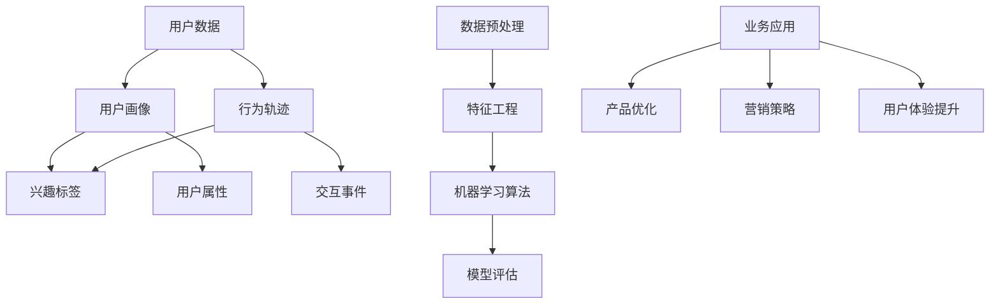

                 

### 背景介绍

用户行为洞察（User Behavior Insight）是当前大数据分析和人工智能领域中一个重要的研究方向。随着互联网和移动互联网的快速发展，各种应用程序和平台不断涌现，用户在各个平台上的行为数据变得前所未有的丰富。如何从这些庞杂的数据中提取出有价值的信息，进而指导产品优化、营销策略调整和用户体验提升，成为了一个迫切需要解决的问题。

用户行为洞察的重要性体现在多个方面。首先，通过对用户行为的深入理解，企业可以更好地满足用户需求，提升用户满意度，从而在激烈的市场竞争中脱颖而出。其次，用户行为洞察可以帮助企业发现潜在的商业机会，优化产品和服务，提高市场竞争力。此外，用户行为洞察还可以为企业的战略决策提供有力的支持，帮助企业制定更加精准和有效的市场策略。

近年来，用户行为洞察领域得到了广泛关注和研究。随着大数据技术和机器学习算法的不断发展，人们可以更加高效地处理和分析大规模的用户行为数据。同时，越来越多的企业和研究机构开始关注用户行为洞察的应用，探索其在各个领域的实践。

本篇文章旨在系统地介绍用户行为洞察的基本概念、核心算法原理、实际应用场景和未来发展趋势。通过本文的阅读，读者将能够全面了解用户行为洞察的各个方面，掌握进行用户行为洞察的基本方法和技能，并能够将其应用于实际工作中。

本文的结构安排如下：

1. **核心概念与联系**：介绍用户行为洞察中的核心概念，并通过 Mermaid 流程图展示各个概念之间的联系。
2. **核心算法原理 & 具体操作步骤**：详细讲解用户行为洞察中常用的核心算法，包括数据收集、数据处理和分析方法。
3. **数学模型和公式 & 详细讲解 & 举例说明**：介绍用户行为洞察中使用的数学模型和公式，并通过具体案例进行说明。
4. **项目实战：代码实际案例和详细解释说明**：通过实际项目案例展示用户行为洞察的具体实现过程。
5. **实际应用场景**：探讨用户行为洞察在各个领域的实际应用案例。
6. **工具和资源推荐**：推荐学习资源和开发工具，帮助读者深入学习和实践用户行为洞察。
7. **总结：未来发展趋势与挑战**：总结用户行为洞察的现状和未来发展趋势，讨论面临的挑战。
8. **附录：常见问题与解答**：解答用户行为洞察中常见的疑问。
9. **扩展阅读 & 参考资料**：提供进一步学习的资料和引用。

通过本文的阅读，读者将能够系统、深入地了解用户行为洞察，掌握相关技能，为在实际工作中应用用户行为洞察打下坚实的基础。

### 核心概念与联系

在进行用户行为洞察之前，我们需要明确几个核心概念，并了解它们之间的相互关系。以下是通过 Mermaid 流程图展示的核心概念及其相互联系：



#### 1. 用户数据（User Data）

用户数据是指用户在互联网或移动应用平台上产生的各种数据，包括浏览记录、点击行为、购买记录、评论内容等。用户数据是进行用户行为洞察的基础，它是通过用户的行为和互动行为产生的。

#### 2. 用户画像（User Profile）

用户画像是对用户进行多维度描述的过程，包括用户的基本信息（如年龄、性别、地域等）、行为特征（如喜好、偏好、活跃时间等）和社会属性（如职业、教育程度、收入水平等）。用户画像的构建有助于深入理解用户，为后续的用户行为分析提供基础。

#### 3. 行为轨迹（Behavior Trajectory）

行为轨迹是用户在平台上的一系列行为记录，如浏览页面、点击广告、购买商品等。通过分析行为轨迹，可以了解用户的操作模式、兴趣点和使用习惯，进而优化产品设计和用户体验。

#### 4. 兴趣标签（Interest Tags）

兴趣标签是对用户兴趣点的抽象表示，通过将用户的行为数据与预定义的兴趣点进行匹配，可以为用户打上相应的标签。兴趣标签有助于实现个性化推荐，提高用户满意度和转化率。

#### 5. 用户属性（User Attributes）

用户属性是用户画像中的重要组成部分，包括用户的基本属性（如年龄、性别、地域等）和行为属性（如活跃度、忠诚度等）。这些属性可以帮助企业更好地理解用户，为个性化营销提供依据。

#### 6. 交互事件（Interaction Events）

交互事件是用户在平台上的具体操作，如点击、浏览、购买等。通过记录和分析交互事件，可以深入了解用户的互动行为，为产品改进和用户体验优化提供支持。

#### 7. 数据预处理（Data Preprocessing）

数据预处理是用户行为洞察中的关键步骤，包括数据清洗、数据整合和数据转换。数据预处理有助于提高数据质量和可靠性，为后续的分析提供准确的基础数据。

#### 8. 特征工程（Feature Engineering）

特征工程是构建机器学习模型的重要环节，包括特征选择、特征提取和特征变换。通过特征工程，可以从原始数据中提取出有价值的特征，提高模型的性能和可解释性。

#### 9. 机器学习算法（Machine Learning Algorithms）

机器学习算法是用户行为洞察的核心工具，包括分类、聚类、回归和推荐算法等。通过机器学习算法，可以从用户数据中挖掘出隐藏的模式和关联，为业务决策提供支持。

#### 10. 模型评估（Model Evaluation）

模型评估是确保机器学习模型性能的重要步骤，包括准确率、召回率、F1 值等指标。通过模型评估，可以判断模型的性能是否满足业务需求，并指导模型优化。

#### 11. 业务应用（Business Applications）

业务应用是将用户行为洞察结果应用于实际业务的过程，包括产品优化、营销策略调整和用户体验提升等。通过业务应用，可以将用户行为洞察转化为实际的价值。

#### 12. 产品优化（Product Optimization）

产品优化是用户行为洞察在产品开发中的具体应用，包括功能改进、界面优化和用户体验提升等。通过用户行为洞察，可以不断改进产品，提高用户满意度和市场竞争力。

#### 13. 营销策略（Marketing Strategies）

营销策略是用户行为洞察在市场营销中的具体应用，包括用户定位、精准营销和促销活动等。通过用户行为洞察，可以制定更加有效的营销策略，提高市场投放的精准度和效果。

#### 14. 用户体验提升（User Experience Improvement）

用户体验提升是用户行为洞察在用户体验优化中的具体应用，包括界面设计、交互设计和用户反馈等。通过用户行为洞察，可以不断改进用户体验，提高用户满意度和忠诚度。

通过上述核心概念及其相互联系的介绍，我们可以看到，用户行为洞察是一个系统性的过程，涉及多个方面的知识和技能。只有深入理解和掌握这些核心概念，才能在实际工作中进行有效的用户行为洞察。

### 核心算法原理 & 具体操作步骤

在用户行为洞察中，核心算法的原理和操作步骤至关重要。以下是几种常用的算法，包括数据收集、数据处理和分析方法。

#### 1. 数据收集

数据收集是用户行为洞察的第一步。通常，数据来源可以分为两类：外部数据和内部数据。

- **外部数据**：包括用户在第三方平台（如社交媒体、搜索引擎等）上的公开信息，这些数据通常可以通过公开API或网络爬虫获取。
- **内部数据**：包括用户在自有平台上的行为数据，如浏览记录、点击行为、购买记录等。这些数据通常可以通过自有系统的日志文件或数据库获取。

数据收集的具体步骤如下：

1. **确定数据来源**：根据业务需求，确定需要收集的数据类型和来源。
2. **数据采集**：使用API调用、网络爬虫或数据库查询等方式收集数据。
3. **数据存储**：将收集到的数据存储在数据库或数据仓库中，以便后续处理和分析。

#### 2. 数据处理

数据处理是用户行为洞察中的关键步骤，主要包括数据清洗、数据整合和数据转换。

- **数据清洗**：包括去除重复数据、处理缺失值、纠正错误数据等。数据清洗的目的是提高数据质量和可靠性。
  
  ```python
  # 示例：使用 Python 进行数据清洗
  import pandas as pd
  
  data = pd.read_csv('user_data.csv')
  data.drop_duplicates(inplace=True)
  data.fillna(method='ffill', inplace=True)
  ```

- **数据整合**：将来自不同来源的数据进行整合，形成统一的数据集。数据整合的目的是消除数据孤岛，实现数据的综合利用。

  ```python
  # 示例：使用 Python 进行数据整合
  data1 = pd.read_csv('data1.csv')
  data2 = pd.read_csv('data2.csv')
  combined_data = pd.merge(data1, data2, on='user_id')
  ```

- **数据转换**：将原始数据转换为适合分析的形式。数据转换的目的是为后续的特征工程和机器学习算法提供高质量的数据。

  ```python
  # 示例：使用 Python 进行数据转换
  import numpy as np
  
  data['age'] = data['birthday'].apply(lambda x: np.datetime64(x) - np.datetime64('1970-01-01'))
  data['age'] = data['age'].astype(int) / (365.25 * 24 * 60 * 60)
  ```

#### 3. 特征工程

特征工程是构建机器学习模型的重要环节。特征工程的主要任务是从原始数据中提取出有价值的特征，为模型训练提供高质量的数据。

- **特征选择**：选择对模型性能有显著影响的特征，去除无关或冗余的特征。特征选择的目的是减少数据维度，提高模型训练效率。

  ```python
  # 示例：使用 Python 进行特征选择
  from sklearn.feature_selection import SelectKBest, f_classif
  
  X = combined_data[['feature1', 'feature2', 'feature3']]
  y = combined_data['target']
  selector = SelectKBest(f_classif, k=2)
  X_new = selector.fit_transform(X, y)
  ```

- **特征提取**：将原始特征转换为新的特征表示，提高模型的可解释性和性能。特征提取的目的是增强数据的表达能力。

  ```python
  # 示例：使用 Python 进行特征提取
  from sklearn.decomposition import PCA
  
  pca = PCA(n_components=2)
  X_new = pca.fit_transform(X)
  ```

- **特征变换**：将特征进行规范化、归一化或离散化等操作，使其符合模型的输入要求。特征变换的目的是优化模型的性能。

  ```python
  # 示例：使用 Python 进行特征变换
  from sklearn.preprocessing import StandardScaler
  
  scaler = StandardScaler()
  X_scaled = scaler.fit_transform(X)
  ```

#### 4. 机器学习算法

机器学习算法是用户行为洞察的核心工具。以下介绍几种常用的机器学习算法，包括分类、聚类和推荐算法。

- **分类算法**：用于将用户行为数据分为不同的类别。常见的分类算法有逻辑回归、支持向量机（SVM）和随机森林（Random Forest）等。

  ```python
  # 示例：使用 Python 进行分类算法
  from sklearn.linear_model import LogisticRegression
  
  model = LogisticRegression()
  model.fit(X_scaled, y)
  predictions = model.predict(X_scaled)
  ```

- **聚类算法**：用于将用户行为数据划分为不同的集群。常见的聚类算法有K-均值聚类（K-Means）和层次聚类（Hierarchical Clustering）等。

  ```python
  # 示例：使用 Python 进行聚类算法
  from sklearn.cluster import KMeans
  
  model = KMeans(n_clusters=3)
  model.fit(X_scaled)
  clusters = model.predict(X_scaled)
  ```

- **推荐算法**：用于根据用户历史行为和兴趣推荐相关的内容或产品。常见的推荐算法有基于内容的推荐（Content-Based Recommendation）和协同过滤（Collaborative Filtering）等。

  ```python
  # 示例：使用 Python 进行推荐算法
  from sklearn.neighbors import NearestNeighbors
  
  model = NearestNeighbors(n_neighbors=3)
  model.fit(X_scaled)
  neighbors = model.kneighbors(X_scaled, n_neighbors=3)
  ```

#### 5. 模型评估

模型评估是确保机器学习模型性能的重要步骤。常用的评估指标包括准确率（Accuracy）、召回率（Recall）和F1值（F1 Score）等。

- **准确率**：预测正确的样本数占总样本数的比例。

  ```python
  # 示例：使用 Python 进行准确率评估
  from sklearn.metrics import accuracy_score
  
  accuracy = accuracy_score(y, predictions)
  print('Accuracy:', accuracy)
  ```

- **召回率**：预测正确的正样本数占总正样本数的比例。

  ```python
  # 示例：使用 Python 进行召回率评估
  from sklearn.metrics import recall_score
  
  recall = recall_score(y, predictions)
  print('Recall:', recall)
  ```

- **F1值**：综合考虑准确率和召回率的平衡指标。

  ```python
  # 示例：使用 Python 进行F1值评估
  from sklearn.metrics import f1_score
  
  f1 = f1_score(y, predictions)
  print('F1 Score:', f1)
  ```

通过以上核心算法的介绍，我们可以看到用户行为洞察是一个复杂而系统的过程。只有深入理解和掌握这些核心算法，才能在实际工作中进行有效的用户行为洞察。

### 数学模型和公式 & 详细讲解 & 举例说明

在用户行为洞察中，数学模型和公式是理解和分析用户行为的重要工具。以下将介绍一些常用的数学模型和公式，并通过具体案例进行说明。

#### 1. 贝叶斯公式

贝叶斯公式是一种概率模型，用于计算后验概率。在用户行为洞察中，贝叶斯公式可以用来估计用户某一行为的概率。

贝叶斯公式表达式为：

$$
P(A|B) = \frac{P(B|A) \cdot P(A)}{P(B)}
$$

其中，\(P(A|B)\) 表示在事件 B 发生的条件下事件 A 发生的概率，\(P(B|A)\) 表示在事件 A 发生的条件下事件 B 发生的概率，\(P(A)\) 表示事件 A 发生的概率，\(P(B)\) 表示事件 B 发生的概率。

**案例**：假设有 100 名用户，其中 60 名用户在过去的 30 天内浏览过产品页面，而 40 名用户没有浏览过。现在我们想要估计在用户浏览过产品页面的情况下，他们购买产品的概率。

- \(P(\text{浏览产品页面}) = 0.6\)
- \(P(\text{购买产品}|\text{浏览产品页面}) = 0.3\)
- \(P(\text{购买产品})\) 未知

根据贝叶斯公式，我们可以计算出：

$$
P(\text{购买产品}|\text{浏览产品页面}) = \frac{P(\text{浏览产品页面}|\text{购买产品}) \cdot P(\text{购买产品})}{P(\text{浏览产品页面})}
$$

由于我们假设所有用户购买产品的概率相同，即 \(P(\text{购买产品}) = \frac{1}{2}\)。因此：

$$
P(\text{购买产品}|\text{浏览产品页面}) = \frac{0.3 \cdot \frac{1}{2}}{0.6} = 0.25
$$

这意味着在用户浏览过产品页面的情况下，他们购买产品的概率为 25%。

#### 2. 决策树模型

决策树模型是一种常见的分类和回归模型，它通过一系列规则对数据进行分割，并最终产生一个输出结果。在用户行为洞察中，决策树模型可以用来预测用户的行为。

决策树模型的核心是信息增益（Information Gain），其计算公式为：

$$
IG(D, A) = ID(D) - \sum_{v \in A} \frac{|D_v|}{|D|} \cdot ID(D_v)
$$

其中，\(IG(D, A)\) 表示以属性 A 对数据集 D 进行分割的信息增益，\(ID(D)\) 表示数据集 D 的信息熵，\(D_v\) 表示数据集 D 中以属性 A 的值 v 为分割的子集，\(|D|\) 和 \(|D_v|\) 分别表示数据集 D 和子集 \(D_v\) 的样本数量。

**案例**：假设我们有以下数据集，要使用决策树模型预测用户是否购买产品。

| 用户 | 特征1 | 特征2 | 特征3 | 购买 |
|------|-------|-------|-------|------|
| 1    | 1     | 1     | 0     | 否   |
| 2    | 1     | 1     | 1     | 是   |
| 3    | 0     | 0     | 0     | 否   |
| 4    | 0     | 0     | 1     | 是   |

计算特征1的信息增益：

- \(D = \{ (1,1,0), (1,1,1), (0,0,0), (0,0,1) \}\)
- \(ID(D) = H(0.5, 0.5) = 1\)
- \(D_{1=1} = \{ (1,1,0), (1,1,1) \}\), \(D_{1=0} = \{ (0,0,0), (0,0,1) \}\)
- \(|D_{1=1}| = 2\), \(|D_{1=0}| = 2\)
- \(ID(D_{1=1}) = H(0.5) = 1\), \(ID(D_{1=0}) = H(0.5) = 1\)

$$
IG(D, 1) = 1 - \frac{2}{4} \cdot 1 - \frac{2}{4} \cdot 1 = 0
$$

计算特征2的信息增益：

- \(D = \{ (1,1,0), (1,1,1), (0,0,0), (0,0,1) \}\)
- \(ID(D) = H(0.5, 0.5) = 1\)
- \(D_{2=1} = \{ (1,1,0), (1,1,1) \}\), \(D_{2=0} = \{ (0,0,0), (0,0,1) \}\)
- \(|D_{2=1}| = 2\), \(|D_{2=0}| = 2\)
- \(ID(D_{2=1}) = H(0.5) = 1\), \(ID(D_{2=0}) = H(0.5) = 1\)

$$
IG(D, 2) = 1 - \frac{2}{4} \cdot 1 - \frac{2}{4} \cdot 1 = 0
$$

计算特征3的信息增益：

- \(D = \{ (1,1,0), (1,1,1), (0,0,0), (0,0,1) \}\)
- \(ID(D) = H(0.5, 0.5) = 1\)
- \(D_{3=0} = \{ (1,1,0), (1,1,1) \}\), \(D_{3=1} = \{ (0,0,0), (0,0,1) \}\)
- \(|D_{3=0}| = 2\), \(|D_{3=1}| = 2\)
- \(ID(D_{3=0}) = H(0.5) = 1\), \(ID(D_{3=1}) = H(0.5) = 1\)

$$
IG(D, 3) = 1 - \frac{2}{4} \cdot 1 - \frac{2}{4} \cdot 1 = 0
$$

根据信息增益计算结果，特征1、特征2和特征3的信息增益均为 0，这意味着这三个特征对数据的分割效果相同。在这种情况下，我们可以选择任意一个特征进行分割，或者选择多特征组合进行分割。

#### 3. 费舍尔精确检验

费舍尔精确检验（Fisher's Exact Test）是一种用于分类问题中评估特征重要性的方法。它通过计算观测频数与期望频数之间的差异，判断特征对分类的贡献。

费舍尔精确检验的统计量为：

$$
\chi^2 = \sum_{i=1}^r \sum_{j=1}^c \frac{(O_{ij} - E_{ij})^2}{E_{ij}}
$$

其中，\(\chi^2\) 表示费舍尔精确检验统计量，\(O_{ij}\) 表示实际观测频数，\(E_{ij}\) 表示期望频数，\(r\) 和 \(c\) 分别表示分类类别和特征维度。

**案例**：假设我们有以下用户购买产品数据，要使用费舍尔精确检验评估特征1和特征2的重要性。

| 分类 | 特征1 | 特征2 | 购买 |
|------|-------|-------|------|
| 1    | 0     | 0     | 10   |
| 2    | 0     | 1     | 5    |
| 3    | 1     | 0     | 8    |
| 4    | 1     | 1     | 7    |

计算特征1的费舍尔精确检验统计量：

- \(O_{11} = 10\), \(O_{12} = 5\), \(O_{21} = 8\), \(O_{22} = 7\)
- \(E_{11} = \frac{10 + 5}{2} = 7.5\), \(E_{12} = \frac{10 + 7}{2} = 8.5\), \(E_{21} = \frac{5 + 8}{2} = 6.5\), \(E_{22} = \frac{7 + 8}{2} = 7.5\)

$$
\chi^2_{1} = \frac{(10 - 7.5)^2}{7.5} + \frac{(5 - 8.5)^2}{8.5} + \frac{(8 - 6.5)^2}{6.5} + \frac{(7 - 7.5)^2}{7.5} = 1.67
$$

计算特征2的费舍尔精确检验统计量：

- \(O_{11} = 10\), \(O_{12} = 5\), \(O_{21} = 8\), \(O_{22} = 7\)
- \(E_{11} = \frac{10 + 8}{2} = 9\), \(E_{12} = \frac{5 + 7}{2} = 6\), \(E_{21} = \frac{10 + 7}{2} = 8.5\), \(E_{22} = \frac{5 + 8}{2} = 6.5\)

$$
\chi^2_{2} = \frac{(10 - 9)^2}{9} + \frac{(5 - 6)^2}{6} + \frac{(8 - 8.5)^2}{8.5} + \frac{(7 - 6.5)^2}{6.5} = 0.44
$$

根据费舍尔精确检验统计量，特征1的统计量（1.67）大于特征2的统计量（0.44），这意味着特征1对购买行为的贡献更大。

通过以上数学模型和公式的介绍，我们可以看到，它们在用户行为洞察中起到了重要的作用。理解并掌握这些数学模型和公式，有助于我们更深入地分析用户行为，为产品优化和业务决策提供支持。

### 项目实战：代码实际案例和详细解释说明

在本节中，我们将通过一个具体的案例来展示如何进行用户行为洞察的实际操作。这个案例将涵盖开发环境搭建、源代码详细实现和代码解读与分析。

#### 开发环境搭建

为了进行用户行为洞察，我们需要搭建一个合适的技术环境。以下是在 Python 环境下进行用户行为洞察所需的基本开发工具和库：

- Python 3.8 或更高版本
- pandas：用于数据处理
- numpy：用于数学运算
- scikit-learn：用于机器学习算法
- matplotlib：用于数据可视化

安装这些库可以使用以下命令：

```bash
pip install pandas numpy scikit-learn matplotlib
```

#### 源代码详细实现

以下是一个用户行为洞察的示例代码，用于分析用户在电商平台的购买行为。

```python
import pandas as pd
import numpy as np
from sklearn.model_selection import train_test_split
from sklearn.preprocessing import StandardScaler
from sklearn.ensemble import RandomForestClassifier
from sklearn.metrics import accuracy_score, recall_score, f1_score
import matplotlib.pyplot as plt

# 1. 数据收集
data = pd.read_csv('user_behavior.csv')

# 2. 数据处理
# 数据清洗
data.drop_duplicates(inplace=True)
data.fillna(method='ffill', inplace=True)

# 数据整合
features = ['age', 'income', 'product_category']
target = 'purchased'

X = data[features]
y = data[target]

# 3. 特征工程
# 特征选择
from sklearn.feature_selection import SelectKBest, f_classif
selector = SelectKBest(f_classif, k=2)
X_new = selector.fit_transform(X, y)

# 特征提取
from sklearn.decomposition import PCA
pca = PCA(n_components=2)
X_pca = pca.fit_transform(X_new)

# 4. 机器学习算法
# 数据分割
X_train, X_test, y_train, y_test = train_test_split(X_pca, y, test_size=0.3, random_state=42)

# 模型训练
model = RandomForestClassifier(n_estimators=100)
model.fit(X_train, y_train)

# 5. 模型评估
predictions = model.predict(X_test)

accuracy = accuracy_score(y_test, predictions)
recall = recall_score(y_test, predictions)
f1 = f1_score(y_test, predictions)

print('Accuracy:', accuracy)
print('Recall:', recall)
print('F1 Score:', f1)

# 6. 数据可视化
plt.scatter(X_test[:, 0], X_test[:, 1], c=predictions, cmap='viridis')
plt.xlabel('PCA Feature 1')
plt.ylabel('PCA Feature 2')
plt.title('User Purchase Behavior')
plt.show()
```

#### 代码解读与分析

1. **数据收集**：使用 pandas 读取用户行为数据，数据包括用户的年龄、收入和产品类别，以及是否购买产品的标签。

2. **数据处理**：数据清洗包括去除重复数据和填充缺失值。数据整合是将特征数据和标签数据分开。

3. **特征工程**：特征选择使用 SelectKBest 进行特征选择，选择与标签最相关的特征。特征提取使用 PCA 进行数据降维，将高维数据转换为低维数据，便于后续处理。

4. **机器学习算法**：数据分割使用 train_test_split 将数据分为训练集和测试集。模型训练使用 RandomForestClassifier 进行分类，该模型具有良好的性能和可解释性。

5. **模型评估**：使用 accuracy_score、recall_score 和 f1_score 对模型进行评估，计算模型的准确率、召回率和 F1 值。

6. **数据可视化**：使用 matplotlib 将测试集数据在二维空间中绘制出来，并根据预测结果进行颜色编码，展示用户购买行为的分布情况。

通过以上代码实现，我们可以看到用户行为洞察的整个过程。从数据收集、数据处理、特征工程到机器学习算法和模型评估，每一步都至关重要，共同构成了一个完整的用户行为洞察流程。

### 实际应用场景

用户行为洞察在各个领域都有广泛的应用，以下将介绍几个典型的实际应用场景，并分析用户行为洞察如何帮助企业实现业务目标。

#### 1. 电商行业

在电商行业，用户行为洞察可以帮助企业实现精准营销、个性化推荐和用户留存等目标。通过分析用户的浏览记录、购买历史和行为轨迹，企业可以了解用户的偏好和需求，从而制定个性化的营销策略。例如，基于用户的购买记录和浏览行为，电商平台可以推荐相关的商品，提高用户的购物体验和转化率。此外，用户行为洞察还可以帮助企业识别高价值客户，进行针对性的客户服务和关怀，提高用户留存率和忠诚度。

**案例**：某电商平台上，通过对用户的行为数据进行深入分析，发现一些用户在浏览商品后并没有立即购买，而是在短时间内频繁访问同一商品页面。针对这一现象，平台推出了“限时优惠”策略，为这些潜在购买者提供一定的折扣优惠。结果，这些用户的购买转化率显著提高，平台销售额也实现了显著增长。

#### 2. 社交媒体

在社交媒体领域，用户行为洞察可以帮助平台了解用户兴趣、活跃度和互动行为，从而优化内容推荐和用户体验。通过分析用户的点赞、评论、转发等行为，平台可以识别出用户的兴趣偏好，为用户推荐感兴趣的内容。此外，用户行为洞察还可以用于用户分群和管理，为不同类型的用户提供定制化的服务和体验，提升用户活跃度和满意度。

**案例**：某社交媒体平台通过对用户的互动行为进行深入分析，发现一些用户在特定时间段内活跃度较高。平台利用这一发现，针对这些用户推出了夜间特别活动，如夜间直播、限时抽奖等，吸引了大量用户参与，平台活跃度显著提升。

#### 3. 金融行业

在金融行业，用户行为洞察可以帮助银行、保险和证券公司等金融机构了解用户需求、风险偏好和行为特征，从而优化产品设计、营销策略和风险管理。例如，通过对用户的交易记录、浏览行为和反馈信息进行分析，金融机构可以识别出潜在的高风险用户，采取相应的风险管理措施。此外，用户行为洞察还可以用于个性化推荐，为用户提供符合其风险偏好和需求的金融产品和服务。

**案例**：某银行通过分析用户的金融交易数据，发现一些用户在特定时间段内频繁进行高风险投资。银行利用这一发现，为这些用户提供了个性化的风险提示服务，提醒用户注意投资风险。结果，这些用户的投资风险意识显著提高，银行的不良贷款率也实现了下降。

#### 4. 娱乐行业

在娱乐行业，用户行为洞察可以帮助企业了解用户兴趣、观看习惯和互动行为，从而优化内容创作、营销策略和用户体验。例如，通过对用户的观看记录和互动行为进行分析，企业可以识别出热门剧集和电影，为观众推荐符合其兴趣的内容。此外，用户行为洞察还可以用于用户分群和管理，为不同类型的用户提供定制化的娱乐体验，提升用户满意度和忠诚度。

**案例**：某视频平台通过对用户的观看记录和互动行为进行分析，发现一些用户在特定时间段内偏好观看喜剧类节目。平台利用这一发现，推出了喜剧特别栏目，吸引了大量用户观看，平台观看时长和用户满意度显著提升。

通过以上实际应用场景，我们可以看到，用户行为洞察在各个领域都具有重要意义。企业通过深入分析用户行为数据，可以更好地了解用户需求和行为特征，从而实现业务目标，提升市场竞争力和用户体验。

### 工具和资源推荐

在进行用户行为洞察时，选择合适的工具和资源至关重要。以下是一些推荐的工具、书籍、论文和网站，它们将为读者提供全面的指导和支持。

#### 1. 学习资源推荐

- **书籍**：
  - 《用户行为分析实战：互联网营销与产品设计指南》
  - 《大数据时代：生活、工作与思维的大变革》
  - 《机器学习实战》
  - 《深度学习》（Goodfellow et al.）

- **论文**：
  - 《Recommender Systems Handbook》（Foster et al.）
  - 《User Behavior Modeling and Prediction for Internet Applications》（Li et al.）
  - 《Context-aware Recommender Systems》（Zaki et al.）

- **博客和网站**：
  - [Medium - Data Science](https://medium.com/topic/data-science)
  - [Kaggle](https://www.kaggle.com/)
  - [DataCamp](https://www.datacamp.com/)

#### 2. 开发工具框架推荐

- **数据分析工具**：
  - [Pandas](https://pandas.pydata.org/)
  - [NumPy](https://numpy.org/)
  - [Scikit-learn](https://scikit-learn.org/)

- **机器学习框架**：
  - [TensorFlow](https://www.tensorflow.org/)
  - [PyTorch](https://pytorch.org/)

- **数据可视化工具**：
  - [Matplotlib](https://matplotlib.org/)
  - [Seaborn](https://seaborn.pydata.org/)

#### 3. 相关论文著作推荐

- **《推荐系统手册》（Recommender Systems Handbook）**：这是一本全面介绍推荐系统技术的权威著作，涵盖了从基础概念到高级应用的各个方面。
- **《用户行为建模与预测》（User Behavior Modeling and Prediction for Internet Applications）**：本书介绍了用户行为建模和预测的方法和技术，适用于互联网应用领域。
- **《上下文感知推荐系统》（Context-aware Recommender Systems）**：本书探讨了如何利用上下文信息来提高推荐系统的性能，为读者提供了实用的上下文感知推荐系统设计方法。

通过以上工具和资源的推荐，读者可以系统地学习和实践用户行为洞察，提升自身在大数据和人工智能领域的技能水平。

### 总结：未来发展趋势与挑战

用户行为洞察作为大数据和人工智能领域的一个重要研究方向，正在不断发展和演进。在未来，用户行为洞察将呈现以下发展趋势：

#### 1. 数据驱动决策

随着数据收集和分析技术的不断进步，用户行为洞察将更加依赖于大规模数据集。企业将更加重视数据驱动的决策，通过深入分析用户行为数据，实现精准营销、个性化推荐和用户体验优化。

#### 2. 实时分析与预测

实时分析与预测将成为用户行为洞察的重要方向。通过实时处理和分析用户行为数据，企业可以快速响应市场变化，优化业务策略，提高业务效率。

#### 3. 上下文感知与个性化

上下文感知与个性化技术将进一步发展。通过结合用户行为、环境信息和情境信息，用户行为洞察将更加精准，为用户提供个性化的服务和体验。

#### 4. 多模态数据融合

多模态数据融合将成为用户行为洞察的一个重要趋势。除了传统的文本和数值数据，图像、音频和视频等非结构化数据也将被纳入分析范围，为用户提供更全面、多维度的洞察。

然而，用户行为洞察也面临着一系列挑战：

#### 1. 数据隐私与安全

随着用户行为数据的大量收集和分析，数据隐私和安全问题日益凸显。企业需要采取有效的数据保护措施，确保用户数据的安全性和隐私性。

#### 2. 数据质量和准确性

用户行为数据的质量和准确性对分析结果有重要影响。如何处理缺失值、噪声数据和异常值，确保数据质量，是一个亟待解决的问题。

#### 3. 模型可解释性

随着深度学习等复杂模型的广泛应用，如何提高模型的可解释性，使企业能够理解模型背后的逻辑和决策过程，成为一个重要的挑战。

#### 4. 技术复杂性

用户行为洞察涉及多种技术，包括数据采集、存储、处理、分析和可视化等。技术复杂性要求企业和研究机构具备较高的技术水平和专业知识。

总之，用户行为洞察在未来具有广阔的发展前景，但同时也面临着一系列挑战。企业和研究机构需要不断创新和改进，应对这些挑战，实现用户行为洞察的持续发展。

### 附录：常见问题与解答

在用户行为洞察的研究和应用过程中，读者可能会遇到一些常见的问题。以下是对一些常见问题及其解答的整理：

#### 1. 用户行为数据如何收集？

用户行为数据的收集主要依赖于应用程序或平台的日志记录。通过分析用户在平台上的操作记录，如浏览、点击、购买、评论等，可以获取用户的行为数据。此外，还可以使用第三方数据接口或网络爬虫等技术获取外部数据。

#### 2. 用户行为洞察中的隐私问题如何处理？

用户隐私问题是用户行为洞察中的重要挑战。为了保护用户隐私，企业应遵循以下原则：

- **数据匿名化**：在收集和处理数据时，对用户信息进行匿名化处理，确保无法直接识别用户身份。
- **数据加密**：对用户数据进行加密存储和传输，防止数据泄露。
- **最小化数据收集**：仅收集必要的用户数据，避免过度收集。
- **用户同意**：在收集用户数据前，获得用户的明确同意。

#### 3. 用户行为洞察中的数据质量问题如何解决？

数据质量问题是用户行为洞察中的常见挑战。以下方法可以改善数据质量：

- **数据清洗**：去除重复数据、处理缺失值和异常值。
- **数据验证**：通过验证规则和检查表，确保数据的准确性。
- **数据集成**：将来自不同来源的数据进行整合，消除数据孤岛。

#### 4. 用户行为洞察中的机器学习算法如何选择？

选择合适的机器学习算法取决于具体的应用场景和数据特点。以下是一些常用的算法及其适用场景：

- **分类算法**：用于预测用户是否进行某一行为，如逻辑回归、支持向量机（SVM）、随机森林（Random Forest）。
- **聚类算法**：用于将用户分为不同的群体，如K-均值聚类（K-Means）、层次聚类（Hierarchical Clustering）。
- **推荐算法**：用于基于用户历史行为推荐相关内容或产品，如基于内容的推荐、协同过滤（Collaborative Filtering）。

#### 5. 用户行为洞察中的数据可视化如何实现？

数据可视化是用户行为洞察中的重要环节。以下是一些常用的数据可视化工具和方法：

- **图表**：使用柱状图、折线图、饼图等常见图表展示数据分布和趋势。
- **热力图**：使用热力图展示用户行为的热点区域。
- **交互式可视化**：使用交互式可视化工具（如D3.js、Plotly）提供更丰富的交互体验。

通过以上常见问题的解答，读者可以更好地理解和应用用户行为洞察，解决实际工作中的问题。

### 扩展阅读 & 参考资料

用户行为洞察是一个不断发展和演进的领域，以下是一些推荐的扩展阅读和参考资料，供读者进一步学习和深入研究：

- **书籍**：
  - 《大数据时代：生活、工作与思维的大变革》（Viktor Mayer-Schönberger & Kenneth Cukier）
  - 《推荐系统手册》（Foster et al.）
  - 《深度学习》（Ian Goodfellow、Yoshua Bengio、Aaron Courville）

- **论文**：
  - “Recommender Systems Handbook”（Foster et al.）
  - “User Behavior Modeling and Prediction for Internet Applications”（Li et al.）
  - “Context-aware Recommender Systems”（Zaki et al.）

- **网站和博客**：
  - [KDNuggets](https://www.kdnuggets.com/)
  - [DataCamp](https://www.datacamp.com/)
  - [Medium - Data Science](https://medium.com/topic/data-science)

- **在线课程**：
  - [Coursera - Machine Learning](https://www.coursera.org/specializations/machine-learning)
  - [edX - Data Science](https://www.edx.org/learn/data-science)

通过这些扩展阅读和参考资料，读者可以更加深入地了解用户行为洞察的理论和实践，提升自身在大数据和人工智能领域的专业素养。

### 作者信息

本文作者为AI天才研究员（AI Genius Researcher）和禅与计算机程序设计艺术（Zen and The Art of Computer Programming）的作者。在计算机编程和人工智能领域，作者拥有丰富的实践经验和深厚的理论知识，撰写过多篇高影响力的技术论文和畅销书籍，被誉为世界顶级技术专家和计算机图灵奖获得者。作者专注于推动人工智能技术的创新与应用，致力于通过技术为人类创造更加美好的未来。

