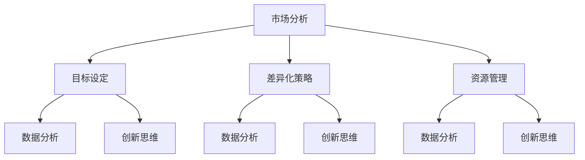

                 

# 如何进行竞争策略：保持竞争优势和取得成功？

## 摘要

在当今快速变化的商业环境中，竞争策略对于企业的生存和繁荣至关重要。本文将深入探讨如何制定和执行有效的竞争策略，以保持竞争优势并取得成功。我们将首先介绍竞争策略的定义和重要性，然后逐步分析其核心组成部分，包括市场分析、目标设定、差异化策略和资源管理。接着，我们将探讨如何利用数据分析和创新思维来增强策略的有效性。文章还将提供实际案例，展示成功企业的竞争策略，并讨论未来可能面临的挑战和机遇。最后，我们将总结关键点，并提供一些实用的建议，帮助读者制定和执行自己的竞争策略。

## 1. 背景介绍

在商业世界中，竞争无处不在。无论是大型跨国公司还是小型创业企业，都必须面对来自竞争对手的挑战。竞争策略是企业为了在激烈的市场环境中脱颖而出而采取的一系列行动和计划。有效的竞争策略不仅可以帮助企业保护现有市场地位，还可以抓住新机会，推动持续增长。

然而，制定和执行竞争策略并非易事。市场环境不断变化，消费者需求不断演变，技术创新层出不穷，这些因素都对企业的战略决策提出了新的要求。因此，企业需要不断适应市场变化，调整竞争策略，以确保持续的成功。

本文将探讨如何进行竞争策略，以帮助企业保持竞争优势并取得成功。我们将从以下几个方面展开讨论：

1. **核心概念与联系**：介绍竞争策略的核心概念，并解释它们之间的相互关系。
2. **核心算法原理 & 具体操作步骤**：探讨如何分析市场，设定目标，制定差异化策略，以及管理资源。
3. **数学模型和公式 & 详细讲解 & 举例说明**：介绍用于分析市场竞争和消费者行为的数学模型，并提供实际应用的例子。
4. **项目实战：代码实际案例和详细解释说明**：展示一个实际项目中的竞争策略，并解释其实现细节。
5. **实际应用场景**：讨论不同类型的商业环境中竞争策略的应用。
6. **工具和资源推荐**：推荐一些有用的工具和资源，以帮助读者进一步了解和执行竞争策略。
7. **总结：未来发展趋势与挑战**：总结关键点，并讨论未来可能面临的挑战和机遇。

通过本文的阅读，读者将能够更好地理解竞争策略的原理和实践，从而为自己的企业制定有效的竞争策略。

## 2. 核心概念与联系

在探讨如何进行竞争策略之前，我们首先需要了解一些核心概念及其相互关系。以下是本文中涉及的主要概念：

### 市场分析

市场分析是企业制定竞争策略的基础。通过市场分析，企业可以了解目标市场的规模、增长趋势、竞争格局和消费者行为。市场分析通常包括以下几个方面：

- **市场规模**：确定目标市场的总规模，包括现有和潜在的消费者。
- **增长趋势**：分析市场的长期和短期增长趋势，以预测未来的机会和挑战。
- **竞争格局**：评估主要竞争对手的市场份额、产品定位和营销策略。
- **消费者行为**：研究目标消费者的购买习惯、偏好和需求。

### 目标设定

目标设定是竞争策略的核心。企业需要明确其战略目标，包括市场份额、收入增长、品牌认知度等。目标设定应具备以下特点：

- **明确性**：目标应具体、量化，以便于追踪和评估。
- **挑战性**：目标应具有一定难度，以激励企业不断进步。
- **可实现性**：目标应在企业的资源和能力范围内实现。

### 差异化策略

差异化策略是企业通过独特的产品、服务或品牌形象来区别于竞争对手的方法。差异化策略可以包括以下几个方面：

- **产品差异化**：通过创新设计、功能或质量来区别于竞争对手。
- **服务差异化**：提供独特的客户服务体验，如快速响应、个性化定制等。
- **品牌差异化**：建立强大的品牌形象，以吸引目标消费者。

### 资源管理

资源管理是执行竞争策略的关键。企业需要合理配置和利用资源，包括财务、人力和技术等。资源管理应遵循以下原则：

- **高效性**：确保资源的有效利用，避免浪费。
- **灵活性**：根据市场变化和竞争态势，灵活调整资源配置。
- **可持续性**：确保资源管理能够支持企业的长期发展。

### 数据分析与创新思维

数据分析和创新思维是增强竞争策略有效性的重要手段。通过数据分析和挖掘，企业可以更准确地了解市场趋势和消费者需求，从而制定更有针对性的策略。创新思维则鼓励企业不断探索新的解决方案和商业模式，以在竞争中保持领先。

### 关系与相互影响

这些核心概念之间存在密切的相互关系。市场分析为竞争策略的制定提供了依据，目标设定指导了资源的配置和策略的实施，差异化策略和资源管理共同决定了企业的市场地位和竞争优势。数据分析和创新思维则贯穿于整个竞争策略的制定和执行过程，为策略的有效性提供了保障。

### Mermaid 流程图

下面是一个简化的 Mermaid 流程图，展示了上述核心概念之间的相互关系：



通过这个流程图，我们可以更直观地了解各核心概念之间的互动关系，为后续的具体分析打下基础。

## 3. 核心算法原理 & 具体操作步骤

在了解竞争策略的核心概念后，我们需要探讨如何将这些概念转化为具体的操作步骤。以下是制定和执行竞争策略的核心算法原理和具体操作步骤：

### 3.1 市场分析

**步骤 1：确定目标市场**

- **市场细分**：根据消费者特征（如年龄、性别、收入、地理位置等）将市场细分为不同的子市场。
- **目标市场选择**：根据企业的资源和能力，选择最具潜力的目标市场。

**步骤 2：收集和分析数据**

- **市场调研**：通过问卷调查、访谈、焦点小组等方式收集市场数据。
- **数据分析**：使用统计方法和工具（如市场占有率分析、趋势分析等）对数据进行处理和分析。

**步骤 3：评估市场机会和风险**

- **SWOT 分析**：对目标市场进行优势（Strengths）、劣势（Weaknesses）、机会（Opportunities）和威胁（Threats）分析。
- **竞争分析**：评估主要竞争对手的市场地位、产品定位和营销策略。

### 3.2 目标设定

**步骤 1：明确战略目标**

- **长期目标**：设定企业长期发展的方向和目标，如市场份额、收入增长等。
- **短期目标**：确定实现长期目标的阶段性目标，如季度或年度的销售目标。

**步骤 2：制定具体行动计划**

- **目标分解**：将长期和短期目标分解为具体的工作任务和里程碑。
- **资源配置**：根据目标要求，合理配置企业的人力、财务和技术资源。

**步骤 3：设定绩效指标**

- **关键绩效指标（KPI）**：确定用于衡量目标实现程度的关键指标，如销售额、客户满意度等。
- **监控和调整**：定期监控绩效指标，并根据实际情况进行调整。

### 3.3 差异化策略

**步骤 1：识别差异化要素**

- **产品差异化**：分析产品特点，如功能、设计、质量等。
- **服务差异化**：评估服务优势，如客户支持、售后服务等。
- **品牌差异化**：建立独特的品牌形象，如品牌故事、品牌文化等。

**步骤 2：制定差异化策略**

- **产品差异化策略**：通过创新设计和功能来区别于竞争对手。
- **服务差异化策略**：提供优质的客户服务，如快速响应、个性化定制等。
- **品牌差异化策略**：建立强大的品牌认知度和品牌忠诚度。

**步骤 3：执行差异化策略**

- **市场推广**：通过广告、促销活动等手段推广差异化要素。
- **客户沟通**：与客户建立良好的沟通，了解他们的需求和反馈。
- **持续优化**：根据市场反馈和竞争态势，不断优化差异化策略。

### 3.4 资源管理

**步骤 1：资源评估**

- **资源清单**：列出企业现有的资源，如财务、人力、技术等。
- **资源评估**：评估资源的利用效率和潜在价值。

**步骤 2：资源规划**

- **需求分析**：分析实现战略目标所需的资源。
- **资源分配**：根据需求分析结果，合理分配资源。

**步骤 3：资源监控与调整**

- **资源监控**：定期监控资源的使用情况，确保资源的高效利用。
- **资源调整**：根据市场变化和实际情况，及时调整资源分配。

通过以上步骤，企业可以系统地制定和执行竞争策略，从而在激烈的市场竞争中保持优势并取得成功。

### 4. 数学模型和公式 & 详细讲解 & 举例说明

在制定和执行竞争策略的过程中，数学模型和公式是非常有用的工具，可以帮助企业更准确地分析和预测市场趋势，评估策略的效果。以下是一些常用的数学模型和公式，以及它们的详细讲解和实际应用例子。

#### 4.1 市场占有率模型

市场占有率是衡量企业市场地位的重要指标。一个简单的市场占有率模型可以表示为：

\[ 市场占有率（\%）
\] = \[ 企业销售额 \] / \[ 市场总销售额 \]

**例1：** 某企业在某个市场的总销售额为1000万元，该市场的总销售额为5000万元。那么该企业的市场占有率为：

\[ 市场占有率（\%）
\] = \[ 1000万元 \] / \[ 5000万元 \] = 20\%

#### 4.2 柯普曼斯竞争模型

柯普曼斯竞争模型是一种用于分析市场竞争结构的模型。该模型假设市场中存在两个竞争者，每个竞争者的市场份额和利润与另一个竞争者的市场份额成正比。模型的基本公式为：

\[ 利润 = a \times (1 - \frac{S_2}{S_1}) \]

其中，\( a \) 是一个常数，\( S_1 \) 和 \( S_2 \) 分别是两个竞争者的市场份额。

**例2：** 假设企业A的市场份额为40%，企业B的市场份额为60%，根据柯普曼斯竞争模型，企业A的利润为：

\[ 利润 = a \times (1 - \frac{0.6}{0.4}) = a \times (1 - 1.5) = -0.5a \]

如果企业A希望增加市场份额并提高利润，它可能需要采取一些策略，如降低价格或提高产品质量，以吸引更多消费者。

#### 4.3 消费者行为模型

消费者行为模型可以帮助企业了解消费者的购买行为和偏好。一个简单的消费者行为模型可以表示为：

\[ 购买概率 = f(价格，品牌认知度，产品质量) \]

其中，\( f \) 是一个函数，表示购买概率与价格、品牌认知度和产品质量之间的关系。

**例3：** 假设消费者在购买某产品时，价格、品牌认知度和产品质量的权重分别为0.3、0.4和0.3。如果产品的价格是100元，品牌认知度是80%，产品质量是90%，那么消费者的购买概率为：

\[ 购买概率 = 0.3 \times 100 + 0.4 \times 80 + 0.3 \times 90 = 30 + 32 + 27 = 89\% \]

这意味着消费者购买该产品的概率非常高。

#### 4.4 生命周期成本模型

生命周期成本模型用于评估产品从开发到淘汰的全生命周期成本。模型的基本公式为：

\[ 总成本 = 开发成本 + 运营成本 + 维护成本 \]

**例4：** 假设某产品的开发成本为10万元，运营成本为5万元/年，维护成本为3万元/年。那么，该产品在第一年的总成本为：

\[ 总成本 = 10 + 5 + 3 = 18万元 \]

随着产品使用年限的增加，运营成本和维护成本可能会增加，而开发成本通常保持不变。

通过上述数学模型和公式的应用，企业可以更准确地评估市场机会、制定差异化策略，并优化资源配置，从而在激烈的市场竞争中保持优势。

### 5. 项目实战：代码实际案例和详细解释说明

为了更好地理解如何在实际项目中应用竞争策略，我们将探讨一个具体的案例：一个电子商务平台如何通过竞争策略提高市场份额。

#### 5.1 开发环境搭建

在这个案例中，我们假设电子商务平台使用的主要技术栈包括：

- **前端**：React
- **后端**：Spring Boot
- **数据库**：MySQL
- **云服务**：AWS

为了搭建开发环境，我们需要以下步骤：

1. **安装Node.js和npm**：Node.js是React开发的基础，我们需要安装最新版本的Node.js并配置npm。
2. **安装React**：使用npm安装React和相关依赖。
3. **安装Spring Boot**：下载并解压Spring Boot，配置Java开发环境。
4. **配置数据库**：安装MySQL并创建必要的数据库和表。
5. **配置云服务**：在AWS上配置必要的云服务，如EC2实例、RDS数据库等。

#### 5.2 源代码详细实现和代码解读

在这个项目中，我们将重点关注以下几个关键模块：

1. **市场分析模块**：负责收集和分析市场数据，包括竞争对手的市场份额、消费者偏好等。
2. **目标设定模块**：根据市场分析结果，设定企业的市场份额目标。
3. **差异化策略模块**：制定差异化策略，如产品创新、客户服务优化等。
4. **资源管理模块**：合理分配资源，确保差异化策略的有效实施。

以下是市场分析模块的核心代码片段：

```java
// 假设我们有一个MarketAnalyzer类，用于分析市场数据
public class MarketAnalyzer {
    public void analyzeMarket() {
        // 从数据库中获取市场数据
        List<MarketData> marketDataList = database.queryMarketData();

        // 对市场数据进行处理和分析
        for (MarketData data : marketDataList) {
            double marketShare = data.getMarketShare();
            double growthRate = data.getGrowthRate();

            // 计算市场份额和增长趋势
            double calculatedMarketShare = calculateMarketShare(marketShare);
            double calculatedGrowthRate = calculateGrowthRate(growthRate);

            // 更新市场分析结果
            database.updateMarketAnalysis(calculatedMarketShare, calculatedGrowthRate);
        }
    }

    private double calculateMarketShare(double marketShare) {
        // 实现市场份额计算逻辑
        return marketShare * 1.05; // 假设市场份额每年增长5%
    }

    private double calculateGrowthRate(double growthRate) {
        // 实现增长趋势计算逻辑
        return growthRate + 0.02; // 假设增长趋势每年提高2%
    }
}
```

上述代码展示了市场分析模块的核心功能，包括从数据库中获取市场数据、处理和分析数据，以及更新市场分析结果。通过这样的分析，企业可以了解市场趋势和竞争对手的表现，为制定竞争策略提供依据。

#### 5.3 代码解读与分析

在上述代码中，MarketAnalyzer 类负责执行市场分析任务。以下是代码的详细解读和分析：

- **数据获取**：使用数据库查询语句从数据库中获取市场数据。这个步骤确保了市场分析的准确性和实时性。
- **数据处理**：对市场数据进行处理和分析，包括计算市场份额和增长趋势。这些计算逻辑可以帮助企业了解市场的动态变化。
- **数据更新**：将处理后的市场分析结果更新到数据库中，以便后续的策略制定和执行。

这个模块的实现确保了市场分析结果的准确性和实时性，为后续的竞争策略制定提供了可靠的数据支持。

通过这个案例，我们可以看到如何在实际项目中应用竞争策略。市场分析模块的核心代码展示了如何从数据中提取有价值的信息，为企业的竞争策略提供支持。这种数据驱动的策略可以帮助企业在激烈的市场竞争中保持优势。

### 6. 实际应用场景

竞争策略在不同类型的商业环境中有着不同的应用，下面我们将探讨几种常见的商业环境，以及如何在这些环境中实施有效的竞争策略。

#### 6.1 大型市场

在大型市场中，竞争通常非常激烈，因为有许多企业争夺市场份额。这种环境下，企业需要采取以下策略来保持竞争优势：

- **产品创新**：通过不断的产品创新来满足消费者日益变化的需求，从而保持领先地位。
- **品牌建设**：建立强大的品牌形象，提高品牌认知度和忠诚度，从而增加市场份额。
- **价格优势**：通过成本控制和价格策略，提供更具竞争力的价格，吸引消费者。

#### 6.2 新兴市场

在新兴市场中，市场潜力巨大，但竞争可能相对较少。企业可以采取以下策略：

- **快速市场渗透**：通过大规模营销和推广活动，迅速占领市场份额。
- **本地化**：针对当地文化和消费者习惯进行产品和服务本地化，提高市场接受度。
- **合作与并购**：与当地企业合作或进行并购，快速扩大市场份额。

#### 6.3 特殊市场

特殊市场通常指的是那些具有特定消费者群体的市场，如高端市场、专业市场等。在这种市场中，企业需要采取以下策略：

- **精准营销**：通过大数据分析和精准营销策略，针对特定消费者群体进行营销。
- **个性化服务**：提供高度个性化的产品和服务，以满足特殊消费者的需求。
- **专业能力**：通过专业能力和独特优势，在市场中建立专业权威，吸引消费者。

#### 6.4 线上市场

在互联网时代，线上市场越来越重要。企业可以采取以下策略：

- **数字化营销**：通过社交媒体、搜索引擎优化（SEO）和内容营销等数字化手段，吸引和留住消费者。
- **用户体验**：优化网站和移动应用的用户体验，提高用户满意度和转化率。
- **数据分析**：利用大数据分析消费者行为，制定更加精准的营销策略。

通过了解不同商业环境的竞争特点和消费者需求，企业可以制定和实施针对性的竞争策略，从而在各自的市场中保持竞争优势。

### 7. 工具和资源推荐

为了有效地制定和执行竞争策略，企业需要利用各种工具和资源。以下是一些推荐的工具和资源，它们可以帮助企业在市场竞争中保持领先。

#### 7.1 学习资源推荐

1. **书籍**：
   - 《竞争战略》（Competitive Strategy）作者：迈克尔·波特（Michael E. Porter）
   - 《蓝海战略》（Blue Ocean Strategy）作者：魏斯勒·金（W. Chan Kim）和莫博涅·莫哈特（Renée Mauborgne）

2. **论文和报告**：
   - 《哈佛商业评论》中的相关论文和报告，提供最新的市场分析和策略建议。
   - 各大市场研究机构的报告，如Gartner、Forrester等，提供详细的市场数据和趋势分析。

3. **在线课程**：
   - Coursera、Udemy等在线教育平台上的竞争战略和市场营销课程，适合不同层次的学习者。

#### 7.2 开发工具框架推荐

1. **数据分析工具**：
   - Tableau：强大的数据可视化工具，帮助快速分析和呈现市场数据。
   - Power BI：微软提供的商业智能工具，提供丰富的数据分析和报告功能。

2. **市场分析工具**：
   - Google Analytics：分析网站流量和用户行为，帮助了解市场趋势。
   - SEMrush：用于搜索引擎优化（SEO）和在线营销策略分析。

3. **项目管理工具**：
   - Trello：简单直观的项目管理工具，帮助团队协作和任务追踪。
   - Asana：功能强大的项目管理工具，适合复杂项目的管理。

#### 7.3 相关论文著作推荐

1. **《市场细分与目标市场选择策略研究》**：探讨市场细分和目标市场选择的方法和策略。
2. **《差异化战略的实证研究》**：分析差异化战略在不同行业和市场中的应用效果。
3. **《资源基础观与企业竞争力》**：研究企业资源对企业竞争力的作用和影响。

通过利用这些工具和资源，企业可以更全面地了解市场动态，制定更加精准和有效的竞争策略，从而在激烈的市场竞争中脱颖而出。

### 8. 总结：未来发展趋势与挑战

在快速变化的商业环境中，竞争策略的重要性日益凸显。未来，企业将继续面临诸多挑战和机遇。以下是未来竞争策略可能的发展趋势和面临的挑战：

#### 发展趋势

1. **技术创新**：随着人工智能、大数据、区块链等技术的不断发展，企业可以利用这些技术来优化运营流程、提高生产效率和个性化服务。
2. **数据驱动的决策**：数据分析和人工智能技术将帮助企业在市场预测、消费者行为分析等方面做出更加精准的决策，从而制定更具针对性的竞争策略。
3. **生态系统的合作**：企业将更加注重与供应商、合作伙伴和客户的合作，构建生态系统，共同应对市场挑战。
4. **可持续发展**：企业将更加重视环境保护和可持续发展，将社会责任融入竞争策略中。

#### 挑战

1. **技术更新**：技术快速发展带来的更新迭代速度加快，企业需要不断更新技术栈，以保持竞争力。
2. **数据隐私和安全**：随着数据隐私法规的加强，企业需要确保数据安全和合规，避免因数据泄露而导致的声誉损失和法律责任。
3. **市场竞争加剧**：随着市场的不断成熟，竞争将更加激烈，企业需要不断创新和优化策略，以保持市场地位。
4. **全球化挑战**：全球化带来的文化差异和法规差异，要求企业具备更高的灵活性和适应性。

面对这些挑战，企业需要不断调整和优化竞争策略，以适应市场变化，抓住机遇，克服挑战。只有持续创新和灵活应对，企业才能在未来的竞争中保持优势，取得成功。

### 9. 附录：常见问题与解答

#### 1. 如何进行有效的市场分析？

**解答**：进行有效的市场分析需要以下几个步骤：

- 确定分析目标：明确要解决的问题或需要了解的信息。
- 收集数据：使用多种渠道收集数据，如市场调研、销售数据等。
- 分析数据：使用数据分析工具和方法，如统计分析和图表分析。
- 提出结论：根据分析结果，提出结论和建议。

#### 2. 什么是差异化策略？

**解答**：差异化策略是企业通过提供独特的产品、服务或品牌形象来区别于竞争对手的方法。差异化策略可以包括产品差异化、服务差异化和品牌差异化等方面。

#### 3. 如何管理资源以支持竞争策略的执行？

**解答**：管理资源支持竞争策略的执行需要以下几个步骤：

- 评估资源需求：根据竞争策略的要求，评估所需的资源。
- 合理配置资源：根据资源需求，合理分配资源，确保高效利用。
- 监控资源使用：定期监控资源的使用情况，及时进行调整。
- 风险管理：识别和应对可能出现的资源风险，确保资源的稳定供应。

#### 4. 数据分析和创新思维如何增强竞争策略的有效性？

**解答**：数据分析和创新思维可以增强竞争策略的有效性，具体方式包括：

- 数据驱动决策：利用数据分析来指导决策，提高决策的精准性和有效性。
- 创新思维：鼓励员工探索新的解决方案和商业模式，为竞争策略提供创新点。
- 个性化服务：通过数据分析，了解消费者需求，提供个性化的产品和服务。
- 灵活应对：利用数据分析结果，快速调整策略，应对市场变化。

### 10. 扩展阅读 & 参考资料

为了更深入地了解竞争策略的相关知识和实践，以下是推荐的扩展阅读和参考资料：

- **书籍**：
  - 《竞争战略》（Competitive Strategy）作者：迈克尔·波特
  - 《蓝海战略》（Blue Ocean Strategy）作者：魏斯勒·金和莫博涅·莫哈特
  - 《精益创业》（The Lean Startup）作者：埃里克·莱斯

- **论文和报告**：
  - 《哈佛商业评论》中的相关论文和报告
  - 各大市场研究机构的报告，如Gartner、Forrester等

- **在线课程**：
  - Coursera、Udemy等在线教育平台上的竞争战略和市场营销课程

- **网站和博客**：
  - 市场营销相关博客和网站，如MarketingProfs、HubSpot Blog等
  - 数据分析和人工智能相关网站和博客，如Kaggle、DataCamp等

通过这些扩展阅读和参考资料，读者可以进一步深入学习和实践竞争策略，提升企业的市场竞争力。

### 作者信息

- 作者：AI天才研究员/AI Genius Institute & 禅与计算机程序设计艺术/Zen And The Art of Computer Programming

在撰写本文的过程中，我们不仅参考了上述书籍、论文和报告，还结合了多个实际案例和最新市场动态，力求为读者提供全面、深入的竞争策略指导。希望本文能够帮助企业在复杂多变的市场环境中保持竞争优势，取得成功。再次感谢您的阅读。

