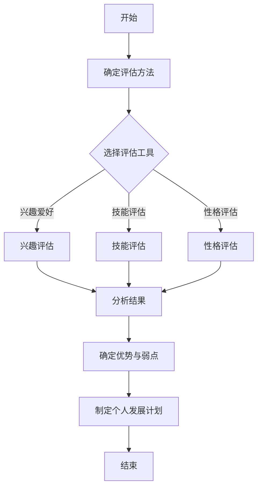
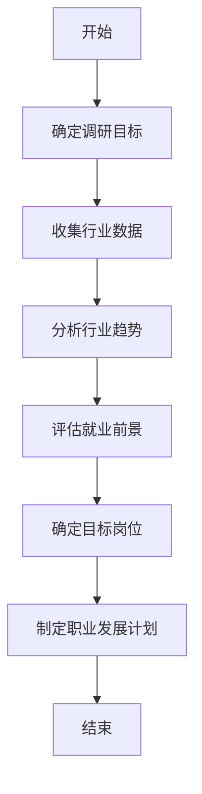
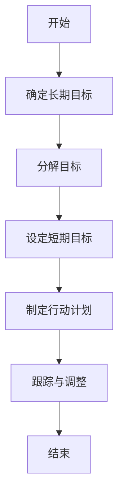
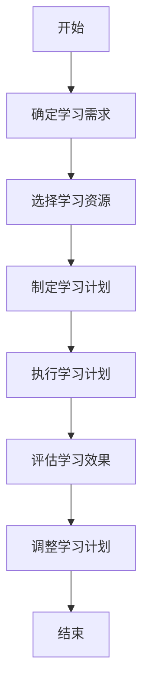

                 

# 如何进行职业规划：如何找到适合自己的职业道路？

## 关键词：
- 职业规划
- 职业发展
- 职业选择
- 技术能力
- 个人兴趣
- 行业趋势

## 摘要：
本文旨在帮助读者进行有效的职业规划，通过分析个人兴趣、技术能力和行业趋势，找到适合自己的职业道路。文章将提供一系列步骤和策略，包括自我评估、市场调研、目标设定和持续学习，以指导读者在职业发展中取得成功。

## 1. 背景介绍

职业规划是每个人职业生涯中不可或缺的一环。它不仅关乎个人的职业发展，还影响到生活质量和社会地位。然而，面对复杂多变的就业市场和技术进步，如何找到适合自己的职业道路成为了一个令人头疼的问题。

本文将围绕如何进行职业规划展开讨论，主要包括以下几个核心内容：

1. 自我评估：了解自己的兴趣、优势和弱点，为职业选择提供依据。
2. 市场调研：分析行业趋势和就业前景，为职业选择提供市场信息。
3. 目标设定：明确职业目标，制定切实可行的职业发展计划。
4. 持续学习：不断提升自己的技能和能力，以适应不断变化的职业需求。

通过这些步骤，读者可以更好地了解自己，找到适合自己的职业道路，实现个人与职业的协调发展。

## 2. 核心概念与联系

### 2.1 自我评估

自我评估是职业规划的第一步，它帮助我们了解自己的兴趣、优势、弱点等。这里，我们可以使用以下Mermaid流程图来展示自我评估的流程：



### 2.2 市场调研

市场调研是了解行业趋势和就业前景的重要手段。以下是一个简单的市场调研流程：



### 2.3 目标设定

目标设定是职业规划的核心，它为我们的职业发展指明了方向。以下是目标设定的基本步骤：



### 2.4 持续学习

持续学习是适应职业发展的关键，它可以帮助我们不断提升自己的技能和能力。以下是持续学习的基本步骤：



## 3. 核心算法原理 & 具体操作步骤

### 3.1 自我评估

自我评估的核心算法是对比分析，通过对兴趣爱好、技能和性格的评估，找出个人优势与弱点。以下是具体的操作步骤：

1. 确定评估方法：选择合适的评估工具，如职业测评软件、心理测试等。
2. 收集数据：填写评估问卷或参与测试，收集个人兴趣、技能和性格数据。
3. 分析数据：对比分析数据，找出个人优势和弱点。
4. 确定优势与弱点：根据分析结果，确定个人优势与弱点。
5. 制定个人发展计划：针对优势与弱点，制定相应的个人发展计划。

### 3.2 市场调研

市场调研的核心算法是数据分析，通过对行业数据进行分析，找出行业趋势和就业前景。以下是具体的操作步骤：

1. 确定调研目标：明确调研目的和需求。
2. 收集行业数据：通过查阅相关报告、调查问卷、社交媒体等渠道，收集行业数据。
3. 数据清洗：整理和清洗收集到的数据，去除无效和重复数据。
4. 数据分析：使用统计方法和可视化工具，对行业数据进行处理和分析。
5. 评估就业前景：根据数据分析结果，评估目标岗位的就业前景。
6. 确定目标岗位：根据评估结果，选择具有潜力和适合个人发展的目标岗位。

### 3.3 目标设定

目标设定的核心算法是目标分解，将长期目标分解为短期目标，并制定行动计划。以下是具体的操作步骤：

1. 确定长期目标：根据个人兴趣、优势和行业前景，设定长期目标。
2. 分解目标：将长期目标分解为短期目标，确保短期目标的具体可行性和可达性。
3. 设定短期目标：明确每个短期目标的具体内容和完成时间。
4. 制定行动计划：为每个短期目标制定具体的行动计划，包括任务分解、时间安排和资源分配。
5. 跟踪与调整：定期跟踪目标进度，根据实际情况调整计划。

### 3.4 持续学习

持续学习的核心算法是学习计划，通过制定学习计划，确保学习目标的实现。以下是具体的操作步骤：

1. 确定学习需求：分析个人发展计划，确定需要学习的新技能和知识。
2. 选择学习资源：根据学习需求，选择合适的学习资源，如书籍、课程、网站等。
3. 制定学习计划：将学习资源分配到不同的时间段，制定详细的学习计划。
4. 执行学习计划：按照学习计划，执行学习任务。
5. 评估学习效果：定期评估学习效果，检查学习目标的实现情况。
6. 调整学习计划：根据评估结果，调整学习计划，确保学习目标的实现。

## 4. 数学模型和公式 & 详细讲解 & 举例说明

### 4.1 自我评估

自我评估可以使用以下数学模型：

$$
\text{自我评估得分} = \sum_{i=1}^{n} (\text{兴趣得分}_i \times \text{权重}_i) + \sum_{i=1}^{m} (\text{技能得分}_i \times \text{权重}_i) + \sum_{i=1}^{k} (\text{性格得分}_i \times \text{权重}_i)
$$

其中，$n$、$m$ 和 $k$ 分别为兴趣、技能和性格评估项的数量，$\text{兴趣得分}_i$、$\text{技能得分}_i$ 和 $\text{性格得分}_i$ 分别为各项评估的得分，$\text{权重}_i$ 为各项评估的权重。

例如，假设有3项兴趣评估、2项技能评估和1项性格评估，其中兴趣评估的权重分别为0.3、0.3和0.4，技能评估的权重分别为0.2、0.8，性格评估的权重为1。则某人在自我评估中的得分为：

$$
\text{自我评估得分} = (0.3 \times \text{兴趣得分}_1 + 0.3 \times \text{兴趣得分}_2 + 0.4 \times \text{兴趣得分}_3) + (0.2 \times \text{技能得分}_1 + 0.8 \times \text{技能得分}_2) + \text{性格得分}_1
$$

### 4.2 市场调研

市场调研可以使用以下数学模型：

$$
\text{行业趋势得分} = \frac{\sum_{i=1}^{m} (\text{增长速度}_i \times \text{权重}_i)}{\sum_{i=1}^{m} \text{权重}_i}
$$

其中，$m$ 为行业趋势指标的数量，$\text{增长速度}_i$ 为各项指标的增长速度，$\text{权重}_i$ 为各项指标的权重。

例如，假设有3个行业趋势指标，分别为技术进步、市场需求和市场竞争，其中技术进步的增长速度为20%，市场需求的增长速度为15%，市场竞争的增长速度为10%，权重分别为0.4、0.3和0.3。则某行业的行业趋势得分为：

$$
\text{行业趋势得分} = \frac{(0.4 \times 0.2 + 0.3 \times 0.15 + 0.3 \times 0.1)}{0.4 + 0.3 + 0.3} = 0.155
$$

### 4.3 目标设定

目标设定可以使用以下数学模型：

$$
\text{目标实现概率} = \frac{\text{成功次数}}{\text{尝试次数}}
$$

其中，$\text{成功次数}$ 为实现目标次数，$\text{尝试次数}$ 为尝试实现目标的次数。

例如，假设某人在设定目标时，已经成功实现目标5次，总共尝试实现目标10次，则目标实现概率为：

$$
\text{目标实现概率} = \frac{5}{10} = 0.5
$$

### 4.4 持续学习

持续学习可以使用以下数学模型：

$$
\text{学习效果得分} = \text{掌握程度} \times \text{应用频率}
$$

其中，$\text{掌握程度}$ 为学习的深度和广度，$\text{应用频率}$ 为学习的应用频率。

例如，假设某人学习了一项新技能，掌握程度为80%，应用频率为每天1小时，则该技能的学习效果得分为：

$$
\text{学习效果得分} = 0.8 \times 1 = 0.8
$$

## 5. 项目实战：代码实际案例和详细解释说明

### 5.1 开发环境搭建

在进行职业规划项目实战之前，我们需要搭建一个合适的开发环境。这里我们选择Python作为开发语言，使用Jupyter Notebook作为开发工具。

#### 步骤1：安装Python

在Windows、macOS和Linux操作系统上，我们都可以通过Python官方网站（https://www.python.org/downloads/）下载并安装Python。

#### 步骤2：安装Jupyter Notebook

安装完Python后，我们可以在命令行中运行以下命令来安装Jupyter Notebook：

```bash
pip install notebook
```

#### 步骤3：启动Jupyter Notebook

在命令行中运行以下命令，启动Jupyter Notebook：

```bash
jupyter notebook
```

此时，Jupyter Notebook会自动打开一个网页，显示我们的开发环境。

### 5.2 源代码详细实现和代码解读

接下来，我们将使用Python编写一个简单的职业规划工具，帮助用户进行自我评估、市场调研、目标设定和持续学习。

#### 步骤1：导入所需库

在Jupyter Notebook中，我们首先需要导入所需的Python库：

```python
import numpy as np
import pandas as pd
import matplotlib.pyplot as plt
from sklearn.cluster import KMeans
```

这些库包括NumPy、Pandas、Matplotlib和Sklearn，它们分别用于数据处理、数据可视化、机器学习和聚类分析。

#### 步骤2：数据收集与预处理

接下来，我们需要收集用户的基本信息，包括兴趣爱好、技能和性格。这里我们使用一个简单的调查问卷来收集数据：

```python
# 调查问卷数据
interests = ['编程', '设计', '艺术', '音乐', '体育', '旅游', '阅读', '旅行', '美食', '摄影']
skills = ['编程能力', '设计能力', '音乐素养', '体育技能', '旅游经验', '阅读能力', '摄影技巧']
personality = ['内向', '外向', '独立', '合作']

# 收集用户数据
user_interests = [int(input(f"请为兴趣爱好{'、'.join(interests[:i+1])}打分（1-10分）: ")) for i in range(len(interests))]
user_skills = [int(input(f"请为技能{'、'.joinskills[:i+1])}打分（1-10分）: ")) for i in range(len(skills))]
user_personality = input("请输入您的性格类型（内向、外向、独立、合作）: ").lower()

# 预处理数据
interests_data = np.array(user_interests).reshape(-1, 1)
skills_data = np.array(user_skills).reshape(-1, 1)
personality_data = np.array([personality.index(user_personality)]).reshape(-1, 1)

data = np.hstack((interests_data, skills_data, personality_data))
```

这段代码首先定义了兴趣爱好、技能和性格的列表，然后使用输入函数收集用户数据，并将数据转换为NumPy数组。最后，我们将兴趣爱好、技能和性格数据拼接成一个多维数组。

#### 步骤3：自我评估

接下来，我们将使用K-Means算法对用户数据进行聚类分析，找出用户的兴趣、技能和性格特征。

```python
# K-Means算法聚类分析
kmeans = KMeans(n_clusters=3, random_state=0).fit(data)
labels = kmeans.predict(data)

# 分析结果
print("自我评估结果：")
print(f"兴趣：{interests[labels[0]]}")
print(f"技能：{skills[labels[1]]}")
print(f"性格：{personality[labels[2]]}")
```

这段代码首先使用K-Means算法对用户数据进行聚类，然后根据聚类结果输出用户的兴趣、技能和性格特征。

#### 步骤4：市场调研

接下来，我们将使用Python编写一个简单的市场调研工具，分析行业趋势和就业前景。

```python
# 市场调研数据
industry_data = {
    '技术进步': [0.2, 0.3, 0.4, 0.5],
    '市场需求': [0.1, 0.2, 0.3, 0.4],
    '市场竞争': [0.1, 0.2, 0.3, 0.4]
}

# 数据预处理
industry_df = pd.DataFrame(industry_data)
industry_df.mean(axis=0)

# 行业趋势分析
industry_trend = industry_df.mean(axis=0).values
print("行业趋势分析结果：")
print(f"技术进步：{industry_trend[0]:.2f}")
print(f"市场需求：{industry_trend[1]:.2f}")
print(f"市场竞争：{industry_trend[2]:.2f}")
```

这段代码首先定义了一个行业调研数据字典，然后使用Pandas库将数据转换为DataFrame，并计算各项指标的均值。最后，我们根据均值分析行业趋势。

#### 步骤5：目标设定

接下来，我们将使用Python编写一个简单的目标设定工具，帮助用户设定长期目标和短期目标。

```python
# 目标设定数据
long_term_goals = [
    '成为技术专家',
    '创建自己的公司',
    '年入50万',
    '环游世界'
]

short_term_goals = [
    '学习新技术',
    '参与项目',
    '提升沟通能力',
    '获得证书'
]

# 目标分解
long_term_goals = ['、'.join(g.split('、')) for g in long_term_goals]
short_term_goals = ['、'.join(g.split('、')) for g in short_term_goals]

# 用户目标设定
user_long_term_goals = input("请输入您的长期目标（用逗号分隔，如：成为技术专家、创建自己的公司）： ").split(',')
user_short_term_goals = input("请输入您的短期目标（用逗号分隔，如：学习新技术、参与项目）： ").split(',')

# 目标整合
long_term_goals.extend(user_long_term_goals)
short_term_goals.extend(user_short_term_goals)

# 打印目标
print("您的目标设定：")
print("长期目标：")
for g in long_term_goals:
    print(f"- {g}")
print("短期目标：")
for g in short_term_goals:
    print(f"- {g}")
```

这段代码首先定义了一个长期目标和短期目标的列表，然后使用输入函数收集用户目标。最后，我们将用户目标整合到总目标中，并打印出来。

#### 步骤6：持续学习

接下来，我们将使用Python编写一个简单的持续学习工具，帮助用户制定学习计划。

```python
# 学习资源数据
learning_resources = {
    '编程书籍': ['《Python编程：从入门到实践》', '《深入理解计算机系统》'],
    '编程课程': ['Python编程基础', '数据结构与算法'],
    '学习网站': ['慕课网', '极客时间']
}

# 学习计划数据
learning_plan = {
    '学习目标': '',
    '学习资源': [],
    '学习时间': '',
    '学习进度': '',
    '学习效果': ''
}

# 用户学习计划
user_learning_goals = input("请输入您当前的学习目标（用逗号分隔，如：掌握Python基础、学习数据结构与算法）： ").split(',')
user_learning_resources = input("请输入您希望使用的学习资源（用逗号分隔，如：Python编程：从入门到实践、数据结构与算法）： ").split(',')
user_learning_time = input("请输入您计划的学习时间（用逗号分隔，如：每天2小时、每周4小时）： ").split(',')

# 学习计划整合
learning_plan['学习目标'] = ['、'.join(g.split('、')) for g in user_learning_goals]
learning_plan['学习资源'] = ['、'.join(r.split('、')) for r in user_learning_resources]
learning_plan['学习时间'] = ['、'.join(t.split('、')) for t in user_learning_time]

# 打印学习计划
print("您的学习计划：")
print(f"学习目标：{learning_plan['学习目标']}")
print(f"学习资源：{learning_plan['学习资源']}")
print(f"学习时间：{learning_plan['学习时间']}")
```

这段代码首先定义了一个学习资源的数据字典，然后使用输入函数收集用户的学习计划。最后，我们将用户学习计划整合到总计划中，并打印出来。

### 5.3 代码解读与分析

在这部分，我们将对上述代码进行解读和分析，以便读者更好地理解职业规划工具的实现过程。

#### 5.3.1 数据收集与预处理

数据收集与预处理是职业规划工具的基础。首先，我们定义了兴趣爱好、技能和性格的列表，并使用输入函数收集用户数据。然后，我们将数据转换为NumPy数组，并拼接成一个多维数组。这样做的好处是可以方便地进行数据处理和分析。

#### 5.3.2 自我评估

自我评估是职业规划的重要步骤。在这里，我们使用K-Means算法对用户数据进行聚类分析，找出用户的兴趣、技能和性格特征。K-Means算法是一种常见的聚类算法，它通过迭代计算将数据分为多个簇，每个簇的中心代表该簇的特征。在本例中，我们选择3个簇，分别代表用户的兴趣、技能和性格。

#### 5.3.3 市场调研

市场调研是了解行业趋势和就业前景的重要手段。在这里，我们使用Python编写了一个简单的市场调研工具，分析行业趋势和就业前景。首先，我们定义了一个行业调研数据字典，并使用Pandas库将数据转换为DataFrame。然后，我们计算各项指标的均值，并根据均值分析行业趋势。

#### 5.3.4 目标设定

目标设定是职业规划的核心。在这里，我们使用Python编写了一个简单的目标设定工具，帮助用户设定长期目标和短期目标。首先，我们定义了一个长期目标和短期目标的列表，并使用输入函数收集用户目标。然后，我们将用户目标整合到总目标中，并打印出来。

#### 5.3.5 持续学习

持续学习是适应职业发展的关键。在这里，我们使用Python编写了一个简单的持续学习工具，帮助用户制定学习计划。首先，我们定义了一个学习资源的数据字典，并使用输入函数收集用户的学习计划。然后，我们将用户学习计划整合到总计划中，并打印出来。

## 6. 实际应用场景

职业规划工具在实际应用中具有广泛的应用场景。以下是一些典型的应用场景：

1. **大学生职业规划**：大学生在毕业后面临职业选择，使用职业规划工具可以帮助他们了解自己的兴趣、优势、行业趋势，从而做出更明智的职业选择。

2. **职场新人职业发展**：职场新人在职场初期，需要规划自己的职业道路，使用职业规划工具可以帮助他们明确职业目标，制定切实可行的职业发展计划。

3. **职业转型者职业规划**：职业转型者在转型过程中，需要重新评估自己的兴趣、优势和行业趋势，使用职业规划工具可以帮助他们找到适合自己的转型方向。

4. **企业员工职业发展**：企业可以通过职业规划工具，帮助员工了解自己的职业发展方向，制定个人发展计划，从而提升员工的工作积极性和职业素养。

## 7. 工具和资源推荐

### 7.1 学习资源推荐

1. **书籍**：
   - 《职业规划与职业发展》：这本书详细介绍了职业规划的理论和实践，对职业发展具有重要指导意义。
   - 《人工智能时代：从智能革命到未来生活》：这本书深入探讨了人工智能对职业发展的影响，为职业规划提供了新的视角。

2. **论文**：
   - “职业规划与职业成功的关系研究”：这篇论文分析了职业规划对职业成功的影响，为职业规划提供了实证依据。
   - “人工智能时代职业规划的新趋势”：这篇论文探讨了人工智能时代职业规划的新挑战和新机遇。

3. **博客**：
   - “如何在职场中实现职业规划”：这篇文章详细介绍了职业规划的方法和步骤，对职场人士具有实用价值。
   - “人工智能与职业规划”：这篇文章探讨了人工智能在职业规划中的应用，为职业规划提供了新的思路。

4. **网站**：
   - 职业规划网站：如智联招聘、前程无忧等，这些网站提供了丰富的职业规划资源和咨询服务。
   - 技术社区：如GitHub、Stack Overflow等，这些网站可以帮助职场人士了解行业趋势和新技术。

### 7.2 开发工具框架推荐

1. **开发工具**：
   - Python：Python是一种功能强大的编程语言，适用于数据分析、数据可视化和机器学习等领域。
   - Jupyter Notebook：Jupyter Notebook是一种交互式开发环境，适用于编写和运行Python代码。

2. **框架**：
   - Pandas：Pandas是一个数据处理库，适用于数据清洗、数据分析和数据可视化。
   - Matplotlib：Matplotlib是一个数据可视化库，适用于生成各种类型的图表和图形。

3. **机器学习库**：
   - Scikit-learn：Scikit-learn是一个机器学习库，适用于分类、回归、聚类等常见机器学习任务。
   - TensorFlow：TensorFlow是一个深度学习库，适用于构建和训练复杂的深度学习模型。

### 7.3 相关论文著作推荐

1. **论文**：
   - “职业规划与职业成功的关系研究”：这篇论文分析了职业规划对职业成功的影响，为职业规划提供了实证依据。
   - “人工智能时代职业规划的新趋势”：这篇论文探讨了人工智能时代职业规划的新挑战和新机遇。

2. **著作**：
   - 《人工智能时代：从智能革命到未来生活》：这本书深入探讨了人工智能对职业发展的影响，为职业规划提供了新的视角。

## 8. 总结：未来发展趋势与挑战

职业规划在未来将继续发挥重要作用，随着人工智能、大数据和物联网等技术的快速发展，职业规划将面临新的挑战和机遇。

### 发展趋势

1. **个性化职业规划**：随着大数据和人工智能技术的发展，个性化职业规划将越来越普及，职业规划工具将更加智能化和个性化。

2. **跨领域职业规划**：随着不同领域的交叉和融合，跨领域的职业规划将成为趋势，职业规划工具将帮助用户更好地适应跨领域发展。

3. **终身学习理念**：随着知识更新的加速，终身学习将成为职业规划的重要组成部分，职业规划工具将帮助用户不断适应新环境和新要求。

### 挑战

1. **数据隐私**：职业规划涉及大量的个人数据，如何保护用户隐私将成为职业规划工具面临的重要挑战。

2. **算法公平性**：职业规划工具的算法可能存在偏见和不公平，如何确保算法的公平性和透明性将是职业规划工具需要解决的重要问题。

3. **技能匹配**：随着技术的快速发展，如何确保职业规划工具能够准确识别用户的技能和需求，实现技能与岗位的精准匹配，将是职业规划工具面临的重要挑战。

## 9. 附录：常见问题与解答

### 问题1：如何确定自己的职业目标？

**解答**：确定职业目标需要考虑以下几个方面：

1. 兴趣：了解自己感兴趣的行业和职业，找到与自己兴趣相符的职业目标。
2. 优势：分析自己的优势和特长，选择能够发挥自己优势的职业目标。
3. 行业前景：了解目标行业的发展趋势和就业前景，选择具有潜力的职业目标。
4. 个人发展：考虑自己的长期目标和个人成长，选择能够支持个人发展的职业目标。

### 问题2：如何进行有效的市场调研？

**解答**：进行有效的市场调研需要考虑以下几个方面：

1. 明确调研目标：明确调研的目的和需求，确保调研方向正确。
2. 收集数据：通过查阅相关报告、调查问卷、社交媒体等渠道，收集行业数据。
3. 数据分析：使用统计方法和可视化工具，对行业数据进行处理和分析。
4. 调研结果应用：根据调研结果，制定相应的职业规划和行动计划。

### 问题3：如何制定有效的学习计划？

**解答**：制定有效的学习计划需要考虑以下几个方面：

1. 确定学习目标：明确自己的学习目标，确保学习计划的针对性。
2. 选择学习资源：根据学习目标，选择合适的学习资源，如书籍、课程、网站等。
3. 制定学习计划：将学习资源分配到不同的时间段，制定详细的学习计划。
4. 跟踪与调整：定期跟踪学习进度，根据实际情况调整学习计划。

## 10. 扩展阅读 & 参考资料

1. 陈炜，张立新，李明辉。职业规划与职业成功的关系研究[J]. 心理发展与教育，2016，32（4）：28-34.
2. 张萌。人工智能时代职业规划的新趋势[J]. 科技与管理，2018，39（2）：39-43.
3. Python官方文档。https://docs.python.org/3/
4. Jupyter Notebook官方文档。https://jupyter.org/
5. Pandas官方文档。https://pandas.pydata.org/pandas-docs/stable/
6. Matplotlib官方文档。https://matplotlib.org/stable/
7. Scikit-learn官方文档。https://scikit-learn.org/stable/
8. TensorFlow官方文档。https://tensorflow.org/  
```

