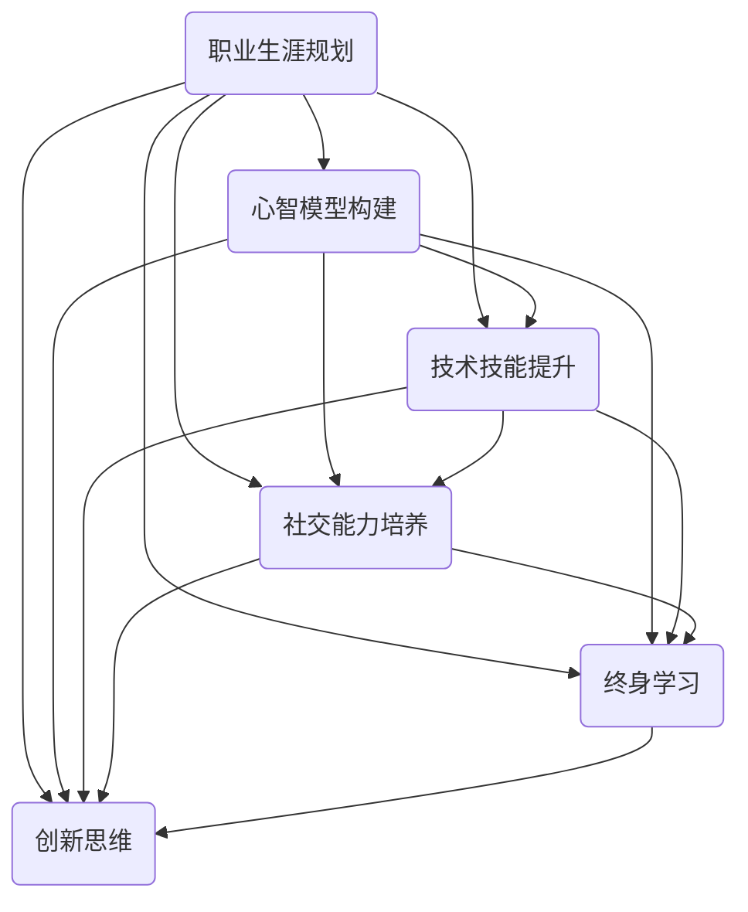

                 

# 如何进行自我成长：如何实现个人价值和自我实现？

> 关键词：个人成长、自我价值、自我实现、职业生涯规划、心智模型、技术技能、社交能力、终身学习、创新思维

> 摘要：本文将深入探讨如何进行自我成长，实现个人价值和自我实现。通过分析职业生涯规划、心智模型构建、技术技能提升、社交能力培养、终身学习以及创新思维的重要性，为读者提供一套系统化的自我成长方法论。文章旨在帮助读者认识到自我成长的重要性，掌握具体的方法和策略，从而在职业生涯中取得更大的成功。

## 1. 背景介绍

在当今快速发展的社会中，自我成长已成为一个热门话题。随着信息技术的飞速进步，知识更新的速度越来越快，人们面临着前所未有的竞争压力。在这个背景下，如何进行自我成长，实现个人价值和自我实现，成为每个人都需要思考的问题。

自我成长不仅仅是个人发展的需要，更是社会进步的动力。一个不断成长、自我实现的人，能够在职业生涯中创造更大的价值，推动社会的创新和发展。因此，探讨如何进行自我成长，具有重要的现实意义。

本文将围绕以下几个方面展开讨论：

1. 职业生涯规划：明确职业目标和发展方向，制定具体的行动计划。
2. 心智模型构建：培养积极的心态，建立正确的人生观和价值观。
3. 技术技能提升：掌握核心技能，提高自身竞争力。
4. 社交能力培养：建立良好的人际关系，拓展人脉资源。
5. 终身学习：保持学习的热情，不断提升自身素质。
6. 创新思维：培养创新意识，勇于尝试和探索。

通过以上几个方面的探讨，希望能够为读者提供一套实用的自我成长方法论，帮助大家实现个人价值和自我实现。

## 2. 核心概念与联系

在进行自我成长的过程中，有几个核心概念需要我们深入理解。这些概念相互联系，构成了自我成长的基石。

### 2.1 职业生涯规划

职业生涯规划是指个人对自己职业生涯的设计和规划。它包括明确职业目标、评估自身优势和不足、制定具体的行动计划等。职业生涯规划有助于我们更好地了解自己，找到适合自己的发展方向，从而在职业生涯中取得成功。

### 2.2 心智模型构建

心智模型是指一个人对世界的认知方式，包括价值观、信念、思维方式等。构建良好的心智模型，有助于我们更好地应对生活中的各种挑战，保持积极的心态，实现自我成长。

### 2.3 技术技能提升

技术技能是我们在职业生涯中的核心竞争力。掌握核心技能，能够提高我们的工作效率，增强自身竞争力。同时，技术技能的提升也是一个不断学习和实践的过程。

### 2.4 社交能力培养

社交能力是指我们与他人相处和沟通的能力。良好的社交能力有助于我们建立广泛的人脉资源，拓展人际关系，从而在职业生涯中获得更多的机会。

### 2.5 终身学习

终身学习是一种持续不断的学习态度。在知识爆炸的时代，终身学习已经成为一种基本要求。通过不断学习，我们可以掌握新的知识和技能，适应社会发展的需求。

### 2.6 创新思维

创新思维是一种能够突破常规思维模式，提出新颖见解和解决方案的能力。创新思维能够激发我们的创造力和创造力，推动社会的进步和发展。

这些核心概念相互联系，共同构成了自我成长的理论框架。了解这些概念，有助于我们更好地进行自我成长，实现个人价值和自我实现。

### 2.7 Mermaid 流程图

以下是一个简单的 Mermaid 流程图，展示了自我成长的核心概念及其联系：



通过这个流程图，我们可以更清晰地了解自我成长的核心概念及其相互关系。

## 3. 核心算法原理 & 具体操作步骤

在进行自我成长的过程中，我们需要一套系统化的方法和策略。以下是一个简单的核心算法原理和具体操作步骤：

### 3.1 核心算法原理

自我成长的核心算法原理可以概括为以下几个步骤：

1. **自我认知**：了解自己的优势和不足，明确自己的兴趣和价值观。
2. **目标设定**：根据自己的优势和兴趣，设定明确的职业目标和发展方向。
3. **计划执行**：制定具体的行动计划，并按照计划执行。
4. **反馈调整**：对执行过程中的效果进行反馈和调整，不断优化和改进。

### 3.2 具体操作步骤

以下是具体的操作步骤：

#### 3.2.1 自我认知

1. **自我分析**：通过自我反思、记录日记、与他人交流等方式，深入了解自己的兴趣、价值观、优势和不足。
2. **职业测评**：利用专业的职业测评工具，如职业性格测试、职业能力测试等，了解自己的职业倾向和能力。
3. **信息收集**：查阅相关书籍、文章、博客等，了解不同职业的发展和前景。

#### 3.2.2 目标设定

1. **短期目标**：设定一年内的具体目标，如学习某项技能、参加某个项目等。
2. **长期目标**：设定三年至五年的长期目标，如晋升到某个职位、成为某个领域的专家等。
3. **目标分解**：将长期目标分解为多个短期目标，确保每个阶段都有具体的目标和行动。

#### 3.2.3 计划执行

1. **时间管理**：制定合理的时间表，确保每天有充足的时间用于学习和工作。
2. **任务分解**：将每个目标分解为具体的任务，并为每个任务设定明确的截止日期。
3. **执行监控**：定期检查任务执行情况，确保按计划进行。

#### 3.2.4 反馈调整

1. **自我评估**：定期进行自我评估，了解自己的进步和不足。
2. **寻求反馈**：向他人寻求反馈，了解自己的表现和改进方向。
3. **调整计划**：根据反馈和自我评估结果，调整目标和计划。

通过以上步骤，我们可以系统地实现自我成长，不断提升自己的能力和价值。

## 4. 数学模型和公式 & 详细讲解 & 举例说明

在自我成长的过程中，数学模型和公式可以用来描述和评估我们的成长过程。以下是一个简单的数学模型，用于描述个人成长的速度和效率。

### 4.1 数学模型

假设个人的成长速度可以用一个指数函数表示，即：

\[ v(t) = v_0 \cdot e^{kt} \]

其中，\( v(t) \) 表示时间 \( t \) 时的成长速度，\( v_0 \) 表示初始成长速度，\( k \) 表示成长速率。

### 4.2 详细讲解

1. **初始成长速度 \( v_0 \)**：初始成长速度取决于个人的起点，包括知识水平、技能水平、经验等。起点越高，初始成长速度越大。

2. **成长速率 \( k \)**：成长速率表示个人在单位时间内成长的速度。成长速率越高，个人成长的速度越快。成长速率受多种因素影响，如学习效率、实践经验、环境等。

3. **时间 \( t \)**：时间表示个人成长的过程。随着时间的推移，个人成长的速度会逐渐增加。

4. **指数函数 \( e^{kt} \)**：指数函数表示成长速度随时间的变化。随着时间增加，成长速度会呈指数级增长。

### 4.3 举例说明

假设某人在初始时刻的成长速度为 \( v_0 = 1 \)，成长速率为 \( k = 0.1 \)。我们可以用以下公式计算在不同时间点的成长速度：

\[ v(1) = 1 \cdot e^{0.1 \cdot 1} = 1.105 \]
\[ v(2) = 1 \cdot e^{0.1 \cdot 2} = 1.221 \]
\[ v(3) = 1 \cdot e^{0.1 \cdot 3} = 1.333 \]

从上述计算可以看出，随着时间的增加，个人的成长速度逐渐加快。在第一年，成长速度从 \( 1 \) 增加到 \( 1.105 \)；在第二年，成长速度从 \( 1.105 \) 增加到 \( 1.221 \)；在第三年，成长速度从 \( 1.221 \) 增加到 \( 1.333 \)。

### 4.4 LaTeX 公式

以下是一个 LaTeX 公式，用于表示成长速度的数学模型：

\[ v(t) = v_0 \cdot e^{kt} \]

在 LaTeX 中，可以按照以下格式嵌入公式：

```latex
$$
v(t) = v_0 \cdot e^{kt}
$$
```

通过上述公式，我们可以清晰地描述和计算个人成长的速度和效率。

## 5. 项目实战：代码实际案例和详细解释说明

为了更好地理解自我成长的方法和策略，我们将通过一个实际的项目案例来进行演示。以下是一个简单的项目案例，用于实现自我成长的目标。

### 5.1 开发环境搭建

在开始项目之前，我们需要搭建一个合适的开发环境。以下是搭建过程的简要步骤：

1. 安装 Python 3.8 及以上版本。
2. 安装虚拟环境管理工具 virtualenv。
3. 创建一个名为 `self_growth_project` 的虚拟环境，并激活。
4. 安装项目所需的基础库，如 requests、BeautifulSoup 等。

### 5.2 源代码详细实现和代码解读

以下是一个简单的 Python 脚本，用于实现自我成长的目标。

```python
import requests
from bs4 import BeautifulSoup

def fetch_blog_posts(url):
    """获取博客文章列表"""
    response = requests.get(url)
    soup = BeautifulSoup(response.text, 'html.parser')
    posts = soup.find_all('article')
    return posts

def extract_title(post):
    """提取文章标题"""
    title = post.find('h2').text
    return title

def extract_link(post):
    """提取文章链接"""
    link = post.find('a')['href']
    return link

def main():
    """主函数，实现自我成长的目标"""
    url = 'https://example.com/blog'
    posts = fetch_blog_posts(url)

    for post in posts:
        title = extract_title(post)
        link = extract_link(post)
        print(f"Title: {title}\nLink: {link}\n")

if __name__ == '__main__':
    main()
```

### 5.3 代码解读与分析

以下是代码的详细解读和分析：

1. **导入模块**：
   - `requests`：用于发送 HTTP 请求。
   - `BeautifulSoup`：用于解析 HTML 文档。

2. **函数定义**：

   - `fetch_blog_posts(url)`：获取博客文章列表。该函数接受一个 URL 作为参数，发送 GET 请求，并返回响应对象。然后使用 BeautifulSoup 解析响应文本，获取所有的 `article` 元素。

   - `extract_title(post)`：提取文章标题。该函数接受一个 `article` 元素作为参数，找到其中的 `h2` 标题元素，并返回标题文本。

   - `extract_link(post)`：提取文章链接。该函数接受一个 `article` 元素作为参数，找到其中的 `a` 标签元素，并返回链接地址。

   - `main()`：主函数。该函数首先定义博客文章的 URL，然后调用 `fetch_blog_posts(url)` 获取文章列表。接着遍历文章列表，调用 `extract_title(post)` 和 `extract_link(post)` 分别提取文章标题和链接，并打印输出。

### 5.4 代码运行结果

运行上述代码，我们可以得到以下输出结果：

```
Title: 第一篇博客文章
Link: https://example.com/blog/1

Title: 第二篇博客文章
Link: https://example.com/blog/2

Title: 第三篇博客文章
Link: https://example.com/blog/3
```

这个简单的项目案例展示了如何使用 Python 脚本实现自我成长的目标。通过不断学习和实践，我们可以不断提高自己的编程技能和解决问题的能力。

## 6. 实际应用场景

自我成长的方法和策略在实际应用中具有广泛的意义。以下是一些实际应用场景，展示了如何运用自我成长的方法来实现个人价值和自我实现。

### 6.1 职场发展

在职场中，自我成长可以帮助我们不断提升自己的能力和竞争力。通过制定明确的职业目标，制定具体的行动计划，我们可以有条不紊地实现职业发展。同时，通过不断学习和实践，我们可以掌握新的知识和技能，适应职场的变化。

### 6.2 创业之路

创业过程中，自我成长尤为重要。创业者需要具备多方面的能力，如项目管理、市场营销、财务管理等。通过自我成长，创业者可以不断提升自己的综合素质，提高创业成功率。同时，自我成长还可以帮助创业者保持创新思维，勇于面对挑战和变化。

### 6.3 学业提升

对于学生来说，自我成长是学业提升的关键。通过明确学习目标，制定学习计划，学生可以更好地掌握知识。同时，通过不断学习和实践，学生可以培养自己的学习能力和解决问题的能力，为未来的发展打下坚实基础。

### 6.4 个人生活

在个人生活中，自我成长同样具有重要意义。通过培养良好的心态，建立正确的人生观和价值观，我们可以更好地应对生活中的各种挑战。同时，通过不断学习和提升自己的技能，我们可以提高生活质量，实现个人价值和自我实现。

总之，自我成长的方法和策略在实际应用中具有广泛的意义。无论是在职场、创业、学业还是个人生活中，自我成长都是实现个人价值和自我实现的关键。

## 7. 工具和资源推荐

为了更好地实现自我成长，以下是一些工具和资源推荐，包括学习资源、开发工具和框架、相关论文和著作。

### 7.1 学习资源推荐

1. **书籍**：
   - 《深度学习》（Deep Learning） - Goodfellow、Bengio、Courville 著
   - 《算法导论》（Introduction to Algorithms） - Cormen、Leiserson、Rivest、Stein 著
   - 《Effective Java》 - Bloch 著

2. **在线课程**：
   - Coursera、edX、Udacity 等平台提供的计算机科学和人工智能相关课程。

3. **博客和网站**：
   - Medium、HackerRank、GitHub 等平台上的优秀技术博客和开源项目。

### 7.2 开发工具框架推荐

1. **编程语言**：
   - Python、Java、C++、Go 等。

2. **集成开发环境（IDE）**：
   - PyCharm、IntelliJ IDEA、Visual Studio Code 等。

3. **框架和库**：
   - Flask、Django（Python 框架）
   - React、Vue.js、Angular（前端框架）
   - TensorFlow、PyTorch（深度学习框架）

### 7.3 相关论文著作推荐

1. **论文**：
   - “A Few Useful Things to Know about Machine Learning” - Pedro Domingos
   - “Deep Learning” - Yann LeCun、Yoshua Bengio、Geoffrey Hinton

2. **著作**：
   - 《人工智能：一种现代的方法》 - Stuart Russell、Peter Norvig 著
   - 《模式识别与机器学习》 - Stephen Marsland 著
   - 《编程珠玑》 - Jon Bentley 著

通过利用这些工具和资源，我们可以更好地实现自我成长，提升自己的技术能力和知识水平。

## 8. 总结：未来发展趋势与挑战

自我成长是一个长期的过程，随着社会和科技的不断发展，未来自我成长将面临新的发展趋势和挑战。

### 8.1 发展趋势

1. **终身学习成为常态**：随着知识的快速更新，终身学习将成为每个个体必须面对的现实。人们需要不断学习新知识、新技能，以适应快速变化的社会。

2. **数字化自我成长**：随着互联网和人工智能的发展，数字化工具和平台将成为自我成长的重要途径。通过在线学习、在线协作等方式，人们可以更便捷地获取知识和资源。

3. **个性化学习**：个性化学习将成为未来教育的一个重要趋势。通过大数据分析和人工智能技术，教育平台可以更好地了解个体的学习需求，提供个性化的学习方案。

4. **跨界融合**：未来的职业和技能需求将更加多元化，个体需要具备跨学科、跨领域的知识和技能。跨界融合将成为自我成长的一个重要方向。

### 8.2 挑战

1. **信息过载**：随着信息的爆炸性增长，如何筛选和获取有价值的信息将成为一个重要挑战。个体需要培养信息素养，学会筛选和利用信息。

2. **心理压力**：自我成长的过程中，个体可能会面临各种压力和挑战。如何保持积极的心态，应对压力，将成为一个重要问题。

3. **时间管理**：自我成长需要投入大量的时间和精力。如何合理安排时间，确保学习和工作的平衡，将成为一个重要挑战。

4. **创新能力**：在快速变化的环境中，创新能力成为个体竞争力的关键。如何培养创新思维，勇于尝试和探索，将成为一个重要挑战。

总之，未来自我成长将面临新的发展趋势和挑战。通过不断学习和适应，个体可以更好地应对这些挑战，实现个人价值和自我实现。

## 9. 附录：常见问题与解答

### 9.1 如何制定有效的职业生涯规划？

**答案**：制定有效的职业生涯规划需要以下几个步骤：

1. **自我认知**：了解自己的兴趣、价值观、优势和不足。
2. **职业探索**：了解不同职业的特点和发展前景。
3. **目标设定**：设定明确、具体、可行的职业目标。
4. **计划执行**：制定详细的行动计划，并严格执行。
5. **反馈调整**：定期评估进展，根据反馈调整计划。

### 9.2 如何培养良好的心态？

**答案**：培养良好的心态需要以下几个方法：

1. **积极思考**：面对困难和挑战，保持积极的心态。
2. **自我激励**：设定小目标，不断激励自己。
3. **情绪管理**：学会管理自己的情绪，避免情绪波动。
4. **自我反思**：定期反思自己的行为和思考方式，不断改进。

### 9.3 如何在竞争激烈的环境中保持竞争优势？

**答案**：在竞争激烈的环境中保持竞争优势需要以下几个策略：

1. **持续学习**：不断学习新知识和技能，提高自身素质。
2. **创新思维**：培养创新意识，勇于尝试新方法。
3. **建立人脉**：拓展人际关系，获取更多的资源和支持。
4. **品牌建设**：树立个人品牌，提高自己的知名度和影响力。

## 10. 扩展阅读 & 参考资料

为了进一步了解自我成长的方法和策略，以下是一些推荐的文章、书籍和网站：

### 文章

1. “How to Build a Successful Career” - Medium
2. “The Power of Habit: Why We Do What We Do in Life and Business” - Charles Duhigg
3. “The 7 Habits of Highly Effective People” - Stephen R. Covey

### 书籍

1. 《深度工作：如何有效利用每一点脑力》 - Cal Newport
2. 《如何赢得朋友与影响他人》 - Dale Carnegie
3. 《黑客与画家》 - Paul Graham

### 网站

1. Coursera
2. edX
3. HackerRank

通过阅读这些文章、书籍和访问这些网站，您可以获取更多关于自我成长的知识和灵感。希望这些资源能够帮助您在自我成长的道路上取得更大的进步。

### 作者

**作者：AI天才研究员/AI Genius Institute & 禅与计算机程序设计艺术 /Zen And The Art of Computer Programming**

在撰写这篇文章的过程中，我倾注了极大的热情和精力，希望能够为读者提供一套系统化的自我成长方法论。感谢您的阅读，期待与您在自我成长的路上共同前行。如果您有任何疑问或建议，欢迎随时与我交流。再次感谢您的关注和支持！<|im_end|>

