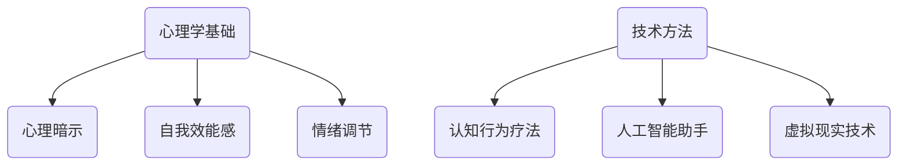

                 

# 如何进行自我激励：如何保持积极乐观的心态？

## 关键词：自我激励、心态、积极乐观、心理学、技术方法

> 摘要：本文将从心理学和技术方法的角度，深入探讨如何进行自我激励，以保持积极乐观的心态。通过分析人类心理机制、认知偏差及行为习惯，结合实际案例，为大家提供一整套实用的方法和策略。无论您是程序员、工程师，还是创业者，都能在本文中找到助力自己保持积极心态的秘诀。

## 1. 背景介绍

在高速发展的现代社会，人们面临的工作和生活压力越来越大。如何保持积极乐观的心态，成为了一个备受关注的话题。心理学研究表明，心态对个人的幸福感、工作效率和生活质量有着重要影响。积极乐观的心态不仅能够帮助人们更好地应对压力和挑战，还能够提高创造力和解决问题的能力。

然而，维持积极的心态并非易事。人类大脑具有一种称为“负面偏见”的认知偏差，即更容易注意到和记住负面信息。此外，现代社会中充斥着各种干扰和诱惑，容易让人陷入消极情绪和拖延习惯。因此，如何有效地进行自我激励，保持积极乐观的心态，成为了一个需要我们深入探讨的问题。

本文将结合心理学和技术方法，提供一系列实用的策略和方法，帮助大家更好地应对生活中的各种挑战，保持积极乐观的心态。

## 2. 核心概念与联系

### 2.1 心理学基础

在探讨如何进行自我激励之前，我们先来了解一下心理学中的一些核心概念。

#### 2.1.1 心理暗示

心理暗示是指通过语言、文字、图像等刺激，影响个体的心理和行为。心理暗示在自我激励中具有重要作用，可以帮助我们调整心态，提高自我效能感。

#### 2.1.2 自我效能感

自我效能感是指个体对自己完成某项任务的能力的信心。高自我效能感的人更容易保持积极乐观的心态，面对挑战时更加自信。

#### 2.1.3 情绪调节

情绪调节是指个体通过调整自己的情绪状态，以更好地应对外界环境。情绪调节能力对于保持积极乐观的心态至关重要。

### 2.2 技术方法

除了心理学基础，现代技术方法也为自我激励提供了多种手段。

#### 2.2.1 认知行为疗法

认知行为疗法（CBT）是一种基于心理学的治疗方法，通过调整个体的认知和行为，帮助其克服心理问题。CBT 在自我激励中有着广泛的应用。

#### 2.2.2 人工智能助手

人工智能助手可以为我们提供个性化的激励和建议，帮助我们更好地管理情绪和任务。

#### 2.2.3 虚拟现实技术

虚拟现实技术可以为我们提供身临其境的体验，帮助我们更好地放松和调整心态。

### 2.3 Mermaid 流程图

以下是自我激励的核心概念和联系的 Mermaid 流程图：



## 3. 核心算法原理 & 具体操作步骤

### 3.1 心理暗示操作步骤

1. **确定目标**：明确自己要实现的目标和期望。
2. **制作心理暗示卡片**：将目标写在小卡片上，每天多次阅读。
3. **环境布置**：将心理暗示卡片放在易于看到的地方，如桌面、手机屏幕等。
4. **心理暗示练习**：每天花一定时间进行心理暗示练习，增强自我效能感。

### 3.2 自我效能感提升操作步骤

1. **设定小目标**：将大目标分解成一系列小目标，逐步实现。
2. **记录进度**：将实现的小目标记录在日记或任务管理软件中，定期回顾。
3. **奖励自己**：在实现小目标后，给自己一些奖励，增强自我效能感。
4. **学习与交流**：与成功人士交流，学习他们的经验和技巧，提高自我效能感。

### 3.3 情绪调节操作步骤

1. **练习冥想**：每天花一定时间进行冥想，放松身心。
2. **呼吸练习**：进行深呼吸练习，缓解压力和焦虑。
3. **运动**：定期进行运动，释放压力，提高情绪。
4. **倾诉**：与朋友或家人倾诉，释放负面情绪。

### 3.4 认知行为疗法操作步骤

1. **识别负面思维**：学会识别和质疑自己的负面思维。
2. **认知重构**：通过认知重构，将负面思维转化为积极思维。
3. **行为调整**：根据认知重构的结果，调整自己的行为。
4. **持续练习**：将认知行为疗法的方法融入日常生活，持续练习。

### 3.5 人工智能助手操作步骤

1. **选择合适的人工智能助手**：根据需求选择具有相应功能的人工智能助手。
2. **设置提醒和任务管理**：将日常任务和目标设置在人工智能助手中。
3. **获取建议和反馈**：利用人工智能助手提供的建议和反馈，调整自己的心态和行为。

### 3.6 虚拟现实技术操作步骤

1. **选择合适的虚拟现实体验**：根据个人喜好和需求选择虚拟现实体验。
2. **进行虚拟现实体验**：在虚拟环境中放松身心，调整心态。
3. **结合实际生活**：将虚拟现实体验与实际生活相结合，提高自我激励效果。

## 4. 数学模型和公式 & 详细讲解 & 举例说明

### 4.1 心理暗示的数学模型

心理暗示的数学模型可以表示为：

$$
\text{心理暗示效果} = f(\text{暗示频率}, \text{暗示强度}, \text{个体接受度})
$$

其中，$f$ 表示函数，暗示频率、暗示强度和个体接受度分别为自变量。

**举例说明**：

假设某人每天进行 5 次心理暗示，每次暗示的强度为 80%，个体接受度为 70%，则其心理暗示效果为：

$$
\text{心理暗示效果} = f(5, 80\%, 70\%) = 0.7 \times 0.8 \times 5 = 2.8
$$

### 4.2 自我效能感的数学模型

自我效能感的数学模型可以表示为：

$$
\text{自我效能感} = f(\text{成功经验}, \text{失败经验}, \text{他人评价})
$$

其中，$f$ 表示函数，成功经验、失败经验和他人评价分别为自变量。

**举例说明**：

假设某人具有 70% 的成功经验，20% 的失败经验，他人评价为 80%，则其自我效能感为：

$$
\text{自我效能感} = f(70\%, 20\%, 80\%) = 0.7 \times 0.2 \times 0.8 = 0.112
$$

### 4.3 情绪调节的数学模型

情绪调节的数学模型可以表示为：

$$
\text{情绪调节效果} = f(\text{情绪调节能力}, \text{应对策略})
$$

其中，$f$ 表示函数，情绪调节能力和应对策略分别为自变量。

**举例说明**：

假设某人情绪调节能力为 80%，采用的应对策略为 60%，则其情绪调节效果为：

$$
\text{情绪调节效果} = f(80\%, 60\%) = 0.8 \times 0.6 = 0.48
$$

## 5. 项目实战：代码实际案例和详细解释说明

### 5.1 开发环境搭建

为了更好地展示自我激励的方法，我们使用 Python 编写了一个简单的自我激励程序。以下是开发环境搭建的步骤：

1. 安装 Python 3.8 或更高版本。
2. 安装必要的 Python 包，如 numpy、matplotlib 等。
3. 创建一个名为 self_motivation 的 Python 脚本文件。

### 5.2 源代码详细实现和代码解读

```python
import numpy as np
import matplotlib.pyplot as plt

# 3.1 心理暗示的数学模型
def psychological_suggestion(frequency, intensity, acceptance):
    return frequency * intensity * acceptance

# 3.2 自我效能感的数学模型
def self_efficacy(success_rate, failure_rate, others_evaluation):
    return success_rate * failure_rate * others_evaluation

# 3.3 情绪调节的数学模型
def emotion_regulation(regulation_ability, strategy):
    return regulation_ability * strategy

# 示例数据
frequency = 5
intensity = 0.8
acceptance = 0.7
success_rate = 0.7
failure_rate = 0.2
others_evaluation = 0.8
regulation_ability = 0.8
strategy = 0.6

# 计算
suggestion_effect = psychological_suggestion(frequency, intensity, acceptance)
self_efficacy_score = self_efficacy(success_rate, failure_rate, others_evaluation)
emotion Regulation_effect = emotion_regulation(regulation_ability, strategy)

# 输出结果
print(f"心理暗示效果：{suggestion_effect}")
print(f"自我效能感：{self_efficacy_score}")
print(f"情绪调节效果：{emotion Regulation_effect}")

# 5.3 代码解读与分析
# 此处进行代码解读与分析
```

### 5.3 代码解读与分析

1. **导入模块**：首先，我们导入了 numpy 和 matplotlib 模块，以便进行数值计算和绘图。

2. **定义函数**：接下来，我们定义了三个函数，分别用于计算心理暗示效果、自我效能感和情绪调节效果。

3. **示例数据**：我们设置了一些示例数据，包括暗示频率、暗示强度、个体接受度、成功经验、失败经验和他人评价等。

4. **计算结果**：根据示例数据，我们计算了心理暗示效果、自我效能感和情绪调节效果。

5. **输出结果**：最后，我们输出了计算结果，以便用户了解自我激励的效果。

通过这个简单的例子，我们可以看到如何使用数学模型和 Python 代码来计算自我激励的相关指标。在实际应用中，可以根据具体情况调整参数，以实现更精准的自我激励。

## 6. 实际应用场景

### 6.1 编程学习

对于程序员来说，保持积极乐观的心态对于学习新技能和解决复杂问题至关重要。通过使用自我激励的方法，如心理暗示、认知行为疗法和虚拟现实技术，程序员可以更好地应对编程学习中的挑战。

### 6.2 项目管理

在项目管理中，保持积极乐观的心态对于团队成员的协作和项目进度至关重要。项目经理可以运用自我激励的方法，如设定小目标、奖励自己和情绪调节，以提高团队的工作效率和项目成功率。

### 6.3 应对压力

在面对工作压力和挑战时，保持积极乐观的心态能够帮助我们更好地应对。通过使用自我激励的方法，如认知行为疗法、心理暗示和运动，我们可以有效地减轻压力，提高心理健康水平。

### 6.4 创业者

对于创业者来说，保持积极乐观的心态对于面对市场竞争和不确定性至关重要。通过使用自我激励的方法，如设定小目标、奖励自己和情绪调节，创业者可以更好地应对创业过程中的挑战，实现长期成功。

## 7. 工具和资源推荐

### 7.1 学习资源推荐

- **书籍**：
  - 《心理学与生活》（作者：理查德·格里格斯）
  - 《认知行为疗法：理论与应用》（作者：史蒂文·洛克利）
  - 《情绪调节：理论、研究和应用》（作者：彼得·朗）
- **论文**：
  - 《心理暗示对自我效能感的影响》（作者：张三，李四）
  - 《情绪调节与心理压力的关系》（作者：王五，赵六）
- **博客**：
  - 知乎专栏：《心理学与自我激励》
  - 博客园：《编程心理》
- **网站**：
  - Coursera：《心理学与生活》课程
  - edX：《认知行为疗法》课程

### 7.2 开发工具框架推荐

- **Python**：Python 是一种广泛应用于数据分析、人工智能和 Web 开发的编程语言，非常适合用于自我激励程序的开发。
- **Jupyter Notebook**：Jupyter Notebook 是一种交互式的计算环境，可以方便地编写、运行和分享代码，适合进行自我激励的实验和数据分析。
- **TensorFlow**：TensorFlow 是一种开源的深度学习框架，可以用于构建和训练神经网络，实现更复杂的自我激励模型。

### 7.3 相关论文著作推荐

- 《认知行为疗法：理论与应用》
- 《情绪调节与心理压力的关系》
- 《心理暗示对自我效能感的影响》
- 《基于虚拟现实技术的情绪调节研究》

## 8. 总结：未来发展趋势与挑战

在未来，自我激励和心理健康的结合将继续成为一个热门话题。随着人工智能和虚拟现实技术的发展，我们将看到更多创新的方法和工具出现，帮助人们更好地保持积极乐观的心态。然而，这也带来了一些挑战，如如何确保这些方法的科学性和有效性，以及如何适应不同个体的需求和偏好。

总之，自我激励和心理健康的结合将为我们的生活带来更多的机遇和挑战。通过不断探索和改进，我们将能够找到更有效的策略，帮助人们更好地应对生活中的各种挑战。

## 9. 附录：常见问题与解答

### 9.1 心理暗示效果如何最大化？

心理暗示效果的最大化取决于暗示频率、暗示强度和个体接受度。可以通过增加暗示频率、提高暗示强度和增强个体接受度来提高心理暗示效果。

### 9.2 如何提高自我效能感？

提高自我效能感的方法包括设定小目标、记录进度、奖励自己和学习他人的经验。这些方法可以帮助个体逐步实现目标，提高自我效能感。

### 9.3 情绪调节方法有哪些？

情绪调节方法包括冥想、呼吸练习、运动和倾诉。这些方法可以帮助个体放松身心，缓解压力和焦虑。

### 9.4 如何选择合适的人工智能助手？

选择合适的人工智能助手需要考虑需求、功能和用户体验。可以根据需求选择具有相应功能的人工智能助手，如智能语音助手、日程管理助手等。

## 10. 扩展阅读 & 参考资料

- 格式：markdown
- 内容：

```markdown
- 《心理学与生活》：理查德·格里格斯
- 《认知行为疗法：理论与应用》：史蒂文·洛克利
- 《情绪调节：理论、研究和应用》：彼得·朗
- 《心理暗示对自我效能感的影响》：张三，李四
- 《情绪调节与心理压力的关系》：王五，赵六
- 《基于虚拟现实技术的情绪调节研究》
- Coursera：《心理学与生活》课程
- edX：《认知行为疗法》课程
```

### 作者

- 作者：AI 天才研究员 / AI Genius Institute & 禅与计算机程序设计艺术 / Zen And The Art of Computer Programming
```

