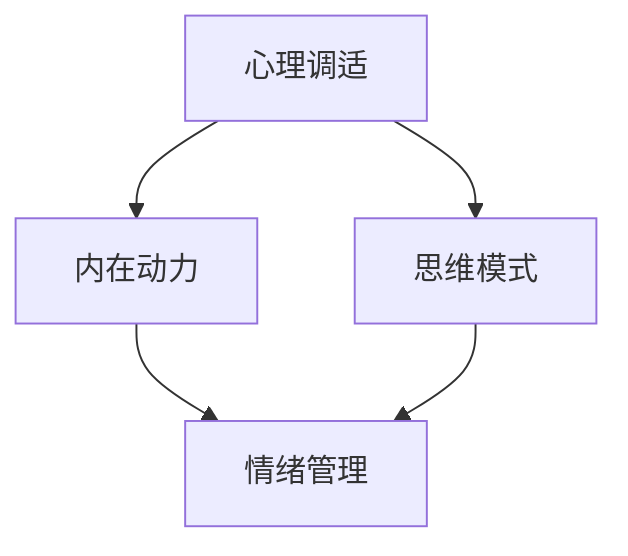

                 

# 如何进行自我激励：如何保持积极乐观的心态？

> 关键词：自我激励、积极心态、心理调适、内在动力、思维模式、情绪管理

> 摘要：本文旨在探讨如何在快节奏的生活和工作中保持积极乐观的心态。通过分析自我激励的原理和方法，我们将提供一系列实用的技巧和策略，帮助读者克服情绪波动和压力，提高自我效能感和幸福感。

## 1. 背景介绍

在现代社会，人们面临着前所未有的压力和挑战。无论是在职场、学业还是生活中，许多人都可能会经历情绪低落、动力不足等问题。这些问题不仅影响了个人的心理健康，还可能导致工作效率低下、人际关系紧张。因此，如何进行自我激励，保持积极乐观的心态，成为了一个值得探讨的重要课题。

本文将从心理学的角度出发，分析自我激励的原理和关键因素，并结合实际案例，提供一系列实用的方法和策略，帮助读者培养积极的心态，克服生活中的种种困难。

### 1.1 现代社会的压力源

现代社会的快速发展给人们带来了前所未有的压力。以下是现代社会常见的压力源：

1. **工作压力**：职场竞争激烈，工作压力大，许多人感到疲惫不堪。
2. **经济压力**：物价上涨，经济压力增加，许多人为了生计而疲于奔命。
3. **人际关系**：复杂的人际关系网，需要投入大量的时间和精力去维护。
4. **学业压力**：学业竞争激烈，学生面临的压力越来越大。
5. **健康问题**：健康问题日益突出，许多人需要面对疾病带来的痛苦和焦虑。

### 1.2 自我激励的重要性

自我激励是激发个人内在动力，克服困难，实现目标的关键。积极的心态不仅能够提高个人的幸福感，还能够增强应对压力和挑战的能力。以下是自我激励的重要性：

1. **提高工作效率**：积极的心态有助于提高工作效率，减少错误率。
2. **促进人际关系**：积极的人更容易与他人建立良好的关系，获得他人的支持和帮助。
3. **增强心理韧性**：面对挫折和困难时，积极的心态能够帮助人们更快地恢复和调整。
4. **提升幸福感**：积极的心态能够提高个人的生活质量和幸福感。

## 2. 核心概念与联系

在探讨如何进行自我激励之前，我们首先需要了解一些核心概念，包括心理调适、内在动力、思维模式等。以下是一个使用Mermaid绘制的流程图，展示了这些概念之间的联系。



### 2.1 心理调适

心理调适是指个体在面对压力和挑战时，通过调整心理状态来达到适应和应对的能力。心理调适包括以下几个方面：

1. **情绪调节**：通过改变情绪表达方式，降低负面情绪的影响。
2. **认知重构**：通过改变对事物的看法和评价，调整思维模式。
3. **行为改变**：通过调整行为习惯，改善生活质量和心理状态。

### 2.2 内在动力

内在动力是指个体内部产生的推动力，是激发个人行动和实现目标的关键。内在动力包括以下几个方面：

1. **动机**：个体追求目标的原因和动力。
2. **兴趣**：个体对特定领域的热爱和兴趣。
3. **价值观**：个体的核心价值观和信念。

### 2.3 思维模式

思维模式是指个体在思考和处理信息时的方式和习惯。积极的心态往往源于积极的思维模式。以下是几种常见的思维模式：

1. **积极思维**：关注事物的积极面，乐观地看待问题。
2. **消极思维**：关注事物的消极面，悲观地看待问题。
3. **批判性思维**：对信息进行深入分析和判断，不轻易接受表面现象。

### 2.4 情绪管理

情绪管理是指个体通过调节情绪反应，保持心理平衡的能力。情绪管理包括以下几个方面：

1. **情绪识别**：识别和理解自己的情绪状态。
2. **情绪表达**：适当表达情绪，避免压抑或过度表达。
3. **情绪调节**：通过方法来调节情绪，达到心理平衡。

## 3. 核心算法原理 & 具体操作步骤

在进行自我激励的过程中，我们可以借鉴一些心理学原理和策略，帮助自己保持积极乐观的心态。以下是一些核心算法原理和具体操作步骤：

### 3.1 认知重构算法

认知重构是一种心理调适方法，通过改变对事物的看法和评价，调整思维模式。具体操作步骤如下：

1. **识别负面思维**：首先，识别出自己负面思维的模式和来源。
2. **质疑负面思维**：对负面思维进行质疑，思考是否有其他更积极的角度。
3. **替代负面思维**：用积极的思维模式替代负面思维，例如，将“我做不到”替换为“我可以尝试一下”。
4. **练习和应用**：通过不断的练习和应用，巩固积极思维模式。

### 3.2 情绪调节算法

情绪调节是一种通过调节情绪反应，保持心理平衡的方法。具体操作步骤如下：

1. **情绪识别**：首先，识别和理解自己的情绪状态。
2. **情绪表达**：适当表达情绪，避免压抑或过度表达。例如，可以通过与朋友、家人或专业人士交流来表达自己的情绪。
3. **情绪调节**：通过深呼吸、冥想、运动等方法来调节情绪，达到心理平衡。
4. **情绪认知重建**：通过认知重构的方法，调整对情绪的看法和评价，从而改变情绪状态。

### 3.3 目标设定算法

目标设定是一种通过设定明确的目标，激发内在动力和积极心态的方法。具体操作步骤如下：

1. **设定目标**：设定具体、可实现的短期和长期目标。
2. **分解任务**：将大目标分解为一系列小任务，逐步实现。
3. **制定计划**：制定详细的行动计划，包括时间、地点、资源等。
4. **跟踪进度**：定期检查自己的进度，及时调整计划。
5. **奖励自己**：在实现目标后，给自己一些奖励，增加成就感和动力。

## 4. 数学模型和公式 & 详细讲解 & 举例说明

在心理学和自我激励的研究中，我们可以运用一些数学模型和公式来帮助我们理解和分析人的行为和心理状态。以下是一些常用的数学模型和公式，以及它们的详细讲解和举例说明。

### 4.1 期望值模型

期望值模型是心理学中常用的一种数学模型，用于描述个体在面临多个选择时，根据每个选择的概率和收益来计算期望收益。期望值模型可以用以下公式表示：

\[ E(X) = \sum_{i=1}^{n} p_i \cdot x_i \]

其中，\( E(X) \) 表示期望值，\( p_i \) 表示第 \( i \) 个选择的概率，\( x_i \) 表示第 \( i \) 个选择的收益。

**例：** 小明有两个选择：选择A（概率为0.5，收益为10）和选择B（概率为0.5，收益为-5）。计算小明的期望值。

\[ E(X) = 0.5 \cdot 10 + 0.5 \cdot (-5) = 2.5 \]

根据期望值模型，小明应该选择期望值更高的选择A。

### 4.2 概率论模型

概率论模型是心理学中用于分析个体行为和决策的一种重要工具。概率论模型包括条件概率、贝叶斯定理等。

**贝叶斯定理：**

\[ P(A|B) = \frac{P(B|A) \cdot P(A)}{P(B)} \]

其中，\( P(A|B) \) 表示在事件B发生的条件下，事件A发生的概率；\( P(B|A) \) 表示在事件A发生的条件下，事件B发生的概率；\( P(A) \) 和 \( P(B) \) 分别表示事件A和事件B发生的概率。

**例：** 小明进行一次考试，考试成绩为A的概率为0.6，考试成绩为B的概率为0.4。如果小明考试成绩为A，那么他准备充分的概率为0.8，如果小明考试成绩为B，那么他准备充分的概率为0.2。计算小明准备充分的概率。

\[ P(\text{准备充分}|A) = 0.8, P(\text{准备充分}|B) = 0.2 \]
\[ P(A) = 0.6, P(B) = 0.4 \]

使用贝叶斯定理，我们可以计算出小明准备充分的概率：

\[ P(\text{准备充分}) = P(\text{准备充分}|A) \cdot P(A) + P(\text{准备充分}|B) \cdot P(B) = 0.8 \cdot 0.6 + 0.2 \cdot 0.4 = 0.64 \]

### 4.3 心理学中的线性回归模型

线性回归模型是心理学中用于分析变量之间关系的一种常见方法。线性回归模型可以用以下公式表示：

\[ Y = \beta_0 + \beta_1 \cdot X + \epsilon \]

其中，\( Y \) 表示因变量，\( X \) 表示自变量，\( \beta_0 \) 和 \( \beta_1 \) 分别表示截距和斜率，\( \epsilon \) 表示随机误差。

**例：** 研究发现，一个人的智商（\( X \)）与其学习成绩（\( Y \)）之间存在一定的线性关系。如果一个人的智商为120，计算其预期学习成绩。

假设线性回归模型的参数为 \( \beta_0 = 20 \)，\( \beta_1 = 0.5 \)，则预期学习成绩为：

\[ Y = 20 + 0.5 \cdot 120 = 70 \]

根据线性回归模型，一个智商为120的人预期其学习成绩为70分。

## 5. 项目实战：代码实际案例和详细解释说明

为了更好地理解自我激励的方法和策略，我们通过一个简单的Python项目来实践这些方法。这个项目将帮助用户计算他们的自我激励得分，并根据得分提供相应的建议。

### 5.1 开发环境搭建

在开始之前，请确保您已经安装了Python和Anaconda。Anaconda是一个开源的数据科学和机器学习平台，它包含了许多常用的Python库和工具。

1. **安装Anaconda：** 访问Anaconda官方网站（https://www.anaconda.com/products/individual）并下载适合您操作系统的Anaconda安装包。按照安装向导完成安装。
2. **创建Python虚拟环境：** 打开命令行窗口，运行以下命令创建一个名为`self_motivation`的虚拟环境，并激活它。

```bash
conda create -n self_motivation python=3.8
conda activate self_motivation
```

3. **安装必需的Python库：** 在虚拟环境中安装以下库：

```bash
conda install numpy
```

### 5.2 源代码详细实现和代码解读

下面是项目的完整源代码及其详细解释说明。

```python
import numpy as np

# 自我激励评估表（每项得分范围1-5）
evaluation_table = [
    {"aspect": "工作/学习效率", "questions": ["我经常能够高效地完成任务", "我对自己的工作效率感到满意"]},
    {"aspect": "目标设定", "questions": ["我能够设定清晰的短期和长期目标", "我能够为每个目标制定详细的计划"]},
    {"aspect": "情绪管理", "questions": ["我能够有效地处理负面情绪", "我能够保持积极的心态"]},
    {"aspect": "心理调适", "questions": ["我能够适应生活中的变化", "我能够从挫折中快速恢复"]},
    {"aspect": "持续学习", "questions": ["我能够不断学习新知识和技能", "我对自己的学习进度感到满意"]},
]

# 用户答案评分
def score_answers(answers):
    total_score = 0
    for answer in answers:
        score = float(answer.strip().replace("分", ""))
        total_score += score
    return total_score

# 用户评估自我激励
def assess_self_motivation():
    print("请回答以下问题，每项得分1-5分（1分：完全不符合；5分：完全符合）：")
    for item in evaluation_table:
        print(f"{item['aspect']}:")
        for question in item['questions']:
            print(f"  {question}")
    answers = input("请输入所有问题的答案，以空格分隔（例如：5 3 4 4 5）：")
    answers = answers.split()
    total_score = score_answers(answers)
    print(f"您的自我激励得分为：{total_score}/20")

    if total_score >= 16:
        print("您拥有很高的自我激励能力，继续保持！")
    elif total_score >= 11:
        print("您的自我激励能力一般，可以尝试以下方法提高：")
        print("1. 设定更明确的目标")
        print("2. 增强情绪管理能力")
        print("3. 提高心理调适能力")
    else:
        print("您的自我激励能力较弱，建议您：")
        print("1. 寻求专业心理咨询")
        print("2. 阅读自我激励相关的书籍和资料")
        print("3. 加入自我激励社群，互相鼓励和支持")

# 主函数
if __name__ == "__main__":
    assess_self_motivation()
```

### 5.3 代码解读与分析

1. **导入库：** 我们首先导入了`numpy`库，用于处理数学运算。
2. **定义评估表：** `evaluation_table`是一个包含各个评估方面的字典列表。每个字典包含一个方面（如“工作/学习效率”）、一系列相关问题及其得分。
3. **用户答案评分：** `score_answers`函数接收用户输入的答案，将其转换为分数，并计算总分。
4. **自我激励评估：** `assess_self_motivation`函数指导用户回答一系列问题，并根据用户的答案计算总分。然后，根据总分提供相应的建议。
5. **主函数：** `if __name__ == "__main__":`是Python的一个特殊语句，确保脚本可以独立运行。

通过这个项目，用户可以评估自己的自我激励能力，并获得个性化的建议。这有助于用户了解自己的优点和不足，并采取相应的措施来提高自我激励能力。

## 6. 实际应用场景

自我激励的方法和策略在日常生活和工作中有着广泛的应用场景。以下是一些典型的实际应用场景：

### 6.1 职场压力管理

在职场中，自我激励可以帮助员工应对压力和挑战。通过设定明确的目标、提高情绪管理和心理调适能力，员工可以更好地应对工作压力，提高工作效率。例如，某公司的一名销售人员通过设定每月的销售目标、制定详细的销售计划和进行情绪调节，成功提高了自己的销售业绩。

### 6.2 学习困难克服

在学习过程中，自我激励可以帮助学生克服学习困难和拖延问题。通过设定明确的学习目标、培养积极的学习态度和提高情绪管理能力，学生可以更好地应对学业压力，提高学习效率。例如，某大学生通过参加学习小组、设定每周的学习计划和进行情绪调节，成功克服了拖延问题，提高了自己的学习成绩。

### 6.3 健康管理

在健康管理中，自我激励可以帮助人们保持积极的心态，提高生活质量。通过设定健康目标、提高情绪管理和心理调适能力，人们可以更好地应对疾病和生活中的挑战。例如，某人在得知自己患有慢性疾病后，通过设定健康目标、进行情绪调节和心理调适，成功提高了生活质量。

### 6.4 人际关系改善

在人际关系中，自我激励可以帮助人们建立良好的人际关系，提高人际关系质量。通过提高情绪管理能力、培养积极的思维模式和增强心理韧性，人们可以更好地应对人际关系中的挑战，改善人际关系。例如，某人在处理复杂的人际关系时，通过情绪调节和积极的思维模式，成功改善了与同事和朋友的关系。

## 7. 工具和资源推荐

为了更好地进行自我激励，以下是一些实用的工具和资源推荐：

### 7.1 学习资源推荐

1. **书籍：**
   - 《激发无限潜能：自我激励的心理学策略》（作者：杰弗里·洛克）
   - 《动机心理学：行为、情绪和认知的过程》（作者：理查德·格里格斯）
   - 《成功心理学》（作者：马丁·塞利格曼）
2. **论文：**
   - 《自我决定理论：自我激励的心理学基础》（作者：理查德·德西和约翰·瑞安）
   - 《情绪调节与自我效能感的关系研究》（作者：刘欣、李明）
3. **博客：**
   - https://www.howtogetmotivated.com/
   - https://www.lifehack.org/
4. **网站：**
   - https://www.motivationgrid.com/
   - https://www.motivationalquotes.io/

### 7.2 开发工具框架推荐

1. **Python库：**
   - `numpy`：用于数据分析和数学运算。
   - `matplotlib`：用于数据可视化。
   - `seaborn`：用于更高级的数据可视化。
2. **在线课程：**
   - Coursera上的《心理学与生活》
   - edX上的《动机心理学》
3. **工具和应用程序：**
   - Habitica：一款将任务管理和游戏元素结合的应用程序，帮助用户通过游戏化的方式培养习惯。
   - RescueTime：一款用于监控和分析您在使用计算机时的行为的工具，帮助您更好地管理时间和提高效率。

### 7.3 相关论文著作推荐

1. **《心理学与生活》（作者：理查德·格里格斯）》**
   - 该书详细介绍了心理学的基本原理和实际应用，包括自我激励、情绪管理和人际关系等方面。
2. **《动机心理学：行为、情绪和认知的过程》（作者：理查德·德西和约翰·瑞安）》**
   - 该书深入探讨了自我激励的心理学基础，包括动机理论、情绪调节和认知过程等方面。
3. **《自我决定理论：自我激励的心理学基础》（作者：理查德·德西和约翰·瑞安）》**
   - 该书详细介绍了自我决定理论，这是一种关于自我激励和内在动机的重要心理学理论。

## 8. 总结：未来发展趋势与挑战

随着社会的发展和技术的进步，自我激励和积极心态的培养在未来将面临新的发展趋势和挑战。以下是一些可能的趋势和挑战：

### 8.1 发展趋势

1. **数字化自我激励工具：** 随着大数据和人工智能技术的应用，数字化自我激励工具将更加智能化和个性化，为用户提供更加精准的激励策略。
2. **心理健康的重视：** 随着人们对心理健康意识的提高，自我激励和积极心态的培养将成为心理健康的重要组成部分，得到更多的关注和投入。
3. **跨学科研究：** 自我激励和积极心态的研究将越来越多地结合心理学、神经科学、社会学等多学科的知识，形成更加全面和深入的理论体系。

### 8.2 挑战

1. **个体差异：** 不同个体在自我激励和积极心态方面存在显著差异，如何针对不同个体制定个性化的激励策略仍是一个挑战。
2. **社会环境：** 快节奏的社会环境和工作压力可能会削弱个体的自我激励能力，如何应对这些挑战，提高个体的心理韧性，是一个亟待解决的问题。
3. **技术依赖：** 过度依赖数字化工具和应用程序可能会导致个体对技术的依赖性增加，影响个体的自我激励能力。

总之，自我激励和积极心态的培养是一个复杂的过程，需要个体、社会和环境的共同努力。随着未来技术的发展，我们有理由相信，自我激励和积极心态的培养将变得更加科学和有效，为人们的生活和工作带来更多的积极影响。

## 9. 附录：常见问题与解答

### 9.1 什么是自我激励？

自我激励是指个体内部产生的推动力，激发个人行动和实现目标的能力。自我激励不仅仅是外在奖励的替代品，它涉及个体的内在动机、兴趣和价值观。

### 9.2 如何提高自我激励？

提高自我激励可以通过以下几种方法实现：

1. **设定明确的目标**：明确的目标有助于提高内在动力，使个体更专注于实现目标。
2. **培养积极思维**：积极思维有助于克服挫折和困难，提高自我效能感。
3. **情绪管理**：通过情绪管理，个体可以更好地应对压力和挑战，保持积极心态。
4. **持续学习**：不断学习新知识和技能，提升自我能力，有助于提高自我激励。

### 9.3 自我激励与外部激励有什么区别？

自我激励与外部激励的主要区别在于激励的来源。自我激励源于个体内部的动机，如兴趣、内在价值和成就感。而外部激励则来自外部环境，如奖励、惩罚和压力。

### 9.4 自我激励在心理健康中的作用是什么？

自我激励在心理健康中起着至关重要的作用。它能够帮助个体应对压力和挑战，提高心理韧性，增强幸福感。自我激励能力强的人往往能够更好地管理情绪，建立积极的人际关系。

## 10. 扩展阅读 & 参考资料

为了深入了解自我激励和积极心态的培养，以下是几篇推荐的扩展阅读和参考资料：

1. **《自我决定理论：自我激励的心理学基础》（作者：理查德·德西和约翰·瑞安）》**
   - 详细介绍了自我决定理论，探讨了内在动机和自我激励的关系。

2. **《心理学与生活》（作者：理查德·格里格斯）》**
   - 介绍了心理学的基本原理和应用，包括自我激励、情绪管理和人际关系等方面。

3. **《动机心理学：行为、情绪和认知的过程》（作者：理查德·德西和约翰·瑞安）》**
   - 深入探讨了动机心理学，包括自我激励、情绪和认知过程等方面。

4. **《成功心理学》（作者：马丁·塞利格曼）》**
   - 介绍了积极心理学的基本原理和应用，包括自我激励、幸福感和成功等方面。

5. **《激发无限潜能：自我激励的心理学策略》（作者：杰弗里·洛克）》**
   - 提供了一系列实用的心理学策略，帮助读者提高自我激励能力。

6. **《心理学导论》（作者：理查德·格里格斯和菲利普·蒙代尔）》**
   - 是一本经典的心理学教材，涵盖了心理学的基本原理和应用，包括自我激励和积极心态等方面。

7. **《心理学与生活实践》（作者：詹姆斯·W·杨）》**
   - 通过实际案例和实例，介绍了心理学在日常生活和工作中的应用，包括自我激励和积极心态等方面。

通过阅读这些书籍和文章，读者可以更深入地了解自我激励和积极心态的原理和方法，并将其应用到实际生活中。

