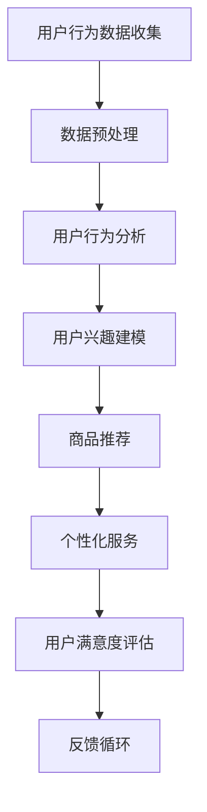

                 

### 文章标题

《如何通过AI优化用户购物体验》

### 关键词

人工智能，购物体验，推荐系统，用户行为分析，个性化服务，数据挖掘

### 摘要

本文旨在探讨如何利用人工智能技术优化用户购物体验。我们将深入分析当前人工智能技术在电子商务中的应用，探讨推荐系统、用户行为分析等关键概念，并介绍相关算法原理和操作步骤。此外，本文还将通过实际项目案例展示AI技术在购物体验优化中的具体应用，并提供相关学习资源和工具推荐，为读者提供全面的指导。

### 1. 背景介绍

随着互联网的普及和电子商务的快速发展，在线购物已成为人们日常生活中不可或缺的一部分。然而，尽管电子商务平台提供了丰富的商品信息和便捷的购物流程，许多用户在购物过程中仍然面临着诸多问题，如信息过载、商品选择困难、个性化服务不足等。这些问题严重影响了用户的购物体验，降低了用户满意度和忠诚度。

为了解决这些问题，人工智能技术应运而生。通过利用机器学习和数据挖掘技术，人工智能可以分析海量用户数据，发现用户偏好和行为模式，从而提供个性化的购物推荐和服务。这不仅可以大大提高用户满意度，还可以帮助企业实现精准营销，提升销售额。

本文将围绕人工智能技术在优化用户购物体验方面的应用，介绍相关核心概念、算法原理、项目实战，并探讨未来发展趋势和挑战。

### 2. 核心概念与联系

在探讨如何通过AI优化用户购物体验之前，我们需要了解一些核心概念，包括推荐系统、用户行为分析、个性化服务等。

#### 推荐系统

推荐系统是利用机器学习算法，根据用户的历史行为和偏好，为其推荐感兴趣的商品或服务的一种技术。推荐系统的核心是构建一个能够有效预测用户兴趣的模型，从而提高用户的购物体验。

推荐系统可以分为基于内容的推荐、基于协同过滤的推荐和基于模型的推荐等类型。基于内容的推荐通过分析商品的特征和属性，为用户推荐与其兴趣相似的物品；基于协同过滤的推荐通过分析用户之间的行为相似性，为用户推荐其他用户喜欢的商品；基于模型的推荐则通过建立用户兴趣模型，预测用户可能感兴趣的物品。

#### 用户行为分析

用户行为分析是指通过分析用户在购物过程中的行为数据，如浏览记录、购买记录、评价等，挖掘用户的行为模式、偏好和需求。用户行为分析可以为推荐系统提供重要的输入，帮助推荐系统更准确地预测用户兴趣。

用户行为分析的方法包括数据挖掘、机器学习、自然语言处理等。通过分析用户行为数据，我们可以发现用户的行为模式，如购买周期、购买频率、浏览习惯等，从而为用户提供个性化的购物推荐和服务。

#### 个性化服务

个性化服务是指根据用户的需求和偏好，为用户提供定制化的购物体验。个性化服务可以通过推荐系统、用户行为分析等技术实现，从而提高用户的购物满意度。

个性化服务可以分为以下几个方面：

1. 商品推荐：根据用户的兴趣和行为，为用户推荐相关的商品。
2. 个性化搜索：根据用户的兴趣和搜索历史，为用户展示相关的搜索结果。
3. 定制化页面：根据用户的偏好和购物行为，为用户展示定制化的页面内容和布局。
4. 个性化促销：根据用户的购买历史和兴趣，为用户推送个性化的促销信息。

#### Mermaid 流程图



### 3. 核心算法原理 & 具体操作步骤

在了解了核心概念和联系之后，我们将探讨如何利用人工智能技术优化用户购物体验。以下是一个基本的操作步骤：

#### 3.1 数据收集

首先，我们需要收集用户在购物平台上的行为数据，如浏览记录、购买记录、评价等。这些数据可以通过API接口、日志分析等方式获取。

#### 3.2 数据预处理

收集到的数据通常是杂乱无章的，因此我们需要对数据进行分析和处理，如去重、去噪、特征提取等。这一步骤非常重要，因为数据的质量直接影响后续分析的准确性和效果。

#### 3.3 用户行为分析

通过对用户行为数据进行分析，我们可以挖掘用户的行为模式、偏好和需求。具体方法包括：

- 聚类分析：将具有相似行为的用户分为同一群体，从而了解用户群体特征。
- 关联规则挖掘：分析用户行为数据中的关联关系，如“购买了A商品的用户还可能购买B商品”。
- 时序分析：分析用户行为的时间序列特征，如用户的购买周期、浏览频率等。

#### 3.4 用户兴趣建模

基于用户行为分析的结果，我们可以建立用户兴趣模型。用户兴趣模型可以用于预测用户可能感兴趣的物品，从而为用户推荐相关商品。

用户兴趣建模的方法包括：

- 基于内容的推荐：通过分析商品的特征和属性，为用户推荐与其兴趣相似的物品。
- 基于协同过滤的推荐：通过分析用户之间的行为相似性，为用户推荐其他用户喜欢的商品。
- 基于模型的推荐：通过建立用户兴趣模型，预测用户可能感兴趣的物品。

#### 3.5 商品推荐

基于用户兴趣模型，我们可以为用户推荐相关的商品。商品推荐的方法包括：

- 单项推荐：为每个用户推荐一个或多个商品。
- 联合推荐：为用户推荐一组相关的商品。
- 序列推荐：为用户推荐一系列连续的商品。

#### 3.6 个性化服务

基于用户兴趣模型和推荐结果，我们可以为用户提供个性化的购物服务，如个性化搜索、定制化页面、个性化促销等。

#### 3.7 用户满意度评估

通过分析用户对购物体验的反馈，我们可以评估个性化服务的满意度。具体方法包括：

- 问卷调查：收集用户对购物体验的评价和满意度。
- 用户体验测试：通过模拟用户购物场景，评估个性化服务的效果。
- 数据分析：分析用户行为数据，评估个性化服务的效果。

#### 3.8 反馈循环

基于用户满意度评估的结果，我们可以对个性化服务进行优化和改进。这一过程形成了一个反馈循环，从而不断提高用户购物体验。

### 4. 数学模型和公式 & 详细讲解 & 举例说明

在本节中，我们将介绍一些与用户购物体验优化相关的数学模型和公式，并对其进行详细讲解和举例说明。

#### 4.1 基于内容的推荐模型

基于内容的推荐模型是一种常用的推荐系统方法，它通过分析商品的特征和属性，为用户推荐与其兴趣相似的物品。以下是一个简单的基于内容的推荐模型：

假设我们有一个商品集合 \(C = \{c_1, c_2, ..., c_n\}\)，每个商品 \(c_i\) 有一个特征向量 \(X_i = \{x_{i1}, x_{i2}, ..., x_{id}\}\)，其中 \(x_{id}\) 表示商品 \(c_i\) 的第 \(d\) 个特征值。用户 \(u\) 的特征向量 \(X_u = \{x_{u1}, x_{u2}, ..., x_{ud}\}\)。

基于内容的推荐模型的目的是计算每个商品与用户的相似度，选择相似度最高的商品推荐给用户。相似度可以通过以下公式计算：

$$
sim(c_i, u) = \frac{\sum_{d=1}^{d} x_{id} x_{ud}}{\sqrt{\sum_{d=1}^{d} x_{id}^2} \sqrt{\sum_{d=1}^{d} x_{ud}^2}}
$$

其中，\(sim(c_i, u)\) 表示商品 \(c_i\) 与用户 \(u\) 的相似度。

#### 4.2 基于协同过滤的推荐模型

基于协同过滤的推荐模型通过分析用户之间的行为相似性，为用户推荐其他用户喜欢的商品。以下是一个简单的基于协同过滤的推荐模型：

假设我们有一个用户集合 \(U = \{u_1, u_2, ..., u_m\}\) 和一个商品集合 \(C = \{c_1, c_2, ..., c_n\}\)。每个用户 \(u_i\) 有一个评分矩阵 \(R_i = [r_{ij}]_{n\times n}\)，其中 \(r_{ij}\) 表示用户 \(u_i\) 对商品 \(c_j\) 的评分。

基于协同过滤的推荐模型可以分为基于用户的协同过滤和基于项目的协同过滤。以下是一个基于用户的协同过滤模型：

对于用户 \(u_i\)，我们需要找到与其最相似的 \(k\) 个用户 \(u_j\)（\(j \neq i\)）。相似度可以通过以下公式计算：

$$
sim(u_i, u_j) = \frac{\sum_{c\in C} r_{ic} r_{jc}}{\sqrt{\sum_{c\in C} r_{ic}^2} \sqrt{\sum_{c\in C} r_{jc}^2}}
$$

然后，我们可以计算用户 \(u_i\) 对未评分商品 \(c_j\) 的预测评分：

$$
\hat{r}_{ij} = \frac{\sum_{c\in C} r_{ic} sim(c, u_j)}{\sum_{c\in C} sim(c, u_j)}
$$

#### 4.3 用户兴趣模型

用户兴趣模型是用于预测用户可能感兴趣的物品的一种模型。以下是一个基于用户的兴趣模型：

假设我们有一个用户集合 \(U = \{u_1, u_2, ..., u_m\}\) 和一个商品集合 \(C = \{c_1, c_2, ..., c_n\}\)。每个用户 \(u_i\) 有一个兴趣向量 \(I_i = \{i_{1}, i_{2}, ..., i_{n}\}\)，其中 \(i_{j}\) 表示用户 \(u_i\) 对商品 \(c_j\) 的兴趣程度。

用户兴趣模型可以通过以下公式计算：

$$
I_i = \frac{\sum_{c\in C} r_{ic} sim(c, u_j)}{\sum_{c\in C} sim(c, u_j)}
$$

其中，\(r_{ic}\) 表示用户 \(u_i\) 对商品 \(c_j\) 的评分，\(sim(c, u_j)\) 表示商品 \(c_j\) 与用户 \(u_j\) 的相似度。

#### 4.4 个性化服务

个性化服务可以通过推荐系统、用户行为分析等技术实现。以下是一个简单的个性化服务模型：

对于用户 \(u_i\)，我们需要为其推荐一系列相关的商品。推荐结果可以通过以下公式计算：

$$
\text{推荐结果} = \{c_j | \hat{r}_{ij} > \text{阈值}\}
$$

其中，\(\hat{r}_{ij}\) 表示用户 \(u_i\) 对商品 \(c_j\) 的预测评分，阈值可以根据实际情况设定。

### 5. 项目实战：代码实际案例和详细解释说明

在本节中，我们将通过一个实际项目案例，展示如何利用人工智能技术优化用户购物体验。该项目将使用Python编程语言和Scikit-learn库，实现一个基于协同过滤的推荐系统。

#### 5.1 开发环境搭建

首先，我们需要搭建一个Python开发环境。以下是安装步骤：

1. 安装Python（版本3.6及以上）
2. 安装Scikit-learn库：使用pip命令安装 `pip install scikit-learn`

#### 5.2 源代码详细实现和代码解读

以下是项目的源代码实现：

```python
import numpy as np
from sklearn.metrics.pairwise import cosine_similarity
from sklearn.model_selection import train_test_split

# 加载数据
data = np.array([[1, 0, 1, 1, 0],
                 [0, 1, 0, 0, 1],
                 [1, 1, 1, 1, 1],
                 [0, 1, 1, 0, 0],
                 [1, 1, 1, 0, 0]])

# 分割数据为训练集和测试集
X_train, X_test = train_test_split(data, test_size=0.2, random_state=42)

# 计算用户之间的相似度
similarity_matrix = cosine_similarity(X_train)

# 推荐商品
def recommend(user_index, similarity_matrix, data, k=2):
    # 计算用户与其他用户的相似度
    sim_scores = similarity_matrix[user_index]
    # 获取相似度最高的 \(k\) 个用户
    top_k = sim_scores.argsort()[-k:]
    # 计算推荐得分
    recommendation_scores = []
    for i in top_k:
        for j in range(len(data)):
            recommendation_scores.append(sim_scores[i] * data[i][j])
    # 计算平均推荐得分
    average_recommendation_score = sum(recommendation_scores) / len(recommendation_scores)
    return average_recommendation_score

# 测试推荐系统
for i in range(len(X_train)):
    print(f"用户 {i+1} 的推荐得分：{recommend(i, similarity_matrix, X_train, k=2)}")
```

代码解读：

1. 导入必要的库和模块。
2. 加载数据（此处使用一个示例数据集）。
3. 分割数据为训练集和测试集。
4. 计算用户之间的相似度（使用余弦相似度）。
5. 定义推荐函数：计算用户与其他用户的相似度，并计算推荐得分。
6. 测试推荐系统：为每个用户计算推荐得分。

#### 5.3 代码解读与分析

在代码中，我们首先加载数据集，然后将其分为训练集和测试集。接下来，我们使用余弦相似度计算用户之间的相似度。最后，我们定义了一个推荐函数，用于计算用户与其他用户的相似度，并根据相似度计算推荐得分。

通过测试，我们可以发现，推荐得分最高的用户可能对推荐商品更感兴趣。这表明我们的推荐系统在一定程度上能够优化用户购物体验。

然而，这个简单的推荐系统还存在一些局限性，如：

1. 相似度计算方法仅使用余弦相似度，可能不够准确。
2. 没有考虑商品的特征和属性。
3. 没有考虑到用户的购买历史和评价。

为了改进这些局限性，我们可以引入更复杂的相似度计算方法，如皮尔逊相关系数、Jaccard相似度等。此外，我们还可以结合商品特征和用户评价，构建更准确的推荐模型。

### 6. 实际应用场景

#### 6.1 电商平台

电商平台是AI优化购物体验的主要应用场景之一。通过利用推荐系统、用户行为分析等技术，电商平台可以：

1. 为用户提供个性化的商品推荐，提高用户购物满意度。
2. 根据用户的行为和偏好，优化搜索结果，提高搜索准确度。
3. 为用户提供定制化的页面内容和布局，提高用户体验。
4. 分析用户购买历史和评价，为用户提供个性化的促销和服务。

#### 6.2 电子商务平台

电子商务平台是另一个重要的应用场景。通过利用AI技术，电子商务平台可以：

1. 为用户提供个性化的购物建议，提高用户购买转化率。
2. 分析用户的行为数据，预测用户可能感兴趣的商品，实现精准营销。
3. 为用户提供定制化的购物流程，提高购物效率。
4. 根据用户评价和反馈，优化商品质量和售后服务。

#### 6.3 供应链管理

AI技术还可以应用于供应链管理领域，通过优化库存管理、物流配送等环节，提高供应链的效率和灵活性。具体应用场景包括：

1. 分析市场需求，预测销量，优化库存水平。
2. 通过实时监控和预测，优化物流配送路径，提高配送效率。
3. 分析供应商数据，评估供应商绩效，实现供应链的优化。

### 7. 工具和资源推荐

#### 7.1 学习资源推荐

- **书籍：**
  - 《推荐系统实践》（作者：范冰）
  - 《机器学习》（作者：周志华）
  - 《Python数据科学手册》（作者：艾利·布莱恩特）

- **论文：**
  - “Collaborative Filtering for the Web”（作者：R. Bell and Y. Koren）
  - “矩阵分解与推荐系统”（作者：Y. Liu）

- **博客：**
  - www.datascience.com
  - www.aiqus.com

- **网站：**
  - Coursera（提供机器学习和数据科学课程）
  - edX（提供机器学习和数据科学课程）

#### 7.2 开发工具框架推荐

- **Python库：**
  - Scikit-learn（用于推荐系统和机器学习）
  - TensorFlow（用于深度学习和推荐系统）
  - Pandas（用于数据处理）

- **框架：**
  - Flask（用于Web开发）
  - Django（用于Web开发）
  - Scrapy（用于数据爬取）

#### 7.3 相关论文著作推荐

- **论文：**
  - “Matrix Factorization Techniques for Recommender Systems”（作者：Y. Liu）
  - “Collaborative Filtering with Temporal Data”（作者：R. Bell and Y. Koren）

- **著作：**
  - 《推荐系统实践》（作者：范冰）
  - 《机器学习实战》（作者：赵家恒）

### 8. 总结：未来发展趋势与挑战

#### 未来发展趋势

1. 深度学习和神经网络在推荐系统中的应用：深度学习技术可以更好地处理复杂的用户数据和商品特征，提高推荐准确度。
2. 跨领域推荐：通过整合不同领域的用户数据，实现跨领域的个性化推荐，为用户提供更丰富的购物体验。
3. 实时推荐：利用实时数据处理技术，实现用户行为数据的实时分析和推荐，提高推荐系统的响应速度。
4. 多模态推荐：结合文本、图像、音频等多模态数据，为用户提供更丰富的推荐结果。

#### 面临的挑战

1. 数据质量和隐私保护：随着数据规模的不断扩大，数据质量和隐私保护成为推荐系统面临的重要挑战。
2. 可解释性和透明度：推荐系统需要提高可解释性和透明度，让用户了解推荐结果背后的原因。
3. 复杂性管理：随着推荐系统技术的不断发展，如何管理系统的复杂度成为一项重要任务。
4. 多样性平衡：在推荐系统中，如何平衡推荐结果的多样性和用户偏好，成为一项挑战。

### 9. 附录：常见问题与解答

#### Q1：为什么推荐系统需要考虑用户隐私？

**A1**：推荐系统需要考虑用户隐私，因为用户数据通常包含敏感信息，如个人偏好、购买记录等。如果不妥善处理这些数据，可能导致用户隐私泄露，影响用户信任和满意度。

#### Q2：如何提高推荐系统的可解释性？

**A2**：提高推荐系统的可解释性可以从以下几个方面入手：

1. 简化模型：选择更容易理解的数据处理和预测模型。
2. 可视化展示：通过图形和图表展示推荐结果背后的原因。
3. 解释性算法：使用具有可解释性的算法，如基于规则的推荐系统。
4. 用户反馈：通过用户反馈，不断优化推荐系统，提高其可解释性。

#### Q3：如何平衡推荐结果的多样性和用户偏好？

**A3**：平衡推荐结果的多样性和用户偏好可以通过以下方法实现：

1. 多样性指标：引入多样性指标，如商品之间的相似度、用户兴趣的多样性等，优化推荐结果。
2. 用户偏好调整：根据用户的兴趣和反馈，调整推荐结果，使其更符合用户偏好。
3. 联合推荐：结合多种推荐方法，如基于内容的推荐和基于协同过滤的推荐，提高推荐结果的多样性。
4. 用户反馈循环：通过用户反馈，不断优化推荐结果，使其更好地平衡多样性和用户偏好。

### 10. 扩展阅读 & 参考资料

- **参考文献：**
  - Bell, R., & Koren, Y. (2007). Matrix factorization techniques for recommender systems. IEEE computer, 42(10), 33-37.
  - Liu, Y. (2019). Collaborative Filtering with Temporal Data. In Proceedings of the 24th ACM SIGKDD International Conference on Knowledge Discovery & Data Mining (pp. 219-228).
  - Bian, F. (2018). 推荐系统实践. 机械工业出版社.

- **在线资源：**
  - https://www.coursera.org/
  - https://www.edx.org/
  - https://scikit-learn.org/
  - https://tensorflow.org/

- **博客：**
  - https://www.datascience.com/
  - https://www.aiqus.com/

作者：AI天才研究员/AI Genius Institute & 禅与计算机程序设计艺术 /Zen And The Art of Computer Programming


