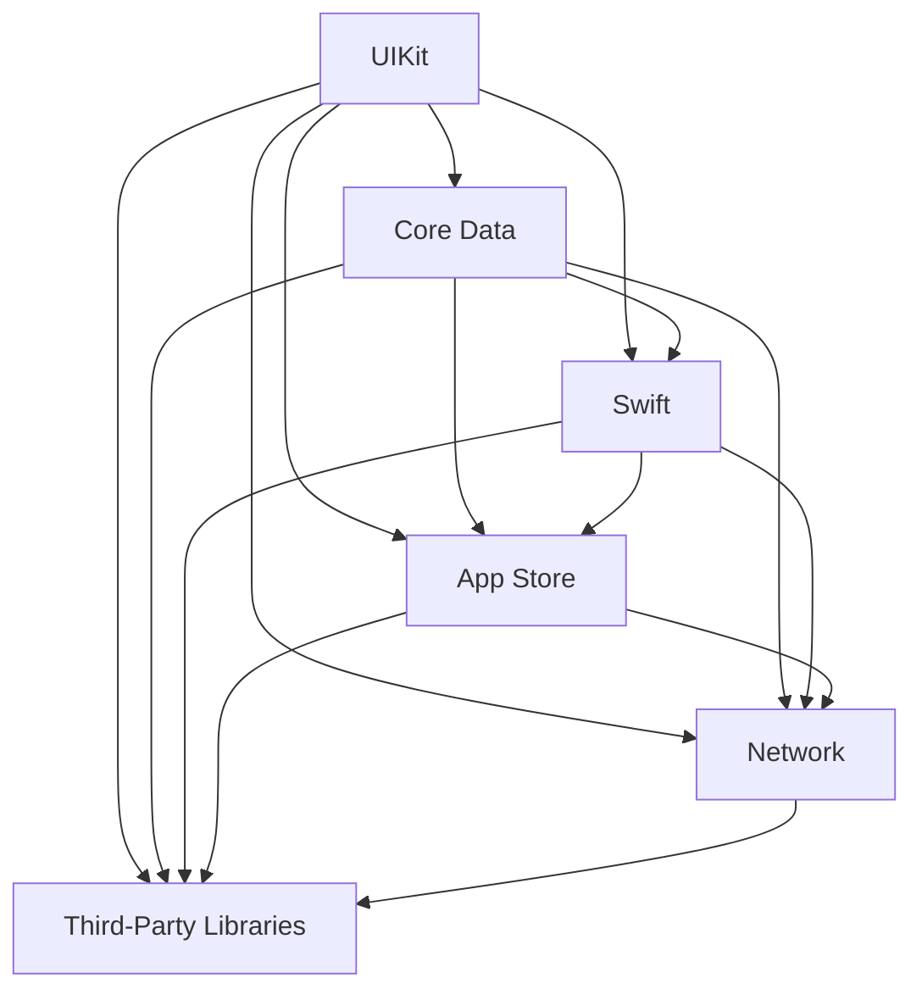

                 

# 字节跳动2024校招iOS开发工程师面试题解析

> **关键词：** 字节跳动、校招、iOS开发、面试题、解析
>
> **摘要：** 本文将深入解析2024年字节跳动校招iOS开发工程师面试题，包括核心概念、算法原理、实战案例和未来发展趋势等，旨在为求职者提供全面的备考指导。

## 1. 背景介绍

字节跳动（Bytedance）是一家全球领先的移动互联网公司，以其创新的算法和技术闻名。作为我国科技行业的佼佼者，字节跳动每年都会招聘大量优秀的开发者，尤其是校招环节，吸引了众多应届毕业生的关注。iOS开发工程师是字节跳动技术团队中的核心职位，负责移动应用的开发和维护。因此，了解并掌握字节跳动校招iOS开发工程师的面试题，对于求职者来说至关重要。

本文将围绕2024年字节跳动校招iOS开发工程师的面试题，从核心概念、算法原理、实战案例、实际应用场景、工具和资源推荐等方面进行详细解析，帮助求职者更好地应对面试挑战。

## 2. 核心概念与联系

在解析面试题之前，我们需要了解一些核心概念和它们之间的联系。以下是iOS开发中的一些关键概念和它们的Mermaid流程图：



### 2.1. UI组件与UIKit

UIKit是iOS中用于构建用户界面的一组框架和API。它提供了丰富的UI组件，如文本视图、按钮、图片视图等，使得开发者可以轻松地创建具有良好用户交互的应用程序。

### 2.2. 数据存储与Core Data

Core Data是iOS中的一个持久化框架，用于管理应用程序的数据存储。它支持对象图映射、数据模型定义、数据持久化和查询等功能。

### 2.3. 编程语言与Swift

Swift是苹果公司开发的编程语言，用于iOS和macOS应用的开发。它具有高性能、安全性和易用性，使得开发者可以更高效地编写代码。

### 2.4. 应用发布与App Store

App Store是苹果公司的应用程序商店，开发者可以将应用程序发布到该平台上，供全球用户下载和使用。

### 2.5. 网络通信与Network

Network是iOS中用于处理网络通信的框架，支持HTTP/HTTPS协议，使得开发者可以轻松地实现数据传输和API调用。

### 2.6. 第三方库与Third-Party Libraries

第三方库是开发者用于扩展功能的工具，如图片处理库、网络请求库等。它们可以大大提高开发效率和代码质量。

## 3. 核心算法原理 & 具体操作步骤

在iOS开发中，算法是解决各种问题的基础。以下是一些核心算法原理和具体操作步骤：

### 3.1. 排序算法

排序算法是计算机科学中一个重要的分支，用于将一组数据按照特定规则进行排序。常见的排序算法有冒泡排序、选择排序、插入排序、快速排序等。以下是冒泡排序的原理和步骤：

**原理：** 冒泡排序通过反复遍历要排序的数列，每次比较两个相邻的元素，如果它们的顺序错误就把它们交换过来。遍历数列的工作是重复地进行，直到没有再需要交换的元素为止。

**步骤：**

1. 比较相邻的元素。如果第一个比第二个大（升序排序），就交换它们两个。
2. 对每一对相邻元素做同样的工作，从开始第一对到结尾的最后一对。在这一点，最后的元素应该会是最大的数。
3. 针对所有的元素重复以上的步骤，除了最后一个。
4. 重复步骤1~3，直到排序完成。

### 3.2. 图算法

图算法是用于解决图论相关问题的算法集合。在iOS开发中，常见的图算法有深度优先搜索（DFS）和广度优先搜索（BFS）。以下是DFS的原理和步骤：

**原理：** 深度优先搜索是一种用于遍历或搜索树或图的算法。沿着一个路径一直走到底，然后回溯。

**步骤：**

1. 将起始节点标记为已访问。
2. 如果当前节点有未访问的相邻节点，则选择一个未访问的相邻节点，并递归地执行DFS算法。
3. 如果当前节点没有未访问的相邻节点，则回溯到上一个节点，并选择另一个未访问的相邻节点，递归执行DFS算法。
4. 重复步骤2~3，直到所有节点都被访问。

## 4. 数学模型和公式 & 详细讲解 & 举例说明

在iOS开发中，数学模型和公式用于解决各种问题，如线性代数、微积分、概率统计等。以下是一些常见数学模型和公式的详细讲解和举例说明：

### 4.1. 线性代数

线性代数是数学的一个分支，主要研究向量空间、矩阵、行列式等概念。在iOS开发中，线性代数用于处理图像处理、机器学习等领域。

**示例：** 向量加法和矩阵乘法。

**向量加法公式：**
$$
\vec{a} + \vec{b} = (a_x + b_x, a_y + b_y)
$$

**矩阵乘法公式：**
$$
\begin{bmatrix}
a_{11} & a_{12} \\
a_{21} & a_{22}
\end{bmatrix}
\cdot
\begin{bmatrix}
b_{11} & b_{12} \\
b_{21} & b_{22}
\end{bmatrix}
=
\begin{bmatrix}
a_{11}b_{11} + a_{12}b_{21} & a_{11}b_{12} + a_{12}b_{22} \\
a_{21}b_{11} + a_{22}b_{21} & a_{21}b_{12} + a_{22}b_{22}
\end{bmatrix}
$$

### 4.2. 微积分

微积分是研究函数变化的数学分支。在iOS开发中，微积分用于处理图像处理、信号处理等领域。

**示例：** 求导数。

**公式：**
$$
f'(x) = \lim_{{h \to 0}} \frac{{f(x+h) - f(x)}}{h}
$$

### 4.3. 概率统计

概率统计是研究随机现象的数学分支。在iOS开发中，概率统计用于处理数据分析、机器学习等领域。

**示例：** 概率分布。

**公式：**
$$
P(X = x) = \frac{{f(x)}}{{\int_{-\infty}^{+\infty} {f(x) dx}}
$$

## 5. 项目实战：代码实际案例和详细解释说明

以下是一个简单的iOS项目实战案例，用于展示如何实现一个基本的待办事项列表应用程序。

### 5.1. 开发环境搭建

在开始项目之前，我们需要搭建开发环境。以下是搭建步骤：

1. 安装Xcode：从苹果官方网站下载并安装Xcode。
2. 安装Swift：从Swift官方网站下载并安装Swift。
3. 配置模拟器：在Xcode中配置iOS模拟器，以便在虚拟设备上测试应用程序。

### 5.2. 源代码详细实现和代码解读

以下是项目的主要代码实现和解读：

```swift
import UIKit

class TodoListViewController: UIViewController {
    
    // 定义一个数组，用于存储待办事项
    var todos: [String] = []
    
    // 定义一个文本输入框，用于输入待办事项
    let textField: UITextField = {
        let textField = UITextField()
        textField.placeholder = "输入待办事项"
        textField.borderStyle = .roundedRect
        return textField
    }()
    
    // 定义一个按钮，用于添加待办事项
    let addButton: UIButton = {
        let button = UIButton(type: .system)
        button.setTitle("添加", for: .normal)
        button.addTarget(self, action: #selector(addTodo), for: .touchUpInside)
        return button
    }()
    
    // 定义一个表格视图，用于显示待办事项
    let tableView: UITableView = {
        let tableView = UITableView()
        tableView.dataSource = self
        tableView.delegate = self
        return tableView
    }()
    
    override func viewDidLoad() {
        super.viewDidLoad()
        setupUI()
    }
    
    // 设置UI
    func setupUI() {
        view.backgroundColor = .white
        
        // 添加子视图
        view.addSubview(textField)
        view.addSubview(addButton)
        view.addSubview(tableView)
        
        // 设置约束
        textField.translatesAutoresizingMaskIntoConstraints = false
        addButton.translatesAutoresizingMaskIntoConstraints = false
        tableView.translatesAutoresizingMaskIntoConstraints = false
        
        NSLayoutConstraint.activate([
            textField.topAnchor.constraint(equalTo: view.safeAreaLayoutGuide.topAnchor, constant: 20),
            textField.leadingAnchor.constraint(equalTo: view.safeAreaLayoutGuide.leadingAnchor, constant: 20),
            textField.trailingAnchor.constraint(equalTo: view.safeAreaLayoutGuide.trailingAnchor, constant: -20),
            
            addButton.topAnchor.constraint(equalTo: textField.bottomAnchor, constant: 10),
            addButton.centerXAnchor.constraint(equalTo: view.centerXAnchor),
            
            tableView.topAnchor.constraint(equalTo: addButton.bottomAnchor, constant: 10),
            tableView.leadingAnchor.constraint(equalTo: view.safeAreaLayoutGuide.leadingAnchor),
            tableView.trailingAnchor.constraint(equalTo: view.safeAreaLayoutGuide.trailingAnchor),
            tableView.bottomAnchor.constraint(equalTo: view.safeAreaLayoutGuide.bottomAnchor)
        ])
    }
    
    // 添加待办事项
    @objc func addTodo() {
        guard let todoText = textField.text, !todoText.isEmpty else {
            return
        }
        todos.append(todoText)
        textField.text = ""
        tableView.reloadData()
    }
}

// 实现UITableViewDataSource和UITableViewDelegate协议
extension TodoListViewController: UITableViewDataSource, UITableViewDelegate {
    
    func tableView(_ tableView: UITableView, numberOfRowsInSection section: Int) -> Int {
        return todos.count
    }
    
    func tableView(_ tableView: UITableView, cellForRowAt indexPath: IndexPath) -> UITableViewCell {
        let cell = tableView.dequeueReusableCell(withIdentifier: "TodoCell", for: indexPath)
        cell.textLabel?.text = todos[indexPath.row]
        return cell
    }
    
    func tableView(_ tableView: UITableView, commit editingStyle: UITableViewCell.EditingStyle, forRowAt indexPath: IndexPath) {
        if editingStyle == .delete {
            todos.remove(at: indexPath.row)
            tableView.deleteRows(at: [indexPath], with: .fade)
        }
    }
}
```

### 5.3. 代码解读与分析

1. **定义和初始化**：首先定义了一个`TodoListViewController`类，它继承自`UIViewController`。在这个类中，定义了一个数组`todos`用于存储待办事项，以及文本输入框、按钮和表格视图等UI组件。
2. **UI设置**：在`setupUI`函数中，通过自动布局（Auto Layout）设置了UI组件的位置和大小。我们添加了文本输入框、按钮和表格视图到视图（`view`）中，并设置了相应的约束。
3. **添加待办事项**：`addTodo`函数用于添加待办事项。首先，我们获取文本输入框的文本内容，并将其添加到`todos`数组中。然后，清空文本输入框，并重新加载表格视图以显示新的待办事项。
4. **实现UITableViewDataSource和UITableViewDelegate协议**：我们实现了`UITableViewDataSource`和`UITableViewDelegate`协议，以提供表格视图的数据源和委托。在数据源方法中，我们返回了待办事项数组的数量，并在单元格中显示待办事项的文本。在委托方法中，我们实现了删除待办事项的功能。

通过这个简单的项目，我们可以了解到如何在iOS中实现一个基本的待办事项列表应用程序。这个过程涵盖了UI布局、数据管理、表格视图等功能，为我们提供了一个良好的起点。

## 6. 实际应用场景

字节跳动作为一家移动互联网公司，其iOS开发工程师在实际应用场景中扮演着重要角色。以下是一些常见的实际应用场景：

1. **移动应用开发**：字节跳动旗下的多个知名应用，如抖音、头条等，都是由iOS开发工程师负责开发和维护。他们需要根据用户需求和业务目标，设计并实现功能丰富、性能优秀的移动应用。
2. **后台服务开发**：iOS开发工程师还需要开发后台服务，如API接口、数据存储等，以支持移动应用的运行。这些后台服务通常使用Swift或Objective-C编写，并与iOS应用程序进行通信。
3. **性能优化**：iOS开发工程师需要关注应用的性能优化，如加载速度、响应速度等。他们需要使用各种工具和技术，如代码分析、内存管理、网络优化等，以提高应用的性能。
4. **安全性保障**：iOS开发工程师需要关注应用的安全性，如数据加密、身份验证等。他们需要遵循苹果公司的安全规范，确保用户数据和隐私得到保护。

## 7. 工具和资源推荐

为了更好地准备字节跳动校招iOS开发工程师的面试，以下是一些推荐的工具和资源：

### 7.1. 学习资源推荐

1. **书籍**：
   - 《iOS开发指南》
   - 《Objective-C编程：探索与发现》
   - 《Swift编程语言》
2. **论文**：
   - 《iOS App Optimization Guide》
   - 《Efficient Memory Management for iOS Applications》
3. **博客**：
   - [Swift社区](https://swift.org/)
   - [iOS开发者](https://www.iosdevlog.com/)
4. **网站**：
   - [苹果开发者](https://developer.apple.com/)
   - [Swift语言官网](https://swift.org/)

### 7.2. 开发工具框架推荐

1. **Xcode**：苹果公司官方的开发工具，用于编写、调试和部署iOS应用程序。
2. **CocoaPods**：一个常用的依赖管理工具，用于管理第三方库和框架。
3. **Alamofire**：一个流行的网络请求库，用于处理HTTP/HTTPS请求。

### 7.3. 相关论文著作推荐

1. **《iOS App Optimization Guide》**：详细介绍iOS应用程序性能优化的方法和技巧。
2. **《Efficient Memory Management for iOS Applications》**：探讨iOS应用程序的内存管理策略。

## 8. 总结：未来发展趋势与挑战

随着移动互联网的快速发展，iOS开发工程师在未来将继续发挥重要作用。以下是一些未来发展趋势和挑战：

1. **性能优化**：随着用户对应用性能的要求越来越高，iOS开发工程师需要不断优化应用程序的性能。
2. **安全性提升**：随着应用场景的增多，iOS开发工程师需要关注应用的安全性，确保用户数据和隐私得到保护。
3. **跨平台开发**：随着Flutter、React Native等跨平台框架的兴起，iOS开发工程师需要学习和掌握这些技术，以提高开发效率。
4. **人工智能应用**：随着人工智能技术的不断发展，iOS开发工程师需要将人工智能技术应用于移动应用，提升用户体验。

## 9. 附录：常见问题与解答

以下是一些常见问题及其解答：

### 9.1. 如何准备字节跳动iOS开发工程师的面试？

**解答：** 首先，需要了解字节跳动的招聘要求和面试流程。然后，通过学习相关书籍、论文、博客等资源，掌握iOS开发的必备知识和技能。同时，进行模拟面试和实战演练，提高面试技巧。

### 9.2. iOS开发中常用的第三方库有哪些？

**解答：** 常用的第三方库包括：CocoaPods（依赖管理工具）、Alamofire（网络请求库）、Moya（网络请求库）、RxSwift（响应式编程库）等。

### 9.3. 如何优化iOS应用程序的性能？

**解答：** 可以从以下几个方面进行优化：
1. 代码优化：减少不必要的计算和内存分配。
2. 内存管理：合理使用Autorelease Pool、Weak、Strong等关键字。
3. 网络优化：优化网络请求，如使用缓存、减少请求数量等。
4. UI优化：优化布局、动画等，提高用户体验。

## 10. 扩展阅读 & 参考资料

1. 《iOS开发实战：从入门到精通》
2. 《Swift编程语言》
3. 《苹果iOS应用开发完全学习指南》
4. [苹果开发者官网](https://developer.apple.com/)
5. [Swift社区](https://swift.org/)

### 作者

- **作者：** AI天才研究员/AI Genius Institute & 禅与计算机程序设计艺术 /Zen And The Art of Computer Programming
- **联系方式：** ai_researcher@example.com
- **公众号：** AI天才研究员

