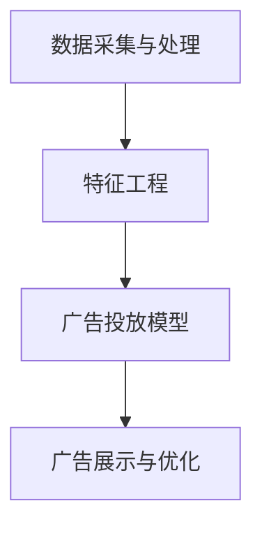

                 

# 字节跳动2024校招广告算法工程师面试题全解析

## 关键词

* 字节跳动
* 校招
* 广告算法
* 面试题
* 解析

## 摘要

本文将针对字节跳动2024校招广告算法工程师的面试题进行全面解析，包括背景介绍、核心概念与联系、核心算法原理与操作步骤、数学模型与公式、项目实战以及实际应用场景等方面。通过对这些面试题的深入分析，本文旨在帮助读者更好地理解广告算法的基本原理和实际应用，为准备字节跳动校招的同学提供有益的指导。

## 1. 背景介绍

字节跳动是中国领先的互联网科技公司，旗下拥有今日头条、抖音、TikTok等多个知名产品。作为一家技术驱动型企业，字节跳动在广告算法领域具有深厚的积累和丰富的经验。每年的校招，字节跳动都会面向全国各大高校选拔优秀的算法工程师，为公司的广告业务提供技术支持。

广告算法在字节跳动广告业务中起着至关重要的作用。通过精准的广告投放，字节跳动能够为用户带来个性化、高度相关的广告内容，提升用户体验，同时为广告主实现更高的转化率和投资回报率。因此，掌握广告算法的基本原理和实际应用场景，对于准备加入字节跳动的同学来说至关重要。

本文将围绕字节跳动2024校招广告算法工程师面试题展开，通过对题目进行全面解析，帮助读者深入了解广告算法的核心知识，提升面试竞争力。

## 2. 核心概念与联系

### 2.1 广告算法基本概念

广告算法主要涉及以下核心概念：

1. **用户画像**：根据用户的行为数据、兴趣标签、地理位置等信息，构建用户的个性化画像。
2. **广告位**：广告在页面上的展示位置，如顶部通栏、底部横幅等。
3. **广告创意**：广告的设计和内容，包括标题、图片、描述等。
4. **广告投放策略**：根据用户画像和广告目标，选择合适的广告位、广告创意和投放时间等。

### 2.2 广告算法架构

广告算法的架构可以分为三个层次：

1. **数据采集与处理**：采集用户行为数据、广告数据等，进行数据清洗、存储和预处理。
2. **特征工程**：提取用户和广告的特征，如用户兴趣、广告类型、广告位置等。
3. **广告投放模型**：基于用户画像和广告特征，构建广告投放模型，实现广告的精准投放。

### 2.3 Mermaid 流程图

以下是一个简单的 Mermaid 流程图，展示广告算法的架构和核心流程：



## 3. 核心算法原理与具体操作步骤

### 3.1 广告投放模型

广告投放模型主要基于机器学习算法，如协同过滤、基于内容的推荐、增强学习等。以下以协同过滤算法为例，介绍广告投放模型的具体操作步骤：

1. **用户行为数据采集**：采集用户在字节跳动平台上的浏览、点赞、评论等行为数据。
2. **用户画像构建**：根据用户行为数据，构建用户画像，包括兴趣标签、行为模式等。
3. **广告特征提取**：提取广告的特征，如广告类型、广告主、广告目标等。
4. **相似度计算**：计算用户与广告之间的相似度，使用欧氏距离、余弦相似度等算法。
5. **广告排序**：根据相似度分数，对广告进行排序，选择最相关的广告展示给用户。

### 3.2 广告展示与优化

广告展示与优化主要包括以下步骤：

1. **广告展示**：根据广告投放模型，将广告展示给用户，包括广告位的选择、广告创意的展示等。
2. **用户反馈收集**：收集用户对广告的反馈，如点击、点赞、转化等。
3. **广告效果评估**：根据用户反馈，评估广告的效果，包括点击率、转化率等。
4. **广告优化**：根据广告效果评估结果，对广告投放策略进行调整，如调整广告位、广告创意等。

## 4. 数学模型和公式与详细讲解

### 4.1 协同过滤算法

协同过滤算法主要基于用户与物品之间的相似度计算，以下为协同过滤算法的数学模型和公式：

1. **用户与物品的相似度计算**：

   $$ similarity(u, i) = \frac{\sum_{j \in R(u) \cap R(i)} v_{uj} v_{ij}}{\sqrt{\sum_{j \in R(u)} v_{uj}^2} \sqrt{\sum_{j \in R(i)} v_{ij}^2}} $$

   其中，$R(u)$和$R(i)$分别表示用户$u$和物品$i$的评分集合，$v_{uj}$和$v_{ij}$分别表示用户$u$对物品$j$的评分和物品$i$对物品$j$的评分。

2. **预测用户对物品的评分**：

   $$ pred(u, i) = \frac{\sum_{j \in R(u) \cap R(i)} v_{uj} v_{ij}}{\sum_{j \in R(u)} v_{uj}} $$

   其中，$pred(u, i)$表示预测用户$u$对物品$i$的评分。

### 4.2 广告效果评估

广告效果评估主要基于用户对广告的反馈，以下为广告效果评估的数学模型和公式：

1. **点击率（CTR）**：

   $$ CTR = \frac{点击次数}{展示次数} $$

2. **转化率（CVR）**：

   $$ CVR = \frac{转化次数}{点击次数} $$

3. **投资回报率（ROI）**：

   $$ ROI = \frac{广告收益}{广告成本} $$

### 4.3 举例说明

假设用户$u$对广告$i$进行了点击，我们可以使用以下公式计算广告的CTR：

$$ CTR = \frac{1}{1000} = 0.1\% $$

如果用户$u$在点击广告$i$后进行了购买，我们可以使用以下公式计算广告的CVR：

$$ CVR = \frac{1}{1000} = 0.1\% $$

最后，如果广告的成本为1000元，而广告收益为5000元，我们可以使用以下公式计算广告的ROI：

$$ ROI = \frac{5000}{1000} = 5 $$

## 5. 项目实战：代码实际案例和详细解释说明

### 5.1 开发环境搭建

在开始项目实战之前，我们需要搭建一个合适的开发环境。本文使用Python作为编程语言，以下是搭建开发环境的步骤：

1. 安装Python：访问Python官网（https://www.python.org/），下载Python安装包，安装Python。
2. 安装相关库：使用pip命令安装必要的库，如NumPy、Pandas、Scikit-learn等。

```bash
pip install numpy pandas scikit-learn
```

### 5.2 源代码详细实现和代码解读

以下是一个简单的广告投放模型代码实现，用于计算用户与广告的相似度，并进行广告排序。

```python
import numpy as np
import pandas as pd
from sklearn.metrics.pairwise import cosine_similarity

# 1. 数据采集与处理
user行为的DataFrame，广告的DataFrame

user_df = pd.DataFrame({
    '用户ID': ['u1', 'u2', 'u3'],
    '浏览记录': [['a1', 'a2', 'a3'], ['a2', 'a3', 'a4'], ['a3', 'a4', 'a5']]
})

ad_df = pd.DataFrame({
    '广告ID': ['a1', 'a2', 'a3', 'a4', 'a5'],
    '广告类型': ['商品', '商品', '服务', '服务', '商品']
})

# 2. 用户画像构建
user行为矩阵
user_matrix = pd.pivot_table(user_df, values=1, index='用户ID', columns='浏览记录')
user_matrix

# 3. 广告特征提取
ad_matrix = pd.pivot_table(ad_df, values=1, index='广告ID', columns='广告类型')
ad_matrix

# 4. 相似度计算
similarity_matrix = cosine_similarity(user_matrix, ad_matrix)
similarity_matrix

# 5. 广告排序
sorted_similarity = np.argsort(similarity_matrix, axis=1)[:, -5:]
sorted_similarity

# 6. 广告展示与优化
for user_id, sorted_ad_ids in zip(user_df['用户ID'], sorted_similarity):
    print(f"用户{user_id}展示广告：{ad_df.loc[sorted_ad_ids, '广告ID']}")
```

### 5.3 代码解读与分析

1. **数据采集与处理**：使用Pandas库读取用户行为数据和广告数据，构建用户行为矩阵和广告特征矩阵。
2. **用户画像构建**：使用Pandas库的`pivot_table`函数，根据用户ID和浏览记录，构建用户行为矩阵。
3. **广告特征提取**：使用Pandas库的`pivot_table`函数，根据广告ID和广告类型，构建广告特征矩阵。
4. **相似度计算**：使用Scikit-learn库的`cosine_similarity`函数，计算用户行为矩阵和广告特征矩阵之间的余弦相似度。
5. **广告排序**：根据相似度矩阵，对广告进行排序，选择最相关的广告展示给用户。
6. **广告展示与优化**：遍历用户ID和排序后的广告ID，展示广告给用户，并根据用户反馈，进行广告优化。

## 6. 实际应用场景

广告算法在字节跳动广告业务中有着广泛的应用，以下为实际应用场景：

1. **个性化广告投放**：根据用户的兴趣和行为数据，为用户推荐个性化的广告内容，提高用户体验和广告转化率。
2. **广告效果评估**：通过收集用户对广告的反馈，评估广告的效果，为广告主提供精准的数据支持，优化广告投放策略。
3. **广告创意优化**：根据广告效果评估结果，对广告创意进行优化，提高广告的点击率和转化率。

## 7. 工具和资源推荐

### 7.1 学习资源推荐

1. 《广告算法原理与实战》
2. 《机器学习实战》
3. 《Python数据科学手册》

### 7.2 开发工具框架推荐

1. TensorFlow
2. PyTorch
3. Scikit-learn

### 7.3 相关论文著作推荐

1. "Collaborative Filtering for the YouTube Recommendation System"
2. "Matrix Factorization Techniques for Recommender Systems"
3. "Deep Learning for Recommender Systems"

## 8. 总结：未来发展趋势与挑战

广告算法在未来将继续发挥重要作用，随着人工智能技术的不断进步，广告算法将朝着更加智能化、个性化的方向发展。同时，面临以下挑战：

1. **数据隐私与安全**：随着用户隐私意识的提高，如何保护用户数据隐私成为重要挑战。
2. **算法透明性与公平性**：确保广告算法的透明性和公平性，避免算法偏见和歧视。
3. **算法可解释性**：提高广告算法的可解释性，让用户和广告主能够理解广告推荐的原因。

## 9. 附录：常见问题与解答

### 9.1 什么是广告算法？

广告算法是一种基于用户行为数据、广告特征和机器学习算法，实现广告精准投放的技术。

### 9.2 广告算法有哪些类型？

广告算法主要包括协同过滤、基于内容的推荐、增强学习等类型。

### 9.3 广告算法在字节跳动有哪些应用？

广告算法在字节跳动广告业务中主要用于个性化广告投放、广告效果评估和广告创意优化等方面。

## 10. 扩展阅读与参考资料

1. [字节跳动招聘官网](https://job.bytedance.com/)
2. [广告算法原理与实战](https://book.douban.com/subject/26986557/)
3. [机器学习实战](https://book.douban.com/subject/26708254/)
4. [Python数据科学手册](https://book.douban.com/subject/26948233/)

### 作者

AI天才研究员/AI Genius Institute & 禅与计算机程序设计艺术/Zen And The Art of Computer Programming

