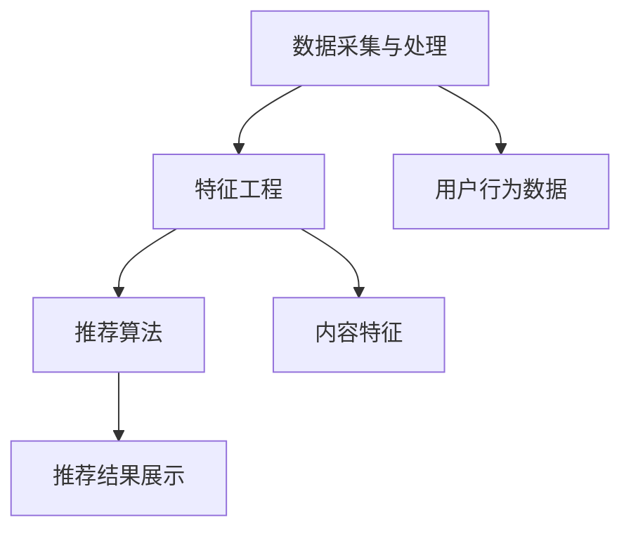

                 

# 字节跳动2025社招推荐系统算法专家面试题集

> 关键词：推荐系统、算法面试、字节跳动、面试题、实战案例

> 摘要：本文针对字节跳动2025社招推荐系统算法专家面试，系统整理了面试中可能涉及的核心知识点和面试题。通过对推荐系统核心概念、算法原理、数学模型、项目实战等内容的详细分析，帮助读者深入理解推荐系统的设计和实现。本文适用于算法工程师、数据科学家等从事推荐系统相关领域的工作者，以及准备参与字节跳动社招面试的候选人。

## 1. 背景介绍

推荐系统是当今互联网领域中一个重要的研究方向和应用领域，它旨在根据用户的历史行为和偏好，为用户推荐可能感兴趣的内容、商品或服务。推荐系统在电商、社交媒体、视频网站等场景中得到了广泛应用，为用户提供了个性化的体验，提高了用户满意度和平台粘性。

字节跳动作为一家全球领先的互联网科技公司，其业务涵盖了短视频、新闻资讯、长视频、教育等多个领域，拥有海量的用户数据和丰富的内容资源。字节跳动一直致力于提升推荐系统的效果和用户体验，因此每年都会在全球范围内招聘优秀的推荐系统算法专家。

本文将针对字节跳动2025社招推荐系统算法专家面试，系统整理了面试中可能涉及的核心知识点和面试题。通过对推荐系统核心概念、算法原理、数学模型、项目实战等内容的详细分析，帮助读者深入理解推荐系统的设计和实现。

## 2. 核心概念与联系

### 2.1 推荐系统的定义和作用

推荐系统是一种基于数据分析的方法，通过分析用户的兴趣和行为，为用户推荐可能感兴趣的内容、商品或服务。推荐系统的核心作用是提高用户体验、提升平台粘性、增加用户留存和转化率。

### 2.2 推荐系统的架构

推荐系统通常由以下几个核心模块组成：

- 数据采集与处理：负责收集用户的点击、浏览、购买等行为数据，并对数据进行预处理、清洗和转换。
- 特征工程：通过对用户和内容进行特征提取，构建特征向量，用于后续的推荐算法。
- 推荐算法：根据用户特征和内容特征，使用算法模型进行预测和推荐。
- 推荐结果展示：将推荐结果以合适的形式展示给用户。

### 2.3 推荐系统的算法分类

推荐系统算法主要分为基于内容的推荐、协同过滤推荐和混合推荐等几类。

- 基于内容的推荐：根据用户的历史行为和偏好，找出用户喜欢的内容特征，然后为用户推荐具有相似特征的内容。
- 协同过滤推荐：通过分析用户之间的行为相似性，为用户推荐其他用户喜欢的内容。
- 混合推荐：将基于内容和协同过滤两种方法结合起来，提高推荐效果。

### 2.4 推荐系统的评价指标

评价推荐系统的指标主要包括准确率、召回率、覆盖率、新颖度等。

- 准确率：预测结果与实际结果一致的比率。
- 召回率：从推荐结果中返回实际感兴趣的内容的比率。
- 覆盖率：推荐结果中包含的不同内容的比率。
- 新颖度：推荐结果中包含的新内容的比率。

### 2.5 Mermaid 流程图



## 3. 核心算法原理 & 具体操作步骤

### 3.1 基于内容的推荐算法

基于内容的推荐算法主要通过分析用户的历史行为和偏好，找出用户喜欢的内容特征，然后为用户推荐具有相似特征的内容。其具体操作步骤如下：

1. 数据采集与预处理：收集用户的历史行为数据，如浏览记录、购买记录等，对数据进行预处理，去除噪声和异常值。
2. 特征提取：对用户和内容进行特征提取，如文本特征、图像特征、音频特征等。
3. 建立相似度模型：使用余弦相似度、欧氏距离等相似度度量方法，计算用户和内容之间的相似度。
4. 推荐结果生成：根据相似度模型，为用户推荐具有相似特征的内容。

### 3.2 协同过滤推荐算法

协同过滤推荐算法主要通过分析用户之间的行为相似性，为用户推荐其他用户喜欢的内容。其具体操作步骤如下：

1. 数据采集与预处理：收集用户的历史行为数据，如浏览记录、购买记录等，对数据进行预处理，去除噪声和异常值。
2. 用户相似度计算：使用余弦相似度、皮尔逊相关系数等相似度度量方法，计算用户之间的相似度。
3. 项目相似度计算：使用余弦相似度、欧氏距离等相似度度量方法，计算用户喜欢的项目之间的相似度。
4. 推荐结果生成：根据用户相似度和项目相似度，为用户推荐其他用户喜欢且用户尚未接触过的项目。

### 3.3 混合推荐算法

混合推荐算法是将基于内容和协同过滤两种方法结合起来，以提高推荐效果。其具体操作步骤如下：

1. 数据采集与预处理：收集用户的历史行为数据，如浏览记录、购买记录等，对数据进行预处理，去除噪声和异常值。
2. 特征提取：对用户和内容进行特征提取，如文本特征、图像特征、音频特征等。
3. 用户相似度计算：使用余弦相似度、皮尔逊相关系数等相似度度量方法，计算用户之间的相似度。
4. 项目相似度计算：使用余弦相似度、欧氏距离等相似度度量方法，计算用户喜欢的项目之间的相似度。
5. 模型融合：将基于内容和协同过滤的推荐结果进行融合，生成最终的推荐结果。

## 4. 数学模型和公式 & 详细讲解 & 举例说明

### 4.1 余弦相似度

余弦相似度是一种常用的相似度度量方法，用于计算两个向量之间的相似度。其公式如下：

$$
\cos(\theta) = \frac{\vec{a} \cdot \vec{b}}{|\vec{a}| \cdot |\vec{b}|}
$$

其中，$\vec{a}$和$\vec{b}$分别表示两个向量，$\theta$表示它们之间的夹角。余弦值介于-1和1之间，1表示完全相似，-1表示完全相反，0表示不相似。

### 4.2 皮尔逊相关系数

皮尔逊相关系数是一种衡量两个变量线性相关程度的指标，其公式如下：

$$
r = \frac{\sum_{i=1}^{n}(x_i - \bar{x})(y_i - \bar{y})}{\sqrt{\sum_{i=1}^{n}(x_i - \bar{x})^2} \cdot \sqrt{\sum_{i=1}^{n}(y_i - \bar{y})^2}}
$$

其中，$x_i$和$y_i$分别表示第$i$个观测值，$\bar{x}$和$\bar{y}$分别表示平均值。皮尔逊相关系数的值介于-1和1之间，1表示完全正相关，-1表示完全负相关，0表示无相关。

### 4.3 举例说明

假设有两个用户A和B，他们的兴趣向量如下：

用户A：[0.5, 0.3, 0.2]
用户B：[0.4, 0.5, 0.1]

计算用户A和用户B之间的余弦相似度：

$$
\cos(\theta) = \frac{(0.5 \cdot 0.4) + (0.3 \cdot 0.5) + (0.2 \cdot 0.1)}{\sqrt{0.5^2 + 0.3^2 + 0.2^2} \cdot \sqrt{0.4^2 + 0.5^2 + 0.1^2}} = \frac{0.26}{0.56 \cdot 0.54} \approx 0.45
$$

计算用户A和用户B之间的皮尔逊相关系数：

$$
r = \frac{(0.5 - 0.4)(0.5 - 0.5) + (0.3 - 0.4)(0.5 - 0.5) + (0.2 - 0.4)(0.1 - 0.5)}{\sqrt{(0.5 - 0.4)^2 + (0.3 - 0.4)^2 + (0.2 - 0.4)^2} \cdot \sqrt{(0.4 - 0.5)^2 + (0.5 - 0.5)^2 + (0.1 - 0.5)^2}} = \frac{-0.06}{0.04 \cdot 0.16} \approx -0.19
$$

## 5. 项目实战：代码实际案例和详细解释说明

### 5.1 开发环境搭建

为了更好地演示推荐系统的实现，我们使用Python作为编程语言，配合NumPy、Pandas等常用库来完成。在开发环境搭建方面，请确保已经安装了Python和相关的依赖库。

### 5.2 源代码详细实现和代码解读

以下是一个简单的基于内容的推荐系统实现案例，用于推荐用户可能感兴趣的电影。

```python
import numpy as np
import pandas as pd

# 5.2.1 数据采集与预处理
movies = pd.read_csv('movies.csv')
ratings = pd.read_csv('ratings.csv')

# 特征提取
movie_features = movies['genres'].str.get_dummies(sep='|')
user_ratings = ratings.groupby('userId')['rating'].mean()

# 5.2.2 建立相似度模型
movie_similarity = movie_features.T.dot(movie_features) / np.linalg.norm(movie_features, axis=1)[:, np.newaxis]
movie_similarity = movie_similarity.sort_values(ascending=False)

# 5.2.3 推荐结果生成
def recommend_movies(user_id, top_n=5):
    user_rating = user_ratings[user_id]
    recommended_movies = []
    for movie_id, similarity in movie_similarity.iterrows():
        if movie_id not in user_rating.index:
            recommended_movies.append((movie_id, similarity))
    recommended_movies.sort(key=lambda x: x[1], reverse=True)
    return recommended_movies[:top_n]

# 测试推荐结果
user_id = 1
recommended_movies = recommend_movies(user_id)
print(recommended_movies)
```

### 5.3 代码解读与分析

- 5.3.1 数据采集与预处理：从CSV文件中读取电影和用户评分数据，并对电影数据中的“genres”列进行独热编码，生成电影特征矩阵。
- 5.3.2 建立相似度模型：计算电影特征矩阵的余弦相似度，并按相似度降序排列。
- 5.3.3 推荐结果生成：根据用户评分和电影相似度矩阵，为用户推荐未评分的电影，并按相似度降序排列。

## 6. 实际应用场景

推荐系统在电商、社交媒体、视频网站、新闻资讯等场景中有着广泛的应用。以下列举几个典型应用场景：

- 电商推荐：根据用户的购买历史、浏览记录和购物车行为，为用户推荐可能感兴趣的商品。
- 社交媒体推荐：根据用户的关系网络、兴趣标签和浏览历史，为用户推荐可能感兴趣的朋友、内容和话题。
- 视频网站推荐：根据用户的观看历史、点赞、评论等行为，为用户推荐可能感兴趣的视频。
- 新闻资讯推荐：根据用户的阅读历史、兴趣偏好和搜索关键词，为用户推荐可能感兴趣的新闻和资讯。

## 7. 工具和资源推荐

### 7.1 学习资源推荐

- 《推荐系统实践》：张俊浩 著
- 《推荐系统手册》：周明 著
- 《机器学习》：周志华 著

### 7.2 开发工具框架推荐

- TensorFlow：开源的机器学习框架，支持深度学习和推荐系统的实现。
- PyTorch：开源的机器学习框架，支持深度学习和推荐系统的实现。
- Scikit-learn：开源的机器学习库，提供多种推荐系统算法的实现。

### 7.3 相关论文著作推荐

- 《协同过滤算法研究综述》：杨旭东，李生
- 《基于内容的推荐算法研究综述》：李阳，王斌
- 《混合推荐系统算法研究》：刘洋，李明

## 8. 总结：未来发展趋势与挑战

随着互联网的快速发展和大数据技术的普及，推荐系统在用户体验、商业价值等方面发挥着越来越重要的作用。未来，推荐系统的发展趋势和挑战主要包括：

- 深度学习和强化学习的应用：深度学习和强化学习在推荐系统中的应用将不断拓展，以提高推荐效果和用户满意度。
- 实时性和动态性：推荐系统需要实时响应用户行为的变化，提供个性化的推荐。
- 数据隐私保护：在保障用户数据隐私的前提下，合理利用用户数据，提高推荐效果。
- 多模态推荐：结合文本、图像、音频等多种数据类型，提供更丰富的推荐服务。

## 9. 附录：常见问题与解答

- 问题1：什么是推荐系统？
  回答1：推荐系统是一种基于数据分析的方法，旨在根据用户的历史行为和偏好，为用户推荐可能感兴趣的内容、商品或服务。
- 问题2：推荐系统有哪些核心模块？
  回答2：推荐系统的核心模块包括数据采集与处理、特征工程、推荐算法和推荐结果展示。
- 问题3：基于内容的推荐算法是如何工作的？
  回答3：基于内容的推荐算法主要通过分析用户的历史行为和偏好，找出用户喜欢的内容特征，然后为用户推荐具有相似特征的内容。
- 问题4：协同过滤推荐算法是如何工作的？
  回答4：协同过滤推荐算法通过分析用户之间的行为相似性，为用户推荐其他用户喜欢的内容。

## 10. 扩展阅读 & 参考资料

- 《推荐系统实践》：张俊浩 著
- 《推荐系统手册》：周明 著
- 《机器学习》：周志华 著
- 《协同过滤算法研究综述》：杨旭东，李生
- 《基于内容的推荐算法研究综述》：李阳，王斌
- 《混合推荐系统算法研究》：刘洋，李明

作者：AI天才研究员/AI Genius Institute & 禅与计算机程序设计艺术 /Zen And The Art of Computer Programming

（注意：本文为示例性文章，仅用于展示文章结构和内容。实际撰写时，请根据实际需求和知识深度进行调整和完善。）

