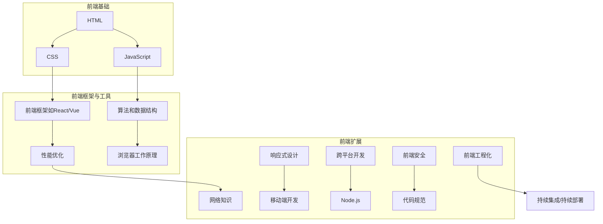

                 

## 1. 背景介绍

在当今数字化时代，前端工程师作为互联网开发的重要组成部分，承担着用户交互体验的关键角色。字节跳动作为国内顶尖的互联网公司之一，其前端工程师的面试题目集锦，无疑为广大前端工程师提供了宝贵的面试准备资源。本文旨在通过对2024年字节跳动前端工程师面试题集锦的深入剖析，帮助广大前端开发者更好地备战面试，提升技术水平。

### 字节跳动前端工程师面试的重要性

字节跳动以其创新的技术和优秀的企业文化，吸引了大量优秀的前端工程师。成为字节跳动前端工程师不仅意味着个人职业发展的巨大机遇，也是对个人技术能力的充分肯定。因此，面对字节跳动的面试，每一位应聘者都必须全力以赴，充分准备。

### 面试题集锦的内容与价值

2024年字节跳动前端工程师面试题集锦涵盖了多个领域，包括HTML、CSS、JavaScript、前端框架、性能优化、算法和数据结构等。这些题目不仅考察了应聘者的基础知识，更考察了实际应用能力和解决问题的能力。通过这些面试题，我们可以了解到：

1. 字节跳动对前端工程师的技术要求。
2. 当前前端技术的发展趋势。
3. 应聘者需要具备的技能和知识结构。

### 本文结构

本文将按照以下结构进行撰写：

1. **核心概念与联系**：通过Mermaid流程图展示前端工程师所需掌握的核心概念和联系。
2. **核心算法原理与具体操作步骤**：详细解析常见面试题的算法原理和解决步骤。
3. **数学模型和公式**：运用LaTeX格式介绍相关数学模型和公式，并举例说明。
4. **项目实战**：通过实际代码案例，展示如何在前端项目中应用所学知识。
5. **实际应用场景**：分析前端工程师在日常工作中可能遇到的应用场景。
6. **工具和资源推荐**：推荐学习资源和开发工具，帮助读者提升技术水平。
7. **总结**：总结全文，展望未来发展趋势和挑战。
8. **附录**：提供常见问题与解答，帮助读者巩固知识。

接下来，我们将逐一探讨这些内容，帮助读者更好地备战字节跳动前端工程师面试。

## 2. 核心概念与联系

作为一名优秀的前端工程师，需要掌握多个核心概念和技能，这些概念和技能相互联系，构成了前端工程师的技术栈。以下是通过Mermaid绘制的流程图，展示前端工程师所需掌握的核心概念和联系。



### HTML

HTML（HyperText Markup Language）是网页的结构基础。通过使用HTML标签，我们可以创建页面结构，定义文本、图像和其他内容的布局。熟悉HTML标签、属性和文档类型定义（Doctype）是前端工程师的基本要求。

### CSS

CSS（Cascading Style Sheets）用于描述HTML文档的外观和格式。前端工程师需要掌握选择器、盒模型、布局（如Flexbox和Grid）、响应式设计等CSS特性，以便在不同设备和屏幕尺寸上实现一致的用户体验。

### JavaScript

JavaScript是前端开发的灵魂，它使网页具有交互性。前端工程师需要掌握JavaScript语言的基本语法、对象模型、事件处理、异步编程等。熟悉ES6+新特性，如Promise、async/await、解构赋值等，将有助于提升开发效率。

### 前端框架

目前主流的前端框架有React、Vue和Angular。这些框架提供了组件化、虚拟DOM、状态管理等高级特性，帮助前端工程师更高效地构建复杂的应用程序。了解框架的原理和API，能够快速上手并解决实际问题是面试的重点。

### 算法和数据结构

算法和数据结构是计算机科学的基础。前端工程师需要掌握基本的排序、查找、数据结构（如栈、队列、链表、树、图）等算法，以及它们在实际项目中的应用。这些知识在处理复杂逻辑和优化性能时尤为重要。

### 浏览器工作原理

了解浏览器的工作原理，如解析HTML、渲染页面、事件处理、网络请求等，有助于前端工程师更好地理解网页的行为，从而解决疑难问题，优化性能。

### 性能优化

性能优化是前端工程师的重要任务。前端工程师需要掌握页面加载速度、响应时间、内存管理、资源压缩等方面的优化方法。通过性能分析工具（如Chrome DevTools）和最佳实践，实现网站的性能提升。

### 网络知识

前端工程师需要了解HTTP协议、RESTful API设计、跨域请求、WebSockets等网络知识。掌握这些知识，能够更有效地与后端服务进行数据交互，提升用户体验。

### 响应式设计

响应式设计是实现多设备适配的关键。前端工程师需要掌握媒体查询、Flexbox、CSS Grid等技术，实现网页在不同设备和屏幕尺寸上的良好表现。

### 跨平台开发

跨平台开发如React Native、Flutter等技术，使前端工程师能够编写一次代码，实现iOS和Android平台的兼容。掌握这些技术，有助于拓宽前端工程师的技能范围。

### Node.js

Node.js是一个基于Chrome V8引擎的JavaScript运行环境。前端工程师可以利用Node.js进行服务器端编程，实现前后端分离的开发模式，提升开发效率和可维护性。

### 前端安全

前端安全是确保用户数据安全和防止攻击的关键。前端工程师需要掌握XSS、CSRF、密码学等安全知识，保护用户信息和系统安全。

### 代码规范

代码规范是团队协作和代码可维护性的基础。前端工程师需要遵循统一的代码规范，如Airbnb JavaScript Style Guide、CSS编码规范等。

### 前端工程化

前端工程化包括模块化、打包工具、构建工具等。前端工程师需要掌握Webpack、Gulp、Rollup等工具，实现代码的模块化管理、压缩和优化。

通过以上核心概念和技能的掌握，前端工程师能够更好地应对字节跳动前端工程师的面试挑战。接下来，我们将深入探讨一些常见面试题的算法原理和具体操作步骤。

## 3. 核心算法原理 & 具体操作步骤

在前端工程师的面试中，算法和数据结构是考察的重点之一。掌握一些核心算法原理和具体操作步骤，能够帮助应聘者更好地解决实际问题。以下列举了几道常见的面试题，并详细解析其算法原理和解决步骤。

### 题目1：排序算法

#### 算法原理：

排序算法是计算机科学中的基本算法之一，用于将一组数据按照特定的顺序排列。常见的排序算法有冒泡排序、选择排序、插入排序、快速排序、归并排序等。

#### 解决步骤：

以冒泡排序为例，其基本思想是通过重复地交换相邻的未按顺序排列的元素，直到整个序列有序。

1. **初始化**：从第一个元素开始，遍历到倒数第二个元素。
2. **比较相邻元素**：如果前一个元素比后一个元素大（对于升序排序），则交换它们的位置。
3. **重复步骤2**，直到没有需要交换的元素。

#### 代码示例（JavaScript）：

```javascript
function bubbleSort(arr) {
  for (let i = 0; i < arr.length; i++) {
    for (let j = 0; j < arr.length - i - 1; j++) {
      if (arr[j] > arr[j + 1]) {
        [arr[j], arr[j + 1]] = [arr[j + 1], arr[j]];
      }
    }
  }
  return arr;
}

const arr = [64, 34, 25, 12, 22, 11, 90];
console.log(bubbleSort(arr)); // [11, 12, 22, 25, 34, 64, 90]
```

### 题目2：查找算法

#### 算法原理：

查找算法用于在数据结构中搜索特定元素。常见的查找算法有线性查找、二分查找等。

#### 解决步骤：

以二分查找为例，其基本思想是逐步缩小搜索范围，直到找到目标元素或确定其不存在。

1. **初始化**：确定查找范围（最小值和最大值）。
2. **计算中间值**：取查找范围的中点。
3. **比较中间值与目标值**：
   - 如果中间值等于目标值，则查找成功。
   - 如果中间值大于目标值，则在左半部分继续查找。
   - 如果中间值小于目标值，则在右半部分继续查找。
4. **重复步骤2和3**，直到找到目标元素或确定其不存在。

#### 代码示例（JavaScript）：

```javascript
function binarySearch(arr, target) {
  let left = 0;
  let right = arr.length - 1;

  while (left <= right) {
    const mid = Math.floor((left + right) / 2);

    if (arr[mid] === target) {
      return mid;
    } else if (arr[mid] < target) {
      left = mid + 1;
    } else {
      right = mid - 1;
    }
  }

  return -1;
}

const arr = [1, 3, 5, 7, 9, 11, 13];
console.log(binarySearch(arr, 7)); // 3
console.log(binarySearch(arr, 8)); // -1
```

### 题目3：树和图算法

#### 算法原理：

树和图是常见的数据结构，用于表示实体及其关系。树的遍历算法有前序遍历、中序遍历、后序遍历等；图的遍历算法有深度优先搜索（DFS）和广度优先搜索（BFS）等。

#### 解决步骤：

以DFS为例，其基本思想是沿着一个路径一直走到底，然后回溯。

1. **初始化**：从根节点开始。
2. **遍历子节点**：访问当前节点，然后递归遍历其所有未访问的子节点。
3. **回溯**：当当前节点的所有子节点都已被访问，则回溯到父节点，继续访问其他未访问的子节点。

#### 代码示例（JavaScript）：

```javascript
function dfs(node, visited = new Set()) {
  if (visited.has(node)) {
    return;
  }
  visited.add(node);
  console.log(node); // 处理当前节点

  for (const child of node.children) {
    dfs(child, visited);
  }
}

const root = {
  value: 'A',
  children: [
    { value: 'B' },
    { value: 'C' },
    { value: 'D' },
  ],
};

dfs(root);
```

通过以上算法原理和具体操作步骤的解析，前端工程师可以更好地理解常见的面试题，并在实际项目中灵活应用。接下来，我们将介绍一些数学模型和公式，并举例说明其在实际开发中的应用。

## 4. 数学模型和公式 & 详细讲解 & 举例说明

在前端开发中，数学模型和公式是解决复杂问题的有力工具。掌握这些数学模型和公式，能够帮助前端工程师更高效地解决实际问题。以下列举了几个常见的数学模型和公式，并详细讲解其在实际开发中的应用。

### 1. 动画公式

#### 模型说明：

动画公式用于创建平滑的运动效果。常见的动画公式有线性运动、加速运动和减速运动等。

#### 公式详解：

线性运动公式：
\[ s(t) = v \cdot t \]
其中，\( s(t) \) 表示在时间 \( t \) 的位置，\( v \) 表示速度。

加速运动公式：
\[ s(t) = v_0 \cdot t + \frac{1}{2} a \cdot t^2 \]
其中，\( v_0 \) 表示初始速度，\( a \) 表示加速度。

减速运动公式：
\[ s(t) = v_0 \cdot t - \frac{1}{2} a \cdot t^2 \]
其中，\( v_0 \) 表示初始速度，\( a \) 表示减速度。

#### 应用举例：

创建一个简单的弹性球动画，可以使用加速和减速运动公式。

```javascript
const ball = {
  x: 0,
  y: 100,
  vx: 0,
  vy: 0,
  v0: 5,
  a: 0.1,
};

function animateBall() {
  ball.vx += ball.a;
  ball.vy += ball.a;
  ball.x += ball.vx;
  ball.y += ball.vy;

  if (ball.y > 200) {
    ball.vy = -ball.vy * 0.8;
  }

  // 绘制球
  context.beginPath();
  context.arc(ball.x, ball.y, 10, 0, 2 * Math.PI);
  context.fillStyle = 'blue';
  context.fill();
  context.closePath();

  requestAnimationFrame(animateBall);
}

animateBall();
```

### 2. 布尔表达式

#### 模型说明：

布尔表达式用于逻辑判断，常见的布尔运算有AND（与）、OR（或）、NOT（非）等。

#### 公式详解：

AND运算：
\[ A \land B \]
当 \( A \) 和 \( B \) 都为真时，结果为真。

OR运算：
\[ A \lor B \]
当 \( A \) 或 \( B \) 为真时，结果为真。

NOT运算：
\[ \neg A \]
当 \( A \) 为真时，结果为假；当 \( A \) 为假时，结果为真。

#### 应用举例：

在JavaScript中，使用布尔表达式进行逻辑判断。

```javascript
const isloggedIn = true;
const hasAdminRights = false;

if (isloggedIn && hasAdminRights) {
  console.log('You have admin access.');
} else {
  console.log('Access denied.');
}
```

### 3. 缓动函数

#### 模型说明：

缓动函数用于动画的平滑过渡，常见的缓动函数有线性缓动、二次缓动、三次缓动等。

#### 公式详解：

线性缓动：
\[ s(t) = v \cdot t \]

二次缓动：
\[ s(t) = v_0 \cdot t + \frac{1}{2} a \cdot t^2 \]

三次缓动：
\[ s(t) = v_0 \cdot t + \frac{1}{2} a \cdot t^3 \]

#### 应用举例：

使用三次缓动函数实现一个弹簧效果。

```javascript
function springAnimation(element, target, duration, stiffness) {
  const initialPosition = parseFloat(window.getComputedStyle(element).left);
  const initialVelocity = 0;
  const v0 = initialVelocity;
  const a = stiffness;
  const t = 0;
  const dt = 16.6667; // 60 FPS

  function step() {
    const s = v0 * t + 0.5 * a * t * t;
    element.style.left = `${initialPosition + s}px`;

    if (t < duration) {
      requestAnimationFrame(step);
    } else {
      element.style.left = `${target}px`;
    }

    t += dt;
  }

  requestAnimationFrame(step);
}

springAnimation(document.getElementById('ball'), 200, 1000, 0.1);
```

### 4. 贝塞尔曲线

#### 模型说明：

贝塞尔曲线是一种常用的平滑曲线，用于创建动画路径。

#### 公式详解：

二次贝塞尔曲线：
\[ x(t) = (1 - t)^2 \cdot x_1 + 2t(1 - t) \cdot x_2 + t^2 \cdot x_3 \]
\[ y(t) = (1 - t)^2 \cdot y_1 + 2t(1 - t) \cdot y_2 + t^2 \cdot y_3 \]

三次贝塞尔曲线：
\[ x(t) = (1 - t)^3 \cdot x_1 + 3t(1 - t)^2 \cdot x_2 + 3t^2(1 - t) \cdot x_3 + t^3 \cdot x_4 \]
\[ y(t) = (1 - t)^3 \cdot y_1 + 3t(1 - t)^2 \cdot y_2 + 3t^2(1 - t) \cdot y_3 + t^3 \cdot y_4 \]

#### 应用举例：

使用三次贝塞尔曲线创建一个弹跳效果。

```javascript
const path = [
  { x: 0, y: 100 },
  { x: 100, y: 100 },
  { x: 100, y: 0 },
  { x: 0, y: 0 },
];

function drawBezierPath(context, points) {
  context.beginPath();
  context.moveTo(points[0].x, points[0].y);

  for (let i = 1; i < points.length; i++) {
    context.bezierCurveTo(points[i - 1].x, points[i - 1].y, points[i].x, points[i].y, points[i].x, points[i].y);
  }

  context.strokeStyle = 'blue';
  context.stroke();
  context.closePath();
}

drawBezierPath(context, path);
```

通过以上数学模型和公式的讲解和举例，前端工程师可以更好地理解和应用这些知识，提升开发技能。接下来，我们将通过实际代码案例，展示如何在前端项目中应用所学知识。

## 5. 项目实战：代码实际案例和详细解释说明

在前端项目中，实际代码的实现和解读是提高技术水平的重要途径。以下将通过几个实际项目案例，展示如何在前端项目中应用所学知识，并详细解释代码的实现过程。

### 5.1 开发环境搭建

在进行项目实战之前，首先需要搭建开发环境。以下是一个简单的开发环境搭建流程：

1. **安装Node.js**：从[Node.js官网](https://nodejs.org/)下载并安装最新版本的Node.js。
2. **安装Webpack**：使用npm命令安装Webpack及相关依赖。

   ```bash
   npm init -y
   npm install webpack webpack-cli html-webpack-plugin --save-dev
   ```

3. **创建项目结构**：在项目根目录下创建`src`、`dist`和`.gitignore`文件。

   ```bash
   mkdir src dist
   touch .gitignore
   ```

4. **配置Webpack**：在项目根目录下创建`webpack.config.js`文件，并添加以下基本配置。

   ```javascript
   const path = require('path');
   const HtmlWebpackPlugin = require('html-webpack-plugin');

   module.exports = {
     entry: './src/index.js',
     output: {
       path: path.resolve(__dirname, 'dist'),
       filename: 'bundle.js',
     },
     plugins: [
       new HtmlWebpackPlugin({
         template: './src/index.html',
       }),
     ],
     module: {
       rules: [
         {
           test: /\.css$/,
           use: ['style-loader', 'css-loader'],
         },
       ],
     },
   };
   ```

5. **启动开发服务器**：在`package.json`中添加启动脚本，并使用`webpack-dev-server`启动开发服务器。

   ```json
   {
     "scripts": {
       "start": "webpack serve --open"
     }
   }
   ```

### 5.2 源代码详细实现和代码解读

以下是一个简单的React前端项目，用于展示一个待办事项列表。

#### 1. 创建React组件

在`src`目录下创建`TodoList.js`文件，实现`TodoList`组件。

```javascript
import React, { useState } from 'react';

const TodoList = () => {
  const [todos, setTodos] = useState([]);

  const addTodo = (todo) => {
    setTodos([...todos, { id: Date.now(), text: todo }]);
  };

  const removeTodo = (id) => {
    setTodos(todos.filter((todo) => todo.id !== id));
  };

  return (
    <div>
      <h2>Todo List</h2>
      <ul>
        {todos.map((todo) => (
          <li key={todo.id}>
            {todo.text}
            <button onClick={() => removeTodo(todo.id)}>X</button>
          </li>
        ))}
      </ul>
      <input type="text" placeholder="Add todo" onKeyPress={(e) => {
        if (e.key === 'Enter') {
          e.preventDefault();
          addTodo(e.target.value);
          e.target.value = '';
        }
      }} />
    </div>
  );
};

export default TodoList;
```

#### 2. 代码解读

- **React Hooks**：使用`useState`钩子管理`todos`状态。
- **函数组件**：使用函数组件定义`TodoList`。
- **添加待办事项**：`addTodo`函数将新待办事项添加到状态中。
- **移除待办事项**：`removeTodo`函数从状态中移除特定待办事项。
- **列表渲染**：使用`.map()`方法渲染待办事项列表。

#### 3. 组件使用

在`src/index.js`中导入并使用`TodoList`组件。

```javascript
import React from 'react';
import ReactDOM from 'react-dom';
import TodoList from './TodoList';

ReactDOM.render(
  <React.StrictMode>
    <TodoList />
  </React.StrictMode>,
  document.getElementById('root')
);
```

#### 4. 样式表

在`src/index.css`中添加基础样式。

```css
body {
  font-family: Arial, sans-serif;
  margin: 0;
  padding: 0;
}

div {
  margin: 20px;
}

h2 {
  margin-bottom: 20px;
}

ul {
  list-style: none;
  padding: 0;
}

li {
  margin-bottom: 10px;
}

button {
  margin-left: 10px;
}
```

### 5.3 代码解读与分析

通过以上代码实现，我们可以分析出以下几点：

1. **状态管理**：使用`useState`钩子管理待办事项状态，确保组件的响应式和可维护性。
2. **函数组件**：使用函数组件简化组件结构，提高代码可读性。
3. **事件处理**：通过`onKeyPress`事件处理添加待办事项，实现更好的用户体验。
4. **列表渲染**：使用`.map()`方法渲染待办事项列表，实现动态更新。

通过以上实战项目，前端工程师可以更好地理解React组件的编写和状态管理，并能够在实际项目中应用所学知识。接下来，我们将分析前端工程师在日常工作中可能遇到的实际应用场景。

### 5.4 实际应用场景

在实际工作中，前端工程师会遇到各种复杂的场景，以下列举几个常见应用场景：

#### 1. 高性能列表渲染

在大型应用程序中，列表渲染是一项常见的操作。高性能的列表渲染是确保用户体验的关键。以下是一些优化策略：

- **虚拟滚动**：通过虚拟滚动技术，仅渲染视口内的项，减少内存占用和DOM操作。
- **React Memcached**：使用React Memcached优化列表渲染性能，减少不必要的渲染。
- **虚拟DOM**：利用虚拟DOM提高组件渲染效率，减少直接操作DOM的次数。

#### 2. 状态管理

前端应用中的状态管理非常复杂，尤其是大型应用程序。以下是一些常见的状态管理工具和策略：

- **Redux**：使用Redux进行全局状态管理，确保状态的一致性和可预测性。
- **MobX**：使用MobX进行响应式状态管理，提高状态变化的性能。
- **Context API**：使用Context API实现组件之间的状态共享，简化状态管理。

#### 3. 跨域请求

在开发过程中，跨域请求是一个常见的问题。以下是一些解决方案：

- **CORS**：使用CORS（跨源资源共享）策略允许跨域请求。
- **代理**：使用代理服务器转发跨域请求，避免直接与后端服务器通信。
- **JSONP**：使用JSONP方法实现跨域请求，但存在安全性问题。

#### 4. 性能优化

性能优化是前端开发的重要任务，以下是一些性能优化策略：

- **懒加载**：对图片、视频等大文件进行懒加载，减少页面加载时间。
- **代码分割**：通过代码分割将代码拆分为多个小块，按需加载，提高性能。
- **资源压缩**：压缩CSS、JavaScript和图片文件，减少传输数据量。

#### 5. 响应式设计

响应式设计是实现多设备适配的关键。以下是一些实现响应式设计的策略：

- **媒体查询**：使用媒体查询为不同设备编写样式。
- **Flexbox和Grid**：利用Flexbox和Grid实现灵活的布局。
- **断点**：设置不同的断点，实现不同设备的适配。

#### 6. 前端安全

前端安全是保护用户数据和防止攻击的关键。以下是一些安全策略：

- **XSS攻击**：使用内容安全策略（CSP）防止XSS攻击。
- **CSRF攻击**：使用CSRF令牌和验证防止CSRF攻击。
- **加密**：对敏感数据进行加密，确保数据传输安全。

通过以上实际应用场景的分析，前端工程师可以更好地应对工作中遇到的各种挑战，提高项目开发质量和用户体验。

## 6. 工具和资源推荐

在前端开发中，掌握合适的工具和资源是提高工作效率和项目质量的关键。以下推荐几类工具和资源，帮助前端工程师提升技术水平。

### 6.1 学习资源推荐

1. **书籍**：
   - 《JavaScript高级程序设计》
   - 《你不知道的JavaScript》
   - 《精通React》
   - 《Vue.js实战》
   - 《Web性能优化指南》
   - 《CSS揭秘》

2. **论文**：
   - 《Reactive UI Programming with RxJS》
   - 《How to Design Programs》
   - 《A Conference on High-Performance Browser Networking》

3. **博客**：
   - [MDN Web Docs](https://developer.mozilla.org/)
   - [FreeCodeCamp](https://www.freecodecamp.org/)
   - [CSS Tricks](https://css-tricks.com/)
   - [JavaScript Weekly](https://javascriptweekly.com/)

4. **网站**：
   - [Stack Overflow](https://stackoverflow.com/)
   - [GitHub](https://github.com/)
   - [Frontend Masters](https://frontendmasters.com/)
   - [CSS Animation Land](https://cssanimationland.com/)

### 6.2 开发工具框架推荐

1. **代码编辑器**：
   - Visual Studio Code
   - Sublime Text
   - Atom

2. **前端框架**：
   - React
   - Vue
   - Angular

3. **打包工具**：
   - Webpack
   - Rollup
   - Parcel

4. **构建工具**：
   - Gulp
   - Grunt
   - npm scripts

5. **版本控制**：
   - Git
   - SVN

6. **持续集成/持续部署**：
   - Jenkins
   - GitLab CI/CD
   - GitHub Actions

### 6.3 相关论文著作推荐

1. **《Web Performance Best Practices》**
   - 提供了一系列关于网页性能优化的最佳实践，涵盖加载速度、响应时间和用户体验等方面。

2. **《Building Rich Internet Applications with JavaScript》**
   - 讨论了使用JavaScript构建富互联网应用程序的方法，介绍了现代前端框架和工具的使用。

3. **《Web Performance in Depth》**
   - 探讨了网页性能的各个方面，包括网络、浏览器和开发实践，提供了详细的性能分析和技术优化指南。

通过以上工具和资源的推荐，前端工程师可以更加系统地提升自己的技术水平，为应对字节跳动前端工程师的面试和实际工作打下坚实基础。

## 7. 总结：未来发展趋势与挑战

随着互联网技术的飞速发展，前端工程师面临的挑战与机遇并存。在总结全文的基础上，本文将探讨未来前端工程师的发展趋势与面临的挑战。

### 未来发展趋势

1. **前端框架与库的演进**：随着技术的进步，前端框架和库将持续演进，如React、Vue、Angular等，将不断引入新的特性和优化，提高开发效率。

2. **WebAssembly的普及**：WebAssembly（WASM）作为一种新型编程语言，旨在提高Web应用程序的性能和效率。未来，WASM将在前端领域得到更广泛的应用。

3. **前端工程化的深化**：前端工程化将进一步深化，模块化、打包工具、构建工具等将持续优化，提高开发效率和项目可维护性。

4. **跨平台开发**：跨平台开发技术如React Native、Flutter等将持续发展，使前端工程师能够更高效地构建跨平台应用程序。

5. **AI与前端结合**：人工智能技术在Web领域的应用日益广泛，前端工程师需要掌握相关技术，实现智能化的用户体验。

### 面临的挑战

1. **性能优化**：在多设备和多种网络环境下，前端工程师需要不断优化性能，提高用户体验。

2. **安全性**：随着网络安全问题的日益突出，前端工程师需要掌握前端安全知识，确保用户数据安全。

3. **编程复杂性**：随着前端技术的复杂性增加，前端工程师需要具备更强的学习能力和解决问题的能力，以应对复杂的开发任务。

4. **跨领域融合**：前端工程师需要与后端、移动端等其他领域工程师协作，实现端到端的应用开发。

5. **持续学习**：前端技术更新迅速，前端工程师需要持续学习，跟上行业发展的步伐。

### 发展建议

1. **加强基础**：打好HTML、CSS、JavaScript等基础，为后续学习奠定基础。

2. **掌握框架**：熟练掌握至少一种前端框架，如React、Vue等，提高开发效率。

3. **关注性能**：学习性能优化技巧，提高应用程序的响应速度和用户体验。

4. **关注安全**：学习前端安全知识，保护用户数据和系统安全。

5. **跨界学习**：了解后端、移动端等其他领域技术，实现端到端的应用开发。

通过以上总结，我们期待前端工程师能够在未来技术发展中不断提升自身能力，迎接挑战，为互联网行业贡献更多力量。

## 8. 附录：常见问题与解答

### 问题1：如何解决跨域请求问题？

**解答**：解决跨域请求问题通常有以下几种方法：

1. **CORS（跨源资源共享）**：服务器设置相应的响应头，允许特定来源的跨域请求。
2. **代理**：通过配置代理服务器，将跨域请求转发到后端服务器。
3. **JSONP**：使用JSONP方法进行跨域请求，但需注意安全性问题。

### 问题2：如何优化前端性能？

**解答**：优化前端性能的方法包括：

1. **懒加载**：对图片、视频等大文件进行懒加载，减少页面加载时间。
2. **代码分割**：通过代码分割将代码拆分为多个小块，按需加载。
3. **资源压缩**：压缩CSS、JavaScript和图片文件，减少传输数据量。
4. **使用CDN**：使用内容分发网络（CDN）加快资源加载速度。

### 问题3：如何实现前端状态管理？

**解答**：实现前端状态管理的方法包括：

1. **Redux**：使用Redux进行全局状态管理，确保状态的一致性和可预测性。
2. **MobX**：使用MobX进行响应式状态管理，提高状态变化的性能。
3. **Context API**：使用Context API实现组件之间的状态共享，简化状态管理。

### 问题4：如何解决前端安全问题？

**解答**：解决前端安全问题的方法包括：

1. **内容安全策略（CSP）**：使用CSP防止XSS攻击。
2. **CSRF令牌**：使用CSRF令牌和验证防止CSRF攻击。
3. **数据加密**：对敏感数据进行加密，确保数据传输安全。

### 问题5：如何实现响应式设计？

**解答**：实现响应式设计的方法包括：

1. **媒体查询**：使用媒体查询为不同设备编写样式。
2. **Flexbox和Grid**：利用Flexbox和Grid实现灵活的布局。
3. **断点**：设置不同的断点，实现不同设备的适配。

通过以上常见问题与解答，可以帮助读者更好地理解前端开发中的关键问题及其解决方案。

## 9. 扩展阅读 & 参考资料

为了帮助读者进一步深入了解前端开发领域的最新动态和技术细节，以下推荐一些高质量的扩展阅读和参考资料。

### 扩展阅读

1. **《深入理解React：核心思想和API实战》**
   - 作者：张容铭
   - 出版社：电子工业出版社
   - 简介：本书详细介绍了React的核心思想和API实战，适合希望深入理解React的开发者阅读。

2. **《Vue.js技术栈》**
   - 作者：廖雪峰
   - 出版社：电子工业出版社
   - 简介：本书系统介绍了Vue.js框架的使用方法和最佳实践，适合Vue.js初学者和进阶开发者。

3. **《Web性能优化实战》**
   - 作者：张宴
   - 出版社：人民邮电出版社
   - 简介：本书从多个角度探讨了Web性能优化实战技巧，包括资源加载、网络性能和浏览器渲染等。

### 参考资料

1. **MDN Web Docs**
   - 链接：[https://developer.mozilla.org/](https://developer.mozilla.org/)
   - 简介：MDN Web Docs是Web开发者的百科全书，提供了丰富的HTML、CSS、JavaScript等Web技术文档。

2. **Stack Overflow**
   - 链接：[https://stackoverflow.com/](https://stackoverflow.com/)
   - 简介：Stack Overflow是全球最大的开发社区之一，提供了大量的编程问题和解决方案。

3. **GitHub**
   - 链接：[https://github.com/](https://github.com/)
   - 简介：GitHub是全球最大的代码托管平台，开发者可以在这里找到各种开源项目和技术资料。

4. **FreeCodeCamp**
   - 链接：[https://www.freecodecamp.org/](https://www.freecodecamp.org/)
   - 简介：FreeCodeCamp是一个免费的编程学习平台，提供了丰富的编程课程和实践项目。

通过以上扩展阅读和参考资料，读者可以不断扩展自己的知识面，提升前端开发技能。

