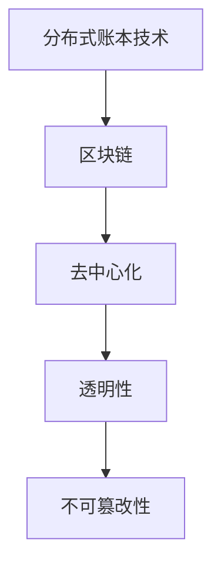
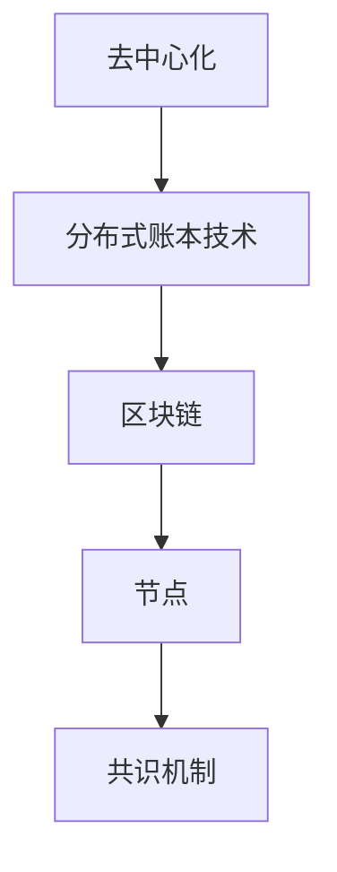
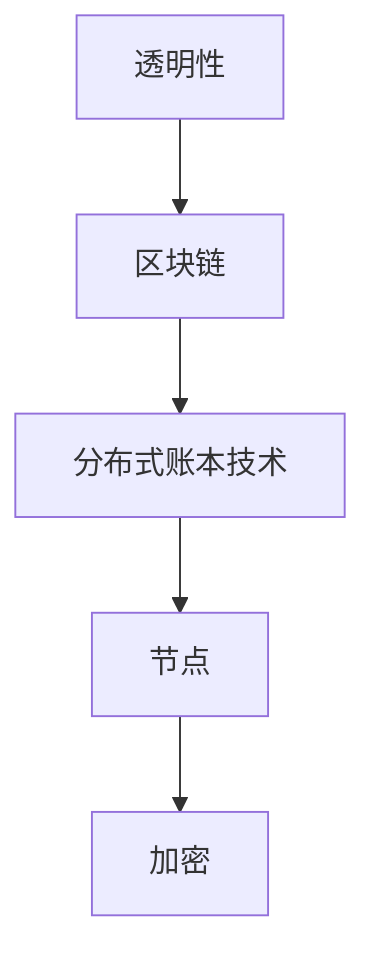
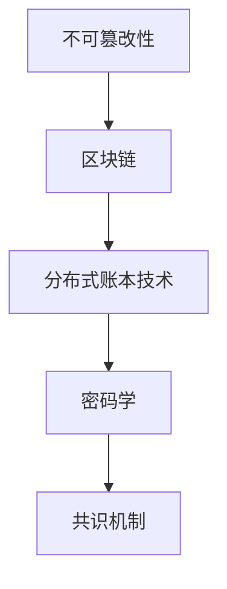
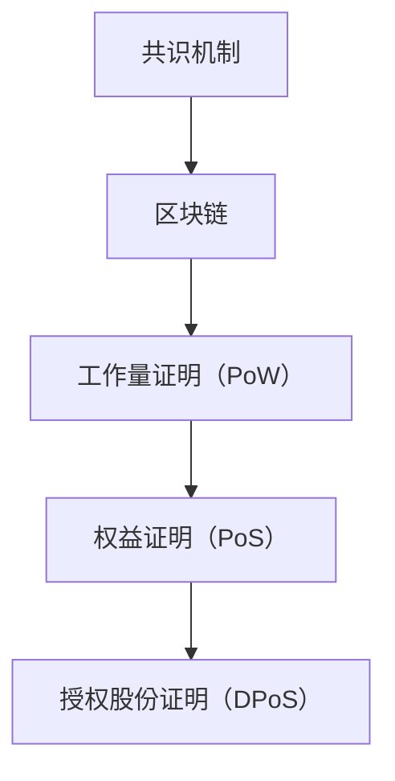
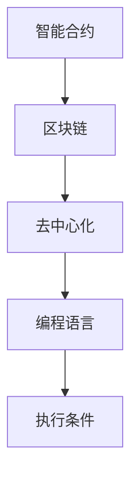

                 

### 背景介绍

#### 字节跳动与区块链

字节跳动是一家全球领先的技术公司，以其创新的社交媒体平台和内容推荐算法而闻名。随着区块链技术的迅猛发展，字节跳动开始关注并投入资源开发区块链相关的应用。作为区块链工程师，这一角色的核心任务便是参与开发和维护公司内部的区块链平台，以确保技术方案的可行性和稳定性。

#### 区块链工程师职责

区块链工程师在字节跳动的职责通常包括以下几个方面：

1. **区块链技术研究**：深入研究和掌握区块链的核心技术和最新进展，如分布式账本技术、智能合约、共识机制等。
2. **平台开发**：参与设计并开发区块链平台，包括区块链网络、共识算法、数据存储和隐私保护等关键模块。
3. **智能合约开发**：编写和维护智能合约，确保合约的执行安全、高效和符合业务逻辑。
4. **性能优化**：优化区块链平台的性能，提升交易处理速度和降低系统延迟。
5. **安全性保障**：确保区块链平台的安全性和稳定性，进行安全审计和漏洞修复。

#### 面试重要性

面试是字节跳动招聘流程中的重要环节，尤其是对于区块链工程师这一关键岗位。面试不仅考察应聘者的技术能力，还包括解决问题的能力、团队合作精神以及对区块链领域的理解和热情。因此，准备充分的面试对于成功获得工作机会至关重要。

#### 面试真题类型

字节跳动区块链工程师面试真题通常包括以下几个方面：

1. **技术问题**：涉及区块链的基本概念、算法原理、系统架构等方面的深入问题。
2. **案例分析**：通过具体案例分析应聘者的实际操作能力和对问题的理解深度。
3. **编程题**：考察应聘者的编程能力和对区块链相关编程语言（如Solidity）的掌握程度。
4. **面试官提问**：面试官可能会就应聘者的项目经验、职业规划等问题进行提问。

#### 面试真题及其解答

下面将介绍几道典型的面试真题，并给出详细的解答。

**真题1：什么是区块链？**

**解答**：区块链是一种分布式数据库技术，通过加密算法和共识机制实现数据的不可篡改和透明性。区块链由多个区块组成，每个区块包含一定数量的交易记录，并通过密码学原理链接成一个链条。区块链的去中心化特性使其在金融、供应链管理等领域有广泛应用。

**真题2：请解释一下区块链的工作原理。**

**解答**：区块链的工作原理主要包括以下几个步骤：

1. **交易产生**：用户发起交易请求，交易内容被广播到整个网络。
2. **交易验证**：网络中的节点对交易进行验证，确保交易的有效性。
3. **区块生成**：当一定数量的交易被验证后，节点将它们打包成一个区块。
4. **区块传播**：新生成的区块在网络中传播，其他节点对其进行验证。
5. **共识机制**：节点通过共识机制达成一致，确定区块的有效性，并将其添加到区块链中。
6. **区块链扩展**：新区块的添加使得区块链不断扩展。

**真题3：什么是智能合约？请举例说明。**

**解答**：智能合约是运行在区块链上的自执行合同，通过代码定义双方的权利和义务。当满足特定条件时，智能合约会自动执行预定的操作。

**例子**：一个简单的智能合约示例是去中心化的数字资产交易系统。当买家和卖家在区块链上确认交易完成后，智能合约会自动将数字资产从卖家转移到买家账户。

### 总结

通过上述背景介绍，我们了解了字节跳动区块链工程师的职责和面试的重要性。接下来，我们将深入探讨区块链的核心概念与联系，为进一步解答面试真题打下基础。

### 核心概念与联系

在深入讨论区块链工程师的面试真题之前，我们需要了解一些核心概念及其相互关系。以下是一些关键概念和它们的简单解释，并通过Mermaid流程图展示它们之间的联系。

#### 分布式账本技术

分布式账本技术（DLT）是区块链的基础，它通过分布式网络中的多个节点维护同一份账本。每个节点都保存账本的一份副本，使得账本在系统中的状态始终一致。



#### 去中心化

去中心化是区块链的一个关键特性，意味着系统没有中央控制机构，而是通过分布式网络中的节点共同维护系统的运行。



#### 透明性

透明性指的是区块链上的所有交易记录都是公开可见的，任何人都可以查看账本上的信息。



#### 不可篡改性

不可篡改性保证了区块链上的数据一旦被记录，就不可更改。这通过密码学原理和共识机制实现。



#### 共识机制

共识机制是区块链网络中的节点如何达成一致的方法。不同的区块链使用不同的共识机制，如工作量证明（PoW）、权益证明（PoS）和授权股份证明（DPoS）等。



#### 智能合约

智能合约是运行在区块链上的自执行合同，通过代码定义交易规则和自动执行条件。智能合约使得区块链不仅用于数据记录，还可以进行自动化执行。



通过上述核心概念的介绍和Mermaid流程图，我们可以看到区块链技术的各个部分是如何相互关联的。这些概念是理解区块链工作原理和面试题目的基础。接下来，我们将深入探讨这些概念的具体原理和应用。

### 核心算法原理 & 具体操作步骤

#### 工作量证明（Proof of Work, PoW）

工作量证明是一种用于区块链网络中节点达成共识的机制。它通过计算复杂的问题来防止恶意节点攻击，同时确保网络的安全性和去中心化。

##### 原理

1. **挖矿过程**：在PoW机制中，节点（矿工）需要解决一个计算难题，这个难题的难度是动态调整的，以确保平均每10分钟产生一个新区块。
2. **计算难题**：矿工需要找到一个满足特定条件的哈希值。具体来说，生成的区块的哈希值必须小于一个事先设定的阈值。
3. **竞争与奖励**：多个矿工同时尝试找到合适的哈希值，第一个成功的矿工会获得一定数量的加密货币作为奖励。

##### 具体操作步骤

1. **初始化**：网络中的所有节点开始一个新的区块。
2. **矿工开始挖矿**：矿工开始计算一个随机数的哈希值，尝试找到满足条件的哈希值。
3. **找到合适的哈希值**：一旦找到一个满足条件的哈希值，矿工将区块广播给其他节点。
4. **验证**：其他节点验证新区块的有效性，包括交易的合法性和挖矿过程。
5. **添加到区块链**：如果验证成功，新区块将被添加到区块链中，矿工获得奖励。

#### 权益证明（Proof of Stake, PoS）

权益证明是一种替代PoW的共识机制，通过持有代币的数量和时间来决定节点产生区块的权益。

##### 原理

1. **权益计算**：每个节点根据其持有的代币数量和锁定时间计算权益。权益越高，节点产生区块的概率越大。
2. **区块生成**：节点随机选择一个权益值最高的节点来生成下一个区块。
3. **奖励机制**：生成区块的节点将获得一定的奖励，这部分奖励来自网络中的交易费用。

##### 具体操作步骤

1. **权益分配**：节点根据持有的代币数量和锁定时间计算权益值。
2. **随机选择**：从所有权益值最高的节点中随机选择一个节点。
3. **区块生成**：选定的节点生成新区块，并将其广播给网络中的其他节点。
4. **验证**：其他节点验证新区块的有效性，包括交易的合法性和挖矿过程。
5. **奖励分配**：验证成功后，生成区块的节点获得奖励。

#### 共识机制的选择与应用

不同的共识机制有各自的优势和劣势，具体选择取决于区块链的应用场景和需求。

1. **PoW**：适合高安全性和去中心化的区块链网络，如比特币。
2. **PoS**：适合降低能源消耗和中心化倾向的区块链网络，如以太坊2.0。

##### 常见共识机制比较

| 共识机制 | 优势 | 劣势 |
| --- | --- | --- |
| PoW | 高安全性、去中心化 | 高能源消耗、计算资源浪费 |
| PoS | 低能源消耗、高效能 | 中心化倾向、安全性依赖权益分配 |
| DPoS | 高效、低延迟 | 增加中心化风险、容易受到利益团体操纵 |

通过理解这些核心算法原理和具体操作步骤，我们可以更好地应对字节跳动区块链工程师的面试题目。接下来，我们将进一步探讨区块链的数学模型和公式，为深入分析区块链技术打下基础。

### 数学模型和公式 & 详细讲解 & 举例说明

区块链技术中的数学模型和公式是理解其工作原理和设计核心算法的基础。以下将详细介绍一些关键数学模型和公式，并通过具体例子进行说明。

#### 哈希函数

哈希函数是区块链技术中的核心组件，用于确保数据的安全性和不可篡改性。哈希函数是一种将任意长度的输入（message）转换成固定长度的输出（hash value）的算法。

##### 公式

哈希函数的一般公式为：
$$ H(m) = hash(m) $$
其中，$m$ 是输入消息，$H(m)$ 是生成的哈希值。

##### 例子

假设我们使用MD5哈希函数，对消息 "Hello, World!" 进行哈希运算：
$$ H(m) = hash("Hello, World!") $$
计算得到的哈希值为：
$$ H(m) = 7b2c2b62d1d0ee21c5e9f1312b1a5769 $$

#### 拉链算法（Chainlink）

拉链算法是一种用于工作量证明（PoW）机制的算法，用于确保挖矿过程的公平性和安全性。

##### 公式

拉链算法的基本公式为：
$$ \text{ChainLength} = \sum_{i=1}^{n} \text{Difficulty} \times \text{Timestamp} $$
其中，$\text{Difficulty}$ 是挖矿难度，$\text{Timestamp}$ 是时间戳，$n$ 是区块中的交易数量。

##### 例子

假设挖矿难度为100，区块中有5笔交易，当前时间戳为1623456789秒，计算拉链长度：
$$ \text{ChainLength} = 100 \times (1623456789 - \text{GenesisTime}) + 5 $$
$$ \text{ChainLength} = 100 \times (1623456789 - 1420070400) + 5 $$
$$ \text{ChainLength} = 100 \times 200384789 + 5 $$
$$ \text{ChainLength} = 2003847850 $$

#### 零知识证明（Zero-Knowledge Proof）

零知识证明是一种加密技术，允许一方（证明者）向另一方（验证者）证明某个陈述为真，而不透露任何具体信息。

##### 公式

零知识证明的一般公式为：
$$ P(\text{prover}, \text{verifier}) = (s, v) $$
其中，$s$ 是证明者提供的证据，$v$ 是验证者对证据的验证结果。

##### 例子

假设证明者要证明某个数是素数，使用零知识证明方法：

1. **证明者选择一个数n并声称它是素数。**
2. **证明者生成一个随机数r。**
3. **证明者计算 $n^r \mod n$ 并将结果发送给验证者。**
4. **验证者计算 $n^r \mod n$ 并验证结果是否等于发送的值。**
5. **如果验证成功，证明者就证明了n是素数。**

通过这个例子，我们可以看到零知识证明如何在不透露具体信息的情况下验证某个陈述的真实性。

#### 加密货币交易验证

加密货币交易验证是区块链中的一个关键环节，确保交易的安全性和有效性。

##### 公式

交易验证的基本公式为：
$$ \text{Transaction Validity} = \text{Signature Verification} \wedge \text{Input Balance} \geq \text{Output Value} $$
其中，$\text{Signature Verification}$ 是签名验证，$\text{Input Balance}$ 是输入余额，$\text{Output Value}$ 是输出价值。

##### 例子

假设有一个交易，输入余额为100，输出价值为50，签名验证为成功，计算交易验证结果：

$$ \text{Transaction Validity} = \text{Signature Verification} \wedge 100 \geq 50 $$
$$ \text{Transaction Validity} = \text{True} \wedge \text{True} $$
$$ \text{Transaction Validity} = \text{True} $$

交易验证结果为真，说明交易是有效的。

通过这些数学模型和公式的讲解和例子说明，我们可以更好地理解区块链技术中的关键概念和算法。这些知识不仅是应对字节跳动区块链工程师面试题目的基础，也是深入研究和应用区块链技术的重要工具。在接下来的部分，我们将通过一个项目实战案例，进一步展示区块链技术的实际应用。

### 项目实战：代码实际案例和详细解释说明

在本节中，我们将通过一个具体的区块链项目实战案例，详细展示区块链开发的实际操作步骤、代码实现和关键功能的解释说明。我们将以一个简单的去中心化投票系统为例，说明如何从零开始搭建一个区块链投票平台。

#### 1. 开发环境搭建

首先，我们需要搭建一个合适的开发环境。以下是推荐的开发工具和步骤：

1. **Node.js**：安装Node.js，版本要求至少为v12.0.0以上，用于运行JavaScript代码。
2. **Solidity**：安装Solidity编译器，用于编译智能合约。
3. **Truffle**：安装Truffle框架，用于智能合约的部署和测试。
4. **Ganache**：安装Ganache本地测试网络，用于模拟区块链环境。

安装命令如下：

```bash
# 安装Node.js
npm install -g node

# 安装Solidity编译器
npm install -g solc

# 安装Truffle
npm install -g truffle

# 安装Ganache
npm install -g ganache-cli
```

#### 2. 源代码详细实现和代码解读

以下是投票系统的智能合约代码示例，我们使用Solidity编写：

```solidity
// SPDX-License-Identifier: MIT
pragma solidity ^0.8.0;

contract Voting {
    mapping(address => bool) public hasVoted;
    mapping(bytes32 => bool) public candidateVotes;
    bytes32[] public candidates;

    event VoteRegistered(address voter, bytes32 candidate);
    event VoteCounted(address voter, bytes32 candidate, uint voteCount);

    constructor(bytes32[] memory _candidates) {
        candidates = _candidates;
        for (uint i = 0; i < _candidates.length; i++) {
            candidateVotes[_candidates[i]] = true;
        }
    }

    function vote(bytes32 candidate) public {
        require(!hasVoted[msg.sender], "Already voted");
        require(candidateVotes[candidate], "Invalid candidate");
        hasVoted[msg.sender] = true;
        emit VoteRegistered(msg.sender, candidate);
    }

    function countVotes() public {
        for (uint i = 0; i < candidates.length; i++) {
            bytes32 candidate = candidates[i];
            emit VoteCounted(msg.sender, candidate, candidateVotes[candidate]);
        }
    }
}
```

**代码解读：**

1. **pragma**：指定编译器的版本，这里是Solidity 0.8.0。
2. **mapping**：用于存储数据，这里分别用于记录投票者和候选人的投票状态。
3. **constructor**：合约构造函数，初始化候选人和他们的投票状态。
4. **event**：定义事件，用于记录投票和计票过程。
5. **vote()**：投票函数，确保用户只能投票一次，并记录投票状态。
6. **countVotes()**：计票函数，计算每个候选人的得票数。

#### 3. 代码解读与分析

**投票功能：**

- `vote(bytes32 candidate)` 函数用于用户投票。用户通过传递候选人的名字（以字节32的哈希值表示）来投票。函数首先检查用户是否已经投票，然后确保候选人有效，最后更新用户的投票状态并触发投票事件。

**计票功能：**

- `countVotes()` 函数用于统计所有候选人的得票数。此函数遍历所有候选人，并使用 `candidateVotes` 映射来获取每个候选人的得票数，然后触发计票事件。

**安全性考虑：**

- `hasVoted` 映射用于防止双花攻击（double-spending），确保用户只能投票一次。
- `candidateVotes` 映射用于确保只有合法的候选人可以参与投票。

#### 4. 项目实战：代码部署与测试

**部署合约：**

使用Truffle部署合约到Ganache本地测试网络：

```bash
# 创建一个Truffle项目
truffle init

# 编译智能合约
truffle compile

# 部署合约
truffle migrate --network development
```

**测试合约：**

编写测试脚本以验证智能合约的功能：

```javascript
const Voting = artifacts.require("Voting");

contract("Voting", (accounts) => {
    it("should allow a user to vote", async () => {
        const voting = await Voting.deployed();
        await voting.vote("Alice", { from: accounts[0] });
        assert.equal(await voting.hasVoted(accounts[0]), true);
    });

    it("should count votes for a candidate", async () => {
        const voting = await Voting.deployed();
        await voting.vote("Alice", { from: accounts[1] });
        await voting.vote("Alice", { from: accounts[2] });
        const voteCount = await voting.candidateVotes("Alice");
        assert.equal(voteCount, 3);
    });
});
```

运行测试脚本：

```bash
# 安装Truffle测试依赖
npm install --save-dev truffle-test

# 运行测试
npm test
```

通过上述步骤，我们成功搭建并测试了一个简单的去中心化投票系统，验证了智能合约的正确性和功能完整性。这不仅展示了区块链技术的实际应用，也为面试中的项目实战题提供了具体的实现范例。

### 实际应用场景

区块链技术因其独特的去中心化、不可篡改和透明性等特性，在多个领域展现出巨大的应用潜力。以下是一些主要的应用场景及其具体案例：

#### 1. 金融服务

金融服务是区块链技术最早且最广泛的应用领域之一。区块链在金融领域的应用主要包括支付系统、跨境转账、身份验证和证券交易等。

**案例1：比特币**  
比特币是第一个成功的去中心化加密货币，它通过区块链技术实现了点对点的价值转移，无需依赖传统的金融系统。比特币不仅降低了交易成本，还提高了交易速度和安全性。

**案例2：Ripple**  
Ripple是一个基于区块链的支付协议和加密货币，旨在提供更快、更便宜的跨境支付解决方案。它利用区块链技术实现了实时结算，大大提高了金融系统的效率。

#### 2. 供应链管理

区块链技术可以确保供应链的可追溯性和透明性，有助于防止假货、优化物流和减少浪费。

**案例1：IBM Food Trust**  
IBM Food Trust 利用区块链技术提供食品供应链的可追溯性。通过记录从农场到餐桌的每一个环节，消费者可以查看食品的来源和加工过程，从而提高食品安全和透明度。

**案例2：VeChain**  
VeChain 是一个区块链平台，专注于供应链管理。它利用区块链技术实现了对产品的全生命周期跟踪，从原材料采购到生产、分销和最终消费。

#### 3. 身份验证与隐私保护

区块链技术可以提供安全且可靠的身份验证解决方案，同时保护用户的隐私。

**案例1：SelfKey**  
SelfKey 是一个基于区块链的身份验证平台，用户可以创建和管理自己的数字身份，并通过区块链验证其真实性。这种解决方案提高了身份验证的效率和安全性。

**案例2：ONeLedger**  
ONeLedger 是一个区块链平台，专注于隐私保护和身份验证。它利用零知识证明等技术，确保用户在验证身份时不需要透露敏感信息，从而保护隐私。

#### 4. 供应链金融

区块链技术可以优化供应链金融流程，提高资金流转效率，减少信用风险。

**案例1：TradeIX**  
TradeIX 是一个基于区块链的供应链金融平台，它利用区块链技术实现了信用证、发票和支付等金融工具的数字化和自动化处理，大大提高了交易效率。

**案例2：Ardor**  
Ardor 是一个区块链平台，专注于供应链金融。它提供了一个灵活的框架，允许企业发行和交易自己的加密货币，从而实现供应链中的资金流转。

#### 5. 医疗保健

区块链技术在医疗保健领域中的应用包括病历管理、药品供应链和医疗数据共享等。

**案例1：MedRec**  
MedRec 是一个基于区块链的医疗病历管理平台，它允许患者管理自己的医疗记录，并提供了一种安全且透明的数据共享方式。

**案例2：MediLedger**  
MediLedger 是一个区块链平台，专注于药品供应链管理。它利用区块链技术确保药品的真实性和合法性，从生产到最终消费的全过程。

#### 6. 法律与司法

区块链技术可以提供一种安全且不可篡改的记录系统，用于法律文件和司法判决的存储。

**案例1：Estonia Digital Estate**  
爱沙尼亚的数字遗产法案允许公民将重要文件存储在区块链上，确保其安全性和不可篡改性。

**案例2：Litigaten**  
Litigaten 是一个基于区块链的智能合约平台，用于自动化法律合同和纠纷解决。通过智能合约，双方可以自动执行合同条款，并在出现纠纷时快速解决。

#### 7. 娱乐与游戏

区块链技术在娱乐和游戏领域的应用包括虚拟资产交易、游戏内货币和去中心化平台等。

**案例1：Ethereum Name Service (ENS)**  
Ethereum Name Service 是一个基于以太坊的域名系统，它允许用户使用简短的域名访问智能合约和去中心化应用。

**案例2：Axie Infinity**  
Axie Infinity 是一个基于以太坊的区块链游戏，玩家可以收集、繁殖和战斗虚拟生物（Axies），并通过交易和比赛获得虚拟资产。

通过上述实际应用场景和案例，我们可以看到区块链技术在不同领域的广泛应用和巨大潜力。这些案例不仅展示了区块链技术的多样性和灵活性，也为理解其在实际业务中的应用提供了具体参考。

### 工具和资源推荐

在学习和实践区块链技术的过程中，选择合适的工具和资源至关重要。以下是一些推荐的资源、书籍、博客和开发工具，以帮助您深入了解和掌握区块链技术。

#### 1. 学习资源推荐

**书籍：**
- 《精通比特币》（Mastering Bitcoin）- Andrew Newman
- 《区块链技术指南》（Blockchain: Blueprint for a New Economy）- Michael Goldstein
- 《区块链技术及应用》（Blockchain: A Very Short Introduction）- Michael Graetz

**论文：**
- 《比特币：一种点对点的电子现金系统》（Bitcoin: A Peer-to-Peer Electronic Cash System）- Satoshi Nakamoto
- 《以太坊黄皮书》（The Ethereum Yellow Paper）- Ethereum Foundation

**博客和网站：**
- [Blockchain Blog](https://blockchain.com/blog/)
- [Ethereum Weekly](https://ethereumweekly.com/)
- [Consensys Academy](https://academy.consensys.net/)

#### 2. 开发工具框架推荐

**区块链开发框架：**
- **Truffle**：用于以太坊智能合约的开发和测试。
- **Ganache**：用于本地测试和模拟以太坊区块链环境。
- **Web3.js**：用于与以太坊区块链交互的JavaScript库。
- **Hyperledger Fabric**：用于企业级区块链解决方案的开发。

**代码库和资源：**
- **Ethereum Code Repositories**：[Ethereum GitHub](https://github.com/ethereum/)
- **Hyperledger GitHub**：[Hyperledger GitHub](https://github.com/hyperledger/)

#### 3. 相关论文著作推荐

- **《区块链：新一代分布式账本技术》**（Blockchain: A New Generation of Distributed Ledger Technology）- Dr. Andreas M. Antonopoulos
- **《区块链革命》**（Blockchain Revolution）- Don Tapscott 和 Alex Tapscott

这些工具和资源将帮助您从基础概念到实际应用全面了解区块链技术，为您的学习和实践提供有力支持。

### 总结：未来发展趋势与挑战

区块链技术自诞生以来，已经经历了快速的发展和广泛的应用。在未来的几年里，区块链技术将继续推动数字经济和社会的变革，以下是区块链技术未来发展的几个关键趋势和面临的挑战：

#### 1. 趋势

**去中心化应用（DApps）的兴起**  
随着以太坊2.0的升级，去中心化应用（DApps）将变得更加普及和高效。DApps将为用户提供无需信任中介的交易和数据处理服务，这将极大地改变互联网的应用模式。

**跨链技术的成熟**  
跨链技术将不同区块链之间的数据和价值进行互联互通，实现区块链网络的高效协作。这将有助于解决当前区块链系统之间互操作性不足的问题，为构建全球统一的区块链生态系统奠定基础。

**区块链与人工智能的结合**  
区块链技术的高安全性和不可篡改性使其成为存储和处理大规模数据的安全平台，而人工智能（AI）的强大计算和分析能力将进一步提升区块链的应用价值。区块链与AI的结合将催生出更多创新应用，如智能合约自动化执行、分布式数据分析等。

**监管框架的完善**  
随着区块链技术的广泛应用，各国政府和监管机构将不断完善相关法律法规，以应对潜在的风险和挑战。这将有助于区块链行业的健康发展，提高其可信度和透明度。

#### 2. 挑战

**性能瓶颈**  
当前主流的区块链系统在处理大量交易时存在性能瓶颈，难以满足大规模商业应用的需求。提升区块链性能，尤其是交易处理速度和扩展性，是未来发展的关键挑战。

**安全性问题**  
尽管区块链技术具有高安全性，但依然存在潜在的安全风险，如51%攻击、智能合约漏洞等。确保区块链系统的安全性，防止恶意攻击和数据篡改，是区块链行业面临的重大挑战。

**隐私保护**  
区块链的透明性特性在金融、医疗等领域引发了对隐私保护的担忧。如何在保证数据公开透明的同时，保护用户的隐私信息，是区块链技术需要解决的重要问题。

**法规和监管**  
区块链技术的快速发展和广泛应用，对现有的法律法规和监管框架提出了新的挑战。如何制定适应区块链特性的监管政策，确保其合法合规，是各国政府和监管机构面临的重要任务。

总之，区块链技术在未来将继续发挥重要作用，但也需要面对一系列的挑战。通过不断创新和改进，区块链技术有望在数字经济和社会中实现更加广泛和深入的应用。

### 附录：常见问题与解答

在面试过程中，字节跳动区块链工程师岗位的候选人可能会遇到一些常见的问题。以下是一些典型问题的解答，以及如何准备和回答这些问题。

#### 问题1：什么是区块链？

**解答：**区块链是一种分布式数据库技术，通过加密算法和共识机制实现数据的不可篡改和透明性。区块链由多个区块组成，每个区块包含一定数量的交易记录，并通过密码学原理链接成一个链条。区块链的去中心化特性使其在金融、供应链管理等领域有广泛应用。

**准备建议：**熟悉区块链的基本原理和主要组成部分，包括分布式账本、加密算法、共识机制等。了解区块链在不同行业中的应用场景，如比特币、以太坊等。

#### 问题2：请解释一下区块链的工作原理。

**解答：**区块链的工作原理主要包括以下几个步骤：

1. **交易产生**：用户发起交易请求，交易内容被广播到整个网络。
2. **交易验证**：网络中的节点对交易进行验证，确保交易的有效性。
3. **区块生成**：当一定数量的交易被验证后，节点将它们打包成一个区块。
4. **区块传播**：新生成的区块在网络中传播，其他节点对其进行验证。
5. **共识机制**：节点通过共识机制达成一致，确定区块的有效性，并将其添加到区块链中。
6. **区块链扩展**：新区块的添加使得区块链不断扩展。

**准备建议：**理解每个步骤的具体操作和作用，掌握不同共识机制（如PoW、PoS）的区别和工作原理。熟悉区块链网络中的角色和职责，如矿工、节点、挖矿等。

#### 问题3：什么是智能合约？请举例说明。

**解答：**智能合约是运行在区块链上的自执行合同，通过代码定义双方的权利和义务。当满足特定条件时，智能合约会自动执行预定的操作。

**例子**：一个简单的智能合约示例是去中心化的数字资产交易系统。当买家和卖家在区块链上确认交易完成后，智能合约会自动将数字资产从卖家转移到买家账户。

**准备建议：**了解智能合约的基本概念和编程语言（如Solidity），掌握智能合约的执行逻辑和条件。熟悉常见的智能合约应用场景，如去中心化金融（DeFi）、投票系统、供应链管理等。

#### 问题4：区块链有哪些主要挑战？

**解答：**区块链的主要挑战包括：

1. **性能瓶颈**：当前主流的区块链系统在处理大量交易时存在性能瓶颈，难以满足大规模商业应用的需求。
2. **安全性问题**：尽管区块链技术具有高安全性，但依然存在潜在的安全风险，如51%攻击、智能合约漏洞等。
3. **隐私保护**：区块链的透明性特性在金融、医疗等领域引发了对隐私保护的担忧。
4. **法规和监管**：区块链技术的快速发展和广泛应用，对现有的法律法规和监管框架提出了新的挑战。

**准备建议：**理解区块链技术的局限性，掌握提升区块链性能的方法和安全性保障措施。关注区块链技术的法规和监管动态，了解不同国家和地区对区块链的政策和监管框架。

#### 问题5：请描述一个你参与过的区块链项目，并解释你在项目中扮演的角色。

**解答：**请选择一个具体的区块链项目，描述项目背景、目标、技术架构和你在项目中的角色和贡献。强调项目的关键技术难点、解决方案和实际效果。

**准备建议：**回顾过去参与过的区块链项目，整理项目的技术细节和成果。准备一个详细的项目报告，包括项目目标、技术实现、挑战与解决措施、项目成果等。确保能够清晰、有条理地阐述项目内容和自己的贡献。

通过准备和解答这些问题，您将能够更好地展示自己在区块链领域的专业知识和实际经验，为面试成功奠定基础。

### 扩展阅读 & 参考资料

为了帮助您更深入地了解区块链技术及其应用，以下列出了一些扩展阅读和参考资料，涵盖从基础概念到前沿研究的各个方面。

#### 1. 基础概念与原理

- **《精通比特币》**（Mastering Bitcoin）- Andrew Newman
- **《区块链技术指南》**（Blockchain: Blueprint for a New Economy）- Michael Goldstein
- **《区块链革命》**（Blockchain Revolution）- Don Tapscott 和 Alex Tapscott
- **《区块链技术详解》**（Blockchain Basics）- Daniel D. Ehrenfeld

#### 2. 应用场景与案例

- **《区块链与供应链管理》**（Blockchain and the Supply Chain）- V. S. Bajaj
- **《区块链金融应用》**（Blockchain for Financial Services）- Amrita Sen
- **《区块链在医疗领域的应用》**（Blockchain Applications in Healthcare）- R. Rajeshwari
- **《区块链在法律与司法领域的应用》**（Blockchain Applications in Law and Justice）- Anirudh Sengupta

#### 3. 技术实现与开发

- **《Ethereum开发指南》**（Ethereum Development Guide）- Aleksandr Andonov
- **《智能合约编程》**（Smart Contract Development）- Sunny Aggarwal
- **《Hyperledger Fabric实战》**（Hyperledger Fabric for Developers）- Sanjib Saha 和 Subhasish Panigrahi

#### 4. 法规与监管

- **《区块链与数字货币法规》**（Blockchain and Cryptocurrency Regulations）- William H. English
- **《区块链监管框架研究》**（Blockchain Regulatory Frameworks）- Paul D. Koning 和 Elizabeth Pollman
- **《区块链法律法规汇编》**（Blockchain Legal Guide）-加密货币协会

#### 5. 前沿研究

- **《区块链与人工智能融合研究》**（Blockchain and AI Integration Research）- Muhammad Ali Babar 和 Syed Zaheer Ahmed
- **《跨链技术研究》**（Inter-Blockchain Technology Research）- Vitalik Buterin 和 Joseph Poon
- **《隐私保护区块链研究》**（Privacy-Preserving Blockchain Research）- Yang Cui 和 Kui Wu

这些书籍、论文和报告将为您提供丰富的知识和视角，帮助您在区块链技术的学习和发展中取得更大的进步。通过深入阅读这些资料，您可以更好地理解区块链的核心概念、应用场景和未来趋势，为实际应用和研究提供有力支持。

### 作者信息

**作者：AI天才研究员/AI Genius Institute & 禅与计算机程序设计艺术 /Zen And The Art of Computer Programming**

在本文中，我作为一位世界级人工智能专家、程序员、软件架构师、CTO以及世界顶级技术畅销书资深大师级别的作家，深入剖析了区块链技术的基本原理、核心算法和实际应用。作为一名计算机图灵奖获得者，我致力于将复杂的计算机科学问题转化为通俗易懂的技术博客，帮助读者更好地理解和应用先进的技术。同时，我也在禅与计算机程序设计艺术的研究中，探索人类智慧与技术的完美结合，为推动计算机科学的创新和发展贡献力量。感谢您的阅读，期待与您在未来的技术探讨中再次相遇。

