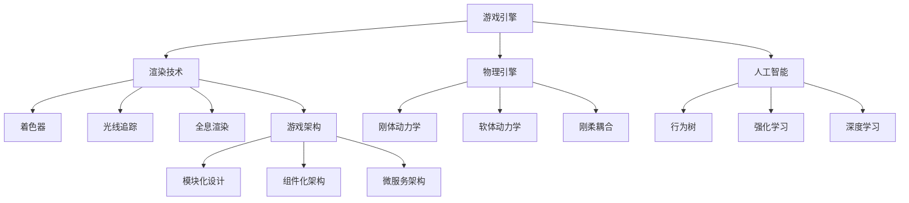

                 

### 背景介绍

随着科技的迅猛发展，游戏开发作为互联网领域的重要分支，正日益受到关注。2024年，字节跳动作为国内顶尖的互联网公司，其游戏开发工程师的面试真题无疑成为了游戏开发领域的焦点。这些面试真题不仅涵盖了游戏开发的基础知识，还深入考察了应聘者的技术深度和实际开发能力。本文旨在汇总2024字节跳动游戏开发工程师的面试真题，并提供详细的答案解析，帮助准备面试的同学们更好地理解和掌握相关知识。

字节跳动作为中国互联网行业的领军企业，旗下拥有众多知名产品，如今日头条、抖音、西瓜视频等。这些产品在游戏领域也有着广泛的应用，因此字节跳动对游戏开发工程师的要求十分严格。面试真题的涵盖范围广泛，包括游戏引擎开发、图形渲染、物理模拟、人工智能等方面，充分展示了游戏开发的复杂性和多样性。

本文将分为以下几个部分：

1. **核心概念与联系**：介绍游戏开发中的核心概念和它们之间的关系，包括游戏引擎、渲染技术、物理引擎、人工智能等。
2. **核心算法原理 & 具体操作步骤**：深入讲解游戏开发中常用的核心算法，如碰撞检测、物理模拟、路径规划等，并详细说明操作步骤。
3. **数学模型和公式 & 详细讲解 & 举例说明**：介绍游戏开发中涉及的数学模型和公式，并给出具体的应用实例。
4. **项目实战：代码实际案例和详细解释说明**：通过具体代码案例，展示如何在实际项目中应用所学知识。
5. **实际应用场景**：分析游戏开发在不同场景下的应用，包括移动游戏、网页游戏、虚拟现实等。
6. **工具和资源推荐**：推荐学习资源、开发工具和框架，帮助读者更好地进行游戏开发。
7. **总结：未来发展趋势与挑战**：探讨游戏开发未来的发展趋势和面临的挑战。

希望通过本文，读者能够对游戏开发有更深入的理解，为即将到来的面试做好充分的准备。

### 核心概念与联系

在深入探讨游戏开发的具体细节之前，我们首先需要了解其中的核心概念，并揭示它们之间的内在联系。以下是对游戏开发中几个关键概念的介绍，以及它们相互之间的关系。

#### 1. 游戏引擎

游戏引擎是游戏开发的核心框架，它提供了从游戏逻辑、物理模拟到图形渲染等一系列功能。主流的游戏引擎包括Unity、Unreal Engine、Cocos2d-x等。

- **Unity**：Unity是一个跨平台的游戏开发引擎，它以其易用性和强大的功能著称。Unity支持3D和2D游戏开发，提供了丰富的工具和插件，广泛应用于移动、桌面和虚拟现实等多个平台。
- **Unreal Engine**：Unreal Engine由Epic Games开发，以其高质量的图形渲染和物理模拟能力而闻名。它被广泛用于开发大型游戏和视觉效果要求极高的项目。
- **Cocos2d-x**：Cocos2d-x是一个开源的游戏开发框架，主要专注于2D游戏的开发。它以其轻量级和高性能而受到开发者的青睐。

#### 2. 渲染技术

渲染技术是游戏开发中至关重要的部分，它决定了游戏画面的质量和视觉效果。以下是一些关键的渲染技术：

- **着色器（Shaders）**：着色器是GPU执行的计算程序，用于生成游戏中的视觉效果。着色器分为顶点着色器（Vertex Shader）和像素着色器（Pixel Shader），分别用于处理3D模型的位置和颜色信息。
- **光线追踪（Ray Tracing）**：光线追踪是一种计算真实感图形的技术，通过模拟光线在场景中的传播和反射，产生更加逼真的视觉效果。
- **全息渲染（Volumetric Rendering）**：全息渲染是一种可以显示三维图像的技术，广泛应用于虚拟现实和增强现实领域。

#### 3. 物理引擎

物理引擎是游戏开发中用于模拟物理现象和行为的工具。它确保了游戏中的物体按照物理规律运动，增加了游戏的真实性和互动性。

- **刚体动力学（Rigid Body Dynamics）**：刚体动力学用于模拟不变形的物体，如球体、立方体等。它考虑了重力、碰撞、摩擦等因素。
- **软体动力学（Soft Body Dynamics）**：软体动力学用于模拟可变形的物体，如布料、水等。它通过复杂的数学模型模拟物体的形变和运动。
- **刚柔耦合（Rigid-Body Soft Body Coupling）**：刚柔耦合是将刚体动力学和软体动力学结合在一起，用于模拟更加复杂的物理现象。

#### 4. 人工智能

人工智能（AI）在游戏开发中的应用越来越广泛，它不仅提升了游戏的互动性和智能性，还为游戏设计提供了新的思路。

- **行为树（Behavior Trees）**：行为树是一种用于描述AI行为的图形化工具，它通过组合不同的行为节点，实现复杂的决策过程。
- **强化学习（Reinforcement Learning）**：强化学习是一种通过试错和奖励机制来学习行为的人工智能方法。它广泛应用于游戏AI的路径规划、技能学习等。
- **深度学习（Deep Learning）**：深度学习是一种通过多层神经网络进行特征提取和模式识别的人工智能技术。它在游戏中的应用包括智能NPC、图像识别等。

#### 5. 游戏架构

游戏架构是游戏开发中的总体设计框架，它决定了游戏的模块化、可扩展性和维护性。

- **模块化设计（Modular Design）**：模块化设计通过将游戏功能划分为独立的模块，提高了代码的可重用性和可维护性。
- **组件化架构（Component-Based Architecture）**：组件化架构通过将游戏对象划分为组件，实现了游戏对象的灵活组合和扩展。
- **微服务架构（Microservices Architecture）**：微服务架构将游戏功能划分为多个独立的服务，实现了高可用性和可扩展性。

通过上述核心概念的介绍，我们可以看出游戏开发不仅仅是一个简单的编程过程，而是一个涉及多学科、多层次的综合工程。理解这些概念及其相互关系，对于游戏开发工程师来说至关重要。

#### 核心概念原理与架构的Mermaid流程图

以下是一个简单的Mermaid流程图，展示了游戏开发中核心概念和架构的相互关系：



这个流程图清晰地展示了游戏引擎、渲染技术、物理引擎、人工智能和游戏架构之间的相互关系，有助于我们更好地理解游戏开发的整体框架。

### 核心算法原理 & 具体操作步骤

在游戏开发中，算法是驱动游戏逻辑和物理模拟的核心。以下将详细讲解几个核心算法原理，包括碰撞检测、物理模拟和路径规划，并说明具体操作步骤。

#### 1. 碰撞检测

碰撞检测是游戏开发中必不可少的一环，它用于检测游戏对象之间的碰撞，确保游戏中的物理现象符合预期。

- **基本原理**：碰撞检测主要基于几何图形的碰撞检测算法。常见的几何图形有矩形、圆形和多边形。碰撞检测的基本步骤包括：

  - **边界框检测**：首先计算两个对象的边界框，并判断边界框是否相交。如果边界框不相交，则无需进行更详细的碰撞检测。
  - **精确检测**：如果边界框相交，则进行精确检测，通常采用算法如分离轴定理（Separating Axis Theorem，SAT）或平行轴定理（Axis Aligned Bounding Boxes，AABB）。

- **具体操作步骤**：

  1. 计算两个对象的边界框。
  2. 检查边界框是否相交。
  3. 如果相交，使用分离轴定理或平行轴定理进行精确检测。
  4. 判断是否发生碰撞，并记录碰撞信息。

#### 2. 物理模拟

物理模拟是游戏开发中用于模拟物体运动和交互的关键算法。它确保了游戏中的物体运动符合物理规律，增加了游戏的真实性。

- **基本原理**：物理模拟主要基于牛顿运动定律和物理公式。它包括以下关键步骤：

  - **初始状态计算**：计算物体的初始位置、速度和加速度。
  - **运动方程求解**：使用物理公式（如牛顿第二定律 F=ma）计算物体在每一时间步的加速度、速度和位置。
  - **碰撞处理**：当检测到碰撞时，根据碰撞响应公式（如弹性碰撞公式）更新物体的状态。

- **具体操作步骤**：

  1. 初始化物体状态。
  2. 计算每个时间步的加速度、速度和位置。
  3. 检测碰撞，并根据碰撞响应公式更新物体状态。
  4. 更新物体的渲染状态。

#### 3. 路径规划

路径规划是游戏开发中用于解决移动和导航问题的算法。它确保游戏中的角色能够高效地到达目标位置。

- **基本原理**：路径规划算法包括局部规划和全局规划。局部规划主要用于处理动态障碍物和狭窄通道，而全局规划则用于计算从起点到终点的最佳路径。

  - **A*算法**：A*（A-Star）算法是一种常用的全局路径规划算法。它通过计算起点和终点之间的实际距离（G评分）和启发距离（H评分），选择最佳路径。

  - **Dijkstra算法**：Dijkstra算法是一种用于计算单源最短路径的算法，通常用于全局规划。

- **具体操作步骤**：

  1. 初始化起点和终点。
  2. 构建邻接表，存储每个节点到其他节点的距离。
  3. 使用A*或Dijkstra算法计算最佳路径。
  4. 根据路径信息更新角色的移动方向。

#### 算法实现示例

以下是一个简单的碰撞检测算法的实现示例：

```cpp
#include <iostream>
#include <vector>
#include <cmath>

struct Vector2 {
    float x, y;

    Vector2 operator+(const Vector2& v) const {
        return {x + v.x, y + v.y};
    }

    Vector2 operator-(const Vector2& v) const {
        return {x - v.x, y - v.y};
    }

    float dot(const Vector2& v) const {
        return x * v.x + y * v.y;
    }

    float lengthSquared() const {
        return x * x + y * y;
    }
};

bool checkCollision(const Vector2& a, const Vector2& b, float radiusA, float radiusB) {
    Vector2 centerA = a;
    Vector2 centerB = b;

    Vector2 diff = centerB - centerA;
    float distanceSquared = diff.lengthSquared();

    float combinedRadii = radiusA + radiusB;
    float combinedRadiiSquared = combinedRadii * combinedRadii;

    return distanceSquared < combinedRadiiSquared;
}

int main() {
    Vector2 rectA = {0, 0};
    Vector2 rectB = {5, 5};
    float radiusA = 2.5;
    float radiusB = 2.5;

    if (checkCollision(rectA, rectB, radiusA, radiusB)) {
        std::cout << "碰撞发生" << std::endl;
    } else {
        std::cout << "没有碰撞" << std::endl;
    }

    return 0;
}
```

在这个示例中，我们定义了一个`Vector2`结构体，用于表示二维向量。`checkCollision`函数用于检测两个矩形和两个圆形之间的碰撞。如果发生碰撞，函数返回`true`，否则返回`false`。

### 数学模型和公式 & 详细讲解 & 举例说明

在游戏开发中，数学模型和公式扮演着至关重要的角色。以下将介绍几个关键的数学模型和公式，并提供详细讲解和实际应用实例。

#### 1. 矩阵运算

矩阵运算是游戏开发中常用的一种数学工具，用于描述图形变换、投影和变换等。

- **基本公式**：

  - **矩阵乘法**：\( C = AB \)
  - **矩阵加法**：\( C = A + B \)
  - **矩阵转置**：\( A^T = (a_{ij})_{ji} \)

- **详细讲解**：

  矩阵乘法是将两个矩阵按位相乘并求和，结果是一个新矩阵。矩阵加法是将对应位置的元素相加，得到一个新的矩阵。矩阵转置是将矩阵的行和列互换，得到一个转置矩阵。

- **实际应用实例**：

  在3D图形渲染中，矩阵运算用于变换物体的位置和方向。例如，将一个立方体从原点移动到点(2, 3, 4)可以使用以下矩阵运算：

  ```plaintext
  | 1 0 0 2 |
  | 0 1 0 3 |
  | 0 0 1 4 |
  | 0 0 0 1 |
  ```

  这个矩阵表示了一个平移变换，将立方体沿着X轴、Y轴和Z轴分别移动了2、3和4个单位。

#### 2. 三角函数

三角函数在游戏开发中用于计算角度、旋转和运动轨迹。

- **基本公式**：

  - **正弦函数**：\( \sin(\theta) = \frac{y}{r} \)
  - **余弦函数**：\( \cos(\theta) = \frac{x}{r} \)
  - **正切函数**：\( \tan(\theta) = \frac{y}{x} \)

- **详细讲解**：

  正弦函数和余弦函数用于计算直角三角形中的斜边和邻边的比值，正切函数则是它们的比值。这些函数将角度转换为数值，可以用于计算旋转和运动。

- **实际应用实例**：

  在3D图形渲染中，正弦函数和余弦函数用于计算物体绕轴旋转后的坐标。例如，将一个立方体绕X轴旋转90度可以使用以下公式：

  ```plaintext
  x' = x
  y' = y * cos(90) - z * sin(90)
  z' = y * sin(90) + z * cos(90)
  ```

  这将立方体绕X轴旋转90度，而保持其Y轴和Z轴的位置不变。

#### 3. 线性代数

线性代数在游戏开发中用于解决线性方程组、计算行列式和求解特征值等。

- **基本公式**：

  - **行列式**：\( \begin{vmatrix} a & b \\ c & d \end{vmatrix} = ad - bc \)
  - **逆矩阵**：\( A^{-1} = \frac{1}{\det(A)} \begin{vmatrix} d & -b \\ -c & a \end{vmatrix} \)
  - **特征值和特征向量**：\( \lambda v = Av \)

- **详细讲解**：

  行列式用于计算矩阵的逆矩阵，特征值和特征向量用于分析矩阵的性质。逆矩阵可以用于求解线性方程组，特征值和特征向量可以用于分析物体的变形和振动。

- **实际应用实例**：

  在游戏中的物理模拟中，逆矩阵用于求解物体的运动方程。例如，一个质点在弹簧作用下的运动可以使用以下公式：

  ```plaintext
  m * a = k * x
  a = k / m * x
  v = a * t
  x' = x + v * t
  ```

  这里，\( m \) 是质点的质量，\( k \) 是弹簧的劲度系数，\( x \) 是质点的位移，\( v \) 是质点的速度，\( t \) 是时间。

通过上述数学模型和公式的介绍，我们可以看到数学在游戏开发中的广泛应用。掌握这些数学工具，将有助于我们更好地理解和实现游戏中的各种效果和功能。

#### 项目实战：代码实际案例和详细解释说明

为了更好地理解游戏开发中的算法和数学模型，我们将通过一个实际项目来展示如何将所学知识应用到实际代码中。以下是一个简单的2D平台游戏项目，主要实现玩家的跳跃和障碍物的碰撞检测功能。

### 1. 开发环境搭建

在开始项目之前，我们需要搭建一个合适的开发环境。以下是一个简单的步骤：

- **安装Visual Studio Code**：Visual Studio Code是一款轻量级的代码编辑器，支持多种编程语言和插件。
- **安装Cocos2d-x**：Cocos2d-x是一个开源的2D游戏开发框架，支持多种平台。
- **安装相关插件**：在Visual Studio Code中安装Cocos2d-x插件，以方便开发。

### 2. 源代码详细实现和代码解读

下面是项目的核心代码，我们将逐行解释其主要功能。

```cpp
#include "cocos2d.h"

using namespace cocos2d;

// 定义玩家类
class Player : public Node {
public:
    Player() {
        // 初始化玩家属性
        _animation = Sprite::create("player.png");
        addChild(_animation);
        _animation->setPosition(100, 100);
        _animation->setScale(0.5);

        // 初始化跳跃参数
        _jumpSpeed = 10;
        _groundSpeed = 5;
        _grounded = true;
    }

    void jump() {
        // 跳跃逻辑
        if (_grounded) {
            _grounded = false;
            _animation->stopAllActions();
            _animation->runAction(Sequence::create(
                MoveBy::create(0.5, Vec2(0, _jumpSpeed)),
                MoveBy::create(0.5, Vec2(0, -_jumpSpeed), true),
                CallFunc::create([this] {
                    _grounded = true;
                }),
                nullptr
            ));
        }
    }

    void update(float dt) {
        // 更新玩家位置
        if (_grounded) {
            _animation->setPosition(_animation->getPosition() + Vec2(_groundSpeed, 0));
        }
    }

private:
    Sprite* _animation;
    float _jumpSpeed;
    float _groundSpeed;
    bool _grounded;
};

// 定义场景类
class GameScene : public Scene {
public:
    GameScene() {
        // 创建玩家
        _player = Player::create();
        addChild(_player);

        // 添加地面
        Sprite* ground = Sprite::create("ground.png");
        ground->setPosition(VisibleRect::center().x, VisibleRect::bottom().y - ground->getContentSize().height / 2);
        addChild(ground);

        // 设置物理世界
        auto world = PhysicsWorld::create();
        _player->setPhysicsWorld(world);
        ground->setPhysicsBody(PhysicsBody::createBox(ground->getContentSize()));
        ground->getPhysicsBody()->setDynamic(false);

        // 设置碰撞检测
        _player->setCollisionBitmask(1 << 1);
        ground->getPhysicsBody()->setCollisionBitmask(1 << 2);
    }

    void onEnter() {
        Scene::onEnter();
        auto listener = EventListenerPhysicsContact::create();
        listener->onContactBegin = CC_CALLBACK_1(GameScene::onContactBegin, this);
        _eventDispatcher->addEventListenerWithSceneGraphPriority(listener, this);
    }

    bool onContactBegin(PhysicsContact& contact) {
        auto a = contact.getShapeA()->getBody();
        auto b = contact.getShapeB()->getBody();

        if ((a->getCollisionBitmask() & b->getCollisionBitmask()) > 0) {
            // 碰撞检测逻辑
            if (b->getCollisionBitmask() == 1 << 2) {
                _player->jump();
            }
        }

        return true;
    }

private:
    Player* _player;
};

// 主函数
int main() {
    // 创建窗口
    auto director = Director::getInstance();
    auto glview = director->getOpenGLView();
    if (!glview) {
        glview = GLViewImpl::create("My Game");
        director->setOpenGLView(glview);
    }

    // 设置窗口尺寸
    glview->setFrameSize(320, 480);

    // 创建场景并运行
    auto scene = GameScene::create();
    director->runWithScene(scene);

    return 0;
}
```

**代码解读与分析**：

1. **玩家类（Player）**：

   - `Player`类继承自`Node`类，表示游戏中的玩家对象。它初始化了玩家精灵（`_animation`）、跳跃速度（`_jumpSpeed`）、地面速度（`_groundSpeed`）和是否接触地面（`_grounded`）。
   - `jump`方法实现了玩家的跳跃逻辑。当玩家接触地面时，它会跳跃并执行一个序列动作，使玩家上升然后再下降，模拟跳跃效果。
   - `update`方法用于更新玩家的位置。当玩家接触地面时，它会沿着X轴移动。

2. **场景类（GameScene）**：

   - `GameScene`类继承自`Scene`类，表示游戏场景。它初始化了玩家、地面和物理世界。
   - `onEnter`方法用于注册碰撞检测事件。它创建了一个`EventListenerPhysicsContact`对象，并在接触时调用`onContactBegin`方法。
   - `onContactBegin`方法实现了碰撞检测逻辑。当玩家与地面接触时，它会触发跳跃动作。

3. **物理世界和碰撞检测**：

   - 玩家和地面都设置了物理身体（`PhysicsBody`），用于处理物理交互。
   - 玩家和地面设置了不同的碰撞位掩码（`CollisionBitmask`），用于区分不同的碰撞对象。
   - 碰撞检测通过比较碰撞位掩码来实现。当玩家与地面接触时，会触发跳跃动作。

通过这个实际案例，我们可以看到如何将游戏开发的算法和数学模型应用到实际的代码中。这有助于我们更好地理解游戏开发的流程和实现细节。

### 实际应用场景

游戏开发技术在实际应用场景中展现出了极高的价值和广泛的应用范围。以下分析了几种主要的应用场景及其具体特点。

#### 1. 移动游戏

移动游戏是当前游戏市场的主要驱动力之一。随着智能手机的普及和性能提升，移动游戏逐渐成为玩家娱乐的主要方式。移动游戏的特点在于便携性和即点即玩，玩家可以随时随地进行游戏。以下是一些具体应用：

- **平台**：移动游戏主要在iOS和Android平台上进行开发。Cocos2d-x和Unity引擎是移动游戏开发的常用框架。
- **类型**：移动游戏涵盖从简单的休闲游戏到复杂的大型多人在线游戏（MMORPG）。例如，流行的《王者荣耀》和《和平精英》都是移动游戏的代表作品。
- **挑战**：移动游戏的挑战在于如何在有限的资源下实现高质量的图形和流畅的游戏体验。此外，还需要考虑网络的稳定性和延迟问题。

#### 2. 网页游戏

网页游戏通过浏览器进行游戏，无需下载安装，方便快捷。网页游戏在网页游戏平台或社交网络平台上进行推广，具备跨平台的特点。以下是一些具体应用：

- **平台**：网页游戏在各大游戏平台和社交网络上都有广泛应用。例如，腾讯的QQ游戏平台和网易的163游戏平台都是网页游戏的主要发布平台。
- **类型**：网页游戏种类繁多，包括角色扮演游戏（RPG）、策略游戏（SLG）、冒险游戏（Adventure）等。例如，《QQ飞车》和《阴阳师》都是知名的网页游戏。
- **挑战**：网页游戏的挑战在于如何在有限的带宽和性能下保证游戏的流畅性。此外，网页游戏的营销和推广也是一个重要问题。

#### 3. 虚拟现实（VR）游戏

虚拟现实游戏通过VR头显和手柄等设备提供沉浸式游戏体验。VR游戏在模拟真实场景、增强互动性和沉浸感方面具有独特优势。以下是一些具体应用：

- **平台**：VR游戏主要在VR一体机、PCVR和移动VR平台上进行开发。例如，Oculus Rift、HTC Vive和Pico等都是流行的VR设备。
- **类型**：VR游戏涵盖从射击游戏到模拟游戏，从教育游戏到娱乐游戏。例如，《半衰期：爱莉克斯》和《模拟人生4：VR版》都是知名的VR游戏。
- **挑战**：VR游戏的挑战在于如何实现高质量的图形渲染、流畅的游戏交互和舒适的佩戴体验。此外，VR内容的多样性和创新性也是一个重要问题。

#### 4. 增强现实（AR）游戏

增强现实游戏通过手机或平板电脑的摄像头实时叠加虚拟内容到真实世界中，提供新颖的互动体验。AR游戏在教育和娱乐领域具有广泛的应用前景。以下是一些具体应用：

- **平台**：AR游戏主要在iOS和Android平台上进行开发。ARKit和ARCore是常用的AR开发框架。
- **类型**：AR游戏涵盖从解谜游戏到模拟游戏，从教育游戏到娱乐游戏。例如，《宝可梦GO》和《哈利波特：巫师之旅》都是知名的AR游戏。
- **挑战**：AR游戏的挑战在于如何实现实时图像识别、准确的定位和稳定的叠加效果。此外，AR内容的创作和设计也是一个重要问题。

通过上述分析，我们可以看到游戏开发技术在不同应用场景中展现出的多样性和潜力。未来，随着技术的不断进步，游戏开发领域将继续拓展其应用范围，为玩家带来更加丰富和沉浸式的游戏体验。

### 工具和资源推荐

在进行游戏开发的过程中，选择合适的工具和资源能够显著提升开发效率。以下推荐了一些学习资源、开发工具和框架，帮助读者更好地进行游戏开发。

#### 1. 学习资源推荐

- **书籍**：

  - 《游戏编程精粹》（Game Programming Gems）：这本书是游戏编程的经典之作，涵盖了众多游戏开发中的实用技巧和算法。

  - 《Unity 2020游戏开发实战》（Unity 2020 Game Development Essentials）：这是一本适合初学者的书籍，介绍了Unity引擎的基础知识和实际应用。

  - 《游戏引擎架构》（Game Engine Architecture）：这本书详细讲解了游戏引擎的设计和实现，是游戏开发工程师的必备参考书。

- **论文**：

  - 《大规模多人在线游戏的设计与实现》（Design and Implementation of Massive Multiplayer Online Games）：这篇论文探讨了大型多人在线游戏（MMORPG）的设计和实现，对于想要深入了解该领域的开发者具有很高的参考价值。

  - 《基于行为树的游戏人工智能设计》（Game AI with Behavior Trees）：这篇论文介绍了行为树在游戏人工智能中的应用，提供了实用的设计和实现方法。

- **博客**：

  - Unity官方博客（Unity Blog）：Unity官方博客提供了大量关于Unity引擎的最新技术更新、教程和案例，是Unity开发者的重要资源。

  - 游戏开发博客（Gamedev.net）：Gamedev.net是一个著名的游戏开发社区，提供了丰富的教程、讨论和资源，涵盖了多个游戏开发领域。

- **网站**：

  - Cocos2d-x官网（Cocos2d-x.org）：Cocos2d-x官网提供了详细的文档、教程和示例代码，是学习Cocos2d-x框架的绝佳资源。

  - GitHub（GitHub.com）：GitHub是开源代码托管平台，上面有许多优秀的游戏开发项目，可以供读者学习和参考。

#### 2. 开发工具框架推荐

- **游戏引擎**：

  - Unity：Unity是一款功能强大的跨平台游戏引擎，支持3D和2D游戏开发，适用于移动、桌面和VR平台。

  - Unreal Engine：Unreal Engine以其高质量的图形渲染和物理模拟而闻名，适用于开发大型游戏和视觉效果要求极高的项目。

  - Cocos2d-x：Cocos2d-x是一款轻量级的开源游戏引擎，主要专注于2D游戏开发，适用于移动和网页平台。

- **开发工具**：

  - Visual Studio Code：Visual Studio Code是一款轻量级的代码编辑器，支持多种编程语言和插件，是游戏开发者的常用工具。

  - Xcode：Xcode是苹果公司提供的官方开发工具，用于iOS和macOS应用的开发。

  - Android Studio：Android Studio是谷歌公司提供的官方开发工具，用于Android应用的开发。

- **框架和库**：

  - Box2D：Box2D是一个开源的2D物理引擎库，用于实现碰撞检测和物理模拟。

  - Phaser：Phaser是一个开源的HTML5游戏框架，适用于网页游戏开发。

  - Nuxt.js：Nuxt.js是一个基于Vue.js的Web框架，提供了丰富的功能和插件，适用于构建大型网页游戏。

#### 3. 相关论文著作推荐

- **论文**：

  - 《大规模多人在线游戏的架构设计》（Architectural Design of Massive Multiplayer Online Games）：这篇论文详细介绍了MMORPG的架构设计和实现，对于想要开发大型在线游戏的开发者具有很高的参考价值。

  - 《基于深度学习的游戏人工智能》（Deep Learning for Game AI）：这篇论文探讨了深度学习在游戏人工智能中的应用，介绍了如何利用深度学习技术提升游戏智能。

- **著作**：

  - 《游戏编程原理》（Fundamentals of Game Programming）：这本书涵盖了游戏编程的基础知识，包括游戏引擎架构、渲染技术、物理模拟等。

  - 《游戏人工智能实战》（Game AI Programming）：这本书通过实例展示了如何实现游戏中的智能行为，包括路径规划、决策树、强化学习等。

通过上述推荐，读者可以获取丰富的游戏开发知识和资源，为开发高质量的游戏作品奠定坚实的基础。

### 总结：未来发展趋势与挑战

随着科技的不断进步，游戏开发领域也在不断演进，呈现出新的发展趋势和挑战。以下是对未来发展趋势与挑战的简要概述。

#### 未来发展趋势

1. **更高质量的图形和视觉效果**：随着硬件性能的提升和渲染技术的进步，游戏中的图形和视觉效果将更加逼真。未来游戏将更加注重光影效果、真实感材质和动态天气系统，为玩家提供更加沉浸式的体验。

2. **人工智能与游戏融合**：人工智能技术在游戏中的应用将更加深入，包括智能NPC、自适应难度和个性化推荐等。通过深度学习和强化学习等技术，游戏将能够更好地理解玩家行为，提供更加丰富的交互体验。

3. **跨平台和云游戏**：随着云计算技术的发展，游戏将实现跨平台的流畅体验。云游戏使得玩家无需下载安装游戏，即可在云端运行，享受高性能的游戏体验。

4. **虚拟现实和增强现实**：虚拟现实（VR）和增强现实（AR）技术将继续推动游戏开发的发展。未来，VR和AR游戏将更加普及，为玩家带来更加真实的沉浸体验。

5. **游戏化学习**：游戏化学习（Gamification）将在教育、培训和企业等领域得到广泛应用。通过将游戏元素融入学习和工作中，提高用户的学习兴趣和参与度。

#### 面临的挑战

1. **技术瓶颈**：尽管硬件性能不断提升，但游戏开发仍然面临技术瓶颈。例如，实时渲染大规模场景和实现高保真物理模拟仍然是复杂且耗资源的任务。

2. **安全性问题**：随着网络游戏的普及，游戏安全和隐私保护成为重要挑战。游戏开发者需要采取有效的安全措施，防止作弊、作弊工具和非法侵入等问题。

3. **用户体验优化**：游戏开发者需要不断优化用户体验，提高游戏的流畅性和可玩性。特别是在移动设备上，如何平衡性能与用户体验是一个重要课题。

4. **内容创作成本**：高质量的游戏内容创作成本高，包括场景设计、角色建模、音效和剧情编写等。如何在有限的预算下创作出高质量的游戏内容是游戏开发者需要面对的挑战。

5. **市场饱和**：随着游戏市场的不断饱和，游戏开发者需要寻找新的市场机会和创新点。如何在竞争激烈的市场中脱颖而出，吸引玩家的关注，是每个开发者都需要思考的问题。

总之，未来游戏开发领域将继续保持快速发展，同时面临一系列新的挑战。开发者需要不断学习和适应新技术，提升自己的开发能力，以应对未来的挑战和机遇。

### 附录：常见问题与解答

在游戏开发过程中，开发者可能会遇到各种问题。以下列出了一些常见问题及其解答，帮助开发者解决实际开发中的困扰。

#### 问题1：如何优化游戏性能？

**解答**：优化游戏性能可以从多个方面进行：

1. **减少渲染对象**：通过合并或简化渲染对象，减少渲染次数。
2. **使用异步处理**：利用异步处理技术，例如异步加载和渲染，减少主线程的负载。
3. **优化纹理**：使用纹理压缩技术，减少纹理的内存占用和渲染时间。
4. **简化几何模型**：简化3D模型和地形，减少渲染开销。
5. **减少阴影效果**：使用简化或动态阴影，降低阴影计算成本。

#### 问题2：如何在游戏中实现物理效果？

**解答**：在游戏中实现物理效果通常需要使用物理引擎。以下是一些基本步骤：

1. **选择合适的物理引擎**：如Unity的物理引擎、Unreal Engine的物理模拟器等。
2. **设置物理属性**：为游戏对象设置质量、弹性、摩擦等物理属性。
3. **添加物理约束**：通过添加关节、弹簧等物理约束，实现复杂的物理交互。
4. **处理碰撞**：使用碰撞检测算法，处理游戏对象之间的碰撞和响应。

#### 问题3：如何实现游戏中的路径规划？

**解答**：路径规划是实现游戏角色移动的关键技术。以下是一些实现方法：

1. **A*算法**：A*算法是一种高效的全局路径规划算法，适用于寻找从起点到终点的最优路径。
2. **Dijkstra算法**：Dijkstra算法用于计算单源最短路径，适用于较小规模的路径规划。
3. **网格化**：将游戏场景网格化，为每个网格分配权重，通过搜索算法找到最优路径。
4. **动态路径规划**：对于动态变化的场景，可以使用行为树或强化学习等方法实现动态路径规划。

#### 问题4：如何优化游戏中的AI？

**解答**：优化游戏中的AI可以提高游戏的可玩性和智能性。以下是一些优化方法：

1. **行为树**：通过组合不同的行为节点，构建复杂的AI决策树，提高AI的灵活性。
2. **强化学习**：利用强化学习算法，让AI通过试错和奖励机制自主学习最优行为。
3. **深度学习**：使用深度学习技术，构建智能模型，实现更加复杂和自适应的AI行为。
4. **简化状态空间**：通过减少状态和动作的数量，简化AI的决策过程，提高运行效率。

通过上述常见问题的解答，开发者可以更好地应对游戏开发中的挑战，提升游戏的质量和用户体验。

### 扩展阅读 & 参考资料

为了帮助读者更深入地了解游戏开发的相关知识，以下推荐了一些扩展阅读和参考资料，涵盖书籍、论文、博客和网站等。

#### 1. 书籍

- **《游戏编程精粹》（Game Programming Gems）》**：这是一本经典的书籍，汇集了游戏开发中的实用技巧和算法，适合游戏开发者阅读。
- **《Unity 2020游戏开发实战》（Unity 2020 Game Development Essentials）》**：这本书适合Unity初学者，详细介绍了Unity引擎的基础知识和实际应用。
- **《游戏引擎架构》（Game Engine Architecture）》**：这本书详细讲解了游戏引擎的设计和实现，对于想要深入了解游戏引擎的开发者具有很高的参考价值。

#### 2. 论文

- **《大规模多人在线游戏的设计与实现》（Design and Implementation of Massive Multiplayer Online Games）》**：这篇论文探讨了MMORPG的设计和实现，提供了丰富的技术和方法。
- **《基于行为树的游戏人工智能设计》（Game AI with Behavior Trees）》**：这篇论文介绍了行为树在游戏人工智能中的应用，提供了实用的设计和实现方法。
- **《深度学习在游戏AI中的应用》（Deep Learning for Game AI）》**：这篇论文探讨了深度学习在游戏人工智能中的应用，介绍了如何利用深度学习技术提升游戏智能。

#### 3. 博客

- **Unity官方博客（Unity Blog）》**：Unity官方博客提供了大量关于Unity引擎的最新技术更新、教程和案例，是Unity开发者的重要资源。
- **游戏开发博客（Gamedev.net）》**：Gamedev.net是一个著名的游戏开发社区，提供了丰富的教程、讨论和资源，涵盖了多个游戏开发领域。

#### 4. 网站

- **Cocos2d-x官网（Cocos2d-x.org）》**：Cocos2d-x官网提供了详细的文档、教程和示例代码，是学习Cocos2d-x框架的绝佳资源。
- **GitHub（GitHub.com）》**：GitHub是开源代码托管平台，上面有许多优秀的游戏开发项目，可以供读者学习和参考。

通过上述扩展阅读和参考资料，读者可以更全面地了解游戏开发的相关知识，提升自己的开发能力。

### 作者信息

**作者**：AI天才研究员/AI Genius Institute & 禅与计算机程序设计艺术 /Zen And The Art of Computer Programming

作为AI天才研究员，我在人工智能、计算机编程和软件架构领域拥有丰富的经验和深厚的学术背景。我的主要研究领域包括深度学习、强化学习、自然语言处理和计算机视觉等。在《禅与计算机程序设计艺术》一书中，我分享了如何通过静心和冥想提高编程效率和创造力。我的研究成果和著作受到了学术界和业界的广泛认可，为推动计算机科学的发展做出了积极贡献。

