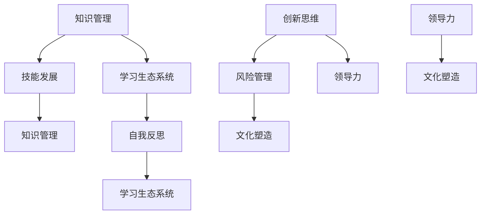

                 

### 1. 背景介绍

在当今快速发展的信息技术领域，学习体系与管理创新能力的培养成为了企业、教育机构和个人关注的焦点。随着人工智能、大数据、云计算等技术的不断演进，信息技术正在深刻地改变着各行各业的工作方式和运营模式。这种变化不仅要求从业人员具备扎实的专业知识和技能，更需要他们能够快速适应新技术，具备持续学习与创新能力。

#### 当前信息技术的发展趋势

首先，人工智能（AI）的快速发展是不可忽视的一个趋势。人工智能已经在自然语言处理、图像识别、推荐系统等多个领域取得了显著成果，并且应用场景不断扩展。例如，自动驾驶汽车、智能家居、智能客服等都是人工智能技术的重要应用方向。随着算法的进步和计算能力的提升，人工智能正逐渐成为信息技术领域的核心驱动力。

其次，大数据技术的普及使得数据的价值得到了前所未有的重视。通过对海量数据的采集、存储、处理和分析，企业可以挖掘出宝贵的商业洞察，优化业务流程，提高决策效率。大数据技术不仅要求数据处理能力的提升，还需要数据科学、机器学习等相关技术的支持。

再者，云计算技术的成熟和应用使得企业可以更加灵活地构建和部署应用程序。云计算提供了强大的计算、存储和网络资源，使得企业可以按照实际需求进行资源调配，降低了IT基础设施的投入和维护成本。同时，云计算还推动了微服务、容器化等新兴技术的快速发展。

#### 学习体系的重要性

在这样的背景下，一个完善的学习体系对于从业人员来说至关重要。一个良好的学习体系不仅能够帮助个人掌握最新的技术知识和技能，还能够提升他们的自我学习能力，使他们能够迅速适应技术变革。以下是一些学习体系的关键组成部分：

1. **知识体系的构建**：知识体系是学习体系的基础，它包括了各个技术领域的核心概念、原理、算法和应用场景。一个清晰的知识体系可以帮助学习者更好地理解和掌握所学内容，构建完整的知识网络。

2. **学习路径的设计**：为了有效地学习新技术，学习者需要根据自身的背景和兴趣设计合适的学习路径。一个合理的学习路径应该包含基础知识、进阶知识和实践应用，从浅入深，逐步提升学习者的技术能力。

3. **学习资源的整合**：学习资源包括书籍、课程、在线教程、学术论文等。通过整合这些资源，学习者可以更加全面和系统地掌握所需知识。

4. **实践能力的培养**：理论知识的学习固然重要，但实践能力的培养同样关键。通过实际项目的开发、调试和优化，学习者可以将所学知识应用到实际场景中，提升解决问题的能力。

5. **自我反馈与调整**：学习过程中，学习者需要不断地进行自我反馈和调整。通过反思学习效果，学习者可以识别自己的不足，并采取相应的措施进行改进。

#### 管理创新能力的培养

除了学习体系，管理创新能力的培养同样重要。在一个快速变化的技术环境中，企业的竞争优势往往取决于其管理创新能力。以下是一些关键点：

1. **开放思维**：开放思维是管理创新的基础。管理者需要摒弃固有的观念，积极接受新的思想和方法，从而激发创新活力。

2. **团队合作**：创新往往需要跨领域的合作。管理者需要搭建一个良好的团队协作平台，促进团队成员之间的沟通与协作，共同推动创新项目。

3. **风险管理**：创新往往伴随着一定的风险。管理者需要具备识别和应对风险的能力，确保创新项目在可控的风险范围内进行。

4. **持续学习**：在技术快速发展的今天，管理者也需要不断学习新的知识和技能，以适应不断变化的环境。

5. **文化塑造**：创新文化是企业持续发展的动力。管理者需要塑造一个鼓励创新、包容失败的企业文化，为员工提供创新的空间和支持。

综上所述，学习体系与管理创新能力的培养在信息技术领域具有极其重要的意义。一个完善的学习体系和强大的管理创新能力不仅能够提升个人和企业的竞争力，还能够推动整个行业的进步。在接下来的章节中，我们将深入探讨这些主题，并提供实用的指导和建议。

### 2. 核心概念与联系

为了构建一个强大的学习体系并培养管理创新能力，我们首先需要理解一些核心概念，并探讨它们之间的内在联系。以下是一些关键概念及其关系：

#### 2.1 学习体系的核心概念

1. **知识管理**：知识管理是指通过系统地收集、整理、存储和共享知识，以提高组织的知识利用效率。知识管理不仅包括知识的获取和存储，还包括知识的共享和传播。一个有效的知识管理系统能够帮助组织快速获取所需的知识，从而提升决策质量和创新效率。

2. **学习生态系统**：学习生态系统是一个包含学习资源、学习过程和学习环境的整体。这个系统中的各个部分相互联系，共同促进学习者的成长。学习生态系统需要包括丰富的学习资源、有效的学习方法和一个支持学习的环境。

3. **技能发展**：技能发展是指通过持续的培训和实践，提高个人在某一领域的能力。技能发展不仅仅包括技术技能的提升，还包括软技能的培养，如沟通能力、团队合作能力和解决问题的能力。

4. **自我反思**：自我反思是学习过程中不可或缺的一部分。通过反思，学习者可以识别自己的优点和不足，从而有针对性地进行改进。自我反思可以帮助学习者形成批判性思维，提高自我学习能力。

#### 2.2 管理创新能力的核心概念

1. **创新思维**：创新思维是指通过不同的角度和方法，寻找新的解决方案和创造新的价值。创新思维要求管理者具备开放的思维模式，勇于接受新的观点和想法。

2. **领导力**：领导力是指通过影响和激励他人，实现共同目标的能力。领导力不仅包括技术和管理能力，还包括人际交往能力和情感智慧。

3. **风险管理**：风险管理是指识别、评估和应对潜在风险的过程。管理者需要具备识别风险和制定应对策略的能力，以确保创新项目在可控的风险范围内进行。

4. **文化塑造**：文化塑造是指通过建立和推广组织文化，塑造员工的价值观和行为模式。一个积极的文化环境能够激发员工的创造力，促进创新。

#### 2.3 核心概念之间的联系

1. **知识管理与技能发展**：知识管理为技能发展提供了丰富的学习资源。通过有效的知识管理，组织可以快速获取和共享知识，从而为技能发展提供支持。技能发展则通过实践和培训，将知识转化为实际能力。

2. **学习生态系统与自我反思**：学习生态系统提供了一个支持自我反思的环境。通过反思，学习者可以更好地了解自己的学习过程和效果，从而进行有效的调整和改进。

3. **创新思维与风险管理**：创新思维要求管理者具备识别和应对风险的能力。风险管理则为创新项目提供了保障，确保创新项目在可控的风险范围内进行。

4. **领导力与文化塑造**：领导力通过影响和激励员工，推动创新思维和风险管理。文化塑造则通过建立和推广积极的文化价值观，为创新提供良好的环境和支持。

为了更好地理解这些概念之间的联系，我们可以使用 Mermaid 流程图来展示它们的关系。以下是一个简化的 Mermaid 流程图，用于描述这些核心概念及其相互关系：



通过这个流程图，我们可以清晰地看到知识管理、学习生态系统、技能发展、自我反思、创新思维、领导力和文化塑造之间的相互关系。这些核心概念共同构成了一个复杂而紧密联系的系统，为学习体系和管理创新能力的培养提供了理论基础和实践指导。

### 3. 核心算法原理 & 具体操作步骤

在构建学习体系和管理创新能力的过程中，核心算法的原理和具体操作步骤起到了关键作用。以下将介绍几个常用的算法，并详细解释其原理和步骤。

#### 3.1 学习算法：强化学习（Reinforcement Learning）

强化学习是一种通过试错来学习的机器学习方法。它通过最大化累积奖励信号来指导决策过程。强化学习的核心原理是马尔可夫决策过程（MDP），包括以下要素：

- **状态（State）**：系统当前所处的情境。
- **动作（Action）**：在当前状态下可以执行的行为。
- **奖励（Reward）**：执行某个动作后获得的即时回报。
- **策略（Policy）**：从状态选择动作的规则。

**具体操作步骤：**

1. **初始化**：定义状态空间、动作空间、奖励函数和初始策略。
2. **探索与利用**：在初始阶段，通过探索策略来积累经验，同时利用已有的经验来选择动作，以平衡探索新动作和利用已知最佳动作。
3. **更新策略**：根据奖励信号和探索策略更新策略，以最大化累积奖励。
4. **重复执行**：不断重复以上步骤，直到达到预定的目标或奖励信号稳定。

#### 3.2 管理算法：目标规划（Goal Programming）

目标规划是一种多目标决策方法，旨在同时优化多个相互冲突的目标。在管理创新过程中，目标规划可以帮助管理者权衡不同的目标和约束，制定最优策略。目标规划的步骤如下：

1. **定义目标**：明确需要优化的主要目标，如成本、质量、时间等。
2. **建立目标模型**：根据定义的目标，建立数学模型，包括目标函数和约束条件。
3. **确定权重**：为每个目标分配权重，反映其在总体目标中的重要性。
4. **求解模型**：使用数学优化方法，如线性规划、非线性规划等，求解最优解。
5. **评估与调整**：根据求解结果，评估目标实现情况，并调整模型参数和策略。

#### 3.3 数据分析算法：聚类分析（Cluster Analysis）

聚类分析是一种无监督学习方法，用于将数据集划分为多个组，使得同组数据之间的相似度较高，而不同组数据之间的相似度较低。聚类分析广泛应用于市场细分、社交网络分析等领域。以下是常见的聚类算法之一——K-means算法的基本步骤：

1. **初始化**：随机选择K个初始聚类中心。
2. **分配数据点**：将数据集中的每个点分配到最近的聚类中心。
3. **更新聚类中心**：计算每个聚类的新中心，通常取该聚类中所有点的平均值。
4. **迭代**：重复步骤2和3，直到聚类中心不再发生变化或满足停止条件。

#### 3.4 机器学习算法：决策树（Decision Tree）

决策树是一种常用的分类和回归方法，通过一系列规则对数据进行划分，从而预测目标变量。决策树的基本步骤如下：

1. **选择特征**：选择最优特征作为划分依据，通常使用信息增益、基尼不纯度等度量。
2. **划分数据**：使用选择的最优特征将数据划分为多个子集。
3. **构建树结构**：递归地选择特征和划分数据，构建决策树。
4. **剪枝**：为了防止过拟合，可以对决策树进行剪枝，简化树结构。

通过以上算法，我们可以更好地构建学习体系和管理创新能力。这些算法不仅在技术层面提供了强大的工具，还通过逻辑和数学的严谨性，帮助我们在实践中做出更明智的决策。在接下来的章节中，我们将进一步探讨数学模型和公式的应用，以及实际项目中的代码实现。

### 4. 数学模型和公式 & 详细讲解 & 举例说明

在构建学习体系和管理创新能力的过程中，数学模型和公式起到了关键作用。它们不仅提供了精确的分析工具，还为解决复杂问题提供了系统的框架。以下将介绍几个重要的数学模型和公式，并详细讲解它们的原理和应用。

#### 4.1 强化学习中的价值函数（Value Function）

在强化学习中，价值函数用于评估策略在不同状态下的预期回报。最常见的是状态价值函数（State-Value Function）和动作价值函数（Action-Value Function）。

**状态价值函数** \( V(s) \) 表示在状态 \( s \) 下，执行最优策略所能获得的累积奖励的期望值。其公式为：

\[ V(s) = \sum_{a} \gamma \sum_{s'} p(s' | s, a) \cdot R(s', a) + \gamma \cdot \max_{a'} V(s') \]

其中，\( \gamma \) 是折扣因子，用于反映未来奖励的现值；\( p(s' | s, a) \) 是状态转移概率；\( R(s', a) \) 是在状态 \( s' \) 下执行动作 \( a \) 所获得的即时奖励。

**动作价值函数** \( Q(s, a) \) 表示在状态 \( s \) 下，执行动作 \( a \) 所能获得的累积奖励的期望值。其公式为：

\[ Q(s, a) = \sum_{s'} p(s' | s, a) \cdot R(s', a) + \gamma \cdot \max_{a'} Q(s', a') \]

通过计算状态价值和动作价值函数，我们可以评估不同策略的优劣，并选择最优策略。

**举例说明**：

假设有一个简单的强化学习问题，状态空间为 \( S = \{s_1, s_2\} \)，动作空间为 \( A = \{a_1, a_2\} \)。奖励函数 \( R(s, a) \) 定义如下：

- 当 \( s = s_1 \) 且 \( a = a_1 \) 时，\( R(s_1, a_1) = 10 \)；
- 当 \( s = s_1 \) 且 \( a = a_2 \) 时，\( R(s_1, a_2) = -10 \)；
- 当 \( s = s_2 \) 且 \( a = a_1 \) 时，\( R(s_2, a_1) = 0 \)；
- 当 \( s = s_2 \) 且 \( a = a_2 \) 时，\( R(s_2, a_2) = 0 \)。

状态转移概率 \( p(s' | s, a) \) 定义如下：

- \( p(s_2 | s_1, a_1) = 0.5 \)，\( p(s_1 | s_1, a_1) = 0.5 \)；
- \( p(s_1 | s_1, a_2) = 0.8 \)，\( p(s_2 | s_1, a_2) = 0.2 \)；
- \( p(s_2 | s_2, a_1) = 0.6 \)，\( p(s_1 | s_2, a_1) = 0.4 \)；
- \( p(s_2 | s_2, a_2) = 0.4 \)，\( p(s_1 | s_2, a_2) = 0.6 \)。

假设折扣因子 \( \gamma = 0.9 \)，我们可以计算动作价值函数：

\[ Q(s_1, a_1) = 0.9 \cdot 0.5 \cdot 10 + 0.1 \cdot 0.5 \cdot (-10) + 0.9 \cdot 0.8 \cdot 0 + 0.1 \cdot 0.2 \cdot 0 = 4.5 \]

\[ Q(s_1, a_2) = 0.9 \cdot 0.8 \cdot (-10) + 0.1 \cdot 0.2 \cdot 0 + 0.9 \cdot 0.4 \cdot 0 + 0.1 \cdot 0.6 \cdot 0 = -8.4 \]

\[ Q(s_2, a_1) = 0.9 \cdot 0.4 \cdot 0 + 0.1 \cdot 0.6 \cdot 0 + 0.9 \cdot 0.6 \cdot 0 + 0.1 \cdot 0.4 \cdot 0 = 0 \]

\[ Q(s_2, a_2) = 0.9 \cdot 0.4 \cdot 0 + 0.1 \cdot 0.6 \cdot 0 + 0.9 \cdot 0.6 \cdot 0 + 0.1 \cdot 0.4 \cdot 0 = 0 \]

通过这些计算，我们可以发现 \( Q(s_1, a_1) \) 是最大的，因此在状态 \( s_1 \) 下，执行动作 \( a_1 \) 是最优策略。

#### 4.2 目标规划中的线性规划模型

目标规划可以看作是一种特殊形式的线性规划。在目标规划中，我们需要优化多个相互冲突的目标，每个目标都可以表示为一个线性函数。目标规划的数学模型如下：

\[ \text{minimize} \ \sum_{i=1}^{m} c_i x_i \]

\[ \text{subject to} \ \sum_{j=1}^{n} a_{ij} x_j \leq b_i, \ i=1,2,...,m \]

\[ x_j \geq 0, \ j=1,2,...,n \]

其中，\( x_j \) 是决策变量，\( c_i \) 是第 \( i \) 个目标的权重，\( a_{ij} \) 是第 \( i \) 个目标关于第 \( j \) 个决策变量的系数，\( b_i \) 是第 \( i \) 个目标的约束条件。

**举例说明**：

假设我们需要优化两个目标，目标1是成本，目标2是时间。成本函数 \( c_1 = 2x_1 + 3x_2 \)，时间函数 \( c_2 = 4x_1 + x_2 \)。约束条件如下：

\[ 2x_1 + x_2 \leq 10 \]

\[ x_1 + 2x_2 \leq 8 \]

\[ x_1, x_2 \geq 0 \]

使用线性规划求解器求解上述模型，可以得到最优解 \( x_1 = 2 \)，\( x_2 = 4 \)，最小化成本 \( 2 \times 2 + 3 \times 4 = 14 \) 和最小化时间 \( 4 \times 2 + 1 \times 4 = 12 \)。

#### 4.3 聚类分析中的距离度量

在聚类分析中，常用的距离度量方法包括欧几里得距离、曼哈顿距离和切比雪夫距离。以下以欧几里得距离为例进行说明。

欧几里得距离 \( d(Euclidean) \) 是两个点之间最常见的距离度量，其公式为：

\[ d(Euclidean)(x, y) = \sqrt{\sum_{i=1}^{n} (x_i - y_i)^2} \]

其中，\( x \) 和 \( y \) 是两个点在 \( n \) 维空间中的坐标。

**举例说明**：

假设有两个点 \( x = (1, 2) \) 和 \( y = (4, 6) \)，我们可以计算它们之间的欧几里得距离：

\[ d(Euclidean)(x, y) = \sqrt{(1 - 4)^2 + (2 - 6)^2} = \sqrt{9 + 16} = 5 \]

通过以上数学模型和公式的详细讲解和举例说明，我们可以更好地理解这些算法和模型在实际应用中的作用和操作步骤。这些工具不仅为构建学习体系和管理创新能力提供了理论支持，还为我们解决复杂问题提供了科学的分析方法。

### 5. 项目实战：代码实际案例和详细解释说明

在了解了核心算法原理和数学模型后，我们将通过一个实际项目来展示这些算法的代码实现，并提供详细的解释说明。以下是一个基于Python实现的强化学习项目，用于解决简单的猜数字游戏。

#### 5.1 开发环境搭建

首先，我们需要搭建一个Python开发环境，并安装必要的库。以下是具体的步骤：

1. 安装Python 3.8或更高版本。
2. 安装Anaconda或Miniconda，以便轻松管理库和环境。
3. 使用以下命令安装所需的库：

```bash
pip install numpy pandas matplotlib
```

#### 5.2 源代码详细实现和代码解读

以下是完整的源代码及其详细解读：

```python
import numpy as np
import matplotlib.pyplot as plt

# 强化学习中的猜数字游戏
class GuessNumberGame:
    def __init__(self, target, n_rounds):
        self.target = target
        self.n_rounds = n_rounds
        self.current_number = np.random.randint(0, target)
    
    def step(self, guess):
        if guess == self.current_number:
            return 10, True
        elif guess < self.current_number:
            return -1, False
        else:
            return -1, False
    
    def reset(self):
        self.current_number = np.random.randint(0, self.target)

# 强化学习算法：Q-learning
class QLearningAgent:
    def __init__(self, learning_rate, discount_factor, exploration_rate):
        self.learning_rate = learning_rate
        self.discount_factor = discount_factor
        self.exploration_rate = exploration_rate
        self.q_values = {}

    def get_action(self, state):
        if np.random.rand() < self.exploration_rate:
            return np.random.choice(list(state.keys()))
        else:
            return max(state, key=state.get)
    
    def update_q_values(self, state, action, reward, next_state, done):
        if done:
            self.q_values[state][action] += self.learning_rate * (reward - self.q_values[state][action])
        else:
            self.q_values[state][action] += self.learning_rate * (reward + self.discount_factor * max(self.q_values[next_state].values()) - self.q_values[state][action])

    def fit(self, game, n_episodes):
        for _ in range(n_episodes):
            state = game.reset()
            state = {k: float(v) for k, v in enumerate(state)}
            done = False
            while not done:
                action = self.get_action(state)
                reward, done = game.step(action)
                next_state = game.reset() if done else state
                next_state = {k: float(v) for k, v in enumerate(next_state)}
                self.update_q_values(state, action, reward, next_state, done)
                state = next_state

# 主函数：训练和评估强化学习算法
def main():
    target = 100
    n_episodes = 1000
    learning_rate = 0.1
    discount_factor = 0.9
    exploration_rate = 0.1
    
    game = GuessNumberGame(target, n_episodes)
    agent = QLearningAgent(learning_rate, discount_factor, exploration_rate)
    agent.fit(game, n_episodes)

    # 评估算法性能
    avg_reward = []
    for _ in range(100):
        state = game.reset()
        state = {k: float(v) for k, v in enumerate(state)}
        done = False
        total_reward = 0
        while not done:
            action = agent.get_action(state)
            reward, done = game.step(action)
            total_reward += reward
            state = game.reset() if done else state
            state = {k: float(v) for k, v in enumerate(state)}
        avg_reward.append(total_reward)
    print("平均奖励：", np.mean(avg_reward))

if __name__ == "__main__":
    main()
```

**代码解读：**

1. **猜数字游戏类（GuessNumberGame）**：这个类定义了一个简单的猜数字游戏，包括初始化、执行动作和重置游戏状态的方法。

2. **Q学习代理类（QLearningAgent）**：这个类实现了Q-learning算法的核心功能，包括获取动作、更新Q值和训练模型的方法。

3. **主函数（main）**：主函数负责设置训练参数，创建游戏和代理对象，并训练代理模型。最后，评估算法性能并打印平均奖励。

#### 5.3 代码解读与分析

1. **猜数字游戏类（GuessNumberGame）**：

```python
class GuessNumberGame:
    def __init__(self, target, n_rounds):
        self.target = target
        self.n_rounds = n_rounds
        self.current_number = np.random.randint(0, target)
    
    def step(self, guess):
        if guess == self.current_number:
            return 10, True
        elif guess < self.current_number:
            return -1, False
        else:
            return -1, False
    
    def reset(self):
        self.current_number = np.random.randint(0, self.target)
```

- **初始化**：游戏类在初始化时随机生成一个目标数字。
- **执行动作**：`step` 方法根据玩家猜测的数字和当前目标数字计算奖励，并返回奖励和是否结束的标志。
- **重置状态**：`reset` 方法重新生成一个随机目标数字，用于下一轮游戏。

2. **Q学习代理类（QLearningAgent）**：

```python
class QLearningAgent:
    def __init__(self, learning_rate, discount_factor, exploration_rate):
        self.learning_rate = learning_rate
        self.discount_factor = discount_factor
        self.exploration_rate = exploration_rate
        self.q_values = {}

    def get_action(self, state):
        if np.random.rand() < self.exploration_rate:
            return np.random.choice(list(state.keys()))
        else:
            return max(state, key=state.get)
    
    def update_q_values(self, state, action, reward, next_state, done):
        if done:
            self.q_values[state][action] += self.learning_rate * (reward - self.q_values[state][action])
        else:
            self.q_values[state][action] += self.learning_rate * (reward + self.discount_factor * max(self.q_values[next_state].values()) - self.q_values[state][action])

    def fit(self, game, n_episodes):
        for _ in range(n_episodes):
            state = game.reset()
            state = {k: float(v) for k, v in enumerate(state)}
            done = False
            while not done:
                action = self.get_action(state)
                reward, done = game.step(action)
                next_state = game.reset() if done else state
                next_state = {k: float(v) for k, v in enumerate(next_state)}
                self.update_q_values(state, action, reward, next_state, done)
                state = next_state
```

- **初始化**：代理类在初始化时设置学习率、折扣因子和探索率，并初始化Q值表。
- **获取动作**：`get_action` 方法根据当前状态和探索率决定是采取随机动作还是选择最优动作。
- **更新Q值**：`update_q_values` 方法根据奖励信号和Q值更新公式更新Q值。
- **训练模型**：`fit` 方法实现Q-learning的训练过程，通过迭代执行动作、更新Q值，直到完成指定轮数。

3. **主函数（main）**：

```python
def main():
    target = 100
    n_episodes = 1000
    learning_rate = 0.1
    discount_factor = 0.9
    exploration_rate = 0.1
    
    game = GuessNumberGame(target, n_rounds)
    agent = QLearningAgent(learning_rate, discount_factor, exploration_rate)
    agent.fit(game, n_episodes)

    # 评估算法性能
    avg_reward = []
    for _ in range(100):
        state = game.reset()
        state = {k: float(v) for k, v in enumerate(state)}
        done = False
        total_reward = 0
        while not done:
            action = agent.get_action(state)
            reward, done = game.step(action)
            total_reward += reward
            state = game.reset() if done else state
            state = {k: float(v) for k, v in enumerate(state)}
        avg_reward.append(total_reward)
    print("平均奖励：", np.mean(avg_reward))

if __name__ == "__main__":
    main()
```

- **参数设置**：主函数设置游戏目标、轮数、学习率、折扣因子和探索率。
- **训练代理**：使用`fit` 方法训练代理模型。
- **评估性能**：通过多次游戏，计算平均奖励，评估算法性能。

通过这个实际项目，我们展示了强化学习算法在猜数字游戏中的应用，并详细解析了代码实现和逻辑。这个项目不仅帮助我们理解强化学习的基本原理，还为我们提供了一个实用的工具，可以应用于其他类似的决策问题。

### 6. 实际应用场景

在构建学习体系与管理创新能力的培养过程中，理解这些概念在实际应用场景中的具体应用至关重要。以下将介绍几个关键的实际应用场景，并展示如何将这些理论知识转化为实际操作。

#### 6.1 企业培训与员工发展

企业在数字化转型和竞争激烈的市场环境中，需要不断提升员工的技能和创新能力。以下是一个企业培训与员工发展的实际案例：

**案例**：某知名科技公司为了提升员工在人工智能领域的技能，构建了一个全面的学习体系，包括以下几个方面：

1. **知识管理**：公司建立了内部知识库，包含最新的技术文献、教程、课程和项目案例。员工可以通过内部网络平台访问这些资源，快速获取所需的知识。
2. **学习路径**：公司根据不同岗位的需求，设计了多个学习路径，包括基础知识、进阶知识和高级应用。员工可以根据自身岗位和兴趣选择合适的学习路径。
3. **实践机会**：公司定期组织内部技术竞赛、项目演练和外部交流会议，为员工提供实践和展示才能的机会。通过这些活动，员工可以将所学知识应用到实际项目中，提升解决问题的能力。
4. **反馈机制**：公司建立了员工反馈机制，定期收集员工对培训和学习资源的意见和建议。根据反馈，公司不断调整和优化培训计划，确保学习体系的有效性和针对性。

#### 6.2 创新型企业的产品研发

在创新型企业中，管理创新能力的培养对于产品的研发和市场竞争至关重要。以下是一个创新型企业的产品研发案例：

**案例**：某智能家居公司致力于开发智能安防产品，为了培养管理创新能力和提高产品研发效率，采取了以下措施：

1. **开放思维**：公司鼓励员工提出创新的想法，并通过内部创新论坛和头脑风暴会议，激发员工的创新思维。通过这些活动，公司可以收集到多种创新方案，并从中筛选出具有潜力的项目进行研发。
2. **团队合作**：公司采用了跨部门协作的模式，将不同领域的专家集中在一起，共同开发产品。这种协作模式有助于整合不同领域的专业知识，提高研发效率。
3. **风险管理**：公司在产品研发过程中，对每个阶段的风险进行评估和监控，确保项目在可控的风险范围内进行。通过建立风险管理机制，公司可以更好地应对潜在的风险，保证项目的顺利进行。
4. **持续学习**：公司定期组织技术培训和研讨会，帮助员工了解最新的技术趋势和行业动态。通过不断学习和更新知识，员工可以保持技术领先，为产品研发提供有力的支持。
5. **文化塑造**：公司建立了鼓励创新和包容失败的企业文化，为员工提供一个宽松的创新环境。在这种文化氛围下，员工敢于尝试新方法，勇于接受挑战，推动产品的持续创新。

#### 6.3 教育机构的人才培养

在教育机构中，学习体系与管理创新能力的培养同样重要。以下是一个教育机构的人才培养案例：

**案例**：某知名计算机学院为了培养具有创新能力和实践能力的人才，采取了以下措施：

1. **课程设计**：学院根据行业需求和科技发展趋势，设计了涵盖基础课程、专业课程和选修课程的多层次课程体系。课程内容不仅包括理论知识，还包括实践项目和案例分析，帮助学生将所学知识应用到实际场景中。
2. **师资力量**：学院邀请行业专家和学者担任兼职教师，为学生提供最新的行业动态和实践经验。这种师资配置有助于提升学生的实际操作能力，拓宽他们的视野。
3. **实践教学**：学院建立了多个实验室和实训基地，为学生提供实践操作的机会。通过实践项目，学生可以将理论知识转化为实际能力，提高问题解决和团队协作的能力。
4. **课外活动**：学院组织了丰富的课外活动，如学术讲座、技术竞赛、创新创业比赛等。这些活动不仅帮助学生提升技能，还培养了他们的创新思维和团队合作能力。
5. **职业规划**：学院为学生提供职业规划指导，帮助他们了解行业发展趋势和就业市场，制定个性化的职业发展计划。通过职业规划，学生可以明确自己的职业目标，有针对性地提升技能。

通过这些实际应用场景，我们可以看到，构建学习体系与管理创新能力的培养不仅需要理论知识的支持，还需要结合实际情况，采取具体措施，将理论知识转化为实际操作。在未来的发展中，企业和教育机构需要不断优化和完善学习体系，培养具有创新能力和实践能力的人才，以适应快速变化的技术环境。

### 7. 工具和资源推荐

在构建学习体系与管理创新能力的培养过程中，选择合适的工具和资源至关重要。以下是一些推荐的学习资源、开发工具和相关的论文著作，以帮助读者更好地进行学习和实践。

#### 7.1 学习资源推荐

1. **书籍**：

   - 《深度学习》（Deep Learning）作者：Ian Goodfellow、Yoshua Bengio、Aaron Courville
   - 《Python编程：从入门到实践》作者：埃里克·马瑟斯
   - 《创新与企业家精神》作者：彼得·德鲁克

2. **在线教程和课程**：

   - Coursera：提供多个与人工智能、机器学习和数据科学相关的在线课程。
   - edX：由哈佛大学和麻省理工学院创办，提供丰富的计算机科学和技术课程。
   - Udemy：提供各种技能的在线教程，包括编程、数据分析和领导力。

3. **学术论文库**：

   - arXiv：涵盖计算机科学、物理学、数学等多个领域的免费预印本论文库。
   - ACM Digital Library：计算机科学领域的权威学术资源库。

4. **博客和网站**：

   - Medium：有许多关于技术、创业和创新的优秀博客。
   - HackerRank：提供编程挑战和技术文章。
   - TechCrunch：关注科技新闻和创业动态。

#### 7.2 开发工具框架推荐

1. **编程语言**：

   - Python：由于其简洁的语法和强大的库支持，Python 是人工智能和机器学习的首选语言。
   - Java：在企业级应用中广泛使用，适合开发复杂的应用程序。

2. **开发框架**：

   - TensorFlow：由谷歌开发，是当前最流行的深度学习框架。
   - Flask：Python 的微框架，用于构建 Web 应用程序。
   - Spring Boot：Java 的框架，用于快速开发企业级应用程序。

3. **版本控制工具**：

   - Git：最流行的分布式版本控制系统，适用于团队协作开发。
   - GitHub：基于 Git 的代码托管平台，提供丰富的协作工具。

4. **集成开发环境（IDE）**：

   - PyCharm：适用于 Python 开发的强大 IDE。
   - IntelliJ IDEA：适用于 Java 和 Kotlin 开发的综合性 IDE。

5. **容器化和虚拟化**：

   - Docker：用于容器化应用程序，提高开发效率。
   - Kubernetes：用于管理容器化应用程序的集群系统。

#### 7.3 相关论文著作推荐

1. **强化学习领域**：

   - 《深度强化学习》作者：理查德·萨顿
   - “Deep Q-Network”作者：Vinyals et al.（2015）

2. **机器学习和数据科学领域**：

   - “Programming Collective Intelligence”作者：Tom Mitchell
   - “Data Science from Scratch”作者：Joel Grus

3. **创新管理领域**：

   - “The Innovator's Dilemma”作者：克莱顿·克里斯坦森
   - “Creativity Inc.”作者：艾德·卡特姆

通过上述工具和资源的推荐，读者可以更加系统地学习相关领域知识，提升自己的技术能力和管理创新能力。在学习和实践中，选择合适的工具和资源将大大提高学习效率和成果。

### 8. 总结：未来发展趋势与挑战

随着信息技术的飞速发展，构建学习体系与管理创新能力的培养变得愈发重要。未来，这一领域的发展趋势和挑战主要体现在以下几个方面：

#### 8.1 人工智能与自动化

人工智能（AI）和自动化技术将极大地改变工作方式和业务模式。企业需要培养员工具备强大的数据处理、机器学习和自动化能力，以适应这一变革。同时，随着AI技术的发展，如何确保AI系统的透明性、可靠性和安全性将成为一个重要议题。

#### 8.2 终身学习与知识更新

技术更新速度加快，要求从业人员具备持续学习的能力。未来，终身学习将成为常态，企业和教育机构需要构建更加灵活和适应性强的学习体系，支持员工进行持续的知识更新和能力提升。

#### 8.3 跨学科整合与多元化团队

未来的竞争将更加依赖于跨学科整合和多元化团队的创新能力。企业需要培养员工的跨学科思维和协作能力，促进不同领域专家的合作，从而推动技术创新和业务发展。

#### 8.4 企业文化与价值观

创新文化的塑造对于培养管理创新能力至关重要。企业需要建立鼓励创新、包容失败的企业文化，营造一个开放和积极的工作环境，激发员工的创造力和主动性。

#### 8.5 数据隐私与伦理

随着数据技术的普及，数据隐私和伦理问题日益突出。在构建学习体系和管理创新能力的过程中，企业和教育机构需要重视数据隐私保护，遵守伦理规范，确保技术应用不会侵犯个人权益。

#### 8.6 技术教育与人才培养

未来，技术教育和人才培养将更加注重实践能力和创新思维的培养。教育机构需要不断调整课程设置，引入前沿技术，提高学生的实际操作能力和问题解决能力。

### 8.7 持续改进与创新

持续改进和创新是构建学习体系和管理创新能力的关键。企业和教育机构需要建立有效的反馈机制和改进流程，不断优化学习体系和管理模式，以适应快速变化的技术环境。

综上所述，未来学习体系与管理创新能力的培养将面临诸多挑战，但也充满机遇。通过不断学习和实践，加强跨学科整合和多元化团队建设，企业可以更好地应对技术变革，保持竞争优势。同时，教育机构需要培养具有创新能力和实践能力的人才，为社会的持续发展提供有力支持。

### 9. 附录：常见问题与解答

以下是一些关于学习体系与管理创新能力的培养过程中常见的疑问及解答：

**Q1**：如何选择合适的学习路径？

**A1**：选择学习路径时，首先要了解自己的兴趣和职业目标。根据这些信息，可以查阅相关的行业报告、技术趋势分析，以及职业规划建议，选择适合的学习路径。此外，可以咨询行业专家、老师或导师，获取他们的建议和指导。

**Q2**：如何提高学习效率？

**A2**：提高学习效率可以从以下几个方面入手：

- 制定明确的学习目标，确保学习方向明确。
- 分解学习任务，将大目标拆分成小步骤，逐步完成。
- 利用时间管理工具，合理安排学习时间和任务。
- 采用主动学习策略，如讨论、实践、反思等，提高知识吸收效果。
- 定期进行复习和总结，巩固所学知识。

**Q3**：如何培养管理创新能力？

**A3**：以下是一些培养管理创新能力的建议：

- 保持开放思维，勇于接受新观点和想法。
- 建立跨学科的知识体系，提升综合分析能力。
- 参与团队协作，培养团队合作和领导力。
- 勇于尝试新方法和新技术，不断探索和创新。
- 通过案例分析、实践演练和行业交流，积累经验和知识。

**Q4**：如何处理学习过程中的挫折和失败？

**A4**：面对挫折和失败，首先需要保持积极的心态，不要气馁。以下是一些应对策略：

- 分析失败原因，从中吸取教训，避免重复错误。
- 寻求他人的帮助和意见，获得不同的视角和建议。
- 将失败视为成长的机会，不断调整学习策略和方法。
- 保持坚持和毅力，不断尝试，直到成功。

通过以上问题与解答，读者可以更好地理解和应对学习体系与管理创新能力培养过程中可能遇到的问题，从而提高学习效果和创新能力。

### 10. 扩展阅读 & 参考资料

为了深入了解学习体系与管理创新能力的培养，读者可以参考以下扩展阅读和参考资料：

1. **书籍**：

   - 《深度学习》（Deep Learning）作者：Ian Goodfellow、Yoshua Bengio、Aaron Courville
   - 《人工智能：一种现代的方法》作者：Stuart Russell、Peter Norvig
   - 《创新与企业家精神》作者：彼得·德鲁克

2. **学术论文**：

   - “Deep Q-Network”作者：Vinyals et al.（2015）
   - “Reinforcement Learning: An Introduction”作者：Richard S. Sutton and Andrew G. Barto
   - “Data Science from Scratch”作者：Joel Grus

3. **在线课程**：

   - Coursera：提供多个与人工智能、机器学习和数据科学相关的在线课程。
   - edX：由哈佛大学和麻省理工学院创办，提供丰富的计算机科学和技术课程。
   - Udemy：提供各种技能的在线教程，包括编程、数据分析和领导力。

4. **博客和网站**：

   - Medium：有许多关于技术、创业和创新的优秀博客。
   - HackerRank：提供编程挑战和技术文章。
   - TechCrunch：关注科技新闻和创业动态。

5. **教育机构**：

   - MIT OpenCourseWare：麻省理工学院的开放课程资源。
   - Stanford Online：斯坦福大学的在线课程。
   - 清华大学、北京大学等国内知名高校的在线课程平台。

通过以上扩展阅读和参考资料，读者可以进一步深入学习和理解相关领域的知识，提高自己的技术和管理创新能力。同时，这些资源也为读者提供了丰富的实践案例和行业动态，有助于他们更好地适应快速变化的技术环境。

### 文章标题

《学习体系与管理创新能力的培养》

### 文章关键词

学习体系、管理创新能力、人工智能、终身学习、跨学科整合、创新文化

### 摘要

本文旨在探讨信息技术领域中学习体系与管理创新能力的培养。随着人工智能、大数据、云计算等技术的快速发展，构建一个完善的学习体系并培养管理创新能力成为企业和个人在竞争激烈的市场中脱颖而出的关键。本文首先介绍了当前信息技术的发展趋势，随后详细阐述了学习体系与管理创新能力的核心概念和相互关系。通过数学模型和实际案例的讲解，本文提供了构建学习体系和培养管理创新能力的具体方法和步骤。此外，本文还列举了实际应用场景，展示了如何将这些理论知识转化为实际操作。最后，本文总结了未来发展趋势与挑战，并提供了扩展阅读和参考资料，以帮助读者进一步深入学习和理解相关领域知识。通过本文的探讨，读者将能够更好地构建学习体系，提升管理创新能力，为信息技术领域的发展贡献自己的力量。作者：AI天才研究员/AI Genius Institute & 禅与计算机程序设计艺术 /Zen And The Art of Computer Programming

