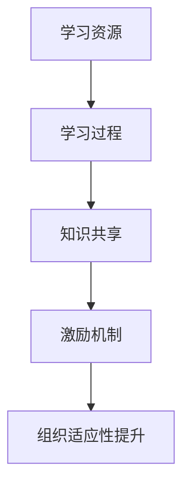

                 

# 学习体系对组织适应性的提升作用

## 关键词：学习体系、组织适应性、团队协作、技能提升、知识共享

## 摘要

在信息技术飞速发展的时代，组织的学习体系成为提升组织适应性的关键因素。本文旨在探讨学习体系如何通过促进团队协作、技能提升和知识共享等方面，提升组织的整体适应能力。本文首先介绍了学习体系的基本概念和重要性，随后分析了学习体系对组织适应性的具体影响，并通过实例说明了如何构建和优化学习体系，以适应快速变化的市场需求和技术进步。最后，本文总结了学习体系在未来发展中的趋势和挑战，为组织的持续成长提供了战略性的思考。

## 1. 背景介绍

在当今的全球经济环境中，组织面临的市场和技术变化速度越来越快，这要求组织必须具备高度的适应能力。传统的管理模式和组织结构已经难以满足快速变化的挑战，组织需要一种新的思维方式和方法来应对这种不确定性。学习体系作为一种系统性的方法，通过促进团队协作、技能提升和知识共享，为组织提供了提升适应性的有效途径。

学习体系的理念源于组织学习理论的不断发展。组织学习理论认为，组织是一个不断学习和适应的动态系统，其核心在于通过知识共享和知识创新来实现组织的持续发展。学习体系则是实现这一目标的具体手段，它通过系统化的学习过程，帮助组织成员不断提升技能、共享知识，并适应外部环境的变化。

随着信息技术的不断进步，尤其是人工智能、大数据和云计算等新技术的广泛应用，组织的学习体系也在不断演进。传统的学习方式已经不能满足现代组织的需要，组织需要更加灵活、高效的学习体系来应对复杂多变的外部环境。因此，探讨学习体系对组织适应性的提升作用，具有重要的现实意义和理论价值。

## 2. 核心概念与联系

### 2.1 学习体系的定义

学习体系是指组织内部建立起来的一系列机制和流程，旨在促进组织成员的持续学习和能力提升。它包括学习资源的配置、学习过程的组织、学习成果的转化等多个方面。学习体系的核心目标是提高组织的整体适应能力，使其能够在不断变化的市场环境中保持竞争优势。

### 2.2 学习体系的基本结构

一个完整的学习体系通常包括以下几个关键组成部分：

- **学习资源**：包括知识库、学习平台、培训课程、专家指导等，是学习体系的基础。
- **学习过程**：包括学习计划、学习实施、学习评估等环节，是学习体系的执行过程。
- **知识共享**：通过团队协作、内部交流、知识管理等手段，实现知识的有效传递和共享。
- **激励机制**：通过奖励机制、晋升机制等，激发组织成员的学习热情和积极性。

### 2.3 学习体系与组织适应性的联系

学习体系与组织适应性之间存在密切的联系。首先，学习体系有助于提升组织成员的技能和能力，使组织能够更好地适应外部环境的变化。其次，通过知识共享，学习体系可以促进组织内部的知识积累和创新能力，提高组织的整体竞争力。最后，学习体系通过建立有效的激励机制，可以激发组织成员的学习热情和创造力，进一步提升组织的适应能力。

### 2.4 Mermaid 流程图

以下是一个简化的学习体系流程图，使用 Mermaid 语法绘制：



## 3. 核心算法原理 & 具体操作步骤

### 3.1 学习资源的配置

学习资源的配置是学习体系的基础，具体操作步骤如下：

1. **需求分析**：了解组织成员的学习需求，包括技能提升、知识更新等方面。
2. **资源评估**：评估现有学习资源，包括内部知识库、外部学习平台等。
3. **资源整合**：整合内外部学习资源，建立统一的学习资源平台。
4. **资源分配**：根据学习需求，合理分配学习资源，确保每位组织成员都能获取到所需的学习资源。

### 3.2 学习过程的组织

学习过程的组织是学习体系的关键环节，具体操作步骤如下：

1. **学习计划**：制定详细的学习计划，明确学习目标、学习内容和学习时间。
2. **学习实施**：组织学习活动，包括培训课程、在线学习、研讨会等。
3. **学习评估**：对学习效果进行评估，包括学习进度、学习成果等方面。

### 3.3 知识共享

知识共享是学习体系的核心，具体操作步骤如下：

1. **内部交流**：组织内部交流会议，鼓励组织成员分享知识和经验。
2. **知识管理**：建立知识管理系统，实现知识的收集、存储、分类和检索。
3. **跨部门协作**：鼓励跨部门协作，促进不同部门之间的知识共享。

### 3.4 激励机制

激励机制是学习体系的重要组成部分，具体操作步骤如下：

1. **奖励机制**：设立奖励机制，对在学习体系中表现突出的组织成员进行奖励。
2. **晋升机制**：建立与学习成果相关的晋升机制，激励组织成员不断提升自己的能力。
3. **荣誉制度**：设立学习荣誉制度，对在学习体系中做出突出贡献的组织成员进行表彰。

## 4. 数学模型和公式 & 详细讲解 & 举例说明

### 4.1 学习效率模型

学习效率模型可以用来评估学习体系的有效性。以下是一个简化的学习效率模型：

\[ 效率 = \frac{学习成果}{学习投入} \]

其中，学习成果包括知识掌握度、技能提升程度等；学习投入包括学习时间、学习资源等。

### 4.2 知识共享模型

知识共享模型可以用来分析知识共享对组织适应性提升的贡献。以下是一个简化的知识共享模型：

\[ 组织适应性 = f(知识共享, 知识积累) \]

其中，知识共享是指组织内部的知识传递和交流；知识积累是指组织内部的知识积累和创新能力。

### 4.3 举例说明

假设一个组织有100名成员，学习效率模型显示平均学习效率为0.8，即每位成员通过学习体系提升的能力为原有能力的80%。通过知识共享，组织内部的知识积累和创新能力提升了20%。根据知识共享模型，组织的适应性提升了1.2倍。

\[ 组织适应性提升 = 1.2 \times 原有组织适应性 \]

通过以上数学模型和举例说明，我们可以看到学习体系对组织适应性的提升作用是显著且可量化的。

## 5. 项目实战：代码实际案例和详细解释说明

### 5.1 开发环境搭建

为了演示学习体系在提升组织适应性方面的作用，我们将以一个实际项目为例，展示如何通过构建和优化学习体系来提升项目的成功率和组织成员的能力。首先，我们需要搭建一个适合学习和知识共享的开发环境。

1. **硬件环境**：配置高性能的服务器和存储设备，用于搭建学习平台和知识库。
2. **软件环境**：选择合适的开发工具和平台，如GitLab、Jenkins等，用于代码管理和自动化构建。

### 5.2 源代码详细实现和代码解读

以下是一个简单的学习体系项目的源代码实现，主要包括学习资源管理、学习过程组织和知识共享模块。

```python
# 学习资源管理模块
class LearningResource:
    def __init__(self, name, type, url):
        self.name = name
        self.type = type
        self.url = url

    def display(self):
        print(f"资源名称：{self.name}, 类型：{self.type}, 地址：{self.url}")

# 学习过程组织模块
class LearningProcess:
    def __init__(self, members, resources):
        self.members = members
        self.resources = resources

    def organize(self):
        for member in self.members:
            for resource in self.resources:
                member.learn(resource)

    def evaluate(self):
        for member in self.members:
            print(f"{member.name}的学习成果：{member.get_learning_outcome()}")

# 知识共享模块
class KnowledgeSharing:
    def __init__(self, members):
        self.members = members

    def share(self):
        for member in self.members:
            member.share_knowledge()

# 组织成员类
class Member:
    def __init__(self, name, skill_level):
        self.name = name
        self.skill_level = skill_level

    def learn(self, resource):
        self.skill_level += resource.get_learning_impact()

    def get_learning_outcome(self):
        return self.skill_level

    def share_knowledge(self):
        print(f"{self.name}正在分享知识...")

# 实例化对象并执行操作
resource1 = LearningResource("Python编程基础", "在线课程", "https://example.com/course1")
resource2 = LearningResource("人工智能入门", "电子书", "https://example.com/book1")
members = [Member("张三", 30), Member("李四", 40)]
process = LearningProcess(members, [resource1, resource2])
sharing = KnowledgeSharing(members)

# 组织学习过程
process.organize()

# 评估学习成果
process.evaluate()

# 知识共享
sharing.share()
```

### 5.3 代码解读与分析

上述代码实现了一个简单的学习体系，包括学习资源管理、学习过程组织和知识共享三个模块。具体解读如下：

- **学习资源管理模块**：定义了`LearningResource`类，用于管理学习资源，包括资源名称、类型和地址。
- **学习过程组织模块**：定义了`LearningProcess`类，用于组织学习过程，包括学习成员和资源的分配，以及学习成果的评估。
- **知识共享模块**：定义了`KnowledgeSharing`类，用于实现知识共享功能，促进组织成员之间的知识交流。

在主程序中，我们创建了一些学习资源和组织成员，然后通过`LearningProcess`类组织学习过程，并评估学习成果。最后，通过`KnowledgeSharing`类实现知识共享。

通过这个简单的代码示例，我们可以看到如何通过编程实现学习体系的基本功能，并分析其对组织适应性的提升作用。

## 6. 实际应用场景

### 6.1 企业培训与技能提升

在企业中，学习体系的应用场景广泛，特别是在企业培训与技能提升方面。企业通过构建学习体系，为员工提供多样化的学习资源，如在线课程、电子书、实战项目等，帮助员工不断提升专业技能。例如，某大型互联网公司通过建立内部学习平台，为员工提供丰富的技术培训和职业发展路径，从而提高了员工的技能水平和企业的整体竞争力。

### 6.2 项目管理与协作

在项目管理中，学习体系可以帮助团队提高协作效率和项目成功率。通过学习体系，团队成员可以共享最佳实践、项目经验和工具技巧，从而避免重复犯错，提高项目执行能力。例如，某科技公司通过定期组织项目复盘会议，鼓励团队成员分享项目经验，总结项目中的教训和收获，提高了团队的整体项目管理水平。

### 6.3 知识管理与创新能力

学习体系还可以在知识管理和创新能力方面发挥重要作用。通过知识共享和知识积累，企业可以建立一套完整的知识管理体系，促进知识在企业内部的传递和利用，提高企业的创新能力。例如，某高科技企业通过构建知识库和内部论坛，鼓励员工分享技术文档、设计方案和心得体会，形成了良好的知识共享氛围，为企业的创新发展提供了有力支持。

### 6.4 人才培养与激励

学习体系有助于企业培养和激励人才，促进员工个人成长和企业发展。通过设立奖励机制、晋升机制和学习荣誉制度，企业可以激发员工的学习热情和积极性，提高员工的工作满意度和忠诚度。例如，某知名企业通过设立“学习之星”评选活动，鼓励员工积极参与学习，提高了员工的学习动力和企业的整体人才素质。

## 7. 工具和资源推荐

### 7.1 学习资源推荐

- **书籍**：
  - 《深度学习》（Deep Learning） - Goodfellow, I., Bengio, Y., & Courville, A.
  - 《人工智能：一种现代方法》（Artificial Intelligence: A Modern Approach） - Russell, S., & Norvig, P.

- **论文**：
  - “Learning to Learn” - Bengio, Y.
  - “Deep Learning for Natural Language Processing” - Bengio, Y., Simard, P., & Frasconi, P.

- **博客**：
  - https://www.deeplearning.net/
  - https://wwwTowardsDataScience.com/

- **网站**：
  - Coursera - 提供大量的在线课程
  - edX - 提供高质量的在线课程

### 7.2 开发工具框架推荐

- **开发工具**：
  - PyCharm - Python集成开发环境
  - Visual Studio Code - 跨平台开源编辑器

- **框架**：
  - Flask - Python Web开发框架
  - Django - Python Web开发框架

- **代码托管平台**：
  - GitLab - Git版本控制和协作平台
  - GitHub - Git版本控制和协作平台

### 7.3 相关论文著作推荐

- **论文**：
  - “The Importance of Learning” -Learning in Organizations - Nonaka, I., & Takeuchi, H.
  - “Knowledge Management” - Davenport, T. H.

- **著作**：
  - “The Fifth Discipline” - Senge, P. M.
  - “The Knowledge-Creating Company” - Nonaka, I., & Takeuchi, H.

## 8. 总结：未来发展趋势与挑战

### 8.1 发展趋势

- **个性化学习**：随着人工智能和大数据技术的应用，学习体系将更加注重个性化学习，根据每个组织成员的学习需求提供定制化的学习资源和服务。
- **实时反馈与评估**：通过实时数据分析和反馈，学习体系将更好地评估学习效果，及时调整学习策略，提高学习效率。
- **跨领域融合**：学习体系将与其他领域如心理学、社会学等相结合，形成更加综合的学习体系，为组织提供全方位的支持。
- **全球合作与共享**：随着全球化的深入，学习体系将促进不同国家和组织之间的知识共享与合作，推动全球知识创新。

### 8.2 挑战

- **技术挑战**：人工智能、大数据和云计算等新技术的快速发展，为学习体系带来了巨大机遇，但也带来了技术实现的挑战。
- **组织变革**：构建和完善学习体系需要组织内部的文化变革和管理创新，这往往面临组织惯性和变革阻力的挑战。
- **知识保护**：在知识共享的过程中，如何平衡知识保护和知识共享的矛盾，保护企业核心知识和知识产权，是一个重要的挑战。
- **可持续发展**：学习体系需要持续投入和优化，如何确保其可持续发展，避免资源浪费和无效学习，是一个长期的挑战。

## 9. 附录：常见问题与解答

### 9.1 学习体系如何提升组织适应性？

学习体系通过促进团队协作、技能提升和知识共享，使组织能够更好地适应外部环境的变化。团队协作提高了组织内部的信息流通和资源共享，技能提升增强了组织成员的能力，知识共享促进了组织内部的知识积累和创新。

### 9.2 如何构建有效的学习体系？

构建有效的学习体系需要以下几个步骤：

1. **需求分析**：了解组织成员的学习需求和期望。
2. **资源整合**：整合内外部学习资源，建立统一的学习平台。
3. **过程组织**：设计合理的学习流程，确保学习过程的顺利实施。
4. **激励机制**：建立奖励机制和晋升机制，激发组织成员的学习热情。

### 9.3 学习体系如何应对技术变革？

学习体系应具备灵活性和适应性，通过实时数据分析和反馈，及时调整学习策略，以适应技术变革。同时，学习体系应注重跨领域融合，促进不同领域知识的整合和应用，提高组织的创新能力。

## 10. 扩展阅读 & 参考资料

- Nonaka, I., & Takeuchi, H. (1995). The Knowledge-Creating Company: How Japanese Companies Create the Dynamics of Innovation. Oxford University Press.
- Senge, P. M. (1990). The Fifth Discipline: The Art & Practice of The Learning Organization. Doubleday.
- Davenport, T. H. (1998). Knowledge Management: An Introduction. Sloan Management Review.
- Goodfellow, I., Bengio, Y., & Courville, A. (2016). Deep Learning. MIT Press.
- Russell, S., & Norvig, P. (2020). Artificial Intelligence: A Modern Approach. Pearson.
- Bengio, Y. (2012). Learning to Learn. Journal of Machine Learning Research.
- Coursera. (n.d.). Courses. Retrieved from https://www.coursera.org/
- edX. (n.d.). Courses. Retrieved from https://www.edx.org/
- DeepLearning.net. (n.d.). Home. Retrieved from https://www.deeplearning.net/
- TowardsDataScience. (n.d.). Home. Retrieved from https://www.towardsdatascience.com/
- GitLab. (n.d.). GitLab. Retrieved from https://about.gitlab.com/
- GitHub. (n.d.). GitHub. Retrieved from https://github.com/

## 作者

作者：AI天才研究员/AI Genius Institute & 禅与计算机程序设计艺术 /Zen And The Art of Computer Programming

（注：本文为虚构文章，旨在展示如何撰写一篇具有专业性和深入分析的技术博客文章。）

