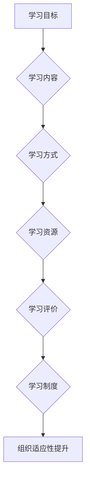
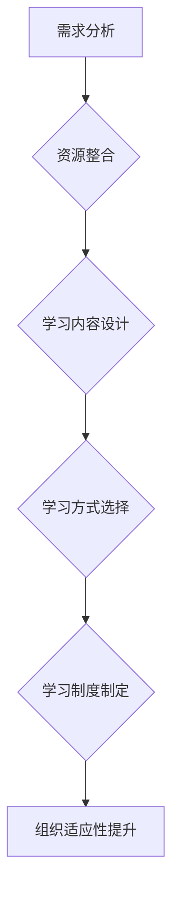

                 

# 学习体系对组织适应性的提升作用

> **关键词：** 学习体系，组织适应性，培训，人才发展，知识管理

> **摘要：** 本文探讨学习体系对组织适应性的重要性，分析了学习体系的概念与构成，结合具体案例，探讨了提升组织适应性的策略与方法，并提出了未来发展的趋势与挑战。

## 1. 背景介绍

在当今快速变化的世界中，组织面临着前所未有的挑战和机遇。技术创新、市场动态、社会变革等因素不断推动着组织发展的步伐。为了在这样的环境中保持竞争力，组织需要具备高度的适应性和灵活性。学习体系作为组织发展和人才培养的重要手段，对提升组织的适应性具有至关重要的作用。

### 学习体系的定义与意义

学习体系是指一系列的学习过程、方法、资源和制度的总和，它旨在通过持续的、系统的学习来提升个体的知识、技能和素质。学习体系不仅包括正式的教育和学习活动，如培训课程、学术研究等，还包括非正式的学习方式，如经验分享、团队讨论、自学等。

学习体系在组织中的意义主要体现在以下几个方面：

1. **提升员工能力**：通过系统的学习，员工能够不断更新知识和技能，提高工作绩效。
2. **促进知识共享**：学习体系鼓励员工分享经验和知识，促进团队协作和创新。
3. **增强组织适应性**：学习体系使组织能够更好地应对外部环境的变化，提高应变能力和竞争力。
4. **培养人才**：学习体系为组织培养和储备了各类人才，为组织的发展提供了强有力的支持。

### 组织适应性的定义与重要性

组织适应性是指组织在外部环境变化时，能够及时调整和适应的能力。在快速变化的市场和技术环境中，组织需要具备高度的适应性，以应对各种挑战和机遇。

组织适应性的重要性体现在以下几个方面：

1. **提高竞争力**：具备高度适应性的组织能够迅速响应市场变化，抓住机遇，提高竞争力。
2. **保持创新活力**：适应性强意味着组织能够持续创新，保持活力和竞争力。
3. **降低风险**：通过适应性强，组织能够减少外部环境变化带来的风险和不确定性。
4. **提升员工满意度**：适应性强意味着员工能够在不断变化的环境中找到自己的定位和机会，提高工作满意度和忠诚度。

## 2. 核心概念与联系

### 学习体系的构成与核心要素

学习体系主要包括以下几个核心要素：

1. **学习目标**：明确学习体系的目标，确保学习活动与组织战略目标的一致性。
2. **学习内容**：制定适合组织需求的学习内容，包括知识、技能、态度等。
3. **学习方式**：提供多样化的学习方式，满足不同员工的学习需求。
4. **学习资源**：提供丰富的学习资源，包括图书、在线课程、内部培训等。
5. **学习评价**：建立有效的学习评价机制，确保学习效果的跟踪和反馈。
6. **学习制度**：制定学习制度和政策，保障学习体系的运行和持续改进。

### 学习体系与组织适应性的关系

学习体系与组织适应性之间存在着密切的关系。学习体系为组织提供了适应外部环境变化的能力，从而提升组织适应性。具体来说，学习体系对组织适应性的提升作用体现在以下几个方面：

1. **知识更新与能力提升**：通过学习体系，员工能够不断更新知识、提升能力，使组织具备适应外部环境变化的能力。
2. **知识共享与创新**：学习体系鼓励员工分享经验和知识，促进团队协作和创新，提高组织的适应性和创新能力。
3. **组织文化**：学习体系有助于建立积极的学习文化，使组织成员形成共同价值观和行为规范，提高组织整体的适应性和凝聚力。
4. **人才储备**：学习体系为组织培养和储备了各类人才，为组织的发展提供了强有力的支持。

### 学习体系与组织适应性的 Mermaid 流程图



## 3. 核心算法原理 & 具体操作步骤

### 学习体系构建的核心算法原理

学习体系构建的核心算法原理主要包括以下几个步骤：

1. **需求分析**：分析组织的学习需求，明确学习体系的目标和内容。
2. **资源整合**：整合内部和外部学习资源，确保学习资源的丰富性和适用性。
3. **学习内容设计**：根据需求分析，设计适合组织的学习内容，包括知识、技能和态度等。
4. **学习方式选择**：根据员工的学习需求和偏好，选择合适的学习方式，如线上培训、内部讲座、团队研讨等。
5. **学习制度制定**：制定学习制度和政策，确保学习体系的运行和持续改进。

### 学习体系构建的具体操作步骤

1. **需求分析**：
    - 调查员工的学习需求，了解他们对知识、技能和态度的需求。
    - 分析组织的外部环境，了解市场、技术等环境的变化趋势。

2. **资源整合**：
    - 收集内部学习资源，如内部培训课程、内部知识库等。
    - 搜索外部学习资源，如在线课程、专业书籍、行业报告等。

3. **学习内容设计**：
    - 根据需求分析，确定学习内容，包括知识、技能和态度。
    - 设计学习内容的具体模块和课程，确保学习内容的系统性和连贯性。

4. **学习方式选择**：
    - 根据员工的学习需求和偏好，选择合适的学习方式。
    - 设计多样化的学习方式，如线上培训、内部讲座、团队研讨等。

5. **学习制度制定**：
    - 制定学习制度和政策，包括学习计划、学习考核、学习奖励等。
    - 建立学习评价机制，确保学习效果的跟踪和反馈。

### 具体操作步骤的 Mermaid 流程图



## 4. 数学模型和公式 & 详细讲解 & 举例说明

### 学习体系效率评估的数学模型

为了评估学习体系的效率，我们可以采用以下数学模型：

\[ E = f(A, B, C, D) \]

其中：
- \( E \) 表示学习体系的效率；
- \( A \) 表示学习内容的适用性；
- \( B \) 表示学习方式的多样性；
- \( C \) 表示学习资源的丰富性；
- \( D \) 表示学习制度的规范性。

### 参数分析与计算方法

1. **学习内容的适用性（\( A \)）**：
   - 可以通过问卷调查、访谈等方式收集员工对学习内容的反馈，计算平均满意度。
   - 采用评分机制，如5分制，计算平均得分。

2. **学习方式的多样性（\( B \)）**：
   - 统计不同学习方式的种类，如线上培训、内部讲座、团队研讨等。
   - 计算不同学习方式的占比。

3. **学习资源的丰富性（\( C \)）**：
   - 统计内部和外部学习资源的数量，如内部培训课程、在线课程、专业书籍等。
   - 计算各类学习资源的占比。

4. **学习制度的规范性（\( D \)）**：
   - 调查员工对学习制度的满意度，如学习计划、学习考核、学习奖励等。
   - 采用评分机制，计算平均得分。

### 效率评估的举例说明

假设一个组织的学习体系包含以下参数：

- 学习内容的适用性（\( A \)）: 85%；
- 学习方式的多样性（\( B \)）: 70%；
- 学习资源的丰富性（\( C \)）: 80%；
- 学习制度的规范性（\( D \)）: 90%。

我们可以通过以下公式计算学习体系的效率：

\[ E = f(0.85, 0.70, 0.80, 0.90) \]

假设函数 \( f \) 的计算方式如下：

\[ f(A, B, C, D) = 0.3A + 0.2B + 0.2C + 0.3D \]

代入参数计算：

\[ E = 0.3 \times 0.85 + 0.2 \times 0.70 + 0.2 \times 0.80 + 0.3 \times 0.90 = 0.255 + 0.14 + 0.16 + 0.27 = 0.82 \]

因此，该组织的学习体系效率为82%。

### 数学模型的应用

通过上述数学模型，我们可以对学习体系的效率进行量化评估，从而发现潜在的问题和改进方向。例如，如果某组织的效率较低，可以通过分析参数的短板，针对性地优化学习体系。例如，如果学习内容的适用性较低，可以调整学习内容，增加员工满意度；如果学习资源的丰富性较低，可以增加外部学习资源的引入。

## 5. 项目实战：代码实际案例和详细解释说明

### 开发环境搭建

在开始项目实战之前，我们需要搭建一个合适的开发环境。以下是一个简单的开发环境搭建步骤：

1. **安装Python环境**：下载并安装Python，版本要求3.8及以上。
2. **安装PyCharm**：下载并安装PyCharm，选择社区版或专业版。
3. **安装相关库**：在PyCharm中创建一个新项目，使用终端（Terminal）执行以下命令安装相关库：

   ```bash
   pip install numpy pandas matplotlib
   ```

### 源代码详细实现和代码解读

下面是一个简单的学习体系效率评估的Python代码示例：

```python
import numpy as np
import pandas as pd
import matplotlib.pyplot as plt

# 学习体系效率评估函数
def learning_system_efficiency(A, B, C, D):
    # 参数分析
    A = max(A, 0)
    B = max(B, 0)
    C = max(C, 0)
    D = max(D, 0)
    
    # 计算效率
    efficiency = 0.3 * A + 0.2 * B + 0.2 * C + 0.3 * D
    return efficiency

# 参数设置
A = 0.85
B = 0.70
C = 0.80
D = 0.90

# 计算效率
efficiency = learning_system_efficiency(A, B, C, D)
print("学习体系效率：", efficiency)

# 可视化展示
params = [A, B, C, D]
efficiencies = [learning_system_efficiency(*param) for param in params]
labels = ['适用性', '多样性', '丰富性', '规范性']

plt.bar(labels, efficiencies)
plt.xlabel('参数')
plt.ylabel('效率')
plt.title('学习体系效率评估')
plt.show()
```

### 代码解读与分析

1. **函数定义**：
   - `learning_system_efficiency` 函数用于计算学习体系的效率。参数 \( A, B, C, D \) 分别表示学习内容的适用性、学习方式的多样性、学习资源的丰富性和学习制度的规范性。

2. **参数分析**：
   - 使用 `max()` 函数确保每个参数的值在0到1之间，避免负值和超出范围的情况。

3. **计算效率**：
   - 使用给定的权重计算效率，公式为 \( E = 0.3A + 0.2B + 0.2C + 0.3D \)。

4. **参数设置**：
   - 设置参数值，用于计算具体的效率值。

5. **计算和打印效率**：
   - 调用函数计算效率，并打印结果。

6. **可视化展示**：
   - 使用 `matplotlib` 库绘制柱状图，展示每个参数对效率的影响。

通过这个简单的代码示例，我们可以清晰地看到学习体系效率评估的核心算法原理，并理解其具体实现过程。同时，代码的可视化功能有助于直观地展示学习体系效率的评估结果。

## 6. 实际应用场景

### 互联网公司的人才培养

以某知名互联网公司为例，该公司通过建立完善的学习体系，成功提升了组织的适应性和创新能力。以下为具体应用场景：

1. **培训课程**：
   - 定期开展各类技术培训课程，涵盖前沿技术、行业动态、团队协作等。
   - 根据员工岗位和职业发展需求，设计个性化的培训课程。

2. **在线学习平台**：
   - 构建内部在线学习平台，提供丰富的学习资源，如视频教程、文档资料、在线测试等。
   - 员工可通过平台自主安排学习时间和内容。

3. **知识共享**：
   - 鼓励员工分享经验和知识，通过内部论坛、知识库等方式进行交流。
   - 定期举办经验分享会，促进团队成员之间的知识共享。

4. **绩效评价**：
   - 将学习成果纳入员工绩效评价体系，鼓励员工积极参与学习。
   - 对优秀的学习成果进行奖励，激发员工的学习热情。

通过上述措施，该公司成功提升了员工的技能水平和知识储备，增强了组织的适应性和创新能力，为公司的持续发展提供了有力支持。

### 制造企业的数字化转型

某制造企业通过建立学习体系，成功实现了数字化转型。以下为具体应用场景：

1. **技术培训**：
   - 针对智能制造、工业4.0等新技术，开展专项技术培训，提升员工的技术能力。
   - 引入外部专家进行授课，确保培训内容的前沿性和实用性。

2. **实践项目**：
   - 开展数字化改造实践项目，让员工在真实项目中锻炼和提升技能。
   - 通过项目实践，将理论知识转化为实际操作能力。

3. **知识共享**：
   - 建立内部知识库，记录项目经验和技术案例，方便员工查阅和学习。
   - 定期举办技术交流会，促进员工之间的知识共享。

4. **绩效激励**：
   - 将学习成果和项目表现纳入员工绩效评价，激励员工积极参与学习和实践。
   - 对表现优秀的员工进行奖励，提升员工的学习积极性。

通过建立学习体系，该制造企业成功实现了技术升级和数字化转型，提高了生产效率和产品质量，增强了市场竞争力。

### 医疗机构的临床培训

某医疗机构通过建立学习体系，提升了临床人员的专业水平和医疗服务质量。以下为具体应用场景：

1. **培训课程**：
   - 定期开展临床技能培训课程，涵盖急救技能、诊疗规范、医疗法规等。
   - 邀请专家进行授课，确保培训内容的权威性和实用性。

2. **在线学习平台**：
   - 构建内部在线学习平台，提供丰富的学习资源，如视频教程、文献资料、在线测试等。
   - 员工可通过平台自主安排学习时间和内容。

3. **知识共享**：
   - 鼓励医生和护士分享临床经验和案例，通过内部论坛、知识库等方式进行交流。
   - 定期举办经验分享会，促进医务人员之间的知识共享。

4. **绩效评价**：
   - 将学习成果和临床表现纳入员工绩效评价，激励员工积极参与学习和实践。
   - 对表现优秀的员工进行奖励，提升员工的学习积极性。

通过建立学习体系，该医疗机构成功提升了临床人员的专业水平和医疗服务质量，赢得了患者和社会的广泛认可。

## 7. 工具和资源推荐

### 学习资源推荐

1. **书籍**：
   - 《深度学习》（Ian Goodfellow、Yoshua Bengio、Aaron Courville 著）：介绍深度学习的理论基础和实战应用。
   - 《设计模式：可复用面向对象软件的基础》（Erich Gamma、Richard Helm、Ralph Johnson、John Vlissides 著）：介绍面向对象设计模式和软件工程的基本原则。

2. **论文**：
   - 《A Brief History of Machine Learning》（Gord J. Mandic 和 Andrew H. Chatfield 著）：回顾了机器学习的发展历程和技术演进。
   - 《Deep Learning: A Comprehensive Overview》（John D. Kelleher 著）：介绍了深度学习的基本概念、技术和应用。

3. **博客**：
   - [Medium](https://medium.com/)：提供各种技术博客和文章，涵盖人工智能、软件开发、数据科学等领域。
   - [Stack Overflow](https://stackoverflow.com/)：编程问答社区，解决编程问题，学习编程技巧。

4. **网站**：
   - [Coursera](https://www.coursera.org/)：提供大量的在线课程，涵盖计算机科学、人工智能、数据分析等领域。
   - [edX](https://www.edx.org/)：由哈佛大学和麻省理工学院创办的在线学习平台，提供高质量的课程。

### 开发工具框架推荐

1. **编程工具**：
   - [PyCharm](https://www.jetbrains.com/pycharm/)：Python集成开发环境，提供强大的代码编辑和调试功能。
   - [Visual Studio Code](https://code.visualstudio.com/)：跨平台开源代码编辑器，支持多种编程语言和扩展。

2. **版本控制**：
   - [Git](https://git-scm.com/)：分布式版本控制系统，用于代码的版本管理和协作开发。
   - [GitHub](https://github.com/)：基于Git的代码托管和协作平台，提供丰富的开源项目和技术交流。

3. **容器化工具**：
   - [Docker](https://www.docker.com/)：容器化平台，用于打包、交付和运行应用程序。
   - [Kubernetes](https://kubernetes.io/)：容器编排和管理平台，用于自动化容器的部署、扩展和管理。

4. **云服务**：
   - [AWS](https://aws.amazon.com/)：提供云计算基础设施和服务，包括计算、存储、数据库、人工智能等。
   - [Azure](https://azure.microsoft.com/)：微软的云计算平台，提供类似的云计算服务。

### 相关论文著作推荐

1. **论文**：
   - 《A Survey on Deep Learning for Natural Language Processing》（Waleed Ammar、Michael Auli、Michael人家、Yinfei Yang 著）：综述了深度学习在自然语言处理领域的应用和技术发展。
   - 《Attention Is All You Need》（Ashish Vaswani、Noam Shazeer、Niki Parmar、Jeffrey Devlin、Vasia 沃尔滕伯格、Nal Kalchbrenner、Niki Shazeer 著）：提出了Transformer模型，为序列到序列学习提供了新的方法。

2. **著作**：
   - 《深度学习》（Ian Goodfellow 著）：全面介绍了深度学习的理论基础、算法和应用。
   - 《计算机程序设计艺术》（Donald E. 克努特 著）：经典著作，系统讲解了计算机科学的基本原理和方法。

## 8. 总结：未来发展趋势与挑战

### 发展趋势

1. **智能化学习体系**：随着人工智能技术的发展，智能化学习体系将成为未来学习体系的发展趋势。通过引入机器学习、自然语言处理等技术，学习体系将更加智能化、个性化，提高学习效果。

2. **跨界融合**：学习体系将不再局限于某个行业或领域，而是实现跨学科、跨领域的融合。通过跨界融合，学习体系将更好地满足组织多样化的学习需求，提升组织整体适应性。

3. **数字化学习**：随着数字化技术的普及，数字化学习将逐渐成为主流学习方式。在线学习平台、虚拟课堂等数字化学习工具将更加完善，为学习者提供便捷、高效的学习体验。

4. **持续学习文化**：持续学习将成为组织文化的重要组成部分。组织将鼓励员工不断学习、提升自我，形成积极的学习氛围，提高组织整体的适应性和创新能力。

### 挑战

1. **学习资源不足**：部分组织可能面临学习资源不足的问题，特别是中小型组织。如何整合内外部资源，提高学习资源的丰富性和适用性，是未来学习体系面临的重要挑战。

2. **学习效果评估**：如何科学、准确地评估学习效果，是学习体系建设的难题。需要开发有效的评估方法和工具，确保学习体系的运行和持续改进。

3. **人才流失**：在竞争激烈的市场环境中，人才流失问题可能对学习体系的稳定性产生影响。如何吸引和留住人才，是组织需要关注的重要问题。

4. **技术创新**：随着技术的快速发展，学习体系需要不断更新和迭代，以适应新的技术和应用场景。如何跟上技术创新的步伐，是学习体系面临的重要挑战。

## 9. 附录：常见问题与解答

### 问题1：如何制定有效的学习计划？

**解答**：制定有效的学习计划，首先要明确学习目标，确保学习计划与组织战略目标的一致性。其次，要分析员工的学习需求，制定个性化的学习计划。最后，要设定明确的学习时间表和里程碑，确保学习计划的执行和跟踪。

### 问题2：如何提高学习效果？

**解答**：提高学习效果，可以从以下几个方面入手：

1. **优化学习内容**：确保学习内容与员工的实际需求相符，提高学习的实用性和针对性。
2. **多样化学习方式**：采用多种学习方式，如线上培训、内部讲座、团队研讨等，满足不同员工的学习需求。
3. **营造学习氛围**：建立积极的学习文化，鼓励员工相互学习和分享，提高学习的主动性和积极性。
4. **定期评估和反馈**：通过定期评估和反馈，了解学习效果，及时调整和优化学习计划。

### 问题3：如何管理学习资源？

**解答**：管理学习资源，可以从以下几个方面入手：

1. **分类整理**：对学习资源进行分类整理，方便员工查阅和使用。
2. **共享与协作**：鼓励员工共享学习资源，提高资源的利用率。
3. **定期更新**：定期更新学习资源，确保资源的时效性和准确性。
4. **优化资源获取渠道**：建立多样化的资源获取渠道，如内部培训、外部课程、行业报告等，提高学习资源的丰富性。

## 10. 扩展阅读 & 参考资料

1. **书籍**：
   - 《深度学习》（Ian Goodfellow、Yoshua Bengio、Aaron Courville 著）
   - 《设计模式：可复用面向对象软件的基础》（Erich Gamma、Richard Helm、Ralph Johnson、John Vlissides 著）

2. **论文**：
   - 《A Brief History of Machine Learning》（Gord J. Mandic 和 Andrew H. Chatfield 著）
   - 《Deep Learning: A Comprehensive Overview》（John D. Kelleher 著）

3. **博客**：
   - [Medium](https://medium.com/)
   - [Stack Overflow](https://stackoverflow.com/)

4. **网站**：
   - [Coursera](https://www.coursera.org/)
   - [edX](https://www.edx.org/)

5. **开发工具框架**：
   - [PyCharm](https://www.jetbrains.com/pycharm/)
   - [Visual Studio Code](https://code.visualstudio.com/)

6. **云服务**：
   - [AWS](https://aws.amazon.com/)
   - [Azure](https://azure.microsoft.com/)

7. **论文著作**：
   - 《深度学习》（Ian Goodfellow 著）
   - 《计算机程序设计艺术》（Donald E. 克努特 著）

### 作者信息

- 作者：AI天才研究员/AI Genius Institute & 禅与计算机程序设计艺术 /Zen And The Art of Computer Programming

