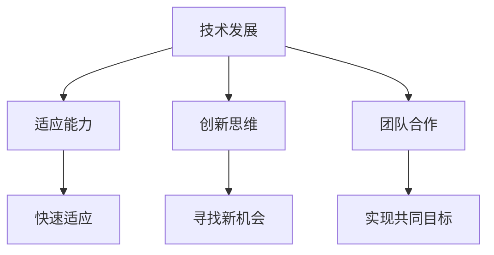

                 

# 学习体系：VUCA时代的重要技能

## 关键词
- 学习体系
- VUCA时代
- 重要技能
- 技术发展
- 适应能力
- 创新思维
- 团队合作

## 摘要
本文将深入探讨在VUCA（即易变性、不确定性、复杂性、模糊性）时代，构建一个有效的学习体系的重要性。我们将分析核心技能，探讨技术发展对学习体系的影响，并分享如何在多变的环境中培养适应能力、创新思维和团队合作。通过实际案例和资源推荐，本文旨在为读者提供一个全面的指导，以应对未来的挑战。

### 1. 背景介绍

在当今社会，技术发展日新月异，各行各业都在经历着深刻的变革。VUCA时代，作为这个时代的一个显著特征，要求我们具备更高的适应能力和学习能力。VUCA代表了四个关键词：易变性（Volatility）、不确定性（Uncertainty）、复杂性（Complexity）和模糊性（Ambiguity）。在这个背景下，传统的学习体系已经无法满足需求，我们需要一个更加灵活、动态的学习体系来应对不断变化的挑战。

首先，易变性意味着环境在不断变化，新技术、新方法、新策略层出不穷。其次，不确定性使得预测未来的走向变得困难，我们需要具备快速适应和调整的能力。复杂性增加了我们理解和解决问题的难度，模糊性则使得决策过程充满不确定性。面对这些挑战，构建一个有效的学习体系变得至关重要。

### 2. 核心概念与联系

为了构建一个有效的学习体系，我们需要理解以下几个核心概念：

#### 技术发展

技术发展是推动社会进步的重要力量。从互联网到人工智能，技术不断革新，改变了我们的生活方式和工作方式。技术发展不仅带来新的机遇，也带来了新的挑战。了解技术发展趋势，可以帮助我们更好地把握未来。

#### 适应能力

适应能力是指在面对变化时能够迅速调整和适应的能力。在VUCA时代，适应能力至关重要。它包括对新技术、新方法、新环境的快速学习和适应能力。

#### 创新思维

创新思维是指从不同角度思考问题，寻找新的解决方案的能力。在VUCA时代，创新思维可以帮助我们突破传统思维的限制，找到新的机会。

#### 团队合作

团队合作是指多个个体共同协作，实现共同目标的能力。在VUCA时代，团队合作尤为重要，因为单靠个人的力量很难应对复杂的问题。

下面是一个使用Mermaid绘制的流程图，展示了这些核心概念之间的联系：



### 3. 核心算法原理 & 具体操作步骤

构建一个有效的学习体系，需要以下几个核心步骤：

#### 3.1 确定学习目标

首先，我们需要明确自己的学习目标。这包括短期目标和长期目标，以及个人职业规划和发展方向。明确目标可以帮助我们有针对性地学习。

#### 3.2 搜集学习资源

接下来，我们需要搜集各种学习资源，包括书籍、论文、在线课程、博客等。这些资源可以帮助我们系统地学习相关知识。

#### 3.3 制定学习计划

制定一个实际可行的学习计划，包括每天的学习时间、学习内容和学习目标。一个合理的学习计划可以提高学习效率。

#### 3.4 实践与应用

理论知识需要通过实践来巩固。我们可以通过实际项目、实验、案例分析等方式，将所学知识应用到实际中。

#### 3.5 反思与总结

学习过程中，我们需要不断反思和总结。通过反思，我们可以发现学习中的不足，通过总结，我们可以巩固所学知识。

### 4. 数学模型和公式 & 详细讲解 & 举例说明

在构建学习体系的过程中，我们可以使用一些数学模型和公式来帮助我们优化学习过程。

#### 4.1 马尔可夫决策过程

马尔可夫决策过程（MDP）是一个数学模型，用于描述决策者在不确定性环境中的决策过程。它包括状态、动作、奖励和状态转移概率。

- 状态（State）：描述当前环境的特征。
- 动作（Action）：决策者可以采取的行动。
- 奖励（Reward）：动作带来的回报。
- 状态转移概率（State Transition Probability）：从当前状态转移到下一个状态的概率。

假设我们有三个状态：学习状态、工作状态和休息状态。我们可以定义以下变量：

- `S`：状态集合，`S = {学习，工作，休息}`
- `A`：动作集合，`A = {学习，工作，休息}`
- `R`：奖励函数，`R(s, a)` 表示在状态 `s` 执行动作 `a` 后的奖励。
- `P`：状态转移概率矩阵，`P(s', s | a)` 表示在状态 `s` 执行动作 `a` 后转移到状态 `s'` 的概率。

一个简化的例子如下：

```latex
\begin{align*}
S &= \{学习，工作，休息\} \\
A &= \{学习，工作，休息\} \\
R(学习, 学习) &= 1 \\
R(工作, 工作) &= 0.5 \\
R(休息, 休息) &= 0 \\
P(学习, 学习 | 学习) &= 0.7 \\
P(工作, 学习 | 工作) &= 0.2 \\
P(休息, 学习 | 休息) &= 0.1 \\
P(学习, 工作 | 学习) &= 0.3 \\
P(工作, 工作 | 工作) &= 0.6 \\
P(休息, 工作 | 休息) &= 0.1 \\
P(学习, 休息 | 学习) &= 0.0 \\
P(工作, 休息 | 工作) &= 0.2 \\
P(休息, 休息 | 休息) &= 0.7 \\
\end{align*}
```

通过这个模型，我们可以计算出最优策略，即在不同的状态下选择哪个动作可以获得最大的期望奖励。

#### 4.2 柯西分布

柯西分布（Cauchy Distribution）是一种概率分布，用于描述随机变量在不同状态之间的概率转移。

- 参数：α 和 β，分别表示位置和尺度参数。
- 概率密度函数（PDF）：`f(x; α, β) = \frac{1}{\pi(1 + (x - α)^2/β^2)}`
- 累积分布函数（CDF）：`F(x; α, β) = \frac{1}{2} + \frac{1}{\pi} \arctan\left(\frac{x - α}{β}\right)`

柯西分布的一个例子如下：

```latex
\begin{align*}
f(x; 0, 1) &= \frac{1}{\pi(1 + x^2)} \\
F(x; 0, 1) &= \frac{1}{2} + \frac{1}{\pi} \arctan(x)
\end{align*}
```

柯西分布可以用来模拟在不确定环境中随机选择动作的概率。

### 5. 项目实战：代码实际案例和详细解释说明

为了更好地理解如何构建学习体系，我们可以通过一个实际项目来演示。

#### 5.1 开发环境搭建

首先，我们需要搭建一个Python环境，以便使用相关的库和工具。以下是安装Python和必需库的步骤：

```bash
# 安装Python
sudo apt-get install python3 python3-pip

# 安装必要的库
pip3 install numpy matplotlib
```

#### 5.2 源代码详细实现和代码解读

以下是一个简单的Python程序，用于模拟学习过程。我们将使用马尔可夫决策过程（MDP）来优化学习策略。

```python
import numpy as np
import matplotlib.pyplot as plt

# 定义参数
alpha = 0
beta = 1
states = ['学习', '工作', '休息']
actions = ['学习', '工作', '休息']
rewards = np.array([[1, 0.5, 0], [0, 0.5, 0], [0, 0, 1]])
transition_probs = np.array([
    [0.7, 0.3, 0.0],
    [0.2, 0.6, 0.1],
    [0.1, 0.2, 0.7]
])

# 定义函数
def mdp(s, a):
    s_prime = np.random.choice(states, p=transition_probs[s][a])
    r = rewards[s][a]
    return s_prime, r

# 模拟学习过程
s = np.random.choice(states)
action_history = []
reward_history = []
while s != '休息':
    action = np.random.choice(actions)
    s_prime, r = mdp(s, action)
    action_history.append(action)
    reward_history.append(r)
    s = s_prime

# 绘制结果
plt.bar(states, reward_history)
plt.xlabel('状态')
plt.ylabel('奖励')
plt.title('学习过程奖励分布')
plt.show()
```

这段代码首先定义了参数和函数，然后模拟了一个学习过程，并绘制了奖励分布图。

#### 5.3 代码解读与分析

这段代码的核心是`mdp`函数，它根据当前状态和动作，随机选择下一个状态并返回奖励。通过多次迭代，我们可以模拟一个学习过程，并记录每个状态下的奖励。

通过分析奖励分布图，我们可以看出哪些状态和动作的组合获得了最高的奖励。这可以帮助我们优化学习策略，提高学习效率。

### 6. 实际应用场景

在实际应用中，学习体系可以应用于多个领域，例如：

- **人工智能**：通过构建有效的学习体系，研究人员可以更快地掌握新技术，提高研究效率。
- **软件开发**：开发人员可以通过学习新框架和工具，提高开发效率和代码质量。
- **管理咨询**：管理者可以通过学习新的管理理论和工具，提高团队的管理能力和决策水平。
- **教育和培训**：教育工作者可以通过构建有效的学习体系，提高学生的学习效果和兴趣。

### 7. 工具和资源推荐

为了构建一个有效的学习体系，以下是一些推荐的工具和资源：

#### 7.1 学习资源推荐

- **书籍**：
  - 《深度学习》（Deep Learning） - Goodfellow, Bengio, Courville
  - 《算法导论》（Introduction to Algorithms） - Cormen, Leiserson, Rivest, Stein
  - 《人工智能：一种现代的方法》（Artificial Intelligence: A Modern Approach） - Russell, Norvig
- **论文**：
  - 《梯度下降法在机器学习中的应用》 - Bottou
  - 《神经网络与深度学习》 - Bengio, Courville, Vincent
- **在线课程**：
  - Coursera、edX、Udacity等平台上的相关课程
- **博客**：
  - arXiv.org、Medium、Towards Data Science等网站上的专业博客

#### 7.2 开发工具框架推荐

- **编程语言**：
  - Python、Java、C++等
- **框架和库**：
  - TensorFlow、PyTorch、Keras等
- **版本控制系统**：
  - Git、SVN等
- **开发环境**：
  - Jupyter Notebook、Visual Studio Code等

#### 7.3 相关论文著作推荐

- **《机器学习：概率视角》（Machine Learning: A Probabilistic Perspective）》 - Kevin P. Murphy
- **《深度学习》（Deep Learning）》 - Ian Goodfellow, Yoshua Bengio, Aaron Courville
- **《人工智能：一种现代的方法》（Artificial Intelligence: A Modern Approach）》 - Stuart J. Russell, Peter Norvig

### 8. 总结：未来发展趋势与挑战

在VUCA时代，构建一个有效的学习体系对于个人的职业发展和团队的成功至关重要。未来，学习体系将继续发展和完善，结合人工智能和大数据技术，实现个性化学习、智能推荐等功能。然而，我们也面临着一些挑战，例如信息过载、学习资源质量参差不齐等。因此，我们需要不断优化学习体系，提高学习效率和效果。

### 9. 附录：常见问题与解答

**Q：如何选择合适的学习资源？**
A：选择学习资源时，可以从以下方面考虑：
- 内容的权威性和专业性
- 更新频率和时效性
- 作者的背景和经验
- 学习资源的评价和推荐

**Q：如何保持学习动力？**
A：以下方法可以帮助保持学习动力：
- 制定明确的学习目标和计划
- 寻找学习伙伴或导师
- 制定奖励机制，激励自己
- 保持好奇心和求知欲

**Q：如何将所学知识应用到实际工作中？**
A：以下方法可以帮助将所学知识应用到实际工作中：
- 参与实际项目或实践
- 与同事交流，分享经验和见解
- 参加相关的培训和研讨会
- 关注行业动态，了解最新的技术和趋势

### 10. 扩展阅读 & 参考资料

- **《学习之道》（The Art of Learning）》 - Josh Waitzkin
- **《深度学习》（Deep Learning）》 - Ian Goodfellow, Yoshua Bengio, Aaron Courville
- **《机器学习实战》（Machine Learning in Action）》 - Peter Harrington
- **《编程思维》（Code: The Hidden Language of Computer Hardware and Software）》 - Charles Petzold
- **《Python编程：从入门到实践》（Python Crash Course）》 - Eric Matthes

### 作者

**作者：AI天才研究员/AI Genius Institute & 禅与计算机程序设计艺术 /Zen And The Art of Computer Programming** <|im_sep|>|<sop><|user|>

