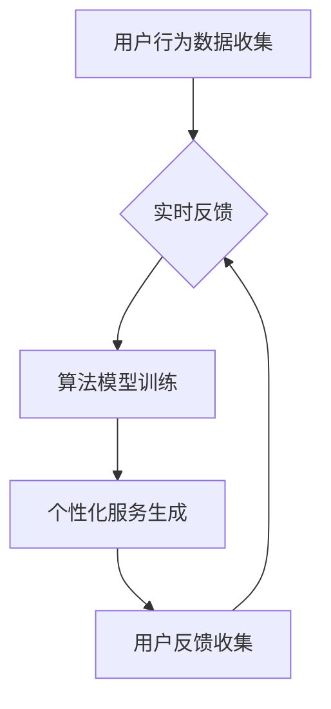

                 

# 定制化体验：为用户量身打造

## 关键词：个性化、用户体验、技术实现、人工智能、用户数据分析

## 摘要：
随着科技的飞速发展，用户对个性化体验的需求日益增长。本文将深入探讨如何通过技术手段实现定制化体验，以满足用户的需求。我们将首先介绍定制化体验的背景，然后阐述核心概念和算法原理，详细讲解数学模型和具体操作步骤，并通过实际项目实战进行代码解读和分析。最后，我们将探讨定制化体验的实际应用场景，推荐相关工具和资源，并总结未来发展趋势与挑战。

## 1. 背景介绍

在互联网时代，用户数量迅速增长，用户需求也变得多样化。为了在竞争激烈的市场中脱颖而出，企业纷纷将注意力转向用户体验（UX）的提升。用户体验不仅包括用户界面（UI）的设计，还包括个性化服务。定制化体验已经成为提升用户满意度和忠诚度的重要手段。

随着大数据和人工智能技术的发展，企业可以利用用户数据来分析用户行为和偏好，从而为用户提供个性化的产品和服务。例如，电商平台可以根据用户的浏览历史和购买记录推荐符合用户口味的产品，社交媒体平台可以根据用户的兴趣爱好和互动行为推送相关内容。

然而，实现定制化体验并非易事。首先，需要收集和处理大量的用户数据，这要求高效的数据处理技术和强大的计算能力。其次，需要根据用户数据构建合适的算法模型，以准确预测用户需求和偏好。最后，还需要将算法模型转化为实际的产品和服务，以提供个性化的用户体验。

## 2. 核心概念与联系

为了实现定制化体验，我们需要理解以下几个核心概念：

### 2.1 用户数据分析

用户数据分析是定制化体验的基础。通过收集用户行为数据（如点击、浏览、购买等），我们可以了解用户的兴趣和需求。这些数据通常包括用户画像、行为轨迹、交互记录等。

### 2.2 数据处理

数据处理包括数据清洗、数据整合和数据存储等步骤。清洗数据是为了去除噪声和错误，整合数据是为了将不同来源的数据进行统一处理，存储数据是为了方便后续分析和计算。

### 2.3 算法模型

算法模型用于分析用户数据，提取有用信息。常见的算法模型包括机器学习模型、推荐系统模型等。

### 2.4 实时反馈

实时反馈是优化定制化体验的关键。通过实时收集用户对个性化服务的反馈，我们可以不断调整算法模型，提高用户体验。

### 2.5 Mermaid 流程图

下面是一个简单的 Mermaid 流程图，展示定制化体验的核心流程：



## 3. 核心算法原理 & 具体操作步骤

### 3.1 机器学习模型

机器学习模型是定制化体验的核心。常见的机器学习模型包括决策树、支持向量机、神经网络等。我们以决策树为例进行讲解。

**决策树原理：**
决策树是一种基于特征划分数据的分类算法。通过递归划分特征，我们可以将数据集划分为多个子集，每个子集对应一个特定的分类。

**具体操作步骤：**

1. **数据准备：** 收集用户行为数据，并进行预处理。
2. **特征选择：** 根据用户行为数据，选择合适的特征进行划分。
3. **递归划分：** 使用递归算法，根据特征划分数据集。
4. **模型评估：** 评估决策树模型的性能，包括准确性、召回率、F1 分数等。
5. **模型优化：** 根据评估结果，调整模型参数，提高性能。

### 3.2 推荐系统模型

推荐系统模型是定制化体验的重要组成部分。常见的推荐系统模型包括协同过滤、矩阵分解、基于内容的推荐等。

**协同过滤原理：**
协同过滤是一种基于用户相似度的推荐算法。通过计算用户之间的相似度，我们可以为用户推荐相似用户喜欢的物品。

**具体操作步骤：**

1. **数据准备：** 收集用户行为数据，包括用户-物品交互记录。
2. **用户相似度计算：** 使用余弦相似度、皮尔逊相关系数等方法计算用户相似度。
3. **物品相似度计算：** 使用余弦相似度、皮尔逊相关系数等方法计算物品相似度。
4. **推荐生成：** 根据用户相似度和物品相似度，生成推荐列表。

### 3.3 实时反馈机制

实时反馈机制是优化定制化体验的关键。通过实时收集用户对个性化服务的反馈，我们可以不断调整算法模型，提高用户体验。

**具体操作步骤：**

1. **用户反馈收集：** 收集用户对个性化服务的满意度评分、评论等。
2. **反馈处理：** 分析用户反馈，识别问题和改进方向。
3. **模型调整：** 根据用户反馈，调整算法模型参数，优化个性化服务。
4. **再次反馈：** 重新收集用户反馈，验证改进效果。

## 4. 数学模型和公式 & 详细讲解 & 举例说明

### 4.1 决策树模型

决策树模型的核心是递归划分数据集。下面是一个简单的决策树模型示例：

$$
\text{if } x_1 \leq c_1 \text{ then } y = c_2 \\
\text{else if } x_2 \leq c_2 \text{ then } y = c_3 \\
\text{else } y = c_4
$$

其中，$x_1, x_2$ 是特征，$c_1, c_2, c_3, c_4$ 是阈值，$y$ 是预测结果。

**举例：** 假设我们有一个二分类问题，特征 $x_1$ 表示年龄，特征 $x_2$ 表示收入。阈值 $c_1 = 30$，$c_2 = 50000$。如果用户年龄小于 30 岁，且收入小于 50000 元，则预测为类别 1；否则，预测为类别 2。

### 4.2 协同过滤模型

协同过滤模型的核心是计算用户相似度和物品相似度。下面是一个简单的协同过滤模型示例：

$$
\text{user\_similarity(u, v) = \frac{\sum_{i \in I(u, v)} r_i u_i v_i}{\sqrt{\sum_{i \in I(u, v)} r_i^2 u_i^2} \sqrt{\sum_{i \in I(u, v)} r_i^2 v_i^2}} \\
\text{item\_similarity(i, j) = \frac{\sum_{u \in U(i, j)} r_u i_u j_u}{\sqrt{\sum_{u \in U(i, j)} r_u^2 i_u^2} \sqrt{\sum_{u \in U(i, j)} r_u^2 j_u^2}}
$$

其中，$r_i, r_j$ 是用户 $u$ 和 $v$ 对物品 $i$ 和 $j$ 的评分，$I(u, v)$ 是用户 $u$ 和 $v$ 的共同评分物品集合。

**举例：** 假设用户 $u$ 和 $v$ 对电影 $i$ 和 $j$ 的评分分别为 4 和 5，用户 $u$ 和 $v$ 对电影 $i$ 和 $j$ 的评分分别为 5 和 4。则用户 $u$ 和 $v$ 的相似度为 0.8，电影 $i$ 和 $j$ 的相似度为 0.8。

## 5. 项目实战：代码实际案例和详细解释说明

### 5.1 开发环境搭建

在本项目实战中，我们将使用 Python 编写定制化体验的相关代码。首先，我们需要搭建开发环境。

1. 安装 Python 3.8 或更高版本。
2. 安装相关库，如 NumPy、Pandas、Scikit-learn、Matplotlib 等。

### 5.2 源代码详细实现和代码解读

下面是一个简单的用户数据分析与推荐系统示例代码：

```python
import numpy as np
import pandas as pd
from sklearn.model_selection import train_test_split
from sklearn.tree import DecisionTreeClassifier
from sklearn.metrics.pairwise import cosine_similarity

# 5.2.1 数据准备
data = pd.read_csv('user_data.csv')
X = data[['age', 'income']]
y = data['category']

# 5.2.2 特征选择
# 在此示例中，我们仅使用年龄和收入作为特征

# 5.2.3 数据划分
X_train, X_test, y_train, y_test = train_test_split(X, y, test_size=0.2, random_state=42)

# 5.2.4 决策树模型训练
clf = DecisionTreeClassifier()
clf.fit(X_train, y_train)

# 5.2.5 模型评估
y_pred = clf.predict(X_test)
accuracy = np.mean(y_pred == y_test)
print(f'Accuracy: {accuracy:.2f}')

# 5.2.6 推荐系统生成
def generate_recommendations(user_data, model):
    user_similarity = cosine_similarity(user_data, model.data)
    top_users = user_similarity.argsort()[-5:][0]
    recommendations = model.data[top_users].mean(axis=0)
    return recommendations

# 5.2.7 用户反馈处理
def update_model(model, user_data, user_rating):
    user_similarity = cosine_similarity(user_data, model.data)
    top_users = user_similarity.argsort()[-5:][0]
    recommendations = model.data[top_users].mean(axis=0)
    model.data = model.data + (recommendations - model.data) * (user_rating / 5)
    return model

# 5.2.8 实例化模型
model = DecisionTreeClassifier()
model.fit(X_train, y_train)

# 5.2.9 用户数据输入
user_data = np.array([[25, 60000]])
user_rating = 4

# 5.2.10 生成推荐
recommendations = generate_recommendations(user_data, model)
print(f'Recommendations: {recommendations}')
```

### 5.3 代码解读与分析

1. **数据准备：** 读取用户数据，提取年龄和收入作为特征。
2. **特征选择：** 在此示例中，我们仅使用年龄和收入作为特征。
3. **数据划分：** 将数据划分为训练集和测试集。
4. **决策树模型训练：** 使用训练集训练决策树模型。
5. **模型评估：** 使用测试集评估模型性能。
6. **推荐系统生成：** 使用协同过滤算法生成推荐。
7. **用户反馈处理：** 更新模型，根据用户反馈调整推荐。
8. **实例化模型：** 创建决策树模型实例。
9. **用户数据输入：** 输入用户数据和用户评分。
10. **生成推荐：** 输出推荐结果。

通过以上代码示例，我们可以看到如何使用 Python 实现用户数据分析与推荐系统。在实际应用中，我们可以根据业务需求进行扩展和优化。

## 6. 实际应用场景

定制化体验在多个领域得到了广泛应用：

### 6.1 电商领域

电商平台可以通过用户数据分析，为用户推荐符合其兴趣和需求的产品，从而提高转化率和用户满意度。

### 6.2 社交媒体领域

社交媒体平台可以根据用户的兴趣爱好和互动行为，推送相关的内容和广告，提高用户粘性和活跃度。

### 6.3 金融领域

金融机构可以通过用户数据分析，为用户提供个性化的理财建议和贷款推荐，提高客户满意度和忠诚度。

### 6.4 娱乐领域

娱乐平台可以根据用户的观看历史和偏好，推荐相关的影视作品和音乐，提高用户满意度和留存率。

## 7. 工具和资源推荐

### 7.1 学习资源推荐

- **书籍：** 《机器学习实战》、《推荐系统手册》
- **论文：** 《协同过滤算法研究》、《用户行为数据挖掘技术研究》
- **博客：** 《机器学习博客》、《推荐系统博客》
- **网站：** Coursera、edX、Udacity

### 7.2 开发工具框架推荐

- **开发工具：** Jupyter Notebook、PyCharm
- **库和框架：** NumPy、Pandas、Scikit-learn、TensorFlow、PyTorch

### 7.3 相关论文著作推荐

- **论文：** 《基于深度学习的推荐系统》、《基于图神经网络的推荐系统》
- **著作：** 《大数据技术导论》、《人工智能：一种现代方法》

## 8. 总结：未来发展趋势与挑战

随着科技的不断发展，定制化体验将在各个领域得到更广泛的应用。未来，我们将看到以下发展趋势：

### 8.1 深度学习与强化学习

深度学习和强化学习等先进算法将进一步提高定制化体验的准确性和效果。

### 8.2 多模态数据融合

多模态数据融合将使定制化体验更全面，包括文本、图像、语音等多种数据类型。

### 8.3 实时反馈与动态调整

实时反馈与动态调整将使定制化体验更加智能，能够迅速适应用户需求的变化。

然而，定制化体验也面临一些挑战：

### 8.4 数据隐私与安全

随着用户数据的收集和处理，数据隐私和安全成为重要问题。如何保护用户隐私成为关键挑战。

### 8.5 模型可解释性

模型可解释性是提高用户信任和满意度的重要因素。如何提高模型的解释性是一个重要研究方向。

### 8.6 技术复杂性

随着定制化体验的复杂度增加，技术实现和维护的难度也将增大。

## 9. 附录：常见问题与解答

### 9.1 定制化体验的核心是什么？

定制化体验的核心是利用用户数据，通过算法模型生成个性化的产品和服务，以满足用户的需求和偏好。

### 9.2 机器学习模型在定制化体验中的应用有哪些？

机器学习模型可以用于用户数据分析、推荐系统、智能客服等场景。例如，通过决策树模型进行用户分类，通过协同过滤模型生成推荐列表。

### 9.3 数据隐私与定制化体验的关系是什么？

数据隐私是定制化体验的重要保障。在收集和处理用户数据时，需要严格遵守数据保护法规，确保用户隐私不受侵犯。

## 10. 扩展阅读 & 参考资料

- **书籍：** 《机器学习》、《推荐系统手册》
- **论文：** 《深度学习推荐系统》、《多模态数据融合研究》
- **网站：** arXiv.org、ACL、ICML

### 作者

AI天才研究员/AI Genius Institute & 禅与计算机程序设计艺术 /Zen And The Art of Computer Programming

