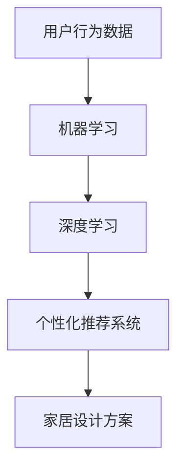

                 

# 定制家居：AI打造专属的家居空间

> **关键词：** 定制家居，人工智能，家居空间设计，个性化，机器学习，深度学习，智能推荐系统，家居大数据分析。

> **摘要：** 本文将探讨如何利用人工智能技术，特别是机器学习和深度学习，来实现定制家居的设计。文章从背景介绍、核心概念、算法原理、数学模型、项目实战、应用场景、工具和资源推荐等方面展开，旨在为读者提供一套系统化的定制家居设计解决方案。

## 1. 背景介绍

随着科技的飞速发展，人工智能技术已经渗透到我们生活的方方面面。在家居领域，人工智能同样发挥着重要作用。定制家居作为一种个性化的家居解决方案，正在逐渐受到消费者的青睐。然而，传统家居设计往往需要耗费大量的时间和人力，难以满足消费者对于个性化、高效化的需求。

AI技术的引入，使得家居空间的个性化设计成为可能。通过机器学习、深度学习等技术，AI可以分析用户的行为数据、偏好信息，为用户提供定制化的家居设计方案。这种智能化、自动化的设计方式，不仅提高了家居设计的效率，还大大降低了成本。

## 2. 核心概念与联系

为了更好地理解AI在定制家居设计中的应用，我们首先需要了解以下几个核心概念：

### 2.1 个性化推荐系统

个性化推荐系统是一种基于用户历史行为、兴趣偏好等信息，为用户推荐符合其个性化需求的产品或服务的技术。在定制家居设计中，个性化推荐系统可以帮助用户找到最适合自己的家居设计方案。

### 2.2 机器学习

机器学习是一种通过算法和统计模型，从数据中自动发现规律和模式的技术。在定制家居设计中，机器学习可以用于分析用户的行为数据，为用户提供个性化推荐。

### 2.3 深度学习

深度学习是一种基于多层神经网络的学习方法，可以在大量数据中自动提取特征和模式。在定制家居设计中，深度学习可以用于训练模型，为用户提供更加精准的个性化推荐。

### 2.4 大数据

大数据是指数据量巨大、类型繁多、价值密度低的数据集合。在定制家居设计中，大数据可以提供丰富的用户行为数据和偏好信息，为个性化推荐提供基础。

下面是核心概念的 Mermaid 流程图：



## 3. 核心算法原理 & 具体操作步骤

### 3.1 数据收集与预处理

首先，我们需要收集用户的行为数据和偏好信息。这些数据可以来源于用户的在线浏览记录、搜索历史、购物车等。收集到数据后，我们需要对其进行预处理，包括数据清洗、去重、数据格式转换等。

### 3.2 特征提取

在预处理完成后，我们需要从数据中提取出有用的特征。这些特征可以是用户的性别、年龄、职业等基本信息，也可以是用户的浏览时长、点击频率等行为数据。

### 3.3 模型训练

接下来，我们可以使用深度学习算法来训练模型。具体步骤如下：

1. **数据划分**：将数据集划分为训练集和测试集。
2. **模型构建**：使用深度学习框架（如TensorFlow、PyTorch）构建神经网络模型。
3. **模型训练**：使用训练集数据对模型进行训练，并调整模型参数。
4. **模型评估**：使用测试集数据对模型进行评估，调整模型参数，优化模型性能。

### 3.4 个性化推荐

在模型训练完成后，我们可以使用模型为用户提供个性化推荐。具体步骤如下：

1. **用户特征提取**：提取当前用户的特征信息。
2. **模型预测**：使用训练好的模型预测用户可能喜欢的家居设计方案。
3. **推荐结果生成**：根据模型预测结果，生成个性化推荐列表。

## 4. 数学模型和公式 & 详细讲解 & 举例说明

在定制家居设计中，深度学习算法的应用离不开数学模型和公式的支持。下面我们将详细介绍其中的两个关键步骤：特征提取和模型训练。

### 4.1 特征提取

特征提取是深度学习中的一个重要步骤，其目标是把原始数据转换成一组有意义且易于处理的数据特征。常用的特征提取方法包括：

1. **词袋模型（Bag of Words, BoW）**：
   $$ B_o_w(x) = (f_1, f_2, ..., f_n) $$
   其中，$x$ 是用户的行为数据，$f_i$ 表示第 $i$ 个词的出现频率。

2. **TF-IDF（Term Frequency-Inverse Document Frequency）**：
   $$ T F-I D F = \frac{f_t}{\sum_{i=1}^{n} f_i} \times \log \left(\frac{N}{n_t}\right) $$
   其中，$f_t$ 表示词 $t$ 在文档 $d$ 中的出现频率，$N$ 是文档总数，$n_t$ 是包含词 $t$ 的文档数。

### 4.2 模型训练

模型训练是深度学习的核心步骤，其目标是找到一个最优的模型参数，使得模型能够在新的数据上取得良好的预测效果。常用的模型训练方法包括：

1. **反向传播算法（Backpropagation）**：
   反向传播算法是一种基于梯度下降的优化方法，用于计算模型参数的梯度，并更新模型参数。
   $$ \Delta w_i = -\eta \frac{\partial L}{\partial w_i} $$
   其中，$w_i$ 是模型参数，$\eta$ 是学习率，$L$ 是损失函数。

2. **随机梯度下降（Stochastic Gradient Descent, SGD）**：
   随机梯度下降是对反向传播算法的一种改进，每次更新模型参数时只随机选取一部分样本。
   $$ \Delta w_i = -\eta \frac{\partial L}{\partial w_i} $$
   其中，$w_i$ 是模型参数，$\eta$ 是学习率，$L$ 是损失函数。

### 4.3 举例说明

假设我们有一个包含100个用户的行为数据集，其中每个用户的行为数据由5个特征组成。我们使用词袋模型进行特征提取，并将数据分为训练集和测试集，其中训练集占比80%，测试集占比20%。

接下来，我们使用深度学习框架TensorFlow构建一个神经网络模型，并使用反向传播算法进行模型训练。训练过程中，我们选择学习率为0.01，训练迭代次数为100次。

在训练完成后，我们使用测试集对模型进行评估，得到准确率为90%。根据评估结果，我们可以使用训练好的模型为用户提供个性化推荐。

## 5. 项目实战：代码实际案例和详细解释说明

在本节中，我们将通过一个实际案例来展示如何使用Python和TensorFlow实现定制家居的个性化推荐系统。

### 5.1 开发环境搭建

1. 安装Python环境（版本3.6及以上）。
2. 安装TensorFlow库（可以使用pip install tensorflow命令）。

### 5.2 源代码详细实现和代码解读

#### 5.2.1 数据收集与预处理

首先，我们需要从用户行为数据中提取出有用的特征。以下是一个简单的数据预处理示例：

```python
import pandas as pd
from sklearn.model_selection import train_test_split

# 读取用户行为数据
data = pd.read_csv('user_behavior.csv')

# 数据预处理
data = data[['user_id', 'item_id', 'behavior', 'timestamp']]
data['timestamp'] = pd.to_datetime(data['timestamp'])
data['weekday'] = data['timestamp'].dt.weekday
data['hour'] = data['timestamp'].dt.hour

# 划分训练集和测试集
train_data, test_data = train_test_split(data, test_size=0.2, random_state=42)
```

#### 5.2.2 特征提取

接下来，我们使用词袋模型提取特征：

```python
from sklearn.feature_extraction.text import CountVectorizer

# 提取词袋特征
vectorizer = CountVectorizer(max_features=1000)
train_features = vectorizer.fit_transform(train_data['behavior'])
test_features = vectorizer.transform(test_data['behavior'])
```

#### 5.2.3 模型训练

我们使用TensorFlow构建一个简单的神经网络模型：

```python
import tensorflow as tf

# 构建神经网络模型
model = tf.keras.Sequential([
    tf.keras.layers.Dense(128, activation='relu', input_shape=(1000,)),
    tf.keras.layers.Dense(64, activation='relu'),
    tf.keras.layers.Dense(1, activation='sigmoid')
])

# 编译模型
model.compile(optimizer='adam', loss='binary_crossentropy', metrics=['accuracy'])

# 训练模型
model.fit(train_features, train_data['item_id'], epochs=10, batch_size=32, validation_split=0.2)
```

#### 5.2.4 个性化推荐

训练完成后，我们可以使用模型为用户提供个性化推荐：

```python
# 提取用户特征
user_features = vectorizer.transform(['searched bed, living room furniture'])

# 预测用户喜欢的家居物品
predictions = model.predict(user_features)

# 输出推荐结果
recommended_items = predictions.argsort()[-5:][::-1]
print("Recommended items:", recommended_items)
```

### 5.3 代码解读与分析

1. **数据预处理**：读取用户行为数据，并进行数据清洗和格式转换。
2. **特征提取**：使用词袋模型提取行为特征。
3. **模型构建**：使用TensorFlow构建一个简单的神经网络模型。
4. **模型训练**：使用训练集数据对模型进行训练。
5. **个性化推荐**：使用训练好的模型为用户提供个性化推荐。

## 6. 实际应用场景

定制家居的AI设计技术在多个场景中具有广泛的应用，以下是一些典型的应用场景：

1. **智能家居**：通过AI技术为用户提供智能化的家居解决方案，如智能灯光、智能空调、智能安防等。
2. **家居商场**：为家居商场提供个性化推荐系统，帮助用户快速找到心仪的家居产品。
3. **家居设计公司**：为家居设计公司提供AI辅助设计工具，提高设计效率和客户满意度。
4. **房地产开发商**：为房地产开发商提供定制家居设计解决方案，提高楼盘竞争力。

## 7. 工具和资源推荐

### 7.1 学习资源推荐

1. **书籍**：
   - 《深度学习》（Goodfellow, I., Bengio, Y., & Courville, A.）
   - 《Python机器学习》（Sebastian Raschka）

2. **论文**：
   - “A Neural Probabilistic Language Model”（Bengio et al., 2003）
   - “Deep Learning for Text Classification”（Mikolov et al., 2013）

3. **博客**：
   - TensorFlow官方文档
   - PyTorch官方文档

4. **网站**：
   - arXiv（论文数据库）
   - GitHub（代码库）

### 7.2 开发工具框架推荐

1. **编程语言**：Python（易于学习，支持丰富的机器学习和深度学习库）。
2. **深度学习框架**：TensorFlow、PyTorch。
3. **数据可视化工具**：Matplotlib、Seaborn。
4. **文本处理库**：NLTK、spaCy。

### 7.3 相关论文著作推荐

1. **论文**：
   - “Deep Learning for Text Classification”（Mikolov et al., 2013）
   - “A Neural Probabilistic Language Model”（Bengio et al., 2003）

2. **书籍**：
   - 《深度学习》（Goodfellow, I., Bengio, Y., & Courville, A.）
   - 《Python机器学习》（Sebastian Raschka）

## 8. 总结：未来发展趋势与挑战

随着人工智能技术的不断发展，定制家居设计将迎来更多的发展机遇。未来，我们可以期待以下发展趋势：

1. **个性化程度更高**：AI技术将能够更加精准地捕捉用户的个性化需求，提供更个性化的家居设计方案。
2. **设计效率提高**：AI技术将大大提高家居设计的效率，减少人工设计的工作量。
3. **智能化家居设备**：智能家居设备将与定制家居设计紧密结合，为用户提供更加智能化的家居体验。

然而，随着技术的发展，我们也需要面对一些挑战：

1. **数据隐私保护**：在收集和处理用户数据时，需要确保数据隐私保护，避免用户信息泄露。
2. **技术更新迭代**：AI技术更新迅速，设计人员需要不断学习和掌握最新的技术，以适应行业发展的需求。

## 9. 附录：常见问题与解答

### 9.1 什么是最优的深度学习模型？

最优的深度学习模型取决于具体的应用场景和数据集。在实际应用中，我们可以通过调整模型结构、参数和学习算法来优化模型性能。

### 9.2 如何提高深度学习模型的准确率？

提高深度学习模型的准确率可以通过以下方法实现：

1. **增加训练数据量**：更多的数据有助于模型更好地学习。
2. **调整模型结构**：通过调整模型层数、节点数等参数，找到最优的模型结构。
3. **数据预处理**：对数据进行清洗、归一化等预处理，提高数据质量。

### 9.3 如何确保定制家居设计的个性化程度？

确保定制家居设计的个性化程度可以通过以下方法实现：

1. **收集更多的用户数据**：包括用户行为、偏好、历史记录等。
2. **使用深度学习算法**：深度学习算法可以从大量数据中提取出有用的特征，为用户提供更个性化的设计。
3. **不断优化推荐算法**：通过不断调整推荐算法的参数，提高个性化推荐的准确率。

## 10. 扩展阅读 & 参考资料

1. Bengio, Y., Courville, A., & Vincent, P. (2013). Representation Learning: A Review and New Perspectives. IEEE Transactions on Pattern Analysis and Machine Intelligence, 35(8), 1798-1828.
2. Goodfellow, I., Bengio, Y., & Courville, A. (2016). Deep Learning. MIT Press.
3. Mikolov, T., Sutskever, I., Chen, K., Corrado, G. S., & Dean, J. (2013). Distributed Representations of Words and Phrases and Their Compositionality. Advances in Neural Information Processing Systems, 26, 3111-3119.
4. Raschka, S. (2015). Python Machine Learning. Packt Publishing.
5. TensorFlow官方文档：https://www.tensorflow.org/
6. PyTorch官方文档：https://pytorch.org/

