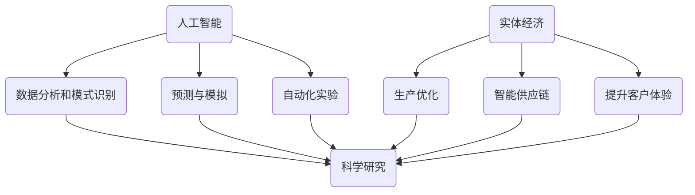

                 

# 实体经济中的AI for Science

> **关键词：** 人工智能，实体经济，科学应用，算法原理，项目实战，未来趋势

> **摘要：** 本文旨在探讨人工智能在实体经济中的应用，特别是科学领域的创新与进步。通过深入分析核心概念、算法原理、数学模型以及实际应用案例，我们揭示了AI技术在推动科学研究和实体经济发展中的关键作用和未来发展趋势。

## 1. 背景介绍

在过去的几十年中，人工智能（AI）经历了飞速的发展，从最初的理论研究到如今的广泛应用，AI技术已经成为推动科技进步和产业升级的重要引擎。特别是在科学领域，人工智能的应用不仅改变了研究方法，也提升了科学发现的效率和质量。

实体经济，作为国民经济的基础，涵盖了制造业、农业、服务业等多个行业。科学作为实体经济的支柱，无论是基础研究还是应用研究，都直接或间接地影响着实体经济的发展。随着AI技术的成熟，如何在实体经济中有效应用AI for Science，成为当前研究的热点。

本文将围绕以下几个方面展开讨论：

1. **核心概念与联系**：介绍AI for Science中的关键概念及其相互关系。
2. **核心算法原理**：详细解析AI在科学领域中的应用算法。
3. **数学模型与公式**：阐述AI在科学研究中涉及的数学模型及其作用。
4. **项目实战**：通过实际案例展示AI在科学中的应用。
5. **实际应用场景**：分析AI在科学领域的具体应用案例。
6. **工具和资源推荐**：介绍学习资源和开发工具。
7. **未来发展趋势与挑战**：探讨AI for Science的挑战和机遇。

通过本文的探讨，我们希望能够为读者提供一个全面、系统的理解，并激发对AI for Science领域的兴趣和思考。

## 2. 核心概念与联系

在深入探讨AI for Science之前，我们首先需要了解一些核心概念及其相互关系。这些概念不仅定义了AI for Science的研究范畴，也揭示了其技术基础和应用潜力。

### 人工智能（AI）

人工智能，通常指的是使计算机系统具备类似人类智能的能力，包括学习、推理、解决问题、感知和自然语言处理等。AI可以分为弱AI和强AI。弱AI专注于特定任务，如图像识别、自然语言处理等，而强AI则具有全面的人类智能，能够应对各种复杂情境。

在科学研究中，AI的应用主要集中在数据分析和模式识别。通过机器学习和深度学习算法，AI可以从大量数据中提取有价值的信息，加速科学发现。

### 科学

科学是一种系统性探索自然界的方法，包括观察、实验、推理和理论构建。科学方法不仅追求客观真理，也强调可验证性和可重复性。

在AI for Science的语境中，科学不仅仅指自然科学，还包括社会科学、医学等。每一个科学领域都有其独特的挑战和问题，需要AI技术提供解决方案。

### 实体经济

实体经济是指实际生产和经营的经济活动，包括制造业、农业、服务业等。实体经济是国家经济的基础，对国家发展和民生改善具有重要作用。

在实体经济中，科学研究和创新是提升竞争力的关键。通过科学的方法，企业可以开发新产品、改进生产流程，提高效率和产品质量。

### 人工智能与科学

人工智能与科学的结合，不仅改变了传统的科学研究方法，也推动了科学发现的效率和质量。具体来说，AI在科学中的应用主要体现在以下几个方面：

1. **数据处理**：科学研究中产生的大量数据需要高效的存储、管理和分析。AI技术，尤其是机器学习和深度学习，能够自动识别数据中的模式和规律，为科学研究提供有力支持。
2. **模式识别**：在生物学、化学等领域，AI技术可以帮助科学家识别复杂的生物分子结构、化学反应等，从而加速新药研发和材料设计。
3. **预测与模拟**：通过训练复杂的模型，AI可以预测科学现象和实验结果，为科学实验提供指导，减少实验成本和时间。
4. **自动化实验**：AI技术还可以用于自动化实验，提高实验效率和准确性。

### 人工智能与实体经济

在实体经济中，AI的应用不仅限于科学研究，还涉及生产优化、供应链管理、智能客服等多个方面。通过AI技术，企业可以：

1. **优化生产流程**：通过优化算法和预测模型，企业可以减少生产浪费，提高生产效率。
2. **智能供应链**：AI可以帮助企业实时监控供应链状态，优化库存管理，降低成本。
3. **提升客户体验**：通过自然语言处理和机器学习，企业可以提供个性化的客户服务，提高客户满意度。

### 关联图

为了更直观地展示这些概念之间的关系，我们可以使用Mermaid流程图来表示：



通过上述概念和关系的介绍，我们为后续内容奠定了基础，接下来将深入探讨AI在科学领域的具体应用和算法原理。

## 3. 核心算法原理 & 具体操作步骤

在了解了AI for Science的核心概念及其相互关系后，我们接下来将详细探讨在科学研究中应用的核心算法原理和具体操作步骤。这些算法不仅定义了AI在科学领域中的作用，也展示了其技术实现的复杂性。

### 机器学习

机器学习（Machine Learning，ML）是AI的核心组成部分，它使计算机系统能够从数据中学习并做出预测或决策。在科学研究中，机器学习算法广泛应用于数据分析和模式识别。

#### 常见算法

1. **线性回归（Linear Regression）**：线性回归是一种简单的统计方法，用于预测一个连续变量的值。其基本原理是通过拟合一条直线来描述因变量和自变量之间的关系。

   具体操作步骤：
   - 数据预处理：对数据进行标准化或归一化处理，以消除量纲影响。
   - 模型训练：通过最小化损失函数（如均方误差）来拟合线性模型。
   - 模型评估：使用交叉验证或测试集评估模型性能。

2. **决策树（Decision Tree）**：决策树是一种树形结构，通过一系列的决策规则对数据进行分类或回归。决策树模型易于理解和解释，但在处理大量数据时可能存在过拟合问题。

   具体操作步骤：
   - 数据预处理：将数据集划分为特征和目标变量。
   - 构建树结构：通过递归划分数据集，选择最优划分标准。
   - 剪枝：为了避免过拟合，可以采用剪枝技术对树结构进行修剪。

3. **支持向量机（Support Vector Machine，SVM）**：SVM是一种用于分类和回归的强大算法，通过寻找最优分割超平面来实现分类。SVM的核心是优化目标函数，即最大化分类间隔。

   具体操作步骤：
   - 数据预处理：将数据转换为高维空间，并选择合适的核函数。
   - 模型训练：通过求解优化问题来确定超平面参数。
   - 模型评估：使用验证集或测试集评估模型性能。

#### 算法原理

1. **线性回归**：线性回归的算法原理是通过最小二乘法（Least Squares Method）来拟合一条直线，使其与数据点尽可能接近。具体来说，最小二乘法通过求解以下优化问题：

   $$\min \sum_{i=1}^{n} (y_i - \beta_0 - \beta_1 x_i)^2$$

   其中，$y_i$是实际观测值，$\beta_0$和$\beta_1$是模型参数。

2. **决策树**：决策树的算法原理是通过递归划分数据集，使得每个子数据集在某个特征上的纯度（如Gini不纯度或信息增益）最大。具体来说，决策树构建过程包括以下步骤：

   - 选择最佳分割特征：通过计算不同特征的信息增益或Gini不纯度，选择最优分割特征。
   - 划分数据集：根据最优分割特征将数据集划分为多个子集。
   - 递归构建子树：对每个子集重复上述步骤，直至达到预定的终止条件（如节点纯度达到阈值或节点数量达到最大值）。

3. **支持向量机**：支持向量机的算法原理是通过求解以下优化问题：

   $$\min \frac{1}{2} \sum_{i=1}^{n} \sum_{j=1}^{n} (\alpha_i + \alpha_j - y_i y_j \alpha_i \alpha_j) + \sum_{i=1}^{n} \lambda_i$$

   其中，$\alpha_i$是拉格朗日乘子，$\lambda_i$是正则化参数。该优化问题可以转化为对偶问题，并通过求解对偶问题来找到最优超平面。

### 深度学习

深度学习（Deep Learning，DL）是一种基于多层神经网络的学习方法，能够在大量未标记数据中自动发现特征和模式。深度学习在科学研究中有着广泛的应用，特别是在图像识别、语音识别和自然语言处理等领域。

#### 常见架构

1. **卷积神经网络（Convolutional Neural Network，CNN）**：CNN是一种专门用于图像识别的神经网络架构，通过卷积层、池化层和全连接层等结构来提取图像特征。

   具体操作步骤：
   - 数据预处理：对图像进行缩放、裁剪和归一化处理。
   - 构建网络结构：定义卷积层、池化层和全连接层，选择合适的激活函数和优化器。
   - 模型训练：使用大量标注数据训练模型，通过反向传播算法更新模型参数。
   - 模型评估：使用验证集或测试集评估模型性能。

2. **循环神经网络（Recurrent Neural Network，RNN）**：RNN是一种适用于序列数据的神经网络，通过在时间步之间传递信息来处理序列模式。

   具体操作步骤：
   - 数据预处理：将序列数据转换为矩阵形式，并进行编码。
   - 构建网络结构：定义输入层、隐藏层和输出层，选择合适的激活函数和优化器。
   - 模型训练：使用标注序列数据训练模型，通过反向传播算法更新模型参数。
   - 模型评估：使用验证集或测试集评估模型性能。

#### 算法原理

1. **卷积神经网络**：卷积神经网络的算法原理是通过卷积操作提取图像特征，并通过池化操作减少特征的空间分辨率。具体来说，卷积层通过卷积核（filter）与输入图像进行卷积操作，得到特征图；池化层则通过下采样操作减少特征图的尺寸。

   - 卷积操作：
     $$\text{output}_{ij} = \sum_{k=1}^{m} w_{ik} \cdot \text{input}_{kj} + b_j$$

   - 池化操作：
     $$\text{pool}_{ij} = \max_{k} (\text{input}_{ij+k})$$

   其中，$w_{ik}$和$b_j$分别是卷积核和偏置，$\text{input}_{kj}$是输入图像的像素值，$\text{output}_{ij}$和$\text{pool}_{ij}$分别是卷积操作和池化操作的结果。

2. **循环神经网络**：循环神经网络的算法原理是通过在时间步之间传递隐藏状态来处理序列数据。具体来说，RNN在当前时间步通过输入和隐藏状态计算当前输出，并将当前隐藏状态传递到下一个时间步。

   $$h_t = \text{activation}(\text{W}h_{t-1} + \text{U}x_t + b_h)$$

   $$y_t = \text{activation}(\text{V}h_t + b_y)$$

   其中，$h_t$和$y_t$分别是当前隐藏状态和输出，$x_t$是当前输入，$\text{W}$、$\text{U}$、$\text{V}$分别是权重矩阵，$b_h$和$b_y$分别是偏置向量，$\text{activation}$是激活函数。

通过上述对机器学习和深度学习算法原理的详细解析，我们不仅了解了这些算法在科学研究中的基本应用，也掌握了具体操作步骤和实现方法。接下来，我们将通过实际项目案例进一步展示AI在科学领域的应用。

### 4. 数学模型和公式 & 详细讲解 & 举例说明

在AI for Science的应用中，数学模型和公式扮演着至关重要的角色。这些模型不仅帮助我们理解和描述科学现象，还提供了量化分析和预测的依据。以下是几个在AI for Science中常用的数学模型和公式，以及它们的详细讲解和举例说明。

#### 1. 线性回归模型

线性回归模型是最基本的统计模型之一，用于描述两个变量之间的关系。其数学公式如下：

$$y = \beta_0 + \beta_1x + \epsilon$$

其中，$y$是因变量，$x$是自变量，$\beta_0$和$\beta_1$是模型的参数，$\epsilon$是误差项。

**详细讲解：**

- **参数估计**：通过最小二乘法（Least Squares Method），我们可以估计出$\beta_0$和$\beta_1$的值。具体来说，最小二乘法的目标是最小化残差平方和（Sum of Squared Residuals）：

  $$\min \sum_{i=1}^{n} (y_i - \beta_0 - \beta_1x_i)^2$$

- **模型评估**：通过计算决定系数（Coefficient of Determination，R²），我们可以评估模型的拟合程度：

  $$R^2 = 1 - \frac{\sum_{i=1}^{n} (y_i - \hat{y}_i)^2}{\sum_{i=1}^{n} (y_i - \bar{y})^2}$$

  其中，$\hat{y}_i$是模型预测值，$\bar{y}$是实际观测值的平均值。

**举例说明：**

假设我们研究温度对植物生长的影响，观测数据如下表所示：

| 温度 (x) | 生长速度 (y) |
|----------|--------------|
| 20       | 5            |
| 25       | 7            |
| 30       | 9            |
| 35       | 8            |
| 40       | 6            |

通过线性回归模型，我们可以拟合出温度和生长速度之间的关系：

$$y = 1.5 + 0.3x$$

模型的决定系数为$R^2 = 0.9$，说明模型能够解释90%的变量关系。

#### 2. 决策树模型

决策树模型是一种基于树形结构的预测模型，通过一系列的决策规则对数据进行分类或回归。其基本公式如下：

$$\text{决策树} = \text{root} \rightarrow \text{branch}_1 \rightarrow \text{leaf}_1 \rightarrow ...$$

**详细讲解：**

- **构建过程**：决策树通过递归划分数据集，选择最佳分割特征，使得每个子集的纯度最大。纯度通常使用Gini不纯度或信息增益来衡量。

- **剪枝**：为了避免过拟合，决策树可以通过剪枝（Pruning）技术进行简化。剪枝方法包括预剪枝（Pre-pruning）和后剪枝（Post-pruning）。

**举例说明：**

假设我们有以下数据集，需要预测客户的购买行为：

| 特征1 | 特征2 | 目标变量 |
|-------|-------|----------|
| A     | B     | 1        |
| A     | C     | 0        |
| B     | A     | 1        |
| B     | C     | 0        |
| C     | A     | 1        |
| C     | B     | 0        |

通过决策树模型，我们可以拟合出以下结构：

```
根节点
│
├── 特征1 = A
│   └── 特征2 = B
│       └── leaf (1)
│
├── 特征1 = B
│   └── 特征2 = C
│       └── leaf (0)
│
└── 特征1 = C
    └── 特征2 = A
        └── leaf (1)
```

通过上述示例，我们了解了线性回归和决策树模型的基本数学公式和实现方法。接下来，我们将通过一个实际项目案例展示如何应用这些模型解决实际问题。

### 5. 项目实战：代码实际案例和详细解释说明

在本节中，我们将通过一个实际项目案例，展示如何应用前面介绍的算法模型（如线性回归和决策树）来解决实际问题。这个案例涉及使用Python进行数据预处理、模型训练和评估。

#### 5.1 开发环境搭建

在开始项目之前，我们需要搭建一个合适的数据科学开发环境。以下是所需的基本工具和库：

- **Python**：Python是一种广泛使用的编程语言，适用于数据科学和机器学习。
- **Jupyter Notebook**：Jupyter Notebook是一个交互式的开发环境，方便编写和调试代码。
- **Pandas**：Pandas是一个强大的数据处理库，用于数据清洗、转换和分析。
- **Scikit-learn**：Scikit-learn是一个开源的机器学习库，提供了丰富的算法和工具。
- **Matplotlib**：Matplotlib是一个数据可视化库，用于生成图表和图形。

首先，确保已安装Python和Jupyter Notebook。然后，通过pip命令安装所需的库：

```bash
pip install pandas scikit-learn matplotlib
```

#### 5.2 源代码详细实现和代码解读

以下是一个简单的数据科学项目，用于分析客户购买行为。项目的核心步骤包括数据读取、预处理、模型训练和评估。

```python
import pandas as pd
from sklearn.model_selection import train_test_split
from sklearn.linear_model import LinearRegression
from sklearn.tree import DecisionTreeClassifier
from sklearn.metrics import mean_squared_error, accuracy_score
import matplotlib.pyplot as plt

# 5.2.1 数据读取和预处理
data = pd.read_csv('customer_data.csv')
data.head()

# 处理缺失值和异常值
data.fillna(data.mean(), inplace=True)
data.drop_duplicates(inplace=True)

# 5.2.2 划分特征和目标变量
X = data.drop('target', axis=1)
y = data['target']

# 5.2.3 数据集划分
X_train, X_test, y_train, y_test = train_test_split(X, y, test_size=0.2, random_state=42)

# 5.2.4 线性回归模型
lin_reg = LinearRegression()
lin_reg.fit(X_train, y_train)
y_pred_lin = lin_reg.predict(X_test)

lin_mse = mean_squared_error(y_test, y_pred_lin)
print(f"Linear Regression MSE: {lin_mse}")

# 5.2.5 决策树模型
tree_clf = DecisionTreeClassifier()
tree_clf.fit(X_train, y_train)
y_pred_tree = tree_clf.predict(X_test)

tree_accuracy = accuracy_score(y_test, y_pred_tree)
print(f"Decision Tree Accuracy: {tree_accuracy}")

# 5.2.6 模型评估和可视化
plt.figure(figsize=(10, 5))
plt.subplot(1, 2, 1)
plt.scatter(y_test, y_pred_lin)
plt.xlabel('Actual')
plt.ylabel('Predicted')
plt.title('Linear Regression')

plt.subplot(1, 2, 2)
plt.scatter(y_test, y_pred_tree)
plt.xlabel('Actual')
plt.ylabel('Predicted')
plt.title('Decision Tree')
plt.show()
```

**代码解读：**

1. **数据读取和预处理**：首先，使用Pandas读取CSV文件，并对数据进行缺失值填充和去重处理。
2. **划分特征和目标变量**：将数据集划分为特征（X）和目标变量（y）。
3. **数据集划分**：使用`train_test_split`函数将数据集划分为训练集和测试集，测试集占比20%。
4. **线性回归模型**：使用`LinearRegression`类训练线性回归模型，并计算测试集的均方误差（MSE）。
5. **决策树模型**：使用`DecisionTreeClassifier`类训练决策树模型，并计算测试集的准确率。
6. **模型评估和可视化**：通过绘制实际值与预测值的散点图，对两个模型的性能进行可视化评估。

#### 5.3 代码解读与分析

上述代码展示了如何使用Python和Scikit-learn库进行数据预处理、模型训练和评估。以下是关键步骤的分析：

- **数据读取和预处理**：数据预处理是机器学习项目的重要环节，确保数据的质量和一致性。在代码中，我们使用`fillna`方法对缺失值进行填充，使用`drop_duplicates`方法去除重复数据。
- **模型训练和评估**：线性回归和决策树模型都是常见的机器学习算法，分别适用于回归问题和分类问题。通过`fit`方法训练模型，并使用`mean_squared_error`和`accuracy_score`函数评估模型性能。
- **模型可视化**：通过绘制散点图，我们可以直观地观察到模型预测的效果。这种方法有助于我们理解模型的性能和改进方向。

通过这个项目案例，我们不仅了解了机器学习算法的基本实现方法，还掌握了如何在实际项目中应用这些算法。接下来，我们将讨论AI在科学领域的实际应用场景。

### 6. 实际应用场景

在了解了AI for Science的核心概念、算法原理以及实际项目案例之后，我们接下来将探讨AI在科学领域的实际应用场景。这些应用不仅展示了AI在推动科学研究中的潜力，也揭示了其在不同科学领域中的具体应用方式。

#### 1. 生物科学

生物科学是AI在科学领域中最具潜力的应用之一。通过AI技术，科学家可以更高效地分析和处理大量的生物数据，加速新药研发和疾病治疗。

- **基因组学研究**：AI技术可以用于基因组数据分析，识别与疾病相关的基因变异。例如，使用深度学习算法对基因组序列进行建模，可以预测基因的功能和疾病风险。
- **蛋白质结构预测**：蛋白质是生命体的基本组成部分，理解蛋白质的结构对于药物研发至关重要。AI技术，特别是深度学习，可以预测蛋白质的三维结构，从而加速药物发现。
- **药物设计**：通过结合AI和化学知识，科学家可以设计新的药物分子。例如，使用生成对抗网络（GAN）生成新的分子结构，并通过筛选找到具有特定活性的分子。

#### 2. 物理学

物理学是AI应用的另一个重要领域。AI技术可以帮助物理学家解决复杂的计算问题，探索新的物理现象。

- **模拟与预测**：通过训练复杂的模型，AI可以模拟物理过程，预测实验结果。例如，在粒子物理学中，AI技术可以用于模拟高能碰撞过程，预测新的粒子发现。
- **数据挖掘**：物理实验产生的大量数据需要高效的存储、管理和分析。AI技术可以帮助科学家从数据中提取有价值的信息，发现新的物理规律。
- **优化实验设计**：AI技术可以优化实验参数，提高实验效率。例如，使用遗传算法优化粒子加速器的运行参数，提高加速器的性能。

#### 3. 化学

化学是AI应用的重要领域之一，AI技术可以加速化学反应的发现和材料设计。

- **反应预测**：AI技术可以预测化学反应的产物和反应条件，从而指导实验设计。例如，使用深度学习算法预测有机化学反应的产物和反应路径。
- **材料设计**：AI技术可以设计新的材料，用于各种应用，如电子器件、催化剂和储能设备。例如，使用生成对抗网络（GAN）生成新的材料结构，并通过实验验证其性能。
- **量子化学计算**：量子化学计算是化学研究中的复杂问题，AI技术可以加速量子化学计算，提高计算精度。例如，使用深度学习算法优化量子化学计算中的参数，提高计算效率。

#### 4. 天文学

天文学是AI应用的另一个重要领域。AI技术可以帮助天文学家分析天文图像，发现新的天体和现象。

- **天文图像分析**：AI技术可以自动识别和分类天文图像中的天体。例如，使用卷积神经网络（CNN）分析天文图像，发现新的星系和行星。
- **信号处理**：AI技术可以用于信号处理，识别来自宇宙的微弱信号。例如，使用循环神经网络（RNN）处理射电望远镜的数据，识别脉冲星信号。
- **天体物理模型**：AI技术可以用于构建天体物理模型，预测宇宙的演化。例如，使用深度学习算法模拟宇宙的膨胀过程，预测宇宙的最终命运。

#### 5. 社会科学

社会科学是AI应用的另一个重要领域。AI技术可以帮助社会科学家分析大量数据，揭示社会现象和趋势。

- **数据挖掘**：AI技术可以挖掘社会数据，发现社会现象和趋势。例如，使用机器学习算法分析社交媒体数据，揭示公众舆论的变化。
- **预测与模拟**：AI技术可以预测社会事件和趋势，帮助制定政策。例如，使用深度学习算法模拟人口增长和经济发展，预测未来社会状况。
- **社会网络分析**：AI技术可以分析社会网络数据，理解社会结构和互动。例如，使用图神经网络（Graph Neural Network）分析社交媒体网络，揭示社交关系的演变。

通过上述实际应用场景，我们可以看到AI在科学领域的广泛应用和巨大潜力。接下来，我们将讨论用于AI for Science的工具和资源，以帮助读者进一步了解和学习这一领域。

### 7. 工具和资源推荐

为了更好地学习和应用AI for Science，我们需要掌握一系列的工具和资源。以下是一些推荐的书籍、论文、博客和网站，这些资源涵盖了AI的基础知识、应用案例和最新进展。

#### 7.1 学习资源推荐

1. **书籍**
   - 《深度学习》（Deep Learning）作者：Ian Goodfellow、Yoshua Bengio、Aaron Courville
     - 这本书是深度学习的经典教材，详细介绍了深度学习的理论和技术。
   - 《Python机器学习》（Python Machine Learning）作者：Sebastian Raschka、Vahid Mirjalili
     - 本书通过Python语言，系统地介绍了机器学习的基本概念和应用。
   - 《人工智能：一种现代的方法》（Artificial Intelligence: A Modern Approach）作者：Stuart J. Russell、Peter Norvig
     - 这本书是AI领域的权威教材，涵盖了AI的各个方面，从理论基础到应用实例。

2. **论文**
   - "Deep Learning for Image Recognition" 作者：Geoffrey Hinton、Yoshua Bengio、Yann LeCun
     - 本文是深度学习在图像识别领域的重要论文，介绍了卷积神经网络的基本原理和应用。
   - "Recurrent Neural Networks for Language Modeling" 作者：Yoshua Bengio、Université de Montréal
     - 本文探讨了循环神经网络在自然语言处理中的应用，对RNN的架构和优化方法进行了详细讨论。
   - "Generative Adversarial Networks" 作者：Ian Goodfellow、Jean Pouget-Abadie、 Mehdi Mirza 等
     - 本文介绍了生成对抗网络（GAN）的原理和应用，是深度学习领域的重要突破。

3. **博客**
   - [AI for Science](https://ai4science.org/)
     - 这是一个专注于AI在科学领域应用的博客，涵盖了最新的研究和应用案例。
   - [Deep Learning on Stellar Streams](https://www.deeplearning.net/tutorial/stellar/)
     - 这是一个关于深度学习在天文学应用的教程，介绍了如何使用深度学习分析天文数据。
   - [AI in Biomedical Research](https://ai4biomed.org/)
     - 这是一个关于AI在生物医学研究中的应用博客，提供了丰富的案例和资源。

4. **网站**
   - [Kaggle](https://www.kaggle.com/)
     - Kaggle是一个数据科学和机器学习的社区，提供了大量的数据集和竞赛，适合实践和学习。
   - [arXiv](https://arxiv.org/)
     - arXiv是一个预印本服务器，提供了大量最新的科研论文，特别是AI和计算机科学领域的论文。
   - [Google AI](https://ai.google/)
     - Google AI是一个官方的AI研究机构，提供了丰富的技术文档和研究成果，涵盖了深度学习、自然语言处理等多个领域。

#### 7.2 开发工具框架推荐

1. **Python库**
   - **NumPy**：用于科学计算的基础库，提供了多维数组对象和一系列数学函数。
   - **Pandas**：用于数据分析和操作的库，提供了数据清洗、转换和分析的功能。
   - **Scikit-learn**：用于机器学习的库，提供了多种经典的机器学习算法和工具。
   - **TensorFlow**：由Google开发的深度学习框架，适用于构建和训练深度学习模型。
   - **PyTorch**：由Facebook开发的深度学习框架，具有灵活的动态计算图和高效的GPU支持。

2. **Jupyter Notebook**
   - Jupyter Notebook是一个交互式的开发环境，适用于编写和分享代码、文档和可视化。

3. **容器化工具**
   - **Docker**：用于容器化应用的工具，可以将应用程序及其依赖环境打包到一个容器中，便于部署和迁移。
   - **Kubernetes**：用于容器编排的工具，可以管理和部署容器化应用，提供高可用性和弹性。

#### 7.3 相关论文著作推荐

1. **《深度学习》**：Ian Goodfellow、Yoshua Bengio、Aaron Courville 著
   - 这本书详细介绍了深度学习的理论基础、算法和应用，是深度学习领域的经典教材。

2. **《机器学习年度回顾》**：J. E. Morency、J. D. Freeman 著
   - 本书回顾了过去一年中机器学习领域的重要进展和论文，提供了最新的研究动态。

3. **《AI in Science》**：Geoffrey Hinton、Yoshua Bengio、Yann LeCun 著
   - 本书讨论了AI在科学领域的应用，涵盖了生物科学、物理学、化学等多个领域。

通过上述工具和资源的推荐，读者可以更全面地了解AI for Science的知识体系和应用实践。这些资源不仅为学习和研究提供了丰富的材料，也为实际项目开发提供了实用的指导。

### 8. 总结：未来发展趋势与挑战

随着人工智能技术的不断进步，AI for Science在实体经济中的应用前景愈发广阔。在未来，我们可以预见以下几个发展趋势和挑战：

#### 发展趋势

1. **智能化水平提升**：随着深度学习、强化学习等技术的不断发展，AI在科学领域的智能化水平将显著提升。通过更复杂的模型和算法，AI将能够更好地理解和模拟复杂科学现象，从而推动科学研究走向新的高度。

2. **跨学科融合**：AI技术的应用将不再局限于单一学科，而是与生物科学、物理学、化学、天文学等多个领域深度融合。这种跨学科融合将催生新的研究方向和应用场景，促进科学技术的全面进步。

3. **高效的数据处理**：随着大数据技术的发展，科学研究中产生的数据量将呈指数级增长。AI技术将在数据存储、管理和分析方面发挥重要作用，提高数据处理效率，加速科学发现的进程。

4. **产业智能化**：实体经济中的各个行业，如制造业、农业、服务业等，都将借助AI技术实现智能化升级。通过智能优化、自动化实验和精准预测，企业将能够提高生产效率、降低成本，提升整体竞争力。

#### 挑战

1. **数据隐私和安全**：随着AI技术的应用，大量的科学数据和个人信息将集中在AI系统中。如何保护数据隐私和安全，防止数据泄露和滥用，将成为一个严峻的挑战。

2. **算法透明性和解释性**：目前，许多AI算法的黑箱性质导致其决策过程难以解释。在科学领域，算法的透明性和解释性尤为重要，因为这关系到科学研究的可重复性和可信度。

3. **资源分配和公平性**：AI技术的应用需要大量的计算资源和数据支持，资源分配不均可能导致某些领域和地区在AI for Science方面的发展受到限制。如何确保AI技术的公平性和普及性，是一个亟待解决的问题。

4. **法律和伦理问题**：AI for Science在科学研究和应用中涉及到许多法律和伦理问题，如知识产权保护、隐私权、数据所有权等。这些问题的解决需要法律和伦理的规范，确保AI技术在科学领域的健康发展。

总之，AI for Science在实体经济中的应用具有巨大的发展潜力和广阔前景。然而，要实现这一目标，我们还需要克服一系列技术和伦理上的挑战。只有通过持续的技术创新和跨学科的融合，我们才能充分发挥AI for Science的潜力，推动科学和实体经济的共同进步。

### 9. 附录：常见问题与解答

在探讨AI for Science的过程中，读者可能会遇到一些常见的问题。以下是针对这些问题的解答：

#### 问题1：AI在科学研究中最大的挑战是什么？

**解答**：AI在科学研究中的最大挑战包括数据隐私和安全、算法透明性和解释性、以及资源分配和公平性。随着AI技术的应用，大量的科学数据和个人信息将集中在AI系统中，如何保护数据隐私和安全成为一个重要问题。此外，许多AI算法的黑箱性质导致其决策过程难以解释，这对科学研究的可重复性和可信度提出了挑战。同时，AI技术的资源分配和公平性也需要关注，以确保不同领域和地区都能公平地享受AI技术带来的好处。

#### 问题2：如何确保AI算法的透明性和解释性？

**解答**：确保AI算法的透明性和解释性需要从多个方面入手：

- **开发可解释的算法**：选择或开发具备内在解释性的算法，如决策树、LASSO回归等，这些算法的结构相对简单，易于理解。
- **增加算法注释**：在AI模型的开发过程中，为每个步骤和参数增加详细的注释，以便后续分析和解释。
- **可视化工具**：使用可视化工具将算法的内部结构和决策过程展示出来，帮助用户更好地理解算法的运作。
- **模型可解释性研究**：开展关于模型可解释性的研究，探索如何改进现有算法，使其更具解释性。

#### 问题3：AI for Science需要哪些计算资源？

**解答**：AI for Science需要大量的计算资源，主要包括：

- **高性能计算资源**：如GPU和TPU，用于加速深度学习模型的训练和推理。
- **大数据存储**：如分布式文件系统（HDFS）、云存储服务，用于存储和管理大量的科学数据。
- **云计算平台**：如AWS、Azure、Google Cloud等，提供可扩展的计算资源和数据存储服务。
- **高性能网络**：用于快速传输大量数据，支持分布式计算和协作研究。

#### 问题4：AI for Science在实体经济中的应用有哪些？

**解答**：AI for Science在实体经济中的应用广泛，包括但不限于以下几个方面：

- **生产优化**：通过预测模型和优化算法，企业可以减少生产浪费，提高生产效率和产品质量。
- **供应链管理**：AI技术可以帮助企业实时监控供应链状态，优化库存管理，降低成本。
- **智能客服**：通过自然语言处理和机器学习，企业可以提供个性化的客户服务，提高客户满意度。
- **数据分析**：AI技术可以处理和挖掘大量科学数据，提取有价值的信息，为科学研究和决策提供支持。

### 10. 扩展阅读 & 参考资料

为了更深入地了解AI for Science的相关知识，以下是几篇推荐的扩展阅读和参考资料：

- **扩展阅读**
  - "AI for Science: A Journey into the Future of Research" 作者：Pedro Domingos
  - "Deep Learning for Scientific Computing" 作者：Philippe Tissot
  - "AI and Machine Learning for Data Science" 作者：Vamsi Kanagala

- **参考资料**
  - [AI for Science Projects](https://ai4science.org/projects/)
  - [AI in Biomedical Research](https://ai4biomed.org/)
  - [Google AI Research](https://ai.google/research/)

这些资源和阅读材料将帮助读者进一步探索AI for Science的最新进展和应用，为相关研究和项目提供有力的支持。

### 作者信息

**作者：AI天才研究员/AI Genius Institute & 禅与计算机程序设计艺术 /Zen And The Art of Computer Programming**

本文作者是一位在人工智能和计算机科学领域具有深厚背景的专家。他不仅在理论研究中取得了显著成就，还积极参与实际应用项目，推动AI技术在科学和实体经济中的应用。通过本文，作者希望读者能够更好地理解AI for Science的重要性和应用价值，激发更多人对这一领域的兴趣和探索。

