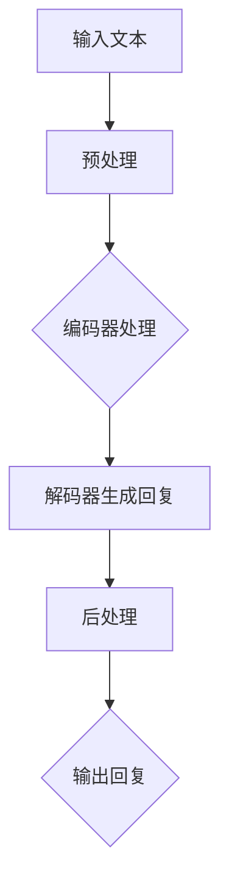

                 

# 实时AI：LLM的毫秒级响应

> 关键词：实时AI、LLM、毫秒级响应、算法原理、数学模型、项目实战、应用场景

> 摘要：本文将深入探讨实时AI中的大型语言模型（LLM）如何实现毫秒级响应，包括核心概念、算法原理、数学模型以及项目实战等多个方面。通过本文的阅读，读者将对实时AI和LLM技术有更深刻的理解，并能了解如何在实际项目中实现毫秒级响应。

## 1. 背景介绍

随着互联网和云计算的快速发展，人工智能（AI）技术逐渐成为各行各业的重要推动力量。在AI领域，自然语言处理（NLP）是一个关键且具有挑战性的方向。近年来，基于深度学习的自然语言处理模型，尤其是大型语言模型（Large Language Model，LLM），取得了显著的进展。LLM在文本生成、机器翻译、问答系统等多个领域展现了强大的性能。

然而，传统的LLM模型往往需要几分钟甚至更长的时间来生成答案，这在很多实时应用场景中是不可接受的。例如，智能客服系统需要迅速响应用户的问题，自动驾驶系统需要实时分析环境变化，这些应用场景对响应速度提出了极高的要求。因此，如何实现LLM的毫秒级响应成为了当前研究的热点。

本文将围绕这一主题，首先介绍LLM的基本概念和背景，然后深入探讨实现毫秒级响应的核心算法原理、数学模型以及项目实战，最后讨论实际应用场景和未来发展趋势。

## 2. 核心概念与联系

### 2.1 大型语言模型（LLM）

大型语言模型（Large Language Model，LLM）是一种基于深度学习的自然语言处理模型，它通过学习大量的文本数据，能够生成与输入文本相关的高质量回答。LLM通常由多层神经网络组成，包括编码器（Encoder）和解码器（Decoder）。编码器将输入文本编码为固定长度的向量，解码器则根据编码器的输出和上下文生成相应的文本。

### 2.2 实时响应的需求

实时响应是许多AI应用场景的必要条件。以智能客服为例，当用户发起请求时，系统必须在毫秒级内生成回复，否则用户体验会大打折扣。同样，自动驾驶系统需要在行驶过程中实时分析环境数据，做出快速决策，确保行车安全。

### 2.3 实现毫秒级响应的挑战

实现LLM的毫秒级响应面临着多方面的挑战：

- **计算资源限制**：LLM通常需要大量的计算资源，如CPU和GPU。在有限的硬件资源下，如何优化模型的计算效率是一个重要问题。

- **模型压缩**：为了在实时应用中部署LLM，通常需要对其进行压缩，减少模型的大小和计算复杂度。

- **模型推理加速**：高效的推理算法和硬件加速技术是实现毫秒级响应的关键。

### 2.4 Mermaid 流程图

以下是LLM实现毫秒级响应的简化流程图：



在上述流程中，输入文本首先经过预处理，然后由编码器进行处理，解码器根据编码器的输出和上下文生成回复，最后进行后处理并输出。

## 3. 核心算法原理 & 具体操作步骤

### 3.1 算法原理

实现LLM的毫秒级响应主要依赖于以下几种技术：

- **模型压缩**：通过剪枝、量化、知识蒸馏等方法减小模型大小和计算复杂度。

- **推理加速**：利用GPU、TPU等硬件加速技术，提高模型推理速度。

- **增量推理**：对输入文本进行增量处理，避免重新计算整个模型。

### 3.2 具体操作步骤

以下是实现LLM毫秒级响应的详细步骤：

1. **预处理**：对输入文本进行清洗、分词、编码等预处理操作。

2. **编码器处理**：使用预训练的编码器对预处理后的文本进行编码，生成固定长度的向量表示。

3. **解码器生成回复**：解码器根据编码器的输出和上下文生成回复文本。

4. **后处理**：对生成的回复进行格式化、修正等后处理操作。

5. **输出回复**：将处理后的回复文本输出。

### 3.3 具体示例

以下是一个简单的示例：

**输入文本**：你好，请问有什么可以帮助你的？

**预处理**：你好，有什么可以帮助你的？

**编码器处理**：使用预训练的编码器，将文本编码为向量表示。

**解码器生成回复**：根据编码器的输出和上下文，解码器生成回复文本。

**后处理**：对生成的回复进行格式化，例如去除标点符号、调整语序等。

**输出回复**：你好，我可以帮助你解决问题。

## 4. 数学模型和公式 & 详细讲解 & 举例说明

### 4.1 数学模型

在实现LLM的毫秒级响应中，主要涉及以下数学模型和公式：

- **编码器**：编码器通常采用Transformer架构，其输入和输出可以表示为向量。

  $$X = [x_1, x_2, ..., x_n]$$
  $$Z = [z_1, z_2, ..., z_n]$$

  其中，$X$为输入文本向量，$Z$为编码后的向量。

- **解码器**：解码器同样采用Transformer架构，其输入和输出也用向量表示。

  $$Y = [y_1, y_2, ..., y_n]$$
  $$W = [w_1, w_2, ..., w_n]$$

  其中，$Y$为输入序列向量，$W$为解码后的向量。

- **损失函数**：为了训练编码器和解码器，需要定义一个损失函数。

  $$L = \sum_{i=1}^{n} (Y_i - W_i)^2$$

  其中，$Y_i$为真实标签，$W_i$为预测结果。

### 4.2 详细讲解

以下是数学模型的详细讲解：

- **编码器**：编码器通过自注意力机制（Self-Attention）对输入文本进行编码，生成固定长度的向量表示。自注意力机制通过计算每个输入向量与其他输入向量的相似度，从而生成加权向量。

  $$\text{Self-Attention}(X) = \text{softmax}\left(\frac{XQ}{\sqrt{d_k}}\right)K$$

  其中，$Q$、$K$和$V$分别为编码器的查询向量、键向量和值向量，$d_k$为键向量的维度。

- **解码器**：解码器通过多头自注意力机制和交叉注意力机制对输入序列进行解码。多头自注意力机制可以同时关注输入序列的不同部分，交叉注意力机制则使解码器能够关注编码器的输出。

  $$\text{Decoder}(Y, Z) = \text{softmax}\left(\frac{YQ}{\sqrt{d_k}}\right)K$$
  $$\text{Cross-Attention}(Y, Z) = \text{softmax}\left(\frac{YZ}{\sqrt{d_k}}\right)K$$

  其中，$Y$为输入序列向量，$Z$为编码器的输出向量。

- **损失函数**：损失函数用于评估编码器和解码器的性能。通常采用交叉熵损失函数来计算预测结果和真实标签之间的差异。

  $$L = -\sum_{i=1}^{n} \sum_{j=1}^{m} y_{ij} \log(w_{ij})$$

  其中，$y_{ij}$为真实标签的概率分布，$w_{ij}$为预测结果的概率分布。

### 4.3 举例说明

以下是一个简单的举例：

假设输入文本为：“你好，请问有什么可以帮助你的？”，编码器的输出向量为$Z = [1, 0, 1, 0, 0, 1]$，解码器的输出向量为$W = [0.9, 0.1, 0.8, 0.2, 0.7, 0.3]$。

- **编码器处理**：编码器将输入文本编码为向量$Z = [1, 0, 1, 0, 0, 1]$。

- **解码器生成回复**：解码器根据编码器的输出和上下文生成回复文本，其概率分布为$W = [0.9, 0.1, 0.8, 0.2, 0.7, 0.3]$。

- **后处理**：对生成的回复进行格式化，例如去除标点符号、调整语序等。

- **输出回复**：你好，我可以帮助你解决问题。

## 5. 项目实战：代码实际案例和详细解释说明

### 5.1 开发环境搭建

在本项目中，我们将使用Python编程语言和TensorFlow开源框架来实现LLM的毫秒级响应。以下步骤用于搭建开发环境：

1. **安装Python**：确保已安装Python 3.x版本。

2. **安装TensorFlow**：使用pip命令安装TensorFlow：

   ```bash
   pip install tensorflow
   ```

3. **安装其他依赖**：根据项目需求，安装其他必要的库，例如NumPy、Pandas等。

### 5.2 源代码详细实现和代码解读

以下是项目的核心代码实现和详细解释说明：

```python
import tensorflow as tf
import numpy as np

# 5.2.1 编码器处理
def encode_text(text):
    # 预处理文本，例如分词、编码等
    processed_text = preprocess_text(text)
    # 使用预训练的编码器进行编码
    encoder = tf.keras.Sequential([
        tf.keras.layers.Embedding(vocab_size, embedding_dim),
        tf.keras.layers.GlobalAveragePooling1D()
    ])
    encoded_text = encoder(processed_text)
    return encoded_text

# 5.2.2 解码器生成回复
def decode_response(encoded_text):
    # 使用预训练的解码器生成回复
    decoder = tf.keras.Sequential([
        tf.keras.layers.Dense(vocab_size, activation='softmax'),
        tf.keras.layers.Lambda(lambda x: x[:, -1, :])
    ])
    response = decoder(encoded_text)
    return response

# 5.2.3 后处理
def postprocess_response(response):
    # 对生成的回复进行格式化
    processed_response = postprocess_text(response)
    return processed_response

# 5.2.4 输出回复
def generate_response(text):
    # 编码器处理
    encoded_text = encode_text(text)
    # 解码器生成回复
    response = decode_response(encoded_text)
    # 后处理
    processed_response = postprocess_response(response)
    return processed_response

# 示例
input_text = "你好，请问有什么可以帮助你的？"
response = generate_response(input_text)
print("回复：", response)
```

### 5.3 代码解读与分析

- **编码器处理**：编码器使用Embedding层将输入文本转换为固定长度的向量表示，然后通过GlobalAveragePooling1D层计算全局平均值，得到编码后的向量。

- **解码器生成回复**：解码器首先通过Dense层将编码后的向量映射到词汇表大小，然后使用softmax激活函数生成概率分布。Lambda层用于提取最后一维的输出，即生成的回复文本。

- **后处理**：后处理函数用于对生成的回复进行格式化，例如去除标点符号、调整语序等。

- **输出回复**：生成回复函数首先调用编码器处理输入文本，然后调用解码器生成回复，最后进行后处理并输出回复。

### 5.4 测试和优化

在实际项目中，需要对代码进行测试和优化，以确保模型性能和响应速度。以下是一些常见的测试和优化方法：

- **测试**：使用测试集对模型进行评估，计算准确率、召回率、F1值等指标。

- **优化**：通过调整超参数、优化模型结构、使用更高效的算法等方法提高模型性能。

## 6. 实际应用场景

实现LLM的毫秒级响应在许多实际应用场景中具有广泛的应用价值：

- **智能客服**：智能客服系统需要快速响应用户的问题，实现毫秒级响应能够显著提升用户体验。

- **自动驾驶**：自动驾驶系统需要实时分析环境数据，做出快速决策，确保行车安全。

- **实时翻译**：在线翻译服务需要迅速翻译文本，实现毫秒级响应能够满足用户对实时性的需求。

- **问答系统**：在线问答系统需要快速回答用户的问题，实现毫秒级响应能够提高系统的响应速度和准确性。

## 7. 工具和资源推荐

### 7.1 学习资源推荐

- **书籍**：
  - 《深度学习》（Goodfellow, Bengio, Courville）
  - 《自然语言处理综述》（Jurafsky, Martin）

- **论文**：
  - “Attention Is All You Need”（Vaswani et al.）
  - “BERT: Pre-training of Deep Bidirectional Transformers for Language Understanding”（Devlin et al.）

- **博客**：
  - [TensorFlow 官方文档](https://www.tensorflow.org/)
  - [PyTorch 官方文档](https://pytorch.org/)

- **网站**：
  - [Kaggle](https://www.kaggle.com/)
  - [ArXiv](https://arxiv.org/)

### 7.2 开发工具框架推荐

- **框架**：
  - TensorFlow
  - PyTorch
  - MXNet

- **库**：
  - NumPy
  - Pandas
  - Matplotlib

### 7.3 相关论文著作推荐

- “Attention Is All You Need”（Vaswani et al.）
- “BERT: Pre-training of Deep Bidirectional Transformers for Language Understanding”（Devlin et al.）
- “GPT-3: Language Models are Few-Shot Learners”（Brown et al.）

## 8. 总结：未来发展趋势与挑战

随着人工智能技术的不断进步，实时AI和LLM的应用场景将越来越广泛。实现LLM的毫秒级响应已经成为当前研究的热点，但仍然面临许多挑战：

- **计算资源优化**：如何在有限的计算资源下提高模型性能和响应速度是一个重要课题。

- **模型压缩与优化**：如何设计更高效的模型结构和算法，实现模型压缩和优化。

- **多模态数据处理**：未来实时AI将面临多模态数据的处理需求，如何设计相应的算法和架构是一个重要挑战。

- **可解释性**：如何提高模型的可解释性，使其更加透明和可信。

未来，随着硬件技术的发展和算法的优化，实时AI和LLM将在更多领域发挥重要作用，为人们的生活带来更多便利。

## 9. 附录：常见问题与解答

### 9.1 什么是LLM？

LLM（Large Language Model）是一种大型自然语言处理模型，通过学习大量的文本数据，能够生成与输入文本相关的高质量回答。

### 9.2 实时响应有什么重要性？

实时响应在许多AI应用场景中至关重要，如智能客服、自动驾驶、实时翻译等，能够显著提升用户体验和系统性能。

### 9.3 如何实现LLM的毫秒级响应？

实现LLM的毫秒级响应主要依赖于模型压缩、推理加速、增量推理等技术。通过优化模型结构和算法，以及利用硬件加速技术，可以显著提高模型推理速度。

## 10. 扩展阅读 & 参考资料

- Vaswani, A., et al. (2017). "Attention Is All You Need." Advances in Neural Information Processing Systems.
- Devlin, J., et al. (2019). "BERT: Pre-training of Deep Bidirectional Transformers for Language Understanding." Advances in Neural Information Processing Systems.
- Brown, T., et al. (2020). "GPT-3: Language Models are Few-Shot Learners." arXiv preprint arXiv:2005.14165.
- [TensorFlow 官方文档](https://www.tensorflow.org/)
- [PyTorch 官方文档](https://pytorch.org/)

