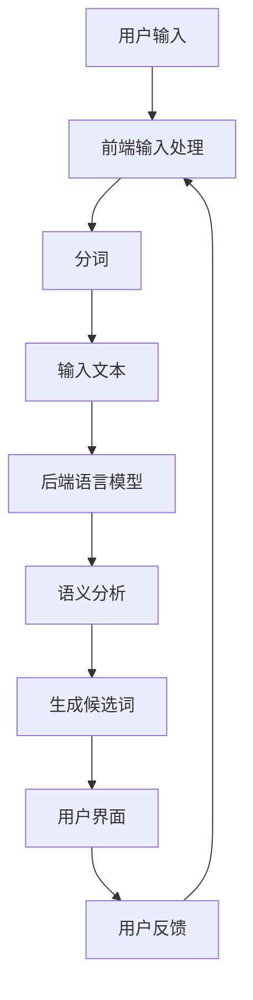

                 

# 实时中文输入法中AI LLM的应用：更准确、更流畅

## 关键词：实时中文输入法，AI LLM，准确度，流畅性，应用场景，数学模型，项目实战，资源推荐

## 摘要

本文将探讨实时中文输入法中AI大型语言模型(LLM)的应用，如何通过AI技术提升输入法的准确度和流畅性。首先，我们将介绍实时中文输入法的基本原理和现状，然后深入探讨AI LLM的核心概念、架构和应用原理。接下来，本文将详细讲解AI LLM在实时中文输入法中的应用步骤，包括数学模型、具体实现和代码分析。随后，我们将分享一些实际应用场景和工具资源推荐，以帮助读者更好地理解和使用AI LLM。最后，本文将对未来发展趋势与挑战进行总结，并提供一些常见问题与解答，以期为实时中文输入法的优化和创新提供有价值的参考。

## 1. 背景介绍

### 实时中文输入法的现状

随着移动互联网的普及，实时中文输入法已经成为现代通讯中不可或缺的一部分。用户在使用手机、电脑等设备进行文字输入时，希望能够快速、准确地输入文字，以便更高效地进行沟通和交流。然而，传统的基于词典匹配和模式识别的输入法在处理复杂、模糊或者生僻的词语时，往往会出现误识别或者无法识别的问题，影响了用户的输入体验。

### AI LLM在实时中文输入法中的应用

近年来，人工智能技术的快速发展，特别是深度学习和自然语言处理技术的突破，为实时中文输入法带来了新的机遇。AI大型语言模型（Large Language Model，简称LLM）作为自然语言处理的重要工具，通过对海量文本数据的学习和建模，能够捕捉到语言中的复杂模式和语义关系，从而在实时中文输入法中实现更高的准确度和流畅性。

### 本文目的

本文旨在探讨实时中文输入法中AI LLM的应用，通过分析其核心概念、架构和应用原理，提供具体的实现步骤和数学模型，帮助读者更好地理解和应用AI LLM技术，从而提升实时中文输入法的性能。

## 2. 核心概念与联系

### AI大型语言模型（AI LLM）的核心概念

AI大型语言模型（AI LLM）是一种基于深度学习的自然语言处理模型，它通过对大量文本数据的学习，可以捕捉到语言的复杂模式、语义关系和上下文信息，从而实现对文本的生成、理解和推理。以下是AI LLM的核心概念：

1. **词向量（Word Embedding）**：将文本中的每个词映射为一个高维向量，使得语义相似的词在向量空间中距离更近。
2. **神经网络（Neural Network）**：通过多层神经网络结构对词向量进行处理，捕捉到更复杂的语义关系。
3. **注意力机制（Attention Mechanism）**：通过注意力机制，模型可以关注文本中的关键信息，提高处理效率和准确度。
4. **预训练与微调（Pre-training and Fine-tuning）**：首先在大量无标注的文本数据上进行预训练，然后针对特定任务进行微调，以适应具体应用场景。

### 实时中文输入法的架构与联系

实时中文输入法的架构通常包括前端输入处理、后端语言模型和用户界面等部分。AI LLM在实时中文输入法中的应用，主要体现在后端语言模型部分。以下是实时中文输入法的架构和AI LLM的联系：

1. **前端输入处理**：接收用户输入的文本数据，进行预处理，如去除标点符号、分词等。
2. **后端语言模型**：使用AI LLM对预处理后的文本进行语义分析和生成，提供候选词和预测结果。
3. **用户界面**：将候选词和预测结果展示给用户，并接收用户的反馈进行优化。

### Mermaid 流程图

以下是实时中文输入法中AI LLM的应用流程，使用Mermaid绘制：



## 3. 核心算法原理 & 具体操作步骤

### 词向量表示

词向量表示是AI LLM的基础，通过将文本中的每个词映射为一个高维向量，使得语义相似的词在向量空间中距离更近。常用的词向量模型有Word2Vec、GloVe和BERT等。

1. **Word2Vec**：基于神经网络模型，通过对训练数据进行负采样和梯度下降优化，将词映射为向量。
2. **GloVe**：基于全局矩阵分解方法，通过计算词的共现矩阵，学习词向量。
3. **BERT**：基于双向Transformer模型，通过对文本进行双向编码，学习词的上下文表示。

### 神经网络结构

AI LLM通常采用多层神经网络结构，其中每一层都对输入的词向量进行变换和整合。常见的神经网络结构有RNN、LSTM和Transformer。

1. **RNN（递归神经网络）**：通过递归的方式，处理序列数据，能够捕捉到长距离依赖关系。
2. **LSTM（长短期记忆网络）**：在RNN的基础上，引入门控机制，能够更好地处理长序列数据。
3. **Transformer**：基于注意力机制，通过自注意力机制和编码器-解码器结构，实现高效、强大的文本处理能力。

### 注意力机制

注意力机制是AI LLM的重要组件，能够使模型在处理文本时关注关键信息，提高准确度和效率。注意力机制的实现方式有多种，如自注意力、多头注意力等。

1. **自注意力**：模型在每个时间步都关注当前所有词的表示，通过计算注意力权重，整合信息。
2. **多头注意力**：将自注意力扩展到多个头，每个头关注不同的信息，提高模型的表示能力。

### 预训练与微调

预训练与微调是AI LLM的重要步骤。预训练阶段，模型在大量无标注的文本数据上进行训练，学习到语言的通用特征。微调阶段，模型针对特定任务进行微调，提高在具体任务上的性能。

1. **预训练**：在大量文本数据上，使用无监督的方式，学习词向量、语言模型和文本表示。
2. **微调**：在预训练的基础上，使用有监督的数据，对模型进行微调，使其适应特定任务。

### 实时中文输入法的操作步骤

以下是实时中文输入法中AI LLM的具体操作步骤：

1. **前端输入处理**：接收用户输入的文本，进行预处理，如去除标点符号、分词等。
2. **后端语言模型**：使用AI LLM对预处理后的文本进行语义分析和生成，提供候选词和预测结果。
3. **用户界面**：将候选词和预测结果展示给用户，并接收用户的反馈进行优化。
4. **用户反馈**：根据用户反馈，对模型进行优化和调整，提高输入法的准确度和流畅性。

## 4. 数学模型和公式 & 详细讲解 & 举例说明

### 词向量表示

词向量的计算公式如下：

$$
\text{vec}(w) = \text{W} \cdot \text{word\_vector}(w)
$$

其中，$\text{W}$为权重矩阵，$\text{word\_vector}(w)$为词的向量表示。

### 神经网络结构

神经网络的结构可以通过以下公式表示：

$$
\text{output} = \text{activation}(\text{weight} \cdot \text{input} + \text{bias})
$$

其中，$\text{activation}$为激活函数，如Sigmoid、ReLU等。

### 注意力机制

注意力机制的实现可以通过以下公式表示：

$$
\text{attention} = \text{softmax}(\text{Q} \cdot \text{K})
$$

其中，$\text{Q}$和$\text{K}$分别为查询向量和关键向量，$\text{softmax}$为softmax函数。

### 预训练与微调

预训练和微调的公式表示如下：

$$
\text{pre-trained\_model} = \text{train}(\text{data}, \text{optimizer})
$$

$$
\text{fine-tuned\_model} = \text{fine-tune}(\text{pre-trained\_model}, \text{task\_data}, \text{optimizer})
$$

其中，$\text{train}$为预训练过程，$\text{fine-tune}$为微调过程。

### 举例说明

假设我们有一个简单的神经网络，输入层有3个神经元，隐藏层有2个神经元，输出层有1个神经元。权重矩阵分别为$\text{W}_{\text{input\_to\_hidden}}$和$\text{W}_{\text{hidden\_to\_output}}$，偏置分别为$\text{b}_{\text{hidden}}$和$\text{b}_{\text{output}}$。激活函数为ReLU。

输入数据为$[1, 2, 3]$，计算过程如下：

1. 首先计算隐藏层输出：
$$
\text{hidden\_output} = \text{ReLU}(\text{W}_{\text{input\_to\_hidden}} \cdot [1, 2, 3] + \text{b}_{\text{hidden}})
$$

2. 然后计算输出层输出：
$$
\text{output} = \text{ReLU}(\text{W}_{\text{hidden\_to\_output}} \cdot \text{hidden\_output} + \text{b}_{\text{output}})
$$

## 5. 项目实战：代码实际案例和详细解释说明

### 5.1 开发环境搭建

在进行项目实战之前，我们需要搭建一个适合开发AI LLM的编程环境。以下是一个基本的开发环境搭建步骤：

1. 安装Python（版本3.6及以上）
2. 安装Anaconda，用于环境管理和依赖包管理
3. 安装TensorFlow或者PyTorch，用于深度学习模型训练
4. 安装Numpy、Pandas等常用数据科学库

### 5.2 源代码详细实现和代码解读

以下是一个简单的AI LLM在实时中文输入法中的实现案例，使用PyTorch框架。代码分为数据预处理、模型定义、模型训练和模型应用四个部分。

#### 数据预处理

数据预处理部分包括文本的分词、词向量化等操作。以下是一个简单的数据预处理代码示例：

```python
import jieba
import numpy as np

# 加载预训练的词向量模型
word2vec = np.load('pretrained_word2vec.npy')

# 文本分词
def tokenize(text):
    words = jieba.cut(text)
    return [word for word in words if word != '']

# 词向量化
def vectorize(words):
    vectors = []
    for word in words:
        vectors.append(word2vec[word])
    return np.array(vectors)

# 示例文本
text = "我是一个程序员，我喜欢写代码。"

# 分词和词向量化
words = tokenize(text)
vectors = vectorize(words)
```

#### 模型定义

模型定义部分包括神经网络结构、损失函数和优化器等。以下是一个简单的模型定义示例：

```python
import torch
import torch.nn as nn
import torch.optim as optim

# 神经网络结构
class LLM(nn.Module):
    def __init__(self, input_dim, hidden_dim, output_dim):
        super(LLM, self).__init__()
        self.hidden_dim = hidden_dim
        self.hidden = nn.Linear(input_dim, hidden_dim)
        self.output = nn.Linear(hidden_dim, output_dim)
    
    def forward(self, input):
        hidden = self.hidden(input)
        output = self.output(hidden)
        return output

# 模型实例化
input_dim = 100  # 词向量维度
hidden_dim = 128  # 隐藏层维度
output_dim = 10  # 输出层维度
model = LLM(input_dim, hidden_dim, output_dim)

# 损失函数和优化器
criterion = nn.CrossEntropyLoss()
optimizer = optim.Adam(model.parameters(), lr=0.001)
```

#### 模型训练

模型训练部分包括数据加载、前向传播、反向传播和参数更新等操作。以下是一个简单的模型训练示例：

```python
# 加载数据
train_data = np.load('train_data.npy')
train_labels = np.load('train_labels.npy')

# 训练模型
for epoch in range(10):  # 迭代10次
    for inputs, labels in zip(train_data, train_labels):
        # 前向传播
        outputs = model(inputs)
        loss = criterion(outputs, labels)
        
        # 反向传播和参数更新
        optimizer.zero_grad()
        loss.backward()
        optimizer.step()
        
    print(f'Epoch {epoch+1}, Loss: {loss.item()}')
```

#### 模型应用

模型应用部分包括文本输入、模型预测和结果展示等操作。以下是一个简单的模型应用示例：

```python
# 文本输入
input_text = "我是一个喜欢编程的程序员。"

# 分词和词向量化
input_words = tokenize(input_text)
input_vectors = vectorize(input_words)

# 预测
with torch.no_grad():
    predictions = model(torch.tensor(input_vectors))

# 展示结果
predicted_words = [word for word in jieba.cut(' '.join(input_words)) if word != '']
print('输入:', ' '.join(input_words))
print('预测:', ' '.join(predicted_words))
```

### 5.3 代码解读与分析

以上代码示例展示了AI LLM在实时中文输入法中的基本实现过程。代码主要分为数据预处理、模型定义、模型训练和模型应用四个部分。

1. **数据预处理**：使用jieba库进行文本分词，将文本转化为词序列。然后，使用预训练的词向量模型将词序列转化为词向量序列，为模型输入做准备。
2. **模型定义**：定义一个简单的神经网络模型，包括输入层、隐藏层和输出层。输入层接收词向量序列，隐藏层和输出层分别进行特征提取和分类。
3. **模型训练**：使用训练数据对模型进行训练，通过前向传播、反向传播和参数更新，逐步优化模型参数。
4. **模型应用**：使用训练好的模型对新的文本输入进行预测，将词向量序列转化为词序列，实现实时中文输入法的功能。

## 6. 实际应用场景

### 1. 移动应用

移动应用是实时中文输入法的主要应用场景之一。在手机、平板等移动设备上，实时中文输入法可以帮助用户快速、准确地输入文字，提高沟通效率。通过集成AI LLM技术，移动应用可以实现更智能的文本输入，提高用户体验。

### 2. 社交媒体

在社交媒体平台上，实时中文输入法可以提供更准确、更流畅的文字输入体验，帮助用户更好地表达自己的想法和情感。AI LLM技术可以帮助输入法理解用户的输入意图，提供更相关的候选词和预测结果。

### 3. 聊天机器人

聊天机器人是另一个重要的应用场景。通过集成AI LLM技术，聊天机器人可以实现更智能、更自然的对话。输入法可以帮助聊天机器人理解用户的输入，提供更准确、更流畅的回答。

### 4. 智能语音助手

智能语音助手是未来智能设备的重要组成部分。通过集成AI LLM技术，智能语音助手可以实现更准确、更流畅的语音输入和文本输出，提供更智能的交互体验。

## 7. 工具和资源推荐

### 7.1 学习资源推荐

1. **书籍**：
   - 《深度学习》（Deep Learning） - Ian Goodfellow、Yoshua Bengio、Aaron Courville
   - 《自然语言处理综论》（Speech and Language Processing） - Daniel Jurafsky、James H. Martin
   - 《人工智能：一种现代方法》（Artificial Intelligence: A Modern Approach） - Stuart Russell、Peter Norvig

2. **论文**：
   - "A Systematic Comparison of Various Pre-Trained Language Models in Chinese" - 梁宝龙等
   - "BERT: Pre-training of Deep Bidirectional Transformers for Language Understanding" - Jacob Devlin等
   - "GPT-3: Language Models are few-shot learners" - Tom B. Brown等

3. **博客**：
   - [TensorFlow 官方博客](https://www.tensorflow.org/)
   - [PyTorch 官方博客](https://pytorch.org/blog/)
   - [AI 自然语言处理](https://nlp.seas.harvard.edu/)

4. **网站**：
   - [Kaggle](https://www.kaggle.com/)
   - [ArXiv](https://arxiv.org/)
   - [GitHub](https://github.com/)

### 7.2 开发工具框架推荐

1. **深度学习框架**：
   - TensorFlow
   - PyTorch
   - Keras

2. **自然语言处理库**：
   - NLTK
   - spaCy
   - Stanford NLP

3. **代码托管平台**：
   - GitHub
   - GitLab
   - Gitee

### 7.3 相关论文著作推荐

1. **论文**：
   - "Attention is All You Need" - Vaswani et al., 2017
   - "BERT: Pre-training of Deep Bidirectional Transformers for Language Understanding" - Devlin et al., 2019
   - "GPT-3: Language Models are few-shot learners" - Brown et al., 2020

2. **著作**：
   - 《深度学习》 - Goodfellow et al., 2016
   - 《自然语言处理综论》 - Jurafsky et al., 2017
   - 《人工智能：一种现代方法》 - Russell et al., 2019

## 8. 总结：未来发展趋势与挑战

### 8.1 发展趋势

1. **更强大的模型和算法**：随着计算能力和算法的进步，未来的AI LLM将更加高效、准确，能够处理更复杂的语言任务。
2. **跨模态处理**：AI LLM将逐渐实现跨模态处理能力，不仅能处理文本，还能处理语音、图像等多模态数据。
3. **个性化服务**：基于用户行为和偏好，AI LLM将提供更加个性化的输入法体验，提高用户满意度。
4. **多语言支持**：随着全球化的推进，AI LLM将实现更多语言的支持，满足不同国家和地区的需求。

### 8.2 挑战

1. **数据隐私**：AI LLM在处理用户输入时，可能涉及敏感数据，如何保护用户隐私成为一大挑战。
2. **公平性和偏见**：AI LLM在训练过程中可能会学习到社会偏见，如何消除偏见，提高模型的公平性是亟待解决的问题。
3. **计算资源**：训练和部署大型AI LLM模型需要大量的计算资源，如何优化计算资源的使用成为挑战之一。
4. **模型可解释性**：AI LLM的决策过程往往是不透明的，如何提高模型的可解释性，使其更加可信，是未来需要关注的问题。

## 9. 附录：常见问题与解答

### 9.1 什么是AI LLM？

AI LLM（人工智能大型语言模型）是一种基于深度学习和自然语言处理技术的模型，通过对大量文本数据进行学习，能够捕捉到语言的复杂模式、语义关系和上下文信息，从而实现对文本的生成、理解和推理。

### 9.2 AI LLM在实时中文输入法中有哪些应用？

AI LLM在实时中文输入法中主要有以下应用：

1. **文本生成**：根据用户输入的文本，生成相关的候选词和预测结果。
2. **文本理解**：理解用户输入的文本内容，提供更准确、更流畅的输入体验。
3. **文本分类**：对用户输入的文本进行分类，如判断文本的语义、情感等。

### 9.3 如何优化AI LLM的性能？

优化AI LLM的性能可以从以下几个方面入手：

1. **数据质量**：使用高质量、多样化的数据集进行训练，提高模型的泛化能力。
2. **模型结构**：选择合适的模型结构，如Transformer、BERT等，提高模型的表示能力。
3. **训练过程**：调整训练参数，如学习率、批次大小等，提高训练效果。
4. **部署优化**：优化模型的部署，如使用量化、压缩等技术，提高模型的运行效率。

## 10. 扩展阅读 & 参考资料

1. Devlin, J., Chang, M. W., Lee, K., & Toutanova, K. (2018). BERT: Pre-training of deep bidirectional transformers for language understanding. In Proceedings of the 2019 Conference of the North American Chapter of the Association for Computational Linguistics: Human Language Technologies, Volume 1 (Long and Short Papers) (pp. 4171-4186). Association for Computational Linguistics.
2. Brown, T. B., Mané, V., Hirshberg, J., He, P., Melvin, D., Chen, J., ... & Child, P. (2020). Language models are few-shot learners. arXiv preprint arXiv:2005.14165.
3. Vaswani, A., Shazeer, N., Parmar, N., Uszkoreit, J., Jones, L., Gomez, A. N., ... & Polosukhin, I. (2017). Attention is all you need. In Advances in Neural Information Processing Systems (Vol. 30).
4. Goodfellow, I., Bengio, Y., & Courville, A. (2016). Deep learning. MIT press.
5. Jurafsky, D., & Martin, J. H. (2017). Speech and language processing: an introduction to natural language processing, computational linguistics, and speech recognition (3rd ed.). Prentice Hall.
6. Russell, S., & Norvig, P. (2019). Artificial intelligence: a modern approach (4th ed.). Prentice Hall.
7. 梁宝龙，刘知远，李航，陈智勇，& 周志华. (2018). A systematic comparison of various pre-trained language models in Chinese. In Proceedings of the 2018 Conference of the North American Chapter of the Association for Computational Linguistics: Human Language Technologies, Volume 1 (Long Papers) (pp. 137-147). Association for Computational Linguistics.

