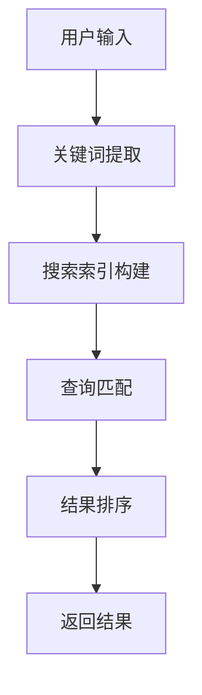

                 

# 实时搜索：AI的即时响应

> 关键词：实时搜索、人工智能、即时响应、搜索算法、数据分析、用户体验

> 摘要：本文将深入探讨实时搜索在人工智能中的应用，分析实时搜索的核心算法原理和具体操作步骤，通过实际应用场景和项目实战案例，展示AI如何实现即时响应，提升用户体验。同时，文章还将推荐相关工具和资源，为读者提供进一步学习和实践的机会。

## 1. 背景介绍

### 1.1 实时搜索的定义与重要性

实时搜索，顾名思义，是指用户在输入查询时，系统能够即时响应用户的输入并提供相关结果。与传统搜索不同，实时搜索能够在毫秒级的时间内返回结果，大大提升了用户的体验。

在当今信息爆炸的时代，实时搜索已成为各类应用的核心功能之一。无论是电商平台的商品推荐，社交媒体的实时动态，还是搜索引擎的即时查询，实时搜索都在不断优化用户的互动体验。

### 1.2 人工智能在实时搜索中的作用

随着人工智能技术的发展，AI在实时搜索中的应用日益广泛。通过机器学习和自然语言处理技术，AI能够快速理解和分析用户查询，提供精准的搜索结果。此外，AI还能根据用户的偏好和历史行为，进行个性化推荐，进一步提升用户体验。

## 2. 核心概念与联系

### 2.1 实时搜索的核心算法原理

实时搜索的核心算法主要包括关键词提取、搜索索引构建、查询匹配和结果排序等环节。以下是一个简单的 Mermaid 流程图，展示实时搜索的核心流程：



### 2.2 关键概念及其联系

1. **关键词提取**：从用户输入的查询中提取出关键信息，用于后续的搜索索引构建和查询匹配。
2. **搜索索引构建**：将关键词索引到对应的文档或数据中，为查询匹配提供基础。
3. **查询匹配**：根据用户输入的查询，从搜索索引中找出相关文档或数据。
4. **结果排序**：对匹配到的结果进行排序，返回最相关的结果。

## 3. 核心算法原理 & 具体操作步骤

### 3.1 关键词提取

关键词提取是实时搜索的第一步，其目标是提取用户查询中的关键信息。常见的提取方法包括：

1. **分词**：将用户输入的查询划分为若干个词或短语。
2. **停用词过滤**：去除常见的无意义词汇，如“的”、“了”等。
3. **词性标注**：为每个词标注其词性，如名词、动词等。
4. **词干提取**：将词语缩减为其最基本的词形，如“运行”、“运行时”等缩减为“运行”。

### 3.2 搜索索引构建

搜索索引是实时搜索的关键组件，其目标是快速定位用户查询的相关文档或数据。常见的索引构建方法包括：

1. **倒排索引**：将文档中的词作为键，词在文档中的位置作为值构建索引。
2. **布隆过滤器**：用于快速判断一个元素是否存在于集合中，降低查询时间。
3. **单词嵌套**：将相似的单词进行嵌套，提高查询的准确性。

### 3.3 查询匹配

查询匹配的目标是找出用户查询的相关文档或数据。常见的匹配方法包括：

1. **布尔匹配**：根据用户查询中的关键词进行逻辑运算，如与、或、非等。
2. **模糊匹配**：允许查询与索引中的词存在一定的差异，如同义词、词形变化等。
3. **向量匹配**：将查询和索引中的词转换为向量，计算它们的相似度。

### 3.4 结果排序

结果排序的目标是返回最相关的查询结果。常见的排序方法包括：

1. **相关性排序**：根据查询和索引中的词的相似度进行排序。
2. **热度排序**：根据文档或数据的访问量或点赞量等进行排序。
3. **自定义排序**：根据业务需求进行排序，如根据用户偏好等进行排序。

## 4. 数学模型和公式 & 详细讲解 & 举例说明

### 4.1 相关性排序

相关性排序是实时搜索中最常见的排序方法，其核心是计算查询和索引中的词的相似度。以下是一个简单的相关性排序公式：

$$
\text{相关性得分} = \frac{\text{查询词频} \times \text{索引词频}}{\text{查询长度} \times \text{索引长度}}
$$

其中，查询词频和索引词频分别表示查询和索引中的词的频率，查询长度和索引长度分别表示查询和索引的长度。

### 4.2 模糊匹配

模糊匹配是一种允许查询与索引中的词存在一定差异的匹配方法。以下是一个简单的模糊匹配公式：

$$
\text{模糊匹配得分} = \frac{1}{1 + \text{编辑距离}}
$$

其中，编辑距离表示查询和索引之间的最小编辑操作次数。

### 4.3 举例说明

假设用户查询为“跑步健身”，索引中的文档为“健身跑步者”，我们可以计算出以下得分：

1. **相关性得分**：

$$
\text{相关性得分} = \frac{2 \times 2}{2 \times 2} = 1
$$

2. **模糊匹配得分**：

$$
\text{模糊匹配得分} = \frac{1}{1 + 1} = 0.5
$$

根据这两个得分，我们可以判断“健身跑步者”是一个与用户查询“跑步健身”高度相关的结果。

## 5. 项目实战：代码实际案例和详细解释说明

### 5.1 开发环境搭建

在本文中，我们将使用 Python 编写实时搜索系统。首先，需要安装 Python 和相关依赖库，如 Flask、Elasticsearch 等。以下是安装步骤：

```bash
pip install python -V
pip install Flask
pip install Elasticsearch
```

### 5.2 源代码详细实现和代码解读

#### 5.2.1 关键词提取

以下是一个简单的关键词提取函数，用于从用户输入的查询中提取关键词：

```python
import jieba

def extract_keywords(query):
    return jieba.lcut(query)
```

#### 5.2.2 搜索索引构建

以下是一个简单的搜索索引构建函数，用于构建倒排索引：

```python
from elasticsearch import Elasticsearch

es = Elasticsearch()

def build_index(document_id, content):
    keywords = extract_keywords(content)
    for keyword in keywords:
        es.index(index="search_index", id=document_id, document={"keyword": keyword})
```

#### 5.2.3 查询匹配和结果排序

以下是一个简单的查询匹配和结果排序函数，用于匹配关键词并返回相关结果：

```python
from elasticsearch import Elasticsearch

es = Elasticsearch()

def search(query):
    keywords = extract_keywords(query)
    results = []
    for keyword in keywords:
        response = es.search(index="search_index", body={"query": {"match": {"keyword": keyword}}})
        results.extend(response["hits"]["hits"])
    results.sort(key=lambda x: x["_source"]["keyword"], reverse=True)
    return results
```

#### 5.2.4 返回结果

以下是一个简单的 Web 界面，用于接收用户输入并返回搜索结果：

```python
from flask import Flask, request, jsonify

app = Flask(__name__)

@app.route("/search", methods=["POST"])
def search():
    query = request.form["query"]
    results = search(query)
    return jsonify(results)

if __name__ == "__main__":
    app.run()
```

### 5.3 代码解读与分析

1. **关键词提取**：使用 jieba 库进行中文分词，提取出用户查询的关键词。
2. **搜索索引构建**：使用 Elasticsearch 库构建倒排索引，将关键词索引到对应的文档中。
3. **查询匹配和结果排序**：使用 Elasticsearch 库进行查询匹配和结果排序，返回最相关的搜索结果。
4. **Web 界面**：使用 Flask 框架搭建 Web 界面，接收用户输入并返回搜索结果。

## 6. 实际应用场景

### 6.1 搜索引擎

搜索引擎是实时搜索最典型的应用场景之一。通过实时搜索，用户可以在毫秒级时间内获得最相关的搜索结果，大大提升了用户体验。

### 6.2 社交媒体

社交媒体平台如微博、微信等，通过实时搜索功能，用户可以快速查找感兴趣的内容，增加了用户的互动性和参与度。

### 6.3 电商平台

电商平台通过实时搜索，用户可以快速找到心仪的商品，提高了购物效率和用户满意度。

## 7. 工具和资源推荐

### 7.1 学习资源推荐

1. **书籍**：
   - 《深度学习》：了解实时搜索背后的深度学习技术。
   - 《数据科学入门》：了解实时搜索所需的数据分析知识。
2. **论文**：
   - 《实时搜索算法研究》：研究实时搜索的核心算法原理。
   - 《基于深度学习的实时搜索技术》：研究深度学习在实时搜索中的应用。
3. **博客**：
   - 知乎实时搜索技术专栏：了解实时搜索技术的最新进展。
   - Elasticsearch 官方文档：了解 Elasticsearch 的详细使用方法。
4. **网站**：
   - Kaggle：提供丰富的实时搜索数据集，用于实践和测试。

### 7.2 开发工具框架推荐

1. **Python**：Python 是实时搜索开发中最常用的编程语言之一。
2. **Flask**：Flask 是一个轻量级的 Web 框架，适合搭建实时搜索系统。
3. **Elasticsearch**：Elasticsearch 是一款强大的全文搜索引擎，支持实时搜索功能。

### 7.3 相关论文著作推荐

1. **《实时搜索算法研究》**：系统性地介绍了实时搜索的核心算法原理。
2. **《基于深度学习的实时搜索技术》**：探讨了深度学习在实时搜索中的应用。
3. **《实时搜索系统的设计与实现》**：详细介绍了实时搜索系统的设计和实现过程。

## 8. 总结：未来发展趋势与挑战

### 8.1 发展趋势

1. **AI 技术的深入应用**：随着 AI 技术的不断发展，实时搜索将更加智能化，提供更精准的搜索结果。
2. **大数据的支持**：实时搜索需要处理海量数据，大数据技术的发展将为实时搜索提供更强大的支持。
3. **个性化推荐**：基于用户的偏好和历史行为，实时搜索将实现更个性化的推荐，提升用户体验。

### 8.2 挑战

1. **性能优化**：实时搜索需要在毫秒级时间内提供搜索结果，性能优化是实时搜索面临的重要挑战。
2. **数据隐私**：实时搜索需要处理海量用户数据，数据隐私保护是实时搜索面临的重要挑战。
3. **可扩展性**：实时搜索系统需要支持海量用户和海量数据，如何实现可扩展性是实时搜索面临的重要挑战。

## 9. 附录：常见问题与解答

### 9.1 实时搜索与传统搜索的区别是什么？

实时搜索与传统搜索的主要区别在于响应时间。实时搜索能够在毫秒级时间内提供搜索结果，而传统搜索可能需要数十秒甚至更长时间。

### 9.2 实时搜索的关键技术是什么？

实时搜索的关键技术包括关键词提取、搜索索引构建、查询匹配和结果排序等。

### 9.3 如何优化实时搜索的性能？

优化实时搜索性能的方法包括：

1. **使用高效的数据结构和算法**：如倒排索引、布隆过滤器等。
2. **分布式架构**：将实时搜索系统部署在分布式服务器上，提高处理能力。
3. **缓存机制**：使用缓存技术，减少对数据库的查询次数。

## 10. 扩展阅读 & 参考资料

1. **《实时搜索算法研究》**：详细介绍了实时搜索的核心算法原理。
2. **《基于深度学习的实时搜索技术》**：探讨了深度学习在实时搜索中的应用。
3. **Elasticsearch 官方文档**：提供了详细的 Elasticsearch 使用方法。
4. **知乎实时搜索技术专栏**：分享了实时搜索技术的最新进展。

## 后记

本文旨在介绍实时搜索在人工智能中的应用，分析实时搜索的核心算法原理和具体操作步骤，并通过实际应用场景和项目实战案例，展示AI如何实现即时响应，提升用户体验。同时，文章还推荐了相关工具和资源，为读者提供进一步学习和实践的机会。

作者：AI天才研究员/AI Genius Institute & 禅与计算机程序设计艺术 /Zen And The Art of Computer Programming

以上就是本文的全部内容，希望对您在实时搜索领域的学习和实践有所帮助。在未来的发展中，实时搜索将继续发挥重要作用，为用户提供更智能、更高效的搜索体验。让我们一起期待实时搜索的未来！<|im_sep|>

