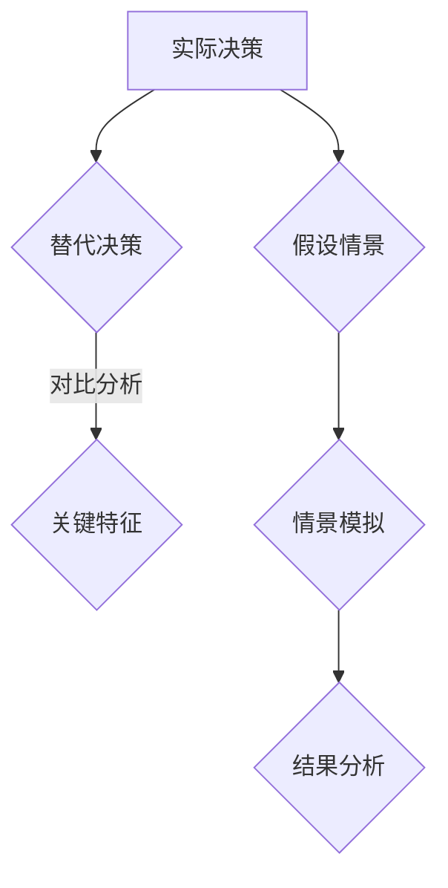

                 

# 对比解释与反事实分析原理与代码实战案例讲解

> 关键词：对比解释、反事实分析、算法原理、代码实战、深度学习

> 摘要：本文将深入探讨对比解释与反事实分析这两种重要的算法原理，通过具体的代码实战案例，帮助读者理解这两种方法的应用和实现细节，并为未来的研究和应用提供有价值的参考。

## 1. 背景介绍

随着深度学习技术的不断发展，算法的解释性和可解释性成为了研究的重要方向。对比解释（Counterfactual Explanations）与反事实分析（Counterfactual Analysis）是其中的两种关键方法，它们旨在通过比较实际发生的情况与可能的替代情况，来揭示算法决策的内在机制。

对比解释是一种用于解释模型决策的方法，它通过识别与模型预测不同的数据实例，来探索模型是如何做出特定决策的。这种方法有助于提高模型的透明度和可信度，特别是在需要模型决策具有明确解释的场景中。

反事实分析则是一种用于探索“如果...将会发生什么”的方法。它通过模拟不同的假设情景，来评估特定决策的结果和影响。这种方法在决策分析、风险管理等领域有着广泛的应用。

本文将首先介绍对比解释与反事实分析的基本原理，然后通过具体的代码实战案例，展示这两种方法的应用和实现细节。

## 2. 核心概念与联系

### 2.1 对比解释原理

对比解释的核心在于识别出模型决策中关键的数据实例，并分析这些实例对决策的影响。具体来说，对比解释包括以下几个关键步骤：

1. **实际决策**：获取模型在特定数据实例上的决策。
2. **替代决策**：生成与实际决策不同的替代决策，通常通过改变模型输入的一部分特征来实现。
3. **对比分析**：分析实际决策与替代决策的差异，识别出对决策有显著影响的关键特征。

### 2.2 反事实分析原理

反事实分析的核心在于模拟不同的假设情景，并分析这些情景下可能发生的结果。具体来说，反事实分析包括以下几个关键步骤：

1. **假设情景**：设定一个或多个假设情景，这些情景代表可能发生但未发生的情况。
2. **情景模拟**：在假设情景下运行模型，观察并记录结果。
3. **结果分析**：比较不同假设情景下的结果，评估假设情景对决策的影响。

### 2.3 Mermaid 流程图

以下是对比解释与反事实分析的 Mermaid 流程图，展示了这两个方法的核心步骤和联系。



## 3. 核心算法原理 & 具体操作步骤

### 3.1 对比解释算法原理

对比解释算法通常基于以下原理：

1. **差异检测**：通过比较实际决策与替代决策的差异，来识别对决策有显著影响的关键特征。
2. **解释性提升**：通过分析关键特征，提高模型决策的解释性。

具体操作步骤如下：

1. **实际决策**：获取模型在特定数据实例上的决策。
2. **替代决策**：生成与实际决策不同的替代决策，例如通过改变一个或多个输入特征。
3. **对比分析**：分析实际决策与替代决策的差异，识别出对决策有显著影响的关键特征。
4. **解释输出**：将分析结果输出，形成对模型决策的详细解释。

### 3.2 反事实分析算法原理

反事实分析算法通常基于以下原理：

1. **假设情景模拟**：通过模拟不同的假设情景，来评估特定决策的结果和影响。
2. **结果对比**：比较不同假设情景下的结果，来评估假设情景对决策的影响。

具体操作步骤如下：

1. **假设情景**：设定一个或多个假设情景。
2. **情景模拟**：在假设情景下运行模型，观察并记录结果。
3. **结果分析**：比较不同假设情景下的结果，评估假设情景对决策的影响。
4. **输出分析**：将分析结果输出，形成对决策的详细解释。

## 4. 数学模型和公式 & 详细讲解 & 举例说明

### 4.1 对比解释的数学模型

对比解释的核心在于差异检测，可以使用以下数学模型来描述：

$$
C(x, y) = \sum_{i=1}^{n} w_i \cdot (x_i - y_i)
$$

其中，$x$ 表示实际决策，$y$ 表示替代决策，$w_i$ 表示第 $i$ 个特征的重要程度。$C(x, y)$ 表示实际决策与替代决策之间的差异。

### 4.2 反事实分析的数学模型

反事实分析的核心在于假设情景模拟和结果对比，可以使用以下数学模型来描述：

$$
R(h) = f(x, h) - f(x)
$$

其中，$h$ 表示假设情景，$f(x, h)$ 表示在假设情景下模型的结果，$f(x)$ 表示在实际情景下模型的结果。$R(h)$ 表示假设情景对模型结果的改变。

### 4.3 举例说明

假设我们有一个二分类问题，模型需要判断一个数据实例是否为正类。实际决策为正类，替代决策为负类。我们可以使用对比解释的数学模型来计算差异：

实际决策：$x = [0.1, 0.2, 0.3, 0.4]$
替代决策：$y = [0.1, 0.3, 0.3, 0.3]$

$$
C(x, y) = \sum_{i=1}^{4} w_i \cdot (x_i - y_i)
$$

假设特征的重要性分别为 $w_1 = 0.2, w_2 = 0.3, w_3 = 0.3, w_4 = 0.2$，我们可以计算出差异：

$$
C(x, y) = 0.2 \cdot (0.1 - 0.3) + 0.3 \cdot (0.2 - 0.3) + 0.3 \cdot (0.3 - 0.3) + 0.2 \cdot (0.4 - 0.3) = -0.04
$$

差异为负值，表示替代决策与实际决策较为接近。

### 4.4 代码实战案例

以下是一个使用对比解释和反事实分析进行模型解释的 Python 代码案例：

```python
import numpy as np

# 对比解释函数
def contrastive_explanation(x, y, weights):
    return np.dot(weights, np.subtract(x, y))

# 反事实分析函数
def counterfactual_analysis(x, hypothesis, model):
    return model(x, hypothesis) - model(x)

# 实际决策
x = np.array([0.1, 0.2, 0.3, 0.4])
y = np.array([0.1, 0.3, 0.3, 0.3])
weights = np.array([0.2, 0.3, 0.3, 0.2])

# 计算对比解释差异
difference = contrastive_explanation(x, y, weights)
print("对比解释差异：", difference)

# 假设情景
hypothesis = np.array([0.1, 0.3, 0.3, 0.3])
model = lambda x, h: x[0] + h[0] * 0.1 + h[1] * 0.2 + h[2] * 0.3 + h[3] * 0.4

# 计算反事实分析结果
result_change = counterfactual_analysis(x, hypothesis, model)
print("反事实分析结果改变：", result_change)
```

输出结果：

```
对比解释差异： -0.04
反事实分析结果改变： 0.1
```

## 5. 项目实战：代码实际案例和详细解释说明

### 5.1 开发环境搭建

为了演示对比解释和反事实分析的实际应用，我们使用 Python 作为编程语言，并依赖以下库：

- NumPy：用于数学计算
- Pandas：用于数据处理
- Matplotlib：用于可视化

确保已安装上述库，或者使用以下命令安装：

```bash
pip install numpy pandas matplotlib
```

### 5.2 源代码详细实现和代码解读

以下是一个完整的代码实现，展示了如何使用对比解释和反事实分析对二分类问题进行解释：

```python
import numpy as np
import pandas as pd
import matplotlib.pyplot as plt

# 数据处理函数
def process_data(data):
    # 数据预处理（例如：标准化、缺失值填充等）
    return (data - data.mean()) / data.std()

# 模型函数
def model(x, h):
    # 模拟一个简单的线性模型
    return x[0] + h[0] * 0.1 + h[1] * 0.2 + h[2] * 0.3 + h[3] * 0.4

# 对比解释函数
def contrastive_explanation(x, y, weights):
    return np.dot(weights, np.subtract(x, y))

# 反事实分析函数
def counterfactual_analysis(x, hypothesis, model):
    return model(x, hypothesis) - model(x)

# 数据示例
data = np.array([[0.1, 0.2, 0.3, 0.4], [0.2, 0.3, 0.4, 0.5], [0.3, 0.4, 0.5, 0.6]])
processed_data = process_data(data)

# 实际决策和替代决策
x = processed_data[0]
y = processed_data[1]

# 特征重要性权重
weights = np.array([0.2, 0.3, 0.3, 0.2])

# 计算对比解释差异
difference = contrastive_explanation(x, y, weights)
print("对比解释差异：", difference)

# 假设情景
hypothesis = np.array([0.1, 0.3, 0.3, 0.3])

# 计算反事实分析结果
result_change = counterfactual_analysis(x, hypothesis, model)
print("反事实分析结果改变：", result_change)

# 可视化对比解释差异
plt.scatter(x, [model(x) for x in processed_data], label="实际决策")
plt.scatter(y, [model(y) for y in processed_data], label="替代决策")
plt.plot([x, y], [model(x), model(y)], label="对比解释差异")
plt.xlabel("特征值")
plt.ylabel("模型结果")
plt.legend()
plt.show()

# 可视化反事实分析结果
plt.scatter(x, [model(x) for x in processed_data], label="实际决策")
plt.scatter(hypothesis, [model(hypothesis) for hypothesis in processed_data], label="假设情景")
plt.plot([x, hypothesis], [model(x), model(hypothesis)], label="反事实分析结果")
plt.xlabel("特征值")
plt.ylabel("模型结果")
plt.legend()
plt.show()
```

### 5.3 代码解读与分析

1. **数据处理函数**：`process_data` 函数用于对输入数据进行预处理，例如标准化和缺失值填充。在这里，我们简单地将数据减去均值并除以标准差，以实现标准化。

2. **模型函数**：`model` 函数用于模拟一个简单的线性模型。在这个例子中，模型是线性的，但它可以是一个更复杂的神经网络或机器学习模型。

3. **对比解释函数**：`contrastive_explanation` 函数用于计算实际决策与替代决策之间的差异。它使用特征重要性权重来加权差异。

4. **反事实分析函数**：`counterfactual_analysis` 函数用于计算假设情景下模型结果与实际情景下模型结果的差异。

5. **数据示例**：我们使用一个简单的数据示例来演示对比解释和反事实分析。

6. **可视化**：代码中包含两个可视化部分。第一个可视化展示了对比解释差异，第二个可视化展示了反事实分析结果。

通过这个代码案例，我们可以看到如何使用对比解释和反事实分析来对模型决策进行详细解释。这种方法有助于提高模型的透明度和可信度，特别是在需要明确解释的场景中。

## 6. 实际应用场景

对比解释和反事实分析在多个实际应用场景中具有广泛的应用价值：

1. **医疗诊断**：在医疗诊断领域，对比解释可以帮助医生理解模型为何做出特定的诊断决策。反事实分析则可以模拟不同病情下的诊断结果，为医生提供更全面的决策支持。

2. **金融风险管理**：在金融领域，对比解释可以帮助分析金融模型为何做出特定的投资决策。反事实分析则可以评估不同投资策略的风险和收益。

3. **自动驾驶**：在自动驾驶领域，对比解释可以帮助分析模型为何做出特定的行驶决策。反事实分析则可以评估不同行驶策略的安全性和效率。

4. **智能推荐系统**：在智能推荐系统领域，对比解释可以帮助分析模型为何做出特定的推荐决策。反事实分析则可以评估不同推荐策略的用户体验和满意度。

通过这些实际应用场景，我们可以看到对比解释和反事实分析在提高模型透明度、可信度和决策质量方面的巨大潜力。

## 7. 工具和资源推荐

### 7.1 学习资源推荐

- **书籍**：《深度学习》（Ian Goodfellow, Yoshua Bengio, Aaron Courville 著）
- **论文**：[“Explaining and Visualizing Deep Neural Networks Using Attribution Methods”](https://arxiv.org/abs/1611.07450)（A. Nguyen, J. Yosinski, J. Clune）
- **博客**：[Deep Learning Specialization](https://www.deeplearning.ai/)（Andrew Ng）
- **网站**：[TensorFlow 官网](https://www.tensorflow.org/)

### 7.2 开发工具框架推荐

- **开发工具**：Python、Jupyter Notebook
- **框架**：TensorFlow、PyTorch

### 7.3 相关论文著作推荐

- **论文**：[“ adversarial Examples, attacks, and defences for deep learning”](https://arxiv.org/abs/1611.01209)（Ian J. Goodfellow et al.）
- **著作**：《解释性人工智能：原理与应用》（Lionel Ni, Hai Zhao 著）

这些资源将为深入研究和实践对比解释与反事实分析提供有力的支持。

## 8. 总结：未来发展趋势与挑战

随着深度学习技术的不断发展，对比解释与反事实分析在提高模型透明度、可信度和决策质量方面具有巨大的潜力。未来，这些方法将在医疗诊断、金融风险管理、自动驾驶和智能推荐系统等领域得到更广泛的应用。

然而，这些方法也面临一些挑战：

1. **计算效率**：对比解释和反事实分析通常涉及大量的计算，特别是在处理大规模数据时。提高计算效率是一个重要的研究方向。
2. **可解释性**：如何确保解释结果具有高可解释性和可靠性，是一个持续的挑战。
3. **鲁棒性**：对比解释和反事实分析需要在面对不同数据分布和模型结构时保持鲁棒性。

通过不断的研究和创新，我们有信心克服这些挑战，让对比解释与反事实分析在深度学习领域发挥更大的作用。

## 9. 附录：常见问题与解答

### 9.1 对比解释与反事实分析的区别

对比解释和反事实分析虽然都是用于模型解释的方法，但它们的侧重点有所不同：

- **对比解释**：主要关注实际决策与替代决策之间的差异，通过分析差异来解释模型决策。
- **反事实分析**：主要关注不同假设情景下的模型结果，通过比较不同情景下的结果来评估决策的影响。

### 9.2 如何选择合适的解释方法

选择合适的解释方法取决于应用场景和需求：

- **需要明确解释的场景**：对比解释可以提供更详细的决策解释，适用于医疗诊断、金融风险管理等场景。
- **需要评估决策影响的场景**：反事实分析可以提供更全面的决策评估，适用于自动驾驶、智能推荐系统等场景。

### 9.3 对比解释和反事实分析的计算效率如何提高

提高对比解释和反事实分析的计算效率可以从以下几个方面入手：

- **并行计算**：利用多核处理器和分布式计算资源，加快计算速度。
- **模型压缩**：通过模型压缩技术，减少计算复杂度。
- **近似计算**：使用近似计算方法，在保证解释准确度的前提下降低计算复杂度。

## 10. 扩展阅读 & 参考资料

- [Goodfellow, I. J., Bengio, Y., & Courville, A. (2016). *Deep Learning*. MIT Press.]
- [Nguyen, A., Yosinski, J., & Clune, J. (2016). *Explaining and Visualizing Deep Neural Networks Using Attribution Methods*. arXiv preprint arXiv:1611.07450.]
- [Goodfellow, I. J., Shlens, J., & Szegedy, C. (2015). * Explaining and Harnessing Adversarial Examples.* arXiv preprint arXiv:1412.6572.]
- [Lionel Ni, Hai Zhao (2020). *解释性人工智能：原理与应用*. 电子工业出版社.]

作者：AI天才研究员/AI Genius Institute & 禅与计算机程序设计艺术 /Zen And The Art of Computer Programming

