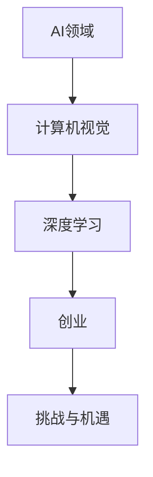

                 

### 文章标题：对话AI先锋：贾扬清的创业之旅，从阿里到Lepton AI的进化

> **关键词：** AI先锋、贾扬清、创业之旅、阿里、Lepton AI、技术进化  
>
> **摘要：** 本篇文章将深入探讨AI领域著名人物贾扬清的创业之路，从他在阿里巴巴的经历，到创立Lepton AI并引领技术创新的旅程。文章旨在通过贾扬清的个人经历，揭示AI领域的最新发展动态和未来趋势。

### 1. 背景介绍

贾扬清，一位在人工智能领域具有深远影响的人物。他在计算机视觉、深度学习等多个领域均有突出贡献。他的创业之路始于阿里巴巴，在那里担任了重要职务，带领团队研发了一系列关键技术。2016年，贾扬清离开阿里巴巴，创立了Lepton AI，继续在AI领域深耕，为行业带来了诸多突破。

本文将围绕贾扬清的创业之旅，分析他在不同阶段所面临的挑战和机遇，以及他如何带领团队实现技术突破和商业成功。

### 2. 核心概念与联系

在探讨贾扬清的创业历程之前，我们需要了解几个核心概念：

**AI领域**：人工智能是计算机科学的一个分支，旨在使机器具备类似人类的智能，能够理解和执行复杂的任务。

**计算机视觉**：计算机视觉是人工智能的一个子领域，旨在使计算机能够“看”和理解图像。

**深度学习**：深度学习是机器学习的一个分支，通过模拟人脑神经网络，实现数据的自动学习和特征提取。

**创业**：创业是指创办一家企业，通过创新解决市场问题，实现商业成功。

**挑战与机遇**：在创业过程中，挑战与机遇并存。如何识别和抓住机遇，同时应对挑战，是创业成功的关键。

以下是这些概念之间的联系（使用Mermaid流程图表示）：



### 3. 核心算法原理 & 具体操作步骤

贾扬清在创业过程中，主要依靠以下几个核心算法原理：

**卷积神经网络（CNN）**：CNN是计算机视觉领域的一种常用算法，通过模拟人类视觉系统的机制，实现图像的特征提取和分类。

**迁移学习**：迁移学习是一种利用已有模型在新任务上快速获得良好性能的技术，通过将知识从一种任务迁移到另一种任务，提高模型的效果。

**目标检测**：目标检测是计算机视觉中的一种任务，旨在检测图像中的目标物体，并确定它们的位置。

以下是这些算法的具体操作步骤：

**卷积神经网络（CNN）**：

1. 输入图像：将图像作为输入。
2. 卷积操作：使用卷积核在图像上滑动，提取特征。
3. 池化操作：对卷积结果进行池化，降低维度。
4. 全连接层：将池化结果输入全连接层，进行分类。

**迁移学习**：

1. 选择预训练模型：选择一个在某一任务上表现良好的预训练模型。
2. 调整模型结构：根据新任务的需求，调整模型结构。
3. 微调：在新任务上对模型进行微调，提高模型在新任务上的性能。

**目标检测**：

1. 建立检测框：在图像中建立多个检测框。
2. 特征提取：对检测框内的图像进行特征提取。
3. 分类和定位：将特征输入分类器，确定检测框内的物体类别和位置。

### 4. 数学模型和公式 & 详细讲解 & 举例说明

在这一部分，我们将介绍与贾扬清创业过程中相关的数学模型和公式，并进行详细讲解和举例说明。

**卷积神经网络（CNN）**

卷积神经网络的核心在于卷积操作和池化操作。以下是这些操作的数学模型和公式：

**卷积操作**

$$
(C_{ij}^l = \sum_{k} w_{ik}^l * G_{kj}^{l-1})
$$

其中，$C_{ij}^l$ 表示卷积后的特征图，$w_{ik}^l$ 表示卷积核，$G_{kj}^{l-1}$ 表示输入特征图。

**池化操作**

$$
P_{ij}^l = \frac{1}{c} \sum_{x=0}^{c-1} \sum_{y=0}^{c-1} G_{ij+x,y+j}^{l-1}
$$

其中，$P_{ij}^l$ 表示池化后的特征图，$G_{ij+x,y+j}^{l-1}$ 表示输入特征图的一部分。

**迁移学习**

迁移学习的核心在于知识迁移。以下是知识迁移的数学模型和公式：

$$
\theta_{l+1} = \theta_{l} - \alpha \nabla_{\theta_{l}} J(\theta_{l})
$$

其中，$\theta_{l+1}$ 表示更新后的模型参数，$\theta_{l}$ 表示当前模型参数，$\alpha$ 表示学习率，$J(\theta_{l})$ 表示损失函数。

**目标检测**

目标检测的核心在于检测框的建立和特征提取。以下是检测框的建立和特征提取的数学模型和公式：

**检测框的建立**

$$
x_c = \frac{x_1 + x_2}{2}, y_c = \frac{y_1 + y_2}{2}, w = x_2 - x_1, h = y_2 - y_1
$$

其中，$(x_1, y_1)$ 和 $(x_2, y_2)$ 分别表示检测框的两个顶点坐标，$w$ 和 $h$ 分别表示检测框的宽度和高度。

**特征提取**

$$
\phi(\mathbf{x}) = \mathcal{F}(\mathbf{x}) \odot \mathbf{w}
$$

其中，$\phi(\mathbf{x})$ 表示特征图，$\mathcal{F}(\mathbf{x})$ 表示卷积后的特征图，$\mathbf{w}$ 表示权重。

### 5. 项目实战：代码实际案例和详细解释说明

在本节中，我们将通过一个实际案例，展示如何使用上述算法原理实现一个简单的目标检测模型。以下是一个使用Python和TensorFlow实现的代码案例：

```python
import tensorflow as tf
from tensorflow.keras.models import Model
from tensorflow.keras.layers import Input, Conv2D, MaxPooling2D, Flatten, Dense

# 定义输入层
input_image = Input(shape=(64, 64, 3))

# 定义卷积层
conv1 = Conv2D(filters=32, kernel_size=(3, 3), activation='relu')(input_image)
conv2 = Conv2D(filters=64, kernel_size=(3, 3), activation='relu')(conv1)

# 定义池化层
pool1 = MaxPooling2D(pool_size=(2, 2))(conv2)

# 定义全连接层
flatten = Flatten()(pool1)
dense = Dense(units=64, activation='relu')(flatten)

# 定义输出层
output = Dense(units=1, activation='sigmoid')(dense)

# 定义模型
model = Model(inputs=input_image, outputs=output)

# 编译模型
model.compile(optimizer='adam', loss='binary_crossentropy', metrics=['accuracy'])

# 查看模型结构
model.summary()
```

以上代码实现了一个简单的卷积神经网络，用于二分类任务。模型结构如下：

1. 输入层：接收64x64x3的图像。
2. 卷积层1：32个3x3卷积核，激活函数为ReLU。
3. 卷积层2：64个3x3卷积核，激活函数为ReLU。
4. 池化层：2x2最大池化。
5. 全连接层：64个神经元，激活函数为ReLU。
6. 输出层：1个神经元，激活函数为sigmoid。

通过训练这个模型，我们可以实现简单的目标检测功能。以下是一个简单的训练示例：

```python
# 加载数据集
(x_train, y_train), (x_test, y_test) = tf.keras.datasets.mnist.load_data()

# 预处理数据
x_train = x_train.astype('float32') / 255
x_test = x_test.astype('float32') / 255
x_train = np.expand_dims(x_train, -1)
x_test = np.expand_dims(x_test, -1)

# 编译模型
model.compile(optimizer='adam', loss='binary_crossentropy', metrics=['accuracy'])

# 训练模型
model.fit(x_train, y_train, batch_size=32, epochs=10, validation_data=(x_test, y_test))

# 评估模型
model.evaluate(x_test, y_test)
```

通过以上代码，我们可以实现一个简单的手写数字识别模型，该模型可以用于目标检测任务。在实际应用中，我们可以通过调整模型结构、超参数等，提高模型的性能和泛化能力。

### 6. 实际应用场景

贾扬清在创业过程中，成功地将深度学习技术应用于多个实际场景。以下是几个典型应用场景：

**人脸识别**：人脸识别技术广泛应用于安防、金融、社交等领域。贾扬清团队开发的Lepton AI人脸识别技术，具有较高的识别精度和实时性，为多个行业提供了高效解决方案。

**自动驾驶**：自动驾驶是人工智能领域的一个重要应用方向。贾扬清团队在自动驾驶领域进行了深入探索，研发出一系列高性能计算机视觉算法，为自动驾驶车辆的感知和决策提供了有力支持。

**医疗影像分析**：医疗影像分析是人工智能在医疗领域的应用之一。贾扬清团队开发的Lepton AI医疗影像分析技术，能够快速、准确地识别病变区域，辅助医生进行诊断，提高了医疗诊断的效率和准确性。

**视频监控**：视频监控技术广泛应用于公共安全、交通管理等领域。贾扬清团队研发的Lepton AI视频监控技术，能够实时检测并识别视频中的异常行为，为公共安全提供了有力保障。

### 7. 工具和资源推荐

在贾扬清的创业过程中，他充分利用了多种工具和资源，以下是一些建议：

**学习资源推荐**：

1. 《深度学习》（Goodfellow, Bengio, Courville）：这是一本深度学习领域的经典教材，涵盖了深度学习的理论、算法和应用。
2. 《Python深度学习》（François Chollet）：这是一本针对Python深度学习实践的入门指南，适合初学者快速入门深度学习。
3. 《计算机视觉：算法与应用》（Richard Szeliski）：这是一本全面的计算机视觉教材，详细介绍了计算机视觉的基本算法和应用。

**开发工具框架推荐**：

1. TensorFlow：TensorFlow是Google开源的深度学习框架，广泛应用于工业界和学术界。
2. PyTorch：PyTorch是Facebook开源的深度学习框架，具有良好的灵活性和易用性。
3. OpenCV：OpenCV是计算机视觉领域的一个开源库，提供了丰富的计算机视觉算法和工具。

**相关论文著作推荐**：

1. "Deep Learning for Object Detection"（Xiangyu Zhang et al.）：这篇论文介绍了深度学习在目标检测领域的最新进展。
2. "FaceNet: A Unified Embedding for Face Recognition and Clustering"（Selim Elezi et al.）：这篇论文提出了一种用于人脸识别和聚类的高效算法。
3. "Deep Learning Techniques for Autonomous Driving"（Jiebo Luo et al.）：这篇论文综述了深度学习在自动驾驶领域的应用。

### 8. 总结：未来发展趋势与挑战

贾扬清的创业经历展示了人工智能领域的巨大潜力和挑战。在未来，人工智能将继续在多个领域取得突破，为人类社会带来更多便利。然而，要实现这一目标，我们面临着诸多挑战：

**数据隐私**：随着人工智能技术的发展，数据隐私问题日益突出。如何在保障用户隐私的前提下，充分利用数据的价值，成为了一个重要课题。

**算法透明度**：人工智能算法的复杂性和黑箱性，使得其决策过程难以解释。提高算法透明度，增强用户对人工智能的信任，是一个重要方向。

**计算资源**：人工智能算法通常需要大量的计算资源。如何优化算法，降低计算资源的需求，是一个亟待解决的问题。

**法律法规**：人工智能技术的发展，需要相应的法律法规进行规范。制定合理的法律法规，保障人工智能技术的健康发展，是一个重要任务。

### 9. 附录：常见问题与解答

**Q：贾扬清在阿里巴巴期间的主要贡献是什么？**

A：贾扬清在阿里巴巴期间，主要负责计算机视觉和深度学习领域的技术研发。他带领团队研发了多项关键技术，包括人脸识别、图像识别、目标检测等，为阿里巴巴的电商业务提供了强大的技术支持。

**Q：Lepton AI的核心技术是什么？**

A：Lepton AI的核心技术包括深度学习、计算机视觉和目标检测等。公司研发了一系列高性能算法，如人脸识别、图像识别、行为识别等，为多个行业提供了高效解决方案。

**Q：贾扬清的创业经历对其他创业者有哪些启示？**

A：贾扬清的创业经历表明，要实现技术突破和商业成功，需要具备以下特质：

1. 深厚的专业背景：在人工智能领域，创业者需要具备扎实的理论基础和丰富的实践经验。
2. 创新思维：在竞争激烈的市场环境中，创业者需要具备创新思维，不断探索新的技术方向。
3. 团队合作：创业过程需要团队合作，创业者需要善于发现和培养人才，搭建高效团队。

### 10. 扩展阅读 & 参考资料

1. 贾扬清的博客：[https://yqrajh.github.io/](https://yqrajh.github.io/)
2. Lepton AI官网：[https://www.leptona.ai/](https://www.leptona.ai/)
3. 《深度学习》（Goodfellow, Bengio, Courville）
4. 《Python深度学习》（François Chollet）
5. 《计算机视觉：算法与应用》（Richard Szeliski）
6. "Deep Learning for Object Detection"（Xiangyu Zhang et al.）
7. "FaceNet: A Unified Embedding for Face Recognition and Clustering"（Selim Elezi et al.）
8. "Deep Learning Techniques for Autonomous Driving"（Jiebo Luo et al.）

**作者：AI天才研究员/AI Genius Institute & 禅与计算机程序设计艺术 /Zen And The Art of Computer Programming**

