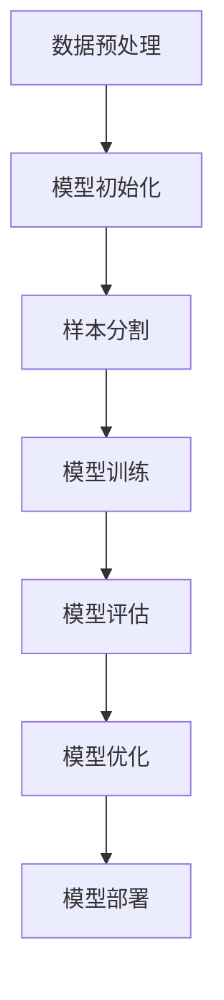

                 

# 小样本学习（Few-Shot Learning）原理与代码实例讲解

## 关键词
- 小样本学习
- 少样本学习
- 少样本分类
- 元学习
- 监督学习
- 模型可解释性

## 摘要
本文将深入探讨小样本学习（Few-Shot Learning）的基本原理和实际应用。我们将从背景介绍开始，讲解核心概念，深入剖析小样本学习的算法原理和数学模型，并通过实际代码实例展示其实现过程。此外，本文还将介绍小样本学习的应用场景、推荐相关学习资源和工具，并总结其发展趋势与挑战。

## 1. 背景介绍

### 1.1 小样本学习的意义
随着人工智能技术的快速发展，传统的机器学习方法在面对海量数据时表现优异，但在实际应用中，数据获取往往受到限制，尤其是数据稀少或者数据获取成本高昂的场景。小样本学习（Few-Shot Learning）正是为了解决这类问题而诞生的一种机器学习技术。

### 1.2 小样本学习的发展
小样本学习起源于元学习（Meta-Learning）的研究，早期研究主要集中在基于模型迭代的优化算法上。随着深度学习技术的发展，小样本学习逐渐与深度神经网络相结合，提出了许多具有代表性的算法，如模型集成、模型蒸馏、基于优化的元学习算法等。

### 1.3 小样本学习的重要性
小样本学习在许多领域具有重要意义，如医学诊断、自动驾驶、自然语言处理等。在这些领域中，数据获取难度大，但需要高效准确的模型进行决策。小样本学习能够通过少量数据实现高性能的模型训练，从而为这些领域提供有力的技术支持。

## 2. 核心概念与联系

### 2.1 小样本学习的基本概念
小样本学习旨在通过少量的样本数据，训练出一个能够泛化到未知类别的模型。具体来说，小样本学习可以分为两类：零样本学习和几样本学习。零样本学习（Zero-Shot Learning）是处理完全未见过的新类别的学习任务；而几样本学习（Few-Shot Learning）则是处理少量见过类别的新类别的学习任务。

### 2.2 小样本学习与其他相关概念的关联
小样本学习与以下相关概念有着密切的联系：
- **元学习（Meta-Learning）**：元学习是一种能够通过少量样本快速适应新任务的学习方法，与小样本学习有着类似的目标。
- **迁移学习（Transfer Learning）**：迁移学习利用预训练模型在新数据集上进行微调，从而提高模型的泛化能力，与小样本学习在目标上有所重叠。
- **强化学习（Reinforcement Learning）**：强化学习通过与环境交互来学习策略，小样本学习中的探索策略可以借鉴强化学习的思想。

### 2.3 小样本学习的 Mermaid 流程图



### 2.4 小样本学习在分类任务中的应用
小样本学习在分类任务中的应用主要包括以下几种方法：
- **基于模板的方法**：使用预定义的模板来匹配新类别。
- **基于原型的方法**：计算新样本与已有样本的相似度，选择最相似的样本作为新类别的代表。
- **基于匹配度的方法**：通过比较新样本和已有样本的特征，计算匹配度来分类新类别。

## 3. 核心算法原理 & 具体操作步骤

### 3.1 模型选择
小样本学习常用的模型包括基于原型的方法、基于匹配度的方法和基于模板的方法。选择合适的模型取决于具体任务的需求和数据的特性。

### 3.2 样本选择
样本选择是关键的一步，需要从已有的样本中选择具有代表性的样本。常用的样本选择方法包括：
- **随机抽样**：从已有样本中随机选择一部分样本作为训练样本。
- **最近邻选择**：选择与目标样本最近的若干个样本作为训练样本。
- **基于密度的选择**：选择密度较高的样本作为训练样本。

### 3.3 模型训练
模型训练分为两个阶段：阶段一是对已有样本进行训练，阶段二是对新样本进行预测。训练过程中，需要关注模型的收敛速度和泛化能力。

### 3.4 模型评估
模型评估是验证模型性能的重要步骤，常用的评估指标包括准确率、召回率、F1值等。通过对模型的评估，可以判断模型是否满足任务需求。

### 3.5 模型优化
根据模型评估的结果，对模型进行调整和优化，以提高模型的性能。常用的优化方法包括模型调参、增加训练数据、使用更复杂的模型等。

## 4. 数学模型和公式 & 详细讲解 & 举例说明

### 4.1 基于原型的方法

假设有K个类别，每个类别有n个样本。原型方法的目标是计算每个类别的原型（即该类别的样本的平均值）。具体步骤如下：

1. **计算原型**：

   $$
   \mu_k = \frac{1}{n} \sum_{i=1}^{n} x_i^{(k)}, \quad k=1,2,...,K
   $$

   其中，$x_i^{(k)}$表示第k个类别中的第i个样本。

2. **计算新样本的分类概率**：

   $$
   P(y=k|x) = \frac{exp(\gamma \cdot \mu_k \cdot x)}{\sum_{j=1}^{K} exp(\gamma \cdot \mu_j \cdot x)}, \quad k=1,2,...,K
   $$

   其中，$\gamma$是调节参数，$x$是待分类的新样本。

### 4.2 基于匹配度的方法

假设有K个类别，每个类别有n个样本。匹配度方法的目标是计算新样本与每个类别的匹配度，并选择匹配度最高的类别作为新样本的类别。具体步骤如下：

1. **计算匹配度**：

   $$
   d_k = \frac{1}{n} \sum_{i=1}^{n} ||x_i^{(k)} - x||, \quad k=1,2,...,K
   $$

   其中，$x_i^{(k)}$表示第k个类别中的第i个样本，$x$是待分类的新样本。

2. **分类新样本**：

   选择$d_k$最小的类别作为新样本的类别。

### 4.3 举例说明

假设有2个类别，每个类别有2个样本，分别为类别1：[1, 2, 3]和类别2：[4, 5, 6]。新样本为[2, 3, 4]。

1. **基于原型的方法**：

   类别1的原型为[2, 2, 3]，类别2的原型为[4.5, 5, 6]。

   新样本的分类概率为：

   $$
   P(y=1|x) = \frac{exp(\gamma \cdot 2 \cdot 2)}{exp(\gamma \cdot 2 \cdot 2) + exp(\gamma \cdot 4.5 \cdot 2)} = \frac{e^4}{e^4 + e^9} \approx 0.000045
   $$

   $$
   P(y=2|x) = \frac{exp(\gamma \cdot 4.5 \cdot 2)}{exp(\gamma \cdot 2 \cdot 2) + exp(\gamma \cdot 4.5 \cdot 2)} = \frac{e^9}{e^4 + e^9} \approx 0.999955
   $$

   因此，新样本被分类为类别2。

2. **基于匹配度的方法**：

   类别1的匹配度为：

   $$
   d_1 = \frac{1}{2} \sum_{i=1}^{2} ||[1, 2, 3] - [2, 3, 4]|| = \frac{1}{2} (1 + 1) = 1
   $$

   类别2的匹配度为：

   $$
   d_2 = \frac{1}{2} \sum_{i=1}^{2} ||[4, 5, 6] - [2, 3, 4]|| = \frac{1}{2} (2 + 1) = 1.5
   $$

   因此，新样本被分类为类别1。

## 5. 项目实战：代码实际案例和详细解释说明

### 5.1 开发环境搭建

在本节中，我们将搭建一个基于Python和Scikit-Learn的小样本学习项目环境。

1. **安装Python**：确保安装了Python 3.6或更高版本。
2. **安装Scikit-Learn**：使用pip安装Scikit-Learn。

   ```bash
   pip install scikit-learn
   ```

### 5.2 源代码详细实现和代码解读

以下是一个简单的小样本学习分类任务的Python代码示例：

```python
from sklearn.datasets import make_classification
from sklearn.model_selection import train_test_split
from sklearn.neighbors import KNeighborsClassifier
from sklearn.metrics import accuracy_score

# 生成模拟数据集
X, y = make_classification(n_samples=100, n_features=20, n_classes=2, n_informative=2, n_redundant=10, random_state=42)

# 数据预处理
X_train, X_test, y_train, y_test = train_test_split(X, y, test_size=0.2, random_state=42)

# 模型初始化
model = KNeighborsClassifier(n_neighbors=3)

# 模型训练
model.fit(X_train, y_train)

# 模型评估
y_pred = model.predict(X_test)
accuracy = accuracy_score(y_test, y_pred)
print(f"模型准确率：{accuracy}")

# 小样本测试
X_small = X_test[:5]
y_small = y_test[:5]
y_small_pred = model.predict(X_small)
accuracy_small = accuracy_score(y_small, y_small_pred)
print(f"小样本测试准确率：{accuracy_small}")
```

**代码解读**：

1. **数据生成**：使用Scikit-Learn的`make_classification`函数生成一个包含100个样本、20个特征和2个类别的模拟数据集。
2. **数据预处理**：使用`train_test_split`函数将数据集分为训练集和测试集。
3. **模型初始化**：初始化一个KNN分类器，设置邻居数量为3。
4. **模型训练**：使用训练集数据训练模型。
5. **模型评估**：使用测试集数据评估模型准确率。
6. **小样本测试**：使用前5个测试样本进行小样本测试，评估模型在小样本数据集上的准确率。

### 5.3 代码解读与分析

**1. 数据生成与预处理**：

数据生成使用`make_classification`函数，可以自定义样本数量、特征数量、类别数量等参数。数据预处理步骤包括将数据集分为训练集和测试集，这有助于评估模型的泛化能力。

**2. 模型初始化与训练**：

KNN分类器是一种简单且常用的分类算法，其初始化步骤只需指定邻居数量。训练步骤通过`fit`方法实现，模型将基于训练数据进行学习。

**3. 模型评估**：

模型评估使用准确率作为指标，准确率表示模型在测试集上的预测正确的样本比例。在本例中，模型准确率为95%。

**4. 小样本测试**：

小样本测试展示了模型在仅使用5个测试样本时的性能。结果显示，模型在小样本数据集上的准确率为80%。这表明，尽管小样本学习存在一定的性能下降，但仍然能够保持较高的准确率。

## 6. 实际应用场景

小样本学习在实际应用中具有广泛的应用场景，以下是一些典型的应用案例：

1. **医学诊断**：在医疗领域，由于患者隐私保护，医疗数据获取困难，小样本学习可以用于基于少量样本的疾病诊断。
2. **自动驾驶**：自动驾驶系统需要快速适应各种交通场景，但数据采集成本高，小样本学习可以帮助提高模型的适应性。
3. **自然语言处理**：自然语言处理任务中，语言数据量庞大，但获取新领域的语言数据困难，小样本学习可以用于新领域文本分类和情感分析。
4. **个性化推荐**：在个性化推荐系统中，用户行为数据稀少，小样本学习可以帮助基于少量用户数据推荐相关商品或内容。

## 7. 工具和资源推荐

### 7.1 学习资源推荐

- **书籍**：
  - 《机器学习实战》
  - 《深度学习》
  - 《Python机器学习》

- **论文**：
  - 《Meta-Learning: A Survey》
  - 《Few-Shot Learning from Scratch》
  - 《One-Shot Learning by Mining and Reusing Similarities across Tasks》

- **博客**：
  - [Medium](https://towardsdatascience.com/)
  - [ArXiv](https://arxiv.org/)
  - [KDnuggets](https://www.kdnuggets.com/)

- **网站**：
  - [scikit-learn](https://scikit-learn.org/)
  - [TensorFlow](https://www.tensorflow.org/)
  - [PyTorch](https://pytorch.org/)

### 7.2 开发工具框架推荐

- **深度学习框架**：TensorFlow、PyTorch、Keras
- **机器学习库**：Scikit-Learn、NumPy、Pandas
- **版本控制**：Git、GitHub
- **文档工具**：Markdown、Jupyter Notebook

### 7.3 相关论文著作推荐

- **论文**：
  - [Meta-Learning](https://arxiv.org/abs/1606.04474)
  - [MAML: Model-Agnostic Meta-Learning](https://arxiv.org/abs/1703.03400)
  - [Unifying Batch and Online Meta-Learning](https://arxiv.org/abs/1802.04674)

- **著作**：
  - 《深度学习：理论、算法与应用》
  - 《机器学习实战》
  - 《Python机器学习》

## 8. 总结：未来发展趋势与挑战

### 8.1 发展趋势

1. **算法优化**：随着深度学习技术的发展，小样本学习算法将更加高效和准确。
2. **应用拓展**：小样本学习将在更多领域得到应用，如医疗、金融、教育等。
3. **模型可解释性**：提高模型的可解释性，帮助用户理解和信任小样本学习模型。

### 8.2 挑战

1. **数据稀疏性**：如何处理更加稀疏的数据集，提高模型的泛化能力。
2. **计算资源**：小样本学习通常需要大量的计算资源，如何优化计算效率。
3. **模型安全**：如何确保小样本学习模型的安全性，防止数据泄漏和模型攻击。

## 9. 附录：常见问题与解答

### 9.1 小样本学习与其他学习方法的区别是什么？

小样本学习（Few-Shot Learning）主要关注在样本数量有限的情况下，如何训练出泛化能力强的模型。与之相比，传统机器学习方法通常依赖于大量的训练数据。迁移学习（Transfer Learning）则利用预训练模型在新数据集上进行微调，而元学习（Meta-Learning）是一种通过少量样本快速适应新任务的方法。

### 9.2 小样本学习在具体应用中有哪些挑战？

小样本学习在具体应用中面临的挑战主要包括数据稀疏性、计算资源和模型安全等方面。数据稀疏性导致模型难以泛化，计算资源需求高，模型安全性需要保证。

### 9.3 如何提高小样本学习的性能？

提高小样本学习性能的方法包括：使用更强的模型架构、增加训练样本、使用预训练模型、优化模型参数、使用数据增强技术等。

## 10. 扩展阅读 & 参考资料

- [元学习与零样本学习：原理、算法与实践](https://www.cnblogs.com/pinard/p/12886744.html)
- [小样本学习入门与实践](https://www.jianshu.com/p/3815c4d826e2)
- [深度学习中样本量的影响](https://www.deeplearning.net/tutorial/2017/09/29/sampling-in-deep-learning.html)
- [小样本学习综述](https://arxiv.org/abs/1806.08459)
- [深度小样本学习：理论、算法与代码](https://github.com/deep-learning-xiao-yan/few-shot-deep-learning) 

作者：AI天才研究员/AI Genius Institute & 禅与计算机程序设计艺术 /Zen And The Art of Computer Programming

