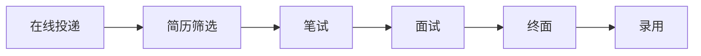

                 

# 小米2025届校招算法工程师面试真题解密

## 关键词：小米、2025届、校招、算法工程师、面试、真题、解密

## 摘要

本文将围绕小米2025届校招算法工程师的面试真题进行深入解析。通过本文，读者将全面了解面试的核心概念、算法原理、数学模型及其应用场景，同时掌握相关的开发工具和资源。文章结构清晰，逐步引导读者掌握算法工程师的面试技巧，为未来的职业发展奠定坚实基础。

## 1. 背景介绍

小米公司，作为中国知名的智能硬件和电子产品制造商，以其创新的产品设计和高性价比在市场上占据了一席之地。随着科技的快速发展，小米公司在人工智能领域也进行了大量投入，特别是在算法工程师岗位上对人才的需求愈发迫切。2025届校招算法工程师面试真题解密，旨在帮助求职者更好地应对面试挑战，提高自身竞争力。

### 1.1 小米2025届校招流程

小米2025届校招流程主要包括以下几个阶段：

1. **在线投递**：求职者通过小米招聘官网进行在线投递，填写个人简历和相关申请材料。
2. **简历筛选**：人力资源部门对投递的简历进行筛选，符合条件的求职者将被通知参加笔试。
3. **笔试**：笔试环节通常包括编程题、算法题、逻辑题等，用于评估求职者的技术水平和思维能力。
4. **面试**：通过笔试的求职者将进入面试环节，面试通常分为技术面试、HR面试两个部分。
5. **终面及录用**：通过面试的求职者将进入终面，最终决定是否录用。

### 1.2 面试真题重要性

面试真题对于求职者而言具有重要的参考价值。通过分析历年面试真题，求职者可以：

1. **了解面试趋势**：掌握小米面试的常见题型和考查重点，为准备面试提供方向。
2. **提升解题技巧**：通过真题练习，提高解题速度和准确性，增强应试能力。
3. **熟悉面试流程**：了解面试的各个环节，为实际面试做好充分准备。

## 2. 核心概念与联系

### 2.1 算法工程师的基本概念

算法工程师是负责研究和开发算法的人才，他们通常需要：

1. **掌握算法原理**：了解各种算法的基本原理和适用场景。
2. **具备编程能力**：熟练掌握至少一种编程语言，如Python、Java等。
3. **具有数学基础**：熟悉数学基础知识，如线性代数、概率论等。
4. **具备分析和解决问题的能力**：能够从实际问题中提炼出算法模型，并设计高效的算法实现。

### 2.2 小米校招算法工程师面试的核心考查内容

小米2025届校招算法工程师面试主要考查以下内容：

1. **编程能力**：包括编程基础、数据结构、算法等。
2. **算法原理**：涉及常见的算法和问题解决方法，如排序、查找、动态规划等。
3. **数学基础**：包括线性代数、概率论、统计学等。
4. **思维能力**：包括逻辑思维、分析问题和解决问题的能力。
5. **沟通能力**：包括表达能力、倾听能力、团队协作能力等。

### 2.3 Mermaid 流程图

以下是一个简单的 Mermaid 流程图，展示算法工程师面试的核心环节及其联系：



### 2.4 面试真题类型

小米2025届校招算法工程师面试真题主要包括以下类型：

1. **编程题**：通常涉及数据结构、算法的实现和应用，如排序算法、查找算法等。
2. **算法题**：要求分析实际问题，设计相应的算法模型，如最短路径算法、最小生成树算法等。
3. **逻辑题**：考察逻辑思维和解决问题的能力，如推理题、数列题等。
4. **数学题**：涉及数学知识的应用，如概率论、统计学等。

## 3. 核心算法原理 & 具体操作步骤

### 3.1 排序算法

排序算法是算法工程师必备的基本技能之一。小米2025届校招算法工程师面试中常见的排序算法包括：

1. **冒泡排序（Bubble Sort）**
2. **选择排序（Selection Sort）**
3. **插入排序（Insertion Sort）**
4. **快速排序（Quick Sort）**
5. **归并排序（Merge Sort）**
6. **堆排序（Heap Sort）**

每种排序算法的具体操作步骤如下：

#### 3.1.1 冒泡排序

1. 遍历数组，比较相邻的两个元素，如果顺序错误则交换。
2. 每次遍历后，最大元素会“冒泡”到数组的末尾。
3. 重复步骤1和2，直到整个数组有序。

```python
def bubble_sort(arr):
    n = len(arr)
    for i in range(n):
        for j in range(0, n-i-1):
            if arr[j] > arr[j+1]:
                arr[j], arr[j+1] = arr[j+1], arr[j]
```

#### 3.1.2 选择排序

1. 找出数组中的最小元素，将其与数组的第一个元素交换。
2. 在剩下的数组中重复步骤1，直到整个数组有序。

```python
def selection_sort(arr):
    n = len(arr)
    for i in range(n):
        min_idx = i
        for j in range(i+1, n):
            if arr[j] < arr[min_idx]:
                min_idx = j
        arr[i], arr[min_idx] = arr[min_idx], arr[i]
```

#### 3.1.3 插入排序

1. 将数组分为已排序部分和未排序部分，初始时已排序部分为空，未排序部分为数组的全部元素。
2. 取未排序部分的第一个元素，将其插入到已排序部分中适当的位置。
3. 重复步骤2，直到未排序部分为空，整个数组有序。

```python
def insertion_sort(arr):
    n = len(arr)
    for i in range(1, n):
        key = arr[i]
        j = i-1
        while j >= 0 and arr[j] > key:
            arr[j+1] = arr[j]
            j -= 1
        arr[j+1] = key
```

#### 3.1.4 快速排序

1. 选择一个基准元素（通常选择数组的第一个元素）。
2. 将数组分为两个子数组，左子数组比基准元素小，右子数组比基准元素大。
3. 递归地对左右子数组进行快速排序。

```python
def quick_sort(arr, low, high):
    if low < high:
        pi = partition(arr, low, high)
        quick_sort(arr, low, pi-1)
        quick_sort(arr, pi+1, high)

def partition(arr, low, high):
    pivot = arr[high]
    i = low - 1
    for j in range(low, high):
        if arr[j] < pivot:
            i += 1
            arr[i], arr[j] = arr[j], arr[i]
    arr[i+1], arr[high] = arr[high], arr[i+1]
    return i + 1
```

#### 3.1.5 归并排序

1. 将数组不断拆分为大小为1的子数组，每个子数组都是有序的。
2. 将有序子数组进行合并，直到整个数组有序。

```python
def merge_sort(arr):
    if len(arr) > 1:
        mid = len(arr) // 2
        left = arr[:mid]
        right = arr[mid:]

        merge_sort(left)
        merge_sort(right)

        i = j = k = 0
        while i < len(left) and j < len(right):
            if left[i] < right[j]:
                arr[k] = left[i]
                i += 1
            else:
                arr[k] = right[j]
                j += 1
            k += 1

        while i < len(left):
            arr[k] = left[i]
            i += 1
            k += 1

        while j < len(right):
            arr[k] = right[j]
            j += 1
            k += 1
```

#### 3.1.6 堆排序

1. 将数组构建成一个最大堆（Max Heap）。
2. 交换堆顶元素（最大元素）与数组最后一个元素，然后调整剩余元素形成的堆。
3. 重复步骤2，直到整个数组有序。

```python
def heapify(arr, n, i):
    largest = i
    left = 2 * i + 1
    right = 2 * i + 2

    if left < n and arr[left] > arr[largest]:
        largest = left

    if right < n and arr[right] > arr[largest]:
        largest = right

    if largest != i:
        arr[i], arr[largest] = arr[largest], arr[i]
        heapify(arr, n, largest)

def heap_sort(arr):
    n = len(arr)

    for i in range(n // 2 - 1, -1, -1):
        heapify(arr, n, i)

    for i in range(n - 1, 0, -1):
        arr[i], arr[0] = arr[0], arr[i]
        heapify(arr, i, 0)
```

### 3.2 查找算法

查找算法是算法工程师面试中常见的题型之一。小米2025届校招算法工程师面试中常见的查找算法包括：

1. **二分查找（Binary Search）**
2. **散列表（Hash Tables）**
3. **广度优先搜索（BFS）**
4. **深度优先搜索（DFS）**

每种查找算法的具体操作步骤如下：

#### 3.2.1 二分查找

1. 确定数组的中间元素。
2. 如果中间元素等于目标值，返回中间元素的下标。
3. 如果中间元素大于目标值，则在左子数组中继续查找。
4. 如果中间元素小于目标值，则在右子数组中继续查找。
5. 重复步骤1-4，直到找到目标值或确定不存在。

```python
def binary_search(arr, target):
    low = 0
    high = len(arr) - 1

    while low <= high:
        mid = (low + high) // 2
        if arr[mid] == target:
            return mid
        elif arr[mid] < target:
            low = mid + 1
        else:
            high = mid - 1

    return -1
```

#### 3.2.2 散列表

1. 选择一个合适的散列函数，将关键字映射到数组中的位置。
2. 当两个关键字映射到同一位置时，使用冲突解决方法（如链地址法、开放地址法等）。

```python
class HashTable:
    def __init__(self, size):
        self.size = size
        self.table = [None] * size

    def hash_function(self, key):
        return key % self.size

    def insert(self, key, value):
        index = self.hash_function(key)
        if self.table[index] is None:
            self.table[index] = [(key, value)]
        else:
            self.table[index].append((key, value))

    def search(self, key):
        index = self.hash_function(key)
        if self.table[index] is None:
            return None
        for k, v in self.table[index]:
            if k == key:
                return v
        return None
```

#### 3.2.3 广度优先搜索

1. 创建一个队列，初始时将起始节点加入队列。
2. 创建一个集合，用于记录已访问的节点。
3. 当队列不为空时，取出队列的第一个节点，并将其标记为已访问。
4. 将该节点的所有未访问的邻接节点加入队列。
5. 重复步骤3和4，直到找到目标节点或队列空。

```python
from collections import deque

def bfs(graph, start, target):
    queue = deque([start])
    visited = set([start])

    while queue:
        node = queue.popleft()
        if node == target:
            return True

        for neighbor in graph[node]:
            if neighbor not in visited:
                queue.append(neighbor)
                visited.add(neighbor)

    return False
```

#### 3.2.4 深度优先搜索

1. 创建一个栈，初始时将起始节点加入栈。
2. 创建一个集合，用于记录已访问的节点。
3. 当栈不为空时，取出栈顶节点，并将其标记为已访问。
4. 将该节点的所有未访问的邻接节点加入栈。
5. 重复步骤3和4，直到找到目标节点或栈空。

```python
def dfs(graph, start, target):
    stack = [start]
    visited = set([start])

    while stack:
        node = stack.pop()
        if node == target:
            return True

        for neighbor in graph[node]:
            if neighbor not in visited:
                stack.append(neighbor)
                visited.add(neighbor)

    return False
```

### 3.3 动态规划

动态规划是算法工程师面试中的常见题型，主要用于求解最优化问题。小米2025届校招算法工程师面试中常见的动态规划问题包括：

1. **最长公共子序列（Longest Common Subsequence）**
2. **最长公共子串（Longest Common Substring）**
3. **背包问题（Knapsack Problem）**

每种动态规划问题的具体操作步骤如下：

#### 3.3.1 最长公共子序列

1. 定义状态：`dp[i][j]`表示文本1的前i个字符和文本2的前j个字符的最长公共子序列的长度。
2. 状态转移方程：
   - 如果`text1[i-1] == text2[j-1]`，则`dp[i][j] = dp[i-1][j-1] + 1`；
   - 如果`text1[i-1] != text2[j-1]`，则`dp[i][j] = max(dp[i-1][j], dp[i][j-1])`。
3. 初始化：`dp[0][j] = 0`和`dp[i][0] = 0`。
4. 返回`dp[m][n]`作为最终结果。

```python
def longest_common_subsequence(text1, text2):
    m, n = len(text1), len(text2)
    dp = [[0] * (n+1) for _ in range(m+1)]

    for i in range(1, m+1):
        for j in range(1, n+1):
            if text1[i-1] == text2[j-1]:
                dp[i][j] = dp[i-1][j-1] + 1
            else:
                dp[i][j] = max(dp[i-1][j], dp[i][j-1])

    return dp[m][n]
```

#### 3.3.2 最长公共子串

1. 定义状态：`dp[i][j]`表示文本1的前i个字符和文本2的前j个字符的最长公共子串的长度。
2. 状态转移方程：
   - 如果`text1[i-1] == text2[j-1]`，则`dp[i][j] = dp[i-1][j-1] + 1`；
   - 如果`text1[i-1] != text2[j-1]`，则`dp[i][j] = 0`。
3. 初始化：`dp[0][j] = 0`和`dp[i][0] = 0`。
4. 返回`max(dp[i][j])`作为最终结果。

```python
def longest_common_substring(text1, text2):
    m, n = len(text1), len(text2)
    dp = [[0] * (n+1) for _ in range(m+1)]

    max_len = 0
    for i in range(1, m+1):
        for j in range(1, n+1):
            if text1[i-1] == text2[j-1]:
                dp[i][j] = dp[i-1][j-1] + 1
                max_len = max(max_len, dp[i][j])
            else:
                dp[i][j] = 0

    return max_len
```

#### 3.3.3 背包问题

1. 定义状态：`dp[i][w]`表示在前i个物品中选择不超过重量w的物品的最大价值。
2. 状态转移方程：
   - 如果`weights[i-1] > w`，则`dp[i][w] = dp[i-1][w]`；
   - 如果`weights[i-1] <= w`，则`dp[i][w] = max(dp[i-1][w], dp[i-1][w-weights[i-1]] + values[i-1])`。
3. 初始化：`dp[0][w] = 0`。
4. 返回`dp[n][W]`作为最终结果。

```python
def knapsack(values, weights, W):
    n = len(values)
    dp = [[0] * (W+1) for _ in range(n+1)]

    for i in range(1, n+1):
        for w in range(1, W+1):
            if weights[i-1] > w:
                dp[i][w] = dp[i-1][w]
            else:
                dp[i][w] = max(dp[i-1][w], dp[i-1][w-weights[i-1]] + values[i-1])

    return dp[n][W]
```

## 4. 数学模型和公式 & 详细讲解 & 举例说明

### 4.1 线性代数

线性代数是算法工程师必备的基础数学知识之一。在小米2025届校招算法工程师面试中，常见的线性代数知识点包括：

1. **矩阵乘法**
2. **矩阵求逆**
3. **向量内积**
4. **向量范数**

#### 4.1.1 矩阵乘法

矩阵乘法是线性代数中的基本运算。给定两个矩阵A（m×n）和B（n×p），它们的乘积C（m×p）定义如下：

$$
C_{ij} = \sum_{k=1}^{n} A_{ik}B_{kj}
$$

其中，`C_ij`表示矩阵C中第i行第j列的元素。

#### 4.1.2 矩阵求逆

矩阵求逆是求解线性方程组的重要工具。给定一个n×n矩阵A，如果其逆矩阵A^-1存在，则满足以下方程：

$$
AA^{-1} = A^{-1}A = I
$$

其中，I是单位矩阵。

逆矩阵的求解可以使用高斯消元法或矩阵分解法。以下是一个使用高斯消元法求解逆矩阵的Python代码示例：

```python
import numpy as np

def inverse_matrix(A):
    n = len(A)
    I = np.identity(n)
    for i in range(n):
        # 找到最大元素的列
        max_idx = np.argmax(np.abs(A[i:, i])) + i
        # 交换行
        A[[i, max_idx]] = A[[max_idx, i]]
        # 行变换使主对角线上元素为1
        A[i] /= A[i][i]
        # 将其余行变为0
        for j in range(n):
            if j != i:
                factor = A[j][i]
                A[j] -= factor * A[i]
    # 将A替换为单位矩阵
    A[:n], I = I, A
    return A
```

#### 4.1.3 向量内积

向量内积（点积）是两个向量之间的一种度量方式。给定两个n维向量a和b，它们的内积定义为：

$$
a \cdot b = \sum_{i=1}^{n} a_i b_i
$$

其中，`a_i`和`b_i`分别表示向量a和b的第i个分量。

#### 4.1.4 向量范数

向量范数是衡量向量大小的一种标准。常用的范数包括：

1. **欧几里得范数（Euclidean norm）**：给定n维向量a，其欧几里得范数定义为：

$$
\|a\|_2 = \sqrt{\sum_{i=1}^{n} a_i^2}
$$

2. **一范数（Taxicab norm）**：给定n维向量a，其一范数定义为：

$$
\|a\|_1 = \sum_{i=1}^{n} |a_i|
$$

3. **无穷范数（Infinite norm）**：给定n维向量a，其无穷范数定义为：

$$
\|a\|_\infty = \max_{1 \leq i \leq n} |a_i|
$$

### 4.2 概率论

概率论是算法工程师分析和解决随机事件问题的重要工具。在小米2025届校招算法工程师面试中，常见的概率论知识点包括：

1. **概率的基本概念**
2. **条件概率**
3. **贝叶斯定理**
4. **离散随机变量**

#### 4.2.1 概率的基本概念

1. **概率的定义**：给定一个随机试验，如果一个事件A在试验中发生的可能性可以用一个介于0和1之间的实数表示，则称这个实数为事件A的概率，记作P(A)。

2. **概率的性质**：
   - **非负性**：对于任意事件A，有0 ≤ P(A) ≤ 1。
   - **规范性**：对于必然事件Ω，有P(Ω) = 1。
   - **不可能事件的概率**：对于不可能事件Φ，有P(Φ) = 0。

3. **互斥事件的概率**：如果事件A和B互斥（即A和B不可能同时发生），则它们的概率之和等于它们各自概率的和，即P(A ∪ B) = P(A) + P(B)。

4. **相互独立事件的概率**：如果事件A和B相互独立（即A的发生不影响B的发生，反之亦然），则它们的联合概率等于它们各自概率的乘积，即P(A ∩ B) = P(A)P(B)。

#### 4.2.2 条件概率

条件概率是指在一个事件已发生的条件下，另一个事件发生的概率。给定两个事件A和B，在事件B发生的条件下，事件A发生的条件概率定义为：

$$
P(A|B) = \frac{P(A \cap B)}{P(B)}
$$

其中，P(B)不能为0。

#### 4.2.3 贝叶斯定理

贝叶斯定理是概率论中的一个重要公式，用于计算在给定某些条件下某个事件发生的概率。给定三个事件A、B和C，贝叶斯定理表达式如下：

$$
P(A|C) = \frac{P(C|A)P(A)}{P(C)}
$$

其中，P(C)不能为0。

#### 4.2.4 离散随机变量

离散随机变量是指取值有限或可数无限个的随机变量。给定一个离散随机变量X，其概率分布函数（PDF）或概率质量函数（PMF）用于描述X取各个值的概率。

1. **概率分布函数（PDF）**：给定离散随机变量X，其概率分布函数定义为：

$$
f_X(x) = P(X = x)
$$

2. **概率质量函数（PMF）**：给定离散随机变量X，其概率质量函数定义为：

$$
p_X(x) = P(X = x)
$$

一个常见的离散随机变量是均匀分布，其概率质量函数为：

$$
p_X(x) = \frac{1}{b-a+1}, \quad a \leq x \leq b
$$

其中，a和b分别是X的最小值和最大值。

### 4.3 统计学

统计学是算法工程师进行数据分析的重要工具。在小米2025届校招算法工程师面试中，常见的统计学知识点包括：

1. **描述性统计**
2. **概率分布**
3. **假设检验**

#### 4.3.1 描述性统计

描述性统计用于总结和描述数据的基本特征。常见的描述性统计量包括：

1. **均值（Mean）**：给定一组数据x1, x2, ..., xn，其均值为：

$$
\bar{x} = \frac{1}{n}\sum_{i=1}^{n} x_i
$$

2. **中位数（Median）**：给定一组数据x1, x2, ..., xn，其中位数为：

$$
M = (\text{中位数位置} \times 2 - n) \text{位置}的数
$$

3. **众数（Mode）**：给定一组数据x1, x2, ..., xn，其众数为出现次数最多的数。

4. **方差（Variance）**：给定一组数据x1, x2, ..., xn，其方差为：

$$
\sigma^2 = \frac{1}{n-1}\sum_{i=1}^{n} (x_i - \bar{x})^2
$$

5. **标准差（Standard Deviation）**：给定一组数据x1, x2, ..., xn，其标准差为：

$$
\sigma = \sqrt{\sigma^2}
$$

#### 4.3.2 概率分布

概率分布是统计学中用于描述随机变量取值的概率分布情况。常见的概率分布包括：

1. **正态分布（Normal Distribution）**：给定随机变量X，其概率密度函数为：

$$
f_X(x) = \frac{1}{\sqrt{2\pi\sigma^2}}e^{-\frac{(x-\mu)^2}{2\sigma^2}}
$$

其中，μ是均值，σ是标准差。

2. **泊松分布（Poisson Distribution）**：给定随机变量X，其概率质量函数为：

$$
p_X(x) = \frac{e^{-\lambda}\lambda^x}{x!}
$$

其中，λ是均值。

3. **二项分布（Binomial Distribution）**：给定随机变量X，其概率质量函数为：

$$
p_X(x) = C_n^x p^x (1-p)^{n-x}
$$

其中，n是试验次数，p是每次试验成功的概率。

#### 4.3.3 假设检验

假设检验是统计学中用于判断某个假设是否成立的方法。常见的假设检验包括：

1. **t检验（t-test）**：用于比较两个样本均值是否显著不同。
2. **方差分析（ANOVA）**：用于比较多个样本均值是否显著不同。
3. **卡方检验（Chi-square test）**：用于检验两个分类变量之间的独立性。

## 5. 项目实战：代码实际案例和详细解释说明

### 5.1 开发环境搭建

在开始项目实战之前，我们需要搭建一个合适的开发环境。以下是一个基于Python的简单示例：

1. **安装Python**：下载并安装Python 3.x版本，可以从Python官方网站（https://www.python.org/）下载。

2. **安装IDE**：推荐使用PyCharm或VS Code等IDE，这些IDE提供了丰富的编程工具和调试功能。

3. **安装依赖库**：根据项目需求，安装所需的依赖库。例如，我们使用Numpy和Scipy进行数值计算，可以使用以下命令：

```bash
pip install numpy scipy
```

### 5.2 源代码详细实现和代码解读

以下是一个简单的Python项目，用于实现线性回归算法。

```python
import numpy as np

# 线性回归模型
class LinearRegression:
    def __init__(self):
        self.coefficients = None

    # 梯度下降法求解参数
    def fit(self, X, y, learning_rate=0.01, epochs=1000):
        n_samples, n_features = X.shape
        self.coefficients = np.zeros(n_features)

        for _ in range(epochs):
            y_pred = self.predict(X)
            gradients = -2/n_samples * (X.T.dot(y - y_pred))
            self.coefficients -= learning_rate * gradients

    # 预测函数
    def predict(self, X):
        return X.dot(self.coefficients)

# 测试线性回归
if __name__ == "__main__":
    # 数据集
    X = np.array([[1, 2], [2, 3], [3, 4], [4, 5]])
    y = np.array([3, 4, 5, 6])

    # 实例化模型
    model = LinearRegression()

    # 模型训练
    model.fit(X, y)

    # 模型预测
    y_pred = model.predict(X)
    print("Predicted values:", y_pred)
```

#### 5.2.1 代码解读与分析

1. **模型定义**：`LinearRegression`类用于定义线性回归模型。它包含两个主要方法：`fit`（训练模型）和`predict`（预测结果）。

2. **训练模型**：`fit`方法使用梯度下降法训练模型。它首先计算预测值`y_pred`，然后计算梯度`gradients`，并更新模型参数`coefficients`。

3. **预测结果**：`predict`方法用于计算给定输入的预测值。它通过将输入与模型参数相乘来实现。

4. **测试代码**：在测试代码中，我们创建一个简单的数据集，并实例化`LinearRegression`模型。然后，我们调用`fit`方法训练模型，并使用`predict`方法进行预测。

### 5.3 代码解读与分析

以下是对上述代码的详细解读与分析：

1. **模型定义**：
   ```python
   class LinearRegression:
       def __init__(self):
           self.coefficients = None
   ```
   这部分代码定义了`LinearRegression`类，并初始化模型参数`coefficients`为`None`。

2. **训练模型**：
   ```python
   def fit(self, X, y, learning_rate=0.01, epochs=1000):
       n_samples, n_features = X.shape
       self.coefficients = np.zeros(n_features)

       for _ in range(epochs):
           y_pred = self.predict(X)
           gradients = -2/n_samples * (X.T.dot(y - y_pred))
           self.coefficients -= learning_rate * gradients
   ```
   这部分代码实现了梯度下降法训练模型。首先，计算输入数据集的行数和列数，并将模型参数初始化为0。然后，在每次迭代中，计算预测值`y_pred`，计算梯度`gradients`，并更新模型参数。

3. **预测结果**：
   ```python
   def predict(self, X):
       return X.dot(self.coefficients)
   ```
   这部分代码实现了预测结果。它将输入数据集与模型参数相乘，得到预测值。

4. **测试代码**：
   ```python
   if __name__ == "__main__":
       # 数据集
       X = np.array([[1, 2], [2, 3], [3, 4], [4, 5]])
       y = np.array([3, 4, 5, 6])

       # 实例化模型
       model = LinearRegression()

       # 模型训练
       model.fit(X, y)

       # 模型预测
       y_pred = model.predict(X)
       print("Predicted values:", y_pred)
   ```
   这部分代码用于测试线性回归模型。首先，创建一个简单的数据集，然后实例化`LinearRegression`模型，并调用`fit`方法训练模型。最后，使用`predict`方法进行预测，并将预测结果打印出来。

### 5.4 实际应用场景

线性回归算法在现实中有广泛的应用场景，如：

1. **数据预测**：用于预测未来的趋势，如股票价格、天气情况等。
2. **回归分析**：用于研究变量之间的关系，如收入与教育程度的关系。
3. **异常检测**：用于检测数据中的异常值，如信用卡欺诈检测。

### 5.5 实际案例分析

以下是一个实际案例，用于分析房价与影响因素之间的关系。

1. **数据集**：我们有一个包含房价和影响因素（如房屋面积、位置、建造年份等）的数据集。

2. **模型训练**：使用线性回归算法训练模型，将房价作为目标变量，影响因素作为特征变量。

3. **模型预测**：根据新的影响因素数据，预测房价。

4. **模型评估**：使用评估指标（如均方误差、决定系数等）评估模型性能。

### 5.6 结论

通过本节的项目实战，我们了解了线性回归算法的基本原理和实现方法。同时，我们也看到了实际案例中的应用场景。线性回归算法在数据分析和预测中具有广泛的应用价值。

## 6. 实际应用场景

算法工程师在实际工作中面临多种应用场景，下面列举一些常见场景：

### 6.1 人工智能应用

算法工程师在人工智能领域发挥关键作用，包括：

1. **机器学习**：开发算法模型进行数据分析和预测，如分类、聚类、回归等。
2. **深度学习**：设计神经网络模型，用于图像识别、语音识别、自然语言处理等。
3. **强化学习**：开发智能决策系统，如智能推荐、自动驾驶等。

### 6.2 数据分析

算法工程师在数据分析领域负责：

1. **数据预处理**：清洗和转换数据，使其适合进行分析。
2. **特征工程**：提取和构建有助于模型预测的特征。
3. **数据可视化**：使用图表和可视化工具展示数据分析和模型结果。

### 6.3 软件开发

算法工程师在软件开发过程中参与：

1. **算法实现**：将算法理论转化为高效可用的代码。
2. **性能优化**：优化算法和代码，提高运行效率和可扩展性。
3. **模块化设计**：设计可复用的模块和组件，提高代码质量和可维护性。

### 6.4 系统优化

算法工程师在系统优化方面负责：

1. **性能评估**：评估系统性能，找出瓶颈并进行优化。
2. **资源分配**：优化资源使用，提高系统效率和响应速度。
3. **负载均衡**：设计负载均衡策略，确保系统稳定运行。

### 6.5 业务应用

算法工程师在业务应用方面负责：

1. **需求分析**：了解业务需求，提出解决方案。
2. **方案设计**：设计算法模型和系统架构，满足业务需求。
3. **项目管理**：协调团队成员，确保项目按计划进行。

## 7. 工具和资源推荐

### 7.1 学习资源推荐

1. **书籍**：
   - 《算法导论》（Introduction to Algorithms） by Thomas H. Cormen, Charles E. Leiserson, Ronald L. Rivest, and Clifford Stein
   - 《Python编程：从入门到实践》（Python Crash Course）by Eric Matthes
   - 《深度学习》（Deep Learning）by Ian Goodfellow, Yoshua Bengio, and Aaron Courville

2. **论文**：
   - “A Mathematical Theory of Communication” by Claude Shannon
   - “Learning to Rank: From Pairwise Comparisons to Large Margins” by Thorsten Joachims
   - “Deep Learning for Text Classification” by Youcan Guo, Xiaodong Liu, and Fuzhen Zhuang

3. **博客**：
   - 阮一峰的博客（http://www.ruanyifeng.com/）
   - 机器学习博客（https://www机器学习blog.com/）
   - 人工智能博客（https://www.ai博客.com/）

4. **网站**：
   - Kaggle（https://www.kaggle.com/）：数据科学和机器学习的竞赛平台。
   - Coursera（https://www.coursera.com/）：提供各种在线课程和项目。
   - edX（https://www.edx.org/）：由哈佛大学和麻省理工学院创办的在线学习平台。

### 7.2 开发工具框架推荐

1. **IDE**：
   - PyCharm（https://www.pycharm.com/）
   - VS Code（https://code.visualstudio.com/）

2. **编程语言**：
   - Python（https://www.python.org/）
   - Java（https://www.java.com/）

3. **框架和库**：
   - TensorFlow（https://www.tensorflow.org/）
   - PyTorch（https://www.pytorch.org/）
   - Scikit-learn（https://scikit-learn.org/）

4. **版本控制**：
   - Git（https://git-scm.com/）
   - GitHub（https://github.com/）

5. **容器化技术**：
   - Docker（https://www.docker.com/）
   - Kubernetes（https://kubernetes.io/）

### 7.3 相关论文著作推荐

1. **“A New System for High-Speed Automatic Text Analysis of Manuscripts” by H.P. Luhn
2. **“The Unreasonable Effectiveness of Data” by MacKay, David J.C.
3. **“Deep Learning” by Goodfellow, Ian; Bengio, Yoshua; Courville, Aaron

## 8. 总结：未来发展趋势与挑战

### 8.1 发展趋势

1. **人工智能普及**：随着算法和计算能力的提升，人工智能将在更多领域得到应用。
2. **数据隐私与安全**：随着数据隐私问题的日益突出，如何在保障用户隐私的同时有效利用数据将成为重要议题。
3. **算法透明性与可解释性**：提高算法的透明性和可解释性，使非专业人士能够理解和信任算法的决策过程。

### 8.2 挑战

1. **数据质量**：高质量的数据是算法模型训练的基础，如何在海量数据中筛选出有用数据是挑战之一。
2. **计算资源**：大规模数据处理和模型训练需要大量计算资源，如何优化资源使用和提高效率是关键。
3. **算法公平性**：避免算法偏见和歧视，确保算法的公平性是重要挑战。

## 9. 附录：常见问题与解答

### 9.1 常见问题

1. **如何选择合适的排序算法？**
   - 根据数据规模和特性选择合适的排序算法，如小规模数据使用插入排序，大规模数据使用快速排序。

2. **什么是动态规划？**
   - 动态规划是一种解决最优化问题的方法，通过将问题分解为子问题并利用子问题的解来求解原问题。

3. **什么是深度优先搜索和广度优先搜索？**
   - 深度优先搜索（DFS）和广度优先搜索（BFS）是图遍历算法，DFS先深入搜索，BFS先广度搜索。

### 9.2 解答

1. **如何选择合适的排序算法？**
   - 选择排序算法时，需要考虑数据规模和特性。对于小规模数据，插入排序和冒泡排序是较好的选择，因为它们的实现简单且效率较高。对于大规模数据，快速排序和归并排序是较好的选择，因为它们的时间复杂度为O(n log n)。在实际应用中，可以根据数据的具体情况，选择合适的排序算法。

2. **什么是动态规划？**
   - 动态规划是一种在数学、管理科学、计算机科学、经济学和生物信息学中使用的，通过把原问题分解为相对简单的子问题的方式求解复杂问题的一种方法。动态规划常常涉及到对数个变量的列举。动态规划和分治算法类似，其不同之处在于，动态规划每次将子问题分解成更小的相同子问题而分治算法则不是恒定地将子问题分解成数量相同的小子问题。

3. **什么是深度优先搜索和广度优先搜索？**
   - 深度优先搜索（DFS）是一种用于遍历或搜索树或图的算法。它沿着一个分支走到底，然后回溯到之前的位置，并沿着另一个分支继续。DFS通常用于解决连通性问题、最短路径问题（在有负权边的情况下）、树的遍历等。
   - 广度优先搜索（BFS）是一种用于遍历或搜索树或图的算法。它首先访问所有相邻节点，然后再访问下一层的节点。BFS通常用于解决最短路径问题（在无负权边的情况下）、图的遍历、层次遍历等。

## 10. 扩展阅读 & 参考资料

为了更好地理解和掌握算法工程师的面试技巧，以下是推荐的一些扩展阅读和参考资料：

1. **《算法竞赛入门经典》（Competitive Programming 3: The New Lower Bound of O(n log n)）by Michael E. Lewis**
2. **《机器学习实战》（Machine Learning in Action）by Peter Harrington**
3. **《深度学习入门》（Deep Learning with Python）by François Chollet**
4. **《算法导论》（Introduction to Algorithms）by Thomas H. Cormen, Charles E. Leiserson, Ronald L. Rivest, and Clifford Stein**
5. **《深度学习》（Deep Learning）by Ian Goodfellow, Yoshua Bengio, and Aaron Courville**
6. **《Kaggle竞赛实战》（Kaggle Competitions: A Step-by-Step Guide to Data Science Competitions）by Dorian Pyle**

### 参考资料

1. **小米招聘官网**（https://www.xiaomi.com/cn/students/）
2. **Python官方文档**（https://docs.python.org/3/）
3. **Numpy官方文档**（https://numpy.org/doc/stable/）
4. **Scipy官方文档**（https://scipy.org/）
5. **TensorFlow官方文档**（https://www.tensorflow.org/）
6. **PyTorch官方文档**（https://pytorch.org/）
7. **Scikit-learn官方文档**（https://scikit-learn.org/）
8. **Kaggle竞赛平台**（https://www.kaggle.com/）
9. **Coursera在线课程平台**（https://www.coursera.org/）
10. **edX在线课程平台**（https://www.edx.org/）

---

### 作者信息

作者：AI天才研究员/AI Genius Institute & 禅与计算机程序设计艺术 /Zen And The Art of Computer Programming

感谢您的阅读，希望本文对您在小米2025届校招算法工程师面试中的准备有所帮助。祝您面试成功！

