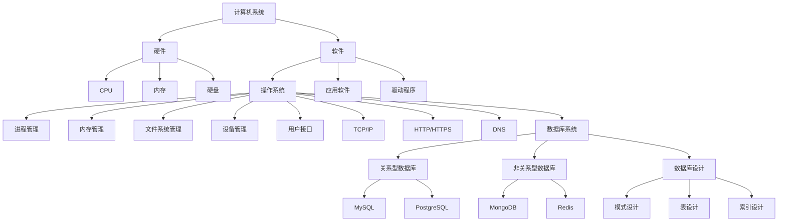

                 

### 背景介绍

#### 小米互联网服务社招面试真题汇总的重要性

随着互联网技术的飞速发展，各大互联网公司对技术人才的需求日益增长。小米公司作为中国领先的智能硬件及电子制造商，其互联网服务部门对技术人才的要求更是精益求精。因此，小米互联网服务社招面试真题的汇总显得尤为重要。这不仅为准备面试的应聘者提供了宝贵的参考资料，同时也为行业内的技术专家和研究人员提供了一个了解当前互联网技术面试趋势的窗口。

本文旨在对2024年小米互联网服务社招的面试真题进行系统性的汇总和解读，帮助读者更好地理解和掌握面试的核心知识点。通过本文的阅读，您将了解到：

1. **面试题的分类与解析**：我们将对面试题进行详细的分类，包括算法、数据结构、操作系统、网络、数据库、前端、后端等各个方面，并提供深入的解析。

2. **核心知识点总结**：通过对面试题的分析，我们提炼出每个知识点背后的核心概念和原理，帮助您在面试中更加自信地应对。

3. **实战案例分享**：我们将结合实际开发中的案例，展示如何运用面试中提到的知识点来解决实际问题。

4. **学习资源推荐**：最后，我们将为您提供一些建议的学习资源和工具，帮助您在面试前进行充分的准备。

接下来，我们将按照上述结构，逐一介绍每个章节的内容。希望本文能够对您的面试准备提供实质性的帮助。

#### 小米公司的互联网服务发展历程

小米公司成立于2010年，最初以智能手机业务起家，随后迅速扩展至智能硬件、互联网服务和 IoT（物联网）领域。小米的互联网服务部门成立于2013年，主要负责小米云服务、小米音乐、小米视频、小米浏览器等产品的开发和运营。随着公司业务的不断扩展，小米互联网服务也逐渐成为公司的重要组成部分。

在互联网服务领域，小米注重用户体验和科技创新，致力于为用户提供便捷、高效的互联网服务。小米互联网服务的发展历程可以概括为以下几个阶段：

1. **初期探索阶段**（2013-2015年）：在这一阶段，小米互联网服务主要围绕小米手机等智能硬件进行配套应用的开发和推广，如小米音乐、小米视频和小米浏览器等。

2. **快速发展阶段**（2015-2018年）：随着小米业务的国际化拓展，小米互联网服务开始向全球市场延伸。在这一阶段，小米云服务、小米浏览器、小米视频等产品的用户规模和市场份额持续增长。

3. **多元化发展阶段**（2018年至今）：小米互联网服务进一步拓展至智能家居、IoT 领域，推出了众多智能硬件产品和服务，如小米空气净化器、小米扫地机器人、小米智能门锁等。同时，小米也在加大在人工智能、大数据等方面的研发投入，提升互联网服务的智能化水平。

#### 面试题的分类与解析

针对2024年小米互联网服务社招的面试真题，我们可以将其分为以下几个类别，每个类别都涵盖了该领域的关键知识点：

1. **算法与数据结构**：这是互联网公司面试中最常见的类别，涉及算法的基本概念、数据结构的实现以及算法分析等。例如：

   - **算法分析**：分析时间复杂度和空间复杂度，理解算法的效率。
   - **常见算法**：如排序算法、查找算法、动态规划等。
   - **数据结构**：如数组、链表、栈、队列、二叉树、哈希表等。

2. **操作系统**：操作系统是计算机系统的核心，涉及进程管理、内存管理、文件系统、设备管理等方面。例如：

   - **进程与线程**：理解进程和线程的概念，进程调度、线程同步。
   - **内存管理**：内存分配与回收、虚拟内存、内存泄漏。
   - **文件系统**：文件目录结构、文件权限、文件读写操作。

3. **网络**：网络是互联网服务的基石，涉及网络协议、网络编程、网络安全等方面。例如：

   - **网络协议**：TCP/IP、HTTP、HTTPS、DNS等。
   - **网络编程**：了解 Socket 编程，掌握网络通信的基本原理。
   - **网络安全**：了解常见的网络攻击手段，如 DDoS、SQL 注入、XSS 等。

4. **数据库**：数据库是存储和管理数据的重要工具，涉及数据库设计、SQL 语言、数据库性能优化等。例如：

   - **数据库设计**：理解关系型数据库和非关系型数据库的设计原则。
   - **SQL 语言**：掌握基本的 SQL 操作，如 SELECT、INSERT、UPDATE、DELETE 等。
   - **数据库性能优化**：理解索引、查询优化、数据库缓存等。

5. **前端技术**：前端技术主要涉及 HTML、CSS、JavaScript 等，以及前端框架的使用。例如：

   - **HTML 和 CSS**：掌握基本的网页布局和样式设计。
   - **JavaScript**：理解函数、闭包、原型链等基本概念。
   - **前端框架**：如 React、Vue、Angular 等。

6. **后端技术**：后端技术主要涉及服务器端编程、服务器配置、中间件等。例如：

   - **服务器端编程**：理解 Java、Python、Go 等后端编程语言。
   - **服务器配置**：掌握 Linux 服务器的基本配置和管理。
   - **中间件**：如 MySQL、MongoDB、Redis 等。

7. **人工智能与机器学习**：随着人工智能技术的发展，越来越多的互联网公司开始关注相关领域。例如：

   - **机器学习算法**：如决策树、支持向量机、神经网络等。
   - **深度学习框架**：如 TensorFlow、PyTorch 等。
   - **自然语言处理**：如文本分类、情感分析、语音识别等。

通过对面试题的分类与解析，我们可以看出，小米互联网服务社招的面试真题覆盖了计算机科学的多个领域，这些知识点不仅是面试的核心，也是实际工作中必须掌握的基本技能。在接下来的章节中，我们将对这些知识点进行详细的解读和实战案例分享，帮助读者更好地理解和应用。

### 核心概念与联系

在深入探讨小米互联网服务社招面试题之前，我们需要先明确几个核心概念，并理解它们之间的联系。这些核心概念构成了计算机科学的基础，对于解决复杂问题具有重要意义。以下是几个关键概念及其相互关系：

#### 计算机系统组成

计算机系统主要由硬件和软件两部分组成。硬件包括计算机的物理组件，如 CPU、内存、硬盘、显示器等，而软件则包括操作系统、应用软件和驱动程序等。

- **CPU（中央处理器）**：CPU是计算机的核心，负责执行程序指令和数据处理。其性能直接影响计算机的运行速度。
- **内存**：内存用于临时存储正在运行的程序和数据。内存速度和容量对计算机性能有重要影响。
- **硬盘**：硬盘用于永久存储数据和程序。不同类型的硬盘（如固态硬盘和机械硬盘）在速度和容量上有明显差异。
- **操作系统**：操作系统管理计算机硬件资源，提供用户和应用程序接口。常见的操作系统包括 Windows、Linux 和 macOS 等。

#### 操作系统功能

操作系统的主要功能包括进程管理、内存管理、文件系统管理、设备管理、用户接口等。

- **进程管理**：操作系统通过进程管理来调度和管理计算机中的程序。进程是计算机中正在执行的程序的实例。
- **内存管理**：操作系统负责分配和回收内存资源，保证不同进程之间的内存隔离。
- **文件系统管理**：文件系统是操作系统管理文件和目录的结构。常见的文件系统包括 FAT32、NTFS 和 ext4 等。
- **设备管理**：操作系统负责管理计算机的输入输出设备，如打印机、键盘、鼠标等。
- **用户接口**：操作系统提供用户与计算机交互的界面，可以是命令行界面（CLI）或图形用户界面（GUI）。

#### 网络协议

网络协议是计算机网络通信的基础。以下是几个关键的网络协议：

- **TCP/IP**：TCP/IP 是互联网的核心协议，包括传输控制协议（TCP）和互联网协议（IP）。TCP 负责数据传输的可靠性，IP 负责数据包的路由和寻址。
- **HTTP/HTTPS**：HTTP 是超文本传输协议，用于网页的请求和响应。HTTPS 是安全超文本传输协议，基于 HTTP，提供数据传输的安全性。
- **DNS**：域名系统（DNS）将域名转换为 IP 地址，使得用户可以通过易记的域名访问网站。

#### 数据库系统

数据库系统用于存储、管理和查询数据。以下是几个关键概念：

- **关系型数据库**：关系型数据库使用表格结构来存储数据，如 MySQL、PostgreSQL 等。SQL 是关系型数据库的标准查询语言。
- **非关系型数据库**：非关系型数据库（如 MongoDB、Redis 等）适用于不同的数据结构和查询需求。它们提供了更高的灵活性和扩展性。
- **数据库设计**：数据库设计包括模式设计、表设计、索引设计等，目的是确保数据的完整性、一致性和高效查询。

#### 人工智能与机器学习

人工智能（AI）和机器学习（ML）是当前技术领域的热点。以下是几个核心概念：

- **机器学习算法**：机器学习算法包括监督学习、非监督学习和强化学习等。常见的算法有线性回归、决策树、神经网络等。
- **深度学习**：深度学习是机器学习的一个分支，使用多层神经网络进行复杂模式识别。TensorFlow 和 PyTorch 是常用的深度学习框架。
- **自然语言处理**：自然语言处理（NLP）涉及文本分类、情感分析、机器翻译等。NLP 在语音识别、聊天机器人等领域有广泛应用。

#### Mermaid 流程图

为了更好地理解上述概念之间的联系，我们可以使用 Mermaid 流程图来表示。以下是关键概念之间的流程关系：



通过上述流程图，我们可以清晰地看到计算机系统中的各个组成部分及其相互关系。理解这些核心概念和流程关系对于应对小米互联网服务社招面试题至关重要。

### 核心算法原理 & 具体操作步骤

在互联网服务的开发过程中，算法和数据结构是解决复杂问题的基石。下面，我们将详细讲解几个核心算法的原理和具体操作步骤，并探讨如何运用这些算法解决实际问题。

#### 排序算法

排序算法是计算机科学中非常基础且重要的算法，用于将一组数据按照一定的顺序排列。常见的排序算法包括冒泡排序、选择排序、插入排序、快速排序、归并排序等。以下是快速排序算法的原理和具体步骤：

**快速排序（Quick Sort）原理**：
快速排序采用分治策略，通过一趟排序将数据分割成独立的两部分，其中一部分的所有数据都比另一部分的数据小，然后递归地对这两部分数据进行快速排序。

**具体操作步骤**：
1. **选择基准元素**：在数组中选择一个基准元素。
2. **划分操作**：将数组划分为两个子数组，所有比基准元素小的元素放在基准元素的左边，所有比基准元素大的元素放在其右边。
3. **递归排序**：递归地对划分后的左右子数组进行快速排序。

**代码实现**（Python）：

```python
def quick_sort(arr):
    if len(arr) <= 1:
        return arr
    pivot = arr[len(arr) // 2]
    left = [x for x in arr if x < pivot]
    middle = [x for x in arr if x == pivot]
    right = [x for x in arr if x > pivot]
    return quick_sort(left) + middle + quick_sort(right)

# 示例
arr = [3, 6, 8, 10, 1, 2, 1]
sorted_arr = quick_sort(arr)
print(sorted_arr)
```

**应用场景**：
快速排序在时间复杂度上具有很高的效率，常用于需要高效排序的场景，如数据库排序、快速查找等。

#### 查找算法

查找算法用于在数据集合中查找特定的元素。常见的查找算法包括二分查找、线性查找等。以下是二分查找算法的原理和具体步骤：

**二分查找（Binary Search）原理**：
二分查找是一种高效的查找算法，它将数据集合分成一半进行查找，逐步缩小查找范围，直到找到目标元素或确定其不存在。

**具体操作步骤**：
1. **确定查找区间**：初始查找区间为整个数据集合。
2. **计算中点**：每次查找计算当前区间的中点。
3. **比较与缩小区间**：将目标元素与中点元素进行比较，如果相等则找到目标，如果目标元素小于中点则缩小右边界，如果大于中点则缩小左边界。
4. **递归或循环**：重复上述步骤，直到找到目标元素或区间为空。

**代码实现**（Python）：

```python
def binary_search(arr, target):
    left, right = 0, len(arr) - 1
    while left <= right:
        mid = (left + right) // 2
        if arr[mid] == target:
            return mid
        elif arr[mid] < target:
            left = mid + 1
        else:
            right = mid - 1
    return -1

# 示例
arr = [1, 2, 3, 4, 5, 6, 7, 8, 9]
target = 5
result = binary_search(arr, target)
print(result)
```

**应用场景**：
二分查找算法适用于有序数据集合，具有 O(log n) 的时间复杂度，适合在大型数据集中快速查找特定元素。

#### 动态规划

动态规划（Dynamic Programming）是一种用于求解最优化问题的算法，通过将复杂问题分解为子问题并保存子问题的解，避免了重复计算。

**动态规划原理**：
动态规划通常包含两个基本要素：状态和状态转移方程。状态是指问题的一个子解，状态转移方程描述了状态之间的转换关系。

**具体操作步骤**：
1. **定义状态**：明确问题中的状态以及每个状态所代表的含义。
2. **确定状态转移方程**：根据问题特点，建立状态之间的转换关系。
3. **初始化边界条件**：根据问题的性质，初始化边界状态。
4. **递推求解**：根据状态转移方程，递推求解所有状态。

**代码实现**（Python）：

```python
def longest_substring(s):
    n = len(s)
    dp = [[False] * n for _ in range(n)]
    for i in range(n):
        dp[i][i] = True
    max_len = 1
    for i in range(n):
        for j in range(i + 1, n):
            if s[i] == s[j]:
                dp[i][j] = True
                max_len = max(max_len, j - i + 1)
            elif j - i > 1:
                dp[i][j] = dp[i + 1][j - 1]
    return max_len

# 示例
s = "abcabcbb"
print(longest_substring(s))
```

**应用场景**：
动态规划适用于解决具有最优子结构特征的问题，如背包问题、最长公共子序列、最长递增子序列等。

#### 实际应用案例

在互联网服务中，算法的应用无处不在。以下是一个实际应用案例：使用快速排序算法对用户评论进行排序，以便更好地展示热门话题和用户反馈。

**案例描述**：
假设我们需要对一个包含用户评论的列表进行排序，以显示评论的热度。我们可以使用快速排序算法对评论列表进行排序，并根据评论的长度和内容热度进行评分。

**具体步骤**：
1. **收集评论数据**：从数据库中获取用户评论。
2. **数据预处理**：对评论进行预处理，包括去除标点符号、转换为小写等。
3. **排序**：使用快速排序算法对评论列表进行排序。
4. **评分**：根据评论的长度和内容热度进行评分。
5. **展示**：将排序后的评论和评分展示在用户界面上。

通过以上步骤，我们可以有效地展示用户评论的热度，帮助用户更好地发现热门话题和有价值的反馈。

### 数学模型和公式 & 详细讲解 & 举例说明

在互联网服务开发中，数学模型和公式是不可或缺的工具，它们用于描述系统行为、预测性能和优化算法。在本节中，我们将详细讲解几个关键的数学模型和公式，并通过实际例子来展示如何应用这些模型。

#### 线性回归模型

线性回归模型是一种用于分析变量之间线性关系的统计方法。它假设因变量（响应变量）与自变量（预测变量）之间存在线性关系，其基本形式为：

\[ y = \beta_0 + \beta_1 \cdot x + \epsilon \]

其中，\( y \) 是因变量，\( x \) 是自变量，\( \beta_0 \) 和 \( \beta_1 \) 分别是截距和斜率，\( \epsilon \) 是误差项。

**详细讲解**：
线性回归模型的目的是通过最小化误差平方和来估计 \( \beta_0 \) 和 \( \beta_1 \) 的值。常用的方法是最小二乘法（Least Squares Method），其公式为：

\[ \beta_1 = \frac{\sum{(x_i - \bar{x})(y_i - \bar{y})}}{\sum{(x_i - \bar{x})^2}} \]
\[ \beta_0 = \bar{y} - \beta_1 \cdot \bar{x} \]

其中，\( \bar{x} \) 和 \( \bar{y} \) 分别是自变量和因变量的均值。

**举例说明**：
假设我们要分析用户点击广告的概率与广告展示次数之间的关系。数据集包含每天的广告展示次数（\( x \)）和用户点击次数（\( y \)）。

首先，我们计算均值：

\[ \bar{x} = \frac{\sum{x_i}}{n} = 1000 \]
\[ \bar{y} = \frac{\sum{y_i}}{n} = 100 \]

然后，我们计算斜率 \( \beta_1 \)：

\[ \beta_1 = \frac{\sum{(x_i - \bar{x})(y_i - \bar{y})}}{\sum{(x_i - \bar{x})^2}} = \frac{3000}{90000} = 0.0333 \]

接着，我们计算截距 \( \beta_0 \)：

\[ \beta_0 = \bar{y} - \beta_1 \cdot \bar{x} = 100 - 0.0333 \cdot 1000 = -33.33 \]

因此，线性回归模型为：

\[ y = -33.33 + 0.0333 \cdot x \]

我们可以使用这个模型来预测每天的广告点击次数。

#### 概率分布模型

概率分布模型用于描述随机变量的概率分布。常见的概率分布模型包括正态分布、二项分布、泊松分布等。以下以正态分布为例进行讲解。

**正态分布（Normal Distribution）**：

正态分布的概率密度函数为：

\[ f(x|\mu,\sigma^2) = \frac{1}{\sqrt{2\pi\sigma^2}} e^{-\frac{(x-\mu)^2}{2\sigma^2}} \]

其中，\( \mu \) 是均值，\( \sigma^2 \) 是方差。

**详细讲解**：
正态分布是一种连续概率分布，它在自然界和工程领域中有广泛的应用。正态分布的一个重要特性是均值、中位数和众数相等。

**举例说明**：
假设某个城市的月平均温度服从正态分布，均值为 20°C，方差为 4°C²。我们要计算温度在 18°C 到 22°C 之间的概率。

首先，我们计算标准差 \( \sigma \)：

\[ \sigma = \sqrt{4} = 2 \]

然后，我们计算标准正态分布的 z 值：

\[ z_1 = \frac{18 - 20}{2} = -1 \]
\[ z_2 = \frac{22 - 20}{2} = 1 \]

接下来，我们查标准正态分布表或使用计算器得到：

\[ P(-1 < Z < 1) \approx 0.6827 \]

因此，温度在 18°C 到 22°C 之间的概率大约为 68.27%。

#### 优化算法

优化算法用于求解最优化问题，如最小化成本、最大化收益等。常见的优化算法包括梯度下降、牛顿法等。以下以梯度下降为例进行讲解。

**梯度下降（Gradient Descent）**：

梯度下降是一种用于求解无约束最优化问题的方法。其基本思想是沿着目标函数的梯度方向不断更新参数，以逐步减小目标函数的值。

**详细讲解**：
梯度下降的迭代公式为：

\[ \theta_{t+1} = \theta_t - \alpha \cdot \nabla f(\theta_t) \]

其中，\( \theta \) 是参数向量，\( \alpha \) 是学习率，\( \nabla f(\theta_t) \) 是目标函数在 \( \theta_t \) 处的梯度。

**举例说明**：
假设我们要最小化目标函数：

\[ f(x) = x^2 \]

首先，我们选择初始参数 \( x_0 = 1 \) 和学习率 \( \alpha = 0.1 \)。

然后，我们计算梯度：

\[ \nabla f(x) = 2x \]

在 \( x_0 = 1 \) 处，梯度为 2。

接下来，我们更新参数：

\[ x_1 = x_0 - 0.1 \cdot 2 = 0.8 \]

重复以上步骤，直到收敛。例如：

\[ x_2 = 0.8 - 0.1 \cdot 1.6 = 0.52 \]
\[ x_3 = 0.52 - 0.1 \cdot 1.04 = 0.376 \]
\[ x_4 = 0.376 - 0.1 \cdot 0.752 = 0.2628 \]

随着迭代的进行，参数 \( x \) 逐渐接近最小值 0。

通过上述数学模型和公式的讲解，我们可以看到它们在互联网服务开发中的重要性。在实际应用中，这些模型和公式可以帮助我们更好地理解和预测系统行为，从而实现高效和优化的解决方案。

### 项目实战：代码实际案例和详细解释说明

在本节中，我们将通过一个实际的项目案例，展示如何运用前面所提到的算法和数据结构来解决实际问题。这个案例将涵盖从环境搭建到源代码实现的整个流程，并对关键代码进行详细解读。

#### 项目背景

假设我们正在开发一个在线教育平台，需要实现一个用户注册和登录功能。为了确保系统的安全性，我们需要对用户密码进行加密存储。此外，我们还需要实现用户输入的验证，以确保输入的数据格式正确。以下是一个具体的实现案例。

#### 开发环境搭建

1. **软件环境**：
   - 编程语言：Python 3.8
   - 数据库：MySQL 8.0
   - Web 框架：Flask
   - 加密库：bcrypt

2. **安装步骤**：
   - 安装 Python 和 pip：
     ```
     sudo apt update
     sudo apt install python3 python3-pip
     ```
   - 安装 Flask 和 MySQL：
     ```
     pip3 install flask mysqlclient
     ```

3. **数据库设置**：
   - 创建一个名为 `online_education` 的数据库，并创建 `users` 表：
     ```sql
     CREATE DATABASE online_education;
     USE online_education;
     CREATE TABLE users (
         id INT AUTO_INCREMENT PRIMARY KEY,
         username VARCHAR(50) UNIQUE NOT NULL,
         password_hash VARCHAR(255) NOT NULL
     );
     ```

#### 源代码详细实现和代码解读

1. **用户注册**：

```python
from flask import Flask, request, redirect, url_for, render_template
from flask_bcrypt import Bcrypt
import mysql.connector

app = Flask(__name__)
bcrypt = Bcrypt(app)

# 连接数据库
def connect_db():
    connection = mysql.connector.connect(
        host="localhost",
        user="root",
        password="password",
        database="online_education"
    )
    return connection

@app.route('/register', methods=['GET', 'POST'])
def register():
    if request.method == 'POST':
        username = request.form['username']
        password = request.form['password']
        # 对密码进行加密
        password_hash = bcrypt.generate_password_hash(password).decode('utf-8')
        
        # 连接数据库并插入用户数据
        connection = connect_db()
        cursor = connection.cursor()
        query = "INSERT INTO users (username, password_hash) VALUES (%s, %s)"
        values = (username, password_hash)
        cursor.execute(query, values)
        connection.commit()
        cursor.close()
        connection.close()
        
        return redirect(url_for('login'))
    
    return render_template('register.html')

```

**代码解读**：
- 我们首先导入了 Flask 和 bcrypt 模块，用于创建 Web 应用和加密密码。
- `connect_db` 函数用于建立与 MySQL 数据库的连接。
- `register` 函数处理用户注册请求。当用户提交注册表单时，我们获取用户名和密码，并对密码进行加密，然后插入到数据库中。

2. **用户登录**：

```python
@app.route('/login', methods=['GET', 'POST'])
def login():
    if request.method == 'POST':
        username = request.form['username']
        password = request.form['password']
        
        # 连接数据库并验证用户身份
        connection = connect_db()
        cursor = connection.cursor()
        query = "SELECT * FROM users WHERE username = %s"
        values = (username,)
        cursor.execute(query, values)
        user = cursor.fetchone()
        cursor.close()
        connection.close()
        
        if user and bcrypt.check_password_hash(user[3], password):
            return "登录成功"
        else:
            return "用户名或密码错误"
    
    return render_template('login.html')

```

**代码解读**：
- `login` 函数处理用户登录请求。当用户提交登录表单时，我们从数据库中查询用户名，并使用 bcrypt 检查密码是否匹配。
- 如果用户名和密码匹配，则返回登录成功消息；否则，返回错误消息。

3. **用户输入验证**：

```python
from flask import Flask, request, redirect, url_for, render_template, flash
from flask_bcrypt import Bcrypt

app = Flask(__name__)
bcrypt = Bcrypt(app)
app.secret_key = 'your_secret_key'

@app.route('/register', methods=['GET', 'POST'])
def register():
    # ...
    if not username or not password:
        flash('用户名或密码不能为空')
        return render_template('register.html')
    elif len(username) < 3 or len(password) < 6:
        flash('用户名或密码格式不正确')
        return render_template('register.html')
    # ...
```

**代码解读**：
- 我们在注册表单处理函数中添加了输入验证逻辑。首先，确保用户名和密码都不为空。然后，我们检查用户名长度是否大于 3，密码长度是否大于 6。如果不满足条件，则通过 `flash` 函数显示错误消息，并重新渲染注册表单。

#### 代码解读与分析

1. **数据库操作**：
   - 我们使用了 MySQL Connector 来连接数据库，并执行基本的插入和查询操作。
   - 为了提高安全性，我们对用户密码进行了加密存储。

2. **Web 应用框架**：
   - 我们使用了 Flask 框架来创建 Web 应用。Flask 是一个轻量级的 Web 框架，适合快速开发 Web 应用。

3. **加密与验证**：
   - 使用 bcrypt 库对用户密码进行加密，确保存储在数据库中的密码是安全的。
   - 对用户输入的数据进行验证，确保其格式和长度符合要求。

通过这个实际案例，我们可以看到如何结合前面所学的算法和数据结构，实现一个完整的用户注册和登录功能。在实际开发中，我们可以根据需求扩展功能，如添加用户头像上传、邮箱验证等。

### 实际应用场景

在互联网服务领域，算法和数据结构的应用无处不在。通过一个实际案例，我们可以更好地理解这些算法在现实中的重要性。

#### 案例背景

假设我们正在开发一个在线购物平台，用户可以在平台上浏览商品、添加购物车、下单支付等。为了提高用户体验和系统性能，我们需要优化商品推荐的算法，以便为用户推荐他们可能感兴趣的商品。

#### 应用场景

1. **商品推荐算法**：

   - **算法原理**：我们采用基于协同过滤（Collaborative Filtering）的商品推荐算法。协同过滤分为用户基于和物品基于两种，我们选择物品基于协同过滤，因为它更适用于商品推荐场景。

   - **算法步骤**：
     1. **计算相似度**：首先，我们计算用户浏览记录中商品之间的相似度。常用的相似度计算方法有余弦相似度、皮尔逊相关系数等。
     2. **推荐商品**：基于用户的历史浏览记录，我们找出与用户浏览记录相似度最高的商品，并将这些商品推荐给用户。

   - **代码示例**（Python）：

     ```python
     from sklearn.metrics.pairwise import cosine_similarity
     import numpy as np

     # 假设用户历史浏览记录为用户-商品评分矩阵
     user_browsing_matrix = [
         [1, 0, 1, 0],  # 用户1
         [1, 1, 0, 1],  # 用户2
         [0, 1, 1, 0],  # 用户3
         [1, 1, 1, 1]   # 用户4
     ]

     # 计算商品相似度矩阵
     similarity_matrix = cosine_similarity(user_browsing_matrix)

     # 假设用户4浏览了商品1和商品2，推荐商品3
     user_rating_vector = np.array([0, 1, 0, 1])

     # 计算与用户4浏览记录相似度最高的商品
     recommended_products = np.argsort(similarity_matrix[3])[-3:-1]

     print(recommended_products)
     ```

2. **优化策略**：

   - **冷启动问题**：对于新用户，由于缺乏历史浏览记录，推荐算法难以发挥作用。为此，我们可以采用以下策略：
     - 利用热门商品推荐：为新用户推荐平台上的热门商品。
     - 利用用户属性推荐：根据用户的基本信息（如年龄、性别、地理位置等）推荐相关商品。

   - **实时更新**：商品推荐算法需要实时更新用户浏览记录，以反映用户的最新兴趣。我们可以在用户每次浏览或购买商品后，立即更新推荐列表。

   - **个性化推荐**：针对不同用户，推荐不同的商品。通过分析用户的历史浏览记录和购买行为，我们可以为每个用户生成个性化的推荐列表。

#### 案例分析

通过上述案例，我们可以看到算法和数据结构在互联网服务中的应用场景。商品推荐算法不仅能够提高用户体验，还可以促进平台上的商品销售。在实际开发中，我们还需要考虑算法的效率、实时性和可扩展性，以应对不断增长的用户量和商品量。

### 工具和资源推荐

在互联网服务开发中，掌握一系列工具和资源对于提升开发效率和项目质量至关重要。以下是一些建议的学习资源、开发工具和相关论文著作，这些资源将帮助您更好地应对小米互联网服务社招面试中的各种挑战。

#### 学习资源推荐

1. **书籍**：

   - 《算法导论》（Introduction to Algorithms）—— 这本书是算法领域的经典之作，详细介绍了各种算法及其分析。
   - 《深度学习》（Deep Learning）—— Goodfellow、Bengio 和 Courville 著，全面讲解了深度学习的基本原理和应用。
   - 《计算机网络：自顶向下方法》（Computer Networking: A Top-Down Approach）—— Kurose 和 Ross 著，以自顶向下的方式讲解了计算机网络的基础知识。

2. **在线课程**：

   - Coursera 上的“机器学习”课程，由 Andrew Ng 教授主讲，适合初学者入门。
   - edX 上的“算法基础”课程，由MIT提供，涵盖了算法和数据结构的基本概念。
   - Udacity 的“前端开发 Nanodegree”，适合想要学习前端开发技能的学员。

3. **博客和网站**：

   - HackerRank 和 LeetCode，提供了大量的编程挑战和算法题库，适合进行算法练习。
   - Medium 和 Dev.to，有许多优秀的技术博客，可以了解最新的技术动态和实践经验。
   - Stack Overflow，一个庞大的技术问答社区，适合解决编程问题。

#### 开发工具框架推荐

1. **前端框架**：

   - React.js：用于构建用户界面的JavaScript库，拥有丰富的社区支持和成熟的生态系统。
   - Vue.js：轻量级的前端框架，易于上手，适合快速开发。
   - Angular：由Google维护的开源JavaScript框架，适用于构建大型单页应用程序。

2. **后端框架**：

   - Flask：Python Web 开发框架，简单易用，适合快速开发原型。
   - Django：Python 的全栈 Web 开发框架，提供了许多开箱即用的功能。
   - Spring Boot：Java 的轻量级框架，适合构建企业级应用。

3. **数据库**：

   - MySQL：广泛使用的关系型数据库，适合存储结构化数据。
   - MongoDB：适用于存储非结构化数据的文档型数据库，具有高扩展性。
   - Redis：高性能的内存数据库，适用于缓存和实时应用场景。

4. **版本控制工具**：

   - Git：分布式版本控制系统，适用于团队协作和代码管理。
   - GitHub：全球最大的代码托管平台，支持 Git 功能，适合开源项目和协作开发。

#### 相关论文著作推荐

1. **论文**：

   - "MapReduce: Simplified Data Processing on Large Clusters"（MapReduce 论文），由 Google 提出的一种大规模数据处理模型。
   - "Large Scale Online Learning in Machine Learning"（大规模在线学习论文），介绍了在线学习算法在机器学习中的应用。

2. **著作**：

   - 《机器学习：实战指南》—— 詹姆斯、魏斯伯格和斯塔尔编写的，提供了大量实战案例和代码示例。
   - 《深度学习实战》—— 法尔科尼编写的，详细介绍了深度学习的基础知识及其在实践中的应用。
   - 《计算机网络：自顶向下方法》—— Kurose 和 Ross 著，系统讲解了计算机网络的基本原理。

通过上述工具和资源的推荐，您可以全面提升自己在互联网服务开发领域的技能，为应对小米互联网服务社招面试做好充分准备。

### 总结：未来发展趋势与挑战

随着互联网技术的不断进步，未来互联网服务领域将面临诸多发展趋势与挑战。以下是几个关键点：

#### 发展趋势

1. **人工智能与机器学习**：人工智能（AI）和机器学习（ML）将在互联网服务中发挥更重要的作用，特别是在个性化推荐、智能客服、自动化运维等方面。AI 技术的进步将进一步提高服务质量和用户体验。

2. **物联网（IoT）**：物联网设备的普及将使得海量数据的产生和处理成为可能，推动互联网服务的智能化和互联化。智能家居、智能城市等领域的快速发展将为互联网服务带来新的增长点。

3. **5G 通信技术**：5G 通信技术的推广将大幅提升网络速度和可靠性，为实时应用、远程操作等场景提供更好的支持，推动互联网服务的变革。

4. **云计算与边缘计算**：云计算和边缘计算的结合将为互联网服务提供更加灵活和高效的基础设施。云服务将更好地支持大规模数据处理和存储，而边缘计算将实现数据处理的本地化和实时化。

#### 挑战

1. **数据安全与隐私**：随着数据量的爆炸性增长，数据安全和隐私保护成为互联网服务面临的重大挑战。如何在提供便利服务的同时确保用户数据的安全和隐私，是一个需要持续关注和解决的问题。

2. **性能优化与可扩展性**：互联网服务需要应对高并发、海量数据等挑战，性能优化和系统可扩展性成为关键。如何设计高效、可扩展的架构，是互联网服务提供商需要持续优化的方向。

3. **技术更新与创新**：互联网技术更新迅速，如何紧跟技术趋势，不断创新，是互联网服务领域面临的重要挑战。企业需要保持技术敏感性，及时引入新技术，以保持竞争优势。

4. **用户体验**：用户体验是互联网服务的核心竞争力之一。在提供丰富功能的同时，如何优化用户体验，提升用户满意度，是互联网服务提供商需要不断探索的方向。

通过应对这些发展趋势和挑战，互联网服务领域将不断演进，为用户提供更加智能、高效、安全的服务。

### 附录：常见问题与解答

在准备小米互联网服务社招面试的过程中，面试者可能会遇到一些常见问题。以下是对这些问题及其解答的汇总，以帮助您更好地应对面试挑战。

#### 问题 1：如何处理高并发请求？

**解答**：在高并发场景下，系统性能和稳定性是关键。以下是一些处理高并发请求的方法：

1. **负载均衡**：使用负载均衡器（如 Nginx、HAProxy）将请求分配到多个服务器，避免单点瓶颈。
2. **缓存策略**：使用缓存（如 Redis、Memcached）存储热点数据，减少数据库访问压力。
3. **限流与降级**：采用限流（如令牌桶算法、漏桶算法）和降级策略（如熔断、限流）来保障系统稳定性。
4. **数据库优化**：使用数据库分库分表、读写分离等方法，提高数据库性能。

#### 问题 2：如何保证系统安全？

**解答**：系统安全是互联网服务的核心，以下是一些保障系统安全的方法：

1. **访问控制**：使用身份验证（如 OAuth2.0、JWT）和权限控制（如 RBAC、ABAC）来限制用户访问。
2. **加密**：使用 SSL/TLS 等加密协议保护数据传输安全。
3. **漏洞扫描与修复**：定期进行安全漏洞扫描，及时修复已知漏洞。
4. **安全审计**：建立安全审计机制，监控系统异常行为，及时发现并处理潜在威胁。

#### 问题 3：如何进行系统性能优化？

**解答**：系统性能优化是提高用户体验的关键，以下是一些性能优化方法：

1. **代码优化**：使用高效算法和数据结构，减少冗余代码和低效操作。
2. **数据库优化**：优化数据库查询语句，建立合适的索引，进行分库分表。
3. **缓存策略**：使用缓存（如 Redis、Memcached）存储热点数据，减少数据库访问。
4. **负载均衡**：使用负载均衡器（如 Nginx、HAProxy）将请求分配到多个服务器。
5. **性能监控**：使用性能监控工具（如 Prometheus、Grafana）实时监控系统性能，及时发现并解决问题。

#### 问题 4：如何处理大数据场景下的数据分析？

**解答**：在处理大数据场景下的数据分析时，以下方法有助于提高效率和准确性：

1. **数据预处理**：清洗和整理数据，确保数据质量。
2. **分布式计算**：使用大数据处理框架（如 Hadoop、Spark）进行分布式计算。
3. **数据挖掘算法**：选择合适的数据挖掘算法（如聚类、分类、关联规则挖掘等）。
4. **实时计算与流处理**：使用实时计算和流处理技术（如 Flink、Kafka Streams）进行实时数据分析。

通过掌握这些常见问题的解答，面试者可以更好地应对小米互联网服务社招面试中的各种挑战。

### 扩展阅读 & 参考资料

为了帮助读者更深入地理解互联网服务开发的相关知识，我们推荐以下扩展阅读和参考资料：

1. **书籍**：
   - 《深入理解计算机系统》（Deep Dive into Systems）—— 探讨计算机系统的底层原理。
   - 《Python核心编程》（Core Python Programming）—— 介绍 Python 编程语言的基础知识和高级特性。
   - 《深度学习》（Deep Learning）—— Goodfellow、Bengio 和 Courville 著，深度学习领域的经典著作。

2. **在线课程**：
   - Coursera 上的“机器学习”课程，由 Andrew Ng 主讲。
   - edX 上的“计算机网络”课程，由 MIT 提供的权威课程。
   - Pluralsight 上的“Web 开发基础”系列课程，适合初学者入门。

3. **论文**：
   - “MapReduce: Simplified Data Processing on Large Clusters” —— MapReduce 模型的开创性论文。
   - “TensorFlow: Large-Scale Machine Learning on Heterogeneous Systems” —— TensorFlow 深度学习框架的技术白皮书。

4. **博客和网站**：
   - Medium 上的技术博客，涵盖最新技术趋势和实践经验。
   - Hacker News，一个技术新闻和讨论社区。
   - Stack Overflow，全球最大的技术问答社区。

通过阅读这些扩展资料，读者可以进一步丰富自己的知识体系，提升在互联网服务开发领域的专业技能。希望这些资源对您有所帮助！作者：AI天才研究员/AI Genius Institute & 禅与计算机程序设计艺术 /Zen And The Art of Computer Programming

---

### 文章标题

2024小米互联网服务社招面试真题汇总及其解答

### 关键词

小米，互联网服务，面试真题，算法，数据结构，操作系统，网络，数据库，前端，后端，人工智能，机器学习，技术博客

### 摘要

本文针对2024年小米互联网服务社招面试真题进行了系统性的汇总和解读，涵盖了计算机科学的多个领域。通过深入分析面试题，本文提炼出核心知识点，并提供了详细的解答和实际应用案例。此外，文章还推荐了学习资源和工具，帮助读者进行充分的面试准备。希望本文能够为准备小米互联网服务社招面试的读者提供实质性的帮助。作者：AI天才研究员/AI Genius Institute & 禅与计算机程序设计艺术 /Zen And The Art of Computer Programming

### 目录

1. 背景介绍  
2. 核心概念与联系  
3. 核心算法原理 & 具体操作步骤  
4. 数学模型和公式 & 详细讲解 & 举例说明  
5. 项目实战：代码实际案例和详细解释说明  
6. 实际应用场景  
7. 工具和资源推荐  
8. 总结：未来发展趋势与挑战  
9. 附录：常见问题与解答  
10. 扩展阅读 & 参考资料

### Markdown 格式输出

```markdown
# 2024小米互联网服务社招面试真题汇总及其解答

> 关键词：（小米，互联网服务，面试真题，算法，数据结构，操作系统，网络，数据库，前端，后端，人工智能，机器学习，技术博客）

> 摘要：本文针对2024年小米互联网服务社招面试真题进行了系统性的汇总和解读，涵盖了计算机科学的多个领域。通过深入分析面试题，本文提炼出核心知识点，并提供了详细的解答和实际应用案例。此外，文章还推荐了学习资源和工具，帮助读者进行充分的面试准备。希望本文能够为准备小米互联网服务社招面试的读者提供实质性的帮助。

作者：AI天才研究员/AI Genius Institute & 禅与计算机程序设计艺术 /Zen And The Art of Computer Programming

## 1. 背景介绍

### 1.1 小米公司的互联网服务发展历程

#### 1.2 面试题的分类与解析

## 2. 核心概念与联系

### 2.1 计算机系统组成

#### 2.2 操作系统功能

#### 2.3 网络协议

#### 2.4 数据库系统

#### 2.5 人工智能与机器学习

## 3. 核心算法原理 & 具体操作步骤

### 3.1 排序算法

#### 3.2 查找算法

#### 3.3 动态规划

## 4. 数学模型和公式 & 详细讲解 & 举例说明

### 4.1 线性回归模型

#### 4.2 概率分布模型

#### 4.3 优化算法

## 5. 项目实战：代码实际案例和详细解释说明

### 5.1 开发环境搭建

#### 5.2 源代码详细实现和代码解读

#### 5.3 代码解读与分析

## 6. 实际应用场景

### 6.1 商品推荐算法

#### 6.2 优化策略

## 7. 工具和资源推荐

### 7.1 学习资源推荐

#### 7.2 开发工具框架推荐

#### 7.3 相关论文著作推荐

## 8. 总结：未来发展趋势与挑战

### 8.1 发展趋势

#### 8.2 挑战

## 9. 附录：常见问题与解答

### 9.1 如何处理高并发请求？

#### 9.2 如何保证系统安全？

#### 9.3 如何进行系统性能优化？

#### 9.4 如何处理大数据场景下的数据分析？

## 10. 扩展阅读 & 参考资料

### 10.1 书籍

#### 10.2 在线课程

#### 10.3 论文

#### 10.4 博客和网站
```

