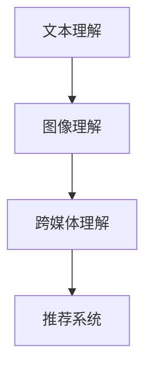

                 

# 小红书2025社招图文内容理解算法工程师面试题

## 关键词：
- 小红书
- 社招
- 图文内容理解
- 算法工程师
- 面试题

## 摘要
本文将针对小红书2025年社招图文内容理解算法工程师的面试题目进行详细解析。通过对题目内容的深入分析，我们将探讨图文内容理解算法的基本原理、关键技术、数学模型及其在实际应用中的重要性。本文旨在为算法工程师提供宝贵的面试备考资料，并帮助读者更好地理解图文内容理解算法的实践应用。

## 1. 背景介绍

小红书，作为中国知名的社交电商平台，拥有庞大的用户群体和丰富的图文内容资源。随着人工智能技术的不断发展，图文内容理解成为电商平台提升用户体验、实现精准推荐的核心技术之一。图文内容理解算法工程师在小红书的核心团队中发挥着至关重要的作用，他们负责开发和优化算法模型，实现图文内容的智能解析和推荐。

### 1.1 图文内容理解的背景

随着移动互联网的普及，用户生成内容（UGC）在社交平台上日益繁荣。小红书作为知名的社区电商平台，其用户在平台上分享的图文内容涵盖了生活、购物、旅行等多个领域，为平台带来了大量的用户数据和潜在商业价值。然而，如何有效地理解、提取和利用这些图文内容，成为小红书等电商平台面临的挑战。

图文内容理解旨在通过对图文内容进行深度分析，提取关键信息，实现对内容的智能理解和利用。具体包括以下几个方面：

1. **文本理解**：通过对文本进行分词、词性标注、命名实体识别等操作，提取文本中的关键信息。
2. **图像理解**：利用计算机视觉技术，对图像中的物体、场景、情感等信息进行识别和分析。
3. **跨媒体理解**：结合文本和图像信息，实现对图文内容的综合理解和推理。

### 1.2 算法工程师的角色和职责

图文内容理解算法工程师在小红书团队中扮演着重要的角色，其主要职责包括：

1. **算法研究和开发**：研究最新的图文内容理解算法，并将其应用到实际项目中。
2. **模型优化**：通过实验和数据分析，对现有算法模型进行优化，提高模型的准确性和效率。
3. **系统维护和升级**：负责算法模型的系统维护和升级，确保平台的稳定运行。
4. **技术交流和分享**：参与团队内部的技术交流和分享，推动团队的技术进步。

## 2. 核心概念与联系

在图文内容理解算法中，涉及多个核心概念和技术，以下将简要介绍这些概念，并使用Mermaid流程图展示它们之间的联系。

### 2.1 核心概念

1. **文本理解**：通过对文本进行分词、词性标注、命名实体识别等操作，提取文本中的关键信息。
2. **图像理解**：利用计算机视觉技术，对图像中的物体、场景、情感等信息进行识别和分析。
3. **跨媒体理解**：结合文本和图像信息，实现对图文内容的综合理解和推理。
4. **推荐系统**：基于用户行为和内容特征，为用户提供个性化推荐。

### 2.2 Mermaid流程图

## 3. 核心算法原理 & 具体操作步骤

### 3.1 文本理解算法原理

文本理解是图文内容理解的基础，主要包括以下几个步骤：

1. **分词**：将文本分割成一个个独立的词语。
2. **词性标注**：为每个词语标注词性，如名词、动词、形容词等。
3. **命名实体识别**：识别文本中的命名实体，如人名、地名、组织机构名等。
4. **情感分析**：分析文本中的情感倾向，如正面、负面、中性等。

具体操作步骤如下：

1. **分词**：使用分词算法（如jieba分词），将文本分割成词语。
2. **词性标注**：使用词性标注算法（如NLTK），为每个词语标注词性。
3. **命名实体识别**：使用命名实体识别算法（如Stanford NER），识别文本中的命名实体。
4. **情感分析**：使用情感分析算法（如TextBlob），分析文本中的情感倾向。

### 3.2 图像理解算法原理

图像理解算法主要包括以下几个步骤：

1. **特征提取**：从图像中提取关键特征，如边缘、纹理、颜色等。
2. **物体识别**：利用特征匹配或深度学习模型，识别图像中的物体。
3. **场景理解**：分析图像中的场景信息，如场景布局、活动等。

具体操作步骤如下：

1. **特征提取**：使用特征提取算法（如SIFT、HOG），从图像中提取关键特征。
2. **物体识别**：使用物体识别算法（如YOLO、SSD），识别图像中的物体。
3. **场景理解**：使用场景理解算法（如ViViT），分析图像中的场景信息。

### 3.3 跨媒体理解算法原理

跨媒体理解算法旨在结合文本和图像信息，实现对图文内容的综合理解和推理。主要步骤如下：

1. **特征融合**：将文本和图像的特征进行融合，形成统一的特征表示。
2. **模型训练**：使用融合后的特征训练深度学习模型。
3. **推理与预测**：利用训练好的模型进行推理和预测。

具体操作步骤如下：

1. **特征融合**：使用注意力机制或对抗网络，将文本和图像的特征进行融合。
2. **模型训练**：使用融合后的特征训练深度学习模型（如BERT、GAT），用于图文内容理解。
3. **推理与预测**：利用训练好的模型进行推理和预测，实现对图文内容的综合理解。

## 4. 数学模型和公式 & 详细讲解 & 举例说明

### 4.1 数学模型

在图文内容理解中，常用的数学模型包括：

1. **卷积神经网络（CNN）**：用于图像特征提取和物体识别。
2. **循环神经网络（RNN）**：用于文本理解和序列处理。
3. **变压器模型（Transformer）**：用于文本和图像特征融合。

### 4.2 公式详解

1. **CNN公式**

$$
f_{\theta}(x) = \sigma(W_f \cdot \phi(W_e \cdot x) + b_f)
$$

其中，$x$ 为输入图像，$W_e$ 为特征提取网络权重，$W_f$ 为卷积层权重，$b_f$ 为卷积层偏置，$\sigma$ 为激活函数。

2. **RNN公式**

$$
h_t = \sigma(W_h \cdot [h_{t-1}, x_t] + b_h)
$$

其中，$h_t$ 为第 $t$ 个时刻的隐藏状态，$x_t$ 为输入文本，$W_h$ 为循环层权重，$b_h$ 为循环层偏置，$\sigma$ 为激活函数。

3. **Transformer公式**

$$
\text{Attention}(Q, K, V) = \text{softmax}\left(\frac{QK^T}{\sqrt{d_k}}\right)V
$$

其中，$Q$、$K$、$V$ 分别为查询、键、值向

