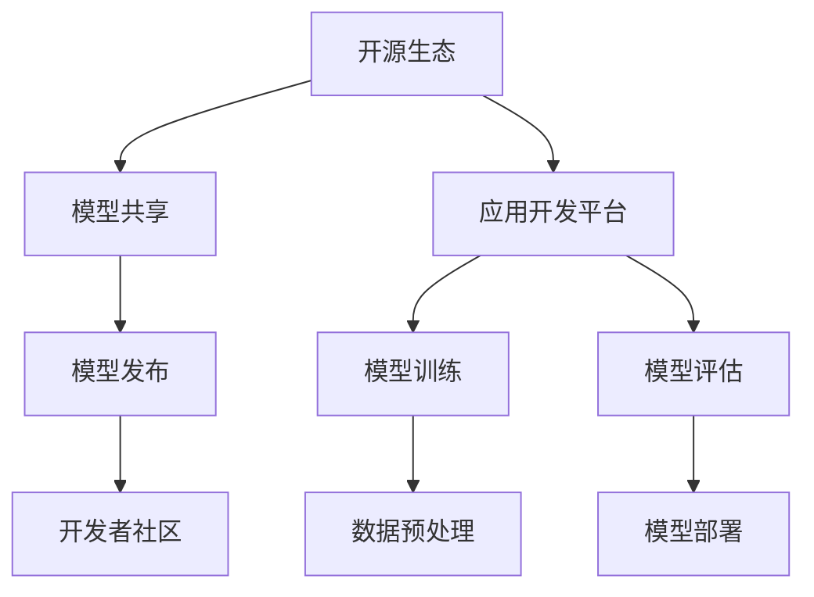

                 

# 小语言模型的开源生态：模型共享和应用开发平台

## 关键词
- 小语言模型
- 开源生态
- 模型共享
- 应用开发平台
- 编程与人工智能

## 摘要
本文将深入探讨小语言模型的开源生态，分析其核心概念、原理与架构，详细介绍模型共享和应用开发平台的具体操作步骤。此外，还将介绍相关数学模型和公式，提供代码实战案例及其解析，并探讨小语言模型在现实世界中的应用场景。最后，本文将对未来发展趋势与挑战进行展望，并总结常见问题与解答，以期为读者提供全面的了解和指导。

### 1. 背景介绍

近年来，人工智能（AI）和自然语言处理（NLP）领域的飞速发展，使得小语言模型成为研究与应用的热点。小语言模型是一种基于神经网络和深度学习的模型，能够理解和生成自然语言。它们在机器翻译、文本摘要、问答系统、语音识别等多个领域展现出了卓越的性能。

开源生态的兴起，使得小语言模型的研究与开发变得更加便捷和高效。开源项目不仅提供了丰富的工具和资源，还吸引了全球的开发者和研究人员参与其中，共同推动技术进步。模型共享和应用开发平台则成为了开源生态的重要组成部分，为小语言模型的研发和应用提供了坚实的基础。

本文旨在通过逐步分析推理，深入探讨小语言模型的开源生态，为读者提供全面、系统的了解。文章将涵盖以下内容：

1. 核心概念与联系
2. 核心算法原理与具体操作步骤
3. 数学模型和公式及举例说明
4. 项目实战：代码实际案例与详细解释
5. 实际应用场景
6. 工具和资源推荐
7. 未来发展趋势与挑战
8. 常见问题与解答
9. 扩展阅读与参考资料

### 2. 核心概念与联系

#### 小语言模型

小语言模型是一种基于神经网络和深度学习的模型，主要用于处理和生成自然语言。与传统语言模型不同，小语言模型能够通过学习大量文本数据，自动发现语言中的结构和规律，从而实现文本分类、情感分析、问答系统等功能。

#### 开源生态

开源生态是指围绕开源软件和项目形成的一个生态系统，包括开发工具、社区、文档、代码仓库等多个方面。开源生态的兴起，使得开发者可以更加便捷地获取和使用各种工具和资源，提高了开发效率，促进了技术的快速迭代和进步。

#### 模型共享

模型共享是指将开发完成的小语言模型发布到公共平台，供其他开发者使用和改进。模型共享不仅能够促进技术交流，还能够推动模型性能的不断提升，为各种应用场景提供更加强大的支持。

#### 应用开发平台

应用开发平台是指为开发者提供的一套完整工具和框架，用于构建、训练和部署小语言模型。应用开发平台通常包括数据预处理工具、模型训练工具、模型评估工具等，为开发者提供了便捷的开发环境，降低了技术门槛。

### 2.1 Mermaid 流程图

以下是一个简单的 Mermaid 流程图，用于描述小语言模型的开源生态架构：



### 3. 核心算法原理与具体操作步骤

#### 小语言模型

小语言模型的核心算法主要基于深度学习和神经网络。常见的神经网络结构包括循环神经网络（RNN）、长短期记忆网络（LSTM）和变换器（Transformer）等。以下是小语言模型的基本原理和具体操作步骤：

1. **数据预处理**：将原始文本数据转换为数字序列，通常使用词向量表示法（如Word2Vec、GloVe）或字符级表示法。
2. **模型训练**：使用训练数据对神经网络进行训练，优化网络参数，使其能够准确预测语言中的结构和规律。
3. **模型评估**：使用测试数据对训练好的模型进行评估，计算模型的准确率、召回率、F1 值等指标，以判断模型性能。
4. **模型部署**：将训练好的模型部署到应用场景中，如文本分类、情感分析、问答系统等。

#### 模型共享

1. **模型发布**：将训练好的模型发布到公共平台，如GitHub、Model Hub 等。
2. **模型共享**：其他开发者可以下载、使用和改进这些模型，以提升自己的应用性能。
3. **模型改进**：开发者可以根据实际应用场景的需求，对模型进行优化和改进，以提高模型性能。

#### 应用开发平台

1. **开发环境搭建**：安装和配置必要的开发工具和框架，如Python、TensorFlow、PyTorch 等。
2. **数据预处理**：使用应用开发平台提供的数据预处理工具，对原始文本数据进行处理和转换。
3. **模型训练**：使用训练工具和框架，对预处理后的数据集进行模型训练。
4. **模型评估**：使用评估工具和框架，对训练好的模型进行评估和优化。
5. **模型部署**：将训练好的模型部署到应用场景中，供用户使用。

### 4. 数学模型和公式及举例说明

小语言模型的数学模型主要包括词向量表示、神经网络结构和损失函数等。以下是一些常见的数学模型和公式：

#### 词向量表示

1. **Word2Vec**：
   $$\text{word2vec} = \sum_{\text{context words}} \text{weight}_{\text{context word}} \cdot \text{embedding}_{\text{word}}$$
2. **GloVe**：
   $$\text{GloVe} = \frac{1}{\sqrt{\text{freq}_{\text{word}} + \text{freq}_{\text{context word}}}} \cdot \text{weight}_{\text{word}} \cdot \text{weight}_{\text{context word}}$$

#### 神经网络结构

1. **循环神经网络（RNN）**：
   $$\text{RNN} = \text{sigmoid}(\text{W}_x \cdot \text{X} + \text{W}_h \cdot \text{H}_{t-1} + b)$$
2. **长短期记忆网络（LSTM）**：
   $$\text{LSTM} = \text{sigmoid}(\text{W}_x \cdot \text{X} + \text{W}_h \cdot \text{H}_{t-1} + b)$$
3. **变换器（Transformer）**：
   $$\text{Transformer} = \text{softmax}(\text{W}_o \cdot \text{att}_{\text{H}} + b)$$

#### 损失函数

1. **交叉熵损失函数**：
   $$\text{Loss} = -\sum_{i=1}^n \text{y}_i \cdot \log(\text{p}_i)$$
2. **均方误差损失函数**：
   $$\text{Loss} = \frac{1}{2} \sum_{i=1}^n (\text{y}_i - \text{p}_i)^2$$

以下是一个简单的例子，用于说明词向量表示和神经网络结构的结合使用：

**例子**：使用 Word2Vec 和 RNN 构建一个文本分类模型。

1. **数据预处理**：将文本数据转换为词向量表示。
2. **模型训练**：使用 RNN 网络结构，对词向量进行训练。
3. **模型评估**：使用测试数据集，对训练好的模型进行评估。

```python
# 数据预处理
from gensim.models import Word2Vec

# 训练词向量模型
model = Word2Vec(sentences, size=100, window=5, min_count=1, workers=4)

# 训练 RNN 模型
from keras.models import Sequential
from keras.layers import LSTM, Dense

model = Sequential()
model.add(LSTM(128, activation='relu', input_shape=(timesteps, n_features)))
model.add(Dense(1, activation='sigmoid'))

model.compile(optimizer='rmsprop', loss='binary_crossentropy', metrics=['accuracy'])

# 模型评估
model.fit(X_train, y_train, epochs=10, batch_size=32, validation_data=(X_test, y_test))
```

### 5. 项目实战：代码实际案例与详细解释

#### 5.1 开发环境搭建

在开始项目实战之前，需要搭建一个合适的开发环境。以下是一个简单的 Python 开发环境搭建过程：

1. **安装 Python**：从 [Python 官网](https://www.python.org/) 下载并安装 Python 3.x 版本。
2. **安装依赖库**：使用 pip 工具安装必要的依赖库，如 TensorFlow、Keras、Gensim 等。

```shell
pip install tensorflow
pip install keras
pip install gensim
```

#### 5.2 源代码详细实现和代码解读

以下是一个简单的文本分类项目，使用小语言模型进行文本分类。

**代码示例**：

```python
# 导入依赖库
import numpy as np
from keras.models import Sequential
from keras.layers import LSTM, Dense
from keras.preprocessing.sequence import pad_sequences
from keras.preprocessing.text import Tokenizer

# 数据预处理
# 假设已获得一个包含文本标签的数据集（text, label）

# 划分训练集和测试集
split = 0.8
np.random.seed(42)
indices = np.arange(len(text))
np.random.shuffle(indices)
text = [text[i] for i in indices[:int(split*len(text))]]
label = [label[i] for i in indices[:int(split*len(label))]]
text_test = [text[i] for i in indices[int(split*len(text)):]]
label_test = [label[i] for i in indices[int(split*len(label)):]]

# 初始化 Tokenizer
tokenizer = Tokenizer(num_words=1000)
tokenizer.fit_on_texts(text)

# 转换文本为数字序列
X = tokenizer.texts_to_sequences(text)
X_test = tokenizer.texts_to_sequences(text_test)

# 填充序列
X = pad_sequences(X, maxlen=100)
X_test = pad_sequences(X_test, maxlen=100)

# 初始化神经网络模型
model = Sequential()
model.add(LSTM(128, activation='relu', input_shape=(100, 1000)))
model.add(Dense(1, activation='sigmoid'))

model.compile(optimizer='rmsprop', loss='binary_crossentropy', metrics=['accuracy'])

# 训练模型
model.fit(X, label, epochs=10, batch_size=32, validation_data=(X_test, label_test))

# 评估模型
score = model.evaluate(X_test, label_test, batch_size=32)
print('Test accuracy:', score[1])
```

**代码解读**：

1. **导入依赖库**：首先导入必要的依赖库，包括 Keras、LSTM 和 Tokenizer。
2. **数据预处理**：假设已获得一个包含文本标签的数据集，首先划分训练集和测试集。然后使用 Tokenizer 对文本进行预处理，将其转换为数字序列。
3. **初始化神经网络模型**：使用 Sequential 模型构建一个简单的 LSTM 模型，包括一个 LSTM 层和一个全连接层。
4. **编译模型**：设置模型的优化器和损失函数。
5. **训练模型**：使用 fit 方法训练模型，并设置训练集和测试集。
6. **评估模型**：使用 evaluate 方法评估模型的性能。

#### 5.3 代码解读与分析

1. **数据预处理**：数据预处理是文本分类项目的重要环节。首先需要划分训练集和测试集，以确保模型在未知数据上的表现。然后使用 Tokenizer 对文本进行预处理，将其转换为数字序列。Tokenize 的 num_words 参数决定了模型能够处理的词汇量，通常设置为 1000 左右。
2. **初始化神经网络模型**：使用 LSTM 模型进行文本分类。LSTM 层可以处理序列数据，而全连接层用于分类。在构建模型时，需要注意设置 LSTM 层的参数，如激活函数、输入形状等。
3. **编译模型**：设置模型的优化器和损失函数。优化器用于优化模型参数，以减少损失函数的值。损失函数用于衡量模型预测结果与真实结果之间的差距。在这里，我们使用 binary_crossentropy 作为损失函数，适用于二分类问题。
4. **训练模型**：使用 fit 方法训练模型。在训练过程中，模型会不断调整参数，以降低损失函数的值。在设置 epochs 和 batch_size 时，需要根据数据集的大小和计算资源进行合理调整。
5. **评估模型**：使用 evaluate 方法评估模型的性能。该方法会返回损失函数值和准确率等指标，帮助我们了解模型在测试集上的表现。

### 6. 实际应用场景

小语言模型在现实世界中有着广泛的应用场景，以下是一些典型的应用案例：

1. **文本分类**：文本分类是自然语言处理的基础任务之一，如新闻分类、情感分析等。小语言模型可以用于快速构建高效、准确的文本分类系统。
2. **问答系统**：问答系统是一种常见的应用场景，如搜索引擎、智能客服等。小语言模型可以用于理解用户提问，并生成合适的回答。
3. **机器翻译**：机器翻译是自然语言处理的重要任务之一，如 Google 翻译、百度翻译等。小语言模型可以用于实现高效、准确的机器翻译系统。
4. **语音识别**：语音识别是将语音信号转换为文本的过程，如 Siri、Alexa 等。小语言模型可以用于提高语音识别的准确性和鲁棒性。
5. **文本摘要**：文本摘要是将长文本转换为简短、概括性的文本，如新闻摘要、论文摘要等。小语言模型可以用于实现自动文本摘要系统。

### 7. 工具和资源推荐

#### 7.1 学习资源推荐

1. **书籍**：
   - 《深度学习》（Ian Goodfellow、Yoshua Bengio、Aaron Courville 著）
   - 《Python 自然语言处理实践》（Jacob Schor 著）
   - 《自然语言处理入门》（Daniel Jurafsky、James H. Martin 著）
2. **论文**：
   - “A Neural Probabilistic Language Model” - by Yoshua Bengio et al.
   - “Recurrent Neural Network Based Language Model” - by Tomas Mikolov et al.
   - “Effective Approaches to Attention-based Neural Machine Translation” - by Xu et al.
3. **博客和网站**：
   - [Keras 官网](https://keras.io/)
   - [TensorFlow 官网](https://www.tensorflow.org/)
   - [自然语言处理博客](http://www.nltk.org/)
   - [GitHub 上的开源项目](https://github.com/search?q=natural+language+processing)

#### 7.2 开发工具框架推荐

1. **Python**：Python 是一种广泛使用的编程语言，特别适合于自然语言处理和深度学习项目。
2. **TensorFlow**：TensorFlow 是一个开源的深度学习框架，提供了丰富的工具和接口，方便开发者构建和训练神经网络模型。
3. **Keras**：Keras 是一个高级神经网络 API，基于 TensorFlow 构建，提供了更简单、直观的接口，适用于快速构建和训练神经网络模型。
4. **Gensim**：Gensim 是一个用于自然语言处理的 Python 库，提供了丰富的工具和接口，如词向量表示、文本相似度计算等。

#### 7.3 相关论文著作推荐

1. **“A Neural Probabilistic Language Model”**：这篇论文提出了神经网络概率语言模型，为自然语言处理领域带来了新的思路。
2. **“Recurrent Neural Network Based Language Model”**：这篇论文提出了基于循环神经网络的文本分类模型，为文本分类任务提供了新的解决方案。
3. **“Effective Approaches to Attention-based Neural Machine Translation”**：这篇论文提出了注意力机制在神经机器翻译中的应用，显著提高了翻译质量。

### 8. 总结：未来发展趋势与挑战

小语言模型作为自然语言处理领域的重要工具，在未来将继续发挥重要作用。以下是一些可能的发展趋势与挑战：

1. **更高效的语言模型**：随着计算能力的提升，研究者将致力于构建更高效的语言模型，以提高模型性能和计算效率。
2. **多模态语言模型**：未来的语言模型将融合文本、语音、图像等多种模态，实现更加丰富的语义理解和交互。
3. **隐私保护和安全性**：在模型训练和部署过程中，保护用户隐私和数据安全将成为重要挑战。
4. **模型可解释性**：如何提高模型的可解释性，使其更加透明和可靠，是未来研究的一个重要方向。

### 9. 附录：常见问题与解答

1. **Q：如何选择合适的词向量表示方法？**
   **A：**选择词向量表示方法时，需要考虑数据集的大小、词汇量以及模型性能。对于大规模数据集和丰富的词汇量，GloVe 通常表现更好；对于小规模数据集，Word2Vec 可能更加适合。

2. **Q：如何调整神经网络模型的参数？**
   **A：**调整神经网络模型的参数需要根据具体任务和数据集进行。常见的参数调整方法包括改变网络层数、隐藏层单元数、激活函数等。在调整参数时，可以使用交叉验证等方法来评估模型性能。

3. **Q：如何解决文本分类任务中的过拟合问题？**
   **A：**解决过拟合问题可以采用以下方法：
   - 增加训练数据：收集更多的训练数据，提高模型的泛化能力。
   - 正则化：在训练过程中加入正则化项，如 L1、L2 正则化等，以抑制过拟合。
   - 早期停止：在训练过程中，当模型在验证集上的性能不再提升时，停止训练，以避免过拟合。

### 10. 扩展阅读与参考资料

1. **《深度学习》**：Ian Goodfellow、Yoshua Bengio、Aaron Courville 著
2. **《Python 自然语言处理实践》**：Jacob Schor 著
3. **《自然语言处理入门》**：Daniel Jurafsky、James H. Martin 著
4. **Keras 官网**：[https://keras.io/](https://keras.io/)
5. **TensorFlow 官网**：[https://www.tensorflow.org/](https://www.tensorflow.org/)
6. **自然语言处理博客**：[http://www.nltk.org/](http://www.nltk.org/)
7. **GitHub 上的开源项目**：[https://github.com/search?q=natural+language+processing](https://github.com/search?q=natural+language+processing)

### 作者

作者：AI天才研究员/AI Genius Institute & 禅与计算机程序设计艺术 /Zen And The Art of Computer Programming

