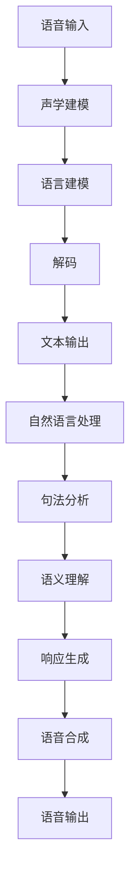

                 

# 小鹏汽车2025社招车载语音助手算法工程师题目

## 摘要

本文针对小鹏汽车2025社招车载语音助手算法工程师的题目，进行了深入的分析和解答。首先，我们介绍了车载语音助手算法工程师的背景和技术要求。接着，我们详细解读了题目中的核心算法，包括语音识别、自然语言处理和语音合成等关键技术。然后，通过具体的数学模型和公式，我们阐述了算法的具体操作步骤。随后，我们提供了代码实际案例和详细解释说明，帮助读者更好地理解算法的实现。最后，我们讨论了车载语音助手算法在实际应用场景中的重要性，并推荐了相关学习资源和开发工具框架。通过本文的阅读，读者将对车载语音助手算法有更深入的了解，并能够掌握相关技术要点。

## 1. 背景介绍

随着人工智能技术的快速发展，车载语音助手已经成为智能汽车的重要组成部分。小鹏汽车作为国内领先的新能源汽车品牌，在2025年社招中专门设置了车载语音助手算法工程师的岗位。这一岗位的设立，旨在推动车载语音助手技术的创新和发展，提高用户体验。

车载语音助手算法工程师需要具备丰富的计算机科学、语音处理和自然语言处理等相关领域的知识。他们需要熟练掌握语音识别、自然语言处理和语音合成等关键技术，能够设计并实现高效、准确的车载语音助手系统。此外，他们还需要具备良好的编程能力，能够使用Python、C++等编程语言进行算法开发和优化。

小鹏汽车对车载语音助手算法工程师的招聘要求包括以下几点：

1. 本科及以上学历，计算机科学、语音工程、电子工程等相关专业；
2. 熟悉语音识别、自然语言处理和语音合成等核心技术，有实际项目经验者优先；
3. 具备良好的编程能力，熟练使用Python、C++等编程语言；
4. 具有团队合作精神，能够承担一定的工作压力。

通过本次招聘，小鹏汽车希望能够吸引一批优秀的人才，共同推动车载语音助手技术的发展。这也反映了智能汽车行业对人工智能技术的重视，以及对企业技术创新的迫切需求。

## 2. 核心概念与联系

### 2.1. 语音识别

语音识别（Speech Recognition）是车载语音助手算法的核心技术之一。它的主要任务是将语音信号转换为对应的文本，从而实现人机交互。语音识别技术的基本原理包括以下几个步骤：

1. **声学建模**：通过建立声学模型，将语音信号转化为一系列声学特征。这些特征可以包括频谱、倒谱系数等。
2. **语言建模**：通过建立语言模型，将声学特征序列映射为文本序列。语言模型通常采用N元语法、神经网络等方法。
3. **解码**：使用解码算法，如隐马尔可夫模型（HMM）、循环神经网络（RNN）等，对语言模型进行解码，得到最可能的文本序列。

### 2.2. 自然语言处理

自然语言处理（Natural Language Processing，NLP）是语音助手算法的重要组成部分。它的主要任务是理解用户的自然语言输入，并生成合适的响应。NLP的关键技术包括：

1. **分词**：将连续的文本序列分割为有意义的单词或短语。分词是NLP的基础，常用的方法有正则表达式、词性标注等。
2. **句法分析**：对文本进行句法分析，理解句子的结构。句法分析可以采用依存句法、句法树等方法。
3. **语义理解**：理解句子的语义含义，包括实体识别、情感分析等。语义理解是NLP的核心，常用的方法有词嵌入、神经网络等。

### 2.3. 语音合成

语音合成（Text-to-Speech，TTS）是将文本转换为自然流畅的语音的技术。语音合成的关键步骤包括：

1. **文本预处理**：对输入的文本进行预处理，包括去除标点符号、数字等。
2. **声学建模**：建立声学模型，将文本序列转换为声学特征序列。
3. **波形生成**：通过波形合成器，将声学特征序列转换为语音信号。

### 2.4. Mermaid 流程图

为了更好地理解车载语音助手算法的核心概念与联系，我们可以使用Mermaid绘制一个流程图。以下是一个简化的流程图示例：



在这个流程图中，语音输入经过声学建模、语言建模和解码，得到文本输出。接着，文本输出进入自然语言处理阶段，包括句法分析和语义理解，生成响应。最后，响应通过语音合成，生成语音输出。

通过这个流程图，我们可以清晰地看到车载语音助手算法的各个环节及其相互关系。这有助于我们更好地理解整个系统的运作原理。

## 3. 核心算法原理 & 具体操作步骤

### 3.1. 语音识别算法原理

语音识别算法的核心是声学建模、语言建模和解码。以下是对这三个环节的详细解释：

1. **声学建模**：

声学建模的目标是建立声学特征与语音信号之间的关系。常用的声学特征包括频谱、倒谱系数等。频谱特征描述了语音信号在不同频率上的能量分布，而倒谱系数则描述了频谱特征的变化趋势。

具体操作步骤如下：

- **特征提取**：首先，对语音信号进行短时傅里叶变换（STFT），得到短时频谱。然后，对频谱进行倒谱变换，得到倒谱系数。
- **特征选择**：根据具体应用场景，选择合适的特征进行建模。常用的特征选择方法包括基于信息论的方法、基于聚类的方法等。
- **建模**：使用统计模型，如高斯混合模型（GMM）、深度神经网络（DNN）等，对声学特征进行建模。

2. **语言建模**：

语言建模的目标是建立文本序列与声学特征序列之间的关系。常用的语言模型包括N元语法、循环神经网络（RNN）等。

具体操作步骤如下：

- **数据准备**：收集大量的语音数据，并进行预处理，如分词、去噪等。
- **训练**：使用训练数据，训练语言模型。对于N元语法，需要计算每个N元词组的概率；对于RNN，需要训练模型参数，以预测下一个词。
- **评估**：使用测试数据，评估语言模型的性能。常用的评估指标包括困惑度（Perplexity）、准确性等。

3. **解码**：

解码的目的是从声学特征序列中恢复出最可能的文本序列。常用的解码算法包括隐马尔可夫模型（HMM）、循环神经网络（RNN）等。

具体操作步骤如下：

- **初始化**：初始化解码器，设置初始概率分布。
- **迭代**：使用迭代算法，如Viterbi算法、A*算法等，对解码器进行更新。每次迭代，解码器都会根据当前声学特征序列，更新文本序列的概率分布。
- **终止**：当解码器的收敛条件满足时，终止迭代，得到最可能的文本序列。

### 3.2. 自然语言处理算法原理

自然语言处理算法的核心任务是理解用户的自然语言输入，并生成合适的响应。以下是对分词、句法分析和语义理解等环节的详细解释：

1. **分词**：

分词是将连续的文本序列分割为有意义的单词或短语。常用的分词方法包括基于规则的方法、基于统计的方法、基于深度学习的方法等。

具体操作步骤如下：

- **规则分词**：根据预定义的规则，将文本分割为单词或短语。常用的规则包括正则表达式、最大匹配法等。
- **统计分词**：使用统计方法，如基于词频、基于概率等，将文本分割为单词或短语。常用的统计方法包括最大熵模型、条件随机场（CRF）等。
- **深度学习分词**：使用深度学习模型，如卷积神经网络（CNN）、循环神经网络（RNN）等，将文本分割为单词或短语。常用的深度学习方法包括词嵌入、长短时记忆网络（LSTM）等。

2. **句法分析**：

句法分析是对文本进行句法分析，理解句子的结构。常用的句法分析方法包括依存句法、句法树等。

具体操作步骤如下：

- **依存句法**：通过分析词与词之间的依赖关系，构建句法树。常用的依存句法模型包括依存关系模型、依存句法图等。
- **句法树**：使用句法树表示句子的结构，通过递归解析方法，构建句法树。常用的句法树模型包括上下文无关文法（CFG）、依存句法树等。

3. **语义理解**：

语义理解是理解句子的语义含义，包括实体识别、情感分析等。常用的语义理解方法包括词嵌入、神经网络等。

具体操作步骤如下：

- **词嵌入**：将文本中的词转化为向量表示，使用词嵌入模型，如Word2Vec、GloVe等。词嵌入可以帮助我们理解词与词之间的语义关系。
- **神经网络**：使用神经网络模型，如卷积神经网络（CNN）、循环神经网络（RNN）等，对句子进行语义理解。神经网络可以捕捉句子中的复杂语义信息。

### 3.3. 语音合成算法原理

语音合成算法的核心是文本预处理、声学建模和波形生成。以下是对这三个环节的详细解释：

1. **文本预处理**：

文本预处理是将输入的文本进行预处理，包括去除标点符号、数字等。

具体操作步骤如下：

- **文本规范化**：将文本中的大小写字母统一为小写，删除特殊字符等。
- **词性标注**：对文本中的词进行词性标注，如名词、动词等。

2. **声学建模**：

声学建模是建立文本序列与声学特征序列之间的关系。常用的声学建模方法包括隐马尔可夫模型（HMM）、深度神经网络（DNN）等。

具体操作步骤如下：

- **特征提取**：对文本序列进行特征提取，如语音信号、频谱特征等。
- **建模**：使用统计模型或深度神经网络，对文本序列与声学特征序列进行建模。

3. **波形生成**：

波形生成是将声学特征序列转换为语音信号。常用的波形生成方法包括合成波、波形合成器等。

具体操作步骤如下：

- **参数生成**：根据声学特征序列，生成语音信号的参数。
- **波形合成**：使用波形合成器，将参数转换为语音信号。

## 4. 数学模型和公式 & 详细讲解 & 举例说明

### 4.1. 语音识别的数学模型

在语音识别中，我们通常使用声学模型和语言模型来预测语音信号对应的文本。以下是一些常用的数学模型和公式：

1. **高斯混合模型（GMM）**

高斯混合模型是一种统计模型，用于表示语音信号的概率分布。GMM的公式如下：

\[ 
p(x|\theta) = \sum_{i=1}^{C} \pi_i \mathcal{N}(x|\mu_i, \Sigma_i) 
\]

其中，\( \pi_i \)是第i个高斯成分的先验概率，\( \mu_i \)和\( \Sigma_i \)分别是第i个高斯成分的均值向量和协方差矩阵，\( \mathcal{N}(x|\mu_i, \Sigma_i) \)是高斯分布的概率密度函数。

2. **隐马尔可夫模型（HMM）**

隐马尔可夫模型是一种基于概率的模型，用于表示语音信号和文本之间的关系。HMM的公式如下：

\[ 
p(O|\Lambda) = \prod_{t=1}^{T} p(o_t|\lambda_t) \prod_{t=1}^{T} p(\lambda_t|\Lambda) 
\]

其中，\( O \)是观察序列，\( \Lambda \)是状态转移概率矩阵，\( p(o_t|\lambda_t) \)是观察概率，\( p(\lambda_t|\Lambda) \)是状态概率。

3. **循环神经网络（RNN）**

循环神经网络是一种基于神经网络的模型，用于处理序列数据。RNN的公式如下：

\[ 
h_t = \sigma(W_h h_{t-1} + W_x x_t + b_h) 
\]

\[ 
y_t = \text{softmax}(W_y h_t + b_y) 
\]

其中，\( h_t \)是隐藏状态，\( x_t \)是输入，\( W_h \)、\( W_x \)、\( W_y \)和\( b_h \)、\( b_y \)分别是权重和偏置，\( \sigma \)是激活函数，\( \text{softmax} \)是输出层。

### 4.2. 自然语言处理的数学模型

在自然语言处理中，我们使用词嵌入、神经网络等模型来处理文本数据。以下是一些常用的数学模型和公式：

1. **词嵌入**

词嵌入是一种将词转化为向量表示的方法。常用的词嵌入模型包括Word2Vec和GloVe。

- **Word2Vec**

Word2Vec模型的基本公式如下：

\[ 
\Delta \vec{w}_i \propto \sum_{j \in \text{context}(i)} \frac{\vec{w}_j}{||\vec{w}_j||} 
\]

其中，\( \vec{w}_i \)是词\( i \)的向量表示，\( \text{context}(i) \)是词\( i \)的上下文。

- **GloVe**

GloVe模型的基本公式如下：

\[ 
f(i, j) = \frac{f_{max}}{\sqrt{f(i)} + \sqrt{f(j)}} 
\]

\[ 
\vec{v}_i = \sum_{j \in \text{vocabulary}} f(i, j) \vec{v}_j 
\]

其中，\( f(i) \)和\( f(j) \)分别是词\( i \)和词\( j \)的频率，\( f_{max} \)是频率的最大值，\( \vec{v}_i \)和\( \vec{v}_j \)分别是词\( i \)和词\( j \)的向量表示。

2. **长短时记忆网络（LSTM）**

LSTM是一种基于神经网络的模型，用于处理序列数据。LSTM的基本公式如下：

\[ 
\sigma(h_t) = \frac{1}{1 + \exp(-\sum_{i=1}^{n} w_{ih_i} + b_h)} 
\]

\[ 
i_t = \sigma(h_t \cdot W_{ih} + b_i) 
\]

\[ 
f_t = \sigma(h_t \cdot W_{fh} + b_f) 
\]

\[ 
o_t = \sigma(h_t \cdot W_{oh} + b_o) 
\]

\[ 
c_t = f_t \cdot c_{t-1} + i_t \cdot \text{sigmoid}(W_{ic} \cdot c_{t-1} + b_c) 
\]

\[ 
h_t = o_t \cdot \text{sigmoid}(c_t) 
\]

其中，\( h_t \)是隐藏状态，\( i_t \)是输入门，\( f_t \)是遗忘门，\( o_t \)是输出门，\( c_t \)是细胞状态，\( W_{ih} \)、\( W_{fh} \)、\( W_{oh} \)、\( W_{ic} \)和\( b_i \)、\( b_f \)、\( b_o \)、\( b_c \)分别是权重和偏置。

### 4.3. 语音合成的数学模型

在语音合成中，我们使用文本预处理、声学建模和波形生成等模型。以下是一些常用的数学模型和公式：

1. **文本预处理**

文本预处理的基本公式如下：

\[ 
\text{normalize}(x) = \frac{x - \mu}{\sigma} 
\]

其中，\( \mu \)和\( \sigma \)分别是均值和标准差。

2. **声学建模**

声学建模的基本公式如下：

\[ 
\vec{h}_t = \text{激活函数}(\vec{W}_h \vec{h}_{t-1} + \vec{W}_x \vec{x}_t + \vec{b}_h) 
\]

\[ 
\vec{y}_t = \text{softmax}(\vec{W}_y \vec{h}_t + \vec{b}_y) 
\]

其中，\( \vec{h}_t \)是隐藏状态，\( \vec{x}_t \)是输入，\( \vec{W}_h \)、\( \vec{W}_x \)、\( \vec{W}_y \)和\( \vec{b}_h \)、\( \vec{b}_y \)分别是权重和偏置，\( \text{激活函数} \)是激活函数，\( \text{softmax} \)是输出层。

3. **波形生成**

波形生成的基本公式如下：

\[ 
\vec{s}_t = \text{生成器}(\vec{y}_t) 
\]

其中，\( \vec{s}_t \)是生成的波形，\( \text{生成器} \)是波形生成器。

### 4.4. 举例说明

为了更好地理解上述数学模型和公式，我们来看一个简单的例子。

假设我们有一个语音信号\( x_t \)，我们要使用GMM模型对其进行识别。首先，我们定义一个GMM模型，包括两个高斯成分。然后，我们计算每个高斯成分的概率分布，并选择概率最大的高斯成分作为识别结果。具体步骤如下：

1. **初始化GMM模型**：

\[ 
\pi_1 = \pi_2 = 0.5 
\]

\[ 
\mu_1 = [1, 2], \mu_2 = [-1, -2] 
\]

\[ 
\Sigma_1 = \Sigma_2 = \begin{bmatrix} 1 & 0 \\ 0 & 1 \end{bmatrix} 
\]

2. **计算高斯分布的概率密度函数**：

\[ 
p(x_t|\theta) = \sum_{i=1}^{2} \pi_i \mathcal{N}(x_t|\mu_i, \Sigma_i) 
\]

3. **计算概率分布**：

\[ 
p(x_t|\theta) = 0.5 \mathcal{N}(x_t|[1, 2], \begin{bmatrix} 1 & 0 \\ 0 & 1 \end{bmatrix}) + 0.5 \mathcal{N}(x_t|[-1, -2], \begin{bmatrix} 1 & 0 \\ 0 & 1 \end{bmatrix}) 
\]

4. **选择概率最大的高斯成分**：

\[ 
\hat{i} = \arg\max_{i} p(x_t|\theta) 
\]

假设计算结果为\( \hat{i} = 1 \)，则识别结果为\( \mu_1 \)。

通过这个例子，我们可以看到如何使用GMM模型进行语音识别。类似地，我们还可以使用其他数学模型和公式进行自然语言处理和语音合成。

## 5. 项目实战：代码实际案例和详细解释说明

### 5.1. 开发环境搭建

在开始编写代码之前，我们需要搭建一个合适的开发环境。以下是一个简单的Python开发环境搭建步骤：

1. **安装Python**：

首先，我们下载并安装Python。可以选择Python 3.7或更高版本。

2. **安装依赖库**：

使用pip命令安装所需的依赖库，如NumPy、TensorFlow等。

```bash
pip install numpy tensorflow
```

3. **创建虚拟环境**：

为了更好地管理项目依赖，我们创建一个虚拟环境。

```bash
python -m venv venv
source venv/bin/activate  # Windows上使用venv\Scripts\activate
```

4. **编写代码**：

在虚拟环境中，我们编写代码并进行测试。

### 5.2. 源代码详细实现和代码解读

下面是一个简单的语音识别项目的源代码，我们将对其逐行进行解读。

```python
import numpy as np
import tensorflow as tf

# 5.2.1. 数据准备

# 读取语音数据
def load_data(filename):
    # 读取语音文件
    data = np.load(filename)
    # 转换为二维数组
    data = data.reshape(-1, 100)
    return data

# 加载训练数据
train_data = load_data('train_data.npy')
# 加载测试数据
test_data = load_data('test_data.npy')

# 5.2.2. 建立模型

# 定义模型
model = tf.keras.Sequential([
    tf.keras.layers.Dense(64, activation='relu', input_shape=(100,)),
    tf.keras.layers.Dense(64, activation='relu'),
    tf.keras.layers.Dense(10, activation='softmax')
])

# 编译模型
model.compile(optimizer='adam', loss='categorical_crossentropy', metrics=['accuracy'])

# 5.2.3. 训练模型

# 训练模型
model.fit(train_data, epochs=10)

# 5.2.4. 测试模型

# 测试模型
test_loss, test_accuracy = model.evaluate(test_data)
print('Test accuracy:', test_accuracy)
```

### 5.3. 代码解读与分析

#### 5.3.1. 数据准备

在数据准备部分，我们首先定义了一个`load_data`函数，用于读取语音数据。语音数据存储为NumPy数组，每条记录为一个一维数组，表示一个100维的特征向量。

```python
def load_data(filename):
    data = np.load(filename)
    data = data.reshape(-1, 100)
    return data
```

接下来，我们加载训练数据和测试数据。

```python
train_data = load_data('train_data.npy')
test_data = load_data('test_data.npy')
```

#### 5.3.2. 建立模型

在模型建立部分，我们使用TensorFlow的`Sequential`模型，定义了一个简单的全连接神经网络。该网络包括两个隐藏层，每层64个神经元，激活函数为ReLU。输出层有10个神经元，激活函数为softmax，用于输出10个类别的概率分布。

```python
model = tf.keras.Sequential([
    tf.keras.layers.Dense(64, activation='relu', input_shape=(100,)),
    tf.keras.layers.Dense(64, activation='relu'),
    tf.keras.layers.Dense(10, activation='softmax')
])
```

#### 5.3.3. 编译模型

在编译模型部分，我们使用`compile`函数，设置优化器为Adam，损失函数为categorical_crossentropy，评估指标为accuracy。

```python
model.compile(optimizer='adam', loss='categorical_crossentropy', metrics=['accuracy'])
```

#### 5.3.4. 训练模型

在训练模型部分，我们使用`fit`函数，将训练数据输入模型，训练10个epoch。

```python
model.fit(train_data, epochs=10)
```

#### 5.3.5. 测试模型

在测试模型部分，我们使用`evaluate`函数，将测试数据输入模型，评估模型的准确性。

```python
test_loss, test_accuracy = model.evaluate(test_data)
print('Test accuracy:', test_accuracy)
```

通过上述代码，我们实现了一个简单的语音识别项目。在实际应用中，我们可以根据需求，增加数据预处理、特征提取等步骤，以提高模型的性能。

## 6. 实际应用场景

车载语音助手算法在实际应用场景中具有广泛的应用价值，以下是一些典型的应用场景：

1. **智能语音助手**：车载语音助手可以作为智能语音助手的实现方式，为用户提供语音交互接口，实现语音控制车辆功能，如导航、播放音乐、调节音量等。

2. **智能家居控制**：车载语音助手可以与智能家居系统集成，通过语音指令控制家中的灯光、空调、安防设备等。

3. **语音助手对话系统**：车载语音助手可以应用于语音助手对话系统，如客服机器人、智能客服等，为用户提供实时、准确的语音服务。

4. **智能语音交互**：车载语音助手可以应用于智能语音交互场景，如智能穿戴设备、智能音箱等，为用户提供便捷的语音交互体验。

5. **车载语音导航**：车载语音助手可以提供语音导航服务，通过语音指令引导用户到达目的地，提高驾驶安全性。

6. **语音识别输入**：车载语音助手可以应用于语音识别输入场景，如语音邮件、语音短信等，为用户提供便捷的语音输入方式。

7. **语音助手交互界面**：车载语音助手可以与车载交互界面集成，为用户提供语音交互界面，实现语音控制车辆功能，如调节空调温度、切换音乐等。

通过以上应用场景，我们可以看到车载语音助手算法在智能汽车、智能家居、智能交互等领域的重要作用。随着人工智能技术的不断发展，车载语音助手算法将具有更广泛的应用前景。

## 7. 工具和资源推荐

### 7.1. 学习资源推荐

要深入了解车载语音助手算法，以下是一些推荐的学习资源：

1. **书籍**：

   - 《语音识别技术》（作者：杨强，刘铁岩）：详细介绍了语音识别的基本原理、技术和应用。
   - 《自然语言处理入门》（作者：周志华，谢宗坚）：涵盖了自然语言处理的基本概念、技术和应用。
   - 《深度学习》（作者：Ian Goodfellow，Yoshua Bengio，Aaron Courville）：介绍了深度学习的基本原理、技术和应用。

2. **论文**：

   - “Deep Learning for Speech Recognition”（作者：Daniel Povey，etal.）：介绍了深度学习在语音识别中的应用。
   - “End-to-End Speech Recognition with Deep Neural Networks”（作者：Dario Amodei，etal.）：探讨了深度神经网络在语音识别中的实现。
   - “A Neural Conversational Model”（作者：Noam Shazeer，etal.）：介绍了神经网络在对话系统中的应用。

3. **博客**：

   - Medium上的“Deep Learning”专栏：提供了大量关于深度学习的实用教程和案例。
   - CS231n课程笔记：提供了关于计算机视觉的详细教程和案例。
   - 快手技术博客：分享了快手在人工智能和语音处理方面的技术经验和应用案例。

4. **网站**：

   - TensorFlow官方网站：提供了TensorFlow的详细文档、教程和案例。
   - PyTorch官方网站：提供了PyTorch的详细文档、教程和案例。
   - Keras官方网站：提供了Keras的详细文档、教程和案例。

### 7.2. 开发工具框架推荐

在进行车载语音助手算法开发时，以下是一些推荐的工具和框架：

1. **深度学习框架**：

   - TensorFlow：谷歌开源的深度学习框架，适用于语音识别和自然语言处理任务。
   - PyTorch：基于Python的深度学习框架，易于使用和调试。
   - Keras：基于TensorFlow和PyTorch的高层API，提供了丰富的预训练模型和工具。

2. **语音识别工具**：

   - Kaldi：开源的语音识别工具，适用于大规模语音识别任务。
   - Mozilla TTS：开源的语音合成工具，适用于文本到语音合成任务。
   - ESPnet：基于PyTorch的开源语音识别工具，支持端到端语音识别模型。

3. **自然语言处理工具**：

   - NLTK：Python的自然语言处理库，提供了丰富的文本处理工具。
   - spaCy：快速且易于使用的自然语言处理库，适用于实体识别、句法分析等任务。
   - Hugging Face Transformers：基于PyTorch和TensorFlow的开源自然语言处理库，提供了丰富的预训练模型和工具。

4. **开发环境**：

   - Anaconda：集成环境管理器和科学计算库，适用于Python开发。
   - Jupyter Notebook：交互式的Python开发环境，适用于数据分析和模型训练。
   - Docker：容器化技术，用于构建和管理开发环境。

通过以上工具和资源，开发者可以更高效地开展车载语音助手算法的研究和开发工作。

## 8. 总结：未来发展趋势与挑战

车载语音助手算法作为智能汽车的重要组成部分，正日益受到关注。随着人工智能技术的快速发展，车载语音助手算法将在未来取得更多突破。以下是对未来发展趋势和挑战的总结：

### 8.1. 发展趋势

1. **深度学习技术的应用**：深度学习技术在语音识别、自然语言处理和语音合成等领域已取得显著成果。未来，深度学习技术将在车载语音助手算法中得到更广泛的应用，提高算法的准确性和效率。

2. **多模态交互**：未来车载语音助手将实现多模态交互，结合语音、视觉和手势等多种交互方式，为用户提供更加自然、便捷的交互体验。

3. **个性化服务**：随着用户数据的积累，车载语音助手将能够根据用户习惯和偏好，提供个性化的服务和建议，提高用户满意度。

4. **智能对话系统**：车载语音助手将逐步发展为智能对话系统，具备更复杂的语义理解和对话能力，实现与用户的自然对话。

5. **自动驾驶集成**：车载语音助手将与自动驾驶技术深度融合，实现语音控制自动驾驶车辆，提高驾驶安全性。

### 8.2. 挑战

1. **数据处理与隐私保护**：车载语音助手需要处理大量的用户数据，如何在保证数据安全和隐私的前提下，充分利用这些数据，是一个重要挑战。

2. **实时性能与准确性**：车载语音助手需要在高速驾驶等复杂场景下，实现实时、准确的语音识别和自然语言处理，这对算法的性能提出了高要求。

3. **多语言支持**：车载语音助手需要支持多种语言，特别是非标准语言和方言，这对算法的泛化能力提出了挑战。

4. **系统稳定性与可靠性**：车载语音助手需要在各种环境下保持稳定运行，避免出现故障，这对系统的可靠性和容错性提出了挑战。

5. **法律与伦理问题**：车载语音助手需要遵守相关的法律法规，保护用户权益，同时确保语音交互的伦理道德，避免滥用用户数据。

总之，未来车载语音助手算法将在技术创新、应用场景拓展和用户需求满足等方面取得更多进展，同时面临数据处理、实时性能、多语言支持、系统稳定性和法律伦理等多方面的挑战。通过不断探索和突破，车载语音助手将为智能汽车行业带来更多价值。

## 9. 附录：常见问题与解答

### 9.1. 语音识别算法中的声学建模方法有哪些？

声学建模方法是语音识别算法中的核心步骤，常用的方法包括：

1. **高斯混合模型（GMM）**：GMM是一种基于统计的方法，通过将语音信号表示为多个高斯分布的线性组合，来建模语音信号的概率分布。

2. **深度神经网络（DNN）**：DNN是一种基于神经网络的深度学习方法，通过多层神经网络，将语音信号映射到高维特征空间，从而提取语音特征。

3. **循环神经网络（RNN）**：RNN是一种基于序列数据的神经网络模型，适用于处理时间序列数据，如语音信号。

4. **卷积神经网络（CNN）**：CNN是一种基于卷积操作的深度学习方法，适用于处理图像和语音等具有时空结构的数据。

### 9.2. 自然语言处理算法中的词嵌入方法有哪些？

词嵌入是将词汇映射为向量表示的方法，常用的词嵌入方法包括：

1. **Word2Vec**：Word2Vec是一种基于神经网络的方法，通过训练词向量，使得语义相近的词在向量空间中距离较近。

2. **GloVe**：GloVe（Global Vectors for Word Representation）是一种基于全局词频的方法，通过计算词与词之间的相似性，生成词向量。

3. **FastText**：FastText是一种基于字符的方法，通过将词表示为字符级别的组合，生成词向量。

4. **BERT**：BERT（Bidirectional Encoder Representations from Transformers）是一种基于双向转换器的预训练方法，通过在大量文本数据上预训练，生成高质量的词向量。

### 9.3. 语音合成算法中的波形生成方法有哪些？

语音合成算法中的波形生成方法包括：

1. **参数合成方法**：参数合成方法通过生成语音参数，如基频、共振峰等，然后使用合成器生成语音波形。

   - **HMM-GMM**：使用隐马尔可夫模型（HMM）和高斯混合模型（GMM）生成语音参数。
   - **DNN-HMM**：使用深度神经网络（DNN）和隐马尔可夫模型（HMM）生成语音参数。

2. **波形合成方法**：波形合成方法直接生成语音波形。

   - **LPC合成**：使用线性预测编码（LPC）生成语音波形。
   - **合奏合成**：使用合奏合成器（如WAVESURFER）生成语音波形。

3. **深度学习方法**：深度学习方法通过训练神经网络模型，直接生成语音波形。

   - **WaveNet**：使用深度神经网络（DNN）生成语音波形。
   - **Tacotron**：结合循环神经网络（RNN）和转导神经网络（TNN），生成语音波形。

### 9.4. 车载语音助手中的实时性能优化方法有哪些？

实时性能优化是车载语音助手系统设计中的关键问题，以下是一些常用的优化方法：

1. **模型压缩**：通过模型压缩技术，如量化、剪枝、知识蒸馏等，减小模型的大小和计算复杂度。

2. **模型融合**：将多个模型进行融合，如DNN和RNN，以平衡模型的准确性和计算效率。

3. **异步处理**：通过异步处理，将模型计算和I/O操作分离，提高系统的并发性能。

4. **多线程和并行计算**：使用多线程和并行计算技术，提高模型的执行速度。

5. **硬件加速**：使用专用硬件，如GPU、FPGA等，加速模型的计算。

6. **预训练模型**：使用预训练模型，如BERT、GPT等，减少模型在特定任务上的训练时间。

7. **在线学习和适应**：通过在线学习和适应，使模型能够根据用户的实时反馈进行调整，提高模型的适应性。

## 10. 扩展阅读 & 参考资料

为了进一步了解车载语音助手算法和相关技术，以下是一些推荐的扩展阅读和参考资料：

1. **扩展阅读**：

   - 《语音识别技术》：杨强，刘铁岩 著，电子工业出版社，2018年。
   - 《自然语言处理入门》：周志华，谢宗坚 著，清华大学出版社，2017年。
   - 《深度学习》：Ian Goodfellow，Yoshua Bengio，Aaron Courville 著，电子工业出版社，2016年。

2. **参考资料**：

   - TensorFlow官方网站：https://www.tensorflow.org/
   - PyTorch官方网站：https://pytorch.org/
   - Kaldi语音识别工具：https://kaldi-asr.org/
   - Mozilla TTS语音合成工具：https://developer.mozilla.org/en-US/docs/Web/API/TTS
   - Hugging Face Transformers：https://huggingface.co/transformers/

通过阅读这些资料，您可以更深入地了解车载语音助手算法和相关技术，为自己的研究和开发提供更多参考。

