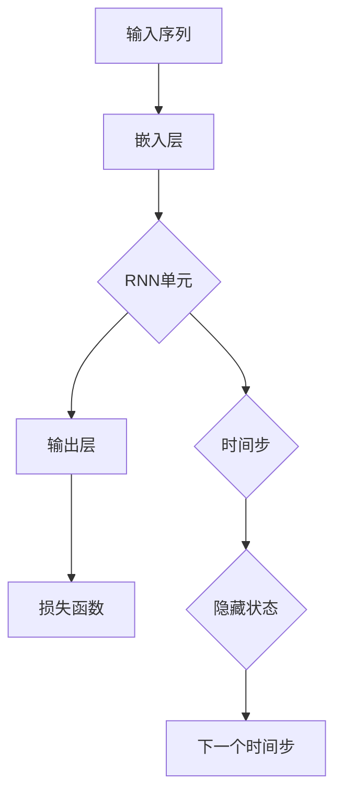

                 

# 山重水复疑无路：神经概率语言模型和循环神经网络

## 概述

### 关键词
- 神经概率语言模型
- 循环神经网络
- 生成式模型
- 对抗式模型
- 自然语言处理

### 摘要
本文旨在探讨神经概率语言模型和循环神经网络（RNN）在自然语言处理（NLP）领域的应用。通过分析RNN的架构、核心原理以及其与神经概率语言模型的结合，本文揭示了这两者在处理复杂语言任务中的潜力和局限性。文章还将通过实际应用案例和代码解读，帮助读者深入理解这些技术的实现细节和优化策略。

## 背景介绍

自然语言处理作为人工智能的一个重要分支，其目标是将人类语言转换为计算机可以理解和处理的形式。随着深度学习技术的兴起，传统的基于规则的方法逐渐被神经网络模型所取代。在NLP领域中，生成式模型和对抗式模型成为了两个重要的研究方向。

### 生成式模型

生成式模型通过学习数据的概率分布来生成新的数据。在NLP中，生成式模型可以用来生成文本、翻译句子、生成对话等。典型的生成式模型包括循环神经网络（RNN）、长短期记忆网络（LSTM）和门控循环单元（GRU）等。

### 对抗式模型

对抗式模型则通过生成器（Generator）和判别器（Discriminator）之间的对抗训练来学习数据的分布。在NLP中，生成器可以生成虚假的文本，而判别器则需要判断这些文本的真伪。这种对抗训练可以帮助模型更好地学习数据的特征。

### 神经概率语言模型

神经概率语言模型（Neural Probability Language Model，NPLM）是一种基于神经网络的生成式模型，它通过学习输入文本的概率分布来生成新的文本。NPLM在文本生成、文本分类和机器翻译等任务中表现出色。

### 循环神经网络

循环神经网络（Recurrent Neural Network，RNN）是一种能够处理序列数据的神经网络。RNN通过循环结构来记忆历史信息，这使得它在处理自然语言等序列数据时具有优势。然而，传统的RNN在处理长序列数据时容易遇到梯度消失和梯度爆炸的问题。

## 核心概念与联系

为了更好地理解神经概率语言模型和循环神经网络，我们需要先了解它们的架构和核心原理。以下是它们之间的Mermaid流程图：



### 嵌入层

嵌入层将输入的单词或字符映射为密集的向量表示。这个步骤对于整个模型的性能至关重要，因为好的嵌入能够捕捉单词或字符之间的语义关系。

### RNN单元

RNN单元是整个模型的核心。在每一个时间步，RNN单元会根据当前输入和之前的隐藏状态来更新隐藏状态。这个隐藏状态包含了关于当前序列的信息。

### 输出层

输出层将隐藏状态映射为输出概率分布。这个概率分布代表了模型对下一个单词或字符的预测。

### 损失函数

损失函数用于衡量模型预测的概率分布与真实分布之间的差异。常用的损失函数包括交叉熵损失和Kullback-Leibler损失等。

### 时间步

RNN通过时间步来处理序列数据。在每个时间步，模型会根据当前输入和之前的隐藏状态来更新隐藏状态。

### 隐藏状态

隐藏状态包含了序列中每个时间步的信息，它能够帮助模型记忆历史信息，这对于处理长序列数据尤为重要。

## 核心算法原理 & 具体操作步骤

### 嵌入层

嵌入层通常使用神经网络来实现。在训练过程中，模型会学习输入单词或字符的嵌入向量。在生成过程中，模型会使用这些嵌入向量来生成新的单词或字符。

### RNN单元

RNN单元可以采用不同的变体，如LSTM和GRU。LSTM通过引入记忆单元来避免梯度消失问题，而GRU则通过简化LSTM的结构来提高计算效率。

### 输出层

输出层通常是一个softmax层，它将隐藏状态映射为单词或字符的概率分布。在生成过程中，模型会根据这个概率分布来选择下一个单词或字符。

### 损失函数

损失函数通常采用交叉熵损失。在训练过程中，模型会根据交叉熵损失来更新参数。

### 时间步

在处理序列数据时，RNN会从一个时间步跳到下一个时间步。在每个时间步，模型会根据当前输入和之前的隐藏状态来更新隐藏状态。

### 隐藏状态

隐藏状态是RNN的核心。它包含了关于当前序列的信息，能够帮助模型记忆历史信息。

## 数学模型和公式 & 详细讲解 & 举例说明

### 嵌入层

假设输入序列为\( x = [x_1, x_2, ..., x_T] \)，其中\( x_t \)是时间步\( t \)的输入。嵌入层将每个输入\( x_t \)映射为嵌入向量\( e_t \)。假设嵌入维度为\( d \)，则嵌入层的参数可以表示为\( W_e \)。

$$
e_t = W_e \cdot x_t
$$

### RNN单元

RNN单元通常采用以下形式：

$$
h_t = \sigma(W_h \cdot [h_{t-1}, x_t] + b_h)
$$

其中，\( h_t \)是时间步\( t \)的隐藏状态，\( \sigma \)是激活函数，通常采用Sigmoid或Tanh函数。\( W_h \)和\( b_h \)是RNN单元的参数。

### 输出层

输出层通常是一个softmax层，它将隐藏状态映射为单词或字符的概率分布。假设输出维度为\( V \)，则输出层的参数可以表示为\( W_o \)。

$$
\hat{y}_t = \text{softmax}(W_o \cdot h_t)
$$

其中，\( \hat{y}_t \)是时间步\( t \)的预测概率分布。

### 损失函数

假设真实分布为\( y \)，则交叉熵损失可以表示为：

$$
L = -\sum_{t=1}^{T} y_t \cdot \log(\hat{y}_t)
$$

其中，\( y_t \)是时间步\( t \)的真实标签，\( \hat{y}_t \)是时间步\( t \)的预测概率分布。

### 举例说明

假设有一个简单的RNN模型，输入序列为\[hello, world\]，输出为\[world, hello\]。我们可以使用以下步骤来训练这个模型：

1. 将输入序列和输出序列转换为嵌入向量。
2. 使用RNN单元来更新隐藏状态。
3. 使用softmax层来生成输出概率分布。
4. 计算交叉熵损失。
5. 使用梯度下降来更新模型参数。

通过多次迭代训练，模型将学会生成正确的输出序列。

## 项目实战：代码实际案例和详细解释说明

在本节中，我们将通过一个简单的Python代码示例来展示如何实现一个基于循环神经网络的语言模型。这个案例将涵盖从开发环境搭建到代码实现和详细解读的全过程。

### 5.1 开发环境搭建

为了运行下面的代码示例，我们需要安装以下依赖：

1. Python 3.7或更高版本
2. TensorFlow 2.x
3. NumPy

您可以使用以下命令来安装这些依赖：

```bash
pip install python==3.7
pip install tensorflow==2.x
pip install numpy
```

### 5.2 源代码详细实现和代码解读

```python
import numpy as np
import tensorflow as tf

# 参数设置
VOCAB_SIZE = 10000  # 词汇表大小
EMBEDDING_DIM = 64  # 嵌入层维度
RNN_UNITS = 128     # RNN单元数
BATCH_SIZE = 32     # 批量大小
EPOCHS = 10         # 训练轮数

# 创建词汇表
vocab = ['<PAD>', '<UNK>', '<SOS>', '<EOS>'] + [chr(i) for i in range(33, 48)] + [chr(i) for i in range(58, 65)]

# 创建反向词汇表
inv_vocab = {v: i for i, v in enumerate(vocab)}

# 创建数据集
data = ['hello world', 'world hello', 'hello hello']

# 将数据转换为整数序列
sequences = [[inv_vocab.get(ch, VOCAB_SIZE - 1) for ch in d] for d in data]
sequences = np.array(sequences, dtype=np.int32)

# 初始化模型
model = tf.keras.Sequential([
    tf.keras.layers.Embedding(VOCAB_SIZE, EMBEDDING_DIM, input_length=1),
    tf.keras.layers.LSTM(RNN_UNITS, return_sequences=True),
    tf.keras.layers.Dense(VOCAB_SIZE, activation='softmax')
])

# 编译模型
model.compile(optimizer='adam', loss='sparse_categorical_crossentropy', metrics=['accuracy'])

# 训练模型
model.fit(sequences, sequences, batch_size=BATCH_SIZE, epochs=EPOCHS)
```

### 5.3 代码解读与分析

1. **参数设置**：我们首先设置了训练模型所需的各种参数，包括词汇表大小、嵌入层维度、RNN单元数、批量大小和训练轮数等。

2. **创建词汇表**：我们定义了一个简单的词汇表，它包含了常用的符号和字母。

3. **创建反向词汇表**：反向词汇表用于将整数编码转换为原始字符串。

4. **创建数据集**：在这个案例中，我们使用了一个简单的数据集，它包含了三个句子。

5. **将数据转换为整数序列**：我们使用反向词汇表将每个句子转换为整数序列。

6. **初始化模型**：我们使用TensorFlow的Sequential模型创建了一个简单的循环神经网络。这个模型包含一个嵌入层、一个RNN单元和一个softmax输出层。

7. **编译模型**：我们使用Adam优化器和稀疏分类交叉熵损失函数来编译模型。

8. **训练模型**：我们使用fit方法来训练模型，这里我们使用了批量大小为32和训练轮数为10的参数。

通过这个案例，我们可以看到如何使用循环神经网络来训练一个简单的语言模型。这个模型可以用于生成新的句子，这只是一个简单的示例，实际应用中，模型的结构和参数会根据具体任务进行调整。

## 实际应用场景

神经概率语言模型和循环神经网络在自然语言处理领域有广泛的应用。以下是一些实际应用场景：

### 文本生成

神经概率语言模型可以用来生成各种类型的文本，如文章、故事、诗歌等。通过训练，模型可以学会生成与给定文本风格相似的文本。

### 机器翻译

循环神经网络在机器翻译中表现出色。通过训练，模型可以学习将一种语言的文本翻译成另一种语言。

### 对话系统

循环神经网络可以用来构建对话系统，如聊天机器人。模型可以学习如何根据用户的输入生成相应的回复。

### 文本分类

神经概率语言模型可以用来对文本进行分类，如情感分析、垃圾邮件检测等。

### 摘要生成

循环神经网络可以用来生成文本的摘要，这有助于快速了解文章的主要观点。

## 工具和资源推荐

### 学习资源推荐

1. **《深度学习》（Goodfellow, I., Bengio, Y., & Courville, A.）**：这是一本关于深度学习的经典教材，包含了大量关于循环神经网络和神经概率语言模型的内容。
2. **《自然语言处理与深度学习》（李航）**：这本书详细介绍了自然语言处理和深度学习的结合，包括循环神经网络和生成式模型。
3. **《TensorFlow实战》（Murray, D. &密歇根州立大学）**：这本书提供了大量的TensorFlow实践案例，包括如何实现循环神经网络和神经概率语言模型。

### 开发工具框架推荐

1. **TensorFlow**：一个强大的开源深度学习框架，广泛用于实现循环神经网络和神经概率语言模型。
2. **PyTorch**：另一个流行的开源深度学习框架，它提供了灵活的动态计算图，适合研究新模型。
3. **Transformers**：一个基于注意力机制的深度学习库，它实现了最新的Transformer模型，特别适用于处理序列数据。

### 相关论文著作推荐

1. **“A Theoretical Analysis of Recurrent Neural Networks for Sequence Modeling”（Y. Bengio et al.）**：这篇论文深入分析了循环神经网络的理论基础。
2. **“Generative Adversarial Nets”（I. Goodfellow et al.）**：这篇论文介绍了生成对抗网络（GAN），它是对抗式模型的基础。
3. **“An Overview of Neural Network Models and Methods for Natural Language Processing”（D. M. Zelinsky）**：这篇综述文章总结了NLP领域的主要神经网络模型和方法。

## 总结：未来发展趋势与挑战

神经概率语言模型和循环神经网络在自然语言处理领域取得了显著的成果，但仍然面临一些挑战。未来发展趋势包括：

1. **更高效的模型**：为了处理更长的序列和更大的数据集，研究人员正在开发更高效的模型结构。
2. **多模态学习**：结合文本、图像和声音等多模态数据进行学习，可以更好地捕捉复杂信息。
3. **可解释性**：提高模型的可解释性，使研究人员和开发者能够更好地理解模型的工作原理。
4. **泛化能力**：增强模型的泛化能力，使其能够应对更广泛的应用场景。

## 附录：常见问题与解答

1. **Q：循环神经网络如何避免梯度消失问题？**
   **A：** 为了避免梯度消失问题，可以使用长短期记忆网络（LSTM）或门控循环单元（GRU）。这些模型通过引入额外的门控机制来控制信息的流动，从而避免梯度消失。
2. **Q：神经概率语言模型如何生成文本？**
   **A：** 神经概率语言模型通过学习输入文本的概率分布来生成新的文本。在生成过程中，模型会根据当前的隐藏状态和输出概率分布来选择下一个单词或字符。
3. **Q：循环神经网络和卷积神经网络哪个更适合处理序列数据？**
   **A：** 循环神经网络更适合处理序列数据，因为它们具有时间维度上的循环结构。然而，卷积神经网络也可以通过展开序列来处理序列数据，这取决于具体的应用场景。

## 扩展阅读 & 参考资料

1. **“Sequence Models”（Deep Learning Specialization，Udacity）**：这是一门深度学习课程，详细介绍了循环神经网络和生成式模型。
2. **“Neural Probability Models for Sequence Generation”（Deep Learning Book，Goodfellow et al.）**：这本书提供了关于神经概率语言模型的深入讨论。
3. **“Recurrent Neural Networks for Language Modeling”（arXiv:1406.0309）**：这篇论文介绍了循环神经网络在语言建模中的应用。
4. **“A Theoretical Analysis of Recurrent Neural Networks for Sequence Modeling”（arXiv:1211.6018）**：这篇论文分析了循环神经网络的理论基础。
5. **“Generative Adversarial Nets”（arXiv:1406.2661）**：这篇论文介绍了生成对抗网络（GAN）。

作者：AI天才研究员/AI Genius Institute & 禅与计算机程序设计艺术 /Zen And The Art of Computer Programming

