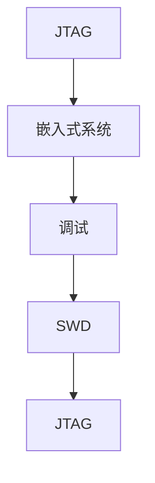
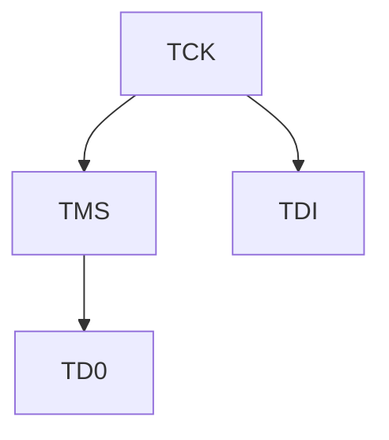
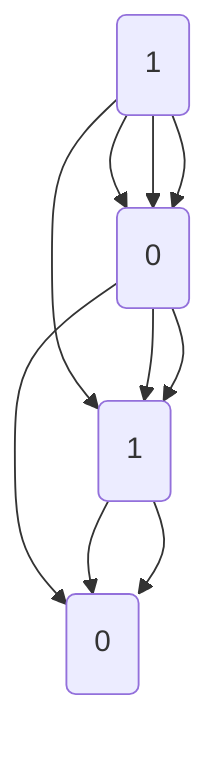
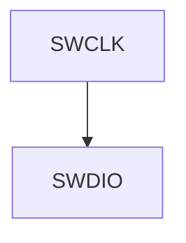

                 

### 文章标题：嵌入式调试技巧：使用 JTAG 和 SWD

关键词：嵌入式系统、调试技巧、JTAG、SWD、调试工具

摘要：本文将介绍嵌入式调试中常用的JTAG和SWD技术，详细解析其工作原理、操作步骤以及在实际应用中的使用方法。通过本文的阅读，读者可以深入了解嵌入式调试的基本技能，为嵌入式系统的开发提供有力支持。

### 1. 背景介绍

在嵌入式系统开发过程中，调试是必不可少的一个环节。通过调试，开发人员可以检查代码的正确性，定位并修复潜在的问题，确保嵌入式系统的稳定运行。随着嵌入式系统复杂度的不断增加，调试工具和技巧也在不断演进。JTAG（Joint Test Action Group）和SWD（Serial Wire Debug）是两种常见的嵌入式调试技术，广泛应用于现代嵌入式系统的开发过程中。

JTAG是一种用于芯片测试和调试的行业标准，最早由IEEE制定。它通过一组信号线实现对嵌入式系统中芯片的调试和控制。SWD则是在JTAG的基础上发展起来的一种新型调试技术，它采用了串行通信方式，具有更高的调试效率和更小的信号干扰。

本文将详细介绍JTAG和SWD的技术原理、操作步骤以及在实际应用中的使用方法，帮助读者掌握嵌入式调试的基本技能。

### 2. 核心概念与联系

为了更好地理解JTAG和SWD技术，我们首先需要了解一些核心概念。

#### 2.1 嵌入式系统

嵌入式系统是指嵌入在其他设备中的计算机系统，具有体积小、功耗低、可靠性高等特点。嵌入式系统通常由微控制器（MCU）、处理器（CPU）等核心部件构成，负责实现特定功能的自动化控制。

#### 2.2 调试

调试是嵌入式系统开发过程中的重要环节，旨在检查代码的正确性、定位并修复问题。调试方法包括断点设置、单步执行、变量观察等。

#### 2.3 JTAG

JTAG是一种用于芯片测试和调试的行业标准，通过一组信号线实现对嵌入式系统中芯片的调试和控制。JTAG信号线包括TCK（时钟线）、TMS（模式选择线）、TDI（数据输入线）、TD0（数据输出线）等。

#### 2.4 SWD

SWD是在JTAG的基础上发展起来的一种新型调试技术，采用了串行通信方式，具有更高的调试效率和更小的信号干扰。SWD信号线包括SWDIO（数据输入/输出线）、SWCLK（时钟线）、RESET（复位线）等。

下面是JTAG和SWD的核心概念及联系的Mermaid流程图：



### 3. 核心算法原理 & 具体操作步骤

#### 3.1 JTAG调试原理

JTAG调试基于IEEE 1149.1标准，通过一组信号线实现对嵌入式系统中芯片的调试和控制。JTAG信号线包括TCK（时钟线）、TMS（模式选择线）、TDI（数据输入线）、TD0（数据输出线）等。

在JTAG调试过程中，开发工具通过JTAG接口与目标芯片进行通信，实现以下功能：

1. 设置断点：在目标芯片的代码中设置断点，以便在程序运行到指定位置时暂停执行。
2. 单步执行：逐条执行目标芯片中的代码，观察代码执行过程。
3. 变量观察：查看目标芯片中变量的值，了解程序运行状态。

#### 3.2 JTAG操作步骤

1. 准备调试工具：选择合适的JTAG调试工具，如ST-Link、J-Link等。
2. 连接JTAG接口：将调试工具的JTAG接口与目标芯片的JTAG接口连接。
3. 配置调试环境：在开发工具中配置JTAG接口的参数，如时钟频率、通信协议等。
4. 设置断点：在代码中设置断点，以便在程序运行到指定位置时暂停执行。
5. 开始调试：运行程序，当程序运行到断点位置时，暂停执行，观察代码执行过程和变量值。
6. 修改代码：根据调试结果，修改代码并重新调试，直到问题解决。

#### 3.3 SWD调试原理

SWD调试是基于IAR和ARM共同制定的一种新型调试技术，采用了串行通信方式，具有更高的调试效率和更小的信号干扰。SWD信号线包括SWDIO（数据输入/输出线）、SWCLK（时钟线）、RESET（复位线）等。

在SWD调试过程中，开发工具通过SWD接口与目标芯片进行通信，实现以下功能：

1. 设置断点：在目标芯片的代码中设置断点，以便在程序运行到指定位置时暂停执行。
2. 单步执行：逐条执行目标芯片中的代码，观察代码执行过程。
3. 变量观察：查看目标芯片中变量的值，了解程序运行状态。

#### 3.4 SWD操作步骤

1. 准备调试工具：选择合适的SWD调试工具，如SWD-Link、ULINK等。
2. 连接SWD接口：将调试工具的SWD接口与目标芯片的SWD接口连接。
3. 配置调试环境：在开发工具中配置SWD接口的参数，如时钟频率、通信协议等。
4. 设置断点：在代码中设置断点，以便在程序运行到指定位置时暂停执行。
5. 开始调试：运行程序，当程序运行到断点位置时，暂停执行，观察代码执行过程和变量值。
6. 修改代码：根据调试结果，修改代码并重新调试，直到问题解决。

### 4. 数学模型和公式 & 详细讲解 & 举例说明

在JTAG和SWD调试过程中，涉及到一些基本的数学模型和公式。以下将对这些模型和公式进行详细讲解，并通过实例进行说明。

#### 4.1 JTAG时序模型

JTAG时序模型描述了JTAG信号线之间的时序关系。以下是一个简单的JTAG时序模型：



在JTAG时序模型中，TCK（时钟线）负责产生时钟信号，TMS（模式选择线）用于选择不同的JTAG操作模式，TDI（数据输入线）用于将数据输入到目标芯片，TD0（数据输出线）用于从目标芯片输出数据。

以下是一个JTAG时序模型的实例：



在这个实例中，TCK信号产生两个时钟周期，TMS信号在每个时钟周期交替变化，TDI信号在每个时钟周期将数据输入到目标芯片，TD0信号在每个时钟周期将数据从目标芯片输出。

#### 4.2 SWD时序模型

SWD时序模型描述了SWD信号线之间的时序关系。以下是一个简单的SWD时序模型：



在SWD时序模型中，SWCLK（时钟线）负责产生时钟信号，SWDIO（数据输入/输出线）用于将数据输入到或从目标芯片输出。

以下是一个SWD时序模型的实例：


在这个实例中，SWCLK信号产生两个时钟周期，SWDIO信号在每个时钟周期交替变化。

### 5. 项目实战：代码实际案例和详细解释说明

在本节中，我们将通过一个实际案例来展示如何使用JTAG和SWD进行嵌入式调试。案例涉及一个简单的嵌入式系统，用于控制LED灯的开关。

#### 5.1 开发环境搭建

为了完成这个案例，我们需要搭建一个合适的开发环境。以下是所需工具和软件：

1. 嵌入式开发板（如STM32F103C8T6）
2. JTAG调试工具（如ST-Link）
3. SWD调试工具（如ULINK）
4. 开发环境（如Keil uVision）
5. 代码示例（以下为简单的LED控制代码）

```c
#include "stm32f10x.h"

void LED_Init(void)
{
    GPIO_InitTypeDef GPIO_InitStructure;

    // 开启LED端口时钟
    RCC_APB2PeriphClockCmd(RCC_APB2Periph_GPIOB, ENABLE);

    // 配置LED端口为通用推挽输出
    GPIO_InitStructure.GPIO_Pin = GPIO_Pin_0;
    GPIO_InitStructure.GPIO_Mode = GPIO_Mode_Out_PP;
    GPIO_InitStructure.GPIO_Speed = GPIO_Speed_2MHz;
    GPIO_Init(GPIOB, &GPIO_InitStructure);
}

int main(void)
{
    LED_Init();

    while (1)
    {
        // 开启LED
        GPIOB->BSRR = GPIO_Pin_0;
        for (int i = 0; i < 500000; i++); // 等待一段时间

        // 关闭LED
        GPIOB->BRR = GPIO_Pin_0;
        for (int i = 0; i < 500000; i++); // 等待一段时间
    }
}
```

#### 5.2 源代码详细实现和代码解读

在这个案例中，我们使用Keil uVision开发环境，分别通过JTAG和SWD进行调试。

**JTAG调试：**

1. 连接ST-Link调试工具到开发板的JTAG接口。
2. 打开Keil uVision，导入代码，并设置调试选项。在“Project”菜单中选择“Options for Target”，切换到“Debug”标签页，选择“ST-Link”作为调试器，并配置合适的参数。
3. 编译代码，并启动调试。在“Debug”菜单中选择“Start/Stop Debug Session”。
4. 在代码中设置断点，并开始运行。程序运行到断点位置时，调试工具将暂停执行，并在调试控制台显示当前寄存器和变量的值。

**SWD调试：**

1. 连接ULINK调试工具到开发板的SWD接口。
2. 打开Keil uVision，导入代码，并设置调试选项。在“Project”菜单中选择“Options for Target”，切换到“Debug”标签页，选择“ULINK”作为调试器，并配置合适的参数。
3. 编译代码，并启动调试。在“Debug”菜单中选择“Start/Stop Debug Session”。
4. 在代码中设置断点，并开始运行。程序运行到断点位置时，调试工具将暂停执行，并在调试控制台显示当前寄存器和变量的值。

通过以上步骤，我们可以使用JTAG和SWD调试工具对LED控制代码进行调试，观察程序运行过程和寄存器变化。

### 6. 实际应用场景

JTAG和SWD技术广泛应用于嵌入式系统的开发过程中，以下是一些常见的实际应用场景：

1. **芯片测试与调试：** JTAG和SWD技术可以实现对嵌入式系统中各个芯片的测试和调试，包括微控制器、FPGA、DSP等。
2. **固件升级与编程：** 通过JTAG和SWD接口，可以方便地升级和编程嵌入式系统中的固件，实现系统功能优化和更新。
3. **系统性能分析：** 使用JTAG和SWD调试工具，可以实时监测嵌入式系统的性能，包括CPU利用率、内存访问速度等。
4. **故障诊断与修复：** 通过JTAG和SWD接口，可以快速定位嵌入式系统中的故障，并采取措施进行修复。

### 7. 工具和资源推荐

**7.1 学习资源推荐**

1. 《嵌入式系统设计与开发》：详细介绍了嵌入式系统的基础知识和开发方法，包括调试技术。
2. 《STM32嵌入式系统编程》：针对STM32系列微控制器，介绍了开发环境和调试方法。
3. 《JTAG与嵌入式系统调试》：专门介绍了JTAG和SWD技术在嵌入式系统调试中的应用。

**7.2 开发工具框架推荐**

1. Keil uVision：适用于ARM架构的嵌入式系统开发，支持JTAG和SWD调试。
2. IAR Embedded Workbench：适用于各种嵌入式系统开发，支持JTAG和SWD调试。
3. GNU Arm Embedded Toolchain：适用于ARM架构的嵌入式系统开发，支持JTAG和SWD调试。

**7.3 相关论文著作推荐**

1. “JTAG Debugging Techniques for Embedded Systems”：介绍了JTAG在嵌入式系统调试中的应用。
2. “A Survey of Debugging Techniques in Embedded Systems”：综述了嵌入式系统调试的各种技术。
3. “Design and Implementation of a Low-Power SWD Debugger for Embedded Systems”：介绍了一种低功耗的SWD调试器设计。

### 8. 总结：未来发展趋势与挑战

随着嵌入式系统技术的不断进步，JTAG和SWD技术也在不断更新和演进。未来，JTAG和SWD技术将在以下几个方面发展：

1. **更高效率：** 随着嵌入式系统复杂度的增加，对调试效率的要求也越来越高。未来的JTAG和SWD技术将更加注重提高调试效率，缩短调试周期。
2. **更小体积：** 随着便携式设备的普及，对调试工具体积的要求也越来越小。未来的JTAG和SWD技术将更加注重减小调试工具的体积，提高便携性。
3. **更低功耗：** 随着能源问题的日益突出，对调试工具功耗的要求也越来越低。未来的JTAG和SWD技术将更加注重降低功耗，实现绿色调试。

然而，JTAG和SWD技术在未来也面临着一些挑战，如信号干扰、抗干扰能力等。为了应对这些挑战，需要不断改进技术，提高JTAG和SWD调试的稳定性和可靠性。

### 9. 附录：常见问题与解答

**Q1：什么是JTAG？**

A1：JTAG（Joint Test Action Group）是一种用于芯片测试和调试的行业标准，通过一组信号线实现对嵌入式系统中芯片的调试和控制。

**Q2：什么是SWD？**

A2：SWD（Serial Wire Debug）是在JTAG的基础上发展起来的一种新型调试技术，采用了串行通信方式，具有更高的调试效率和更小的信号干扰。

**Q3：JTAG和SWD有什么区别？**

A3：JTAG和SWD都是用于嵌入式系统调试的技术，但SWD采用了串行通信方式，具有更高的调试效率和更小的信号干扰。JTAG则是一种更通用的芯片测试和调试技术。

**Q4：如何选择JTAG和SWD调试工具？**

A4：选择JTAG和SWD调试工具时，需要考虑以下几个方面：

1. 支持的芯片类型：确保调试工具支持您要调试的芯片。
2. 调试效率：选择具有高调试效率的工具，缩短调试周期。
3. 价格：根据您的预算选择合适的调试工具。
4. 便携性：根据您的需求选择体积适中、便于携带的调试工具。

### 10. 扩展阅读 & 参考资料

1. IEEE 1149.1标准：[http://ieeexplore.ieee.org/document/66560](http://ieeexplore.ieee.org/document/66560)
2. ARM SWD标准：[https://developer.arm.com/documentation/ihi0055/latest](https://developer.arm.com/documentation/ihi0055/latest)
3. Keil uVision开发环境：[https://www.keil.com/support/manuals/html/uv2/index.html](https://www.keil.com/support/manuals/html/uv2/index.html)
4. IAR Embedded Workbench开发环境：[https://www.iar.com/products/development-tools/iar-embedded-workbench/](https://www.iar.com/products/development-tools/iar-embedded-workbench/)
5. GNU Arm Embedded Toolchain：[https://developer.arm.com/tools-and-software/developer-tools/compilers/arm-gnueabi-toolchain](https://developer.arm.com/tools-and-software/developer-tools/compilers/arm-gnueabi-toolchain)

### 作者信息

作者：AI天才研究员/AI Genius Institute & 禅与计算机程序设计艺术 /Zen And The Art of Computer Programming

