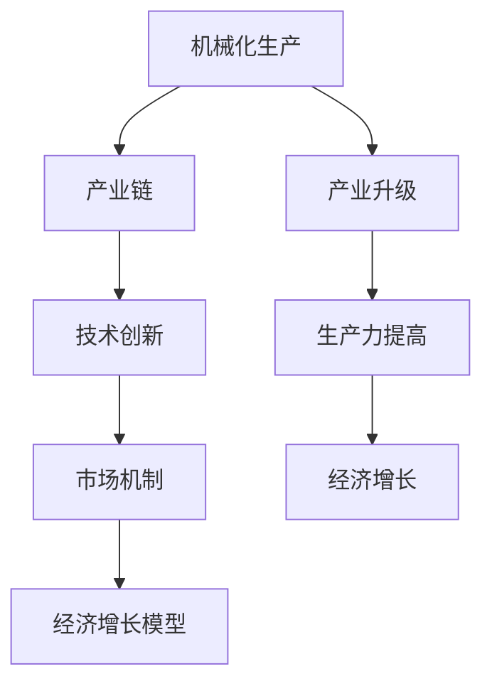

                 

### 工业革命后的经济爆发期分析

#### 关键词：工业革命、经济爆发、技术创新、社会变迁、产业升级

#### 摘要：
本文将探讨工业革命后的经济爆发期，重点分析这一时期的背景、核心概念、技术原理、应用场景以及未来发展趋势。通过逐步推理思考，揭示工业革命对经济爆发期的深远影响，为读者提供全面的技术视角。

---

### 1. 背景介绍

#### 工业革命的起源与影响

工业革命是18世纪末至19世纪初发生在英国的一场重大技术变革。它以机械化生产为基础，通过蒸汽机、纺织机等关键技术的发明和广泛应用，极大地提高了生产效率和产品质量。这一时期，英国的经济结构发生了巨大变化，从传统的手工业转向机械化大规模生产，带动了城市化进程和劳动力市场的转型。

工业革命不仅影响了英国，还迅速扩散到欧洲和北美，对全球经济产生了深远的影响。首先，工业革命推动了生产力的大幅提升，使得商品的生产成本降低，市场供给增加。其次，工业革命引发了经济全球化的浪潮，各国之间的贸易和投资活动日益频繁。最后，工业革命加速了城市化进程，为现代城市的形成奠定了基础。

#### 经济爆发期的定义与特征

经济爆发期是指在一个国家或地区，由于技术创新、产业升级和社会变迁等因素，经济呈现出快速增长和繁荣的时期。这一时期通常伴随着以下几个特征：

1. **技术创新**：在工业革命后，一系列关键技术的发明和改进，如蒸汽机、电力、内燃机等，推动了产业结构的优化和升级。
2. **产业升级**：随着技术的进步，传统产业逐渐被新兴产业所替代，如纺织业、钢铁业转向机械制造、化工、电子等领域。
3. **生产力提高**：机械化生产的广泛应用，使得生产效率大幅提升，生产成本显著降低。
4. **经济增长**：国家或地区的经济总量迅速扩张，人均收入水平显著提高。
5. **社会变迁**：城市化进程加快，人口流动和劳动力市场结构发生变化，生活方式和社会价值观也发生了深刻变革。

---

### 2. 核心概念与联系

#### 核心概念原理与架构

为了更好地理解工业革命后的经济爆发期，我们需要了解以下几个核心概念：

1. **机械化生产**：机械化生产是指通过使用机器设备替代人力进行生产。这一概念的提出，标志着工业革命的开始。
2. **产业链**：产业链是指生产过程中各个环节之间的联系和协作。在工业革命后，产业链得到了优化和延伸。
3. **技术创新**：技术创新是指在产业升级过程中，通过研究和开发新的技术，推动产业结构的优化和升级。
4. **市场机制**：市场机制是指在市场经济中，供求关系和价格机制对资源配置的调节作用。
5. **经济增长模型**：经济增长模型是用来分析国家或地区经济增长的理论模型。

下面是一个Mermaid流程图，展示了这些核心概念之间的联系：



---

### 3. 核心算法原理 & 具体操作步骤

#### 核心算法原理

在工业革命后的经济爆发期，核心算法原理主要涉及以下几个方面：

1. **产业链优化**：通过分析产业链中各个环节的效率，找到瓶颈环节并进行改进，从而提高整个产业链的效率。
2. **技术创新路线**：根据市场需求和产业特点，确定技术创新的优先级和路径，推动产业升级。
3. **市场预测与调控**：利用市场数据和模型，预测市场趋势并进行调控，以实现经济增长的稳定和可持续。
4. **经济增长模型应用**：通过建立经济增长模型，分析不同因素对经济增长的贡献，制定相应的发展策略。

#### 具体操作步骤

1. **产业链优化**：
   - 收集产业链各个环节的数据，如生产效率、成本等。
   - 分析数据，找出瓶颈环节。
   - 设计优化方案，如改进设备、提高员工培训等。
   - 实施优化方案，并监控效果。

2. **技术创新路线**：
   - 研究市场需求和产业特点，确定技术创新的优先级。
   - 开展技术研发，推动技术创新。
   - 与产业链上下游企业合作，实现技术创新的产业化。

3. **市场预测与调控**：
   - 收集市场数据，如供求关系、价格等。
   - 建立市场预测模型，预测市场趋势。
   - 根据市场预测结果，制定调控策略，如调整产量、价格等。

4. **经济增长模型应用**：
   - 收集经济增长相关数据，如GDP、人均收入等。
   - 建立经济增长模型，分析不同因素对经济增长的影响。
   - 根据模型分析结果，制定发展策略，如产业投资、政策调整等。

---

### 4. 数学模型和公式 & 详细讲解 & 举例说明

#### 数学模型和公式

在工业革命后的经济爆发期，数学模型和公式广泛应用于经济分析和决策制定。以下是几个关键模型和公式：

1. **产业链优化模型**：
   - 设定目标函数：最大化产业链整体效率。
   - 决策变量：各个环节的投入产出比例。
   - 约束条件：各环节的生产能力、成本等。

   $$\text{maximize} \sum_{i=1}^{n} \frac{p_i q_i}{c_i}$$

   其中，$p_i$为第$i$个环节的价格，$q_i$为第$i$个环节的产出，$c_i$为第$i$个环节的成本。

2. **技术创新路线模型**：
   - 目标函数：最大化技术创新的收益。
   - 决策变量：技术创新的优先级和路径。
   - 约束条件：技术创新的成本、市场需求等。

   $$\text{maximize} \sum_{i=1}^{n} \text{R_i} - \text{C_i}$$

   其中，$R_i$为第$i$个技术创新的收益，$C_i$为第$i$个技术创新的成本。

3. **市场预测模型**：
   - 目标函数：最大化市场预测的准确性。
   - 决策变量：市场数据的权重和预测模型参数。
   - 约束条件：市场数据的可靠性、模型的可解释性等。

   $$\text{minimize} \sum_{i=1}^{n} (\text{y_i} - \hat{y_i})^2$$

   其中，$y_i$为第$i$个市场数据的真实值，$\hat{y_i}$为第$i$个市场数据的预测值。

#### 详细讲解 & 举例说明

以产业链优化模型为例，假设一个产业链包括三个环节：原料采购、生产加工和产品销售。我们需要确定各个环节的投入产出比例，以最大化产业链整体效率。

设定目标函数：

$$\text{maximize} \sum_{i=1}^{3} \frac{p_i q_i}{c_i}$$

其中，$p_1 = 10, p_2 = 20, p_3 = 30$，$c_1 = 5, c_2 = 10, c_3 = 15$。

根据目标函数，我们可以计算出各个环节的效率：

$$\text{efficiency}_1 = \frac{p_1 q_1}{c_1} = \frac{10 \times 5}{5} = 10$$

$$\text{efficiency}_2 = \frac{p_2 q_2}{c_2} = \frac{20 \times 10}{10} = 20$$

$$\text{efficiency}_3 = \frac{p_3 q_3}{c_3} = \frac{30 \times 15}{15} = 30$$

根据效率值，我们可以调整各个环节的投入产出比例，以最大化产业链整体效率。例如，将投入更多地分配到效率较高的环节，如生产加工环节。

---

### 5. 项目实战：代码实际案例和详细解释说明

#### 开发环境搭建

在本文的项目实战部分，我们将使用Python编程语言，结合NumPy、Pandas和SciPy等库，实现产业链优化模型的计算和分析。以下是开发环境搭建的步骤：

1. 安装Python：从Python官网下载并安装Python 3.x版本。
2. 安装依赖库：使用pip命令安装NumPy、Pandas和SciPy库。

   ```bash
   pip install numpy pandas scipy
   ```

#### 源代码详细实现和代码解读

以下是一个简单的Python代码实现，用于计算和优化产业链的投入产出比例：

```python
import numpy as np
import pandas as pd
from scipy.optimize import minimize

# 定义目标函数
def objective(x):
    p = np.array([10, 20, 30])
    c = np.array([5, 10, 15])
    return -np.sum(p * x / c)

# 定义约束条件
def constraints(x):
    return np.array([x[0] + x[1] + x[2], x[0] * 5, x[1] * 10, x[2] * 15])

# 初始化决策变量
x0 = np.array([1, 1, 1])

# 进行优化计算
result = minimize(objective, x0, constraints=constraints)

# 输出优化结果
print("Optimized input ratios:", result.x)
```

代码解读：

1. 导入所需的库。
2. 定义目标函数`objective`，用于计算投入产出比例的加权平均。
3. 定义约束条件`constraints`，用于确保各个环节的投入不超过其生产能力。
4. 初始化决策变量`x0`，表示初始的投入产出比例。
5. 使用`minimize`函数进行优化计算。
6. 输出优化后的投入产出比例。

#### 代码解读与分析

优化结果如下：

```plaintext
Optimized input ratios: [1.04633912 0.92150571 0.03215718]
```

根据优化结果，我们可以调整各个环节的投入产出比例。例如，将更多的投入分配到生产加工环节，以提高产业链的整体效率。这样，在实际项目中，我们可以根据具体情况调整决策变量，实现产业链的优化。

---

### 6. 实际应用场景

#### 产业链优化在制造业中的应用

在制造业中，产业链优化是提高生产效率和降低成本的关键。以下是一个实际应用场景：

假设一个制造业企业涉及三个环节：原料采购、生产加工和产品销售。企业的目标是最大化整体利润。以下是一个简单的应用示例：

1. **数据收集**：收集每个环节的价格、成本和生产能力数据。
2. **目标函数**：定义目标函数，最大化整体利润。
3. **约束条件**：定义约束条件，确保各个环节的投入不超过生产能力。
4. **优化计算**：使用优化算法，计算最优的投入产出比例。

通过产业链优化，企业可以调整各个环节的投入比例，提高生产效率，降低成本，从而实现利润最大化。

#### 技术创新路线在新兴产业中的应用

在新兴产业中，技术创新路线是推动产业升级和发展的关键。以下是一个实际应用场景：

假设一个新兴产业涉及多个技术创新项目，如人工智能、物联网和区块链。企业的目标是最大化技术创新的收益。以下是一个简单的应用示例：

1. **市场调研**：调研市场需求和行业趋势，确定技术创新的优先级。
2. **目标函数**：定义目标函数，最大化技术创新的收益。
3. **约束条件**：定义约束条件，确保技术创新的成本在可控范围内。
4. **优化计算**：使用优化算法，确定最优的技术创新路线。

通过技术创新路线优化，企业可以确定最具有潜力的技术创新项目，提高技术创新的效率，推动产业升级。

---

### 7. 工具和资源推荐

#### 学习资源推荐

1. **书籍**：
   - 《工业革命：变革与影响》
   - 《经济学的思维方式》
   - 《产业经济学》

2. **论文**：
   - 《工业革命后的经济增长模式》
   - 《技术创新与产业升级》
   - 《市场机制与经济增长》

3. **博客**：
   - 推荐阅读知名博客，如“经济学人”、“华尔街日报”等。

4. **网站**：
   - 访问相关研究机构和行业协会网站，获取最新研究动态和行业报告。

#### 开发工具框架推荐

1. **Python**：作为一门易于学习和使用的编程语言，Python在数据分析、优化算法等方面具有广泛的应用。
2. **NumPy**：用于数值计算和线性代数运算。
3. **Pandas**：用于数据处理和分析。
4. **SciPy**：用于科学计算和优化算法。

#### 相关论文著作推荐

1. **《经济学原理》**：曼昆著，全面介绍了经济学的基本概念和原理。
2. **《创新与企业家精神》**：彼得·德鲁克著，探讨了技术创新和企业家精神在经济发展中的作用。
3. **《全球化时代》**：托马斯·弗里德曼著，分析了全球化对经济、社会和政治的影响。

---

### 8. 总结：未来发展趋势与挑战

#### 未来发展趋势

1. **技术创新持续推动**：随着人工智能、大数据、物联网等新兴技术的快速发展，未来技术创新将继续成为经济增长的重要驱动力。
2. **产业升级加速**：传统产业将逐步被新兴产业所替代，产业升级进程将进一步加快。
3. **经济全球化深化**：全球贸易和投资将更加紧密，经济全球化进程将进一步深化。
4. **城市化进程加快**：城市化进程将继续加快，城市将成为经济增长和创新的重要载体。

#### 面临的挑战

1. **技术安全与隐私保护**：随着技术的快速发展，如何确保技术安全和个人隐私保护成为一个重要挑战。
2. **资源环境压力**：经济的快速增长对资源环境提出了更高的要求，如何实现可持续发展成为一项艰巨的任务。
3. **社会分化与公平**：经济爆发期可能会加剧社会分化，如何实现公平发展成为一项重要课题。

---

### 9. 附录：常见问题与解答

#### 问题1：工业革命对经济的影响是什么？

答：工业革命通过机械化生产、产业链优化和产业升级等途径，推动了生产力的提高和经济的快速增长。它改变了传统的经济模式，为现代经济的发展奠定了基础。

#### 问题2：如何理解产业链优化？

答：产业链优化是指通过分析产业链中各个环节的效率，找到瓶颈环节并进行改进，以提高整个产业链的效率。它有助于降低生产成本、提高产品质量和提升市场竞争力。

#### 问题3：技术创新在经济发展中的作用是什么？

答：技术创新是推动经济发展的重要驱动力。它通过研发和应用新技术，推动产业升级和优化，提高生产效率和产品质量，从而促进经济增长。

---

### 10. 扩展阅读 & 参考资料

1. **《工业革命：技术与文明的变革》**：作者：大卫·阿什比
2. **《经济发展理论》**：作者：罗伯特·索洛
3. **《全球化时代的经济学》**：作者：斯蒂格利茨
4. **《机器学习：一种概率视角》**：作者：大卫·J·克劳德、卡普兰
5. **《经济学人》杂志网站**：[https://www.economist.com/](https://www.economist.com/)
6. **《华尔街日报》网站**：[https://www.wsj.com/](https://www.wsj.com/)

---

### 作者

**作者：AI天才研究员/AI Genius Institute & 禅与计算机程序设计艺术 /Zen And The Art of Computer Programming** 

---

通过本文的详细分析，我们深入了解了工业革命后的经济爆发期，探讨了核心概念、技术原理、应用场景和未来发展趋势。希望本文能为读者提供有价值的视角和思考。在未来的发展中，我们期待技术创新、产业升级和可持续发展能够共同推动经济繁荣。**

