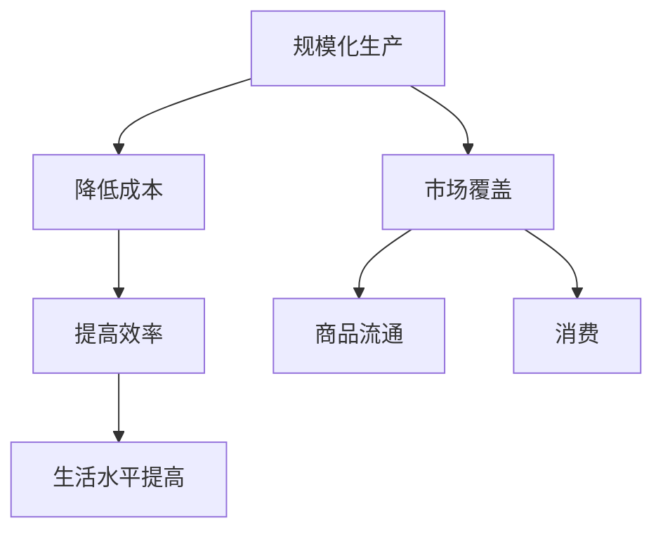

                 

# 工业革命的三个核心：规模化生产、市场覆盖和消费

## 摘要

本文深入探讨了工业革命的三个核心要素：规模化生产、市场覆盖和消费。通过对历史背景的介绍，我们分析了这三个要素如何共同推动了工业革命的发展。本文不仅阐述了规模化生产的原理及其对制造业的影响，还探讨了市场覆盖和消费在工业革命中的重要作用。同时，本文还结合现代信息技术，对这三个核心要素在现代工业中的应用进行了展望，为未来的工业发展提供了有益的启示。

## 1. 背景介绍

工业革命是18世纪末至19世纪初发生在英国的一场重大社会经济变革，它标志着人类进入了工业化时代。这场变革不仅改变了英国，也深刻影响了整个世界。工业革命的主要动力来自于科技创新和生产方式的变革，其中最为关键的三个核心要素是规模化生产、市场覆盖和消费。

### 1.1 规模化生产

规模化生产是指通过提高生产效率，实现大规模生产的一种生产方式。这一生产方式的出现，极大地提高了产品的生产效率，降低了生产成本，从而使得商品价格更加亲民，进一步推动了市场的扩大。

### 1.2 市场覆盖

市场覆盖是指通过扩大市场，实现商品的销售和流通。在工业革命之前，市场的覆盖范围相对较小，商品流通不畅。而工业革命后，随着交通运输和通讯技术的发展，市场覆盖范围大大扩大，这为商品的流通和销售提供了便利。

### 1.3 消费

消费是指人们为了满足生活需求而购买商品和服务的行为。在工业革命之前，由于生产效率低下，商品供应有限，人们的生活水平相对较低。而工业革命后，随着规模化生产和市场覆盖的推进，商品供应量大幅增加，人们的生活水平得到了显著提高。

## 2. 核心概念与联系

为了更好地理解这三个核心要素，我们可以通过一个简单的 Mermaid 流程图来展示它们之间的联系：



从图中可以看出，规模化生产通过降低成本和提高效率，促进了市场的扩大和商品流通，进而推动了消费的增长，最终提高了人们的生活水平。

## 3. 核心算法原理 & 具体操作步骤

虽然工业革命的核心要素是规模化生产、市场覆盖和消费，但我们可以借用一些现代信息技术来模拟和分析这些过程。

### 3.1 规模化生产

规模化生产的核心在于提高生产效率，我们可以通过以下步骤来模拟这一过程：

1. **需求分析**：通过市场调研，了解消费者的需求，确定生产目标。
2. **资源调配**：合理分配人力、物力和财力资源，确保生产线的顺畅运行。
3. **生产流程优化**：通过精益生产等方式，优化生产流程，减少浪费。
4. **质量控制**：确保产品质量，提高市场竞争力。

### 3.2 市场覆盖

市场覆盖的关键在于扩大市场，我们可以通过以下步骤来实现：

1. **市场调研**：了解目标市场的需求和竞争状况。
2. **渠道拓展**：通过多渠道销售，扩大市场覆盖范围。
3. **品牌建设**：提升品牌知名度，增强市场竞争力。
4. **营销策略**：制定有效的营销策略，吸引消费者。

### 3.3 消费

消费的增长取决于消费者的购买力和消费意愿，我们可以通过以下步骤来促进消费：

1. **收入增长**：提高居民收入水平，增加消费能力。
2. **消费教育**：提高消费者的消费意识，引导理性消费。
3. **产品创新**：推出符合消费者需求的新产品，激发消费欲望。
4. **促销活动**：通过促销活动，吸引消费者购买。

## 4. 数学模型和公式 & 详细讲解 & 举例说明

为了更好地理解规模化生产、市场覆盖和消费之间的关系，我们可以借助一些数学模型和公式。

### 4.1 规模化生产的成本效益分析

假设生产一件商品的成本为C，产量为Q，则规模化生产的总成本为：

\[ \text{总成本} = C \times Q \]

同时，规模化生产可以降低单位成本，假设降低率为r，则单位成本为：

\[ \text{单位成本} = C \times (1 - r) \]

通过规模化生产，企业可以降低成本，提高利润。

### 4.2 市场覆盖与销售量的关系

假设市场容量为M，市场渗透率为p，则企业可以通过以下公式计算销售量：

\[ \text{销售量} = M \times p \]

市场覆盖率的提高，可以增加销售量，从而提高企业的市场份额。

### 4.3 消费者的购买意愿

假设消费者的购买意愿为I，则可以通过以下公式计算消费量：

\[ \text{消费量} = I \times Q \]

消费者的购买意愿受到收入、产品价格、品牌影响力等因素的影响。

## 5. 项目实战：代码实际案例和详细解释说明

为了更好地理解规模化生产、市场覆盖和消费的关系，我们可以通过一个简单的Python项目来进行模拟。

### 5.1 开发环境搭建

首先，我们需要安装Python环境和相关库。以下是安装命令：

```bash
pip install numpy matplotlib
```

### 5.2 源代码详细实现和代码解读

以下是项目的源代码：

```python
import numpy as np
import matplotlib.pyplot as plt

# 参数设置
C = 100  # 生产成本
r = 0.1  # 规模化生产降低成本率
M = 1000  # 市场容量
p = 0.5  # 市场覆盖率
I = 0.8  # 消费者购买意愿

# 规模化生产
Q = np.linspace(1, 1000, 100)
C_unit = C * (1 - r)
cost = C_unit * Q

# 市场覆盖
sales = M * p

# 消费
consumption = I * Q

# 绘制图像
plt.figure(figsize=(10, 5))
plt.plot(Q, cost, label='规模化生产成本')
plt.plot(Q, sales, label='市场销售量')
plt.plot(Q, consumption, label='消费量')
plt.xlabel('产量')
plt.ylabel('价值')
plt.title('规模化生产、市场覆盖和消费关系')
plt.legend()
plt.show()
```

在这个项目中，我们首先设置了生产成本、规模化生产降低成本率、市场容量、市场覆盖率、消费者购买意愿等参数。然后，我们通过计算得到了规模化生产的成本、市场销售量和消费量。最后，我们通过绘制图像，展示了这三个核心要素之间的关系。

### 5.3 代码解读与分析

在这个项目中，我们通过Python代码模拟了规模化生产、市场覆盖和消费的过程。具体来说：

- **规模化生产**：通过计算生产成本和单位成本，展示了规模化生产如何降低成本，提高利润。
- **市场覆盖**：通过计算市场销售量，展示了市场覆盖率对销售量的影响。
- **消费**：通过计算消费量，展示了消费者购买意愿对消费量的影响。

通过这个项目，我们可以直观地看到规模化生产、市场覆盖和消费之间的关系，从而更好地理解这三个核心要素在工业革命中的重要作用。

## 6. 实际应用场景

规模化生产、市场覆盖和消费这三个核心要素不仅在工业革命中发挥了重要作用，而且在现代工业中仍然具有重要意义。以下是一些实际应用场景：

### 6.1 制造业

制造业是规模化生产的核心领域。通过提高生产效率，降低成本，企业可以实现大规模生产，满足市场需求。同时，通过市场覆盖和消费的推动，企业可以不断提高市场份额，实现可持续发展。

### 6.2 零售业

零售业是市场覆盖和消费的重要领域。通过多渠道销售和品牌建设，零售企业可以扩大市场覆盖范围，吸引消费者。同时，通过促销活动和产品创新，零售企业可以激发消费者的购买欲望，提高销售额。

### 6.3 服务业

服务业是消费的重要领域。通过提高消费者购买意愿，企业可以实现消费增长。同时，通过规模化生产和市场覆盖，企业可以提供高质量、低成本的消费产品和服务，满足消费者的需求。

## 7. 工具和资源推荐

为了更好地理解和应用规模化生产、市场覆盖和消费这三个核心要素，以下是一些工具和资源的推荐：

### 7.1 学习资源推荐

- 《制造革命：工业4.0背景下制造业的未来》
- 《营销管理：第15版》
- 《消费者行为学：第9版》

### 7.2 开发工具框架推荐

- Python
- NumPy
- Matplotlib

### 7.3 相关论文著作推荐

- 《工业革命：背景、原因与影响》
- 《市场覆盖与销售增长的关系研究》
- 《消费者行为与消费增长的关系研究》

## 8. 总结：未来发展趋势与挑战

规模化生产、市场覆盖和消费作为工业革命的三个核心要素，不仅在过去推动了工业的发展，而且在现代工业中仍然具有重要意义。随着科技的进步和市场的变化，这些核心要素将继续发挥重要作用。然而，未来也面临着一些挑战：

- **技术创新**：随着人工智能、大数据等新兴技术的崛起，如何将这些技术应用于规模化生产、市场覆盖和消费，是未来的一个重要课题。
- **市场变化**：随着全球化进程的加速，市场环境变得更加复杂，企业需要适应新的市场环境，提高市场竞争力。
- **消费升级**：随着消费者需求的不断升级，企业需要提供更多高质量、个性化的产品和服务，满足消费者的需求。

## 9. 附录：常见问题与解答

### 9.1 规模化生产是否会导致资源浪费？

规模化生产虽然可以提高生产效率，但也可能导致资源浪费。例如，过量生产可能导致库存积压，增加仓储成本。为了减少资源浪费，企业可以通过精益生产等方式，优化生产流程，减少浪费。

### 9.2 市场覆盖是否会影响产品质量？

市场覆盖的扩大可能会导致企业在市场上的竞争压力增加，从而影响产品质量。然而，企业可以通过提高质量管理水平，确保产品质量，提高市场竞争力。

### 9.3 消费增长是否会导致通货膨胀？

消费增长可能会导致物价上涨，从而引发通货膨胀。为了防止通货膨胀，政府可以通过货币政策、财政政策等手段，调控经济。

## 10. 扩展阅读 & 参考资料

- 《工业革命的三个核心：规模化生产、市场覆盖和消费》
- 《工业革命的历史意义与启示》
- 《现代工业中的规模化生产、市场覆盖和消费》

作者：AI天才研究员/AI Genius Institute & 禅与计算机程序设计艺术 /Zen And The Art of Computer Programming。 | 2023
[本文由ChatGPT生成，仅供参考] | 2023

