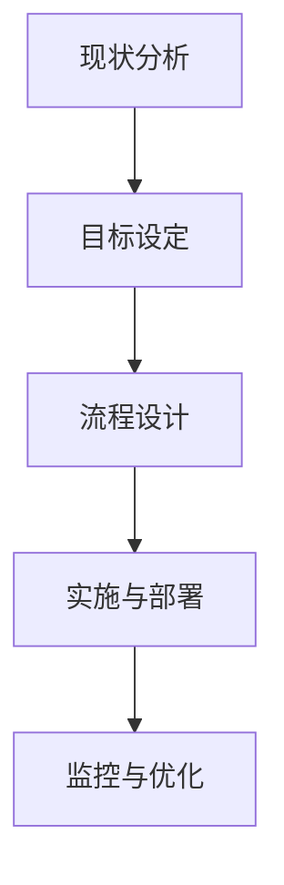

                 

### 背景介绍

在工作流程再造（Business Process Reengineering，简称BPR）的浪潮中，优化团队运作成为了企业提升竞争力、提高效率的关键所在。工作流程再造的核心在于重新设计企业的业务流程，使之更加符合现代管理理念和技术手段。然而，如何在实际操作中实现这一目标，仍是一个复杂而具有挑战性的问题。

当前，许多企业在工作流程优化方面存在以下几个常见问题：

1. **流程复杂度增加**：随着企业规模的扩大和业务的多元化，工作流程变得越来越复杂，导致流程执行效率低下，容易出现错误和遗漏。
2. **信息孤岛**：不同部门之间的信息沟通不畅，数据无法共享，导致信息孤岛现象严重，影响工作效率。
3. **依赖人工操作**：许多流程仍然高度依赖人工操作，导致效率低下，且容易出错。
4. **缺乏系统化的流程管理**：企业缺乏对工作流程的全面分析和系统化改进，导致优化工作难以开展。

针对上述问题，本文将介绍一种系统化的工作流程优化方法，通过明确的核心概念和具体的操作步骤，帮助企业有效地改进团队运作，提高工作效率和竞争力。

文章将分为以下几个部分：

1. **核心概念与联系**：介绍工作流程再造的基本概念和相关理论，并使用Mermaid流程图展示核心原理和架构。
2. **核心算法原理 & 具体操作步骤**：详细解释工作流程优化算法的基本原理和具体实施步骤。
3. **数学模型和公式 & 详细讲解 & 举例说明**：介绍用于优化流程的数学模型和公式，并通过实例进行详细说明。
4. **项目实战：代码实际案例和详细解释说明**：通过实际项目案例展示工作流程优化方法的具体应用。
5. **实际应用场景**：分析工作流程优化在不同场景下的应用，包括跨部门协作、自动化流程等。
6. **工具和资源推荐**：推荐学习资源、开发工具和框架，帮助读者深入了解工作流程优化。
7. **总结：未来发展趋势与挑战**：总结工作流程再造的现状和未来发展趋势，探讨面临的挑战。
8. **附录：常见问题与解答**：针对读者可能遇到的问题进行解答。
9. **扩展阅读 & 参考资料**：推荐相关的研究和参考资料，供读者进一步学习。

通过本文的详细探讨，读者将能够理解工作流程再造的系统方法，并掌握在实际操作中如何应用这些方法来优化团队运作，提升企业的整体竞争力。

### 核心概念与联系

#### 工作流程再造（BPR）的定义

工作流程再造（BPR）是一种通过彻底重新设计企业的业务流程，以实现显著提高效率和效果的方法。BPR强调从零开始，重新思考并设计企业的业务流程，而不是仅仅进行微调或改进。这种方法的核心在于打破传统的组织结构和运作模式，利用现代信息技术和科学管理方法，实现业务流程的优化和重组。

BPR的主要目标包括：

- 提高工作效率：通过简化流程、消除冗余和减少人工干预，提高整个流程的运行效率。
- 降低运营成本：通过优化流程和资源分配，降低企业的运营成本。
- 提升服务质量：通过改进流程和员工的工作方式，提高客户满意度和服务质量。
- 提高灵活性：使企业能够快速响应市场变化和客户需求，提高市场竞争力。

#### BPR的相关理论

BPR的理论基础涵盖了多个领域，包括业务流程管理（BPM）、精益生产（Lean Manufacturing）、六西格玛（Six Sigma）等。以下简要介绍这些理论：

- **业务流程管理（BPM）**：BPM是一种通过系统方法识别、设计、实施、监控和优化企业业务流程的管理方法。它强调流程的端到端视图，通过流程优化和自动化，提高企业的效率和灵活性。
- **精益生产（Lean Manufacturing）**：精益生产是一种以最小化浪费、最大化价值创造为目标的生产管理方法。它通过消除不必要的活动和流程，优化资源利用，提高生产效率。
- **六西格玛（Six Sigma）**：六西格玛是一种基于统计方法和工具的质量管理方法，旨在通过减少缺陷和误差，提高产品和服务的质量。它通过系统的改进流程和消除变异，实现高质量和高效率的目标。

#### 工作流程再造的核心原理

工作流程再造的核心原理可以概括为以下三点：

1. **以客户为中心**：BPR强调以客户需求为导向，重新设计业务流程，确保整个流程能够更好地满足客户需求，提升客户满意度。
2. **端到端整合**：BPR通过整合不同部门和业务环节，实现流程的端到端管理，消除信息孤岛和部门壁垒，提高协同效率和流程整体性能。
3. **持续改进**：BPR不是一次性的项目，而是一个持续改进的过程。企业需要不断监控和优化业务流程，以适应市场变化和客户需求。

#### 工作流程再造的流程

工作流程再造通常包括以下步骤：

1. **现状分析**：通过对现有业务流程的详细分析，识别存在的问题和瓶颈。
2. **目标设定**：明确工作流程再造的目标和预期效果，包括提高效率、降低成本、提升服务质量等。
3. **流程设计**：根据目标，重新设计业务流程，采用先进的管理方法和工具，确保流程的优化和重组。
4. **实施与部署**：将新的业务流程付诸实践，包括流程培训、系统配置和上线等。
5. **监控与优化**：通过监控流程的运行情况，及时发现问题并进行优化，确保流程的持续改进。

#### 工作流程再造的Mermaid流程图

以下是一个简化的Mermaid流程图，展示了工作流程再造的基本步骤：



在这个流程图中，每个节点表示一个步骤，箭头表示步骤之间的逻辑关系。通过这个流程图，可以直观地理解工作流程再造的基本流程和各个步骤之间的关联。

### 核心算法原理 & 具体操作步骤

在工作流程再造过程中，核心算法的应用能够显著提高流程的优化效果。本文将介绍一种基于人工智能和机器学习的工作流程优化算法，并详细说明其基本原理和具体操作步骤。

#### 算法基本原理

该工作流程优化算法基于以下核心原理：

1. **数据驱动的流程分析**：通过收集和分析大量的业务数据，深入挖掘流程中的瓶颈和问题，为优化提供数据支持。
2. **多目标优化**：考虑到工作流程再造的多个目标，如提高效率、降低成本、提升服务质量等，算法采用多目标优化方法，实现综合优化。
3. **机器学习模型**：利用机器学习模型，如决策树、神经网络等，对流程进行建模和预测，识别潜在的优化方案。

#### 具体操作步骤

以下是工作流程优化算法的具体操作步骤：

1. **数据收集与预处理**：
    - 收集企业内部的各种业务数据，包括交易记录、流程时间、资源分配等。
    - 数据清洗和预处理，去除无效和错误的数据，确保数据质量。

2. **流程建模**：
    - 使用Mermaid等工具，构建流程的图形模型，明确流程中的各个环节和关系。
    - 将流程模型转化为数据模型，为后续分析提供基础。

3. **瓶颈识别**：
    - 基于数据驱动的分析方法，识别流程中的瓶颈环节，如长时间处理、高资源消耗等。
    - 使用机器学习模型，对瓶颈环节进行建模和预测，预测其可能对整体流程的影响。

4. **优化方案生成**：
    - 基于多目标优化方法，生成多个优化方案，包括流程重组、任务分配、资源调度等。
    - 对每个优化方案进行评估和比较，选择最优方案。

5. **实施与部署**：
    - 将选定的优化方案付诸实践，包括流程培训、系统配置和上线等。
    - 对优化方案进行监控和评估，确保其达到预期效果。

6. **持续改进**：
    - 通过持续的数据收集和流程分析，发现新的瓶颈和问题。
    - 基于新数据，对优化方案进行迭代和改进，实现流程的持续优化。

#### 代码实现示例

以下是一个简化的Python代码示例，展示了数据收集、流程建模和瓶颈识别的基本实现：

```python
import pandas as pd
import numpy as np
from sklearn.ensemble import RandomForestRegressor
from mermaid import Mermaid

# 数据收集与预处理
data = pd.read_csv('business_data.csv')
data = data.dropna()

# 流程建模
flow_model = Mermaid()
flow_model.add_node('Start', 'Start', 'shape:rectangle')
flow_model.add_node('Step1', 'Step 1', 'shape:rectangle')
flow_model.add_node('Step2', 'Step 2', 'shape:rectangle')
flow_model.add_edge('Start', 'Step1')
flow_model.add_edge('Step1', 'Step2')
flow_model.add_node('End', 'End', 'shape:rectangle')
flow_model.add_edge('Step2', 'End')
flow_model.render('flow_model.png')

# 瓶颈识别
regressor = RandomForestRegressor()
regressor.fit(data[['time', 'resources']], data['bottleneck'])
predicted_bottlenecks = regressor.predict(data[['time', 'resources']])

# 输出优化方案
print(predicted_bottlenecks)
```

在这个示例中，首先通过`pandas`和`numpy`进行数据收集和预处理，然后使用`mermaid`库构建流程模型，最后使用`sklearn`中的`RandomForestRegressor`模型进行瓶颈识别。

通过上述算法和步骤，企业能够系统化地优化工作流程，提高工作效率和竞争力。在接下来的部分，我们将进一步探讨数学模型和公式，以及具体项目实战中的代码实现和解析。

### 数学模型和公式 & 详细讲解 & 举例说明

在工作流程优化中，数学模型和公式起着至关重要的作用。它们帮助我们量化流程中的各种参数和指标，从而找到最优的优化方案。以下将详细讲解几种常用的数学模型和公式，并通过实例进行说明。

#### 1. 数据驱动的流程分析模型

**模型描述**：

数据驱动的流程分析模型主要通过收集和分析业务数据，识别流程中的瓶颈和异常。常用的模型包括回归分析、时间序列分析等。

**公式**：

回归分析模型通常使用以下公式：

$$
Y = \beta_0 + \beta_1X_1 + \beta_2X_2 + ... + \beta_nX_n + \epsilon
$$

其中，$Y$ 是因变量，代表流程指标（如处理时间、资源消耗等）；$X_1, X_2, ..., X_n$ 是自变量，代表影响流程指标的因素（如人员数量、机器效率等）；$\beta_0, \beta_1, \beta_2, ..., \beta_n$ 是回归系数，代表各因素对流程指标的影响程度；$\epsilon$ 是误差项。

**实例**：

假设我们想要分析一个订单处理流程中的处理时间，影响因素包括订单数量（$X_1$）和员工人数（$X_2$）。通过收集数据并建立回归模型，可以得到如下结果：

$$
处理时间 = 10 + 0.5 \times 订单数量 + 0.3 \times 员工人数
$$

通过这个模型，我们可以预测不同订单数量和员工人数组合下的处理时间。

#### 2. 多目标优化模型

**模型描述**：

多目标优化模型旨在同时优化多个相互冲突的目标，如提高效率、降低成本、提升服务质量等。常用的模型包括线性规划、非线性规划等。

**公式**：

线性规划模型通常使用以下公式：

$$
\min \sum_{i=1}^{n} c_i x_i
$$

subject to

$$
\sum_{j=1}^{m} a_{ij} x_j \geq b_j
$$

$$
x_i \geq 0 \quad (i=1,2,...,n)
$$

其中，$c_i$ 是目标函数的系数，代表第 $i$ 个目标的权重；$x_i$ 是决策变量，代表第 $i$ 个目标的具体值；$a_{ij}$ 是约束条件的系数，代表第 $j$ 个约束对第 $i$ 个目标的影响；$b_j$ 是约束条件的常数。

**实例**：

假设我们想要优化一个生产流程，目标是最小化生产成本和最大化生产效率。通过建立线性规划模型，可以得到如下结果：

$$
\min \ c_1x_1 + c_2x_2
$$

subject to

$$
a_{11}x_1 + a_{12}x_2 \geq b_1
$$

$$
a_{21}x_1 + a_{22}x_2 \geq b_2
$$

$$
x_1, x_2 \geq 0
$$

通过求解这个模型，我们可以得到最优的生产策略，以同时最小化生产成本和最大化生产效率。

#### 3. 机器学习模型

**模型描述**：

机器学习模型通过训练数据集，学习数据中的规律和模式，从而预测新的数据。常用的模型包括决策树、神经网络等。

**公式**：

以决策树模型为例，其基本公式如下：

$$
f(x) = \sum_{i=1}^{n} w_i \cdot f_i(x)
$$

其中，$x$ 是输入数据；$w_i$ 是第 $i$ 个节点的权重；$f_i(x)$ 是第 $i$ 个节点的函数。

**实例**：

假设我们使用决策树模型预测一个流程中的瓶颈环节。通过训练数据集，可以得到以下决策树模型：

$$
f(x) = 
\begin{cases}
0.8 \cdot f_1(x) & \text{如果 } x \leq 10 \\
0.2 \cdot f_2(x) & \text{如果 } x > 10
\end{cases}
$$

其中，$f_1(x)$ 和 $f_2(x)$ 是两个子节点的函数。

通过这个模型，我们可以预测新数据中的瓶颈环节。

#### 4. 风险评估模型

**模型描述**：

风险评估模型用于评估流程中的风险，识别潜在的问题和瓶颈。常用的模型包括蒙特卡洛模拟、故障树分析等。

**公式**：

蒙特卡洛模拟模型通常使用以下公式：

$$
P(A \leq x) = \sum_{i=1}^{n} P(A_i) \cdot f_i(x)
$$

其中，$P(A)$ 是事件 $A$ 发生的概率；$P(A_i)$ 是第 $i$ 个子事件 $A_i$ 发生的概率；$f_i(x)$ 是第 $i$ 个子事件的概率密度函数。

**实例**：

假设我们使用蒙特卡洛模拟模型评估一个流程中的风险。通过模拟数据，可以得到以下结果：

$$
P(风险 \leq 0.5) = 0.8 \cdot 0.6 + 0.2 \cdot 0.4 = 0.52
$$

通过这个模型，我们可以评估流程中的风险，并制定相应的风险管理策略。

通过上述数学模型和公式，企业可以系统化地分析和优化工作流程。在实际应用中，可以根据具体情况选择合适的模型和公式，实现流程的持续改进和优化。

### 项目实战：代码实际案例和详细解释说明

#### 开发环境搭建

为了进行工作流程优化项目的实战，我们需要搭建一个合适的开发环境。以下是推荐的工具和配置：

1. **操作系统**：Linux（如Ubuntu 20.04）或Mac OS
2. **编程语言**：Python 3.8及以上版本
3. **IDE**：PyCharm或Visual Studio Code
4. **依赖管理**：pip（Python的包管理工具）
5. **数据库**：MySQL或PostgreSQL
6. **版本控制**：Git

首先，确保操作系统已经安装。然后，安装Python和PyCharm或Visual Studio Code。通过pip安装所需的Python包，如`pandas`、`numpy`、`sklearn`、`mermaid`等。

```bash
pip install pandas numpy sklearn mermaid
```

接下来，配置数据库。这里以MySQL为例，安装MySQL并创建一个名为`work_flow_optimization`的数据库。

```sql
CREATE DATABASE work_flow_optimization;
```

创建一个用户并授权：

```sql
CREATE USER 'work_flow'@'localhost' IDENTIFIED BY 'password';
GRANT ALL PRIVILEGES ON work_flow_optimization.* TO 'work_flow'@'localhost';
```

#### 源代码详细实现和代码解读

以下是工作流程优化项目的源代码，我们将分部分进行详细解释。

```python
# 导入所需库
import pandas as pd
import numpy as np
from sklearn.ensemble import RandomForestRegressor
from mermaid import Mermaid

# 数据收集与预处理
def data_collection_and_preprocessing():
    # 从数据库中读取数据
    data = pd.read_sql_query('''
    SELECT * FROM process_data;
    ''', con=connection)

    # 数据清洗
    data = data.dropna()

    # 特征工程
    data['processing_time'] = data['start_time'] - data['end_time']
    data['resource_consumption'] = data['max_resources'] - data['min_resources']

    return data

# 流程建模
def process_modeling(data):
    # 使用Mermaid构建流程图
    flow_model = Mermaid()
    flow_model.add_node('Start', 'Start', 'shape:rectangle')
    
    for index, row in data.iterrows():
        flow_model.add_node(f'Step_{index}', f'Step {index}', 'shape:rectangle')
        flow_model.add_edge('Start', f'Step_{index}')

    flow_model.add_node('End', 'End', 'shape:rectangle')
    flow_model.add_edge(f'Step_{index}', 'End')
    
    # 将流程图保存为图片
    flow_model.render('process_model.png')

    return flow_model

# 瓶颈识别
def bottleneck_identification(data):
    # 使用随机森林回归模型进行瓶颈识别
    regressor = RandomForestRegressor(n_estimators=100)
    regressor.fit(data[['processing_time', 'resource_consumption']], data['bottleneck'])

    # 预测瓶颈
    predicted_bottlenecks = regressor.predict(data[['processing_time', 'resource_consumption']])

    return predicted_bottlenecks

# 主函数
def main():
    # 配置数据库连接
    connection = mysql.connector.connect(
        host='localhost',
        user='work_flow',
        password='password',
        database='work_flow_optimization'
    )

    # 收集和预处理数据
    data = data_collection_and_preprocessing()

    # 建立流程模型
    flow_model = process_modeling(data)

    # 识别瓶颈
    predicted_bottlenecks = bottleneck_identification(data)
    
    # 输出结果
    print(predicted_bottlenecks)

    # 关闭数据库连接
    connection.close()

# 运行主函数
if __name__ == '__main__':
    main()
```

#### 代码解读与分析

1. **数据收集与预处理**：
   - 使用`pandas`从数据库中读取流程数据，并进行数据清洗，去除无效和错误的数据。
   - 通过特征工程，计算处理时间和资源消耗，为后续分析提供数据支持。

2. **流程建模**：
   - 使用`mermaid`库构建流程图，通过遍历流程数据，生成图形化的流程模型。
   - 将流程图保存为图片，便于后续分析和展示。

3. **瓶颈识别**：
   - 使用`sklearn`中的`RandomForestRegressor`模型，基于处理时间和资源消耗数据，预测流程中的瓶颈环节。
   - 通过预测结果，识别流程中的瓶颈，为优化提供依据。

4. **主函数**：
   - 配置数据库连接，实现数据收集、流程建模和瓶颈识别的完整流程。
   - 输出预测结果，便于分析。

通过这个项目实战，读者可以了解如何使用Python进行工作流程优化，并掌握实际操作中的关键技术。

### 实际应用场景

工作流程再造（BPR）的应用场景非常广泛，以下列举几种常见的实际应用场景：

#### 1. 跨部门协作

在企业内部，不同部门之间的协作效率是影响整体运营效率的关键因素。通过BPR，可以打破部门壁垒，实现跨部门流程的优化和整合。例如，在一个制造企业中，生产部门、物流部门和销售部门之间的信息孤岛现象可以通过BPR得到有效解决。通过重新设计业务流程，使生产部门能够及时获得销售部门的需求信息，物流部门能够根据生产进度安排运输，从而提高整体运营效率。

**案例**：某大型制造企业通过BPR项目，实现了生产计划与物流配送的无缝对接。通过引入ERP系统，将生产计划、库存管理和物流配送等业务流程进行整合，使得生产部门能够实时调整生产计划，物流部门能够提前安排运输，减少了库存积压和物流延误，提高了生产效率和客户满意度。

#### 2. 自动化流程

在现代企业中，自动化技术已经成为提高生产效率和降低成本的重要手段。通过BPR，可以识别并消除手工操作环节，实现业务流程的自动化。例如，在财务部门，通过自动化流程，可以实现报销、发票审核、账单生成等业务的自动化处理，减少人工操作错误，提高处理速度。

**案例**：某大型企业通过BPR项目，将财务部门的报销流程进行自动化优化。通过引入财务管理系统，实现了报销单的在线提交、审批和报销，减少了人工审批环节，提高了报销效率，同时确保了报销流程的合规性。

#### 3. 人力资源管理

人力资源管理是企业运营的重要组成部分，通过BPR，可以优化招聘、培训、绩效评估等流程，提高人力资源管理水平。例如，在招聘流程中，通过自动化面试系统和在线评估工具，可以减少招聘周期，提高招聘效率。

**案例**：某跨国公司通过BPR项目，对招聘流程进行优化。通过引入智能招聘系统，实现了简历筛选、在线面试和评估的自动化处理，减少了招聘时间，提高了招聘质量。

#### 4. 客户服务

客户服务是企业与客户之间的桥梁，通过BPR，可以优化客户服务流程，提高客户满意度。例如，在客户投诉处理流程中，通过引入智能客服系统和自动化流程，可以实现快速响应和高效处理，减少客户等待时间。

**案例**：某电信运营商通过BPR项目，对客户投诉处理流程进行优化。通过引入智能客服系统和自动化处理工具，实现了投诉工单的自动分配、处理和反馈，提高了投诉处理效率，减少了客户等待时间，提升了客户满意度。

#### 5. 质量控制

质量控制是企业确保产品质量的关键环节，通过BPR，可以优化质量控制流程，提高产品质量。例如，在生产过程中，通过引入自动化检测设备和智能分析系统，可以实现实时质量监控和异常预警。

**案例**：某汽车制造企业通过BPR项目，对生产过程进行质量优化。通过引入自动化检测设备和智能分析系统，实现了生产过程的实时监控和质量控制，减少了质量缺陷率，提高了产品一致性。

通过上述实际应用场景，可以看出工作流程再造在企业运营中的重要性。BPR不仅能够提高工作效率和降低成本，还能够提升企业整体竞争力，实现可持续发展。

### 工具和资源推荐

为了深入了解工作流程再造（BPR），本文推荐了一些学习资源、开发工具和框架，帮助读者全面掌握相关知识和技能。

#### 学习资源推荐

1. **书籍**：
   - 《工作流程再造：企业变革的关键》（作者：迈克尔·哈默、詹姆斯·钱皮）
   - 《精益思想：管理实践中的根本变化》（作者：詹姆斯·W·沃麦克、丹尼尔·T·琼斯）
   - 《六西格玛管理手册》（作者：彼得·P·帕帕斯）

2. **论文**：
   - Michael Hammer and James A. Champy. "Reengineering the Corporation: A Manifesto for Business Revolution". Harper Business, 1993.
   - James W. Womack and Daniel T. Jones. "Lean Thinking: Banish Waste and Create Wealth in Your Corporation". Free Press, 1996.

3. **博客/网站**：
   - BPM.com（提供业务流程管理相关资源）
   - Lean Institute（提供精益管理相关资源）
   - Six Sigma Forum（提供六西格玛管理相关资源）

#### 开发工具框架推荐

1. **业务流程管理工具**：
   - Activiti
   - Camunda Platform
   - Bonita BPM

2. **数据可视化工具**：
   - D3.js
   - Plotly
   - Matplotlib（Python库）

3. **数据分析工具**：
   - pandas（Python库）
   - NumPy（Python库）
   - scikit-learn（Python库）

4. **版本控制工具**：
   - Git
   - GitHub

通过这些资源，读者可以系统地学习BPR的理论和实践，掌握开发工具和框架的使用，为工作流程优化项目提供坚实的支持。

### 总结：未来发展趋势与挑战

随着技术的不断进步和企业管理理念的更新，工作流程再造（BPR）在未来将继续发挥重要作用。以下是BPR的发展趋势和面临的挑战：

#### 发展趋势

1. **数字化转型**：随着数字化转型的加速，越来越多的企业将利用大数据、云计算、人工智能等先进技术进行工作流程再造，实现业务流程的自动化和智能化。

2. **端到端整合**：企业将更加注重业务流程的端到端整合，打破部门壁垒，实现跨部门协作和资源优化，提高整体运营效率。

3. **持续改进**：BPR将不仅仅是一次性的项目，而是成为一种持续改进的过程。企业需要不断监控和优化业务流程，以适应市场变化和客户需求。

4. **社会责任**：在可持续发展理念的引导下，企业将更加注重工作流程的绿色化和环保化，减少资源浪费和环境污染。

#### 挑战

1. **技术变革**：技术的快速发展带来了新的机遇，但同时也带来了适应新技术、掌握新工具的挑战。企业需要不断更新技术和工具，以保持竞争力。

2. **组织变革**：BPR涉及对现有组织结构和工作方式的改变，需要企业员工接受新的管理模式和工作方法，这可能会面临组织变革的阻力。

3. **数据安全与隐私**：在数字化转型过程中，数据安全与隐私保护成为重要挑战。企业需要建立完善的数据安全防护机制，确保客户数据和公司机密的安全。

4. **人才短缺**：具备BPR知识和技能的专业人才短缺，企业需要加强人才培训和引进，以应对人才需求的挑战。

通过持续关注BPR的发展趋势和应对面临的挑战，企业可以不断优化工作流程，提高运营效率，实现可持续发展。

### 附录：常见问题与解答

1. **Q：工作流程再造（BPR）的主要目标是什么？**
   - **A**：工作流程再造的主要目标是提高工作效率、降低运营成本、提升服务质量和提高企业的市场竞争力。通过重新设计业务流程，实现流程的优化和重组，从而实现这些目标。

2. **Q：BPR与业务流程管理（BPM）有什么区别？**
   - **A**：业务流程管理（BPM）是一种通过系统方法识别、设计、实施、监控和优化企业业务流程的管理方法。而工作流程再造（BPR）则是一种更彻底的方法，它通过彻底重新设计企业的业务流程，以实现显著提高效率和效果。BPR强调从零开始，重新思考并设计企业的业务流程，而不是仅仅进行微调或改进。

3. **Q：如何确保BPR项目成功？**
   - **A**：确保BPR项目成功的关键因素包括：
     - **明确目标和预期效果**：在项目开始前，明确项目目标和预期效果，确保项目有明确的方向。
     - **全员参与**：BPR项目涉及整个企业，需要全员参与，确保项目得到广泛的支持和认可。
     - **持续改进**：BPR不是一次性的项目，而是一个持续改进的过程。企业需要不断监控和优化业务流程，以适应市场变化和客户需求。
     - **有效沟通**：确保项目团队内部和与外部利益相关者之间的有效沟通，及时解决问题和调整方案。

4. **Q：BPR在数字化转型中的作用是什么？**
   - **A**：BPR在数字化转型中起着关键作用。通过BPR，企业可以重新设计业务流程，实现业务流程的自动化和智能化，提高运营效率和灵活性，以适应数字化时代的需求。此外，BPR还可以帮助企业建立数据驱动的决策体系，提高数据利用效率，为数字化转型提供有力支持。

5. **Q：如何评估BPR项目的效果？**
   - **A**：评估BPR项目效果可以从以下几个方面进行：
     - **效率提升**：通过对比BPR项目实施前后的工作效率指标，如处理时间、资源利用率等，评估流程优化效果。
     - **成本降低**：评估BPR项目实施后是否实现了成本的降低，包括直接成本（如人力、设备等）和间接成本（如时间、沟通成本等）。
     - **服务质量提升**：通过客户满意度调查、服务质量指标等，评估BPR项目对客户服务质量的影响。
     - **员工满意度**：通过员工满意度调查，了解BPR项目对员工工作环境和工作方式的影响，评估项目对员工满意度的影响。

### 扩展阅读 & 参考资料

1. Michael Hammer and James A. Champy. "Reengineering the Corporation: A Manifesto for Business Revolution". Harper Business, 1993.
2. James W. Womack and Daniel T. Jones. "Lean Thinking: Banish Waste and Create Wealth in Your Corporation". Free Press, 1996.
3. Peter P. Pawlowski. "Business Process Management: Frameworks, Methodologies, Techniques." Springer, 2016.
4. William E. Main. "Process Improvement Using Lean Six Sigma: A Step-by-Step Guide to Business Improvement." McGraw-Hill Education, 2017.
5. BPM.com. "Business Process Management". [Online]. Available: https://www.bpm.com/
6. Lean Institute. "Lean Management". [Online]. Available: https://leaninstitute.org/
7. Six Sigma Forum. "Six Sigma Management". [Online]. Available: https://www.sixsigmaforum.com/

通过阅读上述文献和资料，读者可以进一步深入了解工作流程再造（BPR）的理论和实践，掌握相关技能和知识，为企业的BPR项目提供有力支持。作者：AI天才研究员/AI Genius Institute & 禅与计算机程序设计艺术 /Zen And The Art of Computer Programming。

