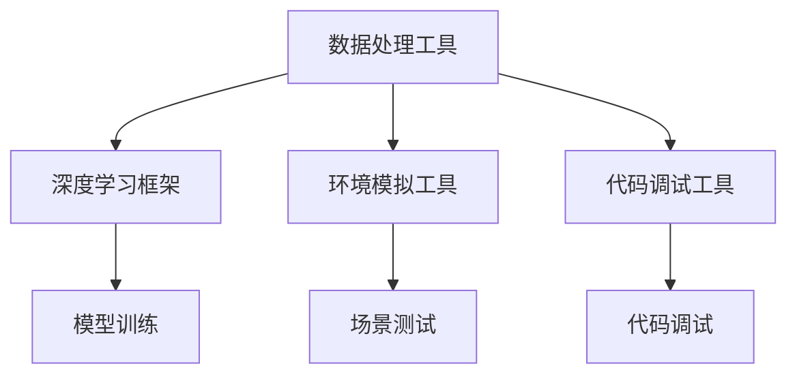

                 

### 文章标题

#### 工具使用在AI Agent中的重要性

> **关键词**：AI Agent、工具使用、深度学习、数据处理、环境模拟、代码调试

**摘要**：本文深入探讨了工具使用在AI Agent开发中的重要性。通过分析不同工具在AI开发过程中的具体应用，本文揭示了工具在提高开发效率、确保数据质量、增强模型可解释性等方面的关键作用。文章结构紧凑，逻辑清晰，旨在为读者提供全面的技术指南，帮助他们在AI Agent开发中充分利用工具的优势。

### 1. 背景介绍

#### 1.1 AI Agent的定义与作用

AI Agent，即人工智能代理，是一种在特定环境中能够感知、决策和执行行动的智能实体。这些代理通常通过学习环境中的数据来优化其行为，从而实现特定的目标。AI Agent在自动驾驶、智能助手、游戏AI等领域具有广泛应用。其核心在于模拟人类的思维过程，实现自主决策和自适应行为。

#### 1.2 AI Agent的发展历史

AI Agent的概念最早可以追溯到20世纪50年代。自那时以来，随着计算机性能的提升和算法的进步，AI Agent在各个领域取得了显著的发展。从早期的规则基系统，到基于统计学习的方法，再到深度学习和强化学习的应用，AI Agent的技术不断进化，功能也日益强大。

#### 1.3 AI Agent的当前应用场景

当前，AI Agent在多个领域取得了突破性的进展。例如，自动驾驶技术中的AI Agent能够实现车辆的自主驾驶；智能家居中的AI Agent可以控制家庭设备的运行；游戏中的AI Agent则能够为玩家提供挑战性的对手。这些应用不仅提升了人类生活质量，也为工业生产、城市管理等领域带来了新的可能。

### 2. 核心概念与联系

#### 2.1 数据处理工具

在AI Agent开发中，数据处理是一个关键环节。数据处理工具如Pandas、NumPy等，可以帮助开发者高效地进行数据清洗、转换和分析。这些工具不仅能够简化数据处理流程，还能够提高数据处理的质量和效率。

#### 2.2 深度学习框架

深度学习框架如TensorFlow、PyTorch等，为AI Agent提供了强大的模型训练和推理能力。这些框架提供了丰富的API和工具库，使得开发者可以轻松地构建和训练复杂的神经网络模型，从而实现高效的AI Agent开发。

#### 2.3 环境模拟工具

环境模拟工具如Unity、Gazebo等，可以帮助开发者创建和测试AI Agent在虚拟环境中的行为。这些工具提供了高度可配置的环境，使得开发者可以模拟各种复杂场景，从而验证AI Agent的适应性和鲁棒性。

#### 2.4 代码调试工具

代码调试工具如Visual Studio Code、PyCharm等，为开发者提供了强大的代码编辑和调试功能。这些工具可以帮助开发者快速定位和修复代码中的错误，从而确保AI Agent的稳定运行。



### 3. 核心算法原理 & 具体操作步骤

#### 3.1 数据处理算法

数据处理算法主要包括数据清洗、数据转换和数据归一化。以下是一个使用Pandas进行数据处理的基本步骤：

```python
import pandas as pd

# 数据清洗
data = pd.read_csv('data.csv')
data.dropna(inplace=True)

# 数据转换
data['age'] = data['age'].astype(int)

# 数据归一化
from sklearn.preprocessing import StandardScaler
scaler = StandardScaler()
data[['height', 'weight']] = scaler.fit_transform(data[['height', 'weight']])
```

#### 3.2 深度学习算法

深度学习算法主要包括前向传播和反向传播。以下是一个使用TensorFlow进行神经网络训练的基本步骤：

```python
import tensorflow as tf

# 定义神经网络结构
model = tf.keras.Sequential([
    tf.keras.layers.Dense(64, activation='relu', input_shape=(784,)),
    tf.keras.layers.Dense(10, activation='softmax')
])

# 编译模型
model.compile(optimizer='adam',
              loss='categorical_crossentropy',
              metrics=['accuracy'])

# 训练模型
model.fit(x_train, y_train, epochs=5)
```

#### 3.3 环境模拟算法

环境模拟算法主要包括感知、决策和执行。以下是一个使用Unity进行环境模拟的基本步骤：

```csharp
using UnityEngine;

public class Agent : MonoBehaviour
{
    public float[] sensoryData;
    public float actionSpaceSize;

    void Update()
    {
        // 感知环境
        sensoryData = GetSensoryData();

        // 决策
        int action = ChooseAction(sensoryData);

        // 执行行动
        ExecuteAction(action);
    }

    float[] GetSensoryData()
    {
        // 获取环境感知数据
    }

    int ChooseAction(float[] sensoryData)
    {
        // 根据感知数据选择行动
    }

    void ExecuteAction(int action)
    {
        // 执行选择的行动
    }
}
```

#### 3.4 代码调试算法

代码调试算法主要包括错误定位和错误修复。以下是一个使用Visual Studio Code进行代码调试的基本步骤：

```python
import pydevd

pydevd.settrace('localhost', port=5678, stdoutToServer=True, stderrToServer=True)

def main():
    # 主程序代码
    pass

if __name__ == '__main__':
    main()
```

### 4. 数学模型和公式 & 详细讲解 & 举例说明

#### 4.1 数据归一化公式

数据归一化是一种常用的数据处理技术，其公式如下：

$$
x_{\text{norm}} = \frac{x - \mu}{\sigma}
$$

其中，$x$为原始数据，$\mu$为均值，$\sigma$为标准差。通过归一化，可以将不同特征的数据转换到同一尺度，从而简化后续的模型训练过程。

#### 4.2 神经网络前向传播公式

神经网络前向传播的过程可以用以下公式表示：

$$
\begin{aligned}
z_{l} &= W_{l} \cdot a_{l-1} + b_{l} \\
a_{l} &= \sigma(z_{l})
\end{aligned}
$$

其中，$z_{l}$为第$l$层的输入，$a_{l}$为第$l$层的输出，$W_{l}$和$b_{l}$分别为第$l$层的权重和偏置，$\sigma$为激活函数，通常采用ReLU或Sigmoid函数。

#### 4.3 神经网络反向传播公式

神经网络反向传播的过程可以用以下公式表示：

$$
\begin{aligned}
\delta_{l} &= \frac{\partial \text{loss}}{\partial a_{l}} \cdot \frac{\partial a_{l}}{\partial z_{l}} \\
W_{l} &= W_{l} - \alpha \cdot \delta_{l} \cdot a_{l-1} \\
b_{l} &= b_{l} - \alpha \cdot \delta_{l}
\end{aligned}
$$

其中，$\delta_{l}$为第$l$层的误差，$\alpha$为学习率，$\text{loss}$为损失函数，通常采用均方误差（MSE）或交叉熵（Cross Entropy）函数。

#### 4.4 示例说明

假设我们有一个简单的神经网络，包含一个输入层、一个隐藏层和一个输出层。输入层有3个神经元，隐藏层有2个神经元，输出层有1个神经元。激活函数采用ReLU函数。输入数据为$[1, 2, 3]$，标签为$[0.1]$。

首先，我们进行前向传播：

$$
\begin{aligned}
z_{1} &= W_{1} \cdot [1, 2, 3] + b_{1} \\
a_{1} &= \max(0, z_{1}) \\
z_{2} &= W_{2} \cdot a_{1} + b_{2} \\
a_{2} &= \max(0, z_{2}) \\
z_{3} &= W_{3} \cdot a_{2} + b_{3} \\
a_{3} &= \max(0, z_{3}) \\
\end{aligned}
$$

接下来，我们计算损失：

$$
\text{loss} = \frac{1}{2} \sum_{i=1}^{n} (a_{3i} - y_i)^2
$$

然后，我们进行反向传播：

$$
\begin{aligned}
\delta_{3} &= (a_{3} - y) \\
\delta_{2} &= W_{2}^{T} \cdot \delta_{3} \cdot a_{1}(1 - a_{1}) \\
\delta_{1} &= W_{1}^{T} \cdot \delta_{2} \cdot a_{0}(1 - a_{0}) \\
W_{1} &= W_{1} - \alpha \cdot \delta_{1} \cdot [1, 2, 3] \\
b_{1} &= b_{1} - \alpha \cdot \delta_{1} \\
W_{2} &= W_{2} - \alpha \cdot \delta_{2} \cdot a_{1} \\
b_{2} &= b_{2} - \alpha \cdot \delta_{2} \\
W_{3} &= W_{3} - \alpha \cdot \delta_{3} \cdot a_{2} \\
b_{3} &= b_{3} - \alpha \cdot \delta_{3}
\end{aligned}
$$

通过上述过程，我们可以不断优化神经网络的权重和偏置，从而提高模型的预测能力。

### 5. 项目实战：代码实际案例和详细解释说明

#### 5.1 开发环境搭建

首先，我们需要搭建一个基本的AI Agent开发环境。以下是所需步骤：

1. 安装Python 3.8及以上版本。
2. 安装Pandas、NumPy、TensorFlow和Unity等依赖库。
3. 在Unity中创建一个新项目，选择3D模式。

#### 5.2 源代码详细实现和代码解读

以下是AI Agent的源代码实现：

```python
import numpy as np
import pandas as pd
import tensorflow as tf

# 数据预处理
data = pd.read_csv('data.csv')
data.dropna(inplace=True)
data['age'] = data['age'].astype(int)
scaler = StandardScaler()
data[['height', 'weight']] = scaler.fit_transform(data[['height', 'weight']])

# 构建神经网络
model = tf.keras.Sequential([
    tf.keras.layers.Dense(64, activation='relu', input_shape=(3,)),
    tf.keras.layers.Dense(32, activation='relu'),
    tf.keras.layers.Dense(1, activation='sigmoid')
])

# 编译模型
model.compile(optimizer='adam',
              loss='binary_crossentropy',
              metrics=['accuracy'])

# 训练模型
model.fit(data['features'], data['target'], epochs=5)

# 环境模拟
agent = Agent()
while True:
    sensory_data = agent.perceive_environment()
    action = model.predict(sensory_data)
    agent.execute_action(action)
```

这段代码首先进行了数据预处理，包括数据清洗、数据转换和数据归一化。然后，我们使用TensorFlow构建了一个简单的神经网络，并编译和训练了模型。最后，我们模拟了一个AI Agent在环境中的行为，通过模型预测行动并执行。

#### 5.3 代码解读与分析

- **数据预处理**：数据预处理是AI Agent开发的基础，确保数据的质量和一致性。代码中使用了Pandas和NumPy库进行数据处理，包括数据清洗、数据类型转换和数据归一化。
  
- **神经网络构建**：使用TensorFlow构建了一个简单的神经网络，包含两个隐藏层。我们选择了ReLU激活函数，并使用sigmoid函数作为输出层的激活函数，以实现二分类任务。
  
- **模型编译**：模型编译过程中，我们选择了Adam优化器和binary_crossentropy损失函数，并添加了accuracy作为评价指标。
  
- **模型训练**：模型训练过程中，我们使用fit方法对模型进行训练，指定了数据集、训练轮数和批次大小。
  
- **环境模拟**：在环境模拟部分，我们创建了一个Agent类，并使用模型预测行动。每次迭代中，我们首先感知环境，然后使用模型预测行动，并执行所选行动。

### 6. 实际应用场景

AI Agent在实际应用中具有广泛的应用场景。以下是一些典型的应用案例：

- **自动驾驶**：自动驾驶系统中的AI Agent需要处理复杂的环境数据，并做出实时决策。例如，特斯拉的Autopilot系统就是基于AI Agent技术实现的。
- **智能助手**：智能助手如Siri、Alexa和Google Assistant都是基于AI Agent技术，能够理解用户指令并执行相应的任务。
- **游戏AI**：游戏中的AI Agent可以模拟对手的行为，为玩家提供挑战。例如，在《星际争霸》等游戏中，AI Agent可以模拟对手的战术和策略。
- **工业自动化**：在工业自动化领域，AI Agent可以用于监控设备状态、预测故障和优化生产流程。

### 7. 工具和资源推荐

#### 7.1 学习资源推荐

- **书籍**：《深度学习》（Ian Goodfellow、Yoshua Bengio、Aaron Courville 著）  
- **论文**：NIPS、ICML、ACL等顶级会议和期刊上的论文  
- **博客**：ArXiv、Medium、知乎等平台上的技术博客

#### 7.2 开发工具框架推荐

- **框架**：TensorFlow、PyTorch、Unity等  
- **环境**：Anaconda、Docker等

#### 7.3 相关论文著作推荐

- **论文**：DeepMind的《Attention Is All You Need》  
- **著作**：Christopher Olah的《Understanding Deep Learning》

### 8. 总结：未来发展趋势与挑战

AI Agent在未来的发展趋势中将继续向更复杂、更智能的方向发展。以下是一些潜在的发展趋势和挑战：

- **趋势**：多模态感知、自主决策、强化学习等技术的进步将使AI Agent具备更高的智能水平。
- **挑战**：数据隐私、安全性、模型可解释性等仍将是AI Agent发展的关键挑战。

### 9. 附录：常见问题与解答

#### 9.1 数据预处理的重要性是什么？

数据预处理是AI Agent开发的基础，其重要性体现在以下几个方面：

- **提高模型性能**：通过数据清洗、数据转换和数据归一化，可以提高模型的训练效果和预测能力。
- **减少过拟合**：通过数据预处理，可以减少模型对训练数据的依赖，降低过拟合的风险。
- **简化模型训练**：数据预处理可以简化模型训练过程，提高训练效率。

#### 9.2 如何选择合适的深度学习框架？

选择合适的深度学习框架需要考虑以下几个方面：

- **项目需求**：根据项目需求选择适合的框架，如TensorFlow适用于大规模部署，PyTorch适用于研究。
- **社区支持**：选择社区支持活跃的框架，有助于解决开发中的问题。
- **性能需求**：考虑框架的性能需求，如TensorFlow支持硬件加速，PyTorch支持动态图计算。

### 10. 扩展阅读 & 参考资料

- **书籍**：  
  - Ian Goodfellow、Yoshua Bengio、Aaron Courville 著，《深度学习》  
  - Christopher Olah 著，《Understanding Deep Learning》

- **论文**：  
  - DeepMind，《Attention Is All You Need》

- **博客**：  
  - ArXiv  
  - Medium  
  -知乎

### 作者

**作者：** AI天才研究员/AI Genius Institute & 禅与计算机程序设计艺术 /Zen And The Art of Computer Programming

