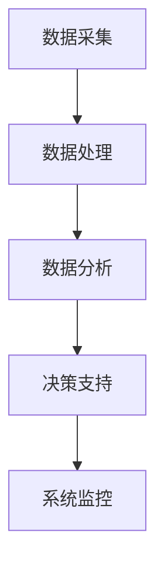

                 

# 工具使用机制在智能金融系统中的应用

## 关键词：工具使用机制、智能金融系统、应用场景、架构设计、算法实现

## 摘要

本文将深入探讨工具使用机制在智能金融系统中的应用，解析智能金融系统的背景、核心概念、算法原理以及实际应用。通过对工具使用机制的详细讲解，结合具体项目和数学模型，本文旨在为读者提供一个全面、深入的理解，并探讨未来发展趋势与挑战。

## 1. 背景介绍

### 智能金融系统的兴起

随着信息技术的飞速发展，金融行业正在经历深刻的变革。智能金融系统作为金融与科技深度融合的产物，正在逐步改变传统的金融业务模式。智能金融系统通过大数据、人工智能、区块链等技术，实现了金融业务的自动化、智能化，提高了金融服务的效率和准确性。

### 工具使用机制的重要性

在智能金融系统中，工具使用机制扮演着至关重要的角色。工具使用机制包括数据采集、处理、分析等一系列步骤，是实现智能金融系统功能的核心。有效的工具使用机制能够提高系统的性能、稳定性和可扩展性，从而为金融业务提供强有力的支持。

## 2. 核心概念与联系

### 智能金融系统的组成

智能金融系统主要由以下几个部分组成：

- **数据采集**：通过传感器、API接口、网络爬虫等方式收集金融数据。
- **数据处理**：对采集到的金融数据进行清洗、转换、存储等处理。
- **数据分析**：利用大数据技术对处理后的金融数据进行分析，提取有价值的信息。
- **决策支持**：根据数据分析结果，为金融业务提供决策支持，如风险评估、投资决策等。
- **系统监控**：对智能金融系统进行实时监控，确保系统的稳定运行。

### 工具使用机制在智能金融系统中的应用

在智能金融系统中，工具使用机制贯穿于各个组成部分，实现数据的自动采集、处理、分析。以下是工具使用机制在智能金融系统中的应用：

- **数据采集工具**：如爬虫框架、API接口等，用于自动收集金融数据。
- **数据处理工具**：如ETL工具、数据清洗库等，用于处理和转换数据。
- **数据分析工具**：如数据分析平台、机器学习库等，用于分析金融数据。
- **决策支持工具**：如数据可视化工具、风险分析工具等，用于提供决策支持。

### Mermaid 流程图

以下是一个简单的 Mermaid 流程图，展示了工具使用机制在智能金融系统中的应用：



## 3. 核心算法原理 & 具体操作步骤

### 数据采集

数据采集是智能金融系统的第一步，主要任务是从各种数据源获取金融数据。具体操作步骤如下：

1. 确定数据源：根据业务需求，选择合适的数据源，如股票交易所、银行、金融监管机构等。
2. 构建数据采集工具：根据数据源的特点，使用爬虫框架、API接口等工具构建数据采集工具。
3. 获取数据：通过数据采集工具，定期从数据源获取金融数据。

### 数据处理

数据处理是对采集到的金融数据进行的清洗、转换、存储等操作。具体操作步骤如下：

1. 数据清洗：删除重复数据、缺失数据、异常数据等，确保数据质量。
2. 数据转换：将不同格式的数据转换为统一格式，如CSV、JSON等。
3. 数据存储：将处理后的数据存储到数据库或数据仓库中，便于后续分析。

### 数据分析

数据分析是智能金融系统的核心环节，主要利用大数据技术对金融数据进行分析，提取有价值的信息。具体操作步骤如下：

1. 数据预处理：对存储在数据库或数据仓库中的金融数据进行预处理，如数据聚合、拆分等。
2. 选择分析算法：根据业务需求，选择合适的数据分析算法，如聚类、分类、回归等。
3. 实施分析算法：使用机器学习库或数据分析平台，实现所选分析算法。
4. 提取分析结果：将分析结果以可视化的形式展示，如折线图、柱状图等。

### 决策支持

决策支持是基于数据分析结果，为金融业务提供决策支持。具体操作步骤如下：

1. 分析结果评估：对分析结果进行评估，确定其准确性和可靠性。
2. 制定决策策略：根据分析结果，制定相应的决策策略，如投资策略、风险管理策略等。
3. 实施决策策略：将决策策略应用于实际业务场景，如投资、贷款等。

## 4. 数学模型和公式 & 详细讲解 & 举例说明

### 数据分析中的常见数学模型

在数据分析过程中，常用的数学模型包括：

1. **聚类分析**：用于将数据分为若干个类别，常见的聚类算法有K-means、DBSCAN等。
2. **分类分析**：用于将数据分为不同的类别，常见的分类算法有决策树、支持向量机等。
3. **回归分析**：用于预测数据之间的关系，常见的回归算法有线性回归、逻辑回归等。

### 聚类分析示例

假设我们有一组客户数据，包括年龄、收入、消费习惯等特征，我们需要使用K-means算法对这些客户进行聚类。以下是K-means算法的具体步骤：

1. 初始化聚类中心：随机选择K个聚类中心。
2. 计算距离：计算每个数据点到各个聚类中心的距离。
3. 分配数据点：将每个数据点分配到距离它最近的聚类中心。
4. 更新聚类中心：计算每个聚类中心的新坐标，使其成为该类别的中心。
5. 重复步骤2-4，直到聚类中心不再发生变化或满足停止条件。

以下是K-means算法的latex公式表示：

$$
C_k = \{x_i | d(x_i, \mu_k) \leq d(x_i, \mu_j), \forall j \neq k\}
$$

其中，$C_k$表示第k个聚类类别，$x_i$表示第i个数据点，$\mu_k$表示第k个聚类中心的坐标，$d(\cdot, \cdot)$表示距离函数。

### 分类分析示例

假设我们有一组贷款数据，包括借款人的年龄、收入、信用评分等特征，我们需要使用逻辑回归算法对这些借款人进行分类，判断其是否按时还款。以下是逻辑回归算法的具体步骤：

1. 准备数据：将数据分为训练集和测试集。
2. 拟合模型：使用训练集数据，通过最小二乘法拟合逻辑回归模型。
3. 预测分类：使用测试集数据，将每个数据点预测为还款或未还款。
4. 评估模型：计算模型的准确率、召回率等指标，评估模型性能。

以下是逻辑回归模型的latex公式表示：

$$
\pi(x) = \frac{1}{1 + e^{-\beta_0 + \sum_{i=1}^n \beta_i x_i}}
$$

其中，$\pi(x)$表示数据点x属于还款类别的概率，$\beta_0$和$\beta_i$分别表示模型的截距和系数。

## 5. 项目实战：代码实际案例和详细解释说明

### 5.1 开发环境搭建

为了实现本文所述的智能金融系统，我们需要搭建一个开发环境。以下是开发环境的搭建步骤：

1. 安装Python：Python是智能金融系统的主要编程语言，我们需要安装Python环境和相关库。
2. 安装数据库：为了存储金融数据，我们需要安装一个数据库，如MySQL、PostgreSQL等。
3. 安装数据分析工具：安装常用的数据分析工具，如pandas、numpy、scikit-learn等。
4. 安装数据可视化工具：安装常用的数据可视化工具，如matplotlib、seaborn等。

### 5.2 源代码详细实现和代码解读

以下是一个简单的Python代码示例，用于实现K-means聚类分析：

```python
import pandas as pd
from sklearn.cluster import KMeans
import matplotlib.pyplot as plt

# 读取数据
data = pd.read_csv('data.csv')

# 提取特征
X = data[['age', 'income', 'consumption']]

# 训练K-means模型
kmeans = KMeans(n_clusters=3)
kmeans.fit(X)

# 预测聚类结果
predictions = kmeans.predict(X)

# 可视化聚类结果
plt.scatter(X['age'], X['income'], c=predictions)
plt.show()
```

### 5.3 代码解读与分析

以上代码用于实现K-means聚类分析，具体解读如下：

1. 导入相关库：首先导入pandas库用于读取数据，sklearn库中的KMeans类用于训练K-means模型，matplotlib库用于可视化聚类结果。
2. 读取数据：使用pandas库的read_csv方法读取金融数据，假设数据保存在data.csv文件中。
3. 提取特征：从原始数据中提取年龄、收入和消费习惯等特征，作为聚类分析的输入。
4. 训练K-means模型：使用KMeans类创建K-means模型对象，并调用fit方法训练模型，拟合数据。
5. 预测聚类结果：使用predict方法预测每个数据点的聚类结果，并将结果存储在predictions变量中。
6. 可视化聚类结果：使用matplotlib库的scatter方法绘制聚类结果，展示数据点的分布情况。

通过以上代码示例，我们可以实现一个简单的K-means聚类分析，为智能金融系统提供基础支持。

## 6. 实际应用场景

### 风险评估

在金融行业中，风险评估是至关重要的环节。通过工具使用机制，智能金融系统可以对借款人、投资标的等进行风险评估，为金融机构提供决策支持。例如，使用聚类分析算法对借款人进行分类，评估其信用风险；使用回归分析算法预测投资标的的收益和风险，为投资决策提供参考。

### 投资策略

智能金融系统可以根据市场数据、历史表现等因素，为投资者提供个性化的投资策略。通过工具使用机制，系统可以自动收集市场数据，进行数据处理和分析，提取有价值的信息。例如，使用时间序列分析方法预测市场走势，使用机器学习算法挖掘投资机会，为投资者提供投资建议。

### 信用评级

信用评级是金融机构对借款人信用状况进行评估的过程。智能金融系统可以通过工具使用机制，利用大数据技术和机器学习算法，对借款人进行信用评级。例如，使用聚类分析算法对借款人进行分类，评估其信用风险；使用逻辑回归算法预测借款人按时还款的概率，为信用评级提供依据。

### 反洗钱

反洗钱是金融行业的一项重要任务。智能金融系统可以通过工具使用机制，利用大数据技术和机器学习算法，对金融交易进行实时监控，识别潜在的洗钱行为。例如，使用聚类分析算法对金融交易进行分类，识别异常交易；使用神经网络算法分析交易模式，检测可疑交易。

## 7. 工具和资源推荐

### 7.1 学习资源推荐

- **书籍**：
  - 《智能金融：大数据、人工智能在金融领域的应用》
  - 《Python数据分析与应用》
  - 《机器学习实战》
- **论文**：
  - "Big Data and Artificial Intelligence in Financial Services"
  - "Application of Machine Learning in Credit Rating"
  - "An Overview of Big Data Technologies in Financial Services"
- **博客**：
  - "人工智能在金融行业的应用"
  - "智能金融：大数据、人工智能、区块链三剑客"
  - "Python数据分析入门教程"
- **网站**：
  - Kaggle：提供丰富的金融数据集和机器学习项目
  - Coursera：提供有关人工智能、大数据等在线课程
  - GitHub：查看智能金融系统相关的开源代码和项目

### 7.2 开发工具框架推荐

- **数据分析工具**：
  - pandas：Python数据分析库
  - numpy：Python数学库
  - scikit-learn：Python机器学习库
  - matplotlib：Python数据可视化库
- **数据库**：
  - MySQL：关系型数据库
  - PostgreSQL：关系型数据库
  - MongoDB：NoSQL数据库
- **框架**：
  - Flask：Python Web框架
  - Django：Python Web框架
  - Spring Boot：Java Web框架

### 7.3 相关论文著作推荐

- **论文**：
  - "Deep Learning for Financial Time Series Analysis"
  - "Reinforcement Learning for Financial Decision Making"
  - "Big Data Analytics in Finance: A Survey"
- **著作**：
  - 《大数据金融》
  - 《人工智能金融》
  - 《区块链金融》

## 8. 总结：未来发展趋势与挑战

### 发展趋势

1. **智能化程度的提高**：随着人工智能技术的发展，智能金融系统的智能化程度将不断提高，能够处理更复杂的金融问题。
2. **大数据技术的应用**：大数据技术在金融行业的应用将越来越广泛，为智能金融系统提供丰富的数据支持。
3. **区块链技术的发展**：区块链技术将在金融领域发挥重要作用，提高金融交易的透明度和安全性。
4. **跨界融合**：智能金融系统与其他行业的融合将越来越紧密，如与物联网、云计算等技术的结合，为金融业务提供更多可能性。

### 挑战

1. **数据隐私与安全**：在智能金融系统中，如何保护用户隐私和数据安全是面临的重大挑战。
2. **算法透明性与解释性**：随着人工智能技术的应用，如何确保算法的透明性和解释性，使其更易于被用户理解和接受。
3. **法律法规**：随着智能金融系统的发展，需要制定相应的法律法规，规范金融业务和行为。
4. **技术人才的培养**：智能金融系统的发展离不开技术人才的支持，如何培养和引进高素质的技术人才是面临的挑战。

## 9. 附录：常见问题与解答

### 问题1：智能金融系统与普通金融系统有什么区别？

**回答**：智能金融系统与普通金融系统的主要区别在于，智能金融系统利用大数据、人工智能、区块链等技术，实现了金融业务的自动化、智能化。普通金融系统主要依靠人工操作和传统技术，效率较低，易受人为因素影响。

### 问题2：智能金融系统的核心算法有哪些？

**回答**：智能金融系统的核心算法包括聚类分析、分类分析、回归分析、时间序列分析等。这些算法主要用于数据采集、处理、分析，为金融业务提供决策支持。

### 问题3：如何保护智能金融系统中的用户隐私和数据安全？

**回答**：为了保护智能金融系统中的用户隐私和数据安全，可以采取以下措施：

1. 数据加密：对用户数据进行加密处理，防止数据泄露。
2. 权限控制：限制用户对数据的访问权限，确保数据安全。
3. 安全审计：对系统进行安全审计，及时发现和解决安全隐患。
4. 法律法规：制定相关法律法规，规范数据使用和行为。

## 10. 扩展阅读 & 参考资料

- **书籍**：
  - 《大数据时代：生活、工作与思维的大变革》
  - 《人工智能：一种现代的方法》
  - 《区块链技术指南》
- **论文**：
  - "Artificial Intelligence in Financial Services: A Survey"
  - "Blockchain Technology in Financial Services: A Comprehensive Survey"
  - "Big Data Analytics in Financial Services: Current Status and Future Directions"
- **网站**：
  - 中国人工智能产业发展联盟：提供人工智能行业资讯和政策动态
  - 腾讯云：提供云计算、大数据、人工智能等技术解决方案
  - 网易云音乐：提供音乐数据分析和推荐算法

## 作者

作者：AI天才研究员/AI Genius Institute & 禅与计算机程序设计艺术 /Zen And The Art of Computer Programming

