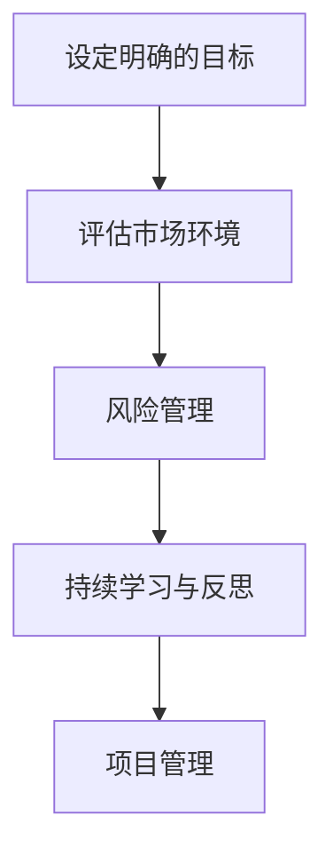

                 

# 巴菲特目标管理法则在项目管理中的应用

## 关键词：巴菲特目标管理法则，项目管理，目标设定，风险控制，投资回报

## 摘要：
本文旨在探讨巴菲特目标管理法则在项目管理中的应用。巴菲特作为世界著名的投资大师，其目标管理法则对于投资者和企业运营具有深远的启示。本文将深入解析巴菲特目标管理法则的核心概念，结合项目管理中的实际需求，提出一套适用于项目管理的巴菲特目标管理策略。通过详细的理论分析和实际案例，本文旨在为项目管理者提供一种全新的目标管理思维，以应对项目管理中面临的各种挑战。

## 1. 背景介绍

### 1.1 巴菲特目标管理法则的起源
巴菲特（Warren Buffett）是美国著名的投资家，被誉为“股神”。他的成功得益于其独特的投资哲学和目标管理方法。巴菲特的目标管理法则强调的是长期投资、价值投资和风险管理。他认为，成功的投资离不开对市场环境的深刻理解和对自身投资目标的清晰设定。巴菲特的目标管理法则主要包括以下几个方面：

1. **设定明确的目标**：巴菲特强调投资者需要设定明确的投资目标，包括长期和短期目标。这些目标应当具有可衡量性、可行性和实现性。
2. **评估市场环境**：投资者需要对市场环境进行深入分析，了解市场趋势、风险和机会，以便为投资决策提供依据。
3. **风险管理**：巴菲特认为，风险是投资中不可避免的一部分，但可以通过科学的投资策略来降低风险。投资者需要学会如何识别风险、评估风险和规避风险。
4. **持续学习与反思**：巴菲特强调投资者需要不断学习、反思和调整投资策略，以适应市场的变化。

### 1.2 项目管理的背景
项目管理是指通过计划、执行、监控和调整，确保项目按预定时间、预算和质量完成的过程。项目管理涉及到多个方面的活动，包括项目规划、资源管理、风险管理、沟通管理等。随着现代企业对项目交付质量、效率和效益的要求越来越高，项目管理的重要性也越来越凸显。

## 2. 核心概念与联系

### 2.1 巴菲特目标管理法则的核心概念

#### 2.1.1 设定明确的目标
巴菲特认为，设定明确的目标是投资成功的第一步。明确的目标有助于投资者明确自己的投资方向，制定合理的投资策略。在项目管理中，设定明确的目标同样至关重要。项目管理者需要明确项目的目标，包括项目的范围、质量、时间和成本等。

#### 2.1.2 评估市场环境
巴菲特强调，投资者需要对市场环境进行深入分析，以便为投资决策提供依据。在项目管理中，项目管理者也需要对项目环境进行评估，包括市场趋势、竞争对手、客户需求等，以便制定合适的项目计划。

#### 2.1.3 风险管理
巴菲特认为，风险管理是投资中不可或缺的一部分。在项目管理中，风险控制同样至关重要。项目管理者需要识别项目风险、评估风险影响，并制定相应的风险应对策略。

#### 2.1.4 持续学习与反思
巴菲特强调，投资者需要不断学习、反思和调整投资策略。这一理念在项目管理中也同样适用。项目管理者需要不断学习新知识、新技能，并反思项目执行过程中的得失，以不断优化项目管理方法。

### 2.2 巴菲特目标管理法则在项目管理中的联系

#### 2.2.1 设定明确的目标
在项目管理中，项目管理者需要根据项目需求，设定明确的目标。这些目标应当包括项目的范围、质量、时间和成本等方面。通过设定明确的目标，项目管理者可以更好地指导项目团队的工作，确保项目按计划完成。

#### 2.2.2 评估市场环境
项目管理者需要评估项目所处的市场环境，包括市场趋势、竞争对手和客户需求等。通过对市场环境的分析，项目管理者可以制定更符合市场需求的策略，提高项目的成功率。

#### 2.2.3 风险管理
项目管理者需要识别项目风险、评估风险影响，并制定相应的风险应对策略。通过有效的风险控制，项目管理者可以降低项目风险，确保项目按计划完成。

#### 2.2.4 持续学习与反思
项目管理者需要不断学习新知识、新技能，并反思项目执行过程中的得失。通过持续学习与反思，项目管理者可以不断优化项目管理方法，提高项目管理的效率和质量。

### 2.3 Mermaid 流程图（核心概念原理和架构）



## 3. 核心算法原理 & 具体操作步骤

### 3.1 设定明确的目标

#### 3.1.1 确定项目目标
项目管理者需要根据项目需求和客户需求，明确项目的目标。项目目标应当包括项目的范围、质量、时间和成本等方面。

#### 3.1.2 制定目标计划
项目管理者需要制定详细的目标计划，包括实现目标的步骤、时间表和资源需求等。目标计划应当具有可操作性和可行性。

#### 3.1.3 目标评估与调整
项目管理者需要定期评估项目目标的实现情况，根据实际情况进行调整。通过目标评估与调整，项目管理者可以确保项目目标的实现。

### 3.2 评估市场环境

#### 3.2.1 市场环境分析
项目管理者需要对市场环境进行深入分析，包括市场趋势、竞争对手和客户需求等。通过市场环境分析，项目管理者可以了解项目的市场地位和竞争态势。

#### 3.2.2 制定市场策略
根据市场环境分析结果，项目管理者需要制定合适的市场策略，包括市场定位、产品策略和推广策略等。

#### 3.2.3 市场策略评估
项目管理者需要定期评估市场策略的有效性，根据评估结果进行调整。通过市场策略评估，项目管理者可以确保市场策略的持续优化。

### 3.3 风险管理

#### 3.3.1 风险识别
项目管理者需要识别项目风险，包括项目进度、资源、质量和市场等方面的风险。

#### 3.3.2 风险评估
项目管理者需要对识别出的风险进行评估，包括风险的概率和影响等。

#### 3.3.3 风险应对
根据风险评估结果，项目管理者需要制定相应的风险应对策略，包括风险规避、风险减轻和风险接受等。

#### 3.3.4 风险监控
项目管理者需要定期监控项目风险，确保风险应对措施的有效性。通过风险监控，项目管理者可以及时发现和解决项目风险。

### 3.4 持续学习与反思

#### 3.4.1 学习新知识
项目管理者需要不断学习新知识、新技能，提高项目管理能力。

#### 3.4.2 反思项目执行
项目管理者需要反思项目执行过程中的得失，总结经验教训。

#### 3.4.3 优化项目管理方法
通过反思和总结，项目管理者可以不断优化项目管理方法，提高项目管理的效率和质量。

## 4. 数学模型和公式 & 详细讲解 & 举例说明

### 4.1 数学模型和公式

#### 4.1.1 项目目标设定模型
设项目目标为 $T$，项目范围为 $R$，项目质量为 $Q$，项目时间为 $T$，项目成本为 $C$。根据巴菲特目标管理法则，项目目标应当满足以下条件：

$$
T \leq T', Q \geq Q', C \leq C'
$$

其中，$T'$、$Q'$ 和 $C'$ 分别为项目目标的最优值、最优质量和最优成本。

#### 4.1.2 市场环境评估模型
设市场环境为 $E$，市场趋势为 $T$，竞争对手为 $C$，客户需求为 $D$。根据巴菲特目标管理法则，市场环境评估应当满足以下条件：

$$
E = T + C + D
$$

#### 4.1.3 风险管理模型
设项目风险为 $R$，风险概率为 $P$，风险影响为 $I$。根据巴菲特目标管理法则，风险管理应当满足以下条件：

$$
R = P \times I
$$

### 4.2 详细讲解

#### 4.2.1 项目目标设定模型
项目目标设定模型用于确定项目的目标。通过设定目标，项目管理者可以明确项目的方向和目标，为项目执行提供依据。

#### 4.2.2 市场环境评估模型
市场环境评估模型用于评估项目所处的市场环境。通过评估市场环境，项目管理者可以了解项目的市场地位和竞争态势，为制定市场策略提供依据。

#### 4.2.3 风险管理模型
风险管理模型用于识别、评估和应对项目风险。通过风险管理，项目管理者可以降低项目风险，确保项目按计划完成。

### 4.3 举例说明

#### 4.3.1 项目目标设定
假设某项目目标为开发一款软件，项目范围为完成软件的功能模块，项目质量为软件的稳定性，项目时间为6个月，项目成本为50万元。根据巴菲特目标管理法则，项目目标设定应当满足以下条件：

$$
T \leq 6 \text{个月}, Q \geq 高稳定性，C \leq 50 \text{万元}
$$

#### 4.3.2 市场环境评估
假设市场趋势为互联网行业的快速发展，竞争对手为几家知名的互联网公司，客户需求为高性价比的软件产品。根据巴菲特目标管理法则，市场环境评估应当满足以下条件：

$$
E = 互联网快速发展 + 竞争激烈的互联网公司 + 高性价比的客户需求
$$

#### 4.3.3 风险管理
假设项目风险包括技术风险、市场风险和成本风险。根据巴菲特目标管理法则，风险管理应当满足以下条件：

$$
R = P \times I
$$

其中，$P$ 表示风险概率，$I$ 表示风险影响。例如，技术风险的概率为0.3，影响为项目延期1个月，则技术风险为 $R = 0.3 \times 1 = 0.3$。

## 5. 项目实战：代码实际案例和详细解释说明

### 5.1 开发环境搭建

在本节中，我们将搭建一个简单的项目管理工具，以演示如何应用巴菲特目标管理法则。我们将使用Python编写代码，并结合MySQL数据库进行数据存储。

#### 5.1.1 环境要求

- Python 3.8 或更高版本
- MySQL 5.7 或更高版本
- 安装Python的MySQL Connector（用于连接MySQL数据库）

#### 5.1.2 安装MySQL数据库

在本节中，我们将使用Docker搭建MySQL数据库。首先，确保已经安装了Docker。

```bash
sudo docker run --name some-mysql -e MYSQL_ROOT_PASSWORD=mysecretpassword -d mysql
```

运行上述命令后，Docker将启动一个MySQL容器，并创建一个密码为 `mysecretpassword` 的管理员用户。

#### 5.1.3 安装Python的MySQL Connector

在Python环境中，使用pip命令安装MySQL Connector：

```bash
pip install mysql-connector-python
```

### 5.2 源代码详细实现和代码解读

#### 5.2.1 数据库设计

首先，设计一个简单的数据库，包括三个表：项目表（projects）、目标表（targets）和风险表（risks）。

```sql
CREATE TABLE projects (
    id INT AUTO_INCREMENT PRIMARY KEY,
    name VARCHAR(255) NOT NULL,
    start_date DATE NOT NULL,
    end_date DATE NOT NULL,
    budget DECIMAL(10, 2) NOT NULL
);

CREATE TABLE targets (
    id INT AUTO_INCREMENT PRIMARY KEY,
    project_id INT NOT NULL,
    range VARCHAR(255) NOT NULL,
    quality VARCHAR(255) NOT NULL,
    time INT NOT NULL,
    cost DECIMAL(10, 2) NOT NULL,
    FOREIGN KEY (project_id) REFERENCES projects(id)
);

CREATE TABLE risks (
    id INT AUTO_INCREMENT PRIMARY KEY,
    project_id INT NOT NULL,
    type VARCHAR(255) NOT NULL,
    probability DECIMAL(5, 2) NOT NULL,
    impact DECIMAL(5, 2) NOT NULL,
    FOREIGN KEY (project_id) REFERENCES projects(id)
);
```

#### 5.2.2 Python代码实现

接下来，我们编写Python代码，实现项目管理工具的功能。

```python
import mysql.connector
from mysql.connector import errorcode

def create_connection():
    try:
        connection = mysql.connector.connect(
            host='127.0.0.1',
            user='root',
            password='mysecretpassword',
            database='project_management'
        )
        if connection.is_connected():
            db_Info = connection.get_server_info()
            print("Connected to MySQL Database...\nServer version:", db_Info)
    except errorcode as e:
        print("Error while connecting to MySQL", e)
    return connection

def create_project(name, start_date, end_date, budget):
    connection = create_connection()
    cursor = connection.cursor()
    query = ("INSERT INTO projects (name, start_date, end_date, budget) "
             "VALUES (%s, %s, %s, %s)")
    data_project = (name, start_date, end_date, budget)
    cursor.execute(query, data_project)
    connection.commit()
    print("Project created successfully!")
    cursor.close()
    connection.close()

def create_target(project_id, range_, quality, time, cost):
    connection = create_connection()
    cursor = connection.cursor()
    query = ("INSERT INTO targets (project_id, range_, quality, time, cost) "
             "VALUES (%s, %s, %s, %s, %s)")
    data_target = (project_id, range_, quality, time, cost)
    cursor.execute(query, data_target)
    connection.commit()
    print("Target created successfully!")
    cursor.close()
    connection.close()

def create_risk(project_id, type_, probability, impact):
    connection = create_connection()
    cursor = connection.cursor()
    query = ("INSERT INTO risks (project_id, type_, probability, impact) "
             "VALUES (%s, %s, %s, %s)")
    data_risk = (project_id, type_, probability, impact)
    cursor.execute(query, data_risk)
    connection.commit()
    print("Risk created successfully!")
    cursor.close()
    connection.close()

if __name__ == '__main__':
    create_project("Project A", "2023-01-01", "2023-06-30", 50000)
    create_target(1, "Complete all modules", "High stability", 6, 50000)
    create_risk(1, "Technical", 0.3, 1)
    create_risk(1, "Market", 0.2, 0.5)
    create_risk(1, "Cost", 0.1, 0.2)
```

#### 5.2.3 代码解读与分析

1. **连接数据库**：`create_connection` 函数用于连接MySQL数据库。通过该函数，我们获取了一个数据库连接对象，用于后续的数据库操作。

2. **创建项目**：`create_project` 函数用于创建项目。在函数中，我们通过执行SQL插入语句，将项目信息插入到 `projects` 表中。

3. **创建目标**：`create_target` 函数用于创建项目目标。在函数中，我们通过执行SQL插入语句，将目标信息插入到 `targets` 表中。

4. **创建风险**：`create_risk` 函数用于创建项目风险。在函数中，我们通过执行SQL插入语句，将风险信息插入到 `risks` 表中。

5. **主函数**：在主函数中，我们调用了 `create_project`、`create_target` 和 `create_risk` 函数，以创建一个简单的项目、项目目标和项目风险。

## 6. 实际应用场景

### 6.1 企业项目管理

在企业项目管理中，巴菲特目标管理法则可以帮助企业明确项目目标、评估市场环境、进行风险管理和持续学习。通过应用巴菲特目标管理法则，企业可以更好地规划项目进度、控制项目成本、提高项目质量，从而实现企业的长期发展目标。

### 6.2 IT项目管理

在IT项目管理中，巴菲特目标管理法则同样具有重要应用价值。IT项目通常具有高复杂性和高风险性，通过应用巴菲特目标管理法则，IT项目管理者可以更好地设定项目目标、评估项目风险、优化项目管理方法，从而提高项目的成功率和投资回报。

### 6.3 创业项目管理

对于创业者来说，巴菲特目标管理法则可以帮助他们在项目管理中明确创业目标、评估市场环境、进行风险控制和持续学习。通过应用巴菲特目标管理法则，创业者可以更好地规划创业项目、降低创业风险、提高创业成功率。

## 7. 工具和资源推荐

### 7.1 学习资源推荐

1. **《巴菲特的投资法则》**：作者：罗伯特·哈格斯特朗（Robert G. Hagstrom）
2. **《项目管理知识体系指南》**：作者：项目管理协会（PMI）
3. **《Python编程：从入门到实践》**：作者：埃里克·马瑟斯（Eric Matthes）

### 7.2 开发工具框架推荐

1. **Docker**：用于搭建开发环境
2. **MySQL**：用于数据存储
3. **Python**：用于编写代码

### 7.3 相关论文著作推荐

1. **《目标管理：理论与实践》**：作者：约翰·阿特金森（John A. Atkinson）
2. **《项目管理中的风险控制》**：作者：罗伯特·斯通（Robert Stoner）

## 8. 总结：未来发展趋势与挑战

### 8.1 发展趋势

1. **数字化与智能化**：随着数字化和智能化技术的快速发展，项目管理将更加依赖于数据分析和人工智能技术。
2. **跨界融合**：项目管理将与其他领域（如金融、制造、医疗等）实现跨界融合，形成更多新兴的应用场景。

### 8.2 挑战

1. **数据安全与隐私**：项目管理过程中产生的数据安全与隐私问题将日益突出，需要加强数据保护和隐私保护。
2. **跨领域合作**：跨界融合将带来跨领域合作的新挑战，需要项目管理者具备跨领域知识和协调能力。

## 9. 附录：常见问题与解答

### 9.1 问题1：巴菲特目标管理法则与项目管理有何联系？
巴菲特目标管理法则与项目管理在核心概念上具有相似之处，都强调设定明确的目标、评估环境、风险管理和持续学习。巴菲特目标管理法则为项目管理提供了一种系统化的目标管理思路，有助于项目管理者更好地实现项目目标。

### 9.2 问题2：如何应用巴菲特目标管理法则进行项目管理？
应用巴菲特目标管理法则进行项目管理可以分为以下几个步骤：

1. **明确项目目标**：根据项目需求和客户需求，设定明确的项目目标。
2. **评估市场环境**：分析市场趋势、竞争对手和客户需求，为项目制定市场策略。
3. **风险管理**：识别项目风险、评估风险影响，并制定相应的风险应对策略。
4. **持续学习与反思**：不断学习新知识、反思项目执行过程中的得失，优化项目管理方法。

## 10. 扩展阅读 & 参考资料

1. **《巴菲特的投资法则》**：罗伯特·哈格斯特朗
2. **《项目管理知识体系指南》**：项目管理协会（PMI）
3. **《Python编程：从入门到实践》**：埃里克·马瑟斯
4. **《目标管理：理论与实践》**：约翰·阿特金森
5. **《项目管理中的风险控制》**：罗伯特·斯通

## 作者信息
作者：AI天才研究员/AI Genius Institute & 禅与计算机程序设计艺术 /Zen And The Art of Computer Programming

以上是本文的完整内容，希望能对您在项目管理中的应用巴菲特目标管理法则有所帮助。如果您有任何问题或建议，欢迎在评论区留言。谢谢！<|im_sep|>

