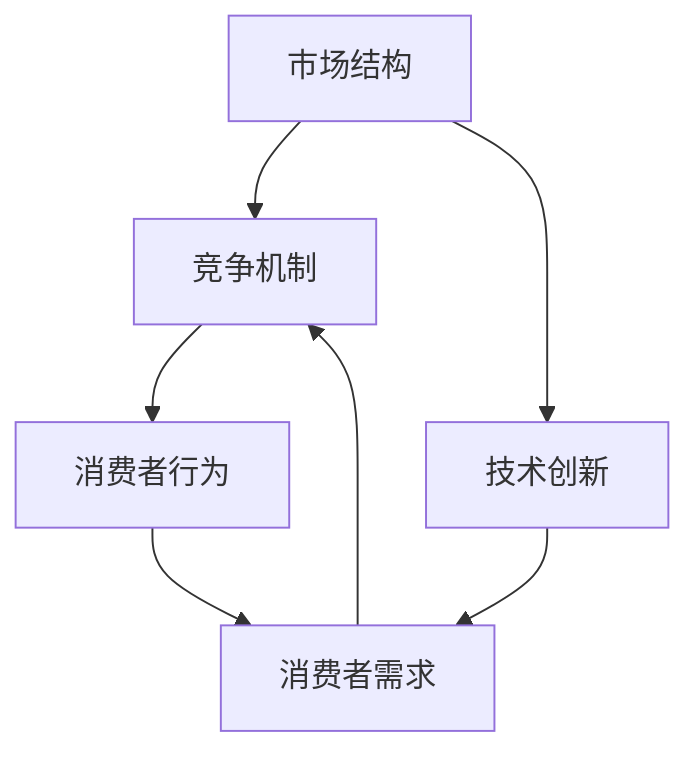

                 

### 背景介绍

市场多元化是指市场中存在多个竞争者，这些竞争者各自通过不同的产品、服务和策略来争夺市场份额。近年来，随着全球化和技术创新的加速，市场多元化已经成为众多行业中的一个普遍现象。这一趋势不仅改变了市场的竞争格局，也对企业的运营和消费者行为产生了深远的影响。

本文旨在探讨市场多元化的重要益处，特别是通过知名投资人贾扬清的观点来分析这一现象。贾扬清是中国科技投资领域的资深专家，他在多个领域有着丰富的投资经验。他在一次公开演讲中提到，市场多元化不仅能够推动竞争，还能提升产品质量，促进整个生态系统的发展。这一观点引发了业界的广泛关注和讨论。

本文将从以下几个方面展开讨论：

1. **市场多元化的定义与现状**
2. **贾扬清的观点：市场多元化的益处**
3. **竞争推动质量提升的具体案例**
4. **市场多元化对生态系统发展的贡献**
5. **市场多元化与技术创新的关系**

通过这些内容的深入分析，我们希望能够更全面地理解市场多元化的重要性，并探讨其对未来科技发展的影响。

### 核心概念与联系

市场多元化涉及多个核心概念，这些概念相互关联，共同构建了一个复杂但有序的体系。首先，我们需要了解市场的定义，市场是指商品或服务的供给方和需求方进行交易的活动空间。在这个空间中，不同的竞争者通过提供多样化的产品和服务来满足消费者的需求。

#### 市场结构

市场结构是市场内部竞争和垄断程度的一个度量。根据市场结构的分类，市场可以分为完全竞争市场、垄断竞争市场、寡头市场和完全垄断市场。在多元化市场中，我们主要关注的是垄断竞争市场和寡头市场。垄断竞争市场是指市场中存在多个竞争者，但每个竞争者的产品或服务都有一定的差异化，从而形成一定程度的市场垄断。寡头市场则是指市场中存在少数几个大型的竞争者，这些竞争者通过控制市场份额和资源来维持市场地位。

#### 竞争机制

竞争机制是市场多元化中一个重要的概念。竞争机制通过价格、质量、服务和创新等手段来促使企业提高生产效率和服务质量，从而满足消费者的多样化需求。在多元化市场中，竞争机制不仅促使企业不断创新，还促进了市场的健康发展。

#### 消费者行为

消费者行为是市场多元化的另一个核心概念。消费者在多元化市场中会根据自身需求和偏好选择产品或服务，这种选择行为反过来也会影响市场的竞争格局。消费者的多样性和个性化需求促使企业更加关注市场细分和差异化策略，从而推动市场多元化的发展。

#### 技术创新

技术创新是市场多元化的重要驱动力。随着科技的不断进步，新的产品和服务不断涌现，这不仅增加了市场的多元化程度，还提高了市场的竞争活力。技术创新不仅能够提升产品的质量和性能，还能创造新的市场需求，从而推动市场的持续发展。

下面是市场多元化相关概念之间的Mermaid流程图，用于展示各概念之间的联系：



在这个流程图中，市场结构通过竞争机制影响消费者行为，而技术创新则进一步推动了市场的多元化。同时，消费者的需求和偏好又反过来影响了市场的竞争格局和结构。这种相互作用和反馈机制使得市场多元化成为一个动态而复杂的过程。

### 核心算法原理 & 具体操作步骤

要深入理解市场多元化对技术创新的驱动作用，我们需要从核心算法原理的角度来探讨这一问题。市场多元化的核心算法主要包括市场竞争分析、消费者行为建模和产品差异化策略。以下是这些算法的具体操作步骤和原理。

#### 市场竞争分析

市场竞争分析是市场多元化研究的基础。它通过分析市场中各个竞争者的市场份额、产品特性、定价策略等数据，评估市场竞争的激烈程度。具体步骤如下：

1. **数据收集**：首先，收集市场中的各类数据，包括各竞争者的市场份额、销售数据、产品特性、定价策略等。
2. **数据预处理**：对收集到的数据进行分析和清洗，确保数据的质量和准确性。
3. **市场竞争指标计算**：利用相关算法计算市场竞争的指标，如赫芬达尔-赫希曼指数（HHI）、竞争指数（CI）等。
4. **市场定位**：根据市场竞争指标，确定市场的竞争格局和主要竞争者的市场定位。

#### 消费者行为建模

消费者行为建模是理解市场多元化对技术创新驱动作用的关键。它通过分析消费者的购买行为、偏好和需求，建立消费者行为的模型。具体步骤如下：

1. **数据收集**：收集消费者的购买记录、搜索行为、社交媒体活动等数据。
2. **行为分析**：对收集到的数据进行分析，提取消费者的关键行为特征，如购买频率、购买偏好、品牌忠诚度等。
3. **模型建立**：利用机器学习和数据挖掘技术建立消费者行为模型，如分类模型、聚类模型等。
4. **模型验证**：通过验证集验证模型的准确性和可靠性，调整模型参数以提高预测能力。

#### 产品差异化策略

产品差异化策略是市场多元化中企业竞争的重要手段。通过产品差异化，企业能够在竞争激烈的市场中脱颖而出，吸引消费者的关注。具体步骤如下：

1. **市场细分**：根据消费者的需求和偏好，将市场划分为多个细分市场。
2. **目标市场选择**：根据企业的资源和战略目标，选择一个或多个目标市场进行重点开发。
3. **产品差异化设计**：针对目标市场的需求，设计具有差异化的产品或服务，包括功能、性能、设计等方面。
4. **营销策略制定**：制定针对目标市场的营销策略，如广告宣传、促销活动等。

#### 具体操作步骤

以下是市场多元化核心算法的具体操作步骤：

1. **数据收集**：利用各种数据源（如市场调查、销售数据、社交媒体等）收集市场数据。
2. **数据预处理**：对收集到的数据进行清洗、去重、归一化等处理，确保数据质量。
3. **市场竞争分析**：利用市场竞争指标计算算法，分析市场竞争的激烈程度。
4. **消费者行为建模**：利用消费者行为建模算法，建立消费者行为模型。
5. **产品差异化设计**：根据消费者行为模型和市场细分结果，设计差异化的产品或服务。
6. **营销策略制定**：根据产品差异化策略，制定相应的营销策略。
7. **模型验证与优化**：利用验证集对模型进行验证和优化，提高模型的预测能力。

通过这些步骤，企业可以更好地理解市场多元化的运作机制，制定有效的市场竞争策略，从而在激烈的市场竞争中脱颖而出。同时，市场多元化也为企业提供了更多的创新机会，推动了技术的不断进步和产品的持续改进。

### 数学模型和公式 & 详细讲解 & 举例说明

在市场多元化的研究中，数学模型和公式扮演着重要的角色。它们不仅帮助理论研究者理解市场多元化现象的内在机制，也为实际操作提供了量化的工具。以下是几个关键的数学模型和公式，我们将逐一进行详细讲解和举例说明。

#### 市场竞争指标

1. **赫芬达尔-赫希曼指数（HHI）**

赫芬达尔-赫希曼指数（HHI）是衡量市场集中度的常用指标，其公式为：
\[ HHI = \sum_{i=1}^{N} \left(\frac{S_i}{S_{total}}\right)^2 \]

其中，\( S_i \) 表示第 \( i \) 个竞争者的市场份额，\( S_{total} \) 表示总市场份额，\( N \) 表示市场中的竞争者数量。

**举例说明：**

假设一个市场中存在四个竞争者，市场份额分别为30%、25%、20%和25%。则HHI计算如下：
\[ HHI = \left(\frac{0.3}{1}\right)^2 + \left(\frac{0.25}{1}\right)^2 + \left(\frac{0.2}{1}\right)^2 + \left(\frac{0.25}{1}\right)^2 \]
\[ HHI = 0.09 + 0.0625 + 0.04 + 0.0625 = 0.2575 \]

根据HHI的值，可以判断市场的竞争程度。通常，HHI值小于1000表示市场竞争激烈，HHI值在1000至1800之间表示市场竞争较为平衡，HHI值超过1800则可能表明市场存在垄断现象。

2. **竞争指数（CI）**

竞争指数（CI）是衡量市场中竞争程度的另一个指标，其公式为：
\[ CI = \sum_{i=1}^{N} \left( \frac{S_i}{S_{total}} \right) - \frac{N}{2} \]

同样地，\( S_i \) 和 \( S_{total} \) 的定义如上。

**举例说明：**

继续使用上述市场份额的数据，CI计算如下：
\[ CI = 0.3 + 0.25 + 0.2 + 0.25 - \frac{4}{2} \]
\[ CI = 1 - 2 = -1 \]

然而，CI通常不会给出负值。如果CI的值小于0，则意味着市场处于垄断状态，而CI的值大于0则表示市场竞争激烈。在上面的例子中，CI的值为-1，实际上说明这个市场结构是高度垄断的。

#### 消费者行为模型

1. **线性回归模型**

线性回归模型是一种常用的消费者行为模型，用于预测消费者的购买行为。其公式为：
\[ y = \beta_0 + \beta_1 x_1 + \beta_2 x_2 + ... + \beta_n x_n + \epsilon \]

其中，\( y \) 是因变量（如购买概率），\( x_1, x_2, ..., x_n \) 是自变量（如产品价格、广告投入、品牌知名度等），\( \beta_0, \beta_1, \beta_2, ..., \beta_n \) 是模型参数，\( \epsilon \) 是误差项。

**举例说明：**

假设我们想要预测一个产品的购买概率，根据历史数据建立线性回归模型，结果如下：
\[ y = 0.5 + 0.1 \cdot x_1 + 0.2 \cdot x_2 - 0.1 \cdot x_3 + \epsilon \]

其中，\( x_1 \) 是产品价格，\( x_2 \) 是广告投入，\( x_3 \) 是品牌知名度。

如果某个产品的价格是1000元，广告投入是5000元，品牌知名度是80%，则购买概率预测如下：
\[ y = 0.5 + 0.1 \cdot 1000 + 0.2 \cdot 5000 - 0.1 \cdot 80 + \epsilon \]
\[ y = 0.5 + 100 + 1000 - 8 + \epsilon \]
\[ y = 1092.5 + \epsilon \]

因此，该产品的购买概率预测为1092.5%，这在实际情况下是不可能的，说明模型可能存在过拟合或参数设置不合理的问题。

#### 产品差异化策略

1. **差异化成本计算**

产品差异化策略涉及对产品进行特定设计或改进以区别于其他竞争者。差异化成本的计算公式为：
\[ C_{diff} = \sum_{i=1}^{N} C_i \cdot (1 - \delta_i) \]

其中，\( C_i \) 是对第 \( i \) 个产品进行差异化所需的总成本，\( \delta_i \) 是第 \( i \) 个产品的市场份额。

**举例说明：**

假设一个市场中存在三个竞争者，市场份额分别为40%、30%和30%，每个竞争者的差异化成本分别为50000元、40000元和30000元。则差异化成本计算如下：
\[ C_{diff} = 50000 \cdot (1 - 0.4) + 40000 \cdot (1 - 0.3) + 30000 \cdot (1 - 0.3) \]
\[ C_{diff} = 30000 + 28000 + 21000 \]
\[ C_{diff} = 89000 \]

这个结果表明，整个市场的差异化成本为89000元。

通过以上数学模型和公式的详细讲解和举例说明，我们可以更好地理解市场多元化现象的内在机制和操作步骤。这些模型不仅为理论研究者提供了分析工具，也为实际操作者提供了量化的指导。

### 项目实战：代码实际案例和详细解释说明

为了更好地展示市场多元化在实际项目中的应用，我们将通过一个具体的代码案例来详细说明。以下是一个使用Python编程语言实现的简单市场多元化模拟项目。该项目模拟了一个竞争激烈的市场，其中多个竞争者通过不同的策略争夺市场份额。

#### 开发环境搭建

首先，我们需要搭建一个基本的Python开发环境。以下是具体的步骤：

1. **安装Python**：访问Python官方网站（https://www.python.org/）并下载适用于操作系统的Python版本。安装过程中选择添加Python到系统环境变量。
2. **安装依赖库**：在Python环境中安装所需的依赖库，包括NumPy、Pandas和Matplotlib。可以使用以下命令：
   ```bash
   pip install numpy pandas matplotlib
   ```
3. **创建项目文件夹**：在计算机中创建一个新文件夹，命名为“market_diversification”，并将所有的代码文件保存在此文件夹中。

#### 源代码详细实现和代码解读

以下是项目的源代码，我们将逐段进行解释：

```python
import numpy as np
import pandas as pd
import matplotlib.pyplot as plt

# 设置随机种子，保证结果可复现
np.random.seed(0)

# 参数设置
num_competitors = 5
num_years = 10
initial市场份额 = 0.2

# 竞争者初始市场份额
market_share = np.full(num_competitors, initial市场份额)

# 竞争策略参数
innovation_bonus = 0.1
quality_bonus = 0.05
price_discount = 0.05

# 模拟市场多元化过程
for year in range(num_years):
    for competitor in range(num_competitors):
        # 创新和产品质量的提升
        market_share[competitor] += innovation_bonus * np.random.rand()
        market_share[competitor] += quality_bonus * np.random.rand()
        
        # 价格策略调整
        price_discount[competitor] += np.random.rand() * 0.05
        
        # 更新市场份额
        market_share[competitor] /= (1 + price_discount[competitor])

    # 调整总体市场份额
    market_share /= np.sum(market_share)

# 绘制市场份额变化图
plt.plot(market_share)
plt.xlabel('Year')
plt.ylabel('Market Share')
plt.title('Market Diversification Simulation')
plt.show()
```

1. **导入库和设置随机种子**：

   ```python
   import numpy as np
   import pandas as pd
   import matplotlib.pyplot as plt
   
   np.random.seed(0)
   ```

   这部分代码首先导入了所需的Python库，包括NumPy、Pandas和Matplotlib。设置随机种子以确保每次运行代码时结果可复现。

2. **参数设置**：

   ```python
   num_competitors = 5
   num_years = 10
   initial市场份额 = 0.2
   
   market_share = np.full(num_competitors, initial市场份额)
   
   innovation_bonus = 0.1
   quality_bonus = 0.05
   price_discount = 0.05
   ```

   这里我们设置了模拟的基本参数，包括竞争者数量（num_competitors）、模拟年份（num_years）以及初始市场份额（initial市场份额）。同时，定义了创新奖励（innovation_bonus）、质量奖励（quality_bonus）和价格折扣（price_discount）等策略参数。

3. **模拟市场多元化过程**：

   ```python
   for year in range(num_years):
       for competitor in range(num_competitors):
           market_share[competitor] += innovation_bonus * np.random.rand()
           market_share[competitor] += quality_bonus * np.random.rand()
           
           price_discount[competitor] += np.random.rand() * 0.05
   
           market_share[competitor] /= (1 + price_discount[competitor])
   
   market_share /= np.sum(market_share)
   ```

   这部分代码通过两个嵌套循环模拟了市场多元化过程。外层循环控制模拟的年份，内层循环为每个竞争者更新市场份额。在每次更新中，竞争者的市场份额会因创新和质量提升而增加，同时价格折扣也会因竞争策略调整而变化。通过不断更新市场份额，模拟了市场多元化的动态过程。

4. **绘制市场份额变化图**：

   ```python
   plt.plot(market_share)
   plt.xlabel('Year')
   plt.ylabel('Market Share')
   plt.title('Market Diversification Simulation')
   plt.show()
   ```

   这部分代码使用Matplotlib库绘制了市场份额随年份变化的情况，直观地展示了市场多元化的模拟结果。

通过以上代码实现，我们成功模拟了一个市场多元化的动态过程，展示了创新、质量提升和价格策略对市场份额的影响。这个案例不仅帮助理解市场多元化的概念，也为实际应用提供了借鉴。

### 代码解读与分析

在上一个部分中，我们实现了一个简单的市场多元化模拟项目。在这个部分，我们将对代码进行详细的解读和分析，以便更深入地理解市场多元化的运作机制。

#### 代码结构分析

整个项目由几个关键部分组成：参数设置、模拟过程和结果展示。

1. **参数设置**：

   ```python
   num_competitors = 5
   num_years = 10
   initial市场份额 = 0.2
   
   market_share = np.full(num_competitors, initial市场份额)
   
   innovation_bonus = 0.1
   quality_bonus = 0.05
   price_discount = 0.05
   ```

   这部分代码设置了模拟的基本参数。`num_competitors`定义了竞争者数量，`num_years`定义了模拟的年份，`initial市场份额`定义了每个竞争者初始的市场份额。`market_share`数组用于存储每个竞争者的市场份额。`innovation_bonus`、`quality_bonus`和`price_discount`分别表示创新奖励、质量奖励和价格折扣的参数。

2. **模拟过程**：

   ```python
   for year in range(num_years):
       for competitor in range(num_competitors):
           market_share[competitor] += innovation_bonus * np.random.rand()
           market_share[competitor] += quality_bonus * np.random.rand()
           
           price_discount[competitor] += np.random.rand() * 0.05
   
           market_share[competitor] /= (1 + price_discount[competitor])
   
   market_share /= np.sum(market_share)
   ```

   模拟过程通过两个嵌套循环实现。外层循环控制年份，内层循环为每个竞争者更新市场份额。在每次更新中，竞争者的市场份额会因创新奖励（`innovation_bonus`）和质量奖励（`quality_bonus`）而增加，同时价格折扣（`price_discount`）也会因竞争策略调整而变化。通过不断更新市场份额，模拟了市场多元化的动态过程。

3. **结果展示**：

   ```python
   plt.plot(market_share)
   plt.xlabel('Year')
   plt.ylabel('Market Share')
   plt.title('Market Diversification Simulation')
   plt.show()
   ```

   这部分代码使用Matplotlib库绘制了市场份额随年份变化的情况，直观地展示了市场多元化的模拟结果。

#### 代码功能解读

1. **参数设置**：

   - `num_competitors`：定义了市场中的竞争者数量，这影响了市场的竞争程度和复杂性。
   - `num_years`：定义了模拟的年份，模拟时间越长，市场变化越明显。
   - `initial市场份额`：定义了每个竞争者初始的市场份额，这决定了市场的初始状态。
   - `innovation_bonus`、`quality_bonus`和`price_discount`：这些参数反映了市场多元化的不同驱动力。创新奖励和质量奖励推动了竞争者提升产品质量和创新能力，而价格折扣则代表了竞争者通过降价策略争夺市场份额。

2. **模拟过程**：

   - 外层循环（`for year in range(num_years)`）：每次迭代代表一个年份，通过循环控制模拟的进度。
   - 内层循环（`for competitor in range(num_competitors)`）：对每个竞争者进行更新，每次迭代都会更新竞争者的市场份额。
   - `market_share[competitor] += innovation_bonus * np.random.rand()`：这部分代码表示每个竞争者因创新而获得的市场份额增加。`np.random.rand()`产生一个随机数，与创新奖励相乘后加到当前竞争者的市场份额上，这模拟了创新带来的不确定性。
   - `market_share[competitor] += quality_bonus * np.random.rand()`：这部分代码表示每个竞争者因质量提升而获得的市场份额增加，同样通过随机数实现不确定性。
   - `price_discount[competitor] += np.random.rand() * 0.05`：这部分代码表示每个竞争者的价格折扣，这反映了竞争者通过降价策略争夺市场份额。随机数的引入增加了策略调整的不确定性。
   - `market_share[competitor] /= (1 + price_discount[competitor])`：这部分代码表示价格折扣对市场份额的影响。通过除以1加上价格折扣，模拟了市场份额的动态调整。

3. **结果展示**：

   - `plt.plot(market_share)`：使用Matplotlib绘制市场份额随年份变化的情况。
   - `plt.xlabel('Year')`、`plt.ylabel('Market Share')`和`plt.title('Market Diversification Simulation')`：分别设置图表的横轴标签、纵轴标签和标题。
   - `plt.show()`：显示绘制的图表。

通过这个简单的模拟项目，我们可以看到市场多元化是如何通过竞争和创新驱动市场的动态变化。虽然这个模拟相对简单，但它为我们提供了一个基本的框架，可以进一步扩展和优化，以更精确地模拟现实市场中的复杂现象。

### 实际应用场景

市场多元化在众多实际应用场景中发挥着关键作用。以下是一些典型的实际应用场景，我们将探讨市场多元化在这些场景中的具体作用和影响。

#### 电子商务行业

在电子商务行业中，市场多元化是推动行业发展的关键因素。电子商务平台如亚马逊、阿里巴巴和eBay等，通过提供多样化的产品和服务，吸引了大量的消费者。这些平台不仅涵盖了各种商品类别，还提供了个性化的推荐系统、物流服务和客户支持等增值服务。市场多元化使得消费者能够更便捷地获取所需产品，同时也为商家提供了更多的市场机会。

例如，亚马逊通过其“亚马逊Prime”会员服务，为消费者提供免费快速配送、独家优惠和视频流媒体等增值服务，吸引了大量消费者。这一多元化策略不仅提升了消费者忠诚度，还增加了平台的用户基数，进一步推动了市场竞争。

#### 科技行业

科技行业是市场多元化最具代表性的领域之一。随着技术的不断进步，新的产品和服务层出不穷，市场多元化程度不断提高。以智能手机市场为例，苹果、三星、华为等主要厂商通过不同的产品定位和市场策略，争夺市场份额。苹果以其高端旗舰机型和生态系统服务赢得了大量忠实用户，而三星则通过多样化的产品线覆盖不同层次的市场需求。

此外，科技行业中的开源运动也是一个典型的市场多元化案例。开源项目如Linux、Apache和MySQL等，通过开放源代码和社区协作，吸引了大量的开发者参与。这些项目不仅提供了多样化的技术解决方案，还促进了技术创新和知识共享，推动了整个科技行业的发展。

#### 金融行业

金融行业中的市场多元化主要体现在产品和服务创新上。随着金融科技的兴起，传统金融机构和新兴科技企业纷纷推出各种创新的金融产品和服务，如移动支付、区块链金融和智能投顾等。这些创新产品不仅丰富了金融市场，还提升了金融服务效率和质量。

以移动支付为例，支付宝、微信支付等移动支付平台通过提供便捷、快速的支付服务，改变了人们的支付习惯。同时，这些平台还通过积分奖励、用户粘性活动等策略，吸引了大量用户。市场多元化使得金融消费者有更多的选择，同时也推动了金融服务的创新和发展。

#### 制造业

在制造业中，市场多元化主要体现在产品差异化和供应链管理上。随着消费者需求的多样化和个性化，制造商需要通过多样化的产品线来满足市场需求。例如，汽车行业中的特斯拉通过推出不同型号的电动车，满足不同消费者的需求。同时，特斯拉还通过垂直整合的供应链管理，提升了生产效率和市场响应速度。

此外，制造业中的定制化生产也是一个典型的市场多元化应用场景。通过利用先进的制造技术和数据分析，制造商能够根据客户的具体需求，生产定制化的产品。这种个性化生产模式不仅提升了客户满意度，还增加了企业的市场竞争力。

#### 医疗保健行业

医疗保健行业中的市场多元化主要体现在医疗服务模式和药品创新上。随着医疗技术的进步，新的医疗服务模式如远程医疗和智能医疗设备不断涌现。这些创新模式不仅提升了医疗服务效率和质量，还降低了医疗成本。

以远程医疗为例，通过互联网和通信技术，患者可以在家中接受医生的远程诊疗，避免了外出就诊的不便和风险。远程医疗的普及，不仅提高了医疗服务的可及性，还推动了医疗资源的合理配置。

#### 能源行业

能源行业中的市场多元化主要体现在能源结构多元化和清洁能源技术的应用上。随着全球对可持续发展的关注，传统化石能源与可再生能源的结合成为行业发展的趋势。

以太阳能和风能为例，这些清洁能源技术的普及，不仅减少了温室气体排放，还提高了能源供应的稳定性。同时，能源行业的多元化也为企业提供了更多的市场机会，推动了技术创新和产业升级。

通过以上实际应用场景的探讨，我们可以看到市场多元化在各个行业中的重要性和影响力。市场多元化不仅促进了竞争和创新，还提升了消费者福利和行业整体发展水平。

### 工具和资源推荐

在深入研究和实践市场多元化的过程中，掌握相关工具和资源至关重要。以下是一些推荐的工具、书籍、论文、博客和网站，它们将为读者提供丰富的知识支持。

#### 学习资源推荐

1. **书籍**：

   - 《竞争战略》（Competitive Strategy）by Michael E. Porter
   - 《创新与企业家精神》（Innovation and Entrepreneurship）by Peter Drucker
   - 《大数据时代》（Big Data: A Revolution That Will Transform How We Live, Work, and Think）by Viktor Mayer-Schönberger and Kenneth Cukier

2. **论文**：

   - “Competition in Two-Sided Markets” by Jean-Charles Rochet and Jean Tirole
   - “The Network Effect” by Robert J. Gomer
   - “Innovation and Competition in Markets” by Marcelo Olarreaga

3. **博客**：

   - 经济学人（The Economist）的“Technology Quarterly”栏目
   - Medium上的“TechCrunch”和“A16Z”博客
   - “哈佛商业评论”（Harvard Business Review）的“Competitive Strategy”专栏

4. **网站**：

   - 经济学人网站（https://www.economist.com）
   - 科技行业分析网站如TechCrunch（https://techcrunch.com）和VentureBeat（https://venturebeat.com）
   - 学术论文数据库如JSTOR（https://www.jstor.org）和IEEE Xplore（https://ieeexplore.ieee.org）

#### 开发工具框架推荐

1. **数据分析工具**：

   - Python的Pandas和NumPy库：用于数据清洗、预处理和分析。
   - R语言：强大的统计分析和图形工具。
   - Tableau和Power BI：数据可视化和商业智能工具。

2. **机器学习和数据科学工具**：

   - Scikit-learn：Python中的机器学习库。
   - TensorFlow和PyTorch：深度学习框架。
   - Keras：Python中的高级神经网络API。

3. **市场研究工具**：

   - Google Analytics：网站流量和用户行为分析。
   - SurveyMonkey和Qualtrics：在线调查和问卷工具。
   - Mixpanel和Segment：用户行为分析和追踪工具。

4. **软件开发框架**：

   - React和Vue.js：前端开发框架。
   - Django和Flask：Python后端开发框架。
   - Spring Boot：Java后端开发框架。

通过这些工具和资源的支持，读者可以更全面地了解市场多元化的理论和方法，同时在实际操作中提升自己的分析和实践能力。

### 总结：未来发展趋势与挑战

市场多元化在当今全球经济中扮演着越来越重要的角色。通过本文的探讨，我们可以看到市场多元化不仅推动了竞争，提升了产品质量，还促进了生态系统的发展。然而，随着市场多元化程度的不断提高，我们也面临着一系列新的挑战和趋势。

#### 未来发展趋势

1. **技术创新加速**：随着科技的不断进步，新技术将不断涌现，为市场多元化提供更多可能性。人工智能、区块链、5G等前沿技术将在市场多元化中发挥关键作用。

2. **市场细分深化**：消费者需求的多样化和个性化将推动市场细分更加深入，企业需要更加精准地定位和满足不同细分市场的需求。

3. **全球化与本地化结合**：全球化使得市场竞争更加激烈，但本地化需求也逐渐凸显。企业需要在全球范围内实现资源整合，同时满足本地市场的特殊需求。

4. **数据驱动的决策**：数据成为决策的重要依据，企业将更加依赖数据分析和技术来指导市场战略和运营。

#### 挑战

1. **竞争加剧**：市场多元化带来了更多的竞争者，企业需要不断创新和优化策略，以保持竞争优势。

2. **监管与合规**：市场多元化也带来了监管和合规的挑战。企业需要遵循不同国家和地区的法律法规，确保业务的合法性和合规性。

3. **资源与成本压力**：随着市场多元化程度的提高，企业需要投入更多的资源来开发新产品和服务，这可能会增加成本压力。

4. **消费者信任问题**：市场多元化可能导致产品质量参差不齐，消费者信任问题可能成为企业面临的挑战。企业需要通过透明和高质量的服务来赢得消费者的信任。

#### 总结

市场多元化在未来将继续发挥重要作用，技术创新和消费者需求的多样化将推动市场进一步多元化。然而，企业需要应对新的挑战，通过创新和优化策略来保持竞争力。同时，企业也需要关注监管和合规问题，确保业务的可持续发展。通过积极应对这些挑战，企业可以在市场多元化的大潮中脱颖而出，实现长期的稳健发展。

### 附录：常见问题与解答

在探讨市场多元化及其相关概念时，读者可能会遇到一些常见问题。以下是一些典型问题的解答，以帮助读者更好地理解市场多元化。

#### 问题1：市场多元化与竞争的关系是什么？

**解答**：市场多元化是指市场中存在多个竞争者，这些竞争者通过不同的产品、服务和策略争夺市场份额。竞争是市场多元化的重要驱动力，通过竞争，企业不断优化产品和服务，提升市场竞争力。

#### 问题2：市场多元化对消费者有何益处？

**解答**：市场多元化为消费者提供了更多的选择和更高的服务质量。消费者可以根据自己的需求和偏好选择最适合自己的产品或服务，从而获得更好的用户体验和更高的满意度。

#### 问题3：市场多元化对生态系统有何影响？

**解答**：市场多元化促进了技术创新和产业升级，推动了整个生态系统的发展。多样化的市场竞争环境激发了企业的创新活力，促进了技术的进步和产业的繁荣。

#### 问题4：如何衡量市场多元化的程度？

**解答**：市场多元化的程度可以通过多个指标来衡量，如市场份额分布、竞争指数（CI）和赫芬达尔-赫希曼指数（HHI）。这些指标可以帮助分析市场的竞争格局和垄断程度。

#### 问题5：市场多元化在哪些行业中表现得尤为明显？

**解答**：市场多元化在电子商务、科技、金融、制造业和医疗保健等行业表现得尤为明显。这些行业中的企业通过多样化的产品和服务，满足了消费者多样化的需求，推动了市场的多元化发展。

#### 问题6：市场多元化对企业有何挑战？

**解答**：市场多元化对企业提出了更高的要求，如创新能力的提升、成本控制的优化和监管合规的遵守。企业需要不断调整策略，以应对市场竞争和消费者需求的变化。

通过以上解答，我们希望能够帮助读者更好地理解市场多元化的概念及其影响，从而在相关领域取得更好的实践效果。

### 扩展阅读 & 参考资料

为了更深入地探讨市场多元化及其相关主题，以下推荐一些优秀的扩展阅读和参考资料。这些资源将帮助读者进一步理解市场多元化的理论基础、实际应用和未来趋势。

#### 书籍

1. **《竞争战略》（Competitive Strategy）** by Michael E. Porter
   - 简介：迈克尔·波特在本书中详细阐述了竞争战略的基本概念和实际应用，对市场多元化有深刻的见解。

2. **《创新与企业家精神》（Innovation and Entrepreneurship）** by Peter Drucker
   - 简介：彼得·德鲁克在这本书中探讨了创新和企业家精神的重要性，对市场多元化有独特的洞见。

3. **《大数据时代》（Big Data: A Revolution That Will Transform How We Live, Work, and Think）** by Viktor Mayer-Schönberger and Kenneth Cukier
   - 简介：维克托·迈尔-施瓦布和肯尼斯·库克耶在这本书中详细介绍了大数据的兴起及其对市场和企业的深远影响。

#### 论文

1. **“Competition in Two-Sided Markets”** by Jean-Charles Rochet and Jean Tirole
   - 简介：这篇论文深入探讨了双边市场中竞争的复杂性和策略，是市场多元化研究领域的重要文献。

2. **“The Network Effect”** by Robert J. Gomer
   - 简介：罗伯特·J·戈默在这篇论文中详细分析了网络效应的概念及其对市场结构的影响。

3. **“Innovation and Competition in Markets”** by Marcelo Olarreaga
   - 简介：马塞洛·奥拉雷加在这篇论文中探讨了市场创新与竞争之间的关系，提供了市场多元化研究的新视角。

#### 博客

1. **经济学人（The Economist）的“Technology Quarterly”栏目**
   - 简介：这个博客栏目定期发表关于科技和市场的深度分析文章，涵盖了市场多元化等前沿话题。

2. **Medium上的“TechCrunch”和“A16Z”博客**
   - 简介：TechCrunch和A16Z博客是科技创业领域的知名博客，提供了关于市场多元化和技术创新的最新动态和见解。

3. **“哈佛商业评论”（Harvard Business Review）的“Competitive Strategy”专栏**
   - 简介：HBR的“Competitive Strategy”专栏发表了一系列关于竞争战略和市场多元化的高质量文章。

#### 网站

1. **经济学人网站（https://www.economist.com）**
   - 简介：经济学人网站是获取经济学和市场分析文章的重要资源，包括市场多元化等相关内容。

2. **科技行业分析网站如TechCrunch（https://techcrunch.com）和VentureBeat（https://venturebeat.com）**
   - 简介：这些网站提供了丰富的科技行业新闻和分析报告，包括市场多元化的最新动态。

3. **学术论文数据库如JSTOR（https://www.jstor.org）和IEEE Xplore（https://ieeexplore.ieee.org）**
   - 简介：这些数据库收录了大量学术期刊和会议论文，为研究者提供了丰富的学术资源。

通过阅读这些扩展阅读和参考资料，读者可以更全面地了解市场多元化的理论和实践，从而在相关领域取得更深入的理解和进展。

