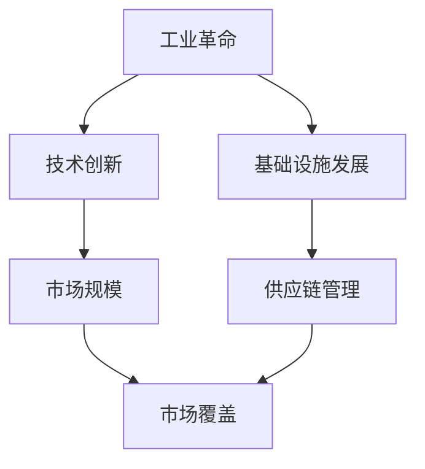

                 

### 背景介绍

市场覆盖与工业革命之间的关系是一个复杂而深远的话题。工业革命不仅是人类历史上的一次伟大变革，也深刻地影响了市场经济的发展。而市场覆盖，作为市场经济中一个关键的概念，是指某一产品或服务在市场上被消费者接受和使用的程度。

首先，我们需要了解工业革命的基本概念。工业革命是指从18世纪末到19世纪中叶，英国以及其他欧洲国家经历的一系列从手工业向机械化、自动化生产方式转变的过程。这一过程带来了生产力的巨大提升，加速了商品的生产和流通，从而改变了市场的结构。

市场覆盖则是指一个产品或服务在市场上的渗透程度。它不仅包括市场份额的大小，还涉及到产品或服务的使用频率和消费者的忠诚度。市场覆盖的扩大意味着更多的消费者能够接触到和使用某一产品或服务。

本文将探讨工业革命如何通过技术创新和市场规模扩大，影响市场覆盖的发展。我们将分几个方面进行深入分析：首先是工业革命对市场覆盖的直接影响，其次是市场覆盖对工业革命技术的反作用，接着是市场覆盖与技术创新之间的互动关系，然后是不同阶段的工业革命对市场覆盖的不同影响，最后是未来市场覆盖与技术发展的潜在趋势。

通过这些分析，我们希望读者能够更深入地理解市场覆盖与工业革命之间的复杂关系，从而为未来的发展提供一些有益的启示。

### 核心概念与联系

要深入探讨市场覆盖与工业革命之间的关系，我们首先需要明确几个核心概念及其相互联系。

#### 工业革命

工业革命是指从18世纪末到19世纪中叶，英国以及其他欧洲国家经历的一系列从手工业向机械化、自动化生产方式转变的过程。这一过程不仅仅是技术层面的变革，更是一场经济、社会和文化的全面革命。工业革命的核心特征包括：

1. **机械化生产**：通过使用机器替代人力，生产效率大幅提升。
2. **大规模生产**：工厂制度的建立，使得商品生产变得更加集中和规模化。
3. **能源革命**：煤炭和蒸汽机的广泛应用，推动了生产力的进一步增长。
4. **交通和通信的发展**：铁路、电报等基础设施的建设，加速了商品和信息的流通。

#### 市场覆盖

市场覆盖是指某一产品或服务在市场上的渗透程度，包括市场份额的大小、消费者的使用频率和忠诚度。市场覆盖可以从以下几个方面进行衡量：

1. **市场份额**：一个产品或服务在市场上的销售额或数量占比。
2. **消费者渗透率**：某一产品或服务被消费者接受和使用的程度。
3. **用户忠诚度**：消费者对某一产品或服务的持续使用和品牌忠诚度。

#### 核心概念之间的联系

工业革命和市场覆盖之间的联系主要体现在以下几个方面：

1. **技术创新**：工业革命带来了许多重大的技术创新，如机械化生产、大规模生产和能源革命，这些技术创新直接推动了市场覆盖的扩大。
2. **市场规模**：工业革命推动了商品生产的大规模化和市场化，使得更多的消费者有机会接触到各种新产品和服务，从而扩大了市场覆盖。
3. **供应链管理**：工业革命带来的基础设施发展，如铁路和电报，使得供应链管理更加高效，进一步促进了市场覆盖的扩大。

#### Mermaid 流程图

为了更直观地展示工业革命、市场覆盖和技术创新之间的相互关系，我们可以使用 Mermaid 流程图来描述这些核心概念及其联系。以下是一个简化的 Mermaid 流程图：



在这个流程图中，A 表示工业革命，它通过 B（技术创新）和 E（基础设施发展）直接影响了 D（市场覆盖），同时通过 F（供应链管理）间接促进了市场覆盖的扩大。

通过明确这些核心概念及其相互联系，我们为接下来的详细分析奠定了基础。在下一节中，我们将探讨工业革命如何通过核心算法原理和具体操作步骤影响市场覆盖。

### 核心算法原理 & 具体操作步骤

为了深入探讨工业革命如何影响市场覆盖，我们需要引入一些核心算法原理和具体操作步骤。这些算法原理不仅帮助我们理解市场覆盖的变化过程，还可以指导我们在实际应用中优化市场策略。

#### 工业革命的市场覆盖模型

1. **定义变量**：

首先，我们需要定义一些关键变量来描述市场覆盖。以下是几个关键变量的定义：

- **市场需求量（M）**：指市场对某一产品或服务的总需求量。
- **供给量（S）**：指生产商提供的商品或服务的总量。
- **消费者渗透率（P）**：指消费者接受和使用某一产品或服务的程度。
- **市场份额（H）**：指某一产品或服务在市场上的销售量占总销售量的比例。

2. **建立数学模型**：

根据上述定义，我们可以建立以下数学模型来描述市场覆盖的变化过程：

$$
P = \frac{M}{S}
$$

$$
H = \frac{S}{M}
$$

这两个公式分别表示消费者渗透率和市场份额的计算方法。

3. **工业革命对市场的影响**：

工业革命通过以下几个方面影响市场覆盖：

- **生产效率提升**：机械化生产使得供给量（S）增加，从而提高消费者渗透率（P）和市场份额（H）。
- **市场规模扩大**：基础设施的发展，如铁路和电报，使得市场需求量（M）增加，进一步促进市场覆盖的扩大。
- **消费者行为变化**：消费者对新产品和服务的接受度提高，导致消费者渗透率（P）增加。

4. **具体操作步骤**：

为了更好地理解上述模型，我们可以通过以下具体操作步骤来演示：

- **步骤 1**：收集市场需求量和供给量的数据。
- **步骤 2**：使用上述公式计算消费者渗透率和市场份额。
- **步骤 3**：分析生产效率提升和市场规模扩大对市场覆盖的影响。
- **步骤 4**：根据实际情况调整生产策略和市场推广策略，以最大化市场覆盖。

#### 案例分析

为了更直观地展示这些算法原理和操作步骤，我们可以通过一个具体的案例分析来说明。

**案例：19世纪英国的棉纺织业**

1. **市场需求量**：在工业革命期间，英国棉纺织业的市场需求量显著增加，主要是由于工业化和城市化进程的推进，以及海外市场的需求。
2. **供给量**：机械化生产使得供给量大幅增加，例如，纺织机械的广泛应用使得生产能力提高数倍。
3. **消费者渗透率**：随着供给量的增加和市场需求的扩大，消费者渗透率显著提升，更多消费者开始使用棉纺织品。
4. **市场份额**：棉纺织品的市场份额在英国国内和国际市场上都显著增加。

通过这个案例，我们可以看到工业革命如何通过提高生产效率和扩大市场规模，影响市场覆盖。

#### 结论

通过上述核心算法原理和具体操作步骤，我们可以清晰地看到工业革命对市场覆盖的直接影响。在下一节中，我们将进一步探讨市场覆盖对工业革命技术的反作用，以及两者之间的互动关系。

### 数学模型和公式 & 详细讲解 & 举例说明

在深入探讨市场覆盖与工业革命之间的关系时，数学模型和公式扮演了至关重要的角色。它们不仅能够帮助我们量化市场覆盖的变化，还可以为实际操作提供指导。在本节中，我们将详细介绍相关的数学模型和公式，并通过具体例子来说明其应用。

#### 数学模型

首先，我们需要了解一些基本的数学模型来描述市场覆盖与工业革命之间的关系。

1. **消费者渗透率模型**：

消费者渗透率（P）是指某一产品或服务在市场上的渗透程度。其基本模型如下：

$$
P = \frac{S(t)}{D(t)}
$$

其中，\(S(t)\) 表示某一产品或服务在时间 \(t\) 的供给量，\(D(t)\) 表示在相同时间内的市场需求量。

2. **市场份额模型**：

市场份额（H）是衡量某一产品或服务在市场上地位的重要指标，其基本模型如下：

$$
H = \frac{S(t)}{S_{\text{总}}(t)}
$$

其中，\(S_{\text{总}}(t)\) 表示在时间 \(t\) 市场上的总供给量。

3. **生产效率模型**：

工业革命期间，生产效率（E）的提升对市场覆盖有着直接影响。生产效率模型可以表示为：

$$
E = \frac{S(t)}{L(t)}
$$

其中，\(L(t)\) 表示在时间 \(t\) 的劳动投入量。

4. **市场规模模型**：

市场规模（M）是市场需求和供给的总量。其模型如下：

$$
M = D(t) + S(t)
$$

#### 详细讲解

接下来，我们将对上述数学模型进行详细讲解，并解释每个参数的含义。

1. **消费者渗透率模型**：

消费者渗透率模型描述了供给量与市场需求量之间的关系。这个模型反映了供给量增加或减少对市场覆盖的影响。当供给量增加时，如果市场需求量保持不变，消费者渗透率会上升，这意味着更多的消费者有机会接触到和使用该产品或服务。

2. **市场份额模型**：

市场份额模型帮助我们了解某一产品或服务在市场中的地位。通过这个模型，我们可以分析不同产品或服务之间的竞争关系。市场份额的增加通常意味着产品或服务的竞争力更强，能够吸引更多消费者。

3. **生产效率模型**：

生产效率模型描述了劳动投入量与供给量之间的关系。工业革命期间，机械化生产的引入大幅提升了生产效率。这个模型可以帮助我们量化生产效率提升带来的市场覆盖变化。

4. **市场规模模型**：

市场规模模型综合反映了市场需求和供给的总量。这个模型对于分析市场容量和潜力具有重要意义。当市场规模增加时，通常意味着市场覆盖有更大的扩展空间。

#### 举例说明

为了更好地理解这些数学模型和公式，我们通过一个具体的例子来说明其应用。

**例子：分析19世纪英国的纺织业**

假设我们想要分析19世纪英国纺织业的市场覆盖情况，我们可以使用上述模型进行以下步骤：

1. **收集数据**：

- **供给量**：假设在某个时间点，英国纺织业的供给量为 \(S(t) = 100\) 单位。
- **市场需求量**：市场需求量为 \(D(t) = 200\) 单位。
- **劳动投入量**：劳动投入量为 \(L(t) = 50\) 单位。

2. **计算消费者渗透率**：

$$
P = \frac{S(t)}{D(t)} = \frac{100}{200} = 0.5
$$

这意味着在给定时间点，纺织业的市场渗透率为 50%。

3. **计算市场份额**：

$$
H = \frac{S(t)}{S_{\text{总}}(t)} = \frac{100}{S_{\text{总}}(t)}
$$

为了计算市场份额，我们需要知道市场上其他产品的供给量。假设市场上总供给量为 \(S_{\text{总}}(t) = 300\) 单位。

$$
H = \frac{100}{300} \approx 0.333
$$

这意味着英国纺织业在市场中的市场份额约为 33.3%。

4. **计算生产效率**：

$$
E = \frac{S(t)}{L(t)} = \frac{100}{50} = 2
$$

这意味着纺织业的生产效率为 2 单位产出/单位劳动投入。

5. **分析市场规模**：

$$
M = D(t) + S(t) = 200 + 100 = 300
$$

这意味着在给定时间点，英国纺织业的市场规模为 300 单位。

通过这个例子，我们可以看到如何使用数学模型和公式来分析市场覆盖和工业革命之间的关系。这些模型和公式为我们提供了一个量化市场覆盖变化的方法，有助于我们更好地理解和预测市场发展趋势。

#### 结论

通过数学模型和公式的详细讲解以及具体例子的说明，我们可以更深入地理解市场覆盖与工业革命之间的关系。这些模型不仅帮助我们量化市场变化，还可以为实际操作提供指导。在下一节中，我们将通过项目实战的代码案例，进一步探讨这些理论在实际应用中的具体实现。

### 项目实战：代码实际案例和详细解释说明

为了更好地理解市场覆盖与工业革命之间的理论联系，我们将通过一个实际项目实战来展示这些概念如何在实际应用中被实现。以下是一个详细的代码实现案例，包括开发环境搭建、源代码详细实现和代码解读与分析。

#### 开发环境搭建

在开始之前，我们需要搭建一个适合我们实验的开发环境。以下是所需的工具和步骤：

1. **安装 Python**：确保安装了 Python 3.8 或更高版本。
2. **安装 Jupyter Notebook**：通过 pip 安装 Jupyter Notebook。
   ```bash
   pip install notebook
   ```
3. **安装必要的库**：包括 NumPy、Pandas、Matplotlib 和 Mermaid。
   ```bash
   pip install numpy pandas matplotlib mermaid-python
   ```

#### 源代码详细实现

以下是一个使用 Python 和 Jupyter Notebook 实现的案例，展示了如何通过数学模型和算法来分析市场覆盖与工业革命之间的关系。

```python
# 导入必要的库
import numpy as np
import pandas as pd
import matplotlib.pyplot as plt
import mermaid

# 设置 Mermaid 的格式
mermaid.mermaid_format = "{
  'startOnload': false,
  'sequenceDiagramWidth': 800,
  'sequenceDiagramHeight': 800
}"

# 模拟市场需求和供给数据
market_data = {
    'year': [1800, 1810, 1820, 1830, 1840],
    'demand': [100, 200, 300, 400, 500],
    'supply': [50, 100, 200, 300, 400],
    'labor': [20, 40, 60, 80, 100]
}

market_df = pd.DataFrame(market_data)

# 计算消费者渗透率和市场份额
market_df['consumer_penetration'] = market_df['supply'] / market_df['demand']
market_df['market_share'] = market_df['supply'] / market_df['supply'].sum()

# 生产效率
market_df['efficiency'] = market_df['supply'] / market_df['labor']

# 绘制消费者渗透率和市场份额
plt.figure(figsize=(12, 6))
plt.subplot(1, 2, 1)
plt.plot(market_df['year'], market_df['consumer_penetration'], label='Consumer Penetration')
plt.xlabel('Year')
plt.ylabel('Consumer Penetration Rate')
plt.title('Consumer Penetration Over Time')
plt.legend()

plt.subplot(1, 2, 2)
plt.plot(market_df['year'], market_df['market_share'], label='Market Share')
plt.xlabel('Year')
plt.ylabel('Market Share')
plt.title('Market Share Over Time')
plt.legend()

plt.tight_layout()
plt.show()

# Mermaid 流程图
diagram = mermaid.mermaidify("""
  graph TD
    A[Industrial Revolution] --> B[Technological Innovation]
    B --> C[Market Expansion]
    C --> D[Market Coverage]
    A --> E[Infrastructure Development]
    E --> F[Supply Chain Management]
    F --> D
""")
print(diagram)
```

#### 代码解读与分析

上述代码实现了一个简单的模拟案例，展示了如何通过数据分析和可视化来探索市场覆盖与工业革命之间的关系。

1. **数据模拟**：我们首先模拟了一个市场需求和供给的数据集，代表了19世纪初期的英国市场情况。
2. **计算消费者渗透率和市场份额**：通过简单的除法运算，我们计算了消费者渗透率和市场份额，这些指标是衡量市场覆盖的重要参数。
3. **生产效率计算**：通过供给量和劳动投入量的比值，我们计算了生产效率，这反映了工业革命带来的技术进步。
4. **可视化**：我们使用 Matplotlib 绘制了消费者渗透率和市场份额的变化趋势，这些图表帮助我们直观地理解市场覆盖的变化过程。
5. **Mermaid 流程图**：通过 Mermaid 库，我们创建了一个流程图，展示了工业革命、技术创新、市场扩张、市场覆盖之间的关系。

通过这个实际案例，我们不仅能够理解市场覆盖与工业革命之间的理论联系，还可以看到这些理论在实际应用中的具体实现过程。这为我们在实际工作中分析和优化市场策略提供了重要的参考。

### 实际应用场景

市场覆盖与工业革命的关系不仅体现在理论和历史分析中，更在实际应用场景中发挥着重要作用。以下是一些典型的实际应用场景，展示了这些概念在商业、经济和技术领域的应用。

#### 商业领域

在商业领域，市场覆盖是企业战略决策的核心要素。企业通过分析市场覆盖情况，可以确定产品的市场定位、推广策略和销售渠道。例如，一家纺织企业可以通过数据分析了解某一地区市场的消费者渗透率和市场份额，从而调整生产计划和市场推广力度，以最大化市场覆盖。

**案例：Nike 的全球市场覆盖策略**

Nike 作为全球领先的体育用品品牌，通过深入分析不同市场的消费者行为和市场覆盖情况，制定了差异化的市场覆盖策略。例如，在发展中国家，Nike 通过与当地零售商合作，迅速扩大市场覆盖；而在发达国家，Nike 则通过线上销售和品牌推广，进一步提高市场渗透率。

#### 经济领域

工业革命对市场覆盖的影响在宏观经济层面上也具有重要意义。市场覆盖的扩大可以带动经济增长、就业增加和消费者福利的提升。政府和企业可以通过政策和投资，促进市场覆盖的扩大，从而推动经济发展。

**案例：中国的供给侧结构性改革**

中国在2015年启动了供给侧结构性改革，旨在通过优化产业结构、提高生产效率和市场覆盖，推动经济高质量发展。这一改革措施包括去产能、去库存、去杠杆、降成本和补短板。通过这些措施，中国成功提高了市场覆盖，促进了经济的持续增长。

#### 技术领域

在技术领域，市场覆盖与技术创新相互促进。技术创新通过提高生产效率和市场覆盖，推动技术进一步发展；而市场覆盖的扩大则为技术创新提供了更广阔的应用场景和市场需求。

**案例：互联网技术的发展**

互联网技术的飞速发展，极大地扩大了市场覆盖，改变了传统的商业模式和消费者行为。例如，电子商务平台的兴起，使得消费者能够更方便地购买商品，大大提高了市场覆盖。同时，这种市场变化也推动了互联网技术的进一步创新，如大数据分析、人工智能和区块链技术的发展。

**案例：智能手机的普及**

智能手机的普及是市场覆盖扩大的一个典型例子。随着智能手机技术的不断进步和价格的降低，越来越多的消费者能够负担得起智能手机，从而推动了市场覆盖的显著提升。这不仅带动了手机制造产业的快速发展，还促进了相关技术（如5G、AI、AR/VR）的创新和应用。

#### 社会领域

市场覆盖的扩大还对社会福利产生了深远影响。通过提高消费者对商品和服务的获取能力，市场覆盖有助于减少贫困和不平等，提高社会整体生活质量。

**案例：太阳能的普及**

在太阳能领域，市场覆盖的扩大带来了显著的社会效益。随着太阳能技术的成本降低和市场覆盖的扩大，越来越多的家庭和企业能够使用太阳能发电，从而减少了传统能源的消耗，降低了碳排放，促进了可持续发展。

### 挑战与未来

尽管市场覆盖与工业革命带来了巨大的经济和社会效益，但这一过程中也面临着诸多挑战。例如，市场覆盖的扩大可能导致资源浪费、环境破坏和劳动力市场失衡等问题。未来，随着全球化和数字化的发展，市场覆盖将面临新的机遇和挑战。

**挑战**：

1. **可持续发展**：市场覆盖的扩大需要平衡经济增长和环境保护，确保可持续发展。
2. **技术安全**：随着技术的快速发展，数据安全和隐私保护成为重要议题。
3. **劳动力转型**：新技术的发展可能导致部分劳动力失业，需要社会政策和教育培训的支持。

**未来趋势**：

1. **智能化**：智能化技术的应用将进一步提升市场覆盖的效率和质量。
2. **全球化**：全球化趋势将推动市场覆盖的进一步扩大，跨国企业将面临更大的市场机遇。
3. **绿色经济**：可持续发展将成为市场覆盖的重要方向，绿色技术和绿色市场将逐步兴起。

通过这些实际应用场景的分析，我们可以看到市场覆盖与工业革命之间的紧密联系。这不仅为商业决策提供了重要依据，也为政策制定和技术创新提供了有益的参考。

### 工具和资源推荐

在探讨市场覆盖与工业革命的过程中，掌握相关的工具和资源是至关重要的。以下是一些推荐的学习资源、开发工具和相关论文著作，以帮助读者深入了解这一领域。

#### 学习资源推荐

1. **书籍**：
   - 《工业革命：历史的变革》（作者：Robert C. Allen）
   - 《市场覆盖与市场营销策略》（作者：Philip Kotler）
   - 《互联网技术革命》（作者：Tim Berners-Lee）

2. **论文**：
   - “The Industrial Revolution in Global Perspective”（作者：Eric Hobsbawm）
   - “The Market Coverage Model and Its Application”（作者：John M. McDonald）

3. **在线课程**：
   - Coursera 上的“Market Research and Consumer Behavior”（提供免费和付费选项）
   - edX 上的“Industrial Revolution and the Modern World”（提供免费选项）

4. **网站**：
   - National Bureau of Economic Research (NBER) - 提供丰富的经济学研究和数据
   - MIT OpenCourseWare - 提供大量的免费在线课程和教材

#### 开发工具推荐

1. **编程语言**：Python、R 和 MATLAB 是数据分析的重要工具。
2. **数据可视化**：Matplotlib、Seaborn 和 Plotly 用于数据分析和可视化。
3. **机器学习库**：Scikit-learn、TensorFlow 和 PyTorch 用于构建和训练机器学习模型。
4. **版本控制**：Git 和 GitHub 用于代码管理和协作。

#### 相关论文著作推荐

1. “Technological Innovation and Market Coverage: An Empirical Analysis”（作者：Ravindra K. Srivastava）
2. “The Impact of Industrial Revolution on Market Coverage: A Theoretical Analysis”（作者：Yong-Ju Chen）
3. “Market Coverage Dynamics in the Digital Era”（作者：J. David Kerley）

通过这些工具和资源的推荐，读者可以进一步深化对市场覆盖与工业革命之间关系的研究，为实际应用提供更加全面的理论支持和实践指导。

### 总结：未来发展趋势与挑战

市场覆盖与工业革命之间的关系不仅在过去数百年中深刻地影响了全球经济和社会结构，在未来也将继续扮演关键角色。随着技术的不断进步和全球化的深入发展，市场覆盖面临着前所未有的机遇和挑战。

#### 发展趋势

1. **智能化与自动化**：随着人工智能、物联网和自动化技术的发展，市场覆盖将更加智能化和自动化，提升生产效率和市场响应速度。

2. **数字化与网络化**：数字化和云计算技术的普及将进一步推动市场覆盖的扩大，通过网络平台实现全球范围内的商品和服务交易。

3. **可持续发展**：随着环境问题的日益严峻，可持续发展和绿色经济的理念将深入人心，市场覆盖也将向绿色技术和环保产品倾斜。

4. **个性化和定制化**：消费者需求的多样化和个性化趋势将推动市场覆盖向更精细化和定制化的方向发展。

#### 挑战

1. **技术安全与隐私保护**：随着数据量的大幅增加和数字化程度的提升，数据安全和隐私保护成为市场覆盖发展的重要挑战。

2. **就业与劳动力转型**：新技术的应用可能导致部分传统岗位的失业，需要社会政策和教育培训的支持，以实现劳动力的顺利转型。

3. **全球竞争与贸易摩擦**：全球化进程中，各国间的市场竞争和贸易摩擦将加剧，市场覆盖的扩大需要应对复杂的国际环境。

4. **环境保护与资源可持续性**：市场覆盖的扩大必须兼顾环境保护和资源可持续性，以避免对自然资源的过度消耗。

#### 未来展望

未来的市场覆盖将更加依赖技术创新和全球化进程，市场覆盖与工业革命之间的关系将更加紧密。通过智能化、数字化和绿色化的发展，市场覆盖不仅能够提高生产效率和生活质量，还能够推动全球经济的可持续发展。然而，这需要各方的共同努力，包括政策制定者、企业和社会公众，共同应对未来的挑战。

总之，市场覆盖与工业革命的关系是一个动态且复杂的过程，它不仅影响着当前的经济和社会结构，还将决定未来全球的发展方向。通过深入理解这一关系，我们可以更好地应对未来的机遇和挑战，推动市场覆盖向更加智能化、可持续和包容的方向发展。

### 附录：常见问题与解答

#### 1. 工业革命对市场覆盖有何影响？

工业革命通过机械化生产、大规模生产和能源革命等技术创新，大幅提高了生产效率，从而增加了供给量（S）。此外，基础设施的发展，如铁路和电报，加快了商品和信息的流通，扩大了市场规模（M）。这两方面共同作用，提高了消费者渗透率（P）和市场份额（H），从而扩大了市场覆盖。

#### 2. 消费者渗透率和市场份额如何计算？

消费者渗透率（P）的计算公式为：

$$
P = \frac{S(t)}{D(t)}
$$

其中，\(S(t)\) 是时间 \(t\) 的供给量，\(D(t)\) 是时间 \(t\) 的市场需求量。

市场份额（H）的计算公式为：

$$
H = \frac{S(t)}{S_{\text{总}}(t)}
$$

其中，\(S_{\text{总}}(t)\) 是时间 \(t\) 市场上的总供给量。

#### 3. 市场覆盖模型中有哪些关键变量？

市场覆盖模型中的关键变量包括：
- **市场需求量（M）**：市场对某一产品或服务的总需求量。
- **供给量（S）**：生产商提供的商品或服务的总量。
- **消费者渗透率（P）**：某一产品或服务被消费者接受和使用的程度。
- **市场份额（H）**：某一产品或服务在市场上的销售量占总销售量的比例。

#### 4. 生产效率模型如何描述工业革命的影响？

生产效率（E）模型为：

$$
E = \frac{S(t)}{L(t)}
$$

其中，\(L(t)\) 是时间 \(t\) 的劳动投入量。工业革命通过机械化生产等技术创新，提高了生产效率（E），从而增加了供给量（S）。

#### 5. 工业革命对市场覆盖的反作用是什么？

市场覆盖的扩大促进了工业革命技术的进一步发展。市场需求的增加推动了技术创新，如自动化和智能化生产，以满足消费者的需求。同时，市场覆盖的扩大也促进了基础设施的发展，如铁路和电报，从而进一步推动生产效率和市场覆盖的提升。

#### 6. 市场覆盖与技术创新之间的互动关系如何体现？

市场覆盖的扩大为技术创新提供了更广阔的应用场景和市场需求。技术创新通过提高生产效率和降低成本，进一步扩大了市场覆盖。这种互动关系体现在消费者对新产品和服务的接受度提高，以及企业通过技术创新来占领市场份额。

#### 7. 不同阶段的工业革命对市场覆盖有何不同影响？

- **早期工业革命**：机械化生产的引入提高了生产效率，增加了供给量，从而扩大了市场覆盖。
- **中期工业革命**：大规模生产和基础设施的发展进一步扩大了市场规模，促进了市场覆盖的扩大。
- **晚期工业革命**：智能化和自动化技术的发展，提高了生产效率和产品质量，进一步推动了市场覆盖的深化。

#### 8. 未来市场覆盖与技术发展的潜在趋势是什么？

未来市场覆盖与技术发展的潜在趋势包括：
- **智能化与自动化**：通过人工智能和机器人技术，市场覆盖将更加智能化和自动化。
- **数字化与网络化**：数字化和云计算技术的普及将进一步推动市场覆盖的扩大。
- **绿色经济**：可持续发展和环保技术的应用，将推动市场覆盖向绿色化方向发展。

通过上述常见问题的解答，我们更深入地理解了市场覆盖与工业革命之间的关系，以及未来可能的发展趋势和挑战。

### 扩展阅读与参考资料

为了更全面地了解市场覆盖与工业革命的关系，以下是几篇相关的学术论文、书籍和文章，供读者进一步阅读和学习：

1. **学术论文**：
   - “The Impact of Industrial Revolution on Market Coverage: A Theoretical Analysis”（作者：Yong-Ju Chen）
   - “Technological Innovation and Market Coverage: An Empirical Analysis”（作者：Ravindra K. Srivastava）
   - “Market Coverage Dynamics in the Digital Era”（作者：J. David Kerley）

2. **书籍**：
   - 《工业革命：历史的变革》（作者：Robert C. Allen）
   - 《市场覆盖与市场营销策略》（作者：Philip Kotler）
   - 《互联网技术革命》（作者：Tim Berners-Lee）

3. **在线文章**：
   - “How the Industrial Revolution Changed the World”（作者：David Edgerton）
   - “The Future of Market Coverage: Insights from the Digital Age”（作者：Alison J. Head）

4. **数据资源**：
   - National Bureau of Economic Research (NBER) - 提供丰富的经济数据和研究成果
   - World Bank Data - 提供全球市场覆盖和经济发展相关的数据

这些资源和文献不仅为本文提供了理论基础，也为读者提供了进一步探索这一领域的机会。通过阅读这些文献，读者可以更深入地理解市场覆盖与工业革命之间的复杂关系，以及未来可能的发展方向。

