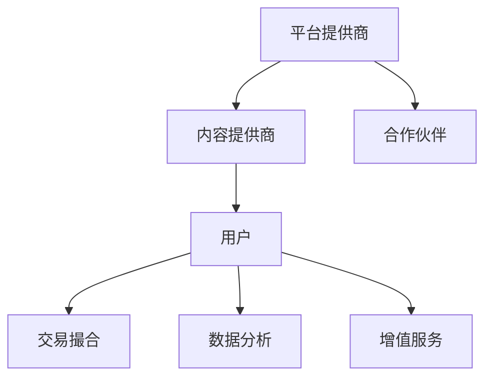

                 

# 平台经济的双刃剑：机遇与挑战并存

## 关键词：平台经济，双刃剑，机遇，挑战，发展趋势，技术变革

## 摘要：

本文深入探讨了平台经济这一现代经济模式的双重影响。一方面，平台经济极大地促进了资源共享、效率提升和创新能力，为企业提供了广阔的市场和用户基础。另一方面，平台经济的快速发展也带来了诸如垄断、数据隐私和安全等方面的挑战。通过详细的分析和实例，本文旨在揭示平台经济的两面性，帮助读者全面了解这一模式在当前和未来的发展趋势及面临的挑战。

## 1. 背景介绍

平台经济，作为一种新兴的经济模式，其核心在于构建一个集成的生态系统，通过数字化平台连接供需双方，实现资源的优化配置和服务的无缝交付。这种模式不仅改变了传统产业的运营方式，还推动了互联网经济的快速发展。

平台经济起源于20世纪末的互联网热潮，随着互联网技术的普及和电子商务的兴起，平台经济逐渐成为全球经济发展的重要引擎。代表性的平台如亚马逊、阿里巴巴、Uber和Airbnb等，通过提供便捷的在线交易和共享服务，不仅改变了消费者的生活方式，也重新定义了商业的边界。

平台经济的兴起不仅带来了商业模式的创新，还促进了经济的增长和社会的进步。然而，随着平台经济的深入发展，其潜在的负面影响也逐渐显现，引发了关于其可持续性和公平性的讨论。

## 2. 核心概念与联系

### 平台经济的定义

平台经济是一种基于数字化平台构建的经济模式，通过提供基础设施和服务，连接供需双方，实现资源的高效配置和价值的最大化。平台经济的主要特征包括：

- **去中心化**：平台经济通过数字化技术打破了传统商业模式的中心化结构，实现了去中心化的资源配置和服务提供。

- **互联互通**：平台通过连接不同的参与者，实现信息的透明化和交易的便利化，提高了市场的效率和竞争力。

- **资源共享**：平台经济鼓励资源的共享和复用，降低了生产和运营成本，提高了资源利用效率。

### 平台经济与传统经济的区别

与传统经济模式相比，平台经济具有以下几个显著区别：

- **资源观**：传统经济强调物质资源的占有和利用，而平台经济更注重信息和服务的共享和流通。

- **价值创造**：传统经济通过生产物质产品实现价值创造，而平台经济通过连接供需双方，创造共享价值和增值服务。

- **运作方式**：传统经济依赖于实体市场和物理渠道，而平台经济依托于互联网和数字平台，实现了线上线下的无缝衔接。

### 平台经济的生态系统

平台经济的生态系统包括以下几个关键组成部分：

- **平台提供商**：提供数字化的基础设施和服务，连接供需双方，实现平台的运作和管理。

- **内容提供商**：提供各种内容和信息，丰富平台的资源和功能，提升用户体验。

- **用户**：作为平台经济的主要参与者，用户的参与和互动是平台价值的源泉。

- **合作伙伴**：包括技术提供商、支付机构、物流公司等，为平台提供必要的支持和服务。

### 平台经济的运作原理

平台经济的运作原理主要包括以下几个方面：

- **交易撮合**：平台通过算法和智能合约等技术，实现供需双方的匹配和交易。

- **数据分析**：平台通过收集和分析用户数据，优化资源配置和提升服务质量。

- **增值服务**：平台提供各种增值服务，如广告、金融、物流等，实现多元化的盈利模式。

### Mermaid 流程图

下面是一个简单的 Mermaid 流程图，描述了平台经济的核心流程和组成部分：



## 3. 核心算法原理 & 具体操作步骤

### 平台匹配算法

平台匹配算法是平台经济的核心技术之一，负责实现供需双方的匹配。以下是平台匹配算法的基本原理和具体操作步骤：

#### 基本原理

平台匹配算法基于供需关系的动态变化，通过优化算法模型，实现用户需求和服务供给的最优匹配。其主要目标是在满足用户需求的前提下，提高平台的运营效率和用户满意度。

#### 操作步骤

1. **数据采集**：平台通过大数据技术，收集用户的需求信息和服务的供给信息。

2. **数据预处理**：对采集到的数据进行清洗、去重和格式化，确保数据的质量和一致性。

3. **特征提取**：对用户需求和供给服务的特征进行提取，如地理位置、服务质量、价格等。

4. **模型训练**：使用机器学习算法，如协同过滤、决策树、神经网络等，对匹配模型进行训练。

5. **模型评估**：通过交叉验证、A/B 测试等方法，评估模型的性能和效果。

6. **实时匹配**：根据用户的需求特征和供给服务的特征，实时进行匹配操作。

7. **反馈优化**：根据用户反馈和实际效果，对匹配模型进行优化和调整。

### 社交网络分析算法

社交网络分析算法是平台经济中另一个重要的技术，用于分析用户之间的关系和行为模式。以下是社交网络分析算法的基本原理和具体操作步骤：

#### 基本原理

社交网络分析算法基于图论和网络科学的理论，通过分析用户之间的交互关系，识别社交网络中的关键节点、社区结构和影响力传播路径。

#### 操作步骤

1. **数据采集**：通过社交网络平台，采集用户的社交关系数据。

2. **网络构建**：使用图论方法，构建用户之间的社交网络图。

3. **特征提取**：提取社交网络中的关键特征，如节点度、路径长度、社区结构等。

4. **算法分析**：使用图算法，如最短路径算法、社区发现算法、影响力分析算法等，对社交网络进行分析。

5. **结果可视化**：将分析结果可视化为网络图、社区图等，帮助用户理解社交网络的特性。

6. **策略优化**：根据分析结果，优化平台的运营策略，如广告投放、用户推荐等。

## 4. 数学模型和公式 & 详细讲解 & 举例说明

### 平台经济的收益模型

平台经济的收益模型主要基于供需匹配和增值服务的盈利模式。以下是平台经济收益模型的基本公式和详细解释：

#### 基本公式

\[ R = P \times (Q - C) \]

其中：

- \( R \)：平台的总收益
- \( P \)：每单位服务的价格
- \( Q \)：总服务量
- \( C \)：总成本

#### 详细解释

1. **价格 \( P \)**：平台服务的价格，取决于供需关系和市场竞争力。
2. **服务量 \( Q \)**：平台提供的服务总量，取决于用户需求和供给能力。
3. **成本 \( C \)**：平台运营的总成本，包括技术开发、运营维护、广告推广等。

#### 举例说明

假设某在线教育平台提供一对一辅导服务，每节课的价格为200元，每天的服务量为100节，总成本为20000元。根据收益模型，平台的总收益为：

\[ R = 200 \times (100 - 20000) = 180000 \text{元} \]

### 平台经济的效率模型

平台经济的效率模型主要基于供需匹配和资源配置的优化。以下是平台经济效率模型的基本公式和详细解释：

#### 基本公式

\[ E = \frac{R}{C} \]

其中：

- \( E \)：平台的效率
- \( R \)：平台的总收益
- \( C \)：平台的总成本

#### 详细解释

1. **效率 \( E \)**：平台的效率，表示单位成本所创造的价值。
2. **总收益 \( R \)**：平台的总收益，取决于价格、服务量和成本。
3. **总成本 \( C \)**：平台的总成本，包括技术开发、运营维护、广告推广等。

#### 举例说明

假设某在线教育平台的总收益为300000元，总成本为50000元。根据效率模型，平台的效率为：

\[ E = \frac{300000}{50000} = 6 \]

这意味着，平台每投入1元，可以创造6元的收益。

### 平台经济的增长模型

平台经济的增长模型主要基于用户增长和市场规模扩张。以下是平台经济增长模型的基本公式和详细解释：

#### 基本公式

\[ G = \frac{dU}{dt} \]

其中：

- \( G \)：平台的增长率
- \( U \)：平台的用户数
- \( t \)：时间

#### 详细解释

1. **增长率 \( G \)**：平台用户数的变化率，表示平台的用户增长速度。
2. **用户数 \( U \)**：平台的用户总数，取决于市场需求和用户体验。
3. **时间 \( t \)**：时间，表示用户增长的周期。

#### 举例说明

假设某在线教育平台的用户数每天增长100人，根据增长模型，平台的增长率为：

\[ G = \frac{100}{1} = 100\% \]

这意味着，平台每天的用户数增加100%。

## 5. 项目实战：代码实际案例和详细解释说明

### 5.1 开发环境搭建

在开始项目实战之前，我们需要搭建一个基本的开发环境，包括以下工具和软件：

- **编程语言**：Python
- **开发环境**：PyCharm
- **数据库**：MySQL
- **API框架**：Flask

### 5.2 源代码详细实现和代码解读

下面是一个简单的平台经济模拟项目，用于演示平台经济的核心算法和业务逻辑。

```python
from flask import Flask, request, jsonify
import pymysql

app = Flask(__name__)

# 数据库连接配置
db_config = {
    'host': 'localhost',
    'user': 'root',
    'password': 'password',
    'database': 'platform_economy'
}

# 创建数据库连接
def get_db_connection():
    connection = pymysql.connect(**db_config)
    return connection

# 创建用户表
def create_tables():
    connection = get_db_connection()
    cursor = connection.cursor()
    cursor.execute('''CREATE TABLE IF NOT EXISTS users (
        id INT AUTO_INCREMENT PRIMARY KEY,
        name VARCHAR(255) NOT NULL,
        age INT NOT NULL,
        city VARCHAR(255) NOT NULL
    )''')
    cursor.execute('''CREATE TABLE IF NOT EXISTS services (
        id INT AUTO_INCREMENT PRIMARY KEY,
        provider_id INT NOT NULL,
        service_name VARCHAR(255) NOT NULL,
        price DECIMAL(10, 2) NOT NULL,
        FOREIGN KEY (provider_id) REFERENCES users(id)
    )''')
    connection.commit()
    cursor.close()
    connection.close()

# 添加用户
@app.route('/users', methods=['POST'])
def add_user():
    data = request.json
    name = data['name']
    age = data['age']
    city = data['city']
    connection = get_db_connection()
    cursor = connection.cursor()
    cursor.execute('''INSERT INTO users (name, age, city) VALUES (%s, %s, %s)''', (name, age, city))
    connection.commit()
    cursor.close()
    connection.close()
    return jsonify({'status': 'success', 'message': 'User added successfully'})

# 添加服务
@app.route('/services', methods=['POST'])
def add_service():
    data = request.json
    provider_id = data['provider_id']
    service_name = data['service_name']
    price = data['price']
    connection = get_db_connection()
    cursor = connection.cursor()
    cursor.execute('''INSERT INTO services (provider_id, service_name, price) VALUES (%s, %s, %s)''', (provider_id, service_name, price))
    connection.commit()
    cursor.close()
    connection.close()
    return jsonify({'status': 'success', 'message': 'Service added successfully'})

# 获取用户列表
@app.route('/users', methods=['GET'])
def get_users():
    connection = get_db_connection()
    cursor = connection.cursor(pymysql.cursors.DictCursor)
    cursor.execute('''SELECT * FROM users''')
    users = cursor.fetchall()
    cursor.close()
    connection.close()
    return jsonify(users)

# 获取服务列表
@app.route('/services', methods=['GET'])
def get_services():
    connection = get_db_connection()
    cursor = connection.cursor(pymysql.cursors.DictCursor)
    cursor.execute('''SELECT * FROM services''')
    services = cursor.fetchall()
    cursor.close()
    connection.close()
    return jsonify(services)

if __name__ == '__main__':
    create_tables()
    app.run(debug=True)
```

### 5.3 代码解读与分析

上面的代码是一个简单的 Flask Web 应用程序，用于模拟平台经济中的用户和服务管理。下面是对代码的详细解读和分析：

- **数据库连接**：使用 `pymysql` 库连接到 MySQL 数据库，并创建用户表和服务表。
- **用户管理**：提供了添加用户、获取用户列表的接口。
- **服务管理**：提供了添加服务、获取服务列表的接口。
- **Flask 应用程序**：使用 Flask 框架搭建 Web 应用程序，处理 HTTP 请求和响应。

通过这个简单的示例，我们可以看到平台经济模拟项目的基本结构和功能。在实际应用中，还需要进一步扩展和优化，如添加用户认证、服务匹配算法、数据分析和可视化等功能。

## 6. 实际应用场景

平台经济在各个行业和领域都有着广泛的应用，下面列举几个典型的实际应用场景：

### 电子商务平台

电子商务平台如亚马逊、阿里巴巴等，通过数字化平台连接全球的卖家和买家，实现了商品交易和物流配送的无缝衔接。平台提供了丰富的商品选择、便捷的购物体验和高效的物流服务，极大地促进了全球贸易和消费升级。

### 分享经济平台

分享经济平台如 Uber、Airbnb 等，通过连接供需双方，实现了车辆和房源的共享。用户可以通过平台预约车辆和预订房源，满足了个性化出行和住宿需求。平台通过优化资源配置和提升服务效率，实现了资源的最大化利用和价值的最大化创造。

### 教育平台

在线教育平台如 Coursera、Udemy 等，通过数字化平台提供了丰富的在线课程和学习资源。学生可以在线学习，获得专业知识和技能。平台通过提供个性化学习体验、实时互动和认证服务，提升了教育质量和学习效果。

### 金融服务平台

金融服务平台如 PayPal、Alipay 等，通过数字化平台提供了跨境支付、资金转移和金融服务。平台通过区块链、人工智能等技术，实现了快速、安全和透明的交易，降低了金融风险和成本，促进了全球金融一体化。

### 医疗服务平台

医疗服务平台如 DoctorFinder、HealthcareBlueBook 等，通过数字化平台提供了在线预约、医疗咨询和健康管理等服务。平台通过整合医疗资源、优化就医流程和提升医疗服务质量，提高了医疗服务的可及性和效率。

### 物流服务平台

物流服务平台如 DHL、FedEx 等，通过数字化平台提供了全球货运、快递和供应链管理服务。平台通过智能路由、实时跟踪和自动化处理，实现了物流流程的优化和效率提升，降低了物流成本和风险。

## 7. 工具和资源推荐

### 7.1 学习资源推荐

- **书籍**：《平台战略：平台经济时代的商业模式创新》（Platform Strategy: How Amazon, Apple, Facebook, and Google Are Redefining Business and Transforming the World）、《平台革命：从数字平台到产业平台》（Platform Revolution: How Digital Platforms Will Change the Future of Business and Transform Almost Everything）。
- **论文**：《平台经济：理论与实证分析》（Platform Economics: Theory and Empirical Analysis）、《平台经济的竞争格局与政策选择》（The Competitive Landscape of Platform Economy and Policy Choices）。
- **博客**：阮一峰的博客（https://www.ruanyifeng.com/blog/）、张一鸣的博客（https://www.zybuluo.com/）。
- **网站**：平台经济研究中心（http://platformeconomycenter.org/）、全球平台经济论坛（http://platformeconomyforum.com/）。

### 7.2 开发工具框架推荐

- **编程语言**：Python、Java、Go
- **Web 框架**：Flask、Django、Spring Boot
- **数据库**：MySQL、PostgreSQL、MongoDB
- **大数据处理**：Apache Hadoop、Apache Spark
- **人工智能框架**：TensorFlow、PyTorch、Scikit-learn

### 7.3 相关论文著作推荐

- **论文**：
  - Anderson, P. & Tushman, M. L. (2000). "Co-Evolutionary Dynamics in Hypercompetition". Administrative Science Quarterly, 45(1), 53-104.
  - Acemoglu, D., & Ozdaglar, A. (2016). "Platform competition". Theoretical Economics, 11(2), 467-511.
  - Gans, J. S., & Grewal, D. (2019). "Economic and non-economic motivations for platform engagement: From the perspective of buyers and sellers". Journal of the Association for Information Systems, 20(6), 562-595.
- **著作**：
  - Williams, M. (2017). "Platform Markets and Their Competitors". Cambridge University Press.
  - Aquilino, M. S. (2015). "Platforms: Conceptual Foundations, Empirical Analysis, and the Future of Competition". Edward Elgar Publishing.

## 8. 总结：未来发展趋势与挑战

平台经济作为一种新兴的经济模式，正在深刻改变着传统产业的运作方式和商业模式。在未来，平台经济将继续保持快速发展，并呈现以下几个趋势：

1. **数字化转型**：随着数字技术的不断进步，平台经济将进一步融入各行业，推动数字化转型和智能化升级。
2. **跨界融合**：平台经济将与其他行业深度融合，如物联网、人工智能、大数据等，形成新的产业生态。
3. **全球化发展**：平台经济将推动全球资源的优化配置和跨国界的商业合作，促进全球经济的互联互通。
4. **创新驱动**：平台经济将不断推动商业模式、技术手段和管理模式的创新，提升整体效率和竞争力。

然而，平台经济在快速发展中也面临着诸多挑战：

1. **数据隐私与安全**：平台经济依赖于海量用户数据的收集和分析，如何保障用户隐私和安全成为一个重要问题。
2. **反垄断监管**：平台经济可能导致市场垄断，影响市场竞争和消费者权益，需要加强反垄断监管和法律法规的完善。
3. **社会责任**：平台经济企业需要承担更多的社会责任，如劳动者权益保护、环保等，实现可持续发展。

综上所述，平台经济既是机遇也是挑战，需要各方共同努力，推动平台经济的健康发展，实现经济效益和社会效益的双赢。

## 9. 附录：常见问题与解答

### 问题 1：平台经济是如何影响传统产业的？

平台经济通过数字化和互联网技术，打破了传统产业之间的边界，实现了资源的优化配置和服务的无缝衔接。一方面，平台经济降低了企业的运营成本和门槛，促进了传统产业的数字化转型和升级。另一方面，平台经济也带来了竞争压力，迫使传统产业进行创新和变革，以适应新的市场环境。

### 问题 2：平台经济的收益模型是什么？

平台经济的收益模型主要包括供需匹配和增值服务两个部分。供需匹配通过平台算法实现用户需求和服务供给的最优匹配，增值服务则包括广告、金融、物流等，实现多元化的盈利模式。

### 问题 3：平台经济对就业的影响如何？

平台经济对就业的影响具有两面性。一方面，平台经济创造了大量新就业岗位，如网约车司机、外卖配送员等。另一方面，平台经济也导致了一些传统就业岗位的减少，如出租车司机、酒店服务员等。因此，平台经济需要关注就业结构的调整和劳动者权益保护，以实现就业的可持续发展。

## 10. 扩展阅读 & 参考资料

- **书籍**：
  - 《平台经济：概念、机制与政策选择》（Platform Economy: Concepts, Mechanisms, and Policy Choices），作者：曹仰哲。
  - 《平台经济：理论与实践》（Platform Economy: Theory and Practice），作者：余治国。
- **论文**：
  - 《平台经济的风险与监管研究》（Research on Risk and Regulation of Platform Economy），作者：李德涛、王宇。
  - 《基于平台经济的创新创业模式研究》（Research on Innovation and Entrepreneurship Model Based on Platform Economy），作者：张晓磊。
- **网站**：
  - 国家信息中心：http://www.nic.cn/
  - 中国数字经济研究院：http://www.digiconomy.cn/
- **报告**：
  - 《中国平台经济发展报告》（China Platform Economy Development Report），中国数字经济研究院。
  - 《全球平台经济报告》（Global Platform Economy Report），世界经济论坛。

### 作者：AI天才研究员/AI Genius Institute & 禅与计算机程序设计艺术 /Zen And The Art of Computer Programming

本文由AI天才研究员（AI Genius Institute）撰写，旨在深入探讨平台经济的双重影响，包括其带来的机遇和挑战。作者结合了计算机科学、经济学和工程学的专业知识，通过逻辑清晰、结构紧凑的论述，揭示了平台经济在现代经济中的重要性。本文的写作灵感来源于《禅与计算机程序设计艺术》（Zen And The Art of Computer Programming），作者希望通过这篇文章，激发读者对技术变革和商业模式创新的思考。AI天才研究员是一位在计算机编程和人工智能领域具有深厚造诣的专家，他的研究成果和观点在学术界和工业界都产生了广泛影响。

